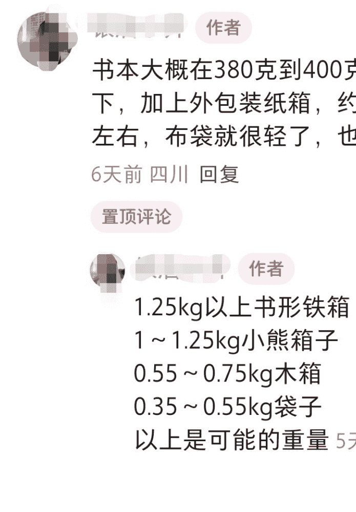
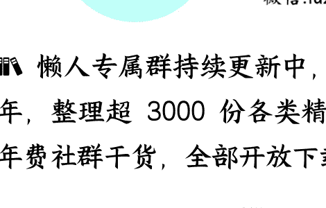

# 消费小趋势：窝囊也是购买力

> 2025-09-01《蔡钰 · 商业参考 4》节选

整理：公众号“懒人搜索”，_懒人专属群_ 独享

懒人微信：lazyhelper

这个夏天，你有没有出去玩？这一讲，我们来聊聊 2025 年暑期的消费小趋势。

我因为膝盖的旧伤不能爬山，又要独自一人扶老携幼，所以安排了一趟游轮之旅，让家人在船上吃喝玩乐拍照，我缩在小包间里写专栏，什么也没耽误。

结果隔了几周我发现，自己无意中踩中了今年的一种流行玩法：窝囊旅游。

## 窝囊游

窝囊旅游，区别于前两年高能耗的特种兵旅游，但又不是去鹤岗住酒店、逛小城市菜市场那么躺平，而是寻求用一种安全、稳妥、松弛的玩法来体验山野溪流、自然户外，主打一个“运动了，又好像没动”。

过去两个月，窝囊游里有三个子类目，被不少景区、放暑假和休年假的年轻人们合谋，玩成了网红。

- **第一种，窝囊爬山。**
  
  什么意思？指的是景区沿着山坡装电梯，让游客几分钟直接抵达山顶，“山一步没爬，景一处没落”。

  拿浙江来说，天屿山、神仙居、白云山景区都安装了上下山的扶梯，游客站在扶梯上，一路观景，一路就登上了山巅，对老人、小孩和短腿宠物狗极其友好。扶梯两侧还时不时喷洒水雾，让游客觉得自己有了仙侠身份，在御剑飞行。

  类似的玩法，全国各地的景区也都安排上了。我所在的柳州，城中有一座马鞍山，因为山势陡峭，干脆安装的是两部直梯，在山体内部掏了个洞，既当人防工事，也当“电梯间”。

- **第二种，慢速蹦极。**
  
  有多慢？比窝囊爬山的电梯速度还慢。这种蹦极也同样设立在山崖边，但跟传统蹦极不同的是，游客只负责微微一跳，头顶的绳索和定滑轮会牢牢拽住你，像捏着一个易碎品那样，轻拿轻放地匀速落到山崖之下。人的下降过程因为是缓慢而稳定的，所以完全不会有失重带来的惊慌和难受

可以松弛自如地看风景，甚至在半空来张自拍。因为足够安全，这种窝囊蹦极也没有传统那种“18 岁以上”之类的年龄限制。

这种玩法的首创者，最早应该是浙江湖州的一个叫云上草原的景区。它推出窝囊蹦极后，尝试蹦极的游客数量翻了 5-6 倍。这个人气被越来越多的人发现之后，东北、浙江、广东、安徽、湖北等不少地方的景区也效仿上了。

类似的玩法还有一种“窝囊过山车”。核心原理跟慢速蹦极相似，用电机稳稳控制住过山车的行驶速度，让你即便在俯冲过程中，也能缓慢匀速、平稳淡定地观景。

- **第三种，窝囊漂流。**
  
  窝囊漂流，在广西、江西很流行。

  漂流我们知道，按惯例都是要坐在气垫船里，感受激流的惊险与刺激，是要做好呛水和磕碰的心理准备的。但窝囊漂流，是穿好救生衣、戴好安全帽，直接躺进流速缓慢的浅浅小河里，望着青山蓝天白云，从上游徐徐漂到下游。过程中，你可以划水摸鱼，也可以从容地拉着朋友摆各种造型，等无人机给你拍照。如果你不希望弄湿衣裳，老板甚至还会给你一块巨大的漂浮毯。

  桂林的猫儿山景区 6 月份开始推出“窝囊漂流”，此后日均接待游客量就比传统漂流增长了 30%。其中，亲子群体占比超 60%，暑期周末的排队等待时间动不动就 1 小时起，单月带动景区整体客流提升了 25%。

## **体育外卖**

说完了旅游，再来看一种同样低功耗的上门消费：体育外卖。

体育外卖不是暑假才流行起来的，你如果看过我和罗振宇老师、脱不花在 2025 年春天的一场直播聊天，就肯定记得，当时我们聊起过一种生活服务叫“上门体能教练”：不少体校大学生或中小学的体育老师，在业余时间把自己挂到了闲鱼、小红书，甚至自己开发的小程序上，接单上门陪孩子玩各种体育活动、训练体能，一节课收费 200 到 300，小孩能有人带着玩儿，能提升身体素养，能提高体育考试的成绩，家长也能腾出手来喘口气。

我家娃上学期间，每周也有一天会跟几个同学一起，和体能教练到学校附近的小公园追逐打闹一阵子，把活动和社交都实现了。

而等到了这个暑假，上门体能教练这个行当，“嗡”地一下繁荣起来，下沉到了二三四线的各个城市。我这两个月穿梭在几个城市的新老城区之间，总能在小区的空地上，看见有年轻人带着几个半大的孩子，在煞有介事地跳绳、往返跑或练习投篮。旁边要么坐着几个如释重负的家长，要么干脆没有家长。

在社交网络和家长群当中，上门体能教练也有了个更加接地气的名字：体育外卖。

再一查数据：

2025 年，中国体育培训市场规模将突破 3000 亿元，其中青少年市场，按照 2023 年的占比 60% 计算，达到了 1800 亿元。而其中的上门私教模式，在 2025 年的市场规模，又眼看要突破 150 亿元。

为什么体育外卖，会在青少年市场做大？

- 一来，在暑假里，孩子们的精力跟爸妈们的班味儿对不齐；
- 二来，这几年教育系统的体育改革，中考体育分占到了 60 分，有些考试项目还颇有难度；
- 三来，体育外卖是上门服务，按次计费，随约随用，比传统的体育场、健身馆要更有性价比。

教练和培训机构们只需要拍几个视频，起一个叫“中考体育满分技巧”“中考跳远提升 60 厘米”之类的名字，在抖音上往自己的社区附近投流，就能坐等家长们私信咨询。

谁能想到呢？2025 年外卖大战当中，最大的赢家竟然是体育外卖。有一个叫“小学体育老师资源库”的公众号，干脆把体育外卖当作 2025 年副业方向，推荐给了全国的体育老师们。

这个行业，也已经开始出现平台型创业公司。湖南的“童行家门口体育”，2024 年以来已经用加盟模式覆盖了全国 70 多个城市的 4000 多个小区，号称估值达到了 1.2 亿。

北京的“乐时运动”也是 2024 年底开始运行，眼下已经号称拥有 20 万用户和 3000 多名专业教练，覆盖了全国 100 多个城市。南宁理工学院社会体育专业有个学生，暑假刚开始时，在乐时运动注册了教练身份，7 月份赚了接近 7000 块钱。

## **薅骗子羊毛**

第三种我要跟你聊的消费小趋势，很难概括，我们姑且叫它“反诈消费”吧。

怎么个意思呢？

年轻的羊毛党们，在这个暑假，把自己旺盛的精力，用在了破解一种新型网络骗局之上。

2025 年上半年，一些电商直播间里出现了一种新型套路：主播用低得离谱的价格卖书，通常是经典名著，定价不到两块钱，正版，还包邮，吸引用户下单。

骗子是只骗你两块钱吗？不是，你付了钱，书还真的寄给你了。只不过，你买的书被所在一个很精巧的密码箱里。箱子上贴着个二维码，旁边写着提示：扫码领取密码，读书会老师定期给你分享独家干货。

切换到普通民众视角，大家第一反应更多是，这个密码箱，比里面那本书还要贵重。买椟还珠大家都学过，眼下商家把椟和珠都送到你面前了。不扫码，连书也拿不到；而一扫码，书和箱子就都是你的。这谁忍得住？

等等，忍不住，就中招了。因为二维码通往的链接，要么是某个电商的私域引流，要么是诱导你填写私人信息、诱导你掏钱的骗局入口。前几个月，不少中老年人都被这么套路过。

一到暑假，放假回家的子女们听说了事情原委，很快把“买书送箱”的套路发到了网上。

这些帖子不发不要紧，一发，扭转了套路的整个走向：

- 首先，家里做箱子的厂二代们站出来了，把通用的开箱技巧也发到了网上。这让已经收到箱子的网友，不用扫码也顺利打开了“宝箱”。
- 其次，这让没有中招的网友开始觉得，“是不是有什么便宜我没占到？”一时间，在曝光骗局和教开箱的教程评论区里，网友们开始拷问：骗子的道德在哪里？底线在哪里？购买链接又在哪里？

防诈反诈交流会，突变成了团购带货现场，很快把最有名的几家套路书店，给薅干净了。

网友们还不满足，又开始了主动挖掘，开始整理“寻找套路书商”的攻略：

- 比如，主播卖的书，最好是炒股、养生的；
- 再比如，卖家账号得是新号，金牌、银牌店铺都不行；
- 而且，卖家店铺里的商品不能超过 4 件；
- 还有，图书定价得在 1 到 4.8 元钱，否则可能真是正经卖书的。

小红书上还有人教：不能问客服送不送箱子，你一问他就知道你懂行，就不送了。

一时间，这样的直播间里涌进了大量来买便宜箱子的年轻人，把书和箱子薅得干干净净。

等到书商那边发现不对劲，箱子库存已经不剩多少了。于是，书商们开始选择性发货，有的快递只发书、不发密码箱。

这个变化，又让暑假羊毛党们想出了新的应对方法：根据快递重量来预判有没有密码箱。如果快递包裹轻飘飘，不像是有密码箱的样子，就直接拒收。

你看，“解锁套路”愣是被网友们玩成了“赛博赌石”。我贴个截图在文中，让你看看他们有多专业。

到了这里，买书送箱这个套路，基本上是被玩坏了。而很多正经书商，也不得不在图书标题页写明“不送箱子”，来劝退羊毛党们。
不得不说明，这种反诈消费，也算是邪修的一种了。

## **总结**

以上，是 2025 年 8 月，我邀请你关注的消费小趋势：窝囊旅游、体育外卖、反诈消费。你看，人们仍然是走在 2022 年以来“该省省、该花花，该歇歇、该玩玩”的消费路径上。

请教你，你觉得这几个小趋势里，体现了人们怎样的需求共性或差异？期待你的思考。

最后，安利小懒的付费群：懒人专属群

💡 懒人专属群持续更新中，已持续运营 6 年，整理超 3000 份各类精选付费文章 & 年费社群干货，全部开放下载。

本资料为付费群内部分享，仅供真实需要的朋友查阅 🙇‍♂️

懒人专属群更新记录：
[https://lazy2025.top/blog/record2](https://lazy2025.top/blog/record2)

懒人专属群更新记录（需梯子，备用）：
[https://lazybook.fun/blog/record2](https://lazybook.fun/blog/record2)