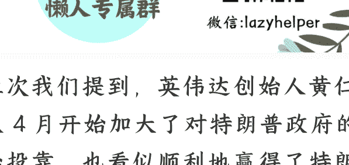

## 特朗普的心愿单：美国特色资本主义

2025 年 09 月 01 日《蔡钰·商业参考 4》节选

整理：公众号懒人搜索，懒人专属群独享

懒人微信：lazyhelper

上次我们提到，英伟达创始人黄仁勋从 4 月开始加大了对特朗普政府的政治投靠，也看似顺利地赢得了特朗普的欢心。

但切换到特朗普的角度，同样的线索还可以组织成另外一套叙事逻辑。

### 出题人特朗普

你看啊，黄仁勋确实在 4 月份开始有了政治投靠的觉悟，但这从特朗普的商务部长指点他开始的，随后他才有了去海湖庄园示好的行动，也有机会跟特朗普的“加密沙皇”一拍即合。

到了 7 月份，在英伟达拿到 H20 对华销售许可的同时，另一家芯片大厂 AMD 也拿到了类似的许可。

在黄仁勋来中国参加链博会之前，特朗普就已经签发了一份《AI 行动计划》，以美国政府的名义，来给整个美国 AI 产业的战略发展做规划。主要包括，推动数据中心建设，废除对 AI 行业太严厉的监管，鼓励美国的 AI 技术出口，等等等等。如果你往回翻翻咱们专栏的第 34 讲 (《山姆·奥特曼：AI 产业的演化进程与决胜关键》)，你会发现，这恰好是 5 月份 OpenAI 的联合创始人山姆·奥特曼、AMD 董事长兼 CEO 苏姿丰等人努力说服美国国会的议题。

啥意思？黄仁勋努力争取来的不是“特许资质”，而是特朗普政府原本计划当中的一环。

另一个证据是，黄仁勋虽然早早宣称 H20 芯片的禁售被解除了，但美国政府其实一直拖延发证。直到他 8 月 6 日再度跟白宫交涉，才在 8 月 8 日正式获得许可证。

而他拿到许可证的同时，海外有媒体披露，英伟达还付出了一个代价：跟美国政府达成了一项特殊安排，要对美国政府上缴在华芯片销售收入的 15%。

请注意，特朗普政府要拿走的，是销售收入的 15%，而不是净利润的 15%。境外有分析师估算，英伟达 2025 年 H20 在华销量可能达到 150 万片，对应收入 230 亿美元。15% 也就是大约 35 亿美元。

同样被要求缴纳 15% 收入分成，来换取跟中国的生意许可的，还有 AMD。

你再想想，此前黄仁勋许诺给美国的 5000 亿美元的 AI 基建投资，和给中东沙特的 500 兆瓦 AI 基建投资，是不是也像在一路回答特朗普出的好题。

### 与库克交手

被特朗普用来填心愿单的，并不只黄仁勋和英伟达一家。你还记得他在中东对着黄仁勋敲打苹果董事长库克吗？

5 月 13 日，在沙特首都利雅得，特朗普在沙特美国投资论坛上赞赏黄仁勋，同时点名了库克。他说：“我看到我的朋友黄仁勋在这里……蒂姆·库克不在这儿，但你在。”

把这句话想得严重点儿，意思近似于“库克不是我的朋友”了。为什么突然点名库克？美国媒体有报道说，特朗普此前邀约了一批硅谷企业家共同出访中东，其中也包括库克，其他 CEO 纷纷捧场，库克却拒绝了。这让他相当不满。

随后到了卡塔尔，特朗普又当众说：“我昨天和蒂姆·库克有点问题。”他接着强调：“我不想让你（库克）在印度建厂。……印度可以自己照顾自己，但我们希望在你这里建造。”“我对你很好，我们忍受了你多年来在中国建厂。现在你得给我们建造。”

这话一说，有点新仇旧恨的意思了：你不光不陪我去中东搞单子，还不肯把工作岗位搬回美国！

这具体指的是什么呢？指的是苹果把 iPhone 的装配和供应链往印度迁移，来规避中国供应链的高关税风险的行动。中美关税战 4 月份打响之时，美国政府对印度进口商品征收的关税税率是 26%，远低于中国当时面临的超过 100% 的关税。

也就在 4 月份，英国《金融时报》打探到消息说，苹果计划在印度建厂，目标是到 2026 年底，大部分供应美国的 iPhone 订单都交给印度生产。什么概念？苹果每年在美国销售超过 6000 万部 iPhone，80% 是中国制造的。你收中国高关税，我就转到低关税的印度，即便成本比中国制造高点儿，也比转回本国本土划算。

这让特朗普相当不满。5 月底，他从中东回到华盛顿召开记者会时，又直接放话说，“我们要这些 iPhone 在美国制造，而不是在印度......如果它们是在印度制造，那就会有 25% 的关税。”

这话说的，已经是把苹果当作“样板”，来给出关税政策框架下的一个公开警告了。

苹果什么反应？当然也是低头认怂。8 月 6 日这天，苹果做了两件大事：

第一件，公开宣布了一项“美国制造计划”，要把对美国制造业的投资规模从早前承诺的 5000 亿美元增加到 6000 亿，还要在未来四年内雇用 2 万名美国工人。为什么定在 4 年？4 年恰好对应了特朗普这个任期的未来持续时间。

第二件，库克亲自送给特朗普本人一块美国制造的康宁玻璃，暗示苹果将配合特朗普的产业回流大计，也展示双方的关系“缓和”。库克说，很快，所有 iPhone 和 Apple Watch 的盖板玻璃将 100% 在美国制造。

从工艺上看，这块玻璃平平无奇，但它的底座，是一块又大又重的 24K 黄金。

特朗普赞扬了库克，并告诉媒体：

“对于像苹果这样的公司来说，好消息是，如果你在美国建造或已经承诺在美国建造，毫无疑问，将不收取任何费用。”

到这里，苹果也算是挽回了跟特朗普的关系。也就在这同一天，特朗普将美国对印度的普遍关税从 25% 提高到 50%，但苹果得到了豁免。

库克送出一份礼物，带走了 25% 到 50% 的印度关税豁免。而特朗普什么也没有付出，就拿到了心愿单上的两份奖品。

### 与陈立武交手

事情还没完。就在跟英伟达、苹果博弈的同一时期，特朗普还把这套“交易的艺术”施展到了英特尔身上。

在他跟库克握手言和的第二天，8 月 7 日一早，就在自家的社交网络上，点名要求英特尔的 CEO 辞职。他是这么说的：“英特尔的 CEO 存在严重的利益冲突，必须立即辞职。这个问题没有其他解决办法。”

他这话一说，英特尔盘前股价应声下落 4%。

这说的是什么利益冲突呢？英特尔现任 CEO 名叫陈立武，是个美籍马来西亚华裔。美国一些议员指控他在加入英特尔前，曾投资过上百家中国科技公司，其中部分与军方关系敏感。

但冲突细节并不重要。因为很快，陈立武求见了特朗普，特朗普就改口了。他在指控陈立武的 4 天后，再次发帖说：“我跟英特尔公司的陈立武、商务部长鲁特尼克和财政部长贝森特会面。这次会面非常有趣。他的成功和崛起堪称传奇。陈先生和我的内阁成员下周将共同商讨，并向我提出建议。”

这话一说，英特尔股价又急转直上。

怎么实现的画风急转？

到了 8 月 22 日，答案出来了：英特尔把公司 9.9% 的股权出售给美国联邦政府。这次股权价值大概 110 亿美元，直接用英特尔从美国《芯片法案》得到的补贴抵扣。特朗普特意发帖说，美国政府不用为股权支付任何费用。

### 心愿单与美国特色资本主义

我们在第 7 讲说，特朗普第二任期，最操心的头三件事分别是：

- 一，选民支持率的下滑；
- 二，美债泡沫破灭；
- 三，美国产业空心化。

这三件事的排序目前仍然有效。我们可以认为，对抗和削减这三类风险，就是他当前心愿单上的前三条。

如果你关注美国社会的动向，你可能会注意到，特朗普过去几个月，非常在意一些舆情对他声望的打击，比如 TACO 外号、爱泼斯坦议题等等，一定要亲自反驳。他 8 月份跟俄罗斯总统普京会面，转头就开心地告诉媒体，普京认为要是特朗普在上一届也是总统，俄乌战争就不会发生。——你看，这都是在对抗支持率下滑的风险，维护选民对他的信心。

而他对英伟达、苹果和英特尔的要求，恰好又在对抗第二和第三项风险，一边用销售许可来换收入分成，增加美国财政收入、填补美债窟窿；一边用英伟达的巨额投资来重振美国的实体产业竞争力。

而要是把特朗普的这套策略再往前推一步，还真有点像去年加密平台 BitMEX 的联合创始人 Arthur Hayes 提出的那个观点：特朗普上任后，可能会推动“具有中国特色的美国资本主义”。

到了 2025 年 8 月，《华尔街日报》又说，美国还没有走到中国那个程度，更适合叫作“美国特色的国家资本主义”。

什么意思？《华尔街日报》说，这是一种介于社会主义和资本主义之间的混合体，在这种体制中，国家会指导企业决策。这跟美国曾经体现的自由市场精神相比，无异于一场巨变。

《华尔街日报》举的例子，也有特朗普干预英特尔 CEO 的任免。除此之外，它还提到几个例子也很有意思：

一个是，特朗普亲自推动了来自日韩和欧盟的 1.5 万亿美元招商引资；

一个是，特朗普在审批日本制铁公司收购美国钢铁公司的交易时，提出的条件是，美国政府要获得日本制铁的黄金股，可以对企业的决策施加影响；

还有一个是，特朗普的国防部 7 月份宣布要亲自收购稀土公司 MP Materials 15% 的优先股。

### 总结

到了这里我们再回头看，黄仁勋、库克、陈立武三个故事，并不是孤立的“个案”，而是同一道题目的三种答案。特朗普在出题，寻求选票、财政和产业这三道题的答案；而硅谷大厂和跨国企业们正在他划定的考场上，重新谋求经营的空间。

就在美国政府入股英特尔的前两天，美国商务部长霍华德·卢特尼克暗示说，美国政府也在考虑入股美光、三星、台积电等美国和非美国的芯片公司，把此前依照《芯片法案》发给它们的补贴转成股权；《华尔街日报》说，台积电听闻噩耗，已经在讨论退还补贴，希望能打消美国政府入股的念头。

台积电能扛住美国的要求吗？我们可以继续观察。

中国这边有网友开玩笑说，美国这是把中国制度里的国资委又向前推进了一步，要搞“球资委”，也就是全球资产监督管理委员会了。

## 这是我想请你留意的美国当前现实：新资本与新权力正在合流，美国资本主义正朝着“国家出题、企业解题”的形态演变。特朗普在第二任期开局的几个月里，已经把这种“美国特色国家资本主义”的轮廓勾勒得很清楚。