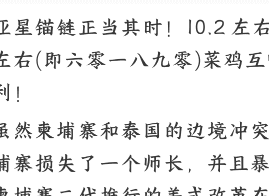
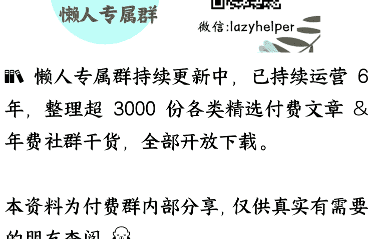

## 新标提醒！

2025-09-01 守夜人总司令
整理：公众号懒人搜索，懒人专属群独享
懒人微信：lazyhelper

## 亚星锚链正当其势！10.2 左右，12.2 左右 (即 601890) 菜鸡互啄下的胜利！

虽然柬埔寨和泰国的边境冲突，让柬埔寨损失了一个师长，并且暴露出，柬埔寨二代推行的美式改革在军队中彻底泡汤。柬埔寨老一代擅长游击战的将领逐渐边缘化，柬埔寨二代毕业于美国西点军校，回国以后被现任柬埔寨人民党主席洪森安排在军队体系中历练，随后开始逐渐接班。所谓一朝天子一朝臣，柬埔寨二代的接班，首先是从军队体系中开始的。柬埔寨军队的指挥链条开始以现代化的名义逐渐换成柬埔寨二代的人，现任柬埔寨人民党主席洪森默许了这种行为，因为洪森的本意就是为了让儿子接班，而且洪森的第二个儿子接管了情报部门，这种安排本身没有问题，问题就在于外部环境的变化和全球经济的恶化在交接的过程中所造成的致命影响。

在《他要干什么？》中说了洪森的目标。事实上，洪森的目标最终还是达到了！中国昨天公布的反倾销对象中包括泰国，同时，在泰国军方取得边境战争的胜利之后，泰国法院解除了他信家族女儿的职位。而且在出席 9 月 3 号的名单中，柬埔寨只派了吉祥物国王前往，洪森的儿子都没有出席，这可以说是一种无声的抗议。至于泰国，他信家族女儿的下台，就是一个非常强烈的信号，之前所有的许诺都作废。对于中国来说，一切回到起点，两边都需要重新博弈！美国肯定不会放过在这个腹地见缝插针的机会，从某种意义上来说，中国第一阶段抬柬埔寨制越南，肃清缅北电诈的操作是非常成功的。第二阶段打击泰柬边境电诈也略有成效。但是，第二阶段的经济战略和泛亚铁路中线的目的并没有达到，反而因为偏向性选择，让柬埔寨开始转向美方。同时押注的泰国他信家族又因为没有经验而失势，最终两头落！

他信家族可以说经此一役彻底从泰国的政坛失势，因为他信家族已经没有了基础，之前他信家族是以改革的面目出现，深受底层人的欢迎。后来，他信和英拉先后被废，泰国的底层人变得越来越没有耐心，于是泰国底层人去追求更加激进的主张，包括并不限于废除君主制。任何教主最大的敌人，就是另一个更激进的教主，因为彼此共用同样一个群众基础，绝望的群体只会追逐更加激进的主张。

当年他信家族就是看到权贵垄断，民众愁苦的社会结构，他信绕开所有的权贵阶层，直接发动民众，装大家族企业，让普通民众从中受益，从而形成一个滚雪球的效果，这一招在当时很有用。然而，随着西方金融危机的发酵，做大蛋糕的能力萎缩，泰国内部的保守势力开始联合起来把他信翻在地，他信虽然挣扎过几次，但终究无济于事。不管是英拉的大米换铁路计划，还是他信女儿这一次准备搞泛亚铁路。中国的想法是好的，可惜对面没有重量级选手作为抓手来落地！从大米换铁路计划被搁置已经 12 年过去了，他信家族也从他信姐夫，他信妹妹，再到他的女儿，一个一个接力却都无力推进，也无法改变泰国经济和民众状况的现状，泰国内外的结构都无法动弹，泰国民众也越来越失望和激进。

于是，更激进的主张出现了，这种主张对他信家族的影响甚至大过对王权的影响，泰国失望的底层民众，纷纷拥抱欧美扶持的革命派并抛弃了他信家族这个改良派！这一次他信家族与保守势力合作压制革命派，作为交换条件把他信家族的女儿推向前台。

这一次，泰国保守势力利用了他信家族，也利用了中国。通过他信家族的女儿给中国发出一个强烈的信号，从而让中国押注泰国，在这次柬泰边境冲突发生的时候。昆明的中国代表约见柬埔寨军方要求对方停火，然而，泰国的保守势力利用完他信家族和中国之后，又把他信家族的女儿赶下台，那么中国试图推进泛亚铁路中线的希望也就破灭了，同时也会刺激柬埔寨开始强化与美方的关系。不要小瞧了泰国玩这一套的手段，当年整个东南亚都殖民化了，唯独泰国保持了独立并推进了现代化，当年连中国都沦为半殖民地，泰国却保住了完整。

我们习惯于从天朝上国的视角看问题，泰国对我们的看法则完全不同。当年新中国成立，中国与东南亚各国建交的时候，这些国家甚至按照古代的传统习惯送来了质子！这就是他们看待我们的方式。任何一个具有生命特征的结构体，首要的任务是保持自身的存续！对于一个社会来说，这个社会的主导群体，任何行为都是维护自身的存在。对于保守的封建势力来说，最可怕的不是绝望又走投无路的民众，因为有暴力可以压制他们，有宗教可以安慰他们，稍微给一点施舍，他们就满足了，最可怕的是他信家族这种具有组织力和自我增长的势力！如果当时没有把他信家族掀翻在地，随着经济和产业的发展，那些比较小的封建势力就会转向投到他信家族的麾下，时间一长，他信家族就会成为曹操。对于汉献帝来说，黄巾并不可怕，可怕的是曹操和袁绍这些人！

泰国保守派实力为什么第一次掀翻他信家族的时候，民众反应激烈，而这一次民众却非常的平静呢？因为第一次他信家族给了底层民众希望，这一次对于泰国的底层民众来说，不过是统治阶层内斗而已，所以他信家族的女儿上台就是他信家族与泰国保守势力联合的妥协结果。在绝望的底层民众看来，他信家族与泰国保守势力已经是一丘之貉了，这只是他们内斗而已。

正是因为这样，对于泰国保守势力来说，就更不足虑了！因为美国扶持的那此人都是一些不靠谱缺乏组织力，也没有社会生产的组织能力的乌合之众，是只会喊口号的西化边缘群体。这样的人可以用来点火，但是没法成事，对于泰国保守势力来说，最大的威胁源自于从内部分化出去的同类，就是类似他信家族的同类。

泰国的保守势力一旦稳了，许多事情就得从头开始。东南亚许多保守势力并不在乎他们那个国家的发展速度，他们在乎的是自己的地位和利益以及安全。对于保守派势力来说，拖是一个不错的策略，而对我们中国来说，拖可不是一个好事。随着全球贸易体系在逐渐瓦解，我们中国需要更加深入的开发家门口这个拥有广大人口的市场，基础设施的先行，产品的输入和资源的运输就会成为最紧急的事情。

泛亚铁路的三条线，东线是经过越南的南北走向，西线是经过缅甸北部，中线是通过老挝经过泰国抵达港口。老挝的线路已经通了，从老挝万象到泰国曼谷，本身具有铁路线，只需要改造升级即可，所以，这条线是最优选择！

柬埔寨的线路反而不重要，那是一个东西走向的线路，从越南河内到柬埔寨金边，这条横线依赖于东西两条线路完成，否则没有意义。柬埔寨唯一的价值就是挖一条运河，从港口直接进入湄公河，然后一路顺河北上进入云南。我刚刚去过云南，昆明以西都没有什么大的转运站，因为昆明都是山区，即便是 350 公里时速的高铁，在那个地方最高时速不会超过 120 公里。从某种意义上来说，即便是通过湄公河进入澜沧江，运到云南境内，运出来的成本也非常高！不是一个非常划算的事，而是一个聊胜于无的备选项。

如果中线快速建成，那么老挝和泰国，尤其是泰国，在经济上就会形成虹吸效果。因为泰国曼谷本身就是港口，如果有高铁从曼谷连接老挝的万象，从老挝万象到云南的高铁已经运行数年，那么这条路就会成为主要的选择，因为从泰国曼谷到老挝万象地势平坦，而从柬埔寨金边要穿过老挝抵达万象，有一个长山脉，即便修路，投入非常大，成本也非常高，路途还非常远。挖一条运河所需的几十亿美元柬埔寨都拿不出来，还想让中国垫资，修一条从柬埔寨金边到柬埔寨万象，穿过山区的高铁，那就更扯淡了，所以搞的泰国的中线这条线，对柬埔寨是最有利的！

所有博弈都是讨价还价，都是创造筹码去交换各自的需要，不能用道德上的好坏来评价，生命体的所有的行为都是基于存续的需要采取的生存策略！美国人炸毁北溪天然气管道 1 号 2 号，德国受害最大，德国能说什么呢？没有实力说什么都没用。当然，中国有实力绝对不会吃哑巴亏，等着瞧吧！

### 最后，安利小懒的付费群：

懒人专属群

**🌿** 懒人专属群持续更新中，已持续运营 **6** 年，整理超 **3000** 份各类精选付费文章 & 年费社群干货，全部开放下载。

本资料为付费群内部分享，仅供真实有需要的朋友查阅 🙏

# **懒人专属群更新记录：**

[https://lazy2025.top/blog/record2](https://lazy2025.top/blog/record2)

# **懒人专属群更新记录（需梯子，备用）：**

[https://lazybook.fun/blog/record2](https://lazybook.fun/blog/record2)