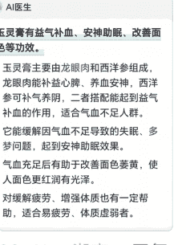

# 一周内 3 位 10 亿级滋补品牌大佬问我：喜纯你怎么看；我：挂逼！！

# 2024.09.01 生财精华

公众号懒人搜索，懒人专属群独享

懒人微信：lazyhelper

喜纯是最近两年新起的中式滋补品牌

列几个三方平台看到的数据，大概就有概念为什么大佬们会对他很感兴趣

- 2023 年底，公司注册
- 2024 年初，正式入驻抖音
- 2024 年 7 月，单月销售额破千万
- 2025 年 2 月，单月销售额破亿

（对比实际肯定略有出入，但整体趋势可参考）

至于怎么看，一句话极简回答

稍微展开一点，用游戏圈的话就是：挂逼！！

要知道，企业最大的成本不是原料、不是生产、不是人力、甚至不是营销成本
是走错的每一步，付出的沉没成本
在我看来，喜纯在【犯错】这部分的成本，无限趋近于 0

查了查资料果不其然，喜纯的老板，李鹤，原曦子科技（西子健康、西子电商的母公司）股东

| 变更前 | 变更后 | 序号 | 变更日期 | 变更项目 |
| --- | --- | --- | --- | --- |
| 长沙高新技术产业开发区管理委员会 | 湖南湘江新区管理委员会 | 1 | 2024-05-15 | 登记机关变更 |
| 李鹤【退出】 | 毛杰【新进】 | 2 | 2024-05-15 | 高级管理人员备案（董事、监事、经理等） |

西子健康这家公司，如果不是湖南电商圈的可能不太熟悉，说说他们的旗下品牌：Fiboo、谷本日记、她练、Foyes
做健康食品的朋友们，是不是如雷贯耳！

在正式开始详细拆解之前，先说明下，为什么大佬们会问我的看法：

作为合伙人，做成过一个大几亿的食品品牌。有从 0.1 到 1 的完整经验

在平台做过策略、也管过行业。有平台视角，甚至直接参与过平台流量分配机制设计

最早的时候还在代运营当过大头兵，对实操有最真实最细节的体感

作为合伙人，搞砸过两个滋补项目，有亲历的失败经验

下面用营销 4P 的结构：选品、定价、渠道、推广四个方面进行分析，说说李解对喜纯这个滋补超新星品牌的理解

前面两个选品、定价对一线运营小伙伴会很无聊，可以划过去直接看渠道、推广

### 选品定江山

#### 品类上，为什么是中式滋补，不是西式保健？

对新品牌来说，越标品，越难做。

标品容易被比价，一旦陷入比价陷阱，只有头部品牌，只有全产业链效率优胜者会赢

相比之下，保健更标品，滋补更非标

中式滋补是对大健康新品牌更友好的品类选择

#### 可是极致非标品，没有价值共识，教育成本太高了，怎么办？

讲一个新概念，恨不得要在《养生堂》节目讲个一小时

要不就是，线下拉用户到大会议室，搞个养生医疗大讲堂

这效率也太低了，怎么办呢？

中式滋补大品类中，虽然配方、价格、剂型并不标准

但很多细分品类、产品有极高的价值共识

比如以形补形

比如红色补血、黑色养发、白色养胃

比如各种耳熟能详的散、膏、汤、丸的名字

所以要在非标行业中，找价值共识，作为开品切入点

这样既规避了标品比价的尴尬，又能借助消费者已有的心智概念，降低教育门槛

我推测，正是因此，才有了喜纯的核心爆品，玉灵膏

产品选定了，配方、工艺、剂型是做更科学的创新，还是遵照古法古方？

遵照古法，必须遵照古法！！

创新是大企业才能做的事！！

当你经历过调整配方，加入了更科学的，效果更好的小众原料

你会发现，小众原料种植生产，因为没有规模化、工业化

剧烈的价格波动，会让你辛苦一整年，只为原料商打工

当你经历过优化工艺，用更好的提取技术，达到更好的吸收效果

你会发现，更好的提取意味着更新、更贵的技术

在成品中，原料更无法直接用眼睛看到

消费者购买就需要更高的信任成本，更长的决策周期

这些都不是一个新品牌能承受的

外行看上面，可能觉得：没错，逻辑上说得通

内行能知道，老李曾经经历过怎样的痛苦

所以我推测，正是因此，喜纯的玉灵膏，配方、工艺、剂型完全遵照清代中医名家

王孟英（王士雄）的著作《随息居饮食谱》。

膏体可以做的更细腻吗？

工艺上当然可以，但消费者认知上不接受

膏体可以直接变成提取液吗？

工艺上当然可以，但消费者认知上不接受

甚至，连看上去是个破绽的原料，西洋参都保留了。

朴素地认为，西洋参不是个新玩意么，怎么还在清代的方子里出现了

1. 西洋参在清代已明确入药

西洋参自 18 世纪初传入中国后，迅速被中医药体系接纳。成书于 1757 年的《本草从新》首次记载西洋参的药性：“苦寒微甘，补肺降火，生津液，除烦倦”，并指出其适用于“虚而有火者”，并指出其适用于“虚而有火者”。清代宫廷医案中，西洋参被广泛用于治疗肝郁脾虚、阴虚内热等证候，尤其受到皇室青睐（如光绪帝和慈禧太后的医案中频繁出现）。因此，王孟英在《随息居饮食谱》（1861 年）中选用西洋参配伍龙眼肉，是基于当时成熟的药用实践。

这个具体在渠道推广部分做详细拆解。

定价，是老板、合伙人会关心的关键决策点

渠道负责人往往更关注流量、转化打法，
这些看上去更高级

但是定一个售价数字，确定一个毛利
这个最不性感，看上去最没水平的业务动作，才是定生死的关键点。

1688 上查一下西洋参、龙眼肉、玻璃瓶的价格，我就不贴图了

考虑到各种产品包装、工艺人力成本，以及大规模生产、采购的规模优势

玉灵膏一瓶 69 的定价，产品成本控制

在 20% 以内，不是难事

算上仓储物流耗材的成本，销售毛利应该稳在 75% 以上

算是滋补行业的常规定价区间了

对比竞品价格数据如下，截图取自
https://mp.weixin.qq.com/s/VCclHi-jPxkPDnhA6N9ztw

### 玉灵膏品类竞争格局

| 品牌 | 创立时间 | 定位/广告语 | 主打产品 | 玉灵膏价格 | 销售额区间 (2024 年) | 市场份额 | 排名 |
| --- | --- | --- | --- | --- | --- | --- | --- |
| 雷允上 | 1734 年 | 中医药大健康产业集群 | 西洋参、孢子粉 | 79 元/200g  (39.5 元/100g) | 2500 万 -5000 万 | <0.1% | 251 |
| 福东海 | 2006 年 | 南派食养 | 燕窝、人参、驼奶蛋白粉 | 39 元/150g  (26 元/100g) | 1000 万 -2500 万 | <0.1% | 428 |
| 北京同仁堂 | 1669 年 | 百年品牌同仁堂 | 冬虫夏草、滋补、燕窝深海鲜参 | 89 元/300g  (29.7 元/100g) | 500 万 -750 万 | <0.1% | 819 |
| 满德斋 | 1995 年 | 安徽老字号 专注养生食品 | 黄精茶、黑芝麻丸 | 89 元/300g  (29.7 元/100g) | 250 万 -500 万 | <0.1% | 1109 |
| 九芝堂 | 1650 年 | 370 年传承  中华老字号  中华非物质遗产 | 燕窝阿胶、黄芪口服液、胶原蛋白肽 | 89 元/220g  (40.5 元/100g) | 1 亿 + | 0.20% | 104 |
| 喜纯 | 2023 年 | 专注东方滋养 | 玉灵膏 | 69 元/220g  (31.4 元/100g) | 2500 万 +  (1.9 亿) | 0.4% | 98 |

2024 年的数据，仅供参考

喜纯的定价，处于一个不低不高的黄金定价区间

低一点，比不了大品牌的品质溢价，没有品牌背书

高一点，品牌方可以承受更高的成本，有更高的溢价空间

但是定价策略本身不性感，不高级，不能体现老板的格局

如果老板有格局，应该是在渠道、推广上的投入

### 渠道，选择抖音

#### 淘系还是抖音

因为淘系的核心还是搜索
所以，起盘只能在内容平台

#### 抖音起盘靠 KOC 分销

跟长沙当地的人才基因，不无关系
# 所以，KOC 分销起盘的胜负手到底是什么？

业务小白以为
- 一个：用内容
- 一个：用数量
- 一个：用投放

关于内容

> **2024 年 7 月 15 日**，长沙高新区管委会发布《关于对李鹤、陈伟等 3 人给予荣誉奖励的决定》。

1. 2024 年 7 月，喜纯单月销售额破千万
我把原视频录屏放在这里

脑子:想划走

### 购物 | 每一口都不白吃

哈哈哈那我是
原来我失眠
那些人的眼神不好

### 购物 | 每一口都不白吃

善语结善缘

### 酒婆

我每天在吃甜甜的不苦

> 3

### 大大怪 ^,^u<^

吃了特别嗜睡

### 唐图图 作者

### 南啵儿兔

98 年，一直被叫姐姐

购物 每一口都不白吃

### 直播搞了！

> （主要是因为...

达人直播
聊到自播

关于数量

| 粉丝量级 | 全部 | 品牌自营号 | 商家自营号 | 达人号 |
| --- | --- | --- | --- | --- |
| 头部 >500w | 10 |  |  |  |
| 肩部 100w-500w | 20 |  |  |  |
| 腰部 10w-100w | 227 |  |  |  |
| 小达人 1w-10w | 982 |  |  |  |
| 尾部 <1w | 1,200 |  |  |  |

关于投放

数据看不到

| 粉丝量级 | 全部 | 品牌自营号 | 商家自营号 | 达人号 |
| --- | --- | --- | --- | --- |
| 尾部 <1w | 1,200 |  |  |  |

又是一个不起眼的微操

> 250901
> 生财精华
> 懒人微信：lazyhelper
>

## 不对呀，我也 1:1 照抄了他们的素材，为啥还是跑不动

因为人群规模~
相同素材，A1~A3 人群规模大小，直接影响综合投放成本

简单说就是，一对双胞胎，姐姐品学兼优，自己做个人 ip，还经常参加线下聚会。妹妹，内向的不行，虽然长相和穿衣品味跟姐姐类似，但同样要找对象的时候，姐姐有明显优势，因为圈子里的人对她更熟悉。

这里更多聊的是逻辑。

主要也是因为喜纯的投放素材，我刷了一下，系统退给我的并不多，不像 KOC 的内容，可以直接搜出来。就不特别进行针对性分析了。前面写过一个另一个香氛类目的投放素材分析，也有发在生财，可以翻翻看看。

## 总结

很多人说，电商最让人绝望的，是打法每天都在变。今天的头部，明天就是尘土。可为什么总有团队，总有品牌能够穿越周期，持续在场？电商毕竟本质是消费品。

## 纵然打法在变，基础的分析决策框架，不会变化

如果你还没拿到过结果，不要急着追逐潮流，先用扎实的框架拿到第一个结果。如果你已经有成功案例，花更多时间洞察一个又一个成功品牌背后【不变】的本质，才是持续成功的关键。

电商的世界，没有捷径，但有方法。穿越周期，持续在场，不下牌桌！

### 最后，安利小懒的付费群：

### 懒人专属群

懒人专属群持续更新中，已持续运营 6 年，整理超 3000 份各类精选付费文章和年费社群干货，全部开放下载。

本资料为付费群内部分享，仅供真实有需要的朋友查阅。

### 懒人专属群更新记录：

[https://lazy2025.top/blog/record2](https://lazy2025.top/blog/record2)

### 懒人专属群更新记录（需梯子，备用）：

[https://lazybook.fun/blog/record2](https://lazybook.fun/blog/record2)