# 从国企工厂倒班扫地的 到赚美刀的数字游民，这 7 年来我做了什么？

250901 生财精华

公众号懒人搜索，懒人专属群独享

懒人微信：lazyhelper

![] (img/e1db99eb8d32d78172b0d3690bcd58e3_0_0.png)

> ### "前言
> 大专毕业直接来到国企化工厂”扫地“

> 见字如面，大家好，我是怅惘，目前在生财 youtube 深海圈担任咨询教练，多个千万爆款视频。

> 现在主要深度研究【不依赖画面、可批量的传统长视频赛道】，手上 53 个油管矩阵号，10 个高级 YPP 账号（7 短 3 长），精华帖两篇，今天跟大家聊聊我的故事，没什么技术上的干货，都是心力上的支持。

> 看到小灯塔有圈友（特指曹教练）分享过自己的成长经历，心路历程，看的我深有感触，所以我也来分享一下我自己的故事。

> 既是对我过往的总结，也是给各位现阶段仍在痛苦内耗的圈友，提供一些启发。

### 一句话概括我的成长经历：毕业进工厂打工，下班研究副业，做出成绩离开国企，旅居全国 2 年后，转型出海赚美刀。

全文 1.5 万字，是我个人经历过去六年来的总结，我来聊聊从一个“工厂扫地工”怎么过渡到现在全国旅居 2 年的数字游民。

感谢大家点开这篇帖子在这听我讲讲废话。

如果谈起我的毕业之前，我只想说，那是一个只会打游戏，并且随波逐流的傻小子。

### 为什么这么讲？

因为当时我根本没有赚钱的意识。

我为什么上这个大专，因为我报考志愿的时候，除了这些学校的名字我知道怎么念，剩下我啥也不知道，我怎么报志愿？

我为什么来到这个企业？一方面是家里都是干这个行业的，再一个是我不该去哪儿啊，我只能看跟我差不多水平的同学，都去的那个石化公司，那我也去，好歹有个伴儿。

什么职业规划？什么人生路线？什么在哪定居？

我想都没想过，

那些大学就琢磨赚钱琢磨实习的人，是真牛逼，我就只知道下课了去上网，玩 lol。

盲目随大流，对人生毫无规划，上学只会打游戏，离开学校这个新手村之后，我就带着这些 buff，进入工厂了。

## 1、在职期间，多次尝试副业，屡屡失败

2018 年大专一毕业后，我就进入到一家化工国企上班，做普通操作工，工作环境伴随着高温、噪音、粉尘、毒气，并且需要昼夜颠倒的上班，上班期间禁止携带手机，夜班规定只准睡 2 个小时（我们会偷偷睡 3 小时，但是被岗检抓到会扣钱）

白班是早 8 晚 7，11 个小时。

夜班是晚 7 早 8，13 个小时。

上班期间不能玩手机，被发现玩是扣 400 元，携带的话会扣 200 元，也连带班长扣钱。（那也偷偷带）

夜班规定只能睡 2 个小时，但一般我们都偷偷睡 3 小时，有岗检过来检查，睡觉超时会扣钱。

在这么个岗位，一干就是四年。

每天干的活，基本就是坐在充满噪音的生产线中间着看监控器，看哪个生产线出问题了，过去忍受着高温和毒气处理一下。要么就是扫地 收拾卫生，清理灰尘。

（拍摄于 2020 年 4 月 18 日凌晨 5 点 54 分 清理设备缝隙流出的粉尘）

![] (img/e1db99eb8d32d78172b0d3690bcd58e3_3_0.png)

（拍摄于 2019 年 11 月 9 日凌晨 2 点 45 分，日常巡检上楼）

要么就是巡检，从楼下走到楼上，再从楼上下来，每小时一遍。

要么就是一些体力活，把生产废料，抬到车上。

剩下都是些零碎的活，记录下设备数据，运行情况。

毒气、高温、噪音那基本是从上班陪伴到下班。

看过六只猫教练的分享，可以很清晰的看到，作为女生以及本科生，在工厂是有一套自己的晋升路径的。甚至本科男生，在倒班岗位基本只需要半年履历，就可以升到管理岗，走属于他们自己的晋升路线了，哪怕熬资历需要年头，但至少可以上白班。

而像我这样的普通大专生，没啥学历，还爱不搞关系，讨厌人情世故那一套，就只能在下面倒班。

日复一日。

![] (img/e1db99eb8d32d78172b0d3690bcd58e3_4_0.png)

## 年轻人的必备能力

- 1、不惜一切代价打破安逸。安逸的生活容易让人丧失斗志，从此庸庸碌碌过余生。
- 2、一件事做到极致。不把一件事做到极致，你永远不知道自己有多大潜力。
- 3、不“坐等着”。机会、爱情都不是等来的，自己主动争取远比坐等来的靠谱。
- 4、尊重身体。熬夜、三餐不规律、垃圾食品正在摧毁你的身体。
- 5、不要因为孤独或外界压力大而降低生活标准。“因为家里催婚结婚”、“因为没谈过恋爱随便找个人交往。”
- 6、不管对任何人永远保持 30% 的神秘感。成年人的社交中，分寸感很重要。哪怕是最亲密的恋人，也不要和盘托出。
- 7、敢于审视过去的自己。开始发现自己过去很笨，你就开始成长了，做越撒比，成长就越大

## 自律秘诀

- 1、别人休息时，你还在努力。
- 2、别人放弃时，你仍在坚持。
- 3、别人困惑时，你双眼坚定。
- 4、别人娱乐时，你选择学习。
- 5、别人懒床时，你早已出行。
- 6、别人懈怠时，你勇于挑战。
- 7、别人沉默时，你展现激情。
- 8、别人祝贺时，你含泪致谢。
- 9、别人拼搏时，你早已成功。

不要假装很努力，结果不会陪你演戏。

## 生活守则

- 1、别为了省一点点小钱，而降低自己的生活水平
- 2、当一件事只能让你产生短期快感的收益，少做或者不做，比如深夜吃夜宵、早上想赖床
- 3、早睡早起、午睡 30 分钟，能大幅度提高你的生活质量
- 4、关闭朋友圈，删除不再联系的好友，删掉只有娱乐作用的 APP，扔掉不穿的衣服
- 5、学会独立思考，不随意被各种言论带偏
- 6、忘掉合群这件事，95% 的社交都是无用的，心甘情愿的孤独是人生状态
- 7、饮食少油腻，皮肤出油状态会改善，黑头也会减轻
- 8、相信复利和积累的力量，人生 85% 的财富都是在 40 岁以后获得的
- 9、太用力的人跑不远，人生不是百米冲刺，而是一场马拉松
- 10、千万不要为了取悦他人而自我牺牲

## 学会自律

## 女生如何自律提高颜值

- 1、早睡早起，11 点睡觉，7 点起床
- 2、减肥至标准体重，女：（身高 -100）*0.8
- 3、每周敷一两次面膜（补水提高气色）
- 4、坚持每天跑步 1 小时
- 5、走路不弯腰驼背
- 6、戒甜食&油炸垃圾食品
- 7、练字
- 8、练马甲线
- 9、学习时英语练习口语
- 10、保养好皮肤，祛痘、黑头
- 11、拍一套写真
- 12、每周看一本书，并总结

## 改变自己

这个年纪的你，连自律都做不到，

还谈什么
一鸣惊人，
功成名就，
风生水起。

## 越自律越优秀

## 2019 自律计划表
做不到扇自己

- 1、高度自律，早睡早起
每天 8 点起床，晚上 12 点之前睡觉
- 2、有计划，勤反思
每天早上做当天计划，每天睡前自我反思
- 3、锻炼身体，坚持每天运动一小时
- 4、多看书，勤写作
不断学习更好的提升自己
- 5、练习自己的表达能力
做到说话有条理，不拖泥带水
- 6、和朋友以及优秀的人多交流走出去，学习他人，认识自己

## 人为了什么而努力

- 1、为了点餐的时候不看价格 选自己想吃的
- 2、为了在累成狗的时候 随便打个车就回家
- 3、为了能从事自己真正喜欢的职业
- 4、为了能遇见更加优秀的自己
- 5、为了不让我爱的人和我爱的人失望
- 6、为了配得上自己的野心不辜负自己的梦想
- 7、为了有一天回首往事时 没有遗憾也没有后悔
- 8、为了能让自己选择生活而不是生活选择我
- 9、为了能让父母生活的体面 花钱时不斤斤计较
- 10、为了在我发言时 没人会打断我 并且尊重我的意见

## 如果你很迷茫不知道做什么

- 你可以
- 每天保证 7 小时的睡眠
- 每天坚持运动 20 分钟左右
- 每天坚持看书 20 分钟左右
- 每天整理自己的形象 15 分钟
- 每周制定本周计划及总结
- 每周和家人通话一次
- 每周花 5-7 小时培养一项技能
- 每周参加一次有意义的社交活动
- 从现在开始只做成产生积累的事情

## 你的圈子决定你的出路

- 你接近什么样的人，就会走什么样的路
穷人教你节衣缩食，小人教你坑蒙拐骗
牌友催你打牌，游戏好友催你去网吧
成功的人会教你成功

其实限制你发展的往往不是你的智商和学历
而是你的生活圈和身边的朋友

人生最大的运气不是捡钱，也不是中奖
而是有人愿意花时间去指引你

所谓的贵人并不是直接把钱给你
而是开阔你的眼界，纠正你的格局
给你不可能的人

（2019 年 9 月尝试抖音书单玩法，看见好几个几十万播放，消息 99+ 很开心）

然后，通过看《富爸爸穷爸爸》《富爸爸穷爸爸——21 世纪的生意》等书籍，

第一次让我了解到财商、主动收入、被动收入、财富自由、网络营销的概念，

我不希望过上那种【老鼠跑滚轮】一样，
被贷款追着跑的生活。

于是我把目光转向能实现被动收入的副业上。

同时拿到了几个关键词【被动收入 副业】
【网络营销】【管道收入 副业】，我就继续在知乎开始搜索。

### 年轻人的必备能力（重复检查）:
- * 富爸爸投资指南
- * 富爸爸为什么富人越来越富
- * 富爸爸 21 世纪的生意
- * 原生家庭
- * 富爸爸财务自由之路
- * 复盘
- * 思考致富
- * 富爸爸穷爸爸
- * 娱乐至死
- * 精进
- * 自控力
- * 终身成长
- * 聪明人是怎样管理时间的
- * 认知天性
- * 少年三国志
- * 平凡的世界
- * 非暴力沟通
- * 抖音这么玩才更引流
- * 从 0 到 1
- * 欲望
- * 认知红利
- * 被讨厌的勇气
- * 能力陷阱
- * 新媒体运营
- * 从零开始学炒股
- * 知识变现
- * 清醒地活
- * 乌合之众
- * 厚黑学
- * 增长黑客

这期间刷知乎开始接触知识付费，我也开始尝试能带来被动收入的副业，

粉象 XX、投资无人超市、撸自媒体平台收益。

其中做的久一点的，就是粉象 XX，这是一个需要拉人头的兼职，把流量导进来，就有管道收入。

这也是为什么后来我会做引流培训的原因，因为当时做这个项目的时候我就缺流量，

我清楚引流的痛点，所以后面优先选择【引流】作为收钱主张。

大概就是在做粉象的这段时间，我见识到更大的世界，意识到这个世上有更好的生活的时候。

我的想法开始从在网络上赚点小钱，转为辞职了。

此时，于 2020 年 7 月，在知乎某个知识付费大 V 的课程作业下，我写下了我的梦想。

一台电脑，一部手机，在哪都能办公的生活，我也想养一只狗，最好上午工作个 4 个小时，下午学点爱学的或者出去玩，闲的没事了继续工作 1、2 个小时放大一下效果。睡觉了也有收入，很多人认可我的价值，我非常的自由，有一个自己的爱人，我可以想在哪个城市就在哪个城市，呆上仨月爽够了就可以换个地方，要是玩欢了，今天不去工作也无所谓，照样有钱进账。最次带个手机也能随时办公，外面聚会吃饭时候把钱就赚了。

### 第五课

问题来自课程内容，原文放在这，方便翻阅。

第五课：极简改变自我.docx

查看正文

问答 第 9 题 (共 9 题)

结合龙猫第 5 课内容，从生活方式、精神状态、时间地点自由度等角度，确立并写出自己的理想生活及工作状态。准备好这把标尺，以便在后续看项目的环节中，去衡量你所分析的项目。

本题得分 20

你的作答

一台电脑，一部手机，在哪都能办公的生活，我也想养一只狗，最好上午工作个 4 个小时，下午学点爱学的 或者出去玩，闲的没事了继续工作 1、2 个小时放大一下效果。睡觉了也有收入，很多人认可我的价值，我非常的自由，有一个自己的爱人，我可以想在哪个城市就在哪个城市，呆上仨月爽够了就可以换个地方，要是玩欢了，今天不去工作也无所谓，照样有钱进账。最次带个手机也能随时办公，外面聚会吃饭时候把钱就赚了。

老师点评

龙非池

20 分

2020/07/02 15:17:15

好，去开钱眼匹配一批可以实现这种生活的收钱方式吧，初期并非 100% 都能实现，但项目发展成熟，雇用了员工复制之后，很多项目是可以的。
加油。

完成

但此时，距离我的梦想，还很遥远。

如果用一句话概括这时的我，那就是

啥都试，啥都做，啥都看，啥都没有大结果。

### 2、停薪留职，是父母的底线

我上面说到我是 2022 年 9 月顺利辞职的，

但我有辞职想法的那年是 2020 年，就是我知识付费学了一堆课程的第二年。

这一年，我什么成绩都没有，只有一个自诩为高认知的脑袋壳子。

那段时间，每天游走在各大公众号的文章之间，走路时听喜马拉雅音频，上下班路上刷着自我提升内容的知乎。

下班回来没事刷一刷老师写的文章，还专门把那种能让人内心充满力量的文字，整理成一个合集【道理总结】

没事翻出来看看，给自己已经近乎麻木的精神世界，打打鸡血。

![] (img/e1db99eb8d32d78172b0d3690bcd58e3_12_0.png)

什么都听，什么都学，就是什么都不干。

我觉得自己什么都懂了，别拿上班榨干我的精力，让我辞职放开手干，以我的认知

### 3、停薪留职，是父母的底线

通信结果，大专生是工厂人才，不能办理停薪留职。

ok，我心如死灰。

但心如死灰不代表我要放弃，我知道，我可能需要靠结果来说话了。

毕竟，我这人有个特点，就是一件事但凡有一点点希望，我都愿意投入时间去尝试。

而很多人，都是一件事但凡有一点点不顺利，就会选择放弃。

在游戏里如此，生活里亦是如此。

### 3、开始布局自由生活

2021 年，我开始布局自由生活，继续沉下心来琢磨获客渠道的问题。

我开始上传喜马拉雅音频，开始尝试最简单的音频获客，花了几个月时间做矩阵，发了 1726 条音频，发现流量不好。

于是转去写知乎，2021 年 3 月 25 日创作了我的第一条知乎回答，照着同行修修改改，一篇小几百字的文章出炉。

这一年我开始尝试在知乎写文章，从一开始 2 小时 300 字的我，进化到一天能写出几千字，这个时候我度过了写作的难关。

2021 年 2 月份，花了一个月，照着同行的课程，修修改改出了一套自己的课程。

> （这一门课程其实是照着同行洗的，所以出现了先制作产品，后写文章获客的情况）

有了课程后，就准备开始获客收钱，上班下班天天研究知乎，优化自己的收钱流程。

上班干活，下班就写，写不出来就语音转文字，再二次修改。

当然，肯定也少不了偷懒打游戏的时候。

比如，下图是 2021 年 2 月 28 日的流水账日记，不是在优化收钱流程，就是在吃饭，打游戏。

顺便记录下，这是为了辞职，坚持布局的第 59 天，而此时的我意识不到，距离我真正离开这个企业的日子，还差 568 天。

![] (img/e1db99eb8d32d78172b0d3690bcd58e3_17_0.png)

就这样一个人在出租屋里

不抽烟、不喝酒、不社交、不逛街、不找对象、不做无效社交，与孤独为伍。

每天就是 上班下班、吃饭，研究知乎、研究收钱，研究写作，偶尔看书，经常打游戏。

## 汪惘🦦回顾 2021

- 🐶 我拥有了自己的狗，它叫『抖抖』，虽然它爱拉爱尿爱咬爱放屁，但我依然喜欢它。
- 🌲 知乎阅读量 76.5 万，数个月被收藏次数超 99% 同级创作者，但愿明年能超过 200 万阅读转化一些读者。
- 🎶 录制的音频累计播放量 7.68 万，完播率均超 50%，虽然鸽了半年去投身写作，但始终都能收到陌生人的点赞。
- 🌲 公众号粉丝 5234，今年的粉丝增速明显放慢了，不过也始终在保持稳步增长。
这一年与华晨宝马达成数个月的招聘合作，一定程度上缓解了我跟夜章的话费压力🤡
- 💰 基金收益在这一年依然符合我的心理预期，海星海星，把战线拉长。
- 🐒 今年完成了第一次收钱，一次千元客单价知识付费产品的成交，是我成长道路上的一次具有里程碑意义的收钱。
在那个燥热又充满财气的下午，空荡的小屋里只有我的哈哈哈哈嘿嘿嘿咯咯嘎嘎嘎的笑声...

📕 这一年最让我欣喜的是我从几小时 300 字都憋不出来的萌新，成长到现在可以花上几天反复打磨几千字长文的初级创作者，很磨人，也很锻炼人。

就这些吧，虽然这一年我做错了很多事，浪费了很多时间，也鸽了很多事情🤔，但我从未放弃过希望。

以上，
我的 2021，
比去年强的 2021，
枯燥而又不断成长的 2021。

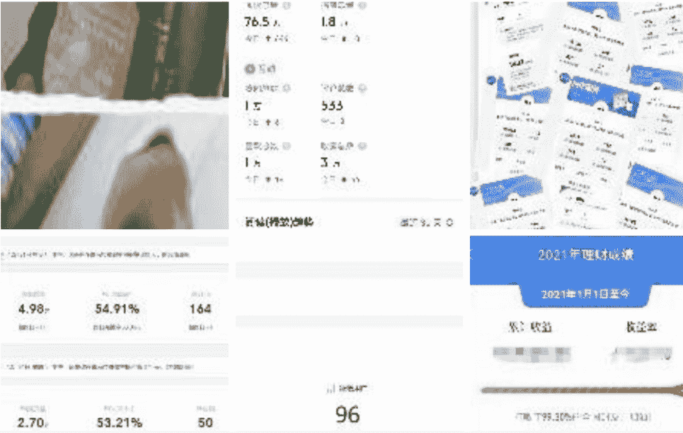

## 虽然成长了很多，但这能让我辞职吗？

远远不能。

998 元甚至不够半个月饭钱，而我花了几
乎一整年的时间才赚 998 元，还差得远
呢。

对于当时的我来说，我有一种感觉，就是
闭着眼睛，一股劲地往一个方向死磕，假
以时日我一定能死磕出结果。

但以此我整个边玩边学的方式，

这个假以时日，是 3 年，5 年，7 年？我不知道。

我只知道这个地方我不喜欢，我一定要离
开。

当时的学习并不能让我有辞职的信心，虽然
我大概看清了前方那条我想要走的路，
但随后到来的就是无尽的自我怀疑。

这份自我怀疑就是，

我？？真的！？能？？？做到吗？？？

从体制内辞职是一场豪赌，现在看过的书、学过的课，给了我前进的勇气，但我真的能做到吗？

像是告诉你，给你 40 分钟，跑够 5000 米，你就能得到某某奖励，

这个任务，对于一个跑 1000 米都费劲的人，你让他怎么建立信心？认为自己能跑到 5000 米呢？

而且，我一个专科学历的人，一点成绩都没有，我凭什么对自己有信心啊？

虽然这一年，我成长了很多。

但，这场豪赌，我跃跃欲试，却又不敢孤注一掷。

想又不敢，恐怕这是很多人内心的真实写照。

毕竟自身实力摆在那，不管目标多么明确，都不可能有信心，

## 4、一篇万字文档，给父母讲透当下利弊和成绩。

但很快，转机就来了。

# 4、一篇万字文档，给父母讲透当下利弊和成绩。

考虑到讲清楚辞职这种事，你一言一
语，问一下答一下的沟通效率太低，

于是，当时 2022 年 1 月份，就起草了一份思维导图，准备开始写我的离职思考，给我妈发过去。

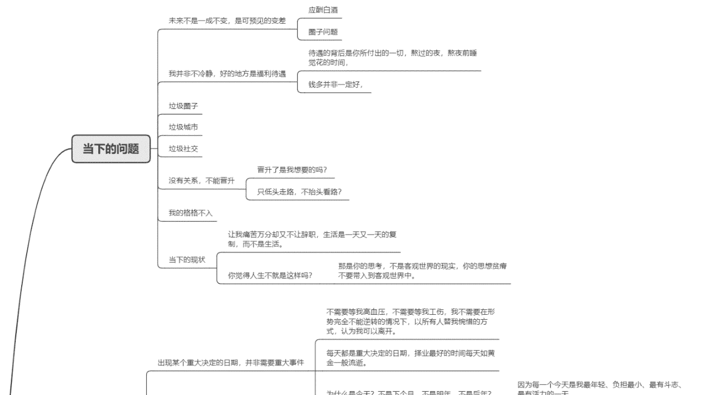

列完导图后，就直接开写了，前前后后一万字。

详细讲述了我当下的现状

### 1) 低质量圈子：大家除了喝酒打游戏，不知道干什么，自己始终在对抗环境，努力不被同化

典型的语言例子就是：100 块钱除了喝酒还能干啥？在家闲着要不也没意思，不打游戏干啥？一天天真没啥干的，下班喝酒去吧。没啥赚钱的东西，只能开个烤串店。理财 10% 收益以上的都是骗钱的。

这种语言带来的引导是无意识的，它不仅会让人看不见更多的可能，反而会加强一个人对自己认知的判断，从而恶性循环。比如，一天天真没啥干的，下班喝酒去吧，都觉得说得对，一群人就去喝酒了。

### 2) 低质量城市与低质量社交：7 天逛完全城，从此以后的每一天、每一年都是重复，每天都仅仅只是活着

### 3) 没有关系，晋升与我有关吗：而且晋升后的生活就一定是我想吗？太多了盲目的往上爬，真的看清楚付出什么代价了吗？

### 4) 底线更低：从只喝雪碧，到被迫灌白酒，酒桌上的服从性测试让我作呕，预料到以后的应酬只会更多

### 5) 当下的上班情况：上班环境，粉尘、毒气、高温，我做不到眼睁睁的看着自己凋零，跟看着自己流血而死没有区别。

### 6) 福利待遇是有代价的：机会成本，福利待遇是用熬夜换的、是用节假日回不了家换的、是用健康换的

我受够了一年又一年单位的推文，和身边麻木抱怨的声音。

## #【我在岗位过春节】

## #【我在岗位过五一】

## #【我在岗位过中秋】

## #【我在岗位过国庆】

上班四年，三年都没回家过年，有一年还是除夕当晚走的，无它，必须回去上班，
工厂不可能停产，节假日不准请假。

7) 每一天都是重复：每个人都像机器人，
什么班，说什么活，会骂什么样的人，几
点几分做什么事情，这个白班说着上个白
班说过的话，今天说着跟上个月、甚至去
年一样的活。

每一天都是重复 ¶

第一个白班话题：又上班了、又安排活了、领导又来了、中午吃啥，中午饭太难
吃了，岗检来了，岗检没来，骂厂子，骂领导，还有十个点下班，再熬几个点，
晚上啥菜，晚上饭太难吃了，快下班了，快洗澡了。¶

第二个夜班话题：几点睡觉、今天冷了热了、夜餐太难吃了、困了、累了、又安
排活了，下午睡觉没，睡几个点，现在就困了，没睡好，几点睡着的，岗检几点
来的，骂厂子，骂领导，再熬几个点就睡觉了，再有俩点下班了，快洗澡了。¶

第一个白班话题：又安排活了，领导来了，领导没来，中午吃啥，中午饭太难吃
了，岗检谁，几点来的，骂厂子，骂领导，晚上吃啥，晚上饭太难吃了，还有几
个点下班，再熬几个点下班，快下班了，快洗澡了，再挺一天大休了。¶ 

### 8) 无成长性的工作：每天就是体力活，成
长性跟搬砖没有区别

### 9) 上班期间禁止玩手机，限制我的天花
板，几乎 12 个小时不能看手机，极大的影
响我当时靠知识付费微信收钱。

## 以及一些其他思考

- + 1）出现某个重大决定的日期，并非需要重大事件。（离婚会出现在某个平静的日子里，离职也是）

# 2）为什么我不是乖孩子了？

你说过的不让辞职的话，在我的潜意识里不断反复地折磨我，因为我怕你不高兴，怕跟你产生冲突，怕没当个听话的孩子。

你的一句【工作一定要留住】【你爸能同意吗】言外之意就是告诉你↵你必须得上这个夜班，不然爸爸妈妈不高兴了，就焦虑了。↵你必须一宿只能跟着睡两个点，不然爸爸妈妈不高兴了，就焦虑了。↵你必须这样像僵尸一样的行尸走肉上班，不然爸爸妈妈就不高兴了，就焦虑了。↵你必须一宿只能跟着睡两个点，不然爸爸妈妈不高兴了，就焦虑了。↵你没有这么说，但你一直在这么干，一句工作要留住，让我每天上班面对的就是这种情况，↵

# 3）公务员的思考

# 4）我是个异类吗？为什么非要从体制内离职呢？

# 5）一开始就没来 XX 石化是不是更好，选 XX 石化好了？

# 6）做点副业加上工资收入赚的多不是挺好？

（好，但解决不了倒班和被迫在这个城市生活的问题）

# 5) 做点副业加上工资收入赚的多不是挺好？
<'

这个问题不仅是你说过，身边每个知道我搞副业的人都会这么说。这句话从根本
就上搞错了一个问题。<

我去探索赚钱，去思考人生意义，本质上是为了逃离这种糟糕的圈子，糟糕的人，
糟糕的工作环境，糟糕的城市，而非赚更多的钱。<

副业 + 工资收入带来更多的钱，我还是夜班只能睡两个点，我还是结交一堆烂朋
友，我还是在这个一无所有的城市苟活，我还是无法获得实实在在的快乐，我还
是摆脱不了这种精神分裂的感觉。<

我要的仅仅只是更舒适的活着而已，并非大富大贵。<

去把更多属于我的东西拿回来，和交心朋友的聚会、过年的团聚、不熬夜的身体，
规律的作息，正常人的生活，时间越久，会越来越发现这些无形的东西远比有形
的东西更有价值。<

副业赚再多钱，该熬夜还是得熬夜，该有毒有害还是有毒有害，该被迫干不喜欢
的体力活还是得干，我要改变的是这些东西，而不是钱包里的数字。<

## 我清楚的知道我放弃了什么。凡是
选择，必有代价。

再一个就是自己现在的成绩。

前前后后写了一万多字，在 2 月 27 日写
完的，准备休一轮假，就发给我妈的，
（以现在的视角来看，也正是此刻对自
我、当下利弊的分析，才发现刚毕业那个
“随波逐流”的我，此刻已经觉醒了“自
我”的意识）

# 你要说为啥这么能写，

## 1) 出现某个重大决定的日期，并非需要重大事件。（离婚会出现在某个平静的日子里，离职也是）
## 2) 为什么我不是乖孩子了？
你说过的不让辞职的话，在我的潜意识里不断反复地折磨我，因为我怕你不高兴，怕跟你产生冲突，怕没当个听话的孩子。

你的一句【工作一定要留住】【你爸能同意吗】言外之意就是告诉我
你必须得上这个夜班，不然爸爸妈妈不高兴了，就焦虑了。
你必须一宿只能跟着睡两个点，不然爸爸妈妈不高兴了，就焦虑了。
你必须还要像僵尸一样的行尸走肉上班，不然爸爸妈妈就不高兴了，就焦虑了。
你没有这么说，但你一直在这么干，一句工作要留住，让我每天上班面对的就是这种情况，

### 3) 公务员的思考

# 4) 我是个异类吗？为什么非要从体制内离职呢？

# 5) 一开始就没来 XX 石化是不是更好，选 XX 石化好了？

# 6) 做点副业加上工资收入赚的多不是挺好？

（好，但解决不了倒班和被迫在这个城市生活的问题）

# 7) 做点副业加上工资收入赚的多不是挺好？
<'

这个问题不仅是你说过，身边每个知道我搞副业的人都会这么说。这句话从根本
就上搞错了一个问题。<

我去探索赚钱，去思考人生意义，本质上是为了逃离这种糟糕的圈子，糟糕的人，
糟糕的工作环境，糟糕的城市，而非赚更多的钱。<

副业 + 工资收入带来更多的钱，我还是夜班只能睡两个点，我还是结交一堆烂朋
友，我还是在这个一无所有的城市苟活，我还是无法获得实实在在的快乐，我还
是摆脱不了这种精神分裂的感觉。<

我要的仅仅只是更舒适的活着而已，并非大富大贵。<

去把更多属于我的东西拿回来，和交心朋友的聚会、过年的团聚、不熬夜的身体，
规律的作息，正常人的生活，时间越久，会越来越发现这些无形的东西远比有形
的东西更有价值。<

副业赚再多钱，该熬夜还是得熬夜，该有毒有害还是有毒有害，该被迫干不喜欢
的体力活还是得干，我要改变的是这些东西，而不是钱包里的数字。<

# 7) 我清楚的知道我放弃了什么。凡是
选择，必有代价。

再一个就是自己现在的成绩。

前前后后写了一万多字，在 2 月 27 日
写
完的，准备休一轮假，就发给我妈的，
（以现在的视角来看，也正是此刻对自
我、当下利弊的分析，才发现刚毕业那个
“随波逐流”的我，此刻已经觉醒了“自
我”的意识）

# 你要说为啥这么能写，

我猜，一个是心里情绪比较多。
另一个是，写了一年知乎，练出来的。

> 【国企辞职来源于理性的思考和现状的分析，不喜欢上班只是情绪，周围环境再差，影响的也只是情绪，情绪再多也没用，实在的成绩，才是能助你离开的底气】

## 5、意外封城，加速了这场辞职

结果还没等休上假，就封城了，封了足足 2 个月的时间，

就这样，我一人一狗，在出租屋里研究了 2 个月知乎，研究出了各种知乎技巧，这期间，签了知乎 MCN 机构，推出了知乎引流课，并且顺利多次收钱。

## 公众号懒人搜索，懒人专属群分享

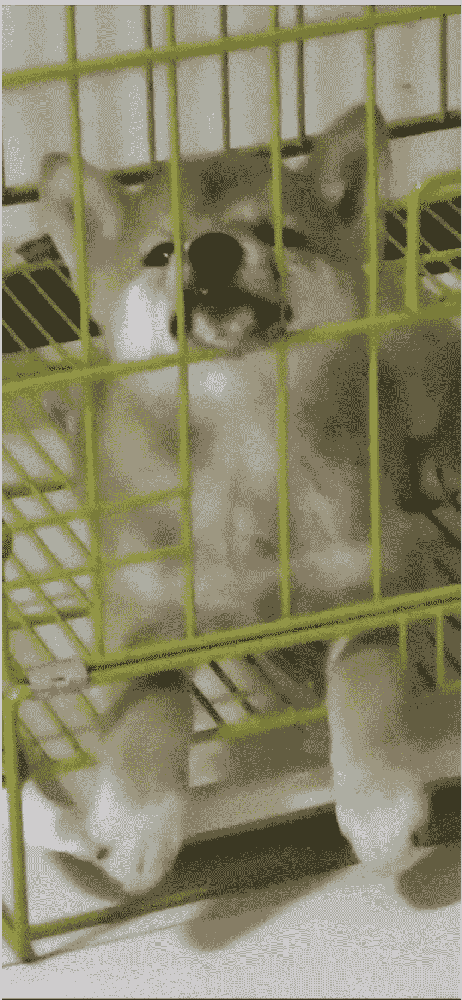

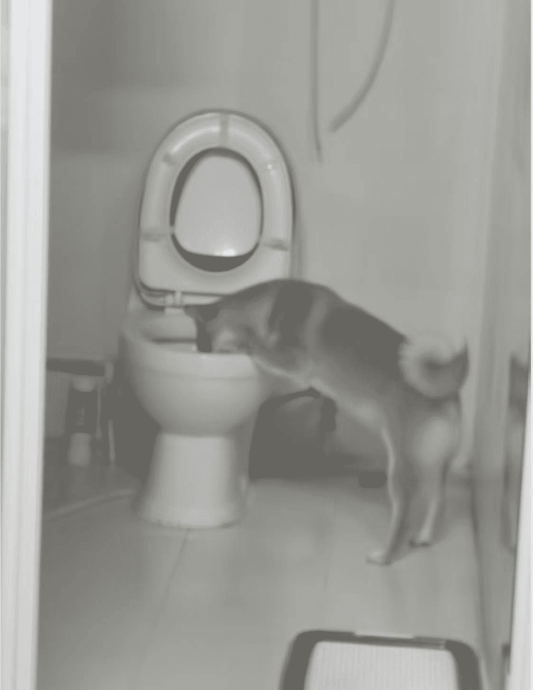

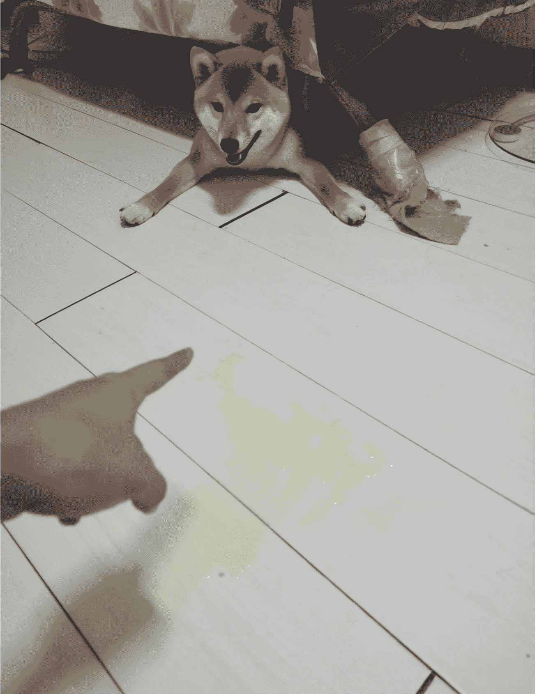

可以说，没有这 2 个月的沉淀，我后面根本不可能的辞职。

有了成绩，才有辞职的底气。

靠一腔孤勇，和自认为的高认知，是远远不能支撑你冒险离职的。

5 月份，我就把文档发给我妈了。

## 公众号懒人搜索，懒人专属群分享

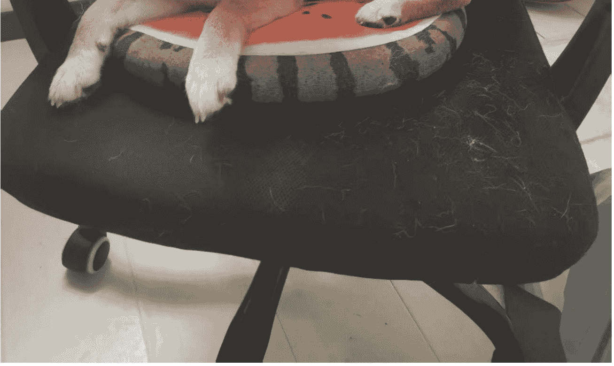

我妈看到这篇文档后，没有多说什么，没有电话、没有深入沟通，只有短短的几句话。

甚至过几天都没再提过这档事。后来我才知道，我妈当时整宿整宿的睡不着觉，担忧我的未来。

这是后话了。

经过半个月的思想斗争，通过付费学习带来的认知和对未来的清晰规划，以及自身成功收钱带来的信心。

5 月底，我就找车间主任和书记开始 battle，这一次我没有怯懦，我勇敢的去表达自己的需求。

经过了书记一番思想工作，又顺利扭转我的思考，不一定非要辞职，说可以先停薪留职，拿几个月五险一金嘛，

等什么时候找到工作，再变成辞职也可以，能白嫖几个月是几个月嘛。

我觉得还挺有道理，然后 5 月底，开始办理停薪留职手续，中间签字、填表，折腾了 2 个月。

8 月初，工厂告知我，大专生是工厂人才，不能走。

ok，我果断改成辞职，又折腾了 1 个半月，2022 年 9 月直接辞职成功，结束了我整个 4 年来的枯燥无聊的生活。

可以说，从入职到辞职，经历了整整 4 年的时间，每一天都是机器人一样的生活，我甚至可以预料到，下一轮班的某天某时，我在干什么事情，听同事说什么话。

上班内耗胡思乱想乱想，下班研究兼职、副业、收钱主张，几乎不参与任何娱乐活动，有意过滤任何无效社交，只靠线上学习，盯准一个方向，就这样研究了 4 年，我终于顺利辞职了。

2019 年的 flag，我做到了，截图的时间只需要 1 秒，而对抗那些否定你的人，狠狠打他们的脸，需要几年的沉淀。

## 辞职

你三年后辞职是不可能的
我得为三年后的辞职负责

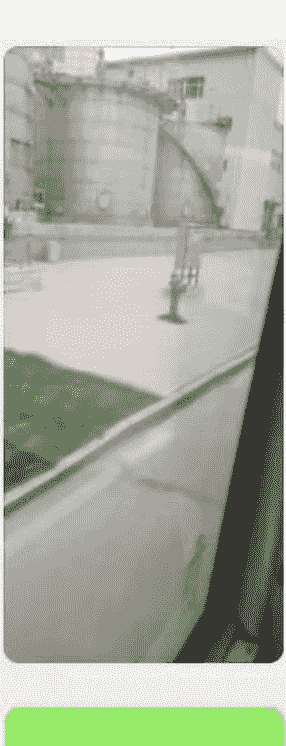

上班班

这种日子什么时候是个头啊

👍 学吗

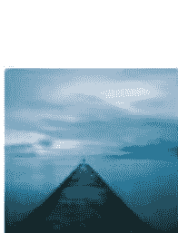

无情的上班机器

你好像传销的

上班挣钱

+ 👍

? ?

## 拆解：致富之道 1.0
学会拆解，赚现在，未来的钱

未来 3 年什么是普通人创业最好的模式？
一把手机，一个微信，一个 IP，月赚 20w

早上 7:28

你达不到

这种东西不都得有团队啥的吗

读书学习，无趣的苦。

深度思考，动脑的苦。

自律自驱，独行的苦。

经常被拒绝，打击的苦。

动钱投资，亏损的苦。

失败出错，受嘲的苦。

这些年，体验了个遍。

哪怕我一年只收了 998 元，但我依然没选择放弃，不是没选择，是根本没想过。

不是我意志坚定，而是我就是傻，我就认准这个事，一定要把它做成。

这四年，绝不搞多余社交，下班就独处，
躲不开的应酬就做第一个走的人。

这四年，绝不谈恋爱，有意控制跟任何亲密关系的距离。

这四年，绝不买房，谁催也不买，谁制造焦虑也没用。

这四年，绝不乱花钱，少一分存款就少一分离开的底气。

这四年，对任何可能影响我离开这座城市的沉没成本，全部 say no。

布局一件事，我不怕以年为单位，我只在乎结果是不是我想要的。

出来以后，说实话，其实我的知识付费业务并不稳，就像小船初次接触大海，未曾见识过巨浪的汹涌。

但好在，我四年时间攒了十万块，足够我容错半年以上的时间，我除了知识付费和吃饭，几乎从不乱花，对了，还拿了几百块钱几千块钱做一下定投这样的投资，提前积累理财经验，感受市场波动。

这就是整个我从毕业到辞职的整个心路历程了。

我证明了一件事，就是学历不是独立收钱的关键。

不需要你没有什么大厂背景，只要你肯琢磨，有一股轴劲儿，懂得借力搜集信息，你就是能走出来。

我就是一个普通人，没有什么秘籍。就靠自己一个打游戏还算灵光的脑子，一路上班干活 下班研究 上班干活 下班研究，每天与环境同化对抗，与思想同化对抗，才走到今天的。

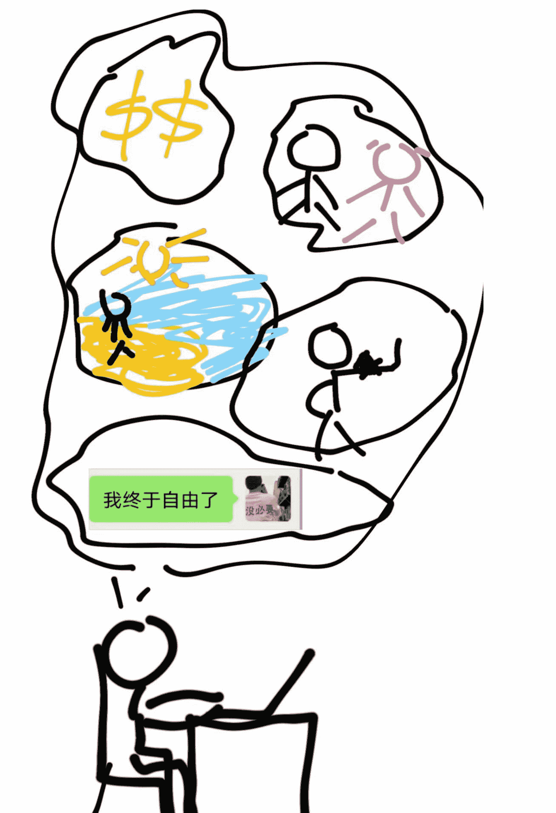

辞职以后，回到抚顺老家躺的这第 1 年就封城了，这时候我妈既庆幸我逃离了工
厂，但也对我的未来表示深深的担忧，她说，我这辞职是失业人士、无业游民、是
社会最边缘最底层的人员..几句话差点影响了我。

但得亏我事先做了这方面心理上的准备工作，

因为，【我是谁，由我自己决定。】

(现在 2025 年，我妈大大方方的给身边同事看我的公众号，看我写的文章，看我做的视频，人的定义还是自己搞出来的，同样是啥也不干，你在床上一躺，你没收入，你就是无业游民，你有收入，你就是小老板，数字游民 )

封城结束后，我先到沈阳来拜访我的一个老朋友。

## 6、第一次机遇：接触生财，是通过其他人。

这个人是谁呢？正好是我粉象 XX 的上级 @ 半条咸鱼，正好是因为我 2019 年左右，当时我在知乎四处找项目，成为他的下级，我们有了微信好友，后来聊了才发现，他居然也是抚顺的。

2022 年 10 月份那阵，他早就从程序员辞职，在沈阳呆着做线上项目了，从抚顺封城解封后，我先去拜访的他。

也是通过他，让我初次接触到快递 cps 项目以及生财有术，在他的展示下，我发现生财很多好的内容，而且还有航海，我一开始合计是个啥，结果是 199 元，就能带着大家一起做项目，几百个人能一起在一个群里聊一件事，作为圈外人，我没法直接参与这种航海，但这事儿在我心里埋下了信任的种子。

回去以后，靠着之前积累的引流经验，半年时间，很快我就让自己达到了每月接近万元的被动收入。

与此同时，我意识到知乎这种传统的图文平台，在视频平台的冲击下，流量明显在走下坡路，我果断转型选择了另一个图文尚且有一些流量的平台——小红书。

在抚顺研究了半年之后，跟随数名老师付费学习，花了万把块，走过无数弯路，才总算是做出了些成绩。

之后我通过老师的渠道，做了一些公开培训，赚了一些小红书培训的钱，此刻的我，是知识付费的收入 + 快递 cps 的被动收入，以及容错半年以上的存款，开启了自由之路。

于 2023 年 7 月 2 日，我和这位志同道合的朋友开启了旅居生活，那年夏天，我们选择离开沈阳去大理避暑。

> [走出门，迈开腿，多见人，总会有意想不到的收获]

公众号懒人搜索，懒人专属群分享

# # 公众号懒人搜索，懒人专属群分享

拜拜咯大理👋第一次旅居，做个简单小结

出来的这三个月，一路走过南京、苏州、昆明、大理、丽江、鹤庆、北京、济南...

有太多经历值得坐下来讲一讲了..

- 🍃烟雨朦胧的江南小镇...
- 🐕房车上办公，撸查理王小猎犬...
- 🏔坐着房车一路颠簸的开上者磨山，雨天俯瞰整个大理...
- 👈猫哥亲手做的嘎嘎好吃的土豆烩茄子..
- 🚶跟一群陌生人与世界断联，雨天徒步 16km 走到膝盖痛..
- 🍵去寺庙吃斋饭..
- 🛸在中国第一银村门口飞无人机..
- 😵‍💫每天睡到自然醒，天天 11、12 点起床..
- 🌙半夜出去 city walk，到洱海旁边看朋友捞小鱼儿..
- 🛵一起买了 3 辆电动车，4 个人一起往返 16km 外的古城，一路兜风..
- 🏊通过游泳和控制饮食瘦了 7 斤..
- 🏊从浅水区游泳菜鸟变成了养成运动习惯的深水区游泳菜鸟...
- 📸没有畏惧镜头，跟猫哥做了一场卖课直播..
- 📘两周从 0 起步做了一个 5600 粉丝的小红书号..
- 📘对小红书的理解更深，掌握矩阵号玩法...
- 💰实现月收入超过 x 万元，又立了明年收入的 flag..
- 🙋‍♂️见过太多比自己强的人，感觉自己才是最菜的那个..
- 🚶一个人旅行..
- ✈️说走就走的换城市玩..
- 🥩真正走通了边旅游边赚钱的路...
- 🤔感叹世界之大和人生更多的可能性..

期待下一站，
争取更赚、更瘦、更嗨。

> 最后，

“愿你我永不放弃对自由的渴望和追求，

无论经历多少艰辛曲折，都能同往自由之路。”

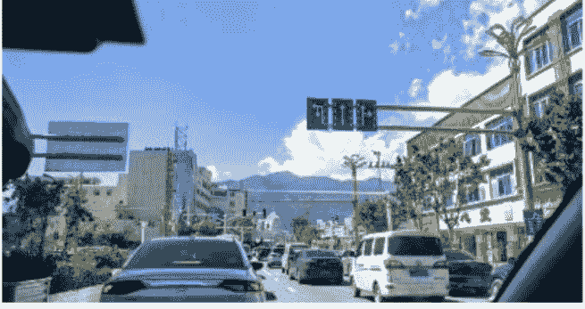

## 7、第二次机遇：出海？还是守旧？

大理避暑后，冬天我们去了海南，之后我们从海南自驾游到云南大理继续避暑，之后冬天从云南大理自驾游到青岛，决定冬天在青岛度过，这一路走过了苏州、鹤庆、北京、济南、丽江、大理、上海、苏州、长沙、昆明、澄迈、海口、三亚、东方、阳朔、桂林、广州、贵阳、徐闻、儋州、黔东南这些地方。

足迹遍布几十座城市。

（拍摄于自驾游路上 广西桂林 桂海晴岚）

这期间，我靠着日益下滑的快递 CPS 收入，以及零零碎碎卖课，基本维持了收支平衡。

当时路上有一站在杭州，甚至下午刚逛完西湖，晚上就回酒店给别人线上讲课。

这一路的日子相当惬意，但一直看不到收入的爆发点。

说来也巧，也就是在青岛过冬的这个时候，2024 年的 11 月份，我室友@半条咸鱼去参加生财的航海家大会，回来给我带来一个信息，就是【出海】。

没想到这个信息，直接改变了几个月后的我。

此时的我，还在做小红书 0 设备矩阵培训，倒也没有什么特别好的后端产品，正好还有空余时间我合计试试，赚老外的钱是什么感觉。

**我室友也准备干这个，于是我们决定一起干**，他跟我一起共享生财的信息，把他看到的学到的分享给我，靠着仅有的这些信息，我开始了我**的出海之旅**，通过达人秀赛道，31 天达到千万播放**，开通高级 YPP，顺利赚美刀**。

**但是事前**，我想象了很多问题，我在日记里记录下了当时的思考。

**以下是为我 2025 年 1 月 12 日记录的真实思考**。

**1) 事前分析**：通过 shorts 开通 YPP，需要 90 天达到 1000 万播放意味着什么？意

意味着我要做出 100 条 10 万播放的视频，
我真的可以做到吗？

真实情况：用不上 100 条，不能用线性思维思考这件事，中间某条视频爆了，2 天推个千万浏览是很正常的。
但事前，我是真准备做一堆 10 万播放的视频来的，先下场干，干着干着才会发现，想象的世界和真实的世界是不一样的。

2) 事前分析：这次生财一口气涌入 3000 人，门槛这么低，youtube AI 短视频领域会不会被冲烂？

真实情况：3000 个人一起做一件事，这个领域就一定会被冲烂吗？
理性的来看待这一大帮人，

有进来啥也不干的，有软件研究不明白就放弃的，有发了一两天就放弃的，也有做了半个月放弃的。

领域赛道也各不相同，有做动物故事的，有做宝宝走秀的，有做怪兽融合的，哪怕同为达人秀跳舞，画风、剧情、配乐等细节也各不相同。

甚至哪怕做了一个赛道的人，也有今天想试试这个，明天想试试那个的，最后啥也没试出来。

所以，真正能一起竞争的人，其实寥寥无几。

* 整个生财航海 21 天，中期打卡到第 12 天的时候，就已经成为 3000 人里的前 10% 了。
* 大多数人是不会动的，纯是图个热闹，随着时间的推移，自己就放弃了，没必要被这么多人吓到，甚至靠着打卡退押金都费劲。

3）既然还有 10 天，我可以找一篇分享开始模仿起来

事前分析：这次生财的航海是 12 月 5 日开始，还有十天左右，直接坐等生财航海吧。

真实情况：既然还有 10 天，我可以提前找一篇分享开始模仿起来，我第一个选择的赛道是宝宝走秀，我没有指望靠着这一个方向就能拿到结果。

* 我的思考是，目前的我是 0 基础，借这个由头，我能开始熟悉做图软件、做视频软件，各种提示词的修改，youtube 的上传过程，标题、简介该怎么围绕内容来写。

就像是假如我现在要学怎么做西红柿炒鸡蛋，那我是不是可以先从做黄瓜炒鸡蛋开始？

借着这个过程认识火候、认识盐、认识生抽老抽、认识切菜，学会打鸡蛋？

一样的道理，在起步的时候，我更在乎的不是结果，而是我能不能通过这个过程，学到一些通用的技能。

在我掌握通用技能后，如果我碰到了感兴趣的领域，我只需要学习新领域的生图提示词就可以，稍微花一丁点时间，立刻就可以起步。

如果想从一开始就选择一个正确的赛道，也许迟迟不会开始，时间全都会花在选择上。

没有人可以一开始就选对，对的东西都是在不断出错、出错、出错、出错、出错调整出来的。

4) 事前分析：未来 youtube 会不会打击 AI 内容？

真实情况：最近 3 个月没有打击，未来几个月甚至几年会不会打击，不知道。

但我不能因为一个可能不会发生的问题就不做了啊，既然，出海是一定要做的事，那就可以先从做视频入手。

如果真被打击了，让我找不到一丝一毫的方向，那么这次制作视频的一个月，何尝不是变成了我学习通用技能的过程？

5) 事前分析：提现问题，该怎么让美刀入账，如果不解决收款问题，账号做的再好也没用。

真实情况：为了解决这个问题，我第一时间进了两个大佬的社群，吸收过来人的经验，并且在网上寻找相关资讯，关于开通 YPP、收款提现的全流程，我有足够过来人的经验可以参考，这个问题迎刃而解。

6) 事前分析：我要进入一个完全 0 基础的领域，接触到的任何东西都要重新开始学习，过往知识全部作废，甚至未来 1-3 个月可能没结果，一分钱都赚不到。

真实世界：要用的软件基本 3 天就学会了，很多东西都是现成的，告诉你 1234 步怎么做，剩下就带着脑子去优化，不算困难，剩下漫长的日子就是不断地重复。
前期做出来几个垃圾视频，做上个五六条也该做出精品了，先完成再完美。
我个人感觉时间也不会久到 3 个月，真用心干的话，1 个月差不多了。

上面这些算是当时比较大的困难，还有很多小困难根本就排不上号了，网络问题、英语不好啥的..这些根本就不算事儿好吧？

我用亲身经历证明，干就完了。

放到 2025 年 8 月 29 日再来看当时的这段思考，真心发现很多想象出来的问题，根本不存在。

12 月份生财第一次航海，youtube 短视频没被冲烂，3 月份航海、5 月份航海、现在马上 9 月份还有航海，这么多人入场，依然不会被冲烂。

深海圈做出千万播放、亿级播放的，大有人在，哪怕不管过去多少年，我都相信 AI shorts 这个领域，都能出大爆款。

国内平台，风控越来越严，免费流越来越少。

出海的路，越走越宽，赚钱机会和方式越来越多。

## 8、第三次机遇：曹淦教练

也正是在我初次尝试方波妮教练写的宝宝走秀，开始探索试错方向的时候，我室友有一天跟我说，有人二十多天就开通 YPP 了，我说，这么牛？

那人是谁呢？

就是曹教练，这时曹教练终于“鼓起勇气”把帖子发在生财里了，也让我第一次见到达人秀这个赛道。

也让我知道，原来真有人，能二十多天就开通 YPP 了啊，这事儿，是可以一个月之内搞定的啊。

于是我立即开始动手模仿，并且在微信搜一搜，搜索【达人秀】寻找相关的文章，这一搜，就把曹教练的公众号给找出来了，然后立刻开始挖掘所有的免费内容，让我了解到他有个付费群（此群已不招人，也没人说话，此处无广），我选择果断加入。

868169460（电话号码），“没必要”。

2016 年 6 月 29 日 18:48 飞秒激光+SMA

2016 年 6 月 29 日 18:48 telle-0602

2016 年 6 月 28 日 12:39 868169460（电话号码），“没必要”，868169460（电话号码），“没必要”，868169460（电话号码），“没必要”。

既然向人学习，就要拿出来学习的态度，该有的付费肯定是得有的，只要你相信对方的专业水平，其实压根不需要对方做售前，直接干脆的转账就可以。

这本质上还是拿金钱买别人的试错经验，尊重对方的时间，这一点，是互联网最基本的潜规则。

懂的人，路越走越顺，越走越宽，合作机会越来越多。

不懂的人，处处碰壁，路越走越窄。

比起企业里应酬送茶送酒 拍马屁聊天的人情世故，在互联网上的交往，要简单干脆的多。

也就这个时间，我启动两个号开始做达人秀，感谢曹教练带我入了这个门。当时这一个多月，我们天天交流，基本都是我向曹教练请教经验，而此刻我的参考资料，就是曹教练的帖子，以及曹教练的经验参考。

这中间，

我不懂数据分析，我问他。

我不懂首尾帧怎么融合，我问他。

我不懂播放量为什么挂 0，我问他。

同时，

我总结出小技巧，我跟他讲。

我总结出 SOP 了，我跟他讲。

我新赛道拿到结果了，我跟他讲。

并且我不断公开输出自己做油管的思考和分享，通过我的有人情味儿的内容，更加深了我们彼此之间的了解。

这一来二去，我们就熟了，等我拿到结果的时候，就已经是 2025 年的 1 月份了，然后过完年就开始躺平，因为我发现做 YouTube，做的有点迷茫。

当时星球里正好有个人来提问，我感觉这跟我当时的状态太像了！！

我稍微有点泄气了，因为我发现 shorts 的流量，来的快去的快，我努力了一个月开通的 YPP，到头来，我跟稳定赚钱还是扯不上关系。

但这时候，还是曹教练，给我找了个方向。

二月份，曹教练给我看了个 AI 长视频 账号，我拖拖拉拉半个月，给搞定了，就是早期大家看见的达人秀猴子攻略，我也是第一个制作 AI 长视频 并且直接过万播 的创作者。

曹教练跟我讲，这个万播的长视频，相当于短视频做了百万播放，收益更是短视频的数倍不止。

我说这行啊，然后我就自此开启研究长视频的路。

三月份，曹教练办的 YouTube 私教群结营了，这时候出现了一个承接产品，YouTube 深海圈，有了之前的我们两三个月的交流，彼此互相欣赏，我选择果断加入。

曹教练看我有来深海圈的意向，问我要不要当教练，我说肯定来啊。

但其实，我先问了自己五个问题。

1) 我是否要把油管当作我近几年甚至未来永久的收入来源？它是否值得我继续投入精力？

答案当然是肯定的。

既然是肯定的，我必须找到更多的同行者，一群人聊一个事儿，进步更快。

2) 既然我拿这个赚钱，那我是否要做信息的孤岛？

目前全网都没有优质的 YouTube 资讯来源，深海圈几乎是唯一选择。

我有什么理由不进？

3) 我是否看好未来 YouTube 培训的发展？

当然看好，这在副业赚钱、甚至是创业领域，是相当蓝海的产品了，未来市场的想象空间极大。

4) YouTube 未来是否能实现我想要的生活？

答案是可以。

5) 做深海圈的，我凭什么不回报他？

懂得感恩，互帮互助，才能一起走的更远。进步就是你帮我一下，我帮你一下，你不懂的地方我来解决，我不懂的地方你

多指点我几句，彼此之间成长速度简直飞快。

真的，这就是个互帮互助的过程。

没多久，曹教练非常慷慨的赠送了我一张生财门票，今年我的生财门票，就是这么来的。

你说说，这又有货，又大方的曹教练，怎能不得人心？

在我成为教练了以后，我很快就意识到，深海圈能保得住我的未来，保不住我的现在。

这话该怎么理解呢？

就是，3 月份加入深海圈的我，可能走的就比新人快 100 步，前 100 步的坎，我能帮新人解决，那第 101 步的坎，没人能帮我解决，这个过程必须要自己踩坑，才能总结出经验。

3 月份的深海圈，还是一个小产品，它并不成熟，只能是走在最前面的人，一起撞了南墙，然后回过头给别人总结经验。

这个过程会浪费很多时间，如果有人能指点几句，其实很多坑是可以避免的。

所以唯一的解决办法，就是找经验更丰富的人来学习，这样我才能以绝对领先的速度走到前面。

准备拿一笔钱来学习同行

这笔钱该花的

深海圈现在是没有方向的船

能保得住我未来走的高

但眼下 得朝有经验的人学习

不然起步极其困难

是的 所以我们是准备拿一笔钱出来买的

买各种课

哈哈 那看来想一块去了

而且我更急不可耐

呃

不用这么急其实

确实没急到火烧眉毛

> 你一个月以前怎么不着急

过年躺平 得劲

之后我开始各种学习，曹教练甚至丝毫不吝啬的资助我去学习，比如当时我随口分享说，我欣赏一个挺有实力的大 V 开课了，售价 1500。

等他回复我的时候，没有一句废话，直接就 V 我 1500 供我学习，暂且不说这 1500 的课程现在来看到底有多么的割韭菜，就这份珍贵的信任，也不该被辜负。

而现在八月份，深海圈已经运营发展了半年，可以说，每过一个月沉淀的内容，都让深海圈的含金量提高了 1 分。

而我之所以能在这更大的舞台展示自己，跟曹淦教练的赏识，是分不开的。

## 【主动链接贵人，主动搜集信息，主动为他人提供价值，主动公开分享，路只会越走越宽】

## 9、更大的舞台

正式加入生财之后，很快我就发布了我的第一篇帖子

不仅获得了精华帖，还获得了三颗龙珠碎片，这下明年的门票也不用愁了。

后来，通过我的私下付费学习并结合星球里各路人才总结的经验帖，对于 YouTube 的认识，以极快的速度提高。

很快就打磨出了我的第二篇精华帖。

两个月以来访问次数破万，不仅收获了一颗龙珠，还收获了亦仁老大的 666.66 元的打赏红包，实在是受宠若惊。

现在，YouTube 长视频矩阵已经有了雏形，该踩的坑，几乎都踩了个遍，未来只会走得更远。

## 10、写在最后

我知道，看完我的整个故事后，有的朋友可能会说，不爱干就换个厂呗，或者换个行业再说呗，干嘛一下委屈自己 4 年。换个岗位也可以呀。

对此我解答一下，这个有很多原因

### 1、这个工作，虽然累，且没有成长空间，但是有钱，有闲。

这个钱，能支持我不断为知识付费，持续强大自己，并且每天都能抽出时间来学习。

白夜休白夜休休休

如此往复，无视节假日，整天浑浑噩噩，精神涣散，好在业余的时间比较多，能拿来做自己的事情。

而且 当时各种 3980、6980、999、1500、2000 的知识付费，真的全靠我的工资顶。

我记得我第一次交大额知识付费的时候，当时那课是 3980 元，我当月的工资是 3100 元，但是也果断付费了，这就是我对知识付费的态度。

对的，就藏在错的里面，压中一次，就能抹平之前的所有亏损。

### 2、我需要保持痛苦

我认为从一个地方离开，需要两个因素。
一个是驱使你前进的欲望。

这个让我前进的力，就是我的眼界，看到了更大的世界，
知晓这世上有人边旅游边收钱，活得轻松自在。
我想变的跟他们一样，这个欲望驱使我前进。

一个是防止你后退的痛苦。

这个防止我后退的痛苦，就是恶劣的工作 环境和生活状态。
我需要一直呆在这样的痛苦环境下，让自己持续痛苦着。
不然我害怕调到某个舒服的岗位，我就没有前进的动力了，

我怕自己被同化，我怕自己被留在这座小城，下班饮酒作乐，上班和同事以骂领导为乐。

谁痛苦，谁改变。

这样的话，驴子前面的胡萝卜挂好了，抽驴子的鞭子也有了。

两股力量缺一不可。

我知道有很多体制内的人想跳出来，想以我的故事作为参考。

对此，我给你四个建议。

### 1、辞职不是开始努力的节点，而是顺其自然努力后的结果。

国企离职并不像私企，走了就走了。

大部分人进入体制内都是很费力才能进去的，有沉没成本在里面，在认知、能力都没到位的情况下辞职，显然是不划算的决定。

我的建议仍然是，下班了干，利用下班后的空余时间，完成从 0 到 1 的认知积累。

如果你说上班忙，每天晚上就一两个小时能学习，辞职了就有更多时间学习，那你每天就熬这 1、2 个小时来学。

没有勇气，没有自信跳出来，你就拿这个夹缝的时间，做出些优异的成绩，到时你对你自己都有信心。

我也做不到每天都努力，我也经常性的浪费时间，但是没关系，只要一直在做就好

暂时不如别人不丢人，每个人的人生都有自己的节奏，丢人的是长期没进步。

### 2、路越走越宽的前提是，你一直在走。

现在你回过头来看我的这个发展历程，我真的是从一开始就准备赚美刀吗，还真不是，赚钱就是这样，一开始你想做的是 A，结果遇见了 B，但碰巧把 C 做好了，C 的高度带你认识了 D，结果 D 和 E 结合，让你通过 F 取得了结果。

没有人一开始就能碰到 F，就算早早碰到 F，以当下的认知也识别不出来，金子摆在眼前，都以为那是块黄色石头。

2016 年 8 月 22 日 20:00 你给我做不做教练

做

> 如果我不去琢磨网络赚钱，我就不会遇到我现在的室友，也不会遇到我的知识付费老师。

如果我没积累那些项目经验，我就无法独自把快递 CPS 做起来，没有被动收入我就不会出来旅居。

如果我遇不到现在的室友，我们现在就不会一起旅居，不会一起走过这么多城市。

如果我们关系淡薄，我就不会通过他了解到生财航海家大会的出海信息，我就不会做 YouTube。

如果我不做 YouTube......

虽然这种单方面归因有点不合逻辑，但真正感受过的人都知道，有些联系一开始就是非常微弱的，你把那些微弱的联系抓住，越抓越紧，各种机遇都会随之而来。

只要你不停的动，把手头的事情干好，戒掉眼高手低，公开分享，主动链接，勇敢试错，早晚会迎来你的一片天地。

### 3、为你好的建议，不一定是对的。

你知道在我辞职的那段时间都有什么声音吗？

外面大环境不好。

互联网都是虚拟的。

那你以后咋办啊。

辞职了之后干啥啊。

你怎么不懂得珍惜这份工作，外面多少人花 20 万都进不来，你怎么说扔就扔呢？

所有的声音，都是为你好，但从来没人考虑过，现在的工作到底适不适合你，你距离崩溃还有多远。

为你好的建议，不一定是对的，好和对，你一定要分清。

这句话我说了一辈子，这不也熬的快退休了。穷人家的孩子不上班谁给钱啊！ 😄

我知道这个过程很难，很难，尤其是之前从来没为自己人生做过决定，一路随波逐流的人，更难。

当你看着那些身边熟悉要好的人，关心你的父母、一起搞怪的朋友、质疑你的领导，困惑的亲戚，从他们口中当面带着情绪讲出的话，最容易让人动摇，也最容易让人内耗。

如果你和曾经的我一样，长期以来，都是乖乖的形象，讨好型人格，害怕得罪任何人，甚至觉得，把周围人全都说服了，是不是自己就能辞职了？

那你真是跟我拐进同一个【老实人】的坑里了。

如果你真这么想，我建议你看两本书《被讨厌的勇气》《不做情绪的奴隶》，
把这两本书翻烂。

没有特别好的解决办法，先从书中认识课题分离，拥有自己的独立人格吧。

这种时候，必须有你自己的判断。

现在，我只问你一句，谁？为你的人生负责？

是谁？承担，选择的后果？

既然是你来承担后果，那凭什么让别人给你做决定？

### 4、以终为始的思维。

你会发现，从 2020 年，我写下那个梦想开始，我做过的所有尝试，都是在努力靠近这样的生活状态。

我做知识付费，是为了能边玩边收钱。

我做粉象 XX，是为了能边玩边收钱。

我做 YouTube，是为了能边玩边收钱。

我从没想过我应该开店，因为店会把我栓在原地。

我从没想过我应该边上班边做副业，因为收入提高我也不会自由。

我从没想过我应该从早工作到晚，因为必须腾出来时间好好生活，哪怕只是打游戏。

从我见识到更大的世界，见识过别人是怎么活的，我就知道，我也要活成那个样子。

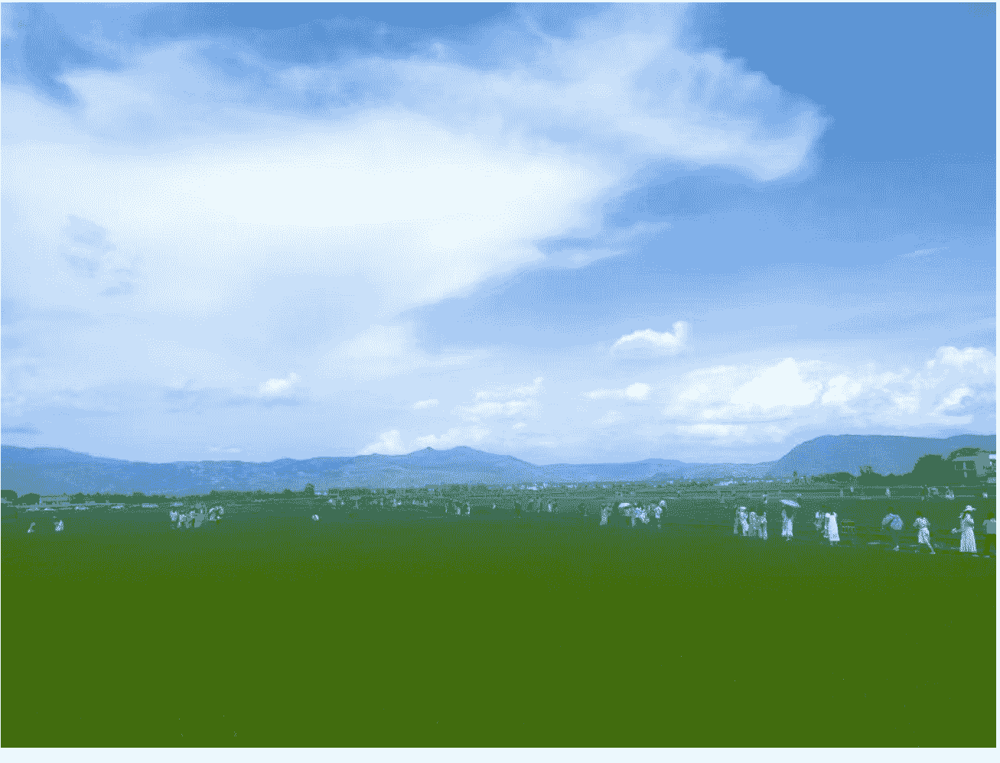

那么你的梦想是什么？

我知道能看到这里的读者，很多人只是想多赚点钱，还没想过改变生活状态，那么你想赚的是什么钱呢？

被动收入？

主动收入？

- 每天工作几小时？
- 创意性工作还是重复性工作？
- 可不可复制？能不能自动化？
- 想不想请员工？
- 后期能不能解放你的时间？
- 你喜不喜欢赚这份钱？

问题多了，思路就清晰了。

像我自己，我就想赚被动收入，我就想边玩边赚钱，吃着饭也不耽误我赚钱。
我此刻每天的基本工作就 2 小时，我做两条长视频，然后我就打游戏去了。
我不喜欢创意性工作，只有重复性工作，才能实现自动化。
也许后面会请员工，但数量也绝对不会多，因为我懒得管。
天天十一点十二点起床，已经两年多，想几点干活就几点干活。

...
YouTube 正好就能实现，那我能有什么理由不干。
YouTube 长视频的弱画面 强文案的领域，正好合我的心意，那我就去研究。

正是因为 YouTube 恰好能更好实现我的终局目标，所以我选择了这个方向。

甭管在 YouTube 里是做 shorts、做带货、做长视频、做直播又或是其他，这些都是形式，都只是用来实现某种生活状态的手段。

沉溺于形式，就会忘了自己的最终目标。

这个过程也许一开始，你看不清楚，这没关系，随着你深耕一个方向逐渐进步，对于什么样的形式能实现你的目标，你一定能看得清的。

以终为始，每一步操作都朝着梦想靠近，不出几年时间，贵人与财运都会围绕在你身边。

最后再强调一遍，我的个人经历仅供参考，我在辞职前，看了非常多关于从体制内辞职的知乎回答和 B 站视频，我发现一个人适不适合从体制内辞职，是没有标准答案的。

银行辞职、土木辞职、工厂辞职啥的，我都看了。

每个人的情况都不一样，这个答案，只能你自己去找，不会有人坚定的告诉你，你就适合出去大干一番。

有的人就喜欢安稳一点，在一座小城里每天逛逛街，哪怕日子重复一点，有简单的幸福就好。

有的人，就认为这日复一日的重复，是一种折磨，是一个看不见的监狱，就一定要走出去看看。

甚至 20 岁辞职、25 岁辞职、30 岁辞职、40 岁辞职，面临的各种情况、考虑的方向也不一样。

谁都没错，每个人都有每个人的选择。

但你必须为自己的未来负责，根据自身情况做出选择。

这样，才能过出无悔的人生，加油吧，陌生人。

最后，愿你我永不放弃对自由的渴望和追求

无论经历多少艰辛曲折，都能同往自由之路

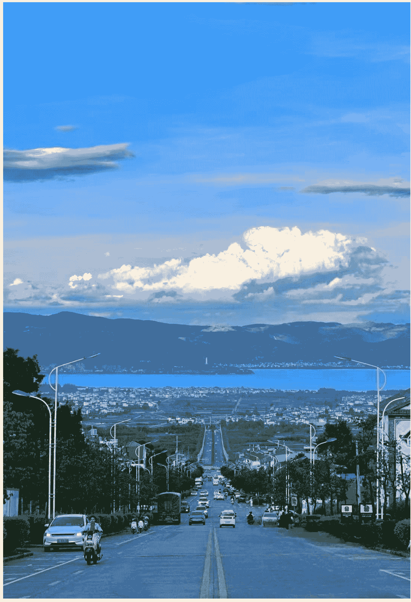

(拍摄于云南大理)

最后，安利小懒的付费群：

懒人专属群

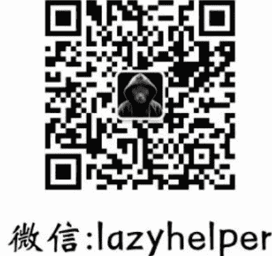

懒人专属群持续更新中，已持续运营 6 年，整理超 3000 份各类精选付费文章&年费社群干货，全部开放下载。

### 懒人专属群更新记录：

https://lazy2025.top/blog/record2

### 懒人专属群更新记录（需梯子，备用）：

https://lazybook.fun/blog/record2