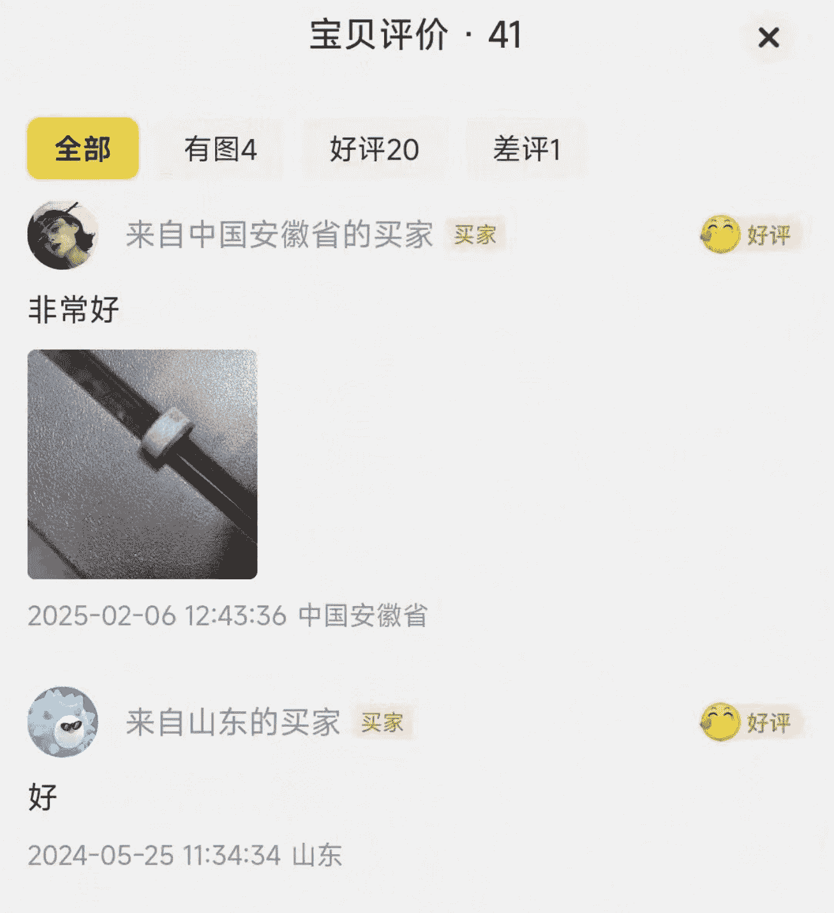
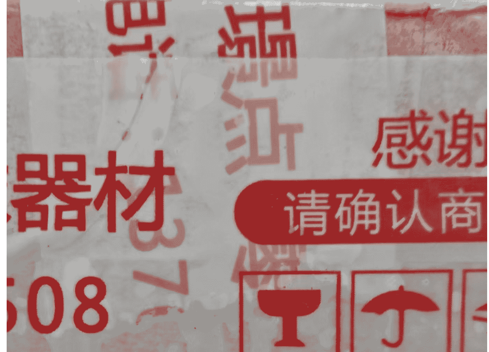
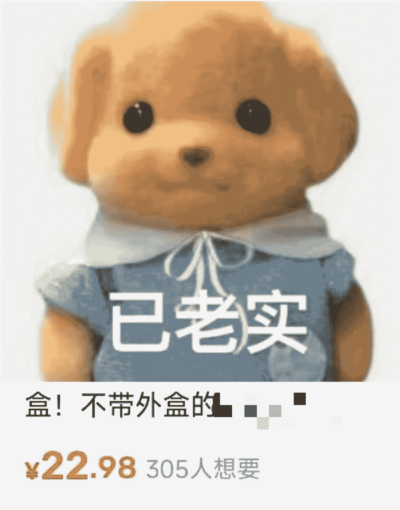
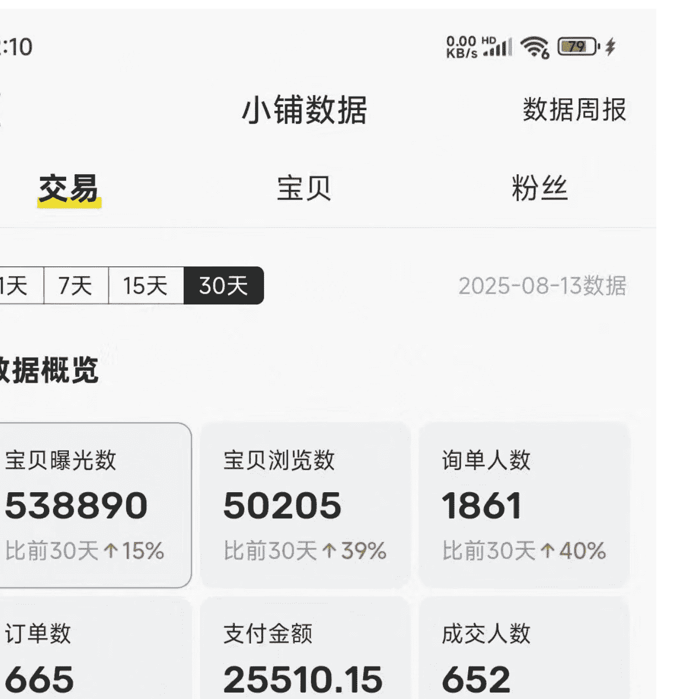
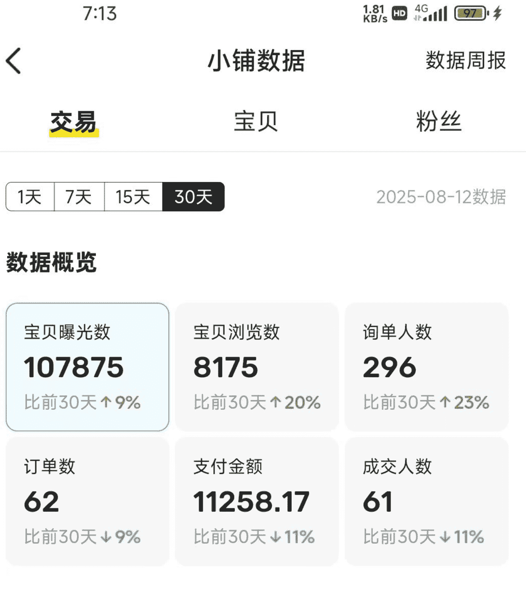

# 卖 100 赚 80，闲鱼高利低本玩法详解

250901 生财精华

公众号懒人搜索，懒人专属群独享

懒人微信：lazyhelper

如果大家买东西习惯性的提前去搜闲鱼，你会发现很多产品要比正常价格低很多，发现几个是正常，发现一堆，那就是有利润可图咯......

我会尽可能的详细写出从发现机会--找产品--找厂家--面对不同人群差异化销售--放大利润的全部过程，相信你也会发现你爱好里面的那个下金蛋的鸡

## 一、价值 3 万的一次搜索

近两年爱好打台球，之前分享关于利用爱好赚钱，这次还和这有关，打台球球杆比较贵，换的少，但是皮头确实是一个很大的消耗品，最开始我用小头杆，小头杆皮头口碑比较好的是 X 品牌皮头（X 品牌我不指出了，不太好），单价要 100 一个，拿把刷子的，这多贵啊，我去闲鱼搜索——X 皮头（如图 1，皮头是使用在红圈位置）

*   全部
*   价格
*   描述不符包邮退

*   北京
*   描述不符包邮退
*   24 小时发货

搜出的价格比正价一半还要低，我惊讶的同时十分好奇，于是准备买两个试试看，万一我也能卖呢？

**小重点与技巧**：根据爱好多多搜索，多对比，通过搜索发现适合自己的机会

## 二、找货源，看样品，卖货

产品回来使用后，发现和之前买的 100 的没啥区别，就是正的莆田版，于是我恶补了一些皮头方面的常识，准备卖皮头。

（有的人总纠结自己对某类产品懂得不够多，不敢去尝试，你只要去卖，你就会在最短的时间内了解这些产品，会有买家逼着你去了解，别着急，你会越来越了解的）

1.  **初始阶段——同行拿货**

挨个同行问，要实拍视频和正品对比，分别对比价格，便宜的和贵一点的都搞一个，回来看看差别，老夫回来发现都是 一毛一样，啪啪给自己两个巴掌，去找同行谈价格。

这里有个误区，低价拿货不是靠一次性的数量，更重要的是持续，为啥这么说，我开始有很多供货的人，第一次谈的时候不管多大数量，价格都没有持续拿货后的价格低，考虑到咱是个小菜鸡，不敢要的多，第一次 10 个，便宜一些，卖完了，再来 20，又便宜了，然后在 10 个还能再谈，就这样一点点磨，价格会慢慢变低，这帮小子坏的很，我从未碰到哪个人一次就给底价的，大家多留意

哦，对了，如果自己懂测试一下好与坏更好，毕竟是你爱好所在，分辨好坏没问题，就拿这皮头来说，简直就是没区别，全新正品外面拿货 60 多，去掉厂商，品牌商，代理的利润，这个东西的成本都一样

# **小重点与技巧：** 别太实在，少量多次拿货，确定是市面最低价，可以多拿，对于厂家来说，持续进货的客户更加优质，也就得到了更低的价格

## 2. 进阶阶段——源头拿货

我们进货后发现，怎么还有人卖价比咱进价还便宜呢？是不是我们拿货的人也是分销商而并非厂家呢？

我们假设他是厂家，一般一个厂家只能有几个流水线，若你发现你的上家皮头，手套，枪头，等等全都有，那他很有可能就是分销商，进一步验证，当你卖一套下来段之后，你知道哪个型号好卖之后，你管他要不好卖的型号多要点，让你等的基本都是分销商，因为不好卖的他不会屯那么多货，

好，现在我们知道这小子他和咱一样，那怎么跨过他呢？找到源头厂家，获得更低的拿货价格呢？要不好卖的款，或者你有一些量，多要一些，这时候大部分人会直接从他的上家发到咱这，（或者他的上家还有上家，那就如此一层层扒）

#### 2.1 包裹上有信息

上家发来的包裹，有他们的信息，比如发货人电话，或者胶带上有电话，还有上家留纸条的，直接打电话联系他，加微信说话费力，先打电话，说清楚情况，大哥啊，我终于找到你了，我一天卖几十个啊，这小子给我 25 一个啊（实际 30），我在你这拿，你可得给我便宜啊，大概这种，然后加微信再拿，还是分析是不是厂，然后再定数量，别把鸡蛋放在一个篮子里面

#### **2.2 包裹上没信息**

## #### 2.2.1，贿赂快递员

让快递员通过物流单号查那边合作的卖家，你这这边派件的快递员不行，就找揽收那边的快递员，多联系，没有红包解决不了的问题。

话术编一下就行了，比如我之前买过这家东西想进货找不到店铺了，麻烦帮我找一下商家的联系方式，我的商品有问题等等

## #### 2.2.2，地毯式搜索

如果上述都没有成功，你只能一个个看，不管哪个是厂家都会有销售端，唯一难度就是分辨，你可以把这个产品的几乎所有的销售店的人的微信都加上，去看这些人的朋友圈，货杂的就是分销，而经常晒厂子货的，底料的，量大的基本就是厂家，而怎么从厂家拿到低价，还是上面所说，少量多次，多磨

# 小重点和技巧：

*   1. 可以用这个方法找你其他产品的源头，提高我们的零售利润
*   2. 一定用另一个电话和微信去操作，不然如果上家就是源头就尴尬了，或者那个源头和你上家沟通这个订单的事情都不好，有合作，闹僵不好
*   3. 即使你找到源头厂家也不一定拿到最低价，还要看一点缘分和运气，不要太强求，利润也不差那几元

## 三、高阶阶段——自己就是货源及放大

在你实操的过程中，你会接触更多信息，单价 100 元小头杆皮头，还有 200 多的大头杆皮头，巧克粉，进口的高价皮头手套之类的，这些都是你的可能要卖的产品，你完全可以自己做或者找厂给你代工

# ## 3.1 注重账号评价

虽然产品使用和外观都没啥问题，但本质还不是真的，有人要退就给退就行，别太死板的，偷偷挣钱为主，这个差评影响比正常的差评稍大一些。（若已差评也不用太担心，自己多补几个好评，提高一下好评占比）

# ## 3.2 定做自己的产品

*   - 3.2.1 一些品单价很高，可以找厂子做一样的款式，低价售卖，蹭正品的流量
*   - 3.2.2 你也可以做属于你特有的莆田版产品，提高自己的利润
*   - 3.2.3 品做好，可以多平台售卖，一鱼多吃
*   - ( 一些人专门在抖音快手直播做，单量比较大，就是挂的比较快，号多的可以尝试 )

# ## 3.3 引流私域，钱快，烦恼少

1 ) 很多爱好者，用过这些产品，知道产品的性价比，会继续复购，发货的时候或者聊天的时候承诺送礼品或送虚拟台球课程的，加到微信

2）很多经营者，用过这些产品，知道产品的性价比和利润，会复购一批，在球房卖

3）一些同行也会来拿货，你自己的产品就能发挥大优势了

这些到私域，不用担心评价，不用解释问题，收钱发货就好了

+   ·
（晒两个私域成的高客单，利润 75%）

+   小重点和技巧：单价越高越好操作，找到自己不可代替的点

## 四、消费人群及营销技巧

货源问题解决了，下面就是销售的历史性难题，卖给谁，怎么卖？

台球越来越火，买家会越来越多，面对鱼龙混杂的市场，最难的是如何获取信任

# 1. 低价（感受消费人群）

[0.35][这个价格]

¥48 1045 人想要

盒！不带外盒的 [0.84]

¥22.98 305 人想要

因为产品和真的几乎一样，你标低价很容易获取流量，转化也容易，两种低价便宜的的批发单比较多，贵的利润要更高，这种就是最简单额销售方法了，俗称有手就

行，谁来谁赚钱，最容易出单，你可以搞低价感受一下消费人群画像，

试了一段时间，人群大致分为：爱打球的大学生（技术初级），爱打球的普通人（技术初级以上），台球器材批发商

这些在买家和你聊天的时候，你点一下他的主页，基本就能分辨的出来，知道人群我们准备对应的话术

1）技术初级的人，总喜欢被动，你最好能说明他什么杆子用什么皮头，用什么巧克粉，你表现的越专业，你用的装备越贵，他们就越信

2）技术初级以上的，你要讲一些专业性能，大致表现等等

3）批发商分两种，一种是专卖台球器材的，他们有时候需要真假混发提高利润，还有一种是台球厅批发，卖给会员提高利润的，这些都比较简单，实拍视频一发，谈谈价格就可以成

优缺点：容易出单，利润较低，新手练手
非常合适

# 2. 不同人设--提高单价

不同人群，不同价格，更好销售，更方便提高利润

# 1 ) 个人闲置（单价高）

( 利润大概 lw 左右 )
这是最容易出单，最被信任的人设

主图自己找，或者实拍也行，越真实
越好，然后可以做几个购物截图备用，网上很多

当然了，你也可以说是别人送的，球房比赛赢的，直播间中奖得到的……等等，理由随你想

这里一般问的最多的问题就是是否是正品

你说是正品啊，但是我自己不知道怎么辨别，我给你录视频你自己看一下，没问题你在拍，你也可以找人去问问真假，这种拍下回去假如有问题，也是他自己确认好自己下单的，真有维权问题也好解决，都有证据（非要退就退了，别搞太多差评）

拿出你的购物截图，告诉他这是在哪买的，截图的订单号等信息记得打码，然后他如果有问题你可以去问官方那里问他的问题，记住一点很少有客服给自己找麻烦，所以你说在他家买的，客服都会说那是正品没错，因产品的批次不同所以商品有所差异，然后你截图给买家看

学点台球的相关常识，不会的就去抖音搜，几天就会的差不多了

优缺点：单价高利润高，对询单转化要求比较高，可以分别开两个店与低价方式一起操作效果更佳。

# 3 ) 台球器材店

407 人想要 | 3337 人浏览
2 种大小 | 3 种尺码 可选
正品保证三重防伪假一赔十，随便验货
目前国内热度最高，因其性能，价格。受到众多职业球手一致好评！！！
全国最低价
1 颗

这种呢，更容易出现大单，但是聊天相对困难，需要的相关知识要更多一点，而且这种店呢，因为人群相对垂直，所以店铺的活跃度要更好才容易出单，店铺你要自己优化动销和评价，也就是要给自己来一些好评，每天都要用这个号买点，再卖点，只有活跃度高才容易出单

器材店呢，你就说所有商品假一赔十这种，别害怕别人找麻烦，实际上市面上卖东西这人的产品基本一样的，这就是噱头，真有售后问题，大不了就给人家退款就行，小问题，你始终记得你高客单一单的利润发两个还是挣钱的，很多问题你就不怕了，大不了补发嘛，

店铺的链接要多，不仅仅是皮头，别的器材店有的东西你也要有，但是咱们主要利润在小东西这块，所以可以把别的器材店的商品，咱们加价一点放自己店铺，比如别人店 700 的前支，咱们 750 挂上，不议价，发出也还是挣钱的，主要是让人信服，咱就是大的器材商！人设要打好

# 4 ) 台球相关人员

(找人录得视频，做戏做全套)

你可以是助教，可以是球房老板，可以是球房的经理，或者是台球的极度爱好者，这样你能接触到的资源就多，所以你有点便宜的货很正常，你是有点东西闲置卖，还是有一小部分批发都比较合理

# 小重点和技巧：

*   1. 个人闲置的方法最好出单，做购物截图时，最好截图的数量不是一个，比如一单你买了 2 个以上，然后上架闲置售卖的时候，如果卖出去一个，链接还在卖就没什么问题，不然那些捡漏的人就会来问，你就一个皮头卖了之后怎么还有啊？等等一堆问题，你还要挨个去解决

## 五、如何 100% 出单

嗯，这是我测试了几个月的结果，本来这个初稿很早就好了（嗯，是我懒的事，后面是借口），但总感觉差点什么，补一个如何确定出单

#### 4.1 心态问题

大部分人在新接触的产品上总是胆怯，不敢做，怕不懂，记住一句话：先上架再说，在买家的逼问下，你会在和很短的时间内了解产品的绝大部分知识

#### 4.2 实操问题

只要这个产品有 3 个以上的同行每天有出单，那你就会一定会出单，不是可能，是一定！

选好这个品之后，用不同的主图，不同的标题关键词，去大量铺链接，一定会出单，很多人选好这个品只上了一次，没结果就放弃了，把精力用在选择下一个品上，白白浪费了选品的精力，选品都没有问题，问题就出在你的链接数量上，别想着什么奇技淫巧，用数量对抗概率，一定会出单

#### **4.3 执行问题**

找自己可以坚持做的品类去做，大家总喜欢说 3 分钟热血，现在很多人只有 3 秒钟，有的学员和朋友，我产品和主图都怼脸上了，一天都上一个链接，对不起，你没有资格说流量不好

## 六、实操建议和踩坑指南

你看我巴巴的一顿说，好像挺好操作，其实坑也是不少

+   1. 初次拿货少拿，初期拿货贵，销量少，尽量别压货，容易影响心态
+   2. 碰到真假问题，别吵，大不了出运费让退回来，有的人不管啥样都嘴臭，控制好自己的情绪，你的目的是卖货挣钱且维持住店铺的好评率。
+   3. 进货时候多留心眼，一定看好实拍视频，有人可能给你发 A/B 货
+   4. 聊天咨询的时候不卑不亢挺重要，别整电商客服那样，亲啊，不好意思啊，一副求人下单的样子，就平等沟通就好
+   5. 上架的品要多，然后自己可以找同行或自己操作动销一下，优化评价
+   6. 惊喜后置，好评如潮：卖出去的每一单可以自己加一点赠品，比如你正常就一个皮头，但是发过去的时候你带了一个台球的钥匙扣或者球星的签名，还有进货便宜的台球用品，卖之前不说，让买家直接收到，莫名的惊喜会让你得到更多的好评
+   7. 有批发拿货的记得他不要的也送几款，等他收到告诉他，送他看看，需要来批
+   8. 多加一些同行微信，你会了解当下爆款，也可以在他朋友圈盗图，毕竟闲鱼上好图都被盗烂了

## 七、如何系统的找机会

**1. 练气阶段**

我们什么都不懂，纯小白，根据你的喜好去搜索，没有喜好就看广告，看下什么产品在被付费推广，看下当下热门的节目和比赛，什么比较多，奖金比较大，这些都是机会，就像台球，恨不得天天比赛，奖金更是高的离谱，为的就是热度

发现机会之后少想，找到几个差不多的同行直接照抄，先做在优化，别想了一年零一夏，最后一个没上架，如何找合适的同行照抄呢？

> (找一看就觉得菜的同行，你会想这样的都能挣钱，我也能，嫌弃谁，就模仿谁，超越谁！)

# 仰望视角，就是学习

# 2. 筑基阶段

这时候我们已经做的小有成色，我们更多的精力不是再去发现新的机会，而是要做的更好，去学习我们的同行，为什么他这个品卖的好，主图，文案是那一部分吸引了买家，去阅读他的评价，好评的点都要加在自己的技能点上，差评的地方我们绝不犯。

# 平视视角，就是吸收

# 3. 金丹阶段

这时，你已是一些人仰望的存在，那些块八毛的利润咱就别抢了，外面散修太多，如何让练气和筑基阶段的人成为咱们的分销商是提高利润的又一节点，那些不可替代的产品是你绝技，那些店铺矩阵是你的阵法，把你的优势品，你的利润分出去，分销的人多利润就多

# 俯视视角，就是给予

## 八、比赚钱更有意义的事

请你一定努力降低自己在工作生活中的道德标准和情感标准

开始卖货总是执著于主观上的产品好坏，自己跟自己对抗，耗费了太多时间和精力，其实用户对产品质量没有很大的感受，因为没有参照物，用户对于产品的质量好坏的评判标准只有一个，用完很久就坏了等于质量不好，用了很久还没有坏等于质量好。

也就是说用户在收到商品之前对产品质量好坏的感知完全是依靠我们去营造，去表达，去烘托。

当然我分享这个经历不是鼓励大家去做 A 货，而是不管在什么行业都有那微小的机会可以捕捉，在同行对售后置之不理的时候，我们可以积极处理，让买家用到好用又便宜的产品，何尝不是良币驱逐劣币

请减少内耗，一点一点把眼下这点事情做好就够了，你远比你想象的更有实力，

真切的希望所有读过的朋友都能在娱乐中赚钱，体会双重快乐

俺是东北的安之兄弟，欢迎大家来广州找我打球，我送你皮头......

祝好，安之

最后，安利小懒的付费群：

懒人专属群

📚
懒人专属群持续更新中，已持续运营 6 年，整理超 3000 份各类精选付费文章&年费社群干货，全部开放下载。

本资料为付费群内部分享，仅供真实有需要的朋友查阅🙏

# 懒人专属群更新记录:

https://lazy2025.top/blog/record2

# 懒人专属群更新记录（需梯子，备用）:

https://lazybook.fun/blog/record2