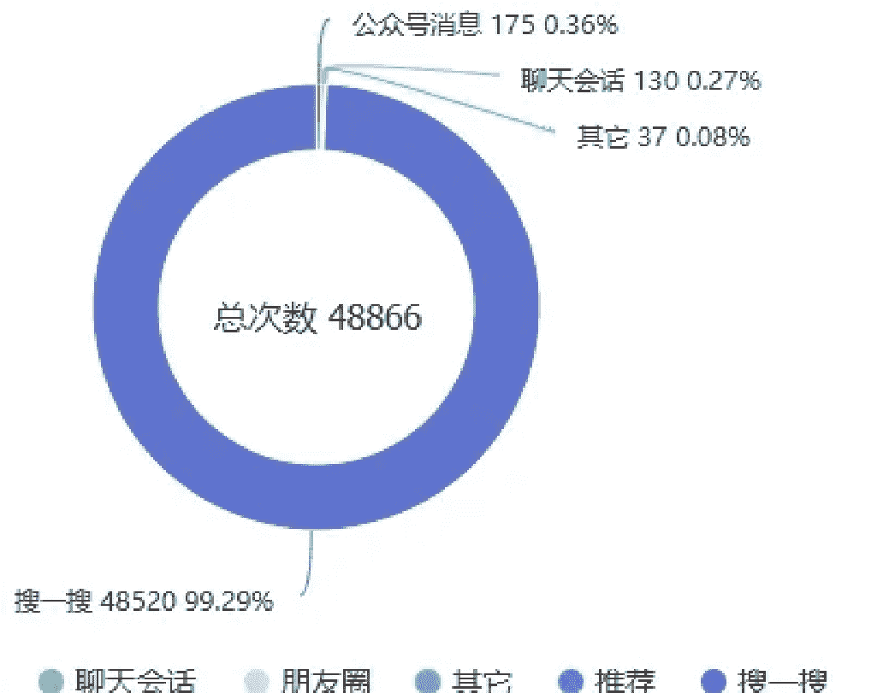
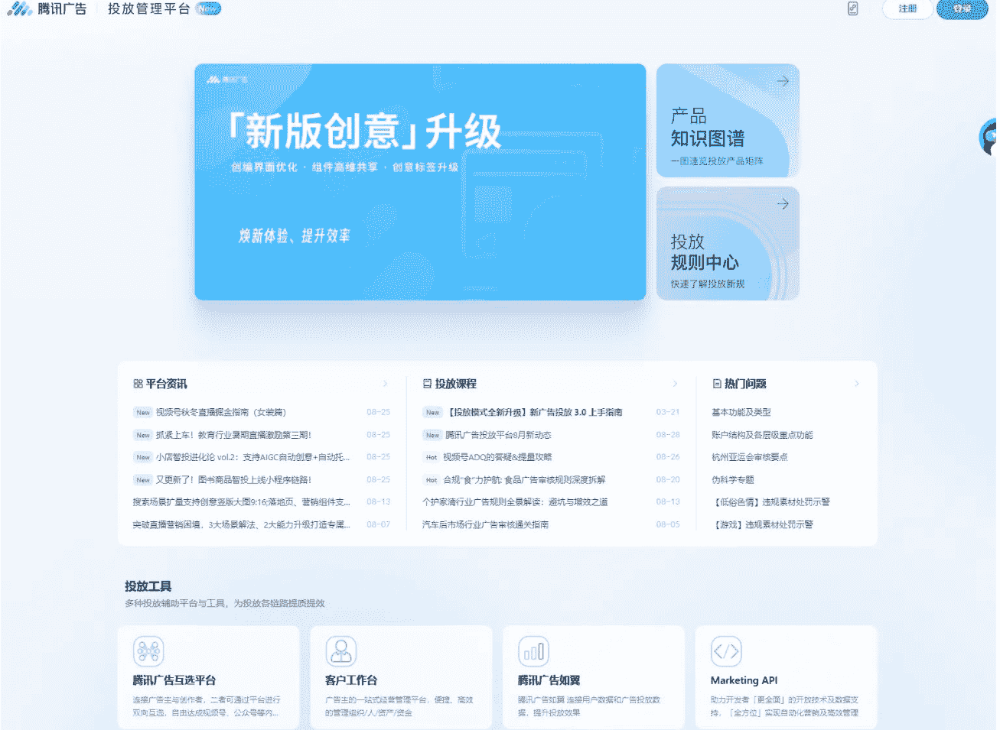
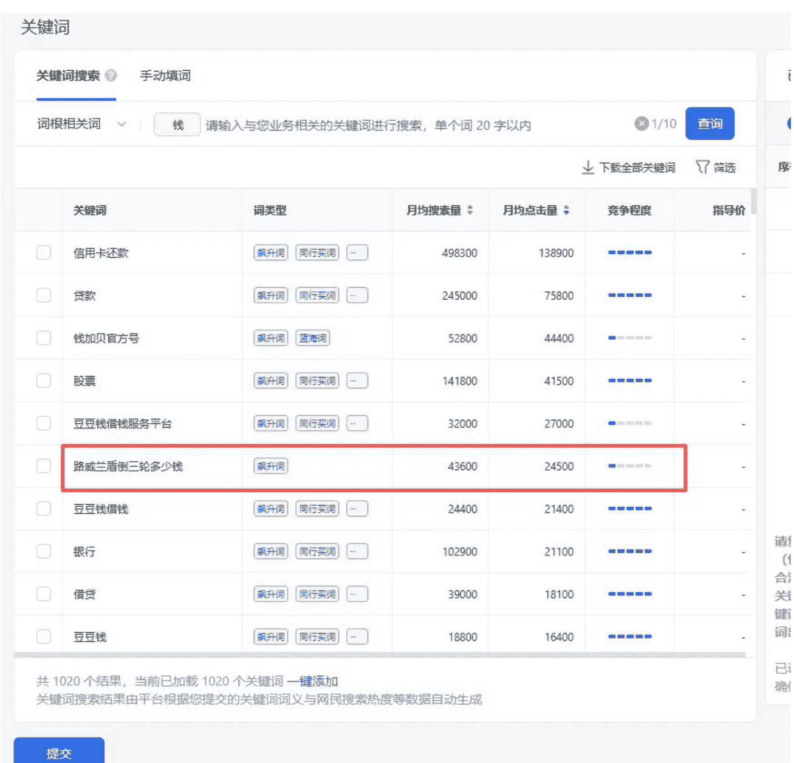
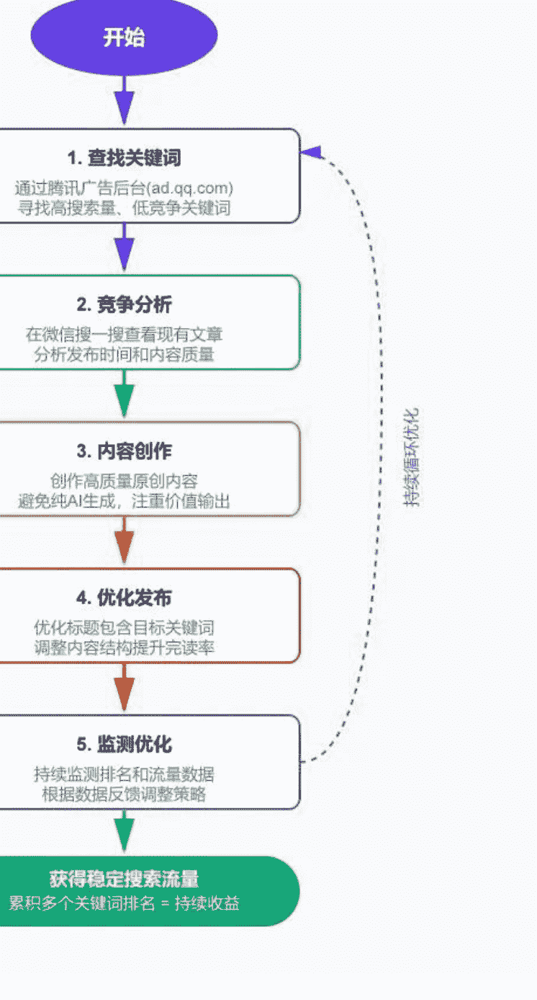

## **流量主变现的另外一条路——搜索流量**

250901 生财精华

公众号懒人搜索，[懒人专属群](https://fwh.zsxw.com/) 独享

懒人微信：lazyhelper

说起流量主，大家第一反应都是做公众号的爆款文章，然后靠进推荐池拿流量，进而获取收益。这确实是目前的主流玩法，很多人也在这条路上取得了不错的成绩。

但实际上，还有另外一条路，就是做搜索流量，靠“搜一搜”来获取流量。

这两者有什么不同呢？让我们对比一下：

推荐流量需要抓住用户的情绪，让用户看到标题或图片后点击进来，或者追逐某个热点。这样的流量可能不太稳定，今天爆了明天可能就没。而且在进入推荐池之前，基本是没有任何收益的，只有进池后才会有收益，这个过程充满了不确定性。

搜索流量则完全不一样。搜索流量因为用户已经有明确需求，去搜索时是带着问题来的，所以流量比较稳定。打个比方，推荐流量像是在大街上发传单，而搜索流量像是客户主动走进你的店铺。

尤其是我们在选择内容时，有工具进行数据参考，能够清楚地看到哪些关键词有人在搜、搜索量有多大。

这样我们在选题的时候就不会迷茫，不会只能“找对标、模仿对标、再找对标”，然后写完文章后忐忑不安地等待数据反馈，不停地测试才能够慢慢找到感觉。

而有了数据支撑，你会很明确地知道我做这个内容是可行的，是有人搜索的。只要我提供的内容质量足够好，能够获取到比较好的排名，这个流量就一定会到我的账号里来。它是一个确定性很高的事情。

很多人对于搜索流量的理解可能比较片面，觉得搜索流量应该只有几个、几十个，流量比较低。但实际上，如果你真的做好了，它的流量并不低。我们可以看一下下面这几张流量图表。

公众号消息：151 (0.76%)
聊天会话：70 (0.35%)
其它：59 (0.30%)
总次数：19865
搜一搜：19568 (98.50%)
公众号消息，聊天会话，朋友，公众号主页，其它，推荐，搜一搜

公众号消息：253 (1.50%)
聊天会话：4 (0.02%)
其它：47 (0.28%)
总次数：16879
搜一搜：16573 (98.19%)
公众号消息，聊天会话，朋友圈，公众号主页，其它，搜一搜

公众号消息：136 (0.81%)
聊天会话：55 (0.33%)
推荐：47 (0.28%)
总次数：16862
搜一搜：16584 (98.35%)
公众号消息，聊天会话，朋友圈，朋友，公众号主页，其它，推荐，搜一搜

公众号消息：205 (1.27%)
聊天会话：22 (0.14%)
其它：44 (0.27%)
总次数：16089
搜一搜：15813 (98.28%)
公众号消息，聊天会话，朋友，其它，推荐，搜一搜

有的人可能会说，这么点流量也不高啊。按照平时的计算方法，1 万阅读也就十几块钱，4 万阅读也就 40 多块钱。

但实际上，推荐流量和搜索流量的单价是完全不一样的。因为搜索流量进来的用户价值更高，他们更精准。

为什么这么说呢？

我们知道，ECPM（千次展示收益）考察的是完读率、点击率，还有广告的拉取和展现率。像这种有明确需求的流量，它的完读率特别高，跳出率很低。而且，用户会认真阅读，让文中的两条广告和底部广告都能够充分展现，因此它的 ECPM 值要高得多。

比如说，下面这个收益案例，这是文章发布后 7 天的数据，只有 1.3 万的阅读量，但实际上它的收入已经将近 1000 块钱了。相当于每千次阅读收益达到了 60 多元，是普通推荐流量的好几倍！

### **分广告位累计收入占比**

- 底部广告 159.69元 16.71%

- 文中广告 796.08元 83.29%

而且，只要我们的文章排名稳定不掉，流量就是持续的。也就是说，如果你的账号有 20 篇文章的排名都在第一，你就能持续获取这 20 个关键词的流量。

所以，搜索流量是有累积效应的，不像推荐流量，今天发一篇明天就没流量了。搜索流量是一个稳定的、可持续的收入来源。

因此，即使单篇文章的流量看起来不高，但累积起来，整体的流量和收益是很可观的。这就像是建立了一个个小型的“流量资产”，每天都在为你产生收益。

| 总收入（元） | 底部广告（元） | 文中广告（元） |
| :--- | :--- | :--- |
| 932.99 | 123.47 | 809.52 |
| 904.99 | 119.31 | 785.68 |
| 1,083.28 | 164.68 | 918.60 |
| 1,054.90 | 149.96 | 904.94 |
| 848.78 | 118.91 | 729.88 |
| 724.11 | 112.18 | 611.92 |
| 689.48 | 106.68 | 582.80 |
| 519.34 | 92.24 | 427.10 |
| 657.37 | 96.42 | 560.95 |
| 665.63 | 104.06 | 561.58 |

相信看到这里，你也想要了解到底怎么来做这个搜索流量。其实方法也比较简单，我们需要用到一个腾讯官方的工具——ad.qq.com（腾讯广告平台）。

无论我们做什么内容，使用官方的广告投放后台查询到的关键词数据是最准确的。既然我们要做微信的搜索流量，那么就要用腾讯广告推广后台来查询数据。这个工具可以用个人资质免费注册，主要是用来查询关键词，不需要充值。

如果有公司资质的话，用公司资质注册会更方便一些。

注册后，我们创建搜索推广计划，然后选择关键词工具，输入想要查询的词就可以看到详细的数据了。

这里我给大家举个例子，比如查询“钱”相关的关键词。可以看到，下面有很多搜索量和点击量都比较高的长尾词，而且竞争程度显示为“低”。

这种词就是我们要找的“黄金关键词”——有搜索量、竞争小、容易拿排名。我们针对这些词来编写标题和内容，就很容易获得好的排名和稳定的流量。

拿到关键词以后，建议先去微信搜一搜查询一下，看看这个词目前有哪些公众号写了相关文章，竞争情况如何。

如果发现相关文章很少或者都是很久以前的，那效果会更好。为什么？因为我们新发布的内容属于“信息增量”，这是平台乐意看到的。平台会优先展示新鲜、及时的内容。

### **2025 款路威兰盾价格 29.9 万**

路威车队小型聚会，2025 款路威兰盾价格 29.9 万 #摩托车 #机车 #路威兰盾 #大摩托 #路威蓝盾

### **路威兰盾大摩托，网友直呼是见过最帅的摩托车**

中国创造重型倒三轮路威兰盾 重达 600 公斤的路威兰盾大摩托，其质重达到了国内标准的极限，但庞大却不笨重。标志性的独特大车头分外令人瞩目，无数骑友纷纷将之称呼”，... 摩托车二手网 2023/3/14

国产霸气的倒三轮路威蓝盾 LD1800ZD，安装了 CVT 汽车级四缸发动机

如果在大排量的摩托车制造上，国产系列的车型已经实现了公升级以上的制造与研发，而这款来自国内品牌的倒三轮路威蓝盾 LD1800ZD 已经实现了国内自主制造的款超大排量摩... 龙金哥品车 2022/10/12

园区喜讯 | 路威兰盾旗舰店登陆厦门：高端网红摩托车文化开启鹭岛新篇章

全国统一售价：29.9 万元起 旗舰店还汇聚了"AW 阿维”专业赛车等知名机车品牌，为摩托车爱好者提供从赛道竞速到城市巡航的多元化选择，满足不同骑行风格的个性需求。万悟互联 13 天前

将汽车发动机塞进摩托车里，试驾路威蓝盾倒三轮 | 把玩

将汽车发动机放在倒三轮车型上并且量产，路威蓝盾是第一家如此做的，而且还成为了国产三轮摩托车里尺寸最大、排量最大、价格最贵的唯一台车。自由机械 2023/1/20

通过搜索，我们可以看到现有文章的发布时间。如果排名靠前的都是几个月前甚至去年的文章，那我们新发布的内容就有很大的机会获得更好的排名。因为平台希望用户看到最新的消息，担心过时的内容会影响用户体验，所以我们提供的新内容往往会获得更好的展现机会。

### **搜索流量操作流程图**

- **关键要点**
- 选词要精准
- 内容要原创
- 标题含关键词
- 提升完读率
- 长期维护
- 累积效应

### **整个搜索流量的操作流程总结一下**

- 通过腾讯广告后台查找有搜索量、低竞争的关键词
- 分析现有内容的竞争情况
- 创作高质量的原创内容
- 优化标题和内容结构
- 持续监测排名和流量情况

只不过，我们需要不断地去挖掘新的关键词，找到适合自己账号定位的关键词，以不断提高账号的权重。这个过程和我们做网站 SEO 是类似的道理。

如果你可以运营多个账号，去覆盖更多的领域和更多的关键词，效果会更好。这就像是在不同的地段开了多家店铺，每家店都能带来稳定的客流。

最后说一个需要注意的事项：现在平台对于纯 AI 生成的内容有一定的识别和限制，所以我们拿到关键词以后，还是要认真研究如何编写高质量的原创内容。工具只是辅助，内容质量才是核心竞争力。

我们做搜索流量的目的是拿到精准、稳定的流量，但不要觉得这个事情太简单。它虽然比推荐流量的前期正反馈来得更快、更确定，但想要做好、做长久，还是需要持续的努力，需要长期的维护和内容更新。

记住：搜索流量是一场马拉松，不是百米冲刺。坚持下去，你会发现这是一条值得长期投入的稳定收益之路。

希望大家都能够拿到自己想要的结果，在流量主这条路上走得更稳、更远！我是西昂，让我们一起生财有术！

最后，安利小懒的付费群：

懒人专属群

📚 懒人专属群持续更新中，已持续运营 6 年，整理超 3000 份各类精选付费文章 & 年费社群干货，全部开放下载。

本资料为付费群内部分享，仅供真实有需要的朋友查阅🙏

懒人专属群更新记录：

[https://lazy2025.top/blog/record2](https://lazy2025.top/blog/record2)

懒人专属群更新记录（需梯子，备用）：

[https://lazybook.fun/blog/record2](https://lazybook.fun/blog/record2)