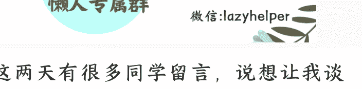
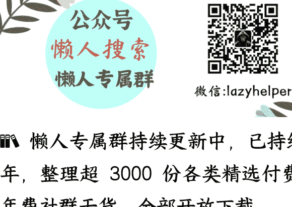

# 国家“人工智能+"大文件出台，未来影响席卷一切

**250902《政经参考》节选**
整理：公众号懒人搜索，[_懒人专属群_](#)独享
懒人微信：lazyhelper

这两天有很多同学留言，说想让我谈谈对最近讨论很热烈的“人工智能+"大文件的理解，也就是《国务院关于深入实施“人工智能+"行动的意见》（以下简称《意见》）。

今天这节课，我尽量用大白话给你讲清楚我的判断，包括国家到底想干什么，未来的人工智能+趋势是什么，以及普通人的机遇和挑战。

### “互联网+"和“人工智能+

谈到“人工智能+"，也就是"AI+"，你可能会想起十年前的那场“互联网+"热潮。2015年，中央发布《国务院关于积极推进“互联网+"行动的指导意见》，“互联网+"由此渗透到了各行各业，比如互联网 + 餐饮、+ 金融、+ 教育、+ 医疗、+ 政务、+ 制造等等，催生了产业和财富的巨浪，重塑了各行各业的样貌和普通人的生活。

而“互联网+"的本质，其实是通过互联网，把原本分散的资源集中起来，高效配置，发挥出更大的规模效应，它的核心词是“连接”和“效率”。

中央这份"AI+"文件，目标更进一步，《意见》一开头明确指出，要“推动人工智能与经济社会各行业各领域广泛深度融合，重塑人类生产生活范式，促进生产力革命性跃迁和生产关系深层次变革”。你听一下关键词，“重塑人类生产生活范式” “生产力革命性跃迁” “生产关系深层次变革”，这几个词，取向非常宏阔，要超出一般的宏观政策，这么一说，你就明白这个文件的定位了。

**简单说，这次不仅要用 AI**，把各行各业重新做一遍，比如 **AI+金融**、**+教育**、**+医疗**等等，更是要让 **AI** 来重塑生产力和生产关系。我认为背后的意思是，**不只是用 AI 优化存量、提升效率**，更是让 **AI 自身成为核心生产力**，**创造价值**，最终实现 **“智能经济”** 和 **“智能社会”** 的新形态*。

这个愿景，可以说非常之大了。具体来说，《意见》提出了三步走的战略目标：

- **第一阶段是到 2027 年**，要率先实现人工智能在六大重点领域，就是科技、产业发展、消费提质、民生福祉、治理能力、全球合作领域的广泛深度融合；同时，新一代智能终端，比如智能网联汽车、人工智能手机、智能机器人等，和智能体应用普及率超过 70%；智能经济核心产业规模，实现快速增长；以及，人工智能在公共治理中的作用，比如各种城市规划、交通管理、政务服务等，明显增强。可以看到，第一阶段，重在“突破”和“普及”。

- **第二阶段是到 2030 年**，要人工智能全面赋能高质量发展，新一代智能终端、智能体等应用普及率，超过 90%，让智能经济，比如智能制造、智能交通、智能物流、智能医疗等，成为我国经济发展的重要增长极。简单说，智能经济，作为新增量，要挑大梁了。

- **第三阶段是到 2035 年**，要使中国全面步入智能经济和智能社会新阶段，为基本实现社会主义现代化提供有力支撑。这已经不仅仅是经济范畴，更指向一种以智能化为特征的新社会形态的形成，涉及生产生活方式、治理模式乃至文化观念的变革。

所以，这份《意见》其实是一份力度空前的“政策发令枪”，"AI+"被提升为关键发展战略，从形式上看，它继承自“互联网+"，但目标、力度和愿景，看起来都远超过“互联网+"。

## 六大任务

面对这些目标，文件给出了怎样的达成路径呢？文件部署了六大"AI+"重点行动，以及八大基础支撑，限于篇幅，我重点说下六大行动，接下来我就尽量用大白话综合翻译下，文件的原文链接，我放在了文稿末尾，你可以对照着看。

- **第一，“AI+"科学技术。**
简单理解，要用 AI 来重塑中国的科研范式。不仅强调利用 AI 加速“从 0 到 1"的重大科学发现进程；也强调要用 AI 来驱动技术研发模式创新和效能提升，加速“从 1 到 N"的技术落地和迭代突破；甚至拓展到哲学社会科学领域，也要用 AI 创新研究方法，向人机协同模式转变。

总结起来，就是要把 AI 贯穿于科研的全流程、全领域，从基础研究到模式创新，从自然科学到社会科学。这其实是正式把"AI 驱动科研”，提升到国家战略高度，认可 AI 作为新的科研范式。我据此判断，背后的深层意图是，中国希望利用 AI 的能力，实现基础科学的“弯道超车”。

- **第二，“AI+"产业发展。**
简单理解，要让 AI 全面赋能工业、农业、服务业。

工业领域，要实现全要素智能化，比如加快工业软件创新突破，大力发展智能制造装备，深化人工智能与工业互联网融合应用。

农业领域，要实现数智化。比如加快人工智能驱动的育种体系创新，大力发展智能农机、农业无人机、农业机器人等智能装备，加强人工智能在农业生产管理、风险防范等领域的应用。

至于服务业领域，要实现与人工智能的融合创新。比如探索无人服务与人工服务相结合的新模式，在软件、信息、金融、商务、法律、交通、物流、商贸等领域，推动新一代智能终端、智能体等领域的广泛应用。这些共同构成了覆盖三大产业的智能化转型路线图。

此外，值得特别一提的是，这次"AI+ 产业发展”行动有一大亮点，就是加大了“智能原生”（AI-Native）的力度。这个“智能原生”，根据国家发改委官网上高技术司的解读文章，就是利用 AI 跨界催生新事物。解读文章说，智能原生产业是创新解决方案，即用 AI“造出新设备”，以自动驾驶汽车为例，表面是车，本质是轮子上的 AI 系统，用 AI 重新定义了汽车的形态和商业模式。

这标志着政策思维从“为旧产业嫁接新技术”，转向了“基于新技术直接孕育新产业”。进一步，未来国家的产业竞争力，或许将不只是取决于谁的产能强，更是要看谁培育主导了某个垂直领域的“超级智能体”。

- **第三，“AI+"消费提质。**

一方面，AI 要深入服务消费领域，提升文娱、电商、家政、物业、出行、养老、托育等领域的品质和体验；另一方面，要大力发展智能网联汽车、人工智能手机和电脑、智能机器人、智能家居、智能穿戴等新一代智能终端。同时，加快人工智能与元宇宙、低空飞行、脑机接口等技术融合和产品创新。

在我看来，这是以消费端智能化升级为突破口，构建“需求牵引供给”的经济导向。一方面，通过创造新型智能消费场景，刺激内需并提升消费层次，缓解传统服务业的同质化竞争压力；另一方面，通过智能终端生态，比如智能家居等，和技术融合，比如低空飞行、脑机接口等，培育本土智能产品的产业链，抢占未来消费科技制高点。

- **第四，“AI+"民生福祉。**

这方面主要包括，创造更加智能的工作方式。比如探索人机协同的新型组织架构和管理模式；开展人工智能技能培训，激发人工智能创新创业和再就业活力。文件特别提到，要“加强人工智能应用就业风险评估，引导创造就业潜力大的方向倾斜，减少对就业的冲击”，这显示出政策对技术冲击的审慎考量。

同时还包括推行更富成效的学习方式。这一点很多家长要尤其注意，比如要创新智能学伴、智能教师等人机协同的教育教学新模式，推动育人从知识传授为重，向能力提升为本转变；再比如构建智能化情景交互学习模式；还要鼓励全民积极学习人工智能新知识、新技术。未来，教育的改变会非常大，很多家庭教育资源的投入方向，必须要改变了。

此外，还要打造更有品质的美好生活。比如有序推动人工智能在辅助诊疗、健康管理、医保服务等场景的应用；以及充分发挥人工智能对织密人际关系、精神慰藉陪伴、养老托育助残等方面的重要作用。你听一听，织密人际关系和精神慰藉陪伴这个提法，有很大的想象空间，未来很多社会形态真的要改变了。

- **第五，“AI+"治理能力。**

《意见》提出，要开创社会治理人机共生新图景，并助力安全治理。包括推动市政基础设施智能化改造升级，深入开展人工智能社会实验等，这个社会实验又很有想象力。还要加强人工智能在安全生产监管、防灾减灾救灾、公共安全预警、社会治安管理等方面的应用，并增强应用人工智能维护和塑造国家安全的能力。

- **第六，“AI+"全球合作。**

简单说，中国将与国际社会，更多分享 AI 的成果，强化国际合作，并帮助发展中国家加强人工智能能力的建设。同时，中国也会参与制定全球的 AI 规则，确保人工智能发展安全、可靠、可控。

这部分，我认为背后其实也有大国博弈的影子，中国面对美国的科技封锁，显然要更突出国际合作，并且要将自己的 AI 影响力，拓展到更多国家。我之前在课程里说过，中美之争，背后也必然是两套系统之争，AI 是重要体现。

## 普通人应该如何应对？

听到这里，我估计你可能会有这样的感受，这份文件像是一份关于未来世界的新技术+新产业+新社会形态的“预报”，这场变革看起来会深入到每个角落，席卷一切。

文件对于产业、社会的发展促进，我就不多说了，我想重点谈谈给我们普通人带来的挑战和机遇。

先说挑战，不可避免，未来肯定会有职业领域的“结构性替代”。这个替代，主要指向以标准化信息处理、模式识别和重复性推理为核心的工作，这可能对很多白领来说，是个挑战。

结合我之前说的，过去以及现在很多普通大学，培养的是以通用管理型人才为主的白领人才，而这类人才的技能和 AI 的替代有所重合，这个挑战就更紧迫了。所以，面向未来的一技之长，而不是通用能力，现在变得更重要了，要优先培养。

除了结构性替代，另一大挑战，就是知识半衰期，正在加速缩短。一门技术管用十年、二十年的时代要结束了，过去依靠“勤奋”和“熟练”就能立足的职场逻辑，也正在被强力改变，取而代之的，是持续学习的能力和跨领域整合的认知灵活度。

当然，挑战之外，也是机遇。一方面，对于有意愿和有准备的普通人来说，AI 也正在成为历史上最强大的“能力杠杆”。一个人配合 AI，就能具备一支团队的力量，物理意义上的“个人即公司”，正在成为可能。个体创业其实会迎来一个新的黄金窗口，不过具体决策还需要结合当下市场的现实需求，并谨慎评估风险。

另一方面，未来经济社会中也会出现更多“人机协同”的模式，比如 **AI 承担标准化、规模化的运算与执行，人类则专注于情感连接、战略判断与意义赋予**。总之，新的未来，已经来了。

最后，欢迎你把《政经参考》转发推荐给更多人，让我们一起聚焦政经，举重若轻。我是马江博，下期见。

+ 1、国务院关于深入实施“人工智能+"行动的意见

最后，安利小懒的付费群：

懒人专属群（介绍）

**🗄️ 懒人专属群持续更新中，已持续运营 6 年，整理超 3000 份各类精选付费文章 & 年费社群干货，全部开放下载。**

本资料为付费群内分享，仅供真实有需要的朋友查阅

懒人专属群更新记录：
https://lazy2025.top/blog/record2

懒人专属群更新记录（需梯子，备用）:
https://lazybook.fun/blog/record2