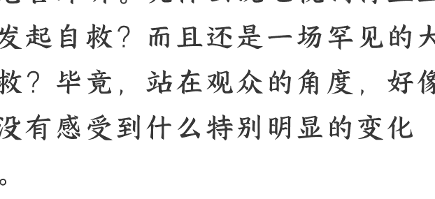

# 这个秋天，电视剧行业的“大自救”终于开始了

20250902
整理：公众号懒人搜索，[懒人专属群独享](#)
懒人微信：lazyhelper

乍一看今天的标题，有人可能觉得有点危言耸听。凭什么说电视剧行业正在发起自救？而且还是一场罕见的大自救？毕竟，站在观众的角度，好像并没有感受到什么特别明显的变化啊。

别着急，自救这个说法可不是我说的，而是很多业内人士的看法。借用广电总局发展研究中心副研究员，胡祥老师的话说，‘在媒介形态急速变化的当下，特别是短剧、游戏、直播等新业态的冲击下，传统电视剧行业面临较大冲击。需要进一步通过顶层设计释放行业的生产力。’

那么，这个自救体现在哪呢？咱们先从一份文件说起。8月18日，国家广播电视总局印发了一份文件，全名叫《进一步丰富电视大屏内容促进广播电视内容供给的若干举措》，业内的简称是‘广电21 条’。

很多人对这个消息可能有点无感。毕竟，政策文件经常有，而且普遍跟行业外的人没什么关系。但是，这回的文件非常不一样。

你看，提起广电口的文件，很多人的第一反应是什么？肯定觉得这是在某些方面要加强审核，加强管理啊。没错，这是这类文件一直以来最常见的底色，严。

比如，2020 年，广电总局发文，提倡电视剧、网剧一律不超过 40 集。这直接导致备案电视剧的平均集数，从 2017 年的39.8 集，下降到了2024 年的28.8 集。你可以回想一下，是不是好多年没看到《甄嬛传》那种七八十集的长电视剧了？

到了2023 年政策进一步收紧，要求季播剧两季之间的播出间隔，不能少于12 个月。比如今年一月播出第一季，那么最早也要等明年二月才能播出第二季。这个规定确实治理了一些行业乱象。但也导致不少剧集播出第二季时，观众早把第一季忘了，索性直接弃剧。

再比如，2015 年，一剧两星规定出台。一部电视剧最多只能同时卖给两家上星卫视。这能让同时段的剧集更丰富，而不是打开电视全都在播同一个剧。但也导致电视剧的发行价暴跌，不少中小影视公司都受到了不小的冲击。

你看，这是过去十年来，广电行业文件的一个普遍底色，严。

但是，今年的“广电 21 条”不太一样。它的底色更多的是，宽。很多限制都大幅度放宽了。

假如你是从业者，这些变化直接关系到你面对的机会。假如你是观众，这些变化将影响你以后会看到什么样的电视剧。

那么，这回“广电 21 条”的“宽”都体现在哪呢？

比如，对剧集长度的限制，以后要逐步取消了。以后超过 40 集的电视剧项目，可以走广电总局的评审通道。只要内容过关，就可以超过 40 集，甚至更长。这对那些史诗剧、历史剧、年代剧来说，都是个好消息。因为这类剧集往往需要很长的篇幅。假设你要重拍三国，重拍水浒，至少篇幅不再是个枷锁。

再比如，季播剧的间隔限制也取消了。两季之间不用必须间隔一年以上。毕竟，目前很多国内观众还不习惯美剧式的播出方式，中间假如隔两三年，观众早把这档事忘光了。

再比如，“一剧两星”的限制也取消了。一部电视剧的版权可以卖给多家电视台，几家电视台还能联合购买、同步播出。这样一来，制作方能通过多平台授权，快速收回成本。电视台也能通过拼单购买分摊费用，对双方都有利。

前面说的，在发行方式上的“宽”。
除此之外，还有内容审核机制上的“宽”。注意，这不是说要放宽审核标准，而是要提供更灵活的审核方式。

比如，针对重点剧目，建立总局和省局同步审查机制。说白了就是以前是不同部门逐个审核，而现在可以同步审核。最直接的好处就是，审核时间变短了。

再比如，试行建立“边审边播”机制。这个模式类似于韩剧和美剧。导演和编剧可以根据市场表现，根据观众反馈，及时调整剧情的走向。当然，这个机制目前还在初期的摸索中，有待后续的完善。

听到这，有人可能觉得奇怪，前面说的政策，更多的是针对审核流程，或者针对制作规格的。但老百姓看电视剧，看的主要还是内容。流程和内容之间有什么关系吗？

> 这就要说到，**影视行业的一个很重要的逻辑，叫，流程决定确定性，确定性带来资源加持，资源加持强化内容质量。**

这是个连锁反应。比如，我有一个电视剧项目，正在招兵买马的阶段。这时，假设你是大老板，我想从你那要点资源支持，你会怎么做？你肯定会很在意这个剧的前景，很在意你的回报。说白了，我得给你提供足够的确定性，你才愿意投入资源。

而回到审核这个环节，很明显，审核机制对制作方越友好，你感受到的确定性就越强，你就越愿意投入资源。而这些资源投入，又直接决定了剧集的质量。

从这个角度看，更加灵活的流程，或许能让剧集获得更多的资源加持。也许随着新规的影响陆续落地，未来十年，有可能迎来国产剧最好看的十年。

而事实上，“广电21 条”的影响已经出现了，只不过是最先出现在了资本市场方面。新规发布当天，文化传媒指数上涨了 3.11%，涨幅仅次于通信设备和软件。影视板块资金净流入超 102 亿元，华策影视、慈文传媒、欢瑞世纪等批量涨停。即使考虑到当时 A 股总体上扬的大背景，这个涨幅也不算低。

更有意思的是，政策发布当天，据说连横店影视城的餐厅订餐量都激增，很多剧组加速开机筹备。根据业内的估算，这个政策预计激活 203 亿资金。最早受益的，就是最近传得沸沸扬扬的“四大名著重拍”计划。

刚才咱们说的，是来自顶层设计层面的“自救”，是自上而下的。而换个角度，电视剧行业本身，也在发起自下而上的自救。

其中最具标志性的事件之一，就是长剧居然肯低下头，向短剧学习。

要知道，在电视剧行业，一度存在一个鄙视链。鄙视链的上端是谁不好说，但你要说鄙视链的下端，估计很多短剧从业者本人，都会忍不住自我调侃。

放在三年前，你要是让长剧向短剧取经，这就好比让星级酒店的大厨学做烤冷面，几乎是不可能的。但现在情况不一样，因为短剧的市场太大了，制作水准也在提高。

根据《中国网络视听发展研究报告（2025）》，截止到去年底，国内微短剧市场规模已经达到504.4 亿元。什么概念？超过了全年的电影票房。而且这个数字还在涨，预计2025年将达到634亿元。还有，周星驰、刘晓庆、李若彤，这些大银幕上的导演和演员，也都宣布陆续进军短剧。

那么，长剧向短剧学什么呢？毕竟，按照很多人的设想，长剧的制作规格一般高于短剧。那么，短剧身上有什么是长剧特别值得借鉴的吗？

还真有。至少从目前看，有这么几方面或许值得借鉴。

**短剧的特点是，冲突前置，反转密集**，一分钟的时间里能容纳很多的情节，叙事效率很高。现在，很多长剧也开始这么做。先把时长变短，再压缩节奏，让反转更密集。比如，今年播出的《狮城山海》《朱雀堂》，都把剧集时长控制在了20分钟以内。

其次，**短剧有一套很特别的工作方式。** 这套工作模式的核心就是，**细**，“把工作的颗粒度拆得特别细。长剧一般是以“情节”为单位编排的，也就是一个冲突从发生到结束，一般一个情节单元的长度是15分钟。但短剧因为时长很短，一集长度只有一两分钟。为了在这一两分钟里抓住观众，制作方就会以“台词”为单位，一句一句地打磨剧情，追求的是“三秒入戏、十秒反转”。而且打磨的过程中，他们会不断考虑目标受众的反应。

比如，假如这个剧的受众是大学生，那么开篇第一句台词可能就是，“典礼那天，我发现这届毕业的居然只有我一个人，有10000 家公司抢着要我”。假如受众是中年男性，开篇第一句可能就是“钓鱼第一天，我发现了让鱼主动跳进桶里的秘密”。

而现在，一些长剧也开始借鉴这套工作方式，把工作单元拆得极细，细到台词级别，甚至去分析演员的某个特写。看看哪个特写画面能出圈，能成为人们转发的表情包。

换句话说，长剧与其把短剧当对手，不如把短剧当成参考资料，从中找找哪些部分，是对自己有用的。未来的电视剧行业会变成什么样，现在还不好说。但至少这个“把对手当成参考资料”的思路，或许值得我们了解。

就像塔勒布说的，这个世界上有三种事物。第一种是脆弱的，面对冲击，一碰就碎。第二种是坚韧的，能够承受冲击，但不会变强。第三种是反脆弱的，能够从冲击中获益，并且变得更强大。

最后，安利小懒的付费群：

懒人专属群（介绍）

📕 懒人专属群持续更新中，已持续运营 6年，整理超 3000 份各类精选付费文章 & 年费社群干货，全部开放下载。

本资料为付费群内部分享，仅供真实有需要的朋友查阅 🧑‍💻

## 懒人专属群更新记录：

https://lazy2025.top/blog/record2
懒人专属群更新记录（需梯子，备用）: https://lazybook.fun/blog/record2