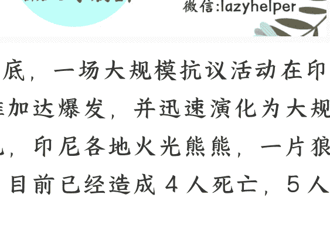
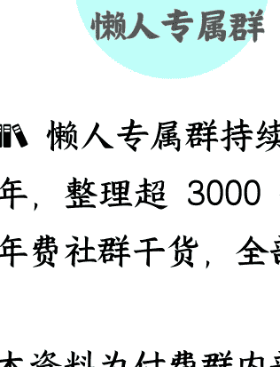

# 印尼全国骚乱，华人会不会再次遭殃？

250902 文/卢克文工作室嘉宾 星海舰长

整理：公众号懒人搜索，懒人专属群独享

懒人微信：lazyhelper

8 月底，一场大规模抗议活动在印尼首都雅加达爆发，并迅速演化为大规模骚乱，印尼各地火光熊熊，一片狼藉，目前已经造成 4 人死亡，5 人受伤。

本来吧，印尼总统普拉博沃是要来北京参加 9.3 阅兵的，现在呢？也不得不取消了行程。

那么，这起骚乱到底是咋回事？考虑到印尼有“骚乱必屠华”的传统，那么这次印尼华人有没有危险呢？

一切的一切，还要从印尼总统普拉博沃的新政说起。

2024 年 3 月，普拉博沃当选总统，为了兑现竞选时的承诺，普拉博沃一上任就制定了一个计划——免费营养餐。简单来说，就是为印尼 8300 万儿童、中小学生、孕妇和哺乳期母亲提供免费的营养餐。

这个计划挺好，问题在于，要花 200 多亿美元，钱从哪来？印尼又不是什么发达国家，拿出这么一大笔钱是很困难的。

于是在 2024 年 8 月份，印尼发布《[2025 政府财政预算草案](http://)》，根据新的预算，为了给免费营养餐计划腾出资金，决定减少对地方的转移支付资金。

地方的财政全靠中央的转移支付呢，现在中央把转移支付砍了，地方咋办？总不能让公务人员都发不出工资吧？那只能想办法增加税收了。

于是，各地开始各显神通，在自己权力范围内猛加税，比如酒店税、餐厅税、娱乐税、停车税、广告税、地下水税、非金属矿物和岩石税、燕窝税等等等等。

地方加税的同时，中央也没闲着，也在加税。

比如，去买音乐会门票、快餐、纸巾、味精和洗涤剂等日常支出，都要加消费税。就这样，印尼成了一个万税万税万万税的国家。

这样一来，老百姓的怨气就大了。

本来吧，这种事情如果在经济上行期，生活压力会随着经济的发展而被掩盖，但随着特朗普关税战的开打，印尼经济遭遇重创，特别是出口行业，彻底经营不下去了。

比如，印尼最大、历史最悠久的纺织企业——成立于 1966 年的 PT Sri Rejeki Isman Tbk 宣布破产，仅此一事，就导致了印尼增加了数万人的失业人口。

不仅如此，今年五一劳动节普拉博沃出台的就业制度改革，也起到了反效果。根据改革内容，要求企业将外包员工转为正式雇员。

本来是个好事情，但我们都知道，这样一定会导致企业成本增加，企业为了省钱，就会降本增效。所以 2025 年上半年，印尼失业率暴增，再叠加高涨的生活成本，印尼民间已经如同一座火山一样了。

在这种环境下，印尼的互联网上开始流行“海盗旗”活动，简单来说就是把《海贼王》里面的“草帽旗”挂出来，代表自己对自由、正义和反腐败的追求。

政府原本对这种行为艺术也不咋管，但到了 8 月份，情况变了。

8 月 17 日是印尼国庆节，普拉博沃呼吁全国于 8 月悬挂国旗，但印尼民众开始整活了，挂一面国旗，挂一面草帽旗，结果草帽旗和印尼国旗一起飘扬，图片和视频在社交媒体上大量传播，实在有碍国际观瞻。

这一下子，很多官员坐不住了，就让警察去抓挂草帽旗的人。

结果，一下子把民众给惹火了，我就是喜欢动漫《海贼王》，挂个动画片里的旗子而已，违法么？不违法！你凭啥抓我？

于是，一个名为 PATI 社区联盟的互联网群组，开始鼓动民众上街游行，然后对游行进行全程直播，煽动更多的人上街。

终于，在 8 月 13 日，游行抗议者与警方爆发了直接冲突，多人受伤，冲突通过直播传播到了全印尼，引发了全民愤怒。

不得不说，当愤怒渗入群体之后，带来的侦察能力和挖掘能力是惊人的，有人从去年那份浩如烟海的《[2025 政府财政预算草案](http://)》中，发现了关于议员住房补贴的大瓜！

此前，印尼众议院取消了议员专用住房，作为补偿，众议院的 580 名议员除 6000 万卢比的工资外，每月还可领取 5000 万印尼卢比（约合人民币 2.17 万元）的住房补贴。

5000 万印尼卢比是啥概念呢？是雅加达最低工资的 10 倍，贫困地区的 20 倍。

民众彻底怒了，你说给女性和幼儿搞免费餐，我没意见，但这些钱为什么要从我们穷人身上盘剥？就不能从议员的钱里出吗？谁不知道议员各个财大势大，他们都这么有钱了，还有必要给他们住房补贴吗？

## 2

这次印尼骚乱，从根子上来说，还是积压的社会矛盾引发的。

印尼的腐败问题，最早可以追溯到苏哈托时期，那时候官商勾结、裙带关系几乎是公开的，腐败达到了顶峰。

虽然 1998 年苏哈托下台后开始了民主化，但整个社会统治体制，还是苏哈托时期建立起来的，复杂的政商关系，官员和富商之间盘根错节的利益链，可以说处处滋养着腐败，根本不是搞个舆论监督、设立个反贪机构就能搞定的。

虽然普拉博沃高举为民请命的大旗，以中下层普通百姓的利益代言人而自居，但整个国家的体系都这样了，他又能如何呢？更何况，就连普拉博沃自己，不也是这个体系的一环么？

毕竟他的老婆，就是苏哈托的女儿。

这个体系自我循环、自我繁殖，靠着把控国家权力和经济命脉，拿走了利益分配的大部分蛋糕，只给印尼贫困老百姓留下了仨核桃俩枣，老百姓怎么可能没意见？

当人们都活不下去的时候，你再加税，也别怪人民起来造反了。

当然，虽然这次骚乱有印尼自身的原因，但如果仔细观察，也不难发现幕后，其实是有黑手的。我们很反感碰上个什么事都说是“美国的阴谋”，但起码从印尼骚乱的情况看，颜色革命的味道还是很浓的。

比如，颜色革命往往都有一个代表性的标志物（玫瑰、郁金香、黑口罩等等），而印尼有“草帽旗”。

比如，颜色革命往往都有一个“去中心化”的组织者，而印尼呢？有 PATI 社区联盟、“全印尼学生联盟”和“Gejayan Memanggil”等组织和 NGO，他们实时分享警方动向，并利用加密聊天软件协调行动，制造层出不穷的谣言。

比如，颜色革命往往有带头冲锋的，有现场指挥的，还有后勤保障的。而印尼呢？这次挑头放火的，都是一群神秘的“蒙面人”，而现场也发现了可疑的白人手持武器，甚至抗议者砸了一天了，还有人专门送上水、盒饭和钱。

你看，这不是颜色革命是什么？

考虑到自从佐科时代之后，印尼对华持务实态度，不仅建成雅万高铁，而且印尼还希望与中国开展更多的基建合作。

从中国这次邀请印尼参加阅兵，本身也说明中国和印尼关系不错。

那么，这次印尼的颜色革命，是不是美国对印尼走务实对华路线的一种警告呢？

不能完全排除。

对美国来说，对于中国在海外的落子，能夺走就夺走，不能夺走就搞乱，反正就是不能让中国顺顺利利达到目的，毕竟，破坏要比建设简单多了。

当然，中国人普遍关心的是，这次印尼骚乱，会不会再次波及印尼的华人？

印尼华人以 5% 的人口占据了印尼超过 60% 的私有财富，匹夫无罪怀璧其罪啊。而且，现任总统普拉博沃在 1998 年屠华中，也谈不上完全无辜。无数人担心，这次骚乱又会演变为对华人的洗劫和屠杀。

那么，到底会不会呢？先说结论吧，有这个苗头，但可能性不太大。

印尼的网络上的确有声音，说华人财团（比如黄家的金光财团、彭家的巴里托太平洋集团、李家的力宝集团等等）和官员政商勾结，掠夺社会财富，是导致印尼人贫困的罪魁祸首云云。

这话吧，不能说完全错，在印尼的环境中，如果不交好政客，华人怎么做到掌握印尼经济半边天的？但你说是华人的错吧？也很勉强，华人只不过是推到台前的白手套而已。

目前，印尼网上对于华人的针对声音，还未形成太大的规模。印尼官方，也对华人社区进行了紧急保护。华人本身不是这次骚乱的矛头，个别华人在骚乱中被打被抢是有可能的，但大规模有组织的屠华排华行动，发生概率较低。

为啥？因为中国已经今非昔比了。

2016 年时，印尼政局不稳，大量华人遭到人身财产方面的威胁。这时，中国海军的 052C 郑州舰突然抵达印尼进行“友好访问”，然后呢？局势瞬间就平息了。

如果印尼政府再想牺牲华人来泄压自保，中国 300 万吨的海军，也能让印尼的政客冷静下来。

所以，印尼华人要做的，就是做好防范，尽量不要参与骚乱，免受池鱼之殃，其他的安全问题，交给祖国就好。

毕竟，哪怕血统再稀释，祖国认同再淡薄，中国也永远是他们的坚强后盾。

最后，安利小懒的付费群：
懒人专属群（介绍）

📚懒人专属群持续更新中，已持续运营 6 年，整理超 3000 份各类精选付费文章&年费社群干货，全部开放下载。

本资料为付费群内分享，仅供真实有需要的朋友查阅🙈
懒人专属群更新记录：
https://lazy2025.top/blog/record2
懒人专属群更新记录（需梯子，备用）：
https://lazybook.fun/blog/record2