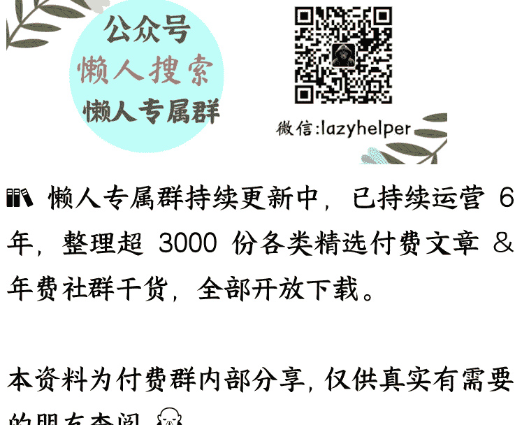

# 01 导论：为什么探讨爱情需要哲学思考？

250902《爱情哲学30讲》

整理：公众号懒人搜索，_懒人专属群_独享
懒人微信：lazyhelper
等完结后，小懒会整理成精美电子书合集到《通才计划》，到时候看咱们群里通知

欢迎来到《爱情哲学30讲》，我是刘擎。

谈论爱情似乎是一件门槛极低的事情。人人都能凭借自身的直接体验或间接观察，提出某种感想或判断。常见的情况是，将个体经验轻易拔高为普遍真理，用寥寥数语作出断言。然而，如果真正追问爱情的本质，就会发现一切似乎都更加复杂。有位学者在引述流行说法后发现，关于爱情的任何命题，几乎都能找到对立的表述：

- 你说爱情是美好的；他说爱情是痛苦的。
- 你说爱情如雷电般一击即中；他说爱情需要时间与耐心。
- 你说爱情是最无私的奉献；他说爱情归根结底是爱自己。
- 你说爱情因性的欢愉而圆满；他说爱情唯有超越性欲时才更纯粹。
- 你说爱情需要一切；他说爱情什么都不需要。

你看，这些彼此矛盾的观点听起来似乎都不无道理。那么，如果让我们转向伟大的哲学家和思想家，期待他们提供清晰的答案呢？那你就会发现他们之间的分歧与冲突并不比普通人更少。

人类自古以来不断尝试以各种方式理解爱情。从原始的洞穴壁画与古代的诗词经典，到现代心理学实验与脑科学成像技术，我们始终在追问爱情的真相。然而，这个问题依旧神秘而难解。我觉得，爱情之所以被称为“永恒的话题”，恰恰因为它同时是“千古未解之谜”。

那么，我们这门课就来为你彻底解开这个“千古之谜”吧！当然不是。只有自媒体上的某些“情感博主”才敢夸口说“三分钟给你讲透爱情的底层逻辑”，任何严肃的学者都不会这么无知无畏，如此轻率的宣称。

## 为什么要重新思考爱情——课程的目标

如果爱情之谜无法终极破解，那么这门课程究竟能提供什么？概括为四个字，就是：“去伪求真”。我们会同时致力于两个目标：

一个是批判性的“去伪”。就是识别和批判当代流行话语中对爱情的误解，对那些貌似合理、实则误导的观念提出质疑与反思。

我会重点批判两类观点。第一种是“本能论”，就是把爱情简化为一种生物性的本能反应。第二是“工具论”，强调供需匹配与效用计算，就把爱情视为等价交换的博弈。本能论和工具论虽然都有现实依据，却都造成了对爱情的异化。

早在近七十年前，哲学家弗洛姆在《爱的艺术》中就已经揭示了这种异化，而近年来，韩炳哲在《爱欲之死》中更尖锐地批判了自恋化、消费化的爱情观。所以，这种批判不仅是一种智识工作，更是一种伦理任务和价值主张——抵御工具理性的霸权。

需要强调的是，我批判这两种观点，并非否认生理本能和工具价值在爱情中的重要性。事实上，爱情确实承载了安全感、支持与依赖等功效，也不可避免地与生物本能发生密切交织。然而，这些都不是爱情的界定性特征。爱在根本上是一种生命实践，它超越了动物性的性本能与最低层次的生存欲望，具有深刻的内在价值，关乎自我的构成与成长、价值的塑造与确认，以及与世界的深层联系。

这就引出了这门课的第二个目标：建设性的“求真”。

### 为什么需要哲学思考——课程的方法论

如果爱情之谜无法终极破解，那么这门课程究竟能提供什么？概括为四个字，就是：“去伪求真”。我们会同时致力于两个目标：

- 一个是批判性的“去伪”。就是识别和批判当代流行话语中对爱情的误解，对那些貌似合理、实则误导的观念提出质疑与反思。
- 另一个是建设性的“求真”。就是搭建一个新颖的框架，以哲学性的问题意识、概念分析和逻辑论证，重构对爱情的理解，并在此基础上提出具有实践意义的建议。

我还会搭建一个新的框架，以哲学性的问题意识、概念分析和逻辑论证，重构对爱情的理解，并在此基础上提出具有实践意义的建议。

那么，什么是哲学？如果从狭义的学科定义出发，哲学似乎与具体的情感经验距离遥远，甚至可能显得过于抽象而脱离实际。然而，如果从哲学的深层精神出发，它恰恰是对生活最根本问题的追问，是对常识的反思与深化。

哲学探究的重要性在于，它能防止我们被情绪裹挟，被碎片化的信息误导，从而能够冷静而客观地审视自身处境。因此，《爱情哲学课》并非简单的“恋爱指南”，而是一次关于人类最亲密关系的深刻哲学沉思。有同学会问：我看过一些探讨爱情的哲学书，这门课程与那些著作有什么不同？

我认为的不同点是：大多数“爱情哲学”著作，要么是阐释伟大的哲学家或思想流派关于爱情的论述，要么是以思想史的眼光，追踪爱情观念的历史演变。这些工作当然重要，但也容易流于学究气。我们的课程则是问题导向的：它的哲学性体现在提问的方式、论证的风格与结构性的思路上。

### 课程的任务

发刊词里说过，在总体结构上，这门课程将按照哲学的基本分类，将爱情问题分为四个层面：本体论、价值论、认识论和实践论。这种划分并非僵硬的学科边界，而是思路上的指引。我们将会分为四个板块展开探索。

- **第一板块：爱情是什么？这是一个本体论的问题。**
我们需要澄清“爱情”这一概念究竟指什么，区分它与欲望、亲情、友谊等相邻现象的差别，并提出一个新颖的、具有原创性的定义。紧接着，我们会进一步讨论亲密关系的两种重要实践模式，以及爱情与性，爱情与婚姻的区别与联系。

- **第二板块：爱情有什么意义和价值？这是价值论的追问。**
我们要回答的问题是：为什么还有这么多人重视爱情？爱情究竟有什么价值？我们将探讨爱情在自我塑造、个体价值的肯认、存在意义的生成等方面的重要作用。虽然爱情往往也有外在的功效价值，比如追求事业的成就、经济财富与社会地位等等，但在本质上，爱情是由内在价值主导的生命实践活动，它就不能用功效价值的尺度衡量和评价。

- **第三板块：爱情的悖论及其超越。这大致属于认识论的层面。**
爱情是一种极有意义的生命实践，但也很容易陷入矛盾。它期待持久，又往往转瞬即逝；它呼唤专一，却常常面临移情别恋的可能；它似乎基于所爱对象的优秀品质，但又反复声称“爱你，只是因为你是你”。这种张力揭示了爱情作为生命实践的特殊困境。我们会在这部分，深入分析爱情为何如此脆弱，探讨现代人爱情危机的深层原因。

- **第四板块：爱情的实践智慧。这属于实践论的环节。**
理解了爱情的本质、价值与困境后，我们还必须回应一些具体而现实的问题。比如：什么样的人是“对的人”？如何处理亲密与自由的关系？爱情中也有公平与正义的问题吗？如何实现公平与正义？在这里，我将尝试在前面铺垫的框架下，提供对现实问题的重新审视与实践启发。

总体而言，这四个板块构成了一条逻辑路径：从“爱情是什么”到“爱情为何重要”，再到“爱情为何如此困难”，最终落脚到“我们如何在实践中应对”。这样的结构和方法避免了某种程度的空洞抽象化，也使哲学探讨能与日常经验形成呼应。

# 其他说明

最后，我还想做两点说明，以免你在后面的学习过程中产生不必要的困扰。

- **第一，是课程聚焦的主题。**
爱与爱情是两个不同层次的概念。亚里士多德在《尼各马可伦理学》中区分了两种爱：一种是广义的“友谊”（philia），基于美德与共同生活；另一种是狭义的“爱情”（eros），基于欲望与性吸引力。我们所讨论的“爱情哲学课”，主要聚焦于狭义的“爱情”（eros）。
然而，爱情并不完全封闭于亲密关系中，它也可以超越伴侣关系，延伸到更广泛的生命领域，如艺术创作、对真理的追求、对自然的敬畏等等。但本课程的重点在于探讨爱情的本质与困境，所以我们不会过度延伸到这些广义的“爱”的讨论。

- **第二，是课程的研究取向。**
这门课程并不追求某种固定的理论教条，而是秉持开放、反思与对话的精神。
对于爱情的理解，从来就没有标准答案。
从下一讲开始，让我们展开这段探索之旅吧！我是刘擎，我们下节课见。

# 最后，安利小懒的付费群：

### 懒人专属群（介绍）

📖 **懒人专属群（介绍）**
这里是《懒人书斋》的专属微信群——“懒人专属群”！这里是一个只分享书籍资源的地方，也是所有懒人书斋读者的家！欢迎进群！

### 懒人专属群更新记录：

https://lazy2025.top/blog/record2

懒人专属群更新记录（11-24）：《恋爱脑》《爱欲之死》《爱，是脆弱的奇迹》《爱的艺术》《爱的困惑》《爱的故事》《爱，在记忆深处》《爱，在记忆深处》《爱，在记忆深处》...
https://lazybook.fun/blog/record2