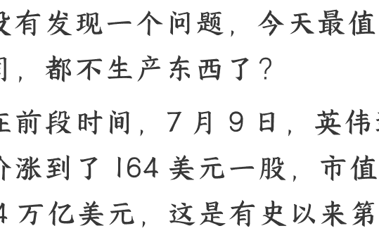

## 英伟达4万亿背后，普通人必须知道的商业新规则

250903  
整理：公众号懒人搜索，[懒人专属群](mailto:https://t.cn/R7JfRQk)独享  
懒人微信：lazyhelper  

  

今天我们从一个个奇怪的现象说起。你有没有发现一个问题，今天最值钱的公司，都不生产东西了？

就在前段时间，7月9日，英伟达的股价涨到了164美元一股，市值超过了4万亿美元，这是有史以来第一家市值达到4万亿美元的公司。到了7月底，微软发布财报，股价迎来大涨，市值同样突破4万亿美元。

4万亿美元，什么概念？已经超过了全球大部分国家的GDP。2024年，全球GDP排名中，也只有美国、中国、日本、德国这4个国家超过了4万亿美元。

美国资本市场上，有个“万亿美元俱乐部”的说法。市值超过1万亿美元的企业，现在一共有8家。除了前面说的两大巨头，还有苹果、谷歌、亚马逊、Meta、博通、台积电。

但是，问题来了。你仔细想想，这些全世界最值钱的公司，有什么共同特点？

答案可能有点出人意料，它们都不怎么生产东西。

英伟达自己不生产芯片，苹果不自己生产手机，而微软和Meta这样的公司，甚至没有实体的产品。

你看，100年前，提起大公司，大家印象中，是通用这样的制造业大牛。30年前，提起大公司，大家想起的是宝洁、可口可乐这样的商业巨头。而今天，全世界最大的公司，都变成了科技企业，它们的很多产出，并不是传统意义上的实体商品。

要知道，公司最重要的本质之一，就是创造商业价值。公司的生产方式变了，也许说明，这个时代创造价值的方式正在发生变化。搞懂这些变化，对我们每个人都有用，即使你不开公司。

那么，现代公司到底在发生什么样的变化呢？又能给我们普通人哪些启发呢？关于这些问题，有位英国经济学家，叫约翰·凯写过一本书，叫《21世纪的公司：为什么我们被告知的一切商业认知几乎都是错的》。书里提到的公司变化很多，我们在这里做个简化，把它总结成三个方向。

## 第一，从“资本决定一切”到“价值决定一切”。

过去很多西方的公司，大都是资本家手里有钱，然后买下工厂、机器和原材料，拥有生产资料，就可以开办公司了。而普通人买不起这些东西，就只能到资本家的工厂里干活。

但是到了今天，这个说法有点站不住脚了。你看，公司从制造为主发展到科技为主，它拥有的最重要的资产不是土地、厂房和机器，而是技术专利、算法、品牌、营销渠道、客户群等等无形的东西。这些东西不是有钱就能买到的。

同样，对于今天来说，获得资本的方式并不稀缺。你可以去融资，金融市场上，有好项目就可能拿到融资。其次，哪怕你不融资，土地、厂房和机器，这些东西你也可以租借，未必非要花大钱去买。

换句话说，过去的商业规则是“资本决定一切”，而现在是“价值决定一切”。首先，任何人想开公司就可以开公司，只要你能创造价值。其次，消费者用花钱购买的方式，奖励那些真正创造价值的公司。最后，这个市场中的公司必须承认，消费者不买账就是你的失败，要么赶紧变革，要么就得离场。

今天能赚钱的公司，大都符合这些特点。

那么，这对我们大多数人来说意味着什么呢？

首先，资源不再是最大的限制。你不需要有很多钱才能开始做事。今天，你可以租用云服务器，而不用买服务器。可以用社交媒体做营销，而不用买广告位。可以通过众筹获得启动资金，而不用只依靠银行贷款。

其次，消费者的选择权更大了。这意味着，你必须真正解决用户的问题，而不是靠垄断资源来赚钱。

最后，试错成本降低了。既然门槛低了，你就可以小规模地试验你的想法，看市场反应，然后快速调整。不用一开始就投入巨大的资源。

注意，这不是说资本不重要了，而是说，光有资本是不够的。你必须能创造出别人创造不出的价值。

这是第一个关键变化。

## 第二，从“传统利润”到“超级利润”。

这两个词乍一听有点抽象。别着急，我们先讲个故事，你听完马上就明白。

英国历史上有位足球明星，叫马修斯，他在上世纪五十年代非常受欢迎。那个时代的球星，收入和普通人差距并不大，即使是顶尖的球员，薪水也有限。

但今天的情况就不同了，顶级球星的收入已经达到了天文数字。比如梅西这样的超级巨星，年薪可以达到数千万欧元，这还不算各种奖金和广告代言。

为什么会这样呢？是因为有了电视转播，有了新媒体，梅西影响的观众数量，可以扩大到全球，远远多于马修斯当年一球场观众的水平。

换句话说，梅西和马修斯的成本差不多，他们都为了成为球星而付出了很多努力。但他们的回报不一样，马修斯的回报主要集中在足球领域，但梅西的影响力经由媒体放大，渗透到了商业领域。

**你在自己领域创造的利润，就属于传统利润。而假如你的效用能经过某些因素放大，渗透到其他领域，你就有机会赚取超级利润。**

换句话说，有时与其盯着自己的领域，不如想想怎么让自己的价值渗透到更多领域，去赚取那个超级利润。

比如，可以试试找到自己的独特优势。问问自己能做什么别人做不了，或者做不好的事情？这可能是你的专业技能，也可能是你的人脉资源，甚至可能是你对某个细分市场的深度理解。

同时，扩大自己的服务半径。就像梅西通过电视转播服务全球观众一样，要想办法让更多人受益于你的价值。今天有了互联网，一个好的内容创作者可以服务全国的用户，一个很好的程序员可以开发服务全球的应用。

以及最关键的，持续提升自己的不可替代性。超级利润的核心在于稀缺性，要不断学习，不断积累，让自己在某个领域变得越来越不可替代。

你看，这就是超级利润的逻辑。它告诉我们，赚大钱，不能单靠压榨成本，而是覆盖更大的价值面。

好，这是第二个变化，从传统利润到超级利润。

而一般来说，能赚取超级利润的公司，都具备一类独一无二的能力，叫“集体知识”。这就是我们要说的第三个变化，公司的核心资源，正在从“实体设备”变成“集体知识”。

一家公司能够做对事，赚到钱，不是靠某个设备，而是靠集体知识。即使像阿斯麦这种生产光刻机的公司，你拿走它现在的所有设备，它也能凭借过去的知识积累快速复活。但假如剥夺这些集体知识，对它来说就是灾难。

什么是集体知识？就是分布在公司内部，由全体员工共同拥有的知识。公司以外的人不具备，AI、百科也不知道。集体知识不掌握在老板、高管或者具体的某个人手里。你懂一部分，他懂一部分，大家合起来才是集体知识。

人类学家约瑟夫·亨利奇说过，**人类作为一个物种之所以如此成功，就是因为我们拥有集体智力**。我们不仅能从自己的经验中学习，还能从他人的经验中学习，并且在此基础上不断进步。

在商业中，集体知识包括业务知识，也包括流程知识，还有一些隐性的知识，比如员工之间的互动模式，部门做决策的方式等等。这些没有明文规定的内隐知识，是核心竞争力的一部分。这些集体知识，还有个更直白的叫法——默契。

比如，波音就发现，他们制造飞机时，随着产量的增加，生产效率会不断提高。产量每翻一倍，单位成本就会降低 15%左右。这不仅仅是因为某个个人很厉害，而是波音公司作为一个整体，在制造飞机的过程中积累了集体知识。

说到这儿，有一个关键问题。对于一家公司来说，怎么才能发挥集体知识的作用，把这种能力转化为生产力呢？

有一个非常重要的模式叫做，“**软关系+硬确认**”。举个例子，苹果公司的重大项目都会指定一个“直接责任人”，他未必是最懂行的人，团队可以自由协作、随时提出创意，大家的关系是柔性的。但是大事儿，比如重要里程碑或者技术路线，必须由直接负责人签字。

这就是“软关系+硬确认”，软关系保证了员工的积极性和创造力，硬确认保证了业务能高效推进、大家目标一致。同样，回到个人，这对我们的启发也许在于，成为“知识的连接器”，有时比掌握知识本身更有价值。你不需要什么都懂，但你要知道谁懂什么，什么时候该找谁。在一个团队里，那些能够连接不同专业、不同部门的人，往往很有价值。而成为这样的人，就需要我们掌握前面说的，“软关系+硬确认”的协作技巧。在日常工作中，学会营造轻松的协作氛围，让大家愿意分享想法。但在关键决策点，要明确责任，推动事情落地。

好，说到这，咱们今天从英伟达的4万亿美元市值，一路说到现代公司价值锚点的转移。对公司来说，19世纪靠资本，20世纪靠规模，21世纪靠什么？也许是靠“价值创造能力”。回到个人，这些变化转化成行动建议，也许是九个字：轻资产，重价值，强协作。

注意，我们今天讲的不是成功学，而是趋势。了解这些趋势，不是为了夜暴富，而是在某些变化来临时，能够看懂方向，做出更好的选择。关于这个话题，咱们先说到这。

最后，安利小懒的付费群：懒人专属群（介绍）

📚懒人专属群持续更新中，已持续运营6年，整理超3000份各类精选付费文章&年费社群干货，全部开放下载。

本资料为付费群内部分享，仅供真实有需要的朋友查阅🔒

## 懒人专属群更新记录：

https://lazy2025.top/blog/record2

懒人专属群更新记录（需梯子，备用）:

https://lazybook.fun/blog/record2