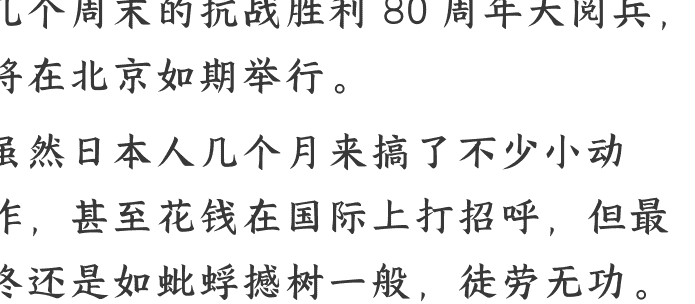
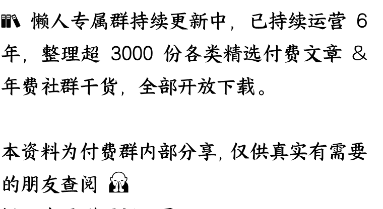

> **公众号懒人搜索，懒人专属群分享**

# 抗战阅兵背后，是非争不可的历史正义

250903 文/卢克文工作室嘉宾 星海舰长
整理：公众号懒人搜索，[**懒人专属群**](https://t.cn/b1772849e)独享
懒人微信：lazyhelper

9 月 3 日，已经让五角大楼加班了好几个周末的抗战胜利 80 周年大阅兵，将在北京如期举行。

虽然日本人几个月来搞了不少小动作，甚至花钱在国际上打招呼，但最终还是如蚍蜉撼树一般，徒劳无功。

不得不说，哪怕过了八十年，日本还是那个日本，一点都没变。

不过有一点还是要佩服的，哪怕阅兵都已经确定举行了，还有日本的远程养殖动物在网上敬业地刷那些陈年话术：

> - 花这么多钱搞阅兵，还不如把钱省下来给贫困儿童
>   - 发生育补贴
>   - 发消费补贴
>   - 解决就业
>   - 充入社保
>   - ......等等等等。

既然都说到这了，我们今天不妨聊聊这个话题。

## 我们为什么要阅兵？

我们先回答一个问题，二战胜利纪念日是哪一天？

恐怕大部分人都觉得是 8 月 15 日，毕竟日本是这一天宣布投降的。

但是，这个问题并没有统一的答案。

在国际上，关于二战胜利日这个问题，答案一共有 4 个，分别是 5 月 8 日、5 月 9 日、9 月 2 日、9 月 3 日。

为什么会出现这个问题？

说白了，还是因为二战史观不同。

欧洲人觉得，二战始于 1939 年德国闪击波兰，而苏联（俄罗斯）人觉得，二战始于 1941 年 6 月苏德战争爆发，争议无非就是自己啥时候介入战争。

开始时间倒是好说，可就连战争结束时间，苏联和欧洲也有争议。

为啥？因为 1945 年 4 月 30 日纳粹投降，5 月 8 日生效，欧洲人就觉得二战是这天结束。

可就连欧洲人自己也有争议，因为欧洲在战争期间分裂，德国投降后，欧洲人认为，英美对德国投降起了决定性作用，所以 5 月 8 日。

但没想到，苏联的官方态度是 5 月 9 日。

所以，这口气，苏联人咽不下。

很多人都想不明白，为什么苏联要把德国投降日定成 5 月 9 日，而不是 5 月 8 日？

原因很简单，1945 年 8 月 15 日，日本宣布投降，但正式投降是 9 月 2 日，所以苏联把 5 月 9 日定为了胜利日。

这其中的原因，是因为谁有权宣布胜利？

1945 年，虽然英美代表的劝说，下，苏斯洛帕罗夫与苏德签署投降书，所以苏联把 5 月 9 日定为了胜利日。

这种认知差异，导致欧洲和苏联在胜利日上的争执，直到今天，欧洲和俄罗斯依然对二战结束日期存在不同看法。

所以，在中国，8 月 15 日并不意味着我们的胜利，又怎么能把 8 月 15 日作为我们的胜利日呢？

如果我们也用 9 月 2 日作为纪念日，世人就只会记得，日本是在美国军舰上投降的，中国十四年的抗战、3500 万军民的牺牲，又置于何地？

## 阅兵不仅是秀肌肉，更是历史立场

250903 文/卢克文工作室嘉宾 星海舰长
整理：公众号懒人搜索，[**懒人专属群**](https://t.cn/b1772849e)独享
懒人微信：lazyhelper

如果我们把中国比作一个家庭，那么抗战就是全家人的生死搏斗。

但问题在于，日本和美国人似乎并不这么认为。

阅兵亮相，美国人再舍不得。

当中国只有歼 -8 的时候，美国还要死保台湾。

当中国有歼 -20 的时候，美国还会死保台湾吗？

恐怕想的更多的是，当中国端出六代机 +4 种 CCA、十几种反舰导弹，以及令人眼花缭乱的无人机，美国人还会死保台湾吗？

兵伐谋，而阅兵就是最直观的威慑。

正如参加阅兵的一名老士官所说的：

“我们这些装备，就是最好的威慑。”

什么是威慑？

当东风 -5C 那粗壮的筒子，摆在我们面前，日本在怕什么？

怕的就是中国，能瞬间把东京变成灰烬。

在过去，世界上主流的国家，都在使用“大东亚共荣圈”来粉饰自己的侵略行径。

不得不说，这种史观，是典型的日本人的。

九一八事变开始对中国的侵略行动，日本人和美国人，那中国呢？

更可气的是，日本炒作“台海有事”，日本花钱，日本就连吃不起米，这种仇怨，又岂是几十年能化解的？

这种仇怨，中国就是要用阅兵来化解。

你要是日本人，中国不阅兵，你是不是觉得中国忘本了？

理解了这一点，你自然也就理解了中国的历史观。

浸淫中华文化千年的日本，在历史上就是中国的附属国。

而这件事，中国就是要让全世界看到，日本在中国历史上的位置。

一代人，过去了，过去，是那些先辈，现在，轮到我们了。

## 懒人专属群（介绍）

📚 **懒人专属群**（介绍）

本资料，仅用于学习交流，请勿用于商业用途。

https://lazy2025.top/record

懒人专属群更新记录（需梯子，备用）：

https://lazybook.fun/record2

