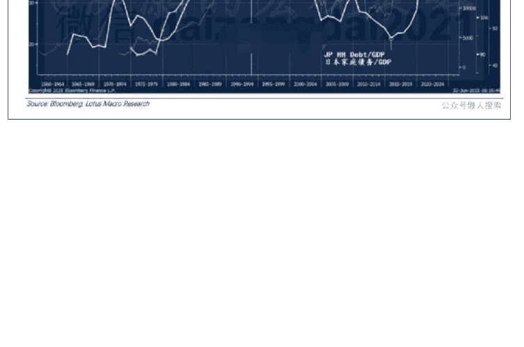
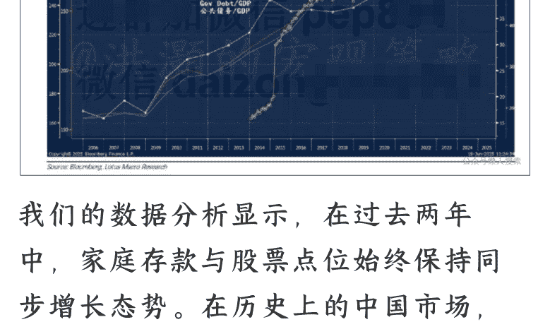
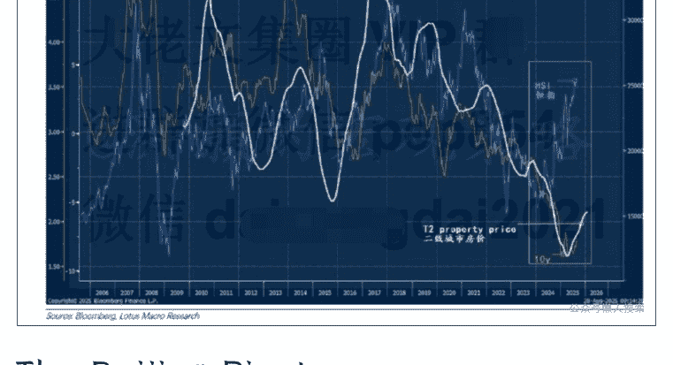
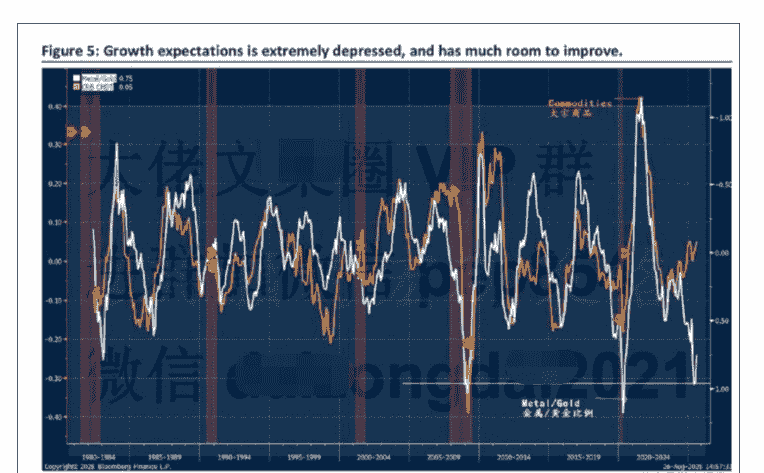

# 政策的拐点—牛市还能跑多远？

250903 洪灏

整理：公众号懒人搜索，**懒人专属群**独享

懒人微信：lazyhelper

正确认识牛市的成因，是确立牛市信心的根基。

市场对于牛市依然将信将疑，并错误的认为"存款搬家"和“无风险收益率降低”是本轮牛市的成因。这些看似有道理的共识其实是没有数据支持、无法站得住脚的。正确认识牛市的成因，将决定本轮牛市还能跑多远。

这个报告给出了明确的答案。

## Deposits Moving into Stocks Not a Cause of the Bull Market

## 存款流入股市并非牛市成因

After a short and shallow correction during the week, the Shanghai Composite is nearing 4,000, a level forever remembered by most when the People's Daily wrote an article titled "4,000 is only the beginning of the bull market" during the 2015 bubble. Now that the bull runs on, disregarding a series short-term technical overbought signal, many are bedazzled and start to wonder whether this bull has run too fast and too far.

I was honored to be invited to give a keynote speech at Morgan Stanley's *China Best Summit*. My ex-colleague and friend, Morgan Stanley's Chief Asia Economist Chetan Ahya hosted my session. In front of a packed room, I could barely spot familiar faces from ten years ago. Many more were fresh-faced and eager to listen. In China, it is often said that while veterans initiate a bull market, amateurs can blow it into a bubble.

经过上周期间短暂且幅度较浅的调整之后，上证综指再度趋近 4000 点。这一点位令众多人士印象深刻，原因在于 2015 年的市场泡沫时期，报纸曾刊发一篇有关“牛市起点的点位”的文章。当下，中国牛市持续迅猛发展，对一系列短期技术性超买信号未予理会，这使得众多人士感到目不暇接，并开始质疑本轮牛市的涨幅是否过于迅速、力度是否过于强劲。

上周五，本人有幸获邀出席摩根士丹利中国投资峰会，并发表了主旨演讲。我的前同事兼挚友、摩根士丹利的

## 首席亚洲经济学家 Chetan Ahya

在座无虚席的会议现场，我几乎难以看到十年前那些熟悉的面容，映入眼帘的更多是年轻且略显青涩的面孔。他们皆全神贯注地聆听着。中国股市资深投资者常言：牛市依赖经验丰富的老手，泡沫则要看新入场的新手。

## 以下内容仅 V+会员可见

In our previous emailed report in July titled "China's Anti-Involution Trade", we discussed the current bull run and noted the divergence between stock performance and economic growth indicators. When examining China's property sector in comparison to Japan's property market during the 1990s, data suggest that China's deleveraging process is still in its early stages. The pattern of leverage accumulation leading up to China's property market peak in 2021 shows notable similarities to Japan (Figure 1).

Although efforts have been made to manage leverage, statistics indicate it has continued to increase across various areas (Figure 2). The presence of a strong bull market in this context is notable. It is commonly suggested that retail investors reallocating savings from banks to stocks has contributed to the bull market. However, this interpretation may conflate correlation with causation

在我们于 7 月发布的一篇标题为《亚鲁藏布牛》的报告中，我们探讨了一个大牛市即将来临的情况，并明确指出，牛市并不在意股票表现与经济增长指标之间的背离现象。通过将中国房地产市场与 20 世纪 90 年代的日本房地产市场进行对比可以发现，中国的去杠杆进程目前仍处于初始阶段。在 2021 年中国房地产市场达到峰值之前，中国经济中的杠杆积累状况与当年的日本存在显著的相似之处（详见图 1）。

尽管相关部门已经采取了一系列措施对杠杆进行管控，但数据表明，经济各部门的杠杆仍在持续攀升（详见图 2）。在这样的背景之下，如此强劲的牛市的出现就显得尤为引人注目。市场的普遍共识是，散户投资者将银行存款重新配置到股票市场，进而推动了此次牛市的形成。然而，这种解读很有可能混淆了相关性与因果关系。

And there are some who believe that the relentless plunge in bond yields lowered the "risk-free" rate and thus pushed stocks higher. This view could not be more wrong, as there is no such thing as risk-free rate in China. Even local government bonds are risk free, and the credit spread between different ratings of corporate bonds is thin. Every rate is risk free. Additionally, bond fund managers and equity fund managers are distinct individuals: thus, they cannot simply reallocate capital from bonds to equities at will. Regarding investor preferences, wealth management products and fixed-income-plus products remain the top-selling financial instruments. Notably, data indicate that equity ETFs have experienced outflows over recent months despite a rising market.

还有很多人认为，债券收益率的持续大幅下跌致使“无风险”利率降低，进而推动股市上扬。然而，此观点完全站不住脚。中国实际上并不存在所谓的“无风险利率”。即便地方政府债券同样存在风险，不同评级公司债券之间的信用利差亦较为微小。简言之，所有利率都是无风险收益率——因为刚兑没有根本打破。

另外，债券基金经理与股票基金经理属于截然不同的群体，因此，他们无法随意将资金从债券领域重新配置至股票领域。就投资者偏好层面而言，理财产品与“固收+"产品依旧是最为畅销的金融工具。需要着重指出的是，数据表明，尽管市场呈现上涨态势，但股票指数基金（ETF）在近几个月却出现了资金外流的情况。

Furthermore, long-term yields have remained relatively stable even as equities have appreciated. Our analysis suggests that declining property prices have anchored long-term yields by reinforcing deflationary expectations. As previously discussed, China's deleveraging process has only just begun and, if historical precedent from Japan is considered, may require several years to complete.

此外，即便近期股票价格呈现上涨态势，但长期收益率依旧维持相对稳定。我们的分析显示，房价下跌强化了通缩预期，进而锚定了长期收益率。如前文所述，中国的去杠杆进程方才起步，若参照日本的历史经验，这一过程可能需要数年时间方可完成。

Source: Bloomberg, Lotus Macro Research

## **The Beijing Pivot**

In our previous email report titled "China's Anti-Involution Trade", we explained why the Yarlung-Tsangbo River dam project was instrumental in arresting the aggravating deflationary expectation, and was an important part of the anti-involution campaign. We read this message from the way how the project was discussed, approved but then communicated in a relatively low-key manner in official mouthpieces.

Before, the attitude towards the threat of deflation was somewhat dismissive. The initiation of the anti- involution campaign signals how decision makers may have changed its mind. And the trade has subsequently changed from the deflation theme, which typically includes buying bonds and high-dividend yield stocks, to the reflationary theme, which tends to include buying into expensive high-growth stocks.

在我七月那篇题为《亚鲁藏布牛》的报告中，我阐释了雅鲁藏布江大坝项目在抑制日益加剧的通缩预期方面所发挥的重要作用，以及该项目作为反内卷行动重要构成部分的原因。我们从该项目的讨论、审批流程以及后续媒体相对低调的报道态势中解读得出这一信号。

在此之前，各方对于通缩威胁的重视程度相对有限。而反内卷行动的启动意味着决策者或许已转变思路。相应地，市场交易主题则从通缩主题（通常涵盖债券及高股息率股票的购置）转向了再通胀主题（往往涉及高估值、高增长股票的买入）。

This pivot of policy intent is the most likely cause of the current bull market. As anti-involution is a long-term mantra, and its significance is overlooked by consensus and seldom discussed in the market, it will likely remain as a key driver of the bull run.

As deflationary expectation lessens, we are likely to see the current bull market continue higher. And if there is a successful relief of deflationary pressure in the economy, even if it will only be transient, such relief would be enough to lift stocks substantially higher from here.

政策意图的这一转变极有可能是当前牛市的成因所在。鉴于“反内卷”属于一项长期政策，并且其重要性尚未获得市场共识的充分重视，在市场中的讨论也相对较少，故而它很可能持续作为牛市的关键驱动力。

随着通缩预期的逐渐减弱，当前牛市很可能将持续上行。此外，倘若经济中的通缩压力能够成功得到缓解——即便这种缓解仅为暂时性的——亦足以推动股市自当前水平大幅上扬。

If we measure growth expectation by using the industrial metal priced in gold, or the metal-to-gold ratio, we can see that the growth expectation is close to all time low, and is around a level seen in the sever recessions during 2008 and 2020 (Figure 5). Given where the Chinese economic cycle is, and how the market is pricing in forward growth, we believe that such depressed growth expectation is excessive, and indeed represents a contrarian trade for the bulls.

若以黄金计价的工业金属价格，即工业金属与黄金的比值来衡量增长预期，我们便会发现增长预期已逼近历史最低点，并处于与 2008 年及 2020 年严重衰退时期相近的水平（详见图 5）。鉴于中国经济周期所处阶段以及市场对未来增长的定价模式，我们认为这种低迷的增长预期过于极端。而

对于多头而言，这反而构成了一个逆向交易契机。

## Conclusion

We discussed the outlook of the bull market at Morgan Stanley's China Best Conference with the firm's Chief Asia Economist Chetan Ahya. We believe that the consensus view about how the bull market was initiated by household savings moving into stocks and falling bond yield has completely missed the point. Our data analysis and experience in the market do not support such views.

Indeed, Beijing's pivot in its attitude towards the deflation threat is a misunderstood and seldom discussed cause of the bull market. If the reflation efforts are successful, even for a brief period, expensive growth stocks will get even more expensive, consistent with a reflationary trade. And the Chinese market's meteorite rise will likely be beyond the imagination of the crowd.

Further, the policy pivot is still not well understood by the market, and many misleading views about the rally have been circulating around.

Such an environment is conducive to significant further gains. Simply put, the policy pivot is far from being fully priced in. As such, we would ignore the technical bumps here and there during this bull run, and hold onto our positions in growth stocks in anticipation of further upside ahead.

在摩根士丹利中国投资峰会上，我与该大摩的首席亚洲经济学家 Chetan Ahya 就当前牛市的前景展开了深入探讨。我认为，市场共识认为牛市是由存款搬家流入股市以及债券收益率下降所引发的观点，根本站不住脚、经不起推敲。我的数据分析以及积累的市场经验，均无法为这种共识的观点提供支撑。

实际上，中国针对通缩威胁态度的转变，是当前牛市中一个常被误解且鲜少被深入探讨的成因。若再通胀取得成功，哪怕仅维持较短时期，高估值成长股的价格亦将随之攀升，这与再通胀交易的特性相契合。如是，中国市场的涨幅极有可能超出大众预期。

此外，市场对于政策转向的理解尚不够全面深入，关于此次市场上涨的诸多误导性观点也在广泛传播。这样的市场环境为市场进一步大幅上扬创造了有利条件。简而言之，政策转向所产生的影响远未被市场充分消化吸收。因此，在本次牛市行情中，我们将不会受零星技术性波动的干扰，而是坚定持有成长股仓位，以期获取未来更为广阔的上涨空间。

最后，安利小懒的付费群：

## 懒人专属群（介绍）

💻 懒人专属群持续更新中，已持续运营 6 年，整理超 3000 份各类精选付费文章 & 年费社群干货，全部开放下载。

本资料为付费群内部分享，仅供真实有需要的朋友查阅 🕵️‍♂️

## 懒人专属群更新记录：

https://lazy2025.top/blog/record2

备用：https://lazybook.fun/blog/record2