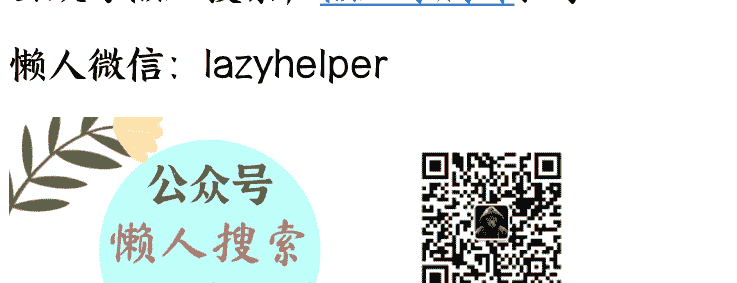
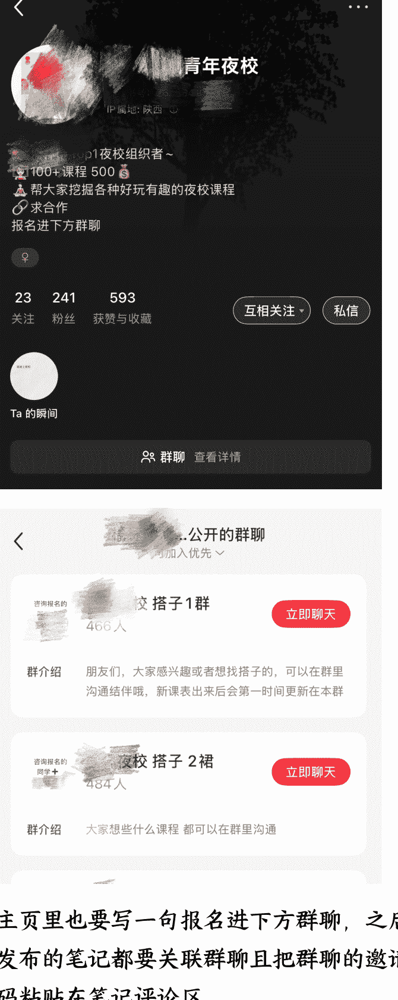
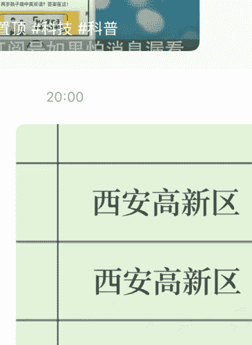
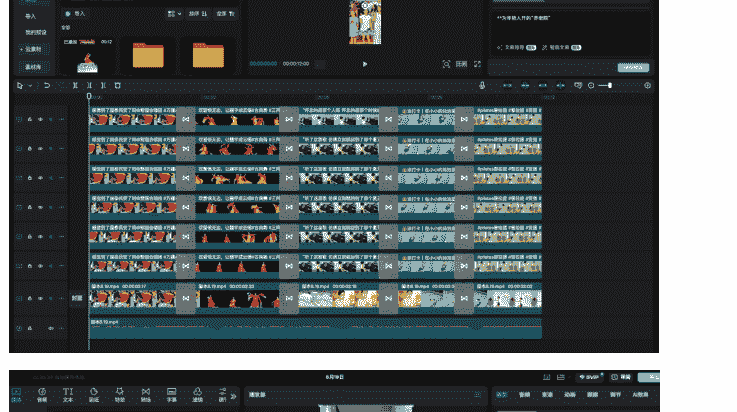
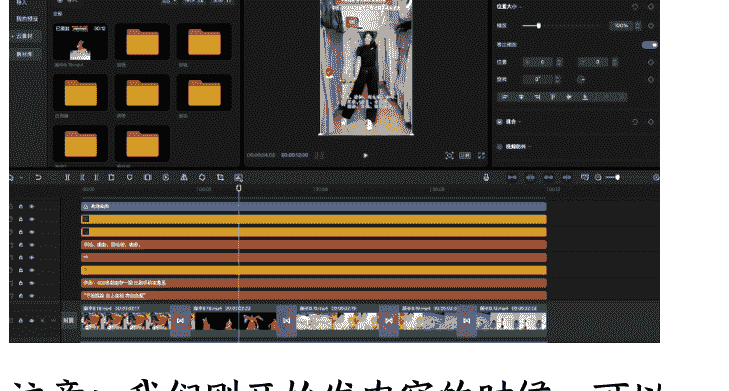

## 25岁 国企离职 生财新手村的升级之路

**250903 生财精华**

公众号懒人搜索，**懒人专属群**独享

懒人微信：lazyhelper

大家好，我是武一，22年毕业后就职于一家建筑国企担任财务，24年3月离职，4月开始为期7个月的旅居生活，5月在橘子洲头加入生财。

到目前为止尝试了12个航海项目，目前依靠从小红书电商学到的批量剪辑方法、运营思路结合同城夜校项目，从今年3月份至今平均月收入达到1w+，迈入新手村。

接下来，你将会看到的是一个天真的生财小白到慢慢积累了一点商业思维的生财新手的心路历程（包含同城夜校项目分享，亲测两座三线城市都是7天左右开始变现，适合需要正反馈积累信心的伙伴）。

## 一、菜鸟期的尝试

把手弄脏，没有白走的路；不是积累金钱就是积累能力

参加过的航海：“小红书店铺（百货）、视频号口播带货、小红书引流 - 教育资料篇、零基础ai编程做产品、YouTube shorts、小红书自媒体 - 商单、ai 应用-web 网站、小红书电商 - 高客单蓝海、ai 零代码自动化、小红书电商 - 蓝海实拍、同城实体发售和同城夜校两个线下航海的项目（我没去线下，通过看精华帖自己做）”。

认真做过的项目只有小红书店铺（百货）、同城实体发售和同城夜校这三个；

### 小红书店铺（百货）

选择项目时的处境：怎么办，没有工作了，我需要一个快速变现的项目，小红书店铺真的行吗？都说是红利期，不管了，上车再说，心想赚钱的日子要来咯（天真的以为赚钱有手就行）。

项目经历：这是7月份我的第一次航海，航海期间跑通了0-1，卖出了几单，这是我赚到的第一块钱，但由于我沉浸在旅居生活的美好，赚钱的欲望还没有特别强烈，就放在一边了。12月份回家后，我还是觉得小红书店铺可做，专注干了近两个月，把所有生财内小红书店铺相关帖子看了一遍，总结了一本笔记。学习选品方法，运营思路，两个号发了近500多条笔记，心中坚信1000条我就可以赚到10w，每天从早干到晚，人都要被榨干了。刚好在这个时间，遇到个机会我去做了同城发售的项目，反馈比小红书店铺来的快，就停了下来，到今天小红书GMV为1967.8。

### 同城发售

选择项目时的处境：埋头干了快两个月小红书店铺，反响平平，这时距我离职已经过去了十个月，加上旅居花的钱，计划是2月份还做不出成绩，就得先找个运营或者销售的工作。

项目经历：偶然打球的时候一个小兄弟向我分享这个项目，让我跟他去跑家这边的市场，因为有在生财看过这个项目的相关帖子，跟他聊了项目细节后，感觉可行，我跑市场签合同，拼团活动链接另有人负责，20多天，我挣了5000多，这是第一次不靠打工挣到可以维持生存的钱。

商业小白刚加入生财，不知道选什么项目是正常的，多看精华帖，不要挑，信息是决策的基础，只有看的样本足够多了，遇到机会，才有可能做出正确的决策；刚开始多参加航海，只有做了，才知道自己真实的水平，以及哪种类型的项目适合自己，哪怕没做成功，也一定会给自己积累某一方面的能力。

### 同城夜校

选择项目时的处境：当时市里的瑜伽馆跑完后，我就在想有没有什么项目可以让客户主动来找我，我提供服务或产品就好，

刚好在看同城相关帖子的时候看到了这篇，接下来就是把所有夜校相关的帖子都看了一遍，发现可操作性非常强。

项目经历：按照精华帖里总结的流程开始实操：

- 1、调研市场，发现我所在的城市竞争小，处于蓝海
- 2、流量先行，小红书，抖音同步发布夜校招生内容
- 3、对接后端商家，制作真实的课程表
- 4、社群运营——朋友圈，群聊，话术迭代听话照做，流量反馈来的还不错，7天就加满了一个小红书群开始了变现，目前为止私域共加了 3600+人。实操细节接下来一个部分分享，如果有小伙伴还没有什么好思路，想感受一个完整的项目，可以接着往下看。

第一次知道什么叫做流量变现，才理解了好多前辈提到的普通人先搞流量这句话的含义，也慢慢有了，看到一个项目，我会想他是如何获客的，客单价多少，在哪成交这些想法，换做之前，我只会做好一个消费者的角色。现在，我会刻意让自己处在创造者的视角。

## 二、同城夜校项目分享

同城夜校项目就是我们作为一个中间商，通过小红书，抖音，视频号这样的公域平台引流到微信成交，我们的产品就是同城的各种培训课程。

看看这几篇会有更好地理解，我就不赘述了：；；

### 市场调研

1、在抖音，美团，地图软件上搜本地商家，看商家种类丰富程度，尤其美妆，羽毛球，网球，乐器类这种比较热门的一定要有。
2、看同行，如果没有同行或者同行做流量的能力一般，那我们就可以干。
3、前期不要畏难，先给自己七天时间再说，哪怕不能成交，感受下引流的动作也行。

### 流量渠道

#### 小红书

##### 账号搭建：原则是搭建好引流微信的通道

这里我用的方法是对标同行学来的，我去假扮成客户，看他是怎么转化我的，遇到问题就找同行。

关键动作：建小红书群聊——更改群聊头像为：咨询报名的同学+你的夜校微信号——录制一段夜校微信二维码的录屏发在群里并置顶——设置群欢迎语：欢迎宝子看群头像或者置顶录屏报名了解——群聊设置在主页展示

主页里也要写一句报名进下方群聊，之后发布的笔记都要关联群聊且把群聊的邀请码粘贴在笔记评论区。

#### 内容制作：原则是模仿近期同行点赞评论数据较好的笔记

###### 1、账号冷启动：可以找一些话题度高的用小红书站内的文字生成笔记功能先激活账号，最好是符合夜校的用户群体，例如：

和相亲对象马上要结婚了，某某城市一般彩礼多少啊？急！

###### 选择配图

-   *基础
-   插图
-   备忘
-   边框
-   光影

选一个喜欢的卡片

下一步

2、模仿并改写爆款内容，图片内容的改写可以用 ai 解决，我这里用的是豆包，可以直接改写图片内容，也可以提取对标笔记的文案。对标的內容可以站内搜夜校相关关键词，按照时间热度排序，哪怕不是近期发布的，也有爆的可能性。

举个例子:

#### 公众号懒人搜索，懒人专属群分享

搜索   夜校西安

# 全部  用户  商品  地点  群聊  问一问

西安本地宝夜校  西安北郊  想找一个搭子  目前感兴...

绿柚
04-02

赞

# 西安高新区
西安高新区
西安高新区

大家都在搜

西安成人夜校

西安夜校都有哪些

西安线下夜校

西安免费夜校

西安夜校
08-03
赞
72

初高中毕业不迷茫
来西安新纪元学中餐
2-3年见证蜕变
0基础可学

在西安
花500

全是高新啊啊...#西安夜校
#社交活动#西安#年轻...

帮我生成图片：格式不变 将西安改为咸阳。原比例。

### 内容制作

3、正式开班以后可以发布真实课程表或者上课实拍视频或者图片

#### 2、抖音

##### 账号搭建：原则还是搭建好引流微信的通道

###### 1、抖音我采用的第一种方法是抖音号修改成和夜校微信号一模一样，这样直接复制抖音号就可以去微信加好友了，并在主页引导：

报名+威信*******（抖音号一键复制）

##### 2、第二种是私聊话术引导+微信、评论区引导主页报名

### **话术：**宝子主页➕我威信会有老师发您详细课表和上课地点 科目不同上课地址不一样哦 抖音不支持发文件链接 辛苦啦！

### **内容制作**：原则是近期热门脚本+批量剪辑

这个逻辑就是在做小红书店铺时候学到的，选好品后，在站内找到近期热门的脚本，导入剪映进行批量混剪。

-   1、抖音站内搜索夜校相关的关键词，找到近期（越近越好）的热门（点赞评论多）的视频作为剪辑脚本，下载到本地（用的是亨亨猫）。
-   2、根据脚本里的内容（舞蹈，书法，网球等等）去抖音/小红书搜相应的素材内容下载到本地按类别分类。
-   3、脚本导入剪映，分离音频，分割素材，按照脚本的素材顺序把我们找的素材按序排列，一次性叠加 20 条左右(为什么是 20 条左右，因为我的电脑再多就有点卡了，根据自己情况来加)。
-   4、添加脚本的视频文案，把城市名字改为自己做的城市，去重（加贴纸，动画，滤镜，裁剪，文字等）逐条导出。

#### “杭州为年轻人开的“养老院”

#### "下班就跑 去上夜校 奔赴热爱”

学员：400就能学一期 比刷手机有意思

国画、书法、花艺、茶艺、瑜伽、古筝、技能培训、羽毛球、咖啡、摄影、剪辑、AI、网球、手工类等

点击推荐>

浙江杭州

@杭州青年夜校 · 8月18日

杭州为年轻人开的“养老院”#热点 #青年夜校 #强烈推荐 #每日分享 #上热搜

#### 视频素材

化妆

游泳

古典舞

书法

舞蹈

瑜伽

合唱

普拉提

游泳2

架子鼓

这所夜校是年轻人的“养老”...常.mp4

爵士舞

吉他

羽毛球

网球

脚本6.6.mp4

脚本3.mp4

注意：我们刚开始发内容的时候，可以一天多个时间点发布测试流量情况，之后就可以选择在那几个流量好的时间段集中发布，如果流量一直不好（一百播放量都不到），就要看看是不是账号有问题，或者换个脚本重新测试。

#### 后端商家对接

-   1、在抖音，美团，地图软件，搜相应的关键词找到相应的培训机构。
-   2、美妆、乐器类、羽毛球、网球、舞蹈、书法可以作为刚开始的切入点（这些一般需求都比较多），人多了之后可以在群里统计看大家想学什么，再去对接。
-   3、话术：您好，我这里有十多个成年人想学某某课程，您那有场地和老师方便教学吗？有的情况下接着说：是这样，我们这是某某夜校，就是给成年人下班后提供一个学习兴趣爱好的平台，现在线上有 2000多学员，我们统一定价498一个人，一次性我们为您提供6人左右，五五分成（实在不行才四六），您看有意向的话，我加您个微信聊聊课程细节吧。（一般能加微信就差不多了，课程设置我把我们的放在下边做个参考）。

|类别|科目|上课时间|开班人数|
|---|---|---|---|
|运动类|瑜伽课程|12节课|单节30分钟，1次上2节，共上6次|
|运动类|瑜伽课程|12节课|单节30分钟，1次上2节，共上6次|
|运动类|钢琴课程|12节课|单节30分钟，1次上3节，共上4次|
|艺术类|书法课程|18节课|单节30分钟，1次上3节，共上6次|
|舞蹈类|古典舞课程|18节课|单节30分钟，1次上3节，共上6次|
|休闲类|茶艺课程|3次课（每次3小时）周末下午2-5点||
|化妆课程|12节课|单节30分钟，一次上两节，共5次课（四次1小时，一次2小时，共五次课）||
|架子鼓课程|20节课|单节30分钟，1次上2节，共上10次|
|运动类|乒乓球课程|18节课|单节30分钟，1次上3节，共上6次|
|艺术类|摄影|15节课|单节30分钟，1次上3节，共上5次|
|艺术类|尤克里里|16节课|单节30分钟，1次上2节，共上8次|
|艺术类|吉他|16节课|单节30分钟，1次上2节，共上8次|
|运动类|古筝|16节课|单节30分钟，1次上2节，共上8次|
|运动类|电子琴|16节课|单节30分钟，1次上2节，共上8次|
|舞蹈类|爵士/古典舞|16节课|单节30分钟，1次上2节，共上8次|
|舞蹈类|爵士/古典舞|980元30天月卡，不限使用次数||
|舞蹈类|爵士舞|8次课每次1.5小时周二周三7:00-8:15||
|拳击课程|12节课|单节30分钟，1次上2节，共上6次|
|运动类|游泳课程|12节课|单节30分钟，1次上3节，共上4次|
|艺术类|书法课程|12节课|单节30分钟，1次上2节，共上6次|
|运动类|拳击课程|16节课|单节30分钟，1次上2节，共上6次|
|艺术类|绘画课程|6次课，每次1.5小时周二周五6:15-7:45/6:30-8:00||
|化妆课程|12节课|单节30分钟，1次上2节，共上6次|
|乐器类|吉他课程|16节课|单节30分钟，1次上2节，共上8次|
|运动类|羽毛球课程|18节课|单节30分钟，1次上3节，共上6次|
|运动类|羽毛球课程|20节课|单节30分钟，1次上4节，共上5次|
|休闲类|烘焙课程|10节课|单节30分钟，1次上2节，共上5次|
|运动类|网球课程|12节课|单节30分钟，1次上2节，共上6次|
|艺术类|声乐课程|16节课|单节30分钟，1次上2节，共上8次|

##### 社群运营

###### **群公告**

群公告要把课程信息，夜校是什么，定金规则，参课流程，退费规则都写清楚并在群聊置顶，避免重复提问。

我的群公告供参考：

#### **夜校课程表【金山文档 | WPS 云文档】**

#### **夜校课程表 online**

（加入你的在线课程表格）

#### **夜校服务说明：**

- ☐ 帮凑人开课，人数达标后，统一开课
- ② 定金规则（必读）：

##### **50 元定金作用**

-   - **1.效率保障**：支付后立即锁定席位，按顺序优先匹配课程资源；
-   - **2.双向承诺**：学员减少随意弃课，校方精准预留师资/场地；
-   - **3.退款灵活**：开课前 3 天可申请无理由退款

##### **!尾款规则**

-   - 尾款需在开课前！天 18:00 前结清；
-   - 超时未付则定金不退，席位自动释放。

##### **③参课流程：**

- 私聊我想学的科目→提供姓名电话支付定金 50 报名占位（开课前都可退）→人数达标后拉约课群确定上课时间→时间合适的情况下补缴尾款→统一参课（报名人数够了咱才开班 时间您觉得合适了才上课；所以不用担心时间问题，主要看上课地方和课程次数。）

##### **④退费规则**

-   1.不可退费情形：学员因个人原因（包括但不限于时间冲突、个人事务、主观放弃等）提出退费申请，已支付的定金及尾款均不予退还。课程开课后，因学员自身原因中途退出，费用不予退还。
-   2.可退费情形：因夜校方原因（如课程取消、重大时间调整等）导致学员无法参与，全额退还定金及尾款。学员因不可抗力（如重大疾病、意外事故等）无法参与，需提供有效证明（如医院诊断书、事

故证明），经审核后可协商部分退费或延期。
期。

###### (5)因个人原因误课不退不补望周知！！！

### 通过好友流程

1、每个好友都要设置数字标签，从1开始，每个标签人数控制在40人以下，因为拉群里只能一次四十个人
2、群发话术（利用群发助手，按照标签选择要发的好友），还是为了避免重复提问 +引导进微信群

#### 我的群发话术供参考：

① 欢迎宝子先进群，群公告可解答部分疑问；课表及开班上课情况均在群里通知，若仍有不解，随时私聊咨询～
② 报名成功后，人齐将邀请进入约课群，后续上课时间由老师统一安排，确认合适再参与
③ 特别提醒：课程期间因个人原因缺课，不安排补课及退费，感谢您的理解与配合！

进群后！

### 参课流程：

私聊我想学的科目→ 提供姓名电话支付定金五十报名占位（开课前都可退） → 人数达标后拉约课群确定上课时间 → 时间合适的情况下补缴尾款 →统一参课

报名人够了咱才开班 时间您觉得合适了才上课 ；所以不用担心时间问题，主要看上课地方和课程次数。

## 三、新手村感悟

-   1、离职这件事，要结合自身情况，如果有条件，在生财一边副业一边上班是个不错的选择，如果已经做出了选择，就努力让自己的选择变得正确。
-   2、多看书，多出去走走，看更多的人生样本，搞清楚自己想要什么样的生活，然后寻找实现路径，生财应该是最小成本获取优质信息的渠道。
-   3、实操，早日靠自己赚到第一块钱，形成闭环，这个带来的体验比出卖时间要强烈，更能让自己清醒一些。
-   4、认识到问题是解决不完的，要臣服，接受当下的一切，做具体的事。
-   5、把生财作为信息的检索站，主动搜索需要的信息，工具。
-   6、照顾好自己的情绪，饮食，运动，书籍，家人，充满电了就好好干。
-   7、先完成，完不完美再说，不断迭代。
-   8、参加生财线下的活动，多分享，链接同频的人，我在刚加入生财后刚好旅行到广州，参加了两个线下活动，但由于自己没有实操过，只能讲一些书上看到的东西，虚无缥缈。还见到了涛哥，但也只能打个招呼，没有基本盘，没有经验，你连提问都不会。

#### 招生信息发布

1、按照模版来发会更省力

💥 ***开课啦！想要的宝子们别错过！

👋报名方式：私聊想学科目并提供姓名电话，50定金占位

📅开课日期：成团开课

📅上课时间：周一周三 6:40-8:10

📍上课地点：********************

👶女上课名额：共 6 个名额

💰课程价格：18节课 498元|单节30分钟，1次上3节，共上6次

2、朋友圈也要时常更新，有的人就是不愿意进群，但可能看到朋友圈会来咨询
3、注意频次，太多太少都不行，尽量大家早上刚上班，中午吃饭，下午下班这些时间段发比较好

#### 开班收尾款

我们根据定金确定报名人数，人齐后拉群（把授课老师也拉进群，增加可信度），确定好上课时间后，开始收尾款，话术：宝子们，我们人够啦，现在可以开始结尾款了，我们提前给老师结课时费和场地费，收齐学费后，按事前约定比例转给老师，至此，形成闭环。

#### 售后

难免有退费情况，我的原则就是能用钱解决就不浪费口舌，算好账，在能接受范围内，退点钱，会少很多麻烦。

这就是整个项目的分享了，希望大家能有所收获，早日赚到自己的第一块钱，欢迎交流。

9、不要等，主动研究，主动搜索，不用等到航海开始了才做，不用等人带了才开始，赚钱是自己的事。

10、越分享，越幸运。

用纳瓦尔宝典里的一句话作为结尾：我宁愿成为一个失败的创业者，也不愿成为一个从未尝试过创业的人。

### 最后，安利小懒的付费群：

懒人专属群（介绍）

本资料为付费群内部分享，仅供真实有需要的朋友查阅 👤

### 懒人专属群更新记录：

[https://lazy2025.top/blog/record2](https://lazy2025.top/blog/record2)

### 懒人专属群更新记录（需梯子，备用）：

[https://lazybook.fun/blog/record2](https://lazybook.fun/blog/record2)