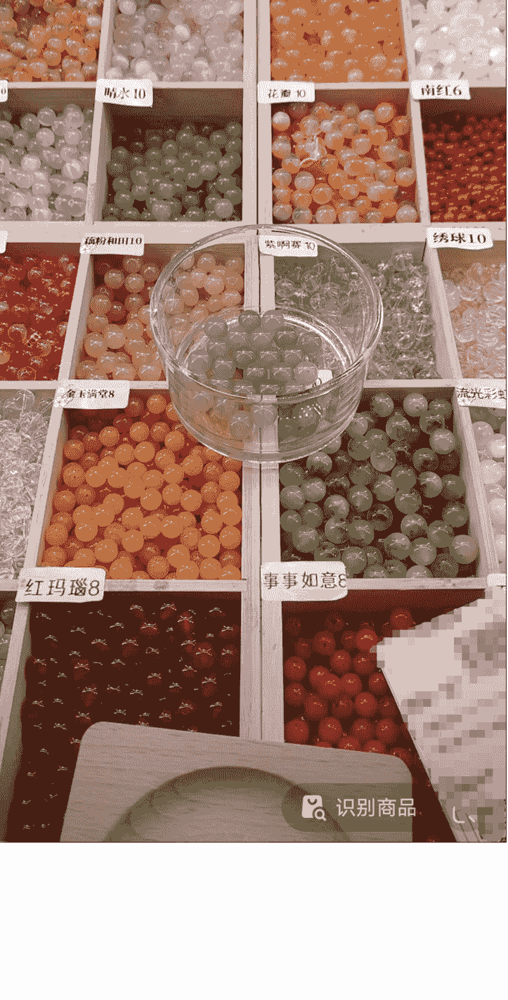
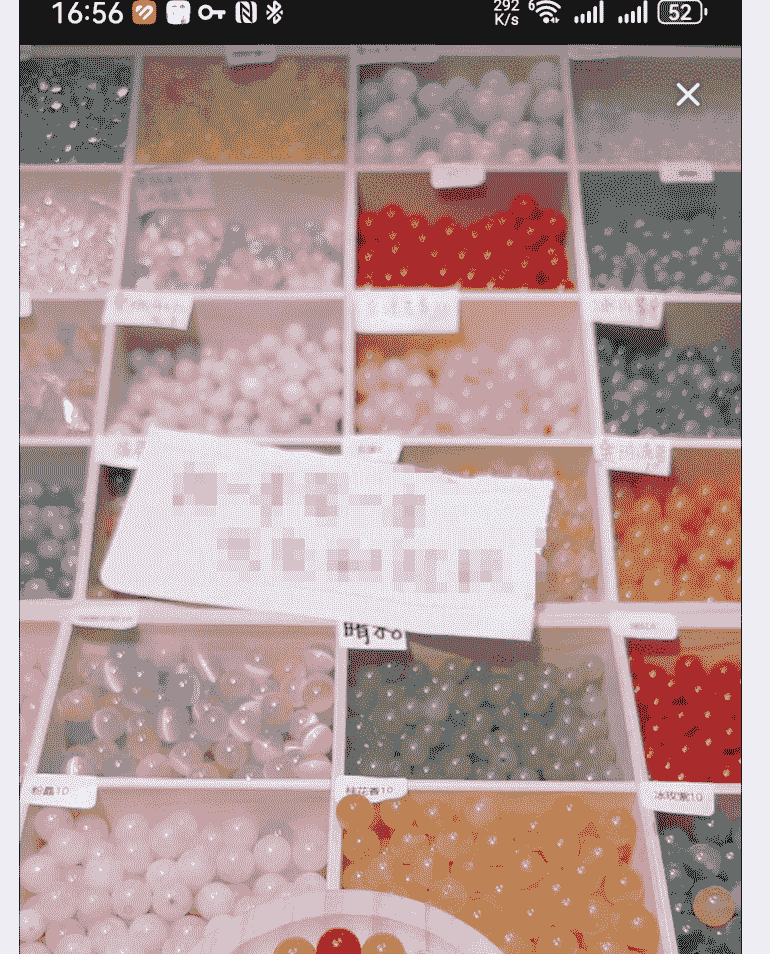
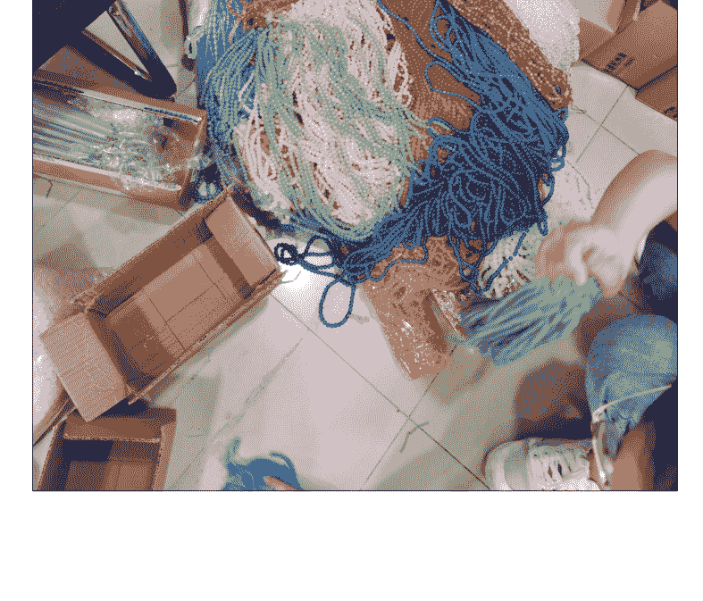
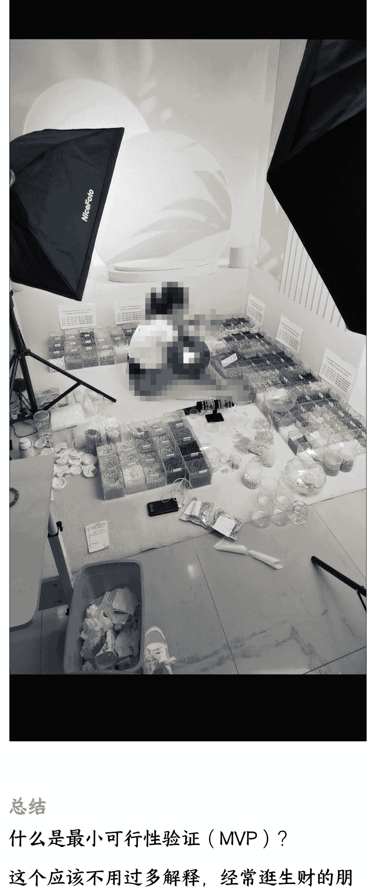
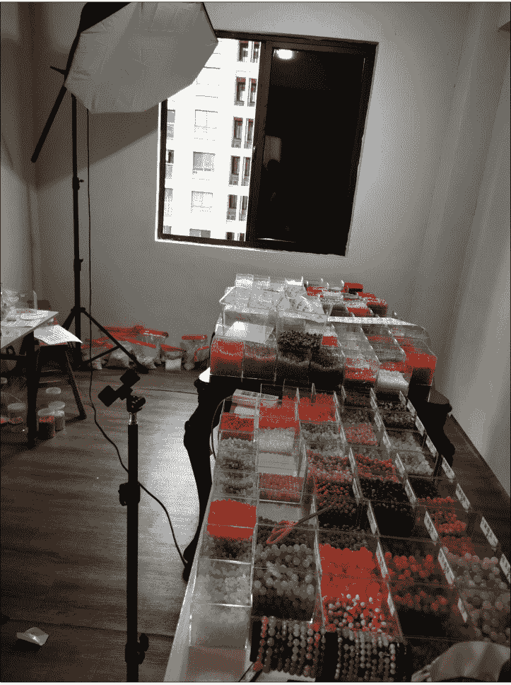
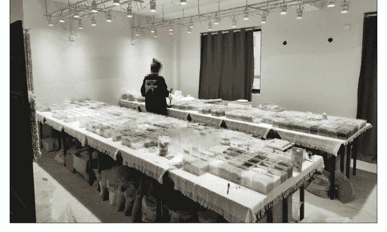
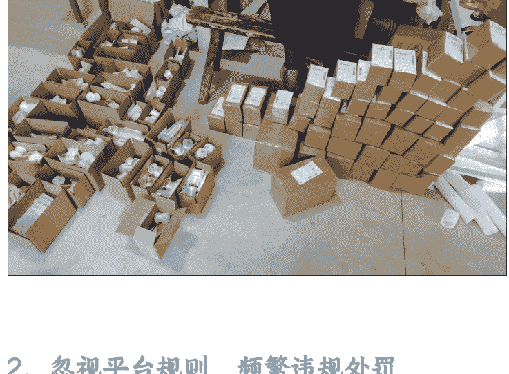
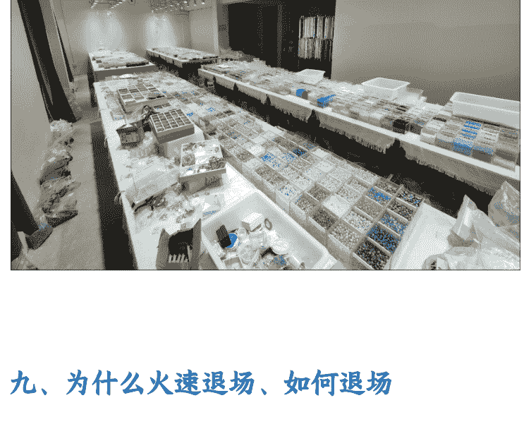
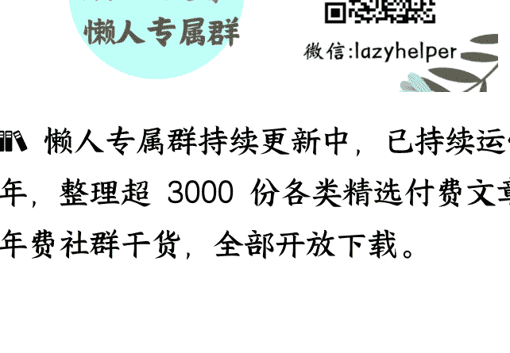

# 从 0 到 1：抖音 DIY 手串类目 TOP 直播间的全面复盘

250903 生财精华

公众号懒人搜索，懒人专属群独享

懒人微信：lazyhelper

## 一、前言

### 背景简介：两个人，一年时间，从 0 做到类目 TOP5

项目是我在 2022 年 7 月至 2023 年年中操盘运营的一个抖音有货源直播项目，类目是 DIY 手串，核心成员就是我和我对象两个人，从一个新账号做到了类目 TOP 前五，总营收 7 位数，净利润...只能说，毛利还是很高的，后文会告诉大家。

本篇文章将全面复盘和回顾本项目从 0 到 1 的全流程和细节，包括从赛道的选择、到如何寻找供应链货源、到项目的运作发展和退场、到中间我踩过的坑，基本上都涉及到了。有些是我以叙述实际经历来进行分享，有些是直接讲我已经总结好的经验和技巧。

### 本文适合人群

想要做、想要了解有货源直播的

想要了解关于找供应链、找货源等相关细节与技巧的

正在做类似直播项目的个体，想了解相关运营、避坑等细节的

想要了解如何从 0 到 1 操盘运营一个项目的

单纯想拓展知识面、了解学习的

### 如何从本文中提炼“道”与“术”？

我特意讲明本项目是 2022 年到 2023 年运营的，是希望大家阅读前有一个基本的认知概念。因为在不同时段，市场情况与竞争是有差异的，但不要忘记过去几年的经历就没有参考性或者学习价值了，大家需要理性看待。

或许大家现在没办法全盘再去复制我当时的经历，但是我们应该要：

从“道”的层面，去理解方法论与底层逻辑，理解在面临决策时，我做抉择的“为什么”和“怎么选”；

从“术”的层面，去学习实操方法与技巧，学会在具体情况下应该”怎么做“。

我一定不是最优秀的，但我分享的经历和内容一定还是有所价值的。

## 二、赛道选择 —— 从偶然发现到商业洞察

### 灵感来源：一次“上头”的刷抖音经历

2022 年年中大概六七月份的时候，我们还在杭州做女装直播，平时会经常刷一刷抖音直播有目的性的看看目前主流的一些直播形式和玩法。恰好我对象刷到了几个 DIY 手串的直播间，连麦选款的直播形式，款式种类非常多，加上珠子本身好看，装单的过程又非常解压，一下子就吸引住她了，连着刷了好几天，蹲在直播间看别人装单。

### 商业模式拆解：DIY 手串直播间的“人、货、场”与核心玩法

直播间大致的形式是这样的：

产品本身是 DIY 手串的原材料，即散装的琉璃珠（实际是玻璃珠子）。

有一个比较大的场地，一个个不同颜色珠子装在不同的盒子容器内，整齐排列在桌上。

主播不露脸，手机直播，手机放支架上，镜头对着桌面上的盒子。客户在线跟主播连麦选款，主播实时按要求拿勺子把珠子舀出来装入客户下单容量的容器内。

销售规格是按毫升杯容器容量，以毫升（ml）计，客户下单选择不同的容量，如 1000ml，2000ml 等，装满为止（还会多送一些，又称为“多宠”一些）。

有些直播间会给不同款式珠子取不同名字，客户报名字让主播在线装，其他在等待的客户可以跟着直播间流程“做笔记”（即把喜欢的珠子名字记下来，等自己上麦的时候直接报名字装）

全场任选色

公众号懒人搜索，懒人专属群分享

### 培养“创业者视角”：如何从娱乐中发现商机？

总结一下，所以还是要养成多刷多看的习惯，而且一定要有目的性的，不是那种“一打开抖音就忘记自己要干嘛”的刷。

比如我们是为了找比较新颖的直播形式和玩法，那么这就是我们在刷直播的时候的重点，至于主播好不好看、产品什么价格、粉丝多与少等等各种乱七八糟的，这都是次要的，就盯着形式 + 玩法 + 产品来重点看。

我们一定要有意识，即“我的视角就是与普通人不一样”，在别人眼里，可能只是千万直播间中的其中一个比较吸引人的直播间，但是在我们眼里，要充分发现其商业价值和潜在机会。

## 三、市场分析 —— 用数据说话，判断赛道潜力

### 我是如何分析市场的？为什么我认为这个赛道“能干”？

我对象本身单纯是因为感兴趣，刷到后就沉迷其中了。而我是干运营出身的，看到这种情况，第一反应就是做相关的市场调研和同行分析。当时蝉妈妈和灰豚拉了一些数据，加上刷了一些同行直播间，大致分析一下，得出结论：

市场之前不温不火，大概从 2021 年开始火起来，还处于增量市场，即市场上升期；

主要消费者以 18-30 岁年轻女孩为主，且其中有一定比例的手作作者（自己串好手串去卖的）

竞争对手水平参差不齐，专业直播间极少；

投流直播间很少，基本靠自然流，甚至基本靠老客户；

类目客户黏性极高，复购率极高，留存率极高；

品单价参差不齐，有高有低，但头部直播间以高客单为主

### 分析框架：搭建你自己的项目分析模型

从上面的结论，大家应该能够大致的倒推出来，我对一个项目的前期大致分析方向如何：

- 市场发展历史与现状，市场容量，市场增量与存量状态
- 消费群体，价格带，人群画像
- 竞争对手数量、专业度、流量渠道
- 点击率，转化率，复购率

当然，这只是其中一些分析方向，不过在大部分时候够用了，也仅仅是我自己习惯的一些方式方法，大家还是要结合自己的实际来。

所以综上，竞争与市场都尚可，就要开始深入了解这个行业了。

## 四、供应链与定位 —— 深入产业带，打造差异化

### 货源是命脉：我挖掘供应链的 3 个独家技巧

光市场分析还不够，因为我们不懂产品本身，所以下一步重中之重，就是找货源、找产业带，深入这个行业。

这里直接分享我常用的几个思路给大家：

通过分析大量同质化严重的直播间的发货地，得出大部分直播间的聚集城市，大概率就是较为集中的货源地；我们这个项目之中，我刷到最多的就是义乌发货的直播间，结合“义乌小商品”的定位，不用想，义乌肯定是其中一个货源地了。

这里要做一个强调和解释：

### 核心关键词： “同质化严重”

首先，什么是“同质化严重”？就是字面意思，这些直播间无论是产品、画面、形式、价格等等多方面都高度相似。

其次，为什么是“同质化严重”？因为高度同质化，意味着同行的低门槛、大批量复制，而从概率上来讲，能形成这种行业规模的，基本上就是在货源地附近。

充分利用各种自媒体、电商平台、搜索引擎等进行索引，比如抖音、小红书、闲鱼、淘宝、1688 等等。

这里有这么几个搜索技巧，除了常规的搜“XXX 去哪里拿货”，"XXX 货源在哪里”等，我们还可以尝试：“XXX 直播间”“倒闭清仓”、"XXX 拿货避雷”、“XXX 拿货态度差”、"XXX 直播间的货源都是从......"等相关搜索词和长尾词，往往会有意想不到的效果。

另外，千万不要忽略小红书、闲鱼这俩平台的信息，一个会有不少关于种草、避雷、同行交流、客户交流的信息，一个会有不少关于清仓、处理、货源地直发等信息。

再就是传统的电商平台，尤其是以 1688 为主的产业带电商平台，可以让我们直接了解到相关的货源地信息。

“欲得虎子，先入虎穴”：简单明了，想知道同行的货源信息，先混进他们的粉丝群、微信群、私人微信朋友圈等等，会有客户的交流，或者主理人自己拿货、定做过程的分享和交流等等。

当我们充分了解了产品的货源信息，比如我们这个项目，当时就了解到几个主要的涉及地：义乌国际商贸城、义乌福田、义乌兴中、深圳荔湾广场、汕尾可塘等等。接着就是深入货源地，去了解产品，比如品种、价格、质量、工艺等等。

这个过程会比较煎熬，因为会不断碰壁（没找对地方），也会碰到各种串货（N 道贩子，各种加价后卖你），但是不要急，一点点摸索，即使前期没摸到你想要的货源，这个过程中也积累了很多其他类似或相关的品类、批发市场等，说不定以后能用上。

我们当时义乌各种地方跑了个遍，广州深圳也都去跑过，最后是在义乌国际商贸城和附近的一些市场拿货（义乌有很多小区区域批发市场，比如福田、兴中、诚信、北下朱等等）。

当时粗略一算高客单直播间的毛利，起码 80-110% 以上，能想象吗？

干就完了！

### 定位与选品：为什么我坚持做高客单价？

相比低价跑量，我是喜欢做高客单价、高毛利的。只有足够利润，才能保证我有能力空间选好品、做好品控、做好服务，让客户收到东西觉得值且愿意复购，才能让这个生意持久的运转下去，才能不断积累优质的口碑。

所以在定位这一块，我们一开始就是对标当时的头部直播间，当然为了有一定竞争优势，会略微的便宜一点。同时，我们充分参考各种同行的选品，结合自己的审美和定位，对产品进行进一步的优化和筛选。坚持“取其精华，去其糟粕”的原则，再好的同行，也会有做得不足的地方；再差的同行，也有值得我们学习和借鉴的地方，即使没有，那也是一个优质的“反面教材”！

对应的，选品这一块我们也会比较严格一点。我对象眼光比较好，她主要负责选款；我更细心，我负责检查质量。当时整个市场，我们是唯一一个，还会带着手电筒作为补光和透光的工具，检查珠子的质量与瑕疵的。我们有时候会自嘲，“明明就几分钱的东西，我们整得像是鉴定几万的宝石一样”。

看到这别笑，也正是因为我们要坚持的初心和高要求，后期好评率还是非常高的，客户黏性也很好，客户会明显感觉到我们家的货比其他家的整体品质要好一些，尽管大部分都是市场货，但是我们的筛选标准不一样。

#### 总结 —— 关于定位与选品策略

定位层面：

- 始终坚持差异化：可以从款式、客单价、单品&组合&捆绑销售、选品标准、服务等等层面入手，只有坚持“差异化”定位，才能让我们从“同质化严重”的直播间中脱颖而出。
- 敢定高价，敢要利润：高客单 + 高毛利，才能有余地做品控、服务、口碑积累，是长期主义的坚持。低价跑量容易吸引流量，但缺乏复购与长期价值。
- 对标头部，但不盲目模仿：一定要清晰认识到一点，在你看到的时候头部之所以是头部，是多重因素叠加的，【她们也许是赶上了好时间、也许起步的时候钱砸出来的、也许是有强实力的运营和主播、也许是天选号、也许是刷了很多数据，等等】，因此要理性分析和学习头部直播间，同时结合自己的实际情况。

选品层面：

- 信息获取技巧：多平台交叉索引 + 另辟蹊径长尾词 + 成为同行的粉丝 + 混同行的私域和社群
- 供应链调研：亲身下场跑市场，积累前线一手讯息（网络上分享的很多都是抄来抄去的文案，只有你亲临现场，才知道实际是怎么回事），不要怕走弯路，所有你的经历和试错都是你未来的门槛与护城河。
- 建立合适的选品与品控标准：如果你对自己都没有要求，凭什么还想获得客户的认可？一定要建立“长期主义”思想，虽然不要求一次性完美，但是要有追求完美的态度。

## 五、MVP 验证 —— 用最小成本跑通商业闭环

低成本启动：几千元货品 + 现有场地，在地上开播

决定要做，那就是立马验证可行性了，前期不要过渡投入。

前期我们就拿了首批一点点货，几千块钱（前期量少，在货源处是几乎没有议价权的，不要紧，不要太在乎前期的利润，不同时期目的不同，前期最主要目标是跑通流程完成起号，那么利润就是次要的。当你做起来了，有量了，那么做利润就是顺其自然的事情了。）

在 1688 上采购了一些装珠子的盒子，一点包装纸盒和包装袋，场地用的是现有的女装直播间的场景，因为地上铺了毯子，我们就把盒子直接放地上，直接在地上播，灯光也是用的现成的。省去了买各种桌子等等杂七杂八的钱，虽然人要佝偻着盘坐在地上，播久了腰背颈椎超级酸痛，但谁叫我们都比较谨慎呢~

### 快速迭代：从首日惨淡到次日爆单，我只调整了一件事

整个这样子折腾下来，直播间基本是成型了，虽然效果看起来没那么好，但是已经足够让我们进行可行性验证了。接下来就是开播，其实开播第一天整体情况非常的差，但是第一天竟然就能有流量，尽管转化很差。所以第一天播了不到两个小时我们就下播了，事后复盘觉得有流量证明这条路是可行的，那么接下来就是做流量的精准性和转化率，所以第二天的直播策略我就直接调整了，直接加了一个买多少送多少的活动。其实价格是没变的，但是量变多了，而买一送一又是一个非常吸引人的噱头，当时的想法就是先积累客户，然后慢慢提高价格。提高价格的方式其实就是价格不动，但是量变少。这样的话，对我整体的店铺客单价影响会比较小。

事实如我所料，当我进行活动的调整之后，第二天直接就卖了 14 单。这给了我们极大的信心。第三天继续，订单量直接翻倍，过了 20 多单。因为只有我们两个人，直播后要核对订单，打包发货。而当时的场地并不是很大，并且我们的直播间是在批发市场的楼上。5 点多之后整个市场下班，空调就关闭了，房间又不通风，只有一台很小的风扇，又闷又热，条件非常艰苦，但是能把这个模式跑通，让我们非常的兴奋。第四天 30 多单，第五天 40 多单，我开始调整活动力度，大概是从“买一送一”变成了“买一送 0.5"的力度，转化率确实掉了，但是还是能有二三十单的样子。

在这个时候，我的全场品类才几十个，不到一百个，而我对标直播间的珠子款式多达上千。通过一周多的直播和数据复盘，我确定了这个赛道和模式的可行性，于是决定换场地、放大，重新规范我的人货场，正式对标头部直播间了。

![bbox=[0, 0.059, 1, 0.921]](bbox=[0, 0.059, 1, 0.921])

### 总结

什么是 最小可行性验证（MVP）？

这个应该不用过多解释，经常逛生财的朋友们都知道了。简单来说就是最小成本投入得到核心产品版本，快速验证产品与获得市场反馈。

### 为什么要做最小可行性验证？

最低成本、最快速度、最小结构产出产品模型：现在都是快节奏时代，无论是线上还是线下，如果我们花太多成本、精力、时间去打造一个产品，往往可能会费力不讨好，而且可能会因为前期在不确定的情况下就投入过大进而导致难以转身、调整、撤退。

避免闭门造车：只有你以最快速度接触到真正的产品用户，你才知道自己的想法、产品是不是自己的臆想、是不是脱离了实际需求；

快速积累原始客户：即使是初期产品，如果确实符合市场预期，那么也能够为我们积累到一定的早期用户，这对于我们产品进一步的更新、迭代，会有非常大的帮助

### 怎么做最小可行性验证？

结合我自己的经验，我把其精简为这么几点核心要素

尽可能低的成本：这个很好理解，在保证必要属性齐全的前提下，成本投入越低越好，甚至充分现有的资源，一物多用；

要么纠结了，要么你会错过机会，要么这个就不适合你。

一旦有数据反馈，迅速迭代：别拖！别完美主义！别安于现状！不要温水煮青蛙！一旦你有一定的客户积累、数据反馈，立马结合产品本身、市场行情、用户反馈，进行产品优化与迭代，要允许产品存在瑕疵、允许不完美（但是这里不要误解成是对产品的不负责），我们的目的是“小步快跑，快速迭代”，在过程中不断完善自身，同时不耽误客户和市场数据的积累。

## 六、人货场升级 —— 突破增长瓶颈

### 场地迭代：从杭州到湖州，如何做到“停播一天”无缝搬迁？

说实话，杭州的生活/工作/运营/人力成本是非常高的，所以当我把这个项目的前期跑通后立马就开始筹备搬直播间了。因为我对象家是湖州的，然后刚好在湖州自己家附近还有一套闲置的毛坯房，于是我们就打算把它拿来，直接改造成新的直播间。

同样我们的行动也非常的迅速，决定要搬的当天就开始计划行程。因为直播间刚刚起步，我们希望是将搬家对直播的影响降到最低。所以一方面我们采购新直播间会要用到的相关装饰、物料等等，一方面开始清点现有直播间的所有设备和物资。同时开始调整直播规划，安排搬家时间。采购物资到位后，在敲定的搬家日下播发完货之后，我们就开始收拾东西。当天就回湖州了。第二天整整一天，重新整理所有设备、物资，重新布置直播间。这期间很多东西都是直接用的家里的现成的，都没有去新买，比如说一些桌子、架子，都是把各种闲置的桌子加起来（所以有高有低，现在想想真好笑），但是都铺上了桌布，整体还算比较美观。反正大家也不知道桌布底下是什么样子的。

第三天我们就正常开播了，相当于我们只停播了一天，几乎没有什么影响。接着就是在保障日常直播的同时，参考对标直播间，在我们的直播场景，灯光，设备等各方面，不断进行优化。还有我们的货品丰富度上，基本上每周我们都会跑一趟义乌，去补充货品，了解市场最新动态，同时寻找和筛选新的供应链。

### 瓶颈出现：流量下滑&增长困难，我发现了 3 个核心问题

稍微稳定了一段时间，我发现增长非常困难，且出现下滑趋势，而且转化率相比同行要低很多。于是立马开始复盘，总结起来主要是以下几个问题：

- 珠子品类丰富度和稀有性，即珠子品种相较于对标直播间还偏少了，而且很多市场通货，很少独家的款式;
- 直播间灯光效果较差，画面并不是很美观。说实话，到这个时候我们直播间用的还是女装直播间的补光灯，这种灯其实如果是统一打在某一角落布光还是够用的，但是我们是需要全部打在桌面，其实是非常不合适的，不论是亮度、范围还是显色性上都没办法较美观的呈现，没有那种珠宝店的效果。
- 短视频质量一般，数量较少。从开播到现在，基本上短视频都是我自己拍的，一些珠子的展示视频，勉强还能拍得有点样子，但是跟我想对标的行业头部账号的短视频比，距离还差得很远。加上我们两个人既要直播又要发货，还要进货理货，没办法保证短视频的稳定产出。

### 对症下药：我是如何逐一解决这些问题的？

既然发现了问题，那么就是去优化了，其实还是比较有方向的：

- 每周去拿货的时候，多花一点时间在寻找和筛选供应链上，除了找新的，也在跟现有合作的一些厂家谈更好的政策，比如有些新款优先放给我们，按照我们的要求出一些改良款式，等等；
- 深入研究同行直播间，同时找行业内的人聊一聊，大概整理出了同行直播间的灯光选择和布置方案，一比一的采购、还原，力争达到一样的画面效果；
- 联系了一位摄影师朋友，深入沟通了我们的需求，并且一起就我们对标账号的短视频进行了讨论交流，把拍视频这个任务外包给了他，200 元/条，一个月一结，需要用到的产品、道具等等我们及时寄给他。

在这段时间呢，我还干了这么一件事：因为

这个类目下的部分客户，其实是手作作者 或 手工艺人，她们可能是线下摆摊卖

手串的创业小个体户，也可能是线上开直

播串手串等的一些小博主等。而她们手底

下，会有一群对这个非常感兴趣的终端消

费者或者闷不作声的同行，而这些都是我

的目标消费群体。因此在调整直播间的同

时，我也在混她们这些手作爱好者的圈子、

直播间、粉丝群等等，主要干这么几件事：

- 了解大家的喜好，调整我直播间上新的方向；
- 了解大家的直播间偏好，大家都会讨论哪个

直播间的产品好还是坏，有什么避雷、

八卦，什么直播间最近出了什么新品大家

都在抢。得到这个信息后我再顺着去对应的

直播间了解实际情况

- 了解新冒出来的直播间，以及对标直播间

的口碑，同时我会找人在对标直播间下

单，买回来分析对方的包装、款式、质量

等，同时跟我们自己的作对比。还是那句

话，“取其精华，去其糟粕”。

- 了解比较受欢迎的、被讨论较多的手工博主，我会去主动联系、寄样、沟通合作。

确实合作了几个，对我们有非常大的帮助，也给我们带来了许多忠实粉丝。毕竟

她们能够帮忙推一下、种草一下，底下就会

有一堆粉丝冲过来我们家买。

### 迭代优化的 4 个注意事项

总得来讲，对于人货场的迭代优化，核心是以下几点：

-   **核心是保障基本盘，地基不动**：这个应该很好理解，你已经跑通的流程再去改那不是白跑了。已经验证好了我们的产品模型，接下来就是进行填充、完善；
-   **始终盯好你的对标**，前期不要老想着往第一干，先做好“第二名”：这一点我想要重点分享一下我的想法。首先，盯紧对标，是为了不让你跑偏路径，在你实力还不够的时候，先走别人走过的路，像前辈头部学习。比如学习对方的直播形式、灯光、画面、布景、话术等等。但一定要清楚，这里和我前文提到的“对标头部，但不盲目模仿”，性质和阶段又不太一样了，现在我们说的是在我们迭代阶段，那我们不可避免要选择同行验证过的路，而在定位阶段我们必须要理性认识自己的实际情况与对标对象的差距。对于先做好“第二名”，这就跟长跑一样。我自己以前是长跑运动员，很清楚跑第一名是需要实力和勇气的，而且属于是“顶着风”在跑。以前比赛或者训练的时候，如果我很清楚我的实力没问题，我会直接领跑并甩开他们，既能让我放开发挥，也能给后面的人一定的压力，甚至会拉爆他们。而我如果同组有一些超强实力的选手，往往我会选择前期跟跑、后期超越的策略，降低比赛过程中的体力、心力损耗。放在此处直播经历中，我们往“第二名”冲，既不会跑歪（即偏离别人已验证无误的路线），也不用“顶着风”（即头部的流量、竞争、创新等各方面的压力、风险和不确定性），其实是一个很舒服的位置。
    当然，如果你创新能力很强，实力很强，还运气超好，那当我没说，哈哈！确实有些人就是天选之子，我们真比不了。

-   **及时复盘**：千万千万不要以为你做出点成绩了就不得了了，一定要复盘！自己发现不了问题就找别人分析，找专业的人看也行，反正就是要发现问题→解决问题→再发现问题→再解决问题，如此反复。你再优秀，也一定还存在值得优化的空间的。
-   **同行是最好的老师**：不管你是去偷学、还是光明正大的跟同行交流，或是旁敲侧击混圈子，反正多看、多听、多学，一定没坏处。不论对方规模大还是小，都有其优点和缺点，还是我不断强调的那句话，“取其精华，去其糟粕”。

## 七、扩充团队

### 解放时间，开始招人

其实到目前为止，我认为我们完成的还是属于从 0 到 1 到 10 了的阶段，即跑通了流程、完成了变现、且具备了一定小规模。

此时我们两个人的精力支出基本上已经达到上限了，这既影响了我们的上升空间（因为我们实在腾不出精力去做其他事情了，每天就是直播、打包、补货），也让我们极其的劳累（还没赚够钱，身体怕是要垮了）。

所以当务之急就是招人，解放我们的时间，让我们去做更有价值的事情。

我招聘的渠道主要是通过 BOSS 直聘，主要招聘的岗位是主播、客服，这是两个最急需也最占用时间的岗位了。运气还可以，很快就找到了合适的主播，因为直播形式不难，上手也很快，没多久主播就可以挑大梁播主要时长了。只需要主播熟悉了直播形式，剩下就是需要时间慢慢把各种珠子的“名字”记下来，不然客户点的时候找不到在哪里，毕竟款式越来越多了。

从这里往后发展，其实我已经慢慢开始踩坑了，具体放到下一章节去说。

### 为什么要招人？—— 算清你的“时薪”价值

问大家一个问题：“你的时间，一个小时到底值多少钱？”

上班的时候大家都拿月薪，是有一定工时价值概念的。但是对于创业者们，大家一定要对自己的“时薪”有所概念。即“单位小时薪资”，其对应的是“单位小时价值”，衡量你每个小时能创造多少价值。

虽然我们创业是自己为自己打工，没有人给我们发工资，最后赚多少纯看能干到多少收入、剩多少净利润，但是我们的时间在不同阶段是有不同价值的。很多人创业，最容易犯的错，就是把自己用成了公司里最廉价的员工。

在项目最开始跑通的时候，你就是一线的执行者，干着所有最基础的活，“时薪”可能和普通员工差不多。

当流程一旦跑通并且盈利后，你就应该更上一层，成为“决策者”，至少也应该是“高级执行者”，基础的活交给别人去干，因为你的时间此时要拿来更有价值的事情，比如思考战略、拓展资源等等。

你可以理解为，创业前期，你花时薪 40 雇自己干活。当有起色后，你就应该：
-   花费时薪 40 雇一个新的人来干原来的活；
-   同时花费时薪 400 来雇自己干更高价值的活。

那对应的，新的人产出时薪 40 对应的价值，你产出时薪 400 对应的价值。

不断不断地提升自己的时薪，不断不断地让自己提高单位小时产出的价值。

## 八、踩过的三大坑 —— 规模化路上的“学费”

这里要列几个重点踩过的坑，非常典型，是大部分自媒体创业者都大概率会遇到的。

### 1、战略失误：增长瓶颈期，选择了扩张而非复制

这一点其实也是误判，当时自己高估了这个市场的天花板以及直播间的天花板。对于我们这个类目，0 到 1 到 10，已经很不错了，再能冲出来的，其实已经是不错的头部了，单个直播间的单场产出不会很高。

在我想实现 10 到 100 的放大时，后面复盘回想，其实应该是复制多个直播间，而我当时选择了扩张，干了这么几件事：

-   嫌自家闲置没有房租的毛坯房不够大了，花了几万块钱租了一个三百平的 4 层别墅。（这个价格跟大城市比当然算低，但是对于项目投入，算比较高了。当时的想法就是扩大直播间，然后地方够大，可以同时开其他直播间）
-   最高的时候直播间在职的人达到了 7 个人（不包括我们自己）。但其实远超出了实际需要。（当时甚至还请一个运营助理，想要上架货架电商，卖单品）
-   直播间设备、灯光、场景全新升级，花了点钱，但似乎没带来太大的增长。
-   为了直播稳定，还拉了一条 200M 上下行对等宽带

二月份租的新场地，三月初搬进去，六月份就清仓退场了，你们觉得单这一波场地搬迁前后的投入有多少？

说实话，灯光场景全部升级后，直播间画面效果确实好很多，如果长期做下去，是划算的。但是谁能想到我六月份就离场了呢？

所以也是由衷的建议创业者们，在项目实现了一定的营收，遇到了增长瓶颈，在想要扩张前，务必谨慎考量以下几点：
-   行业目前竞争情况如何？未来前景如何？
-   当前限制增长的核心问题到底是什么？人力？投流？货品？行业限制？还是...?
-   当前项目的单一渠道产值是否已经没有太大增长空间？或增长太难？
-   复制与扩张哪一个发展模式的成功率更高、新增产值更高？

### 2、忽视平台规则，频繁违规处罚

"知己知彼，百战不殆"，其中的“彼”，在当前环境下，除了你的竞争对手本身，其实也不能忽略了“平台”因素！我们因为这个项目进展也比较快，加上不同行业之间的直播注意事项其实也有不少差别的。我当时也大部分时间被直播间的琐事占据，忽略了对平台规则的学习和研究，导致发生了不少违规事件，导致直播间被警告、扣分甚至强制下播！

很多人四处花钱学习、买项目、买咨询、买七买八，却不愿意花时间认认真真的熟悉平台官方发布的规则，不愿意花时间学习平台官方发布的课程和指南。

"免费的才是最贵的"这句话是真的有道理的！

### 3、SKU 超多，库存管理混乱，爆款缺货，滞销压货

我们最高峰全场一度约 2000 个左右的 SKU，超多品类、超多颜色的珠子、配饰、天然石等等，主要衍生出以下几个问题：

-   SKU 多，加上直播间是实时装单，所以必须要不停的补充盒子里的珠子，保持盒子是一个比较满的状态，不然不好看或者不够装。因此需要有一个专门负责补充直播库存，即往盒子里加珠子。
-   SKU 繁多导致库存量很庞大，补货和上新的库存量把握难度直线上升。有些款要的人很少导致滞销，有些款备货量不足导致很快缺货。
-   品类特殊，很难建立数据化管理，基本靠人脑、靠现找，因此管理难度较大。
-   SKU 多、还重，就只能在展示区就近放，但是一袋一袋的东西大又占地方，很难整齐堆放，导致乱糟糟的，影响找货、理货、上货效率

所以对于 SKU 管理这一块，有这么 2 点，各位在涉及到库存的项目中需要提前有这些意识：
-   能引入则尽可能早引入数字化的管理工具、ERP 等等：否则后期 SKU 数量越来越大，再引入工具管理难度大大增加，而且不要真的就靠人脑记或者 excel，不靠谱的；
-   提前考虑和优化仓储布局：不要因为忙就随便乱堆货，不然真的有的你受的。提前做好规划，每次货品入仓及时安排好，保证后期使用时的效率；

## 九、为什么火速退场、如何退场

来到这里，是有点可惜的，毕竟三月份刚搬进热乎乎的新场地，结果没多久就结束了这个项目。

在四五月份的时候，陆续就发现进场的同行越来越多，且模式简单、单一，产品数量以 9 宫格、12 宫格为主（即画面固定不动，一次直播只上 9-12 个品），客单价极低（4.9-9.9 居多），品质参差不齐（但大部分是没有什么品质可言的）。同时也发现几个头部的同行也各有动作，有的在开新直播间变换直播形式或者切换品类了，有的也开了新直播间开始卷价格了，有的不停的搞活动和套路做流量和销量。再加上我们自己直播间流量也慢慢出现了下滑趋势，我们立马就开始警醒了。

这种类目、这种直播形式，注定了这么几个数据：

-   老粉成交占比极高，80-90%以上
-   在线观看时长极高，5-10 分钟打底再往上成交密度极低，因为是在线连麦装单没有传统的卖货节奏，订单要么是集中的，要么就是时不时地间隔下单
-   转化率很一般，装单过程很解压，所以直播间很多人是光看不买，包括很多老粉可能也是主打一个陪伴型的

综合以上数据，会极大的影响直播间推流质量和数量。加上老粉黏性强、成交占比高，会倒逼商家不断的新上，老款库存不断累积（很容易理解，老粉都想要新品，而如果你不上新，那么老粉不买导致直播间成交数据就会比较差，而推荐流量本来就有限）。如果这样持续下去，加上行业的竞争日益加剧，迟早要压垮的。

那么就没犹豫了，6 月份直接开始清仓，回笼资金（全场的库存价值加起来估计大几十万有的）。这种时候不能拖，一定要果断，早一点清仓出手还能有一个相对不错的价格，如果晚了只会亏得更多。

## 十、最后的总结，给后来者的 3 点忠告

其实还有很多想说的，不知不觉干了一万字。。。终于到最后的总结了。

我们这个项目，从 0 到 1，再到最后的退场，其实就是一场浓缩版的创业实战。回头看，最重要的几点心得，我想跟大家再唠叨几句：
-   **从“看到”到“干成”**，中间隔着的调研和 MVP（最小可行产品）不能忘：保持一个创业者的敏锐视角很重要，但光有想法没用。一定要去做市场分析，去跑供应链，用最小的成本去验证你的想法。还是那句话，别拖！别追求一次性完美！先跑起来再说！

增长的路上，坑是躲不掉的，但可以少踩：一定要算清自己的“时薪”，把时间花在刀刃上，做尽可能高产出的事情。我们踩过的坑，其实都是规模化路上的必修课。还有其他很多大佬的经验，都值得我们学习、借鉴。提前有意识，就能少交很多“学费”。

既要会“干就完了”，也要懂“及时止损”：一定随时保持对行业、竞争对手的关注，不要只埋头干自己的事情。当你发现市场变了，竞争加剧了，数据下滑了，该退场时不要犹豫。面对“沉没成本”也要学会取舍，果断退场，保住胜利果实，远比在泥潭里挣扎要明智得多。

最后，还是我开头那句话，我的经历可能没法完全复制，市场一直在变。但希望这套从发现、分析、验证、迭代到退出的完整思路和经历，能给大家一些“道”和“术”层面的启发！

祝各位都能找到适合自己的赛道，少踩坑，多赚钱！

最后，安利小懒的付费群:
懒人专属群（介绍）

📖 懒人专属群持续更新中，已持续运营 6 年，整理超 3000 份各类精选付费文章 & 年费社群干货，全部开放下载。

本资料为付费群内部分享，仅供真实有需要的朋友查阅 🤫

**懒人专属群更新记录:** [https://lazy2025.top/blog/record2](https://lazy2025.top/blog/record2)

**懒人专属群更新记录（需梯子，备用）:** [https://lazybook.fun/blog/record2](https://lazybook.fun/blog/record2)