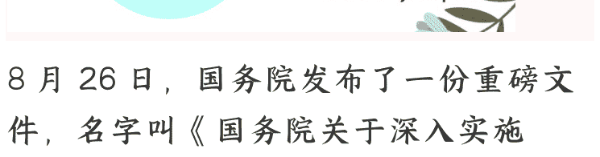
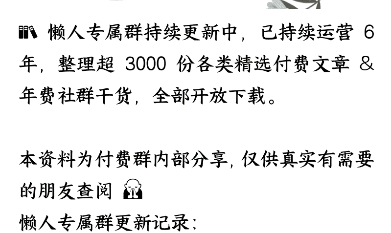

# 另一场“阅兵”:《“人工智能+”行动意见》

**250904** 《蔡钰 · 商业参考 4》

整理：公众号懒人搜索，**懒人专属群**独享

懒人微信：lazyhelper

8 月 26 日，国务院发布了一份重磅文件，名字叫《国务院关于深入实施“人工智能+”行动的意见》，用来推进中国社会的 AI 战略，和未来 10 年的行动路线。

## 三个重点

“人工智能+"的类似提法，在 2015 年也出现过，当时中国提出的“互联网+"直接推动了整个中国新兴和传统产业的重塑。所以这次，整个市场也对“人工智能+"抱有巨大的期待。

这份文件一发布，当中的三个内容马上成了产业和资本们的关注重点：

第一，文件提出了三个目标时间点：

- 到 2027 年，新一代智能终端、智能体等应用的普及率要超过 70%；
- 到 2030 年，普及率要超过 90%；
- 到 2035 年，全面步入智能经济和智能社会发展新阶段。我理解，也就是普及率要达到 100%。

文件提出，要率先在 6 个重点领域跟人工智能融合，分别是——科学技术、产业发展、消费提质、民生福祉、治理能力、全球合作。

这 6 个领域，也就是人工智能要加持的重点对象。

文件还提到，要强化 8 个基础支撑能力，分别是——模型、数据、算力、应用、开源、人才、法规和安全。

这个部分，就是调度各种资源，去给人工智能充电续航，让它有能力和资格持续加持其它领域。

## 三个意味

除了这三个内容，我个人认为有意思的信息，也体现在三个维度上。

第一个维度在文件的开头。

在一开头，这份《意见》就说了句非常恢弘、又非常科幻的话。它是这么说的：

> “为深入实施‘人工智能+’行动，推动人工智能与经济社会各行业各领域广泛深度融合，重塑人类生产生活范式，促进生产力革命性跃迁和生产关系深层次变革，加快形成人机协同、跨界融合、共创分享的智能经济和智能社会新形态，现提出如下意见。”

这句话，是在解释中国为什么要推动“人工智能+"。你有没有注意到其中的恢弘和科幻之处？这是要“重塑人类生产生活范式，促进生产力革命性跃迁和生产关系深层次变革”的。但排在它们前面的，是“推动人工智能与经济社会各行业各领域广泛深度融合”。

也就是说，这份意见最首要的目标，不是发展人工智能本身，而是让人工智能在中国经济社会的落地。

第二个维度在结尾。

这份《意见》总共四个部分，第一部分谈总体要求，第二部分谈加快实施重点行动，第三部分谈强化基础支撑能力，第四部分谈组织实施。

谈组织实施的第四部分就是结尾。前面提了要求、提了重点行动、提了强化支撑，具体怎么干呢？组织实施的部分说：

> “要把党的领导贯彻到‘人工智能+’行动全过程。国家发改委要推动形成工作合力。各地区各部门要确保落地见效。此外，还要强化示范引领、加强宣传引导。”

我晚点再解释为什么这部分有意思。

先讲有意思的第三个维度：这份文件发布的时机。

这份《“人工智能+"行动意见》，不是一份突然出现的政策文件。它 8 月 21 日就成文定稿了，但 8 月 26 日发布。在一个月前的 7 月 31 日，国务院常务会议就已经审议通过了一份类似的文件，做出了不少工作部署。

而要是我们往前看，2024 年 3 月的《政府工作报告》就说了，要“开展‘人工智能+’行动”。到了 2025 年 3 月的《政府工作报告》，说是要“持续推进‘人工智能+'行动”。

那么问题来了：既然“人工智能+"这个概念早就体现在中国的产业端和政策意志里，为什么要直到 8 月底，才把这份《“人工智能+"行动意见》的正式文件发出来呢？

我的理解是，这份政策文件，也是前两讲说的科技产业阅兵里的方阵之一，它的发布时机是在跟其他几个方阵打配合。

## 脉络

我们再来梳理一下你已知的几个事实：

首先，7 月份，就在英伟达公司刚刚宣称拿到了对华出售 H20 芯片的许可之后没几天，中国国家网信办就约谈了英伟达，并把这件事宣布了出来。网信办说，要求英伟达解释 H20 芯片存在的安全风险，并提交相关证明材料。到了 8 月份，又有消息说，中国相关部门进一步约谈了腾讯、阿里、字节等中国科技大厂，要求他们给出必须采购 H20 芯片的理由。

监管层的这两个动作，拦阻交易的用意非常明显了。

随后到了 8 月，中国最大的芯片代工厂商中芯国际有意无意放出消息说，它所代工的中国芯片，已能替代外国产品了。

紧接着，华为在迭代手机鸿蒙系统的时候，公然亮出了此前隐藏了几年的麒麟芯片。它旗下的芯片公司海思半导体，也一改低调人设，跑到抖音开通了账号，宣传起了自家的芯片和通信解决方案。

这期间，华为的余承东还出现在央视《对话》节目里，告诉大众说，华为主导的纯血鸿蒙系统，已经被用在超过 1000 万台智能设备上了。这意味着鸿蒙生态熬过了生死线，年底能追上 iOS 和安卓的水平。

余承东在节目里，感谢中国整个科技产业陪着鸿蒙的集体冲锋，而在台下，腾讯、阿里、微博、12306 等一干重磅企业纷纷表态、立军令状，把适配鸿蒙当作自家的责任。

你看，这些事情的发生是有脉络、有节奏的。它们昭示了，中国自主模型与自主芯片的深度适配、自主芯片的产能自主，以及自主操作系统的站稳脚跟。

等以上这些事件完成了发生、发酵、沉淀，8 月 26 日，国务院这份《“人工智能+"行动意见》才正式出台。

我的理解是，这份《“人工智能+"行动意见》的发布时机，本身也是一个信号。它释放的信息是：自主产业链闭环搭建完成了，是时候可以让 AI 全面、深入地融入我们的社会了。

到这里，我们再回到这份《意见》的开头和结尾。开头说，中国要推动人工智能与经济社会的广泛深度融合；结尾说，领走这个大任务的是发改委和各级政府。

那么请问，会得到政府资源倾斜，去融合与落地的人工智能，在未来几年，普及率要达到 70%、90%、100% 的人工智能，是哪些芯片、哪些算力、哪些模型？哪些生态？

答案当然是自主可控的自家产品。

## 总结

所以你看，2025 年这场科技产业阅兵的第四个方阵，就是政策方阵。它把中国 AI 相关的产业、技术、人才、资源都串在了一起，让整场“阅兵”变成了一个政商深度协同的产业系统。

说到这里，你肯定想起了我们专栏前几讲聊过的“美国特色资本主义”。

美国总统特朗普上任半年多来，有不少动作也相当稳准狠：他推动美国、日韩、中国台湾地区建立芯片联盟；推动美国政府入股芯片公司和稀土公司；他放松了算力出口限制，亲自向海外市场推销美国 AI 技术与产品；还尝试让芯片与算力，成为美元稳定币的新抵押物……

美国在这个过程中展示出的 AI 战略，也不再只是硅谷的创新游戏，而是白宫和五角大楼一起参与的国家工程。
到了这里，你会发现，今天的 AI 竞赛已经不再是点对点的较量，阵型已经调整成了系统与系统的竞争。

这才是 2025 年真正的另一场“阅兵”：不在广场上，不在直播里，而是在 AI 芯片、算力、模型和生态的底座里。两个超级大国，各自亮出了自己的系统阵型。

所以啊，我个人是把这份《“人工智能+"行动意见》当成一次战略与战术同时到位的信号来对待的。

而如果想更准确地理解“人工智能+"会给中国产业带来的变化，我们可能得把镜头往回拉十年。因为今天这套 AI 战略的思路，其实正是一个叫“信创”的概念的延伸。

下次，我们找时间聊聊“信创”，看看这个低调却影响深远的数字主权工程，是如何一步步为今天这场科技产业阅兵铺好底座的。

再见。

## 问答《国务院关于深入实施“人工智能+”行动的意见》

https://www.gov.cn/zhengce/content/202508/content_7037861.htm

最后，安利小懒的付费群：

### 懒人专属群（介绍）

📚懒人专属群持续更新中，已持续运营 6 年，整理超 3000 份各类精选付费文章&年费社群干货，全部开放下载。

本资料为付费群内部分享，仅供真实有需要的朋友查阅🙍
懒人专属群更新记录：

https://lazy2025.top/blog/record2
懒人专属群更新记录（需梯子，备用）:
https://lazybook.fun/blog/record2