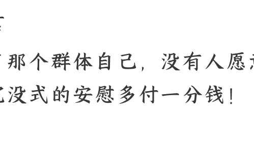

# 扎心！

**250904 守夜人总司令（付费）**

整理：公众号懒人搜索，[懒人专属群](https://www.xxx.com)独享

懒人微信：lazyhelper

## 前言

除了那个群体自己，没有人愿意为这种沉没式的安慰多付一分钱！

## 正文

短视频不是造成人变得愚蠢和懒散的根本原因，短视频不是原因而是结果。就如同贫穷和愚昧互成因果一样，只有相互作用才能实现死锁的稳定状态。

一个群体即便状态再糟，处境再难，也能找到与自己的状态和处境相适应的观念和心态，从而达到一种平衡，置身其中的人不会觉得有什么不妥，反而会滋生出一种理直气壮的骄傲感。

当我们从务实的角度去讨论现实生活中存在的问题之时，越是在现实中每况愈下，举步维艰的群体，越会认为这种讨论是别有用心。

自己拒绝面对现实，还会滋生出一种缺乏现实支撑的骄傲来鄙夷所有试图面对和解决现实问题的行为，从而形成一个自洽的闭环，将自己锁死在一个自我编织的囚笼中。虽然在外人看来，这是一种无形的枷锁，但在当事人看来，这是一种内外的平衡，一种莫名的骄傲。

某些贫穷落后地区沉浸在某种宗教中的群体就淋漓尽致的体现了这个特征。早些天新闻中报道，宁夏某个乡村的一位 37 岁的妇女被捕，因为这个妇女禁止自己 13 岁的女儿去学校接受九年义务教育，并强迫 13 岁的女儿嫁人！

西方社会明明知道大麻作为上瘾的毒品会危害人的健康，并且会造成非正常的死亡。然而，西方社会为什么还推动这种东西合法呢？德国的绿党就不遗余力的推动大麻在德国合法，而且还成功了！美国奥巴马当总统时期，美国的一些地方也让大麻合法了，奥巴马当总统时期推动大麻合法的理由居然是：去污名化，反歧视！这种冠冕堂皇的理由在奥巴马时期看来属于尊重人权和彰显文明的举措，然而，这些在外人看来匪夷所思的行为，确实有利于将一部分人导向自我毁灭，同时也也有利于另一群人增加收入。

随着无人工厂的日益成熟，工业生产的集成度和自动化程度越来越高，生产的综合效率越来越高，规模越大成本反而越低。虽然在舆论上，西方会一口咬定我们中国的产品之所以物美价廉是因为劳动力成本低，如果劳动力成本低就能有这样的优势，那东南亚和非洲的工业产品就会更加价廉物美才对！任何一种工业品的竞争优势，要么是技术门槛高且前期投入的成本大，要么是分工协作的密度更高生产效率高和综合成本更低。高附加值的产品属于前者，低附加值的产品属于后者。当我们中国生产牛仔裤的时候，五百亿美元的出口，需要建数千家工厂，组织起数千万劳工同时进行生产。当我们中国生产新能源汽车的时候，同样是 500 亿美元的出口，只需要一家公司的三个大型自动化生产基地就行了，包括工程师、熟练技工和生产管理的组织人员在内也不超过 2 万人！

上海的无人码头，不仅集装箱的装卸是无人值守的自动化操作，连装卸的集装箱的运输都不需要司机，完全是无人化自动完成，唯一需要人员的地方是在控制中心负责监控和处理应急故障的管理者和工程技术人员。不仅码头和车间在加速无人化，连钢铁企业这种大型生产都越来越多的被改造升级成智能控制和无人化操作，华为有一个部门做的产品就是为这类大型生产企业提供智能控制系统的改造和升级。

在过去的 15 年中，中国的互联网和软件技术的发展都集中在消费端，包括打车、外卖、支付、社交、电商、娱乐以及互联网金融等应用都是面向个人的消费端产品。已经发展到瓶颈，官方给出的数据是 30—40 万亿，整个社会的消费总量 100 万亿，剩下的依然是在线下场景，这些面向个人消费的互联网技术所能抢走的份额已经达到极限，所以，你会看到各种平台都红利见顶，接下来的 15 年的技术和效率改进会集中在生产端。

这意味着什么呢？意味着更多的人要失业，尤其是社会中下层的群体！为了保持社会秩序的稳定，国家肯定会想办法搞出一套机制，能够为社会中下群体提供最基本的生存保障，但也仅仅是维持在生存线上的基本保障，多一点都不会给。对于整个社会经济来说，这是一种沉没成本，没有人会愿意对沉没成本加大投资。为什么大家对孩子的投入不遗余力，而对老者的需求则置若罔闻呢？因为前者是未来是希望是期待，对后者的投入是一种安慰式的沉没成本。即便是最强调孝道的社会，也极不愿意更多的投入沉没成本：小区里面建幼儿园，大家是欢迎的，但小区建养老院谁都不愿意！

当一个群体对社会的发展不提供价值的时候，花在这个群里身上的任何一分钱都是安慰式的沉没成本。除了这个群体本身之外，其他群体都会厌恶这种投入。

最后，安利小懒的付费群：
懒人专属群（介绍）

公众号 懒人搜索
懒人专属群

懒人专属群持续更新中，已持续运营 6 年，整理超 3000 份各类精选付费文章&年费社群干货，全部开放下载。

本资料为付费群内部分享，仅供真实有需要的朋友查阅
懒人专属群更新记录：
https://lazy2025.top/blog/record2
懒人专属群更新记录（需梯子，备用）：
https://lazybook.fun/blog/record2