## DSO优化指南（邪改版）——200 万 GMV 的工业品赛道复盘

### 250904 生财精华

公众号懒人搜索，[**懒人专属群**](#)独享

大家好，我是西昂。上一篇，得到了生财的精华，很多朋友表示很有启发，也有不少朋友通过鱼丸链接到我，被认可的感觉真是太棒啦！于是我这几天又掏空自己，肝了一篇 DSO 的文章，希望同样给大家带来一些新的思考。

其实，我已经跟了很多次生财的抖音航海，今天给刚进生财的小伙伴一个建议——一定多参与航海！一定跟着干！最好打满 21 天卡！航海的气氛和问题解答都相当到位，比你自己单干效果要好几百倍！

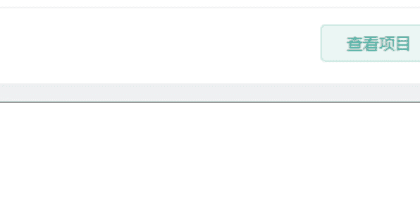

### 2022-09

**航海实战** 抖音创业项目 IP
共 21 天 | 已打卡 1 天
314 人已报名

### 2023-02

**风向标共读**
共 21 天 | 已打卡 13 天
1343 人已报名

**抖音 SEO**
共 21 天 | 已打卡 13 天
532 人已报名

刚开始做抖音搜索的时候，也遇到了很多问题。中间也绕了很多弯路，去付费各种课程，学习拍摄，学习脚本，学习剪辑等等。但是做了一段时间以后，发现还不如刚开始的效果要好。

于是，我开始反思：到底是哪里出了问题？

因为我本身是做网站出身的，最开始做抖音搜索的很多思路，都是参考网站 SEO 的逻辑来操作的。比如如何选择关键词、如何分析关键词价值、如何制作内容，都是借鉴了做网站时的技巧。

后面逐渐转向了推荐流量，做 IP，做人设，想要依靠推荐更多的人来获取线索。但是由于各种原因，推荐流量一直没有太好，哪怕出现几万、十几万的小爆款也没有什么电话线索。

后来，我重新研究搜索流量，也跟着 DSO 航海继续打卡 21 天，慢慢的开始有了稳定的电话线索。上个月两个蓝 V 一共拿到了 39 条线索，总花费只有 1000 左右。对比之前我的航海复盘，就能明白这 39 条线索的价值了。

| 核心用户列表 ② | 未留资 (46) | 已留资 (22) | | |
|---|---|---|---|---|
| 用户名片 | 用户等级 ② | 地区 | 最新线索 | 用户标签 |
| [模糊] | 高等级 | 无 | \*\*\*\*\*\*1788 | 无 |
| [模糊] | 高等级 | 河北 - 邯郸 - 丛台 | \*\*\*\*\*\*3662 | 无 |
| [模糊] | 高等级 | 山东 - 聊城 - 冠县 | \*\*\*\*\*\*5678 | 无 |

| 核心用户列表 ② | 未留资 (41) | 已留资 (17) | | |
|---|---|---|---|---|
| 用户名片 | 用户等级 ② | 地区 | 最新线索 | 用户标签 |
| [模糊] | 高等级 | 山东 - 青岛 - 即墨 | \*\*\*\*\*\*8353 | 无 |
| [模糊] | 高等级 | 重庆 - 重庆 - 长寿 | \*\*\*\*\*\*2678 | 无 |
| [模糊] | 高等级 | 无 | 无 | 无 |

统计了一下抖音成交的订单金额，发现已经有 200 万了。算上各种设备和费用，总消费也就 5 万块钱。而且这几天又签了几个订单，后面的费用更低了。今天就来跟大家分享一下我的实战心得，希望能帮助还在摸索中的朋友少走弯路。

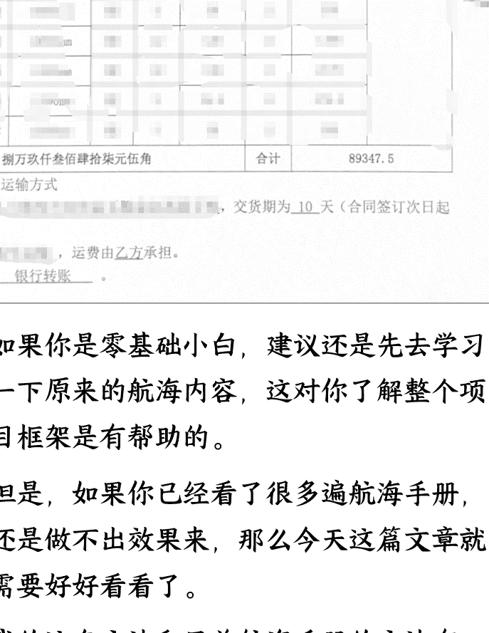

如果你是零基础小白，建议还是先去学习一下原来的航海内容，这对你了解整个项目框架是有帮助的。

但是，如果你已经看了很多遍航海手册，还是做不出效果来，那么今天这篇文章就需要好好看看了。

我的这套方法和目前航海手册的方法有一些区别的。

因为我们的目的是做纯搜索流量，不做推荐流量。所以对于账号权重、内容爆款属性，并没有那么高的要求。我们的核心目标就是获取搜索排名，拿到用户主动搜索的精准流量。

推荐流量对我们来说作用不大。我们测试过，包括投放抖加拿到的推荐流量，转化率特别低，而且获客成本相当高。

# 一、思考一下：你的客户怎么看到你的产品视频？

我们需要明确一个关键点：你的客户来抖音是干什么的？他们在什么情况下才会想要了解你的产品？

如果你的客户是随机刷视频、没有明确需求，只是因为看到了你的视频才产生需求，那么我们这套做法就不适合你的产品。

因为我们是做工业品的，用户不会因为刷到视频就突然有需求。他一定是有了需求之后，才会搜索这类产品。

大多数 B 端用户都是因为有了项目或者有了采购计划，才会来抖音上进行搜索。因此，我们的流量基本上 99%都是搜索流量。

所以，我们需要做的就是拿到搜索流量。怎么拿呢？就是拿到目标关键词搜索排名的前三位。

# 二、你靠什么拿到排名？

按照正常的教程做法，我们去做视频，做完视频之后按照关键词去优化。

但很多时候，这种做法我们拿不到好的排名。为什么呢？因为我们没有基础数据。

因为我们做搜索的时候，其实已经有很多人在做了。我们的新视频想要竞争过之前的视频，是相当困难的。

那么，怎样才能更好地拿到排名呢？

做过淘宝或者做过任何电商平台的都知道的一个操作——补单。

你做任何的电商平台，如果不补单，完全就没有排名。就算是千人千面展现，它的排名也是很低的，因为你没有权重，平台也不会把你的商品推给更多的人。

抖音也是一样的道理。如果你没有基础数据的，抖音也不会给你比较好的排名。因此，给视频一些基础数据优化是相当重要的一个操作方法。

## 三、来看点案例

下面我们来看几个真实的数据案例，这些都是我们实际操作的数据。

### 案例一：

#### 流量来源 ℹ️

| **抖音 App** | 来源占比 | 对比 7 日 |
| :--- | :--- | :--- |
| **个人主页** | [蓝色柱状图] 90.1% | +24.3% (红色) |
| **搜索** | [蓝色短柱] 4.6% | -20.1% (绿色) |
| **推荐页** | [蓝色短柱] 4.6% | -2.5% (绿色) |
| **其他** | [灰色短柱] 0.4% | 0% (黑色/灰) |
| **关注页** | [灰色短柱] 0.2% | -0.2% (绿色) |

#### 搜索关键词 ℹ️

| **排名** | 用户通过这些词看到作品 | ... |
| :--- | :--- | :--- |
| **1** | `[Blurred Text]` | 56% |
| **2** | `[Blurred Text]` | 24% |
| **3** | `[Blurred Text]` | 6% |
| **4** | `[Blurred Text]` | 6% |
| **5** | `[Blurred Text]` | 4% |
| **6** | `...格` (模糊) | 4% |

我们可以看到，这个图中，个人主页占了 90% 的流量，这些是我们前期优化的一些数据。这个流量数据对于我们来说，没有一点作用。

我们真正要的是什么呢？就是那 4.6% 的搜索流量，只有这部分流量对我们来说才有价值。因为，他是精准流量，是存在真实需求的流量。

当然，并不是所有的搜索流量都这么低。优化得当的话，搜索流量占比能做到很高，比如下面这个视频。

### 案例二：

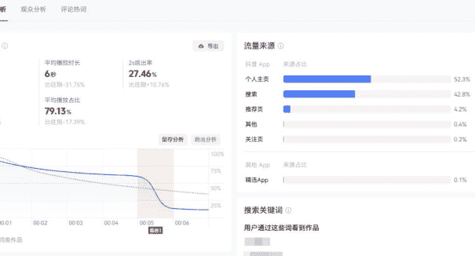

这个视频的优化流量占 52%，真实搜索流量达到 42%。就这一个视频，给我们带来了是十多万得订单。

这说明什么？

合理的数据优化是有效的，能帮助视频获得更好的搜索排名。

为什么我反复强调要知道客户来源？

因为像我们这样的 B 端业务，客户就是通过搜索来的。其他的流量对我来说都是无效的，只是为了让我能够拿到搜索流量。

只要能拿到搜索流量，这个模式就是可行的，就可以放大操作。

### 四、我不是小白，但小白也能拿到线索

其实抖音搜索优化我不是最近才开始做的，从 23 年就已经在做了。

那时候只要有一些数据优化，就能获得不错的排名。当时还是用合集做排名，效果很好。

现在抖音算法更成熟了，更看重内容本身的质量和用户的真实互动数据。合集的权重没那么高了，现在更重要的是单个视频的排名。

在我现在的理解中，视频权重是大于图文的。

但真人出镜的视频和其他混剪类视频的权重差别没有那么明显。当然，真人出镜对于建立信任感、促成成交确实更有利。

有朋友可能会说，你都做了这么久了，才有点效果？我是个纯小白，估计没戏了。

NONONO！你这么想就错了！

下面的是咱们航海群的圈友，刚开始也没有询单，从航海群加我好友问了一些问题，然后就开始操作。不到一周的时间就开始有询单了，然后连续三天每天至少一个。

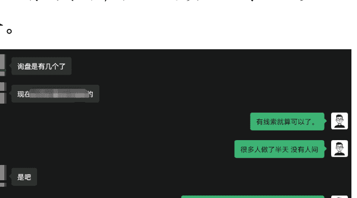

### 五、什么样的视频能拿到询单？

下面我们就拿几个例子来看，什么样的视频能够获得真实的客户咨询。

#### 类型一：真人讲解型

很简单，就是一个人站在那里介绍产品，然后打上文字。这种方式真实感强，容易建立信任。

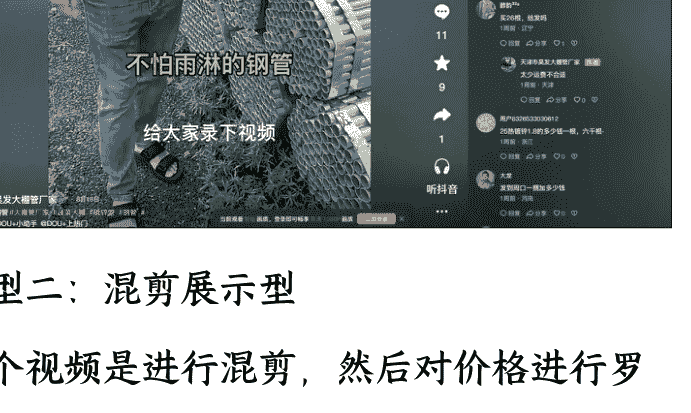

#### 类型二：混剪展示型

这个视频是进行混剪，然后对价格进行罗列。直观展示产品和价格信息，满足用户快速了解的需求。

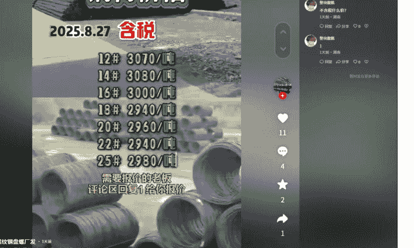

这两类视频的制作方式都很简单，可以模板化、流程化地进行批量操作。

当然，还有更多的类型可以参考，需要各位自己去挖掘和测试。

### 六、怎么样选词？选什么词？

具体怎么找到有搜索量的关键词呢？这里分享一下我常用的几个方法。

**【圈友福利】免费领 AIDSO VIP 会员**

#### 1. 数据平台分析法

我主要用爱搜 AIDSO 这个平台来分析关键词数据。为什么用它？因为它是专门针对抖音搜索的数据平台，数据比较准确。

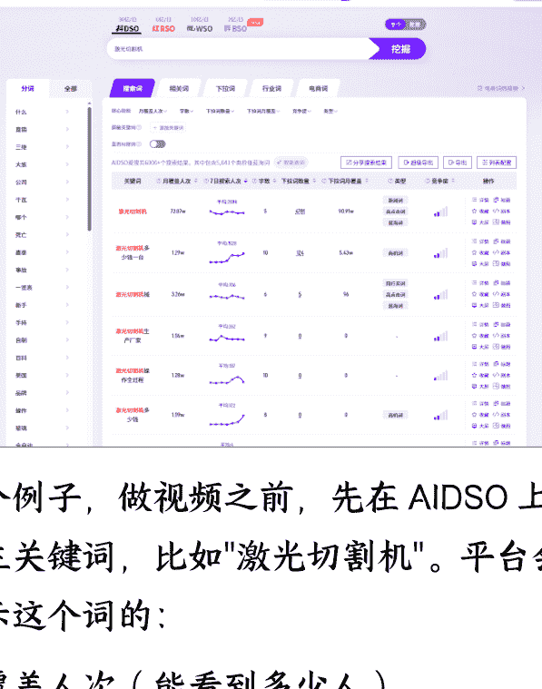

举个例子，做视频之前，先在 AIDSO 上搜索主关键词，比如“激光切割机”。平台会显示这个词的：

*   月覆盖人次（能看到多少人）
*   7 日搜索人次（真实搜索数据）
*   竞争度（判断难易程度）

这些数据特别重要。这里着重讲一下 7 日搜索人次这个数据。

这个数据表示最近这个关键词的热度，有的词可能月覆盖人数很多，但是 7 日搜索量低，那么就不如选择月覆盖人少，7 日搜索量高的词。

这么说可能不容易理解，我简单举个例子：

*   关键词 A，上半个月搜索的人多，但是最近该买的都买了，该搜的都搜了。那么它的月覆盖人次就会偏高，7 日搜索人次就会偏低。
*   关键词 B，上半个月没啥人买，但是最近有需求的人多了，也就搜的多了，然后 7 日搜索人次就变高了，但月覆盖人次却还没上来呢。

所以，我们找那种 7 日搜索高，月覆盖低的词，你就能优先抢下这个词的排名，拿下这部分的流量。

#### 2. 长尾词挖掘

光有主词还不够，还要挖掘长尾词。

我会在 AIDSO 上搜索下拉词，它会展示用户搜索的时候会提示什么。这些词一般都是用户感兴趣的问题，转化率通常很高，因为是用户真实的搜索路径。

比如搜“激光切割机”，会发现用户还搜：

*   - "激光切割机多少钱一台"
*   - "小型激光切割机价格"
*   - "激光切割机价格一览表"

这些下拉词竞争小，但需求明确，特别适合新账号起步。比正常搜索词，选择起来更加方便一些

#### 3. 竞品分析

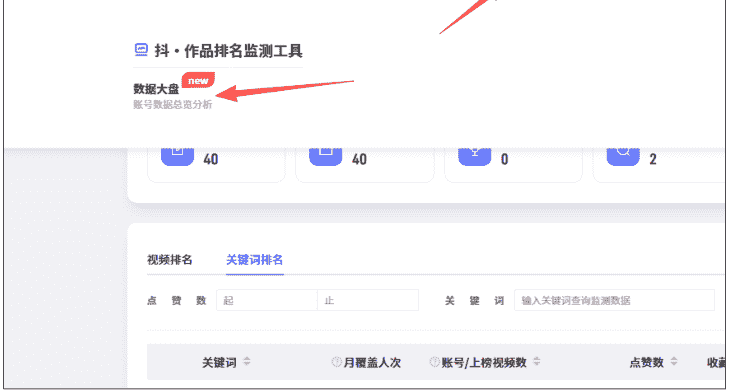

还有个技巧，就是在 AIDSO 上使用监测功能。输入竞品账号监测他们的账号，能看到他们哪些视频排名好，用了什么关键词。

我发现很多做得好的账号，并不是追热点大词，而是专攻一些搜索量稳定的长尾词。这些词可能一天只有几百搜索，但累积起来流量很可观。

#### 4. 官方平台——巨量算数

我们还可以使用官方的平台，巨量算数来进行查询。搜索关键词以后，可以看到关键词指数。可以看到图中有红点和黄点，我们点击后可以看到当日的热门搜索词，这些词都需要记录下来，这都是真实需求词。

我们拉到底部，可以看到有个综合指数的解读，如果你的词搜索分特别高，其他分基本没有。那么你就直接干搜索就完了，其他的获客效果一定没有搜索好。

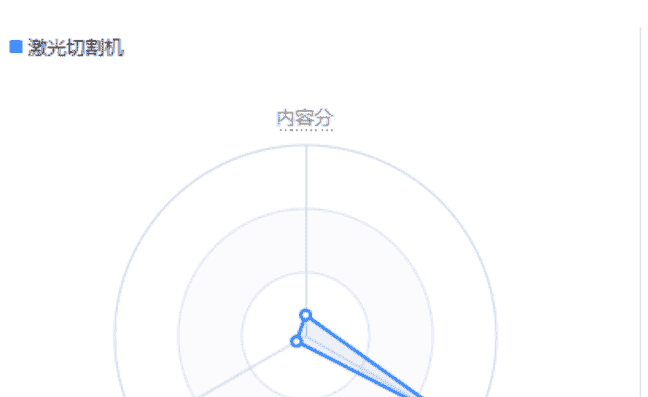

还有，点击关联分析，可以看到其中的内容关联词，可以看到在我们主要关键词周围有很多相关的词，这些关键词都可以作为我们的备选关键词。

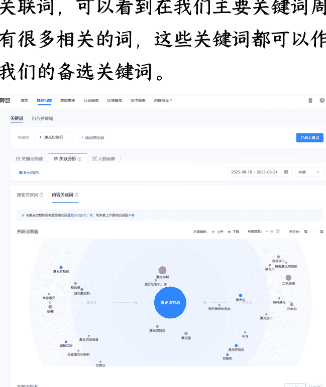

最后看看人群画像，这里我经常看的就是城市，主要看看最近哪些地区的关注度更高，可以针对那个区域来做对应的区域产品词。

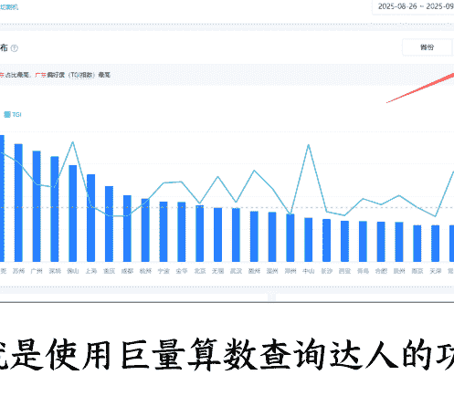

还有就是使用巨量算数查询达人的功能，其实就是看看你的同行账号，分析下对方的视频，还有人群。

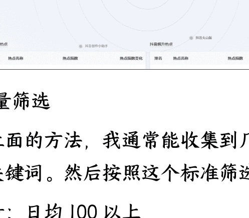

#### 5. 批量筛选

通过上面的方法，我通常能收集到几百上千个关键词。然后按照这个标准筛选：

*   搜索量：日均 100 以上
*   竞争度：中低程度优先
*   商业价值：带有“价格”、“厂家”、“哪家好”这类词优先

最后筛选出 50-100 个核心词，作为内容制作的方向。

小提示：不要一上来就做大词，先从长尾词开始。等账号有了权重，再逐步做竞争度高的词。这样成功率更高，也不容易打击信心。

记住，选对关键词，就成功了一半。用数据说话，不要凭感觉做内容。

## 七、还是不会选词怎么办？

看完上面的教程，还是不会选词，那么又该怎么办呢？别着急，今天给你两个万能选题，直接拿去用就行！这个是我们自己测试 100% 有效的选题。

### 产品科普类：

*   "什么是 XX 产品"
*   "XX 产品是什么"

这类内容满足有采购需求的人了解产品的需求。你就写 XX 是什么，什么是 XX，不要将什么原理，讲什么工艺，就做这个特别基础的词，主打小白客户群体。

#### 价格行情类：

*   "XX 产品多少钱"
*   "XX 产品最新报价"
*   "XX 产品价格走势"

有采购计划的人一定会去搜索这个类型的视频，他们已经确定采购产品，所以会格外关注价格。

如果说你的价格比较合理，或者说更具优势的话，他们就会和你联系来咨询价格。

只要他联系你，一定是一个真实有效的线索。

小技巧：你在视频中宣传的价格，一定要低于真实售价的 10%-20%。就是靠低价吸引他过来，我们先拿到他的电话，然后再去谈价格。

你视频文案中的价格一定是能够让他不能拒绝的一个价格。如果说你的价格就是按真实价格来宣传的话，那么你没有任何的竞争力。

不管这个视频到底真实性如何，哪怕最后客户说你视频上说的是什么什么价格，你怎么现在报价和这个价格不一致，你可以说那个是样品的价格，或者说是产品的某个型号的价格。

当然，大部分客户不会这么较真。

你一定要记住：你的目的就是拿客户联系方式。只要拿到客户联系方式，你的目的就达到了。

## 八、做视频？原来这么简单！视频制作实操步骤

下面用一个真实案例，详细讲解视频应该怎么制作：

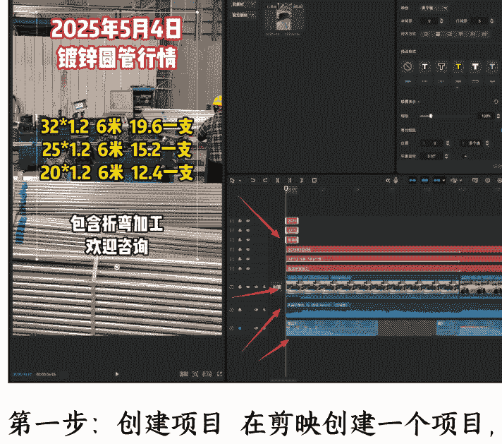

##### 第一步：创建项目

在剪映创建一个项目，增加几条文本轴，输入想要设置的文本，选择合适的字体。字体可以选择多种样式，做一些视觉差异化。

##### 第二步：导入素材

素材需要多个片段，每个素材片段控制在 2 秒左右。不要从头到尾就一个画面，让画面变化多一点，别太平淡了。

##### 第三步：配音配乐

音效可以不加，但是背景音乐一定要有。

背景音乐尽量选择你的客户可能比较喜欢听的音乐，比如一些动感的，最近一直刷屏的（注意是符合他们那个人群的）节奏与画面的匹配程度更高一点，能够提高用户观看的时长，减少跳出率。

##### 第四步：控制时长

单条视频控制在 7-10 秒。不要太长，太长制作麻烦，素材匹配也费时间。为了提高效率，确保音乐能够完整播放，不会突然截断就行。

第五步：添加引导
一定要注意，下面一定要做一个引导，让客户去联系你；否则，转化率会变低。

## 九、发布后立刻就干的优化策略

视频发布后，立即开始基础数据优化。通过我们的运营手段，快速积累初始数据，提升搜索排名。

我们不需要等它自然跑到 500 播放，或者突破什么流量池。如果你是做推荐流量，可以考虑打磨作品，靠突破流量池的方式提高曝光。但我们做搜索流量，核心是快速获得基础数据，提升搜索排名。

## 十、DOU+ 投放，让排名更稳定

前面说了视频发布后要做基础数据优化，其实当视频有了一定转化之后，我们就可以考虑用 DOU+ 来稳定排名了。

这个也是我踩了很多坑才摸索出来的。一开始我也是乱投，钱花了不少，效果却不好。后来才发现，DOU+ 投放也是有技巧的。

##### 1、什么时候投比较合适呢？

我一般是视频发布后观察一两天，如果有客户来咨询了，哪怕只有两三个，我就会开始投 DOU+。为什么呢？因为有询盘说明这个视频的内容是对的，客户是认可的。

这时候投 DOU+，就是给这个视频加把火，让它的排名更稳定。

##### 2、投放金额和方式

刚开始不要投太多，先投个几十、一百的试试水。

如果测试效果不错，我就会持续投放。每天投个两三百，连续投三五天。

这里有个小技巧：不要一次性投太多。比如你有 1000 块预算，不要一次全投了。分成几天，每天投一点，这样效果更好。

为什么呢？因为抖音看重的是持续的数据增长，而不是突然的爆发。你今天突然来个大额投放，明天没了，抖音会认为你的内容不稳定，反而对排名不利。

##### 3、投放时间的选择

这个要根据你的客户来。我的客户都是采购、工程师这些人，他们一般上班时间看抖音。所以我会选择上午 9 点到 11 点，下午 2 点到 5 点这两个时间段投放。

晚上就不投了，因为晚上刷抖音的人虽然多，但都是娱乐为主，不是我的目标客户。

##### 4、最后说一点
[/content]用是被鼓励的。平台也需要广告收入，我们也需要流量，这是双赢的事情。

# 十一、选题及后续调整优化的方向

选择选题时，要参考多个维度的数据：

- **1. 平台内部数据**
  - 搜索下拉词
  - 相关联想词
  - 后台用户搜索数据
- **2. 外部数据平台**
我会定期在 AIDS0 上查看关键词趋势变化。有些词的搜索量是有周期性的，比如工业品在月初月末搜索量会上升（因为要做采购计划）。

通过 AIDS0 的数据对比，我发现了一个规律：
周一到周三，"产品价格"类的词搜索量高；周四周五，"厂家实力"类的词搜索量高。

根据这个规律调整发布时间和内容类型，效果能够提升了 30%左右。

- **3. 实时调整策略**

# 十二、再次明确你的目的

我们的做法就是：用数据优化的方法，把视频的搜索排名做上去，然后获取精准的搜索流量。而不是靠视频抓人眼球的视频风格，来获取推荐流量。

回到了最开始说的：你一定要知道你的客户为什么来抖音，他们是通过哪种方式看到你的账号的。

像我们的客户就是从搜索来的，所以我们只针对搜索做优化就够了。这就是精准打击，事半功倍。

### 十二、与平台共赢

> 最后想强调的是：我们的目标是与平台共赢。

通过运营获得流量，拿到客户赚到钱，再通过付费投放扩大获客数量提高收益。

做抖音搜索优化确实有很多坑，我也是一路踩过来的。这套方法不一定适合所有产品，但对 B 端工业品确实有效。希望这些经验能给大家一些启发，少走些弯路。

我是西昂，期待和大家一起在生财有术的路上越走越远！

## 最后，安利小懒的付费群：

### 懒人专属群 (介绍)

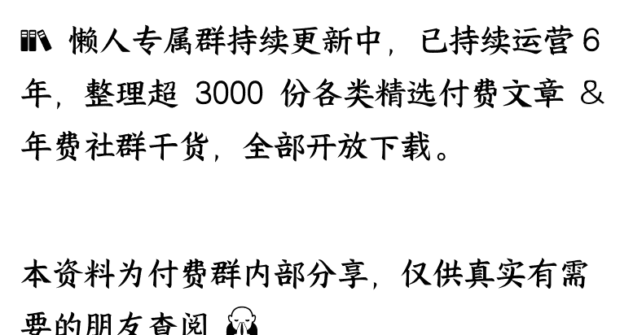

> 📚 懒人专属群持续更新中，已持续运营 6 年，整理超 3000 份各类精选付费文章 & 年费社群干货，全部开放下载。
> 本资料为付费群内部分享，仅供真实有需要的朋友查阅 🙇‍♂️

> **懒人专属群更新记录：** https://lazy2025.top/blog/record2

> **懒人专属群更新记录（需梯子，备用）：** https://lazybook.fun/blog/record2