# 初中就开始赚钱，分享农村女生白手起家，13 年的创业赚钱心路历程，步步为营，走在创业的漫漫前路

**250904** **生财精华**

公众号懒人搜索，[懒人专属群](#)独享
懒人微信：lazyhelper

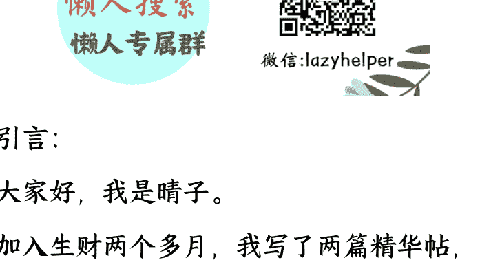

**引言：**

大家好，我是晴子。

加入生财两个多月，我写了两篇精华帖，也成为了“超级术”的作者，在这里，我不仅收获了知识和伙伴，也更坚定了自己的长期方向。

之前的文章里，我更多分享的是经验和复盘，对个人经历却写得很少。

后来看到小灯塔里有一些圈友，大家真诚地分享自己的心路历程和成长故事，我也被触动了。

回头想想，我这一路 13 年的赚钱经历，其实起起落落，跌宕起伏。

或许有人能从中产生共鸣，也或许能从我的故事里提前避开一些坑。

毕竟，只有先看见，才有机会做到，也才更容易少走弯路。

所以，我决定写下这篇内容，把我的真实踩坑故事讲给大家听。

全文 2w+字，阅读时间大概 20 分钟。

这篇文章我会重点分享两段典型的踩坑故事：

一次是开工厂的豪赌，让我背上了沉重的现金流压力
一次是接手实体店，仅 35 天就转店成功，结果就是亏了 5 万块。

这两次经历让我交了不小的学费，也让我更加清醒地认识到：赚钱要学会取舍。

最后，我还会讲讲自己是怎么调整心态的，希望我的故事能让正在路上的你少走一些弯路。

## 一、自我介绍

大家好，我是晴子，公众号晴子 boss
从学生时代起就开始赚钱，到现在已有 13 年的创业赚钱摸索经验。

我的盖洛普前 5 的标签是：分析、战略、理念、排难和行动。

为什么提一下这个，因为这是我加入生财之后，因缘际会做了一个盖洛普的测试，
然后通过解读，让我更加了解我自己擅长做什么事情。也让我清楚的知道我能抓住每一次风口，推荐大家测试一下。

GALLUP | CliftonStrengths 晴子 07-24-2025

此图表显示了您特有的 CliftonStrengths® 34 个主题才干结果在四大维度中的相对分布。这些类别是一个非常好的起点。您可以查看自己最有可能在哪方面表现出色，以及如何为团队做出最佳贡献。
请参阅下面的图表，了解有关您的 CliftonStrengths® 在各维度分布情况的更多详细信息。

| | 执行力 | 影响力 | 关系建立 | 战略思维 |
|---|---|---|---|---|
| 6 | 4 | ... | 7 | ... |
| ... | ... | ... | ... | ... |
| ... | ... | 5 | ... | ... |
| 8 | ... | ... | 3 | ... |

# 您的战略思维 CliftonStrengths® 才干主题最为突出。您了解如何帮助个人获取和分析信息，从而作出更佳决策。

### 我的商业轨迹

2012 年（上初中）：在贴吧卖手机流量卡，赚到人生第一桶金，同时见证了从 2G、3G、3G+、4G 的互联网发展。

2013 年：开始接触淘宝刷单，几年时间，从一个普通会员做到主持，再到自己开团招募主持和会员，团队规模 20+主持、数百会员。

2014-2016 年：做微商，卖美甲贴纸，开始积累微信私域客户，为后续创业打下坚实基础。

2016 年底：因为早期就有付费学习的意识，接触到了穿戴美甲赛道。

2017 年：快手、抖音短视频引流，私域加满 10 多个微信号，带上千名直属代理赚钱，我的努力也实现了家庭的财富跃迁。

2018 年：快手直播单月纯利润 50 万+；
抖音直播单日纯利润 10 万+，且持续一段时间，现在直播也一直在做哈。

2019 - 2020 年：留学期间接触外贸与跨境出口，做 TikTok 海外账号，单日涨粉 1 万，一个月累积 18 万粉丝。

2021 年-2023 年：疫情期间投资 70 万开穿戴甲工厂，面对封控风险，后开放后果断分流业务最后清仓全身而退。

2023 年：接手实体门店，次月迅速转让亏损 5w，让我更加坚定了走轻资产模式的决心。

2018 至今：投资外包客服团队，为各类电商平台商家提供服务，保持长期稳定盈利。有电商外包客服需求的圈友可以找鱼丸联系我。

2025 年：除本行业外，今年 8 月开始布局个人 IP 以及疗愈相关赛道，探索新的长期增长机会。

我给自己定义了四个标签：白手起家 | 摸索起步 | 起落循环 | 长期主义

- 白手起家：农村出身，没有资源和背景，只能靠自己。学生时代就做小买卖，很早就学会了独立。

- 摸索起步：从打工、卖花、卖手机卡到刷单，做微商，以及现在的美甲行业，十年磨一剑，让我逐渐理解交易逻辑，也积累了底气。

- 起落循环：我抓住电商风口赚过很多钱，也因盲目扩张开工厂、做实体门店亏钱。短短几年，既尝过赚快钱的喜悦，也跌进过资金链断裂的情绪低谷。

- 长期主义：真正的创业是做减法，选对方向，才能让自己走得更稳更久。

这四个阶段，几乎就是我过去十三年的缩影。或许这也是很多人经历的过程：先打拼积累，再从起落中磨练，最后才能跨越时间周期，做一个长期主义的人。

## 我写这篇文章的目的很简单：希望它能带给你鼓励、参考和真实感

第一，想给大家一些信心。

我是从农村出来的女生，做互联网确实让我拿到了不错的成绩。

这一路也经历很多事情，没有那么顺风顺水，磕磕绊绊的。

当然这才是人生，而我仍然走在创业的路上。

# 第二，提供一些做项目的参考。

这些年，我做过很多事，大大小小的事情 20 多种吧。

值得展开讲的就是做电商、开工厂、实体店。一路踩坑一路学习，也逐渐摸索出一些规律。我把它们写下来，希望能给你一些提醒，希望你可以少走弯路。

# 第三，传递真实的感受。

在我看来，创业赚钱是一种循环：顺利、失误、复盘、再出发。

它更像是曲折的迂回，而不是单调的直线上升。

而真正能走得很远的人，是在经历过跌倒之后，依然选择继续前行的人。

我希望这种真实，能让你少一点焦虑，多一点力量。

## 二、个人过往经历

每一次的改变，都来自于你的起心动念
祛魅的唯一方式是拥有
坚持的意义不是当下，而是下一个明天和后天
这里讲述了我磕磕绊绊的赚钱经历

### 也许打工改变不了命运

我母亲，是我人生中最大的贵人。我出生在一个普通家庭，没有背景，也没有资源。2010 年升初中时，母亲托关系花了三千块，把我从农村送到城市去读书。这个动作，是我命运的齿轮开始转动的第一步。

我家里对我还是比较宠的，怕我在学校吃的不好，2012 年家里人跟着一起来到城市租房。

租来的房子虽然简陋，但有母亲在，就有家的感觉。

其实我们的生活还过得去，但中国人的传统里，总觉得“没有自己的房子，就不算真正安家”。于是家里人商量着，开始攒钱，目标买房。学会独立，这是我很早就意识到的一件事。买房对我们来说是一件大事，这也让我暗下决心，我要尽早学会赚钱，减轻家里的负担。

2012 年暑假，我第一次尝试出去打工，做影楼下乡的暑期兼职。每天早上七点出门，晚上八点才能回家，工作是发传单和推销拍照业务，工资一天 20 元 + 提成。看似简单，却让我体会到了什么叫现实。

刚开始，我胆子小，不敢开口推销，只能眼巴巴看着别人谈单拿提成。第二天好不容易鼓起勇气推销了，终于快要谈下一单，却被老员工顺手截走，提成自然归他们。所以职场从不讲公平，你弱，就只能眼睁睁看着机会溜走。别人一天能轻松赚上百，而我只能靠那点微薄的底薪熬着。

这份工作我只坚持了 2 天，这个经历给我带来的感受就是：老板靠我们跑业务赚钱，而我们只是廉价的劳动力，可以被随时替换。打工能给你生活费，却改变不了命运，要想翻转人生就要做那个不可替代有价值的人。

虽然我放弃了这份工作，但心态已悄然转变。这让我第一次真切感受到，打工或许能解决眼前的生活，却难以支撑长远的未来。从那一刻起，一颗种子被埋进心里：我一定要去寻找属于自己的机会。

### 副业的起点：命运的转变悄悄开始了

#### 2.1 卖手机卡

2012 年，我最早的互联网赚钱副业，就是卖手机流量卡。

那时 2G 网刚普及，流量是刚需，而且流量挺贵的。那时候我常常偷用家人的手机玩游戏，流量经常用超，然后我还偷偷充值，最后当然被发现了。有一次家里来客人，说带有 13131 的手机尾号的数字能量更好，有财运。

我妈还鼓励我在网上搜搜，看看能不能买到这样的卡号。后来我在贴吧发现了一个在唐山卖靓号和流量卡的商家。

起初我只是买卡自用，觉得很方便。后来看到老板在 QQ 空间发说说，他招代理。

所以我就学习卡商老板在同城贴吧发帖子，其实他没有教我，但是他赚到钱了呀，我就觉得这个方式能行得通。

没想到真的有人留言、加我 QQ，预定购买。

我卖出去之后，我在从商家那里拿货，每张卡能赚八十元利润。

第一次成交的时候：我才觉得赚钱这件事，不是只能靠打工，原来自己也能通过信息差赚钱。

卖卡的两年里，我最好的时候一个月能卖几十张，也被商家夸奖，说我年纪轻轻就这么有商业头脑，情绪价值直接拉满。更重要的是，我第一次感受到独立和底气，因为我已经不需要再伸手向父母要钱了。

#### 2.2 淘宝刷单

2013 年，我又接触到淘宝刷单。起初只是帮我姐做浏览，她上班时间赶，我就顺手帮忙了，一单几块钱佣金。

可我很快发现，只要同时接四五单，同样的时间就能赚更多。效率一提，收益翻倍，现在才知道，这也属于时间杠杆学问中的一部分吧。

有一次，我问关系好的主持：你一天收入能有多少钱呀？她说好的时候两百多。

我心想：这收入真不少啊，我也想试试。所以每一次的改变，都来自于你的起心动念。

那时候家里刚贷款买了第一套房子。我也在放寒假，我就说，要不要试试做主持放单。家里经济困难，我也想多赚点钱。可能我确实聪明，学东西快，加上我姐人缘不错，我做事也负责，很快就接到了很多商家的订单。

毕竟网线的另一端，对方根本不知道你是谁。

因为商家的订单比较多，我靠组合单、打包单赚差价，一个刷手一次接八单，十单的，我就能有四五十块利润。

这背后也是巨大的体力透支：我每天从早上十点忙到凌晨三四点，吃饭都顾不上。

#### 2.3 交的第一笔学费

2014 年，刚做主持那会儿，我交的第一笔学费就是被钓鱼链接骗走了两千多块钱。那是我很久的收益。当时哭了很久。家里人安慰我没关系，但我心里明白，这笔钱就这样没了。那一刻我真正懂得：社会不会因为你年纪小就手下留情。

不过，这份副业确实改变了家里的状况。我其实根本不知道我每天赚多少钱，因为收入都打我母亲的银行卡上。我就知道，半年我们就还清了 8 万元房贷，当然是我们全家人共同的努力。

在小城市，这也算改变了命运的。

后来我们也自己开了团，我们有几百个会员，20 多个主持。

因为我上学之后，就没有人放单了，我和我姐都没有时间，所以接的商家订单全部让主持去做，我们拿差价。

副业不仅是锦上添花，也是生活里的退路与底气。

也许我们的起点比较低，但只要敢开始，就能慢慢撬动命运的杠杆。

#### 2.4 做微商卖瘦身乳

2014 年，不知道什么时候我姐就做了微商了。然后又是我接手了。

那时候做微商是需要囤货的，我有空的时候就帮我姐发发快递，谈快递价格，买包装等等吧。

现在在我老家，提睛子，哈哈哈哈能拿到所有快递的最低价格，就是 1.7/单。

然后这个品牌，也教代理引流，就是花钱买爆粉软件加人的，也就是现在所谓的流量，那时候差不多加满了四个微信，2 万人左右。我觉得在成功之前，是需要做很多的动作，做很多的铺垫的。所以我们当下做的每一个动作，都是为了承接好运机会的到来。

#### 2.5 做微商卖美甲贴纸

2015-2016 年，我姐开始做微商卖美甲贴纸。她做的时候，是一个微信卖这个，一个微信卖那个，反正四个微信卖的产品都不同。我放寒假了，所以我又接手了哈哈哈哈哈哈。

因为之前已经买过爆粉软件，我们微信人很多。我把美甲贴纸这个产品发四个微信里，然后我还群发，没想到效果出乎意料，尤其是冬天和过年时，生意火爆得不行。一个冬天，我们就赚了大几万块。

反正就是每天发货，打包，还挺忙碌的，寒假开学之后我就不管了。这个阶段，我的认知是一点点被打开的。

#### 2.6 交的第二笔学费

2016 年，我上大学，因为我家在市里买了第二套房子，200 平小院子，二层小楼，还能种菜。

家里那时候计划的是先买下来，先给一大部分钱，然后和房主谈宽容半年的时间，这段时间装修 + 卖房，卖完房子再把钱给房主，而且原房主是我们市里的富户，还有亲戚担保，所以就说可以。

这样的话压力肯定大呀，万一房子没有卖出去怎么办，所以我就还是希望自己能分担一些压力。

于是我看微商有做手机卡的，打电话很便宜。后来付了钱才知道还需要安装软件，在软件上去打电话，我没有开展这个项目，因为我觉得这个有点骗人的感觉，所以我投入了一千多块钱，基本就是打水漂了，差不多是我一个月的生活费。那几天我很失落，甚至怀疑自己是不是根本不适合做这些事。

俗话说：财不入急门。玄学观点就是越缺钱的时候你会发现越难有钱，越缺钱的时候越容易受骗钱。所以想要获得财富先要做的就是让自己配得财富，否则等着你的就是割韭菜、杀猪盘、诈骗。

但创业赚钱的路，总是这样：一边怀疑自己，一边又在寻找下一次转机，然后新的机会马上就出现了。

## 风口红利：赚了几百万

2016 年底接触穿戴甲，这个产品现在还在做，美甲行业我做了十年。

也是我第一次尝到风口的红利，让我意识到选择大于努力，在风口上猪都能起飞。

我认为真正的商业机会，是踩在新事物出现的第一波红利。

先敢试的人，拿到第一桶金
敢复盘的人，把它做成长期
能沉淀结构和杠杆的人，才真正吃到大机会。

### 3.1 付费加社群的推动

人是环境的产物。

若没有足够高能量的圈子，就要主动付费，把自己置入能塑造你、提升你、成就你的场域里。

2016 年 9 月，上大学开学，没事干，刷微博，然后关注各种分享商业知识的大佬。以前其实不知道微博快手是什么。

上大学才知道，室友用的软件，比如快手是看喊麦的，微博看明星八卦的等等吧。

我关注最久的老板就是外贸茂哥，我还花了几百块付费加入了他的微信群。

那时候别人刷微博看八卦，而我只看商业信息：亚马逊、淘宝、外贸...什么都研究。在生活信息上我可能迟钝，但在商业信息上，我一直很敏锐。

现在回忆过去，原来我那时候就和室友的人生方向就已经不一样了。

可以讲两句我和室友的关系：大概就是别人认为我不合群，但是室友和朋友都很尊重我，遇到事情让我分析，有事会找我帮忙，需要钱会找我周转，我学的专业是西班牙语，有一个室友出国去西班牙读书了，这也是我后面出国念书的隐形推动力。

我不在背后讨论别人，别人和我说的事情，我很少会让第三个人知道。

我也看不八卦，没有喜欢的明星，相对来说比较客观和理性。附一张大学的时候照片 2017-2018 年的状态。

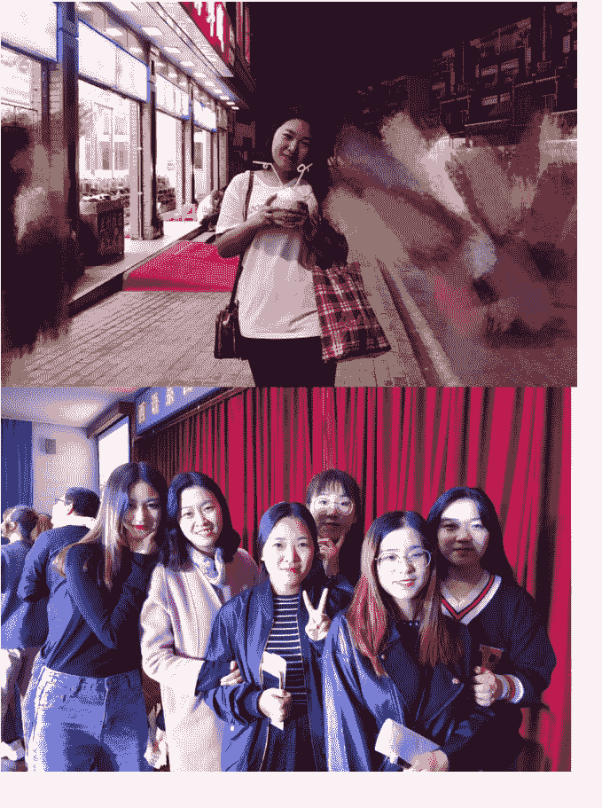

### 3.2 抓住风口---穿戴甲行业

2016 年底，我第一次接触到穿戴甲，这才迎来真正的转折。与交第二笔学费相比，间隔 3 个月。这个产品是我在茂哥朋友圈看到的——因为我的上级花了 800 块，让茂哥帮忙发了一条朋友圈广告。我立刻加了她微信，咨询了代理价格，最高级别需要拿货 5w，但是也几乎天天盯着。

但我刚上大一，手里没多少钱。最高级别代理要拿几万块货，而且家里刚买了第二套房子，我们也不会拿几万块冒险的。我犹豫了几天，还是忍不住和上级去谈代理价格。最后，我居然把代理门槛从几万谈到几千块，就能直接做最高级别代理。

（为什么一定要做最高级别？因为我已经认识到，金字塔的顶端才能赚到更多的钱）

很多人可能好奇：当时我到底是怎么和上级把价格谈下来的？

其实很简单，我把几个微信手机拍照发给她看，我的微信里有多少好友，我有多少代理。我对她说：这个产品刚出来，谁也不知道能卖得怎么样。

但做微商，本质上就是有人愿意先去尝试。你敢出货，我敢推，一起试才有机会。

那个时候的互联网，信息流通远没有现在这么快。新产品是不是爆款，谁都看不准。所以我觉得大家都是半斤八两，敢试的人，才会占先机。

尽管如此，我还是没有马上下决定。但我天天被朋友圈美甲视频而吸引。因为我没有财政大权，后来我劝了我姐半个月，她终于答应：那就先发个朋友圈试试。结果一发，点赞率异常高。穿戴甲这个全新的概念，当时市场上几乎没人见过，瞬间激活了很多沉默已久的好友。所以信息差就是机会，而风口能把普通人的努力放大十倍。

后来，这个产品不是做传统微商的模式，是三级分销系统。这种模式很诱人：管道收益、躺赚、不用囤货，也不用自己发货。我要做的，就是招代理、带代理赚钱，他们卖货，我有管道收益，大家合作共赢。

那时我是金字塔顶端，我整个团队下面有几十万人，很多人我甚至不知道是谁。因为团队人数庞大，模式门槛低，只需要 200 块钱买个产品就能成代理，大家都愿意尝试。

就这样，我赚了很多钱，也带着很多代理赚了很多钱。

我是第一个把穿戴甲这个产品发在快手上的人。前面提到过，我知道快手这个平台是因为室友天天看快手直播喊麦😃😃。

发产品视频的时候我们在快手上疯狂试错，踩了无数坑，光是被封号就 20 个多个。

最后我们才摸索出一套流程，现在叫 SOP：代理该怎么发作品，怎么修改资料，怎么把客户安全地引流到私域，而不被封号。然后就是销售的部分。

再往后，我们选择不再跟着公司走，因为这个三级分销系统是违法的，而且这个公司也有问题，一直让我们花钱投资做别的事情。

所以我们开始尝试自营。在抖音、快手这些平台上卖货，组建小团队，招主播，开始做直播。

至于原来的代理，就逐渐搁置了。这就是我从微商起步，到分销，再到自营直播的大致过程。

一个产品，坚持十年，就足以改变命运。

那时候我们因为美甲贴纸确实赚到了钱，从最初的尝试，到慢慢积累，我们把这个美甲行业做了整整十年。回头再看，那几年正是电商的黄金期。我们凭借一款新颖的产品，顺势而为，抓住了风口，也由此真正赚到了人生的第一桶金。

事实证明我的判断也没错。我凭着好的执行力，几乎是踩在了每一个平台的红利上。这个行业让我赚到了不少钱。

对于很多没有背景、没有资源的人来说：互联网时代确实让很多人翻身了。

但成功来得太快，也埋下了隐患。我以为市场会一直上涨，忽视了风险，后来做了更重的投入工厂。这些成绩让我以为自己很厉害，其实只是被风口托了起来。

### 3.3 出国念书

2019 年，去澳洲读书。

这个也简单分享一下，因为我的大学室友出国念书了，前面讲过，所以我和家里说过一次，家里人也上心，就去了解这个出国的事情。而且家里比较支持我学习。

我想说的是：其实别人是自己的参照系，都是先听到/看到，有起心动念---然后做到。

### 3.4 疫情卖口罩

2020 年，我卖过口罩
2022 年，我卖过咽拭子
因为胆小，所以就赚了点小钱。

但是我为什么把这件事情写在这里？

就是想跟大家说：一件事情的出现，其实好多人无法判断他是不是一个机会。

### 3.5 做外卖 cps
包括我加入生财，7月10号我发了个帖子，我记得有一个9.9买一年的美团年卡这个事情。

我也是见到了之后，然后我立马发朋友圈。

然后我还发到了生财的北京本地群。

然后就是大家有购买的，也有扫码自己去卖的，那一天我赚了几百块钱。

我想表达的是：机会来的时候是没有时间让你去思考的，因为就拿¥9.9买年卡事情来讲。

我发了那天就赚钱了。

### 3.6 在国外做 tk 搬运视频，一个月涨粉 18 万
在国外念书的时候，疫情是在家上网课的。

然后没事干，就注册了个账号，把视频搬运过 tk 上，还是中文的。

一条视频有上千万播放量，一个月涨粉 18 万。

我想表达的是：你可以学习我捕捉风口的那个点。

反正我就是做了很多的事情，篇幅有限，就不一一阐述啦。

## 工厂的经历：一场把我推入深渊的豪赌
我的创业之路不是出于我的野心，是我被无形的手推着走，走着走着才发现自己已经站在悬崖边。
我做穿戴甲已经很多年了，产品没有变，但渠道越来越多。1688 的店铺也让我积累了一批大客户，加上出国读书的经历和我一直付费的各种社群，我对出口多少有些了解。

三十年河东，三十年河西，每一个时代都有它的赚钱机会。

#### 4.1 为什么决定开工厂？
2019 年底疫情突然到来，我亲眼看着一个行业接着一个行业被推着往前走。

国内因为封控，线上电商被推动加速爆发，国外航运中断，很多国家的供应链乱了，因此做跨境出口行业也有了巨大的增量。彼时，像抖音、快手、私域，本地生活等等这些平台的直播电商发展，本来还没有完全普及，结果疫情让它们一下子迎来了巨大的增量。

就在这样的背景下，我第一次把穿戴甲卖到了国外。那时候的赚钱方式依旧简单：靠信息差，低买高卖，快速赚取差价。买与卖，始终是最快拿到结果的方法。但也正是这一波意外的爆发，埋下了我后来决定开工厂的种子。

#### 4.2 工厂起步：顺风顺水的错觉
当时的动作很快，我没有买机器，但我租下厂房，招工人，原料采购，就一个月，我就把一个空仓库变成了美甲车间。

灯光下，几十个工人低头打磨、裁剪、装盒，我看着那一排人，心里涌起莫名的骄傲：我觉得自己真的太厉害了。我居然成了一个有自己工厂的小老板。

工厂一开始确实让我尝到了甜头。订单接连不断，生产也顺利跑通。旺季的订单量特别大。而且因为疫情，我们的货都是供不应求，根本生产不过来。

#### 4.3 盲目扩张：从顺风变成困局
做工厂的第一个订单让我大赚了一笔，可我并没有及时停下来复盘。反而因为顺利，心态飘了，开始盲目扩张，不断开发新品、增加 SKU，实际上库存越堆越多。

旺季还能消化，淡季却立刻暴露问题。

穿戴甲的旺季是每年的十月到次年三月底，淡季的生意就冷清许多。

然而工人不能临时裁掉，必须养着，不然到了旺季又要重新培训，极其耗时。

**做工厂最残酷的现实是**：你必须扛过淡季，需要养一群人等旺季的生意来。

到了淡季，我们只能硬着头皮找活干，给工人维持产能。当然很多同行都倒在淡季的阶段。

#### 4.4 现金流的危机
当时我对钱算得没有很细，就也没控制好成本。

结果就是：一边是库存积压，一边是客户催货，一边是工人工资水电，一边是客户账期拖延。

大客户通常只付定金，余款要压很久。

有些客户甚至要两个月账期。

所以我的现金流开始出现问题，甚至被迫拆东墙补西墙。

账上的流水再漂亮，也敌不过现金流的断裂。

我亲身体验过什么叫死扛，硬扛。

那段时间我拼命自救，也把货分散到不同城市的同行工厂，希望哪边能先走货，就能先周转一下。

我以为这样能缓解资金压力，但事实证明，这不能解决根本问题，我的现金流依旧捉襟见肘。

而且每天接到的都是“货什么时候发？”“合同能不能正常履约？”的催促。

销售商在催、客户也催，货却发不出去，此时手里也没有足够的流动资金去支撑。

创业最窒息的时刻，是四面八方都在催你，而我什么也做不了。

因为封控，货却根本发不出去。

客户退单，订单违约，库存堆积，现金流彻底卡死。我于明白，重资产模式是错误的决策。

#### 4.5 情绪的崩溃
那段时间，我疯狂掉头发、一抓一把，每天失眠、焦虑性发胖，现在都没瘦回去😔

每天半夜醒来，看着房顶，脑子里全是账单和库存。焦虑像阴影一样笼罩着生活，让我喘不过气。

我印象最深的是，有一次明知道客户的船舱的时间，因为封控，我仍然没有办法把货运出去。就很崩溃，但是没有背景，没办法。

我也反复问自己：这是我要的路吗？这是我想要的未来吗？

#### 4.6 滋养与消耗
工厂也有滋养我的点：学会了供应链和团队管理。

但它消耗我的点更多：

不说金钱层面，就说这个工人的情绪管理就够受了，固定成本的开支，订单不稳定，还有环保等问题哈。

如果有机会，人生一定要尝试一次创业。脱离平台从 0 开始，你才能感受到真实的社会，也会知道自尊和面子在活着面前就是一个 p。当然，人只有先活着，才能有办法活得更好。

#### 4.7 转折：市场的冷风
繁荣只是昙花一现。

2022 年底，疫情放开，需求下滑，同行或者客户也一个个开起加工厂，客户也不再催货，甚至开始压价。

可工厂没有暂停键：房租要交，工人工资要发，原料堆在仓库里，还越来越多。

当市场退潮时，我才知道工厂是我的枷锁。

#### 4.8 用直播的钱填坑
如果说有什么救命稻草，那就是我还在做直播。

那段时间，我直播每个月能有十多万的纯利润，未清仓的时候，我硬是用直播的钱把工厂的坑一点点填上。

很多时候，你以为自己是在开工厂赚钱，其实是在用别的业务填工厂的坑。

我最终选择了收手。我低价清仓了 80% 的产品库存，幸运的是，我能全身而退。

创业者最孤独的时刻，是所有人都在等你做决定，而你心里只有绝望。

**止损**：痛苦的决定，很多人以为工厂是造钱机器，其实它更像吞噬现金流的黑洞。

#### 4.9 人情冷暖
在那段最艰难的日子里，我几乎是咬着牙撑下来的。缺钱时，我宁可去贷款，也不愿去麻烦别人。

但两个同学让我至今难忘。高中同学主动借我十万。

研究生同学把在国外打工积蓄都拿出来给我周转。那时我们刚毕业，他自己没有工作，却把钱给了我。

这件事让我觉得，哪怕创业之路再孤独，也是有温度的。

#### 4.10 收获与认清
这场试炼让我彻底认清：重资产是对未来的绑架。现金流比利润更重要。顺风时容易放大判断，逆风时放大错误。

虽然痛苦，但这段经历给了我三样极其宝贵的财富：

- 供应链谈判能力：学会了如何找原料、压价格、谈条件。

- 成本与风险意识：知道了账本背后的真相，不会再轻易上头。

- 止损的勇气：敢于认错，敢于收手，这是很多创业者最缺的。

我后来常常想：如果当时没有关掉工厂，现在的我可能会更惨。

但幸好，我在 30 岁前就踩过这个大坑。年轻时的坑，都是成长的学费；如果晚十年踩，就是致命的陷阱。

#### 4.11 觉醒与意义
其实做工厂是重资产、耗心力的事情。如果没有充分的市场调研、现金流储备和成本预算，更没有清晰的回本周期，千万别轻易下场，这些问题，只要有一点模糊，就足以把工厂拖进深渊。

现金流储备：做工厂至少要能覆盖 8 个月淡季的工资与水电，不能只看账面利润。客户结构：订单是否过度依赖单一大客户？付款账期是否合理？

淡旺季规律：行业周期是否稳定，能否找到淡季的填充业务？

成本结构：固定成本与变动成本的比例，是否灵活可调？

供应链掌控力：原料价格、交期、运输是否稳定？能否锁定长期合同？

退出机制：如果市场反转，厂房、设备、库存能否快速清算？

心理准备：能不能接受长期做“保姆式管理”，从工人情绪到安全生产都要亲自盯？

现在我不再羡慕有工厂企业主的身份，也不再幻想那是稳定的象征。

我宁愿做轻盈、灵活、能随时转身的模式。

真正的安全感，是你拥有随时能重新出发的能力。

创业的价值，不在于拥有多少资产，而在于你是否被一次次试炼打磨得更清醒。

回望这场豪赌，我想起自己在仓库里，看着几十个工人低头忙碌的场景。那时我以为自己掌握了未来，但其实只是站在风口上的幻觉。

工厂和厂房可以转手，但觉醒和能力才是不会离开的护城河，强者从来不抱怨环境。

从来没做过实体店的人，7 天拍板接店，35 天匆忙转让，最终亏了 5 万元。短短一个半月，我走完了别人几年才会经历的过程：幻想、投入、焦虑、崩溃、止损。

失败的原因其实很简单：没有做市场调研，不清楚商圈人流和消费力，完全不懂线下逻辑，以为线上经验可以直接复制。房租、人力、水电一压，就发现根本跑不通。线上能跑的模式，不代表线下也能跑通。

一方面是对比工厂的成本。工厂动辄几十万上百万，而实体店看起来轻得多：房租、人工、物料、水电，算来算去盘子不大。

另一方面是行业的熟悉感。美甲行业我做了十年，无论是穿戴甲还是供应链，我都清楚这是有利可图的市场。尤其是在北京，客单价几百块，还是有消费能力的。

所以当我在小红书上刷到有人转让美甲店时，就心动了。

我没有花太多时间去冷静思考，我直接跑去看店。

## 做实体店：七天接店，三十五天转让
### 5.1 为什么要做实体店？躁动与幻想
店面干净、装修体面、设备齐全，我很快被说服：这生意能做。

这个决定不是我深思熟虑的结果。

我问原老板：店里现在的收入怎么样？

她回答：基本能持平，支出能覆盖。

我一听：持平就行，亏一点也没关系。

我的错误在于，我没有去认真核对流水，没有去调查实际客流，而是选择相信她，现在想想😄真的好傻，当时脑子进水了。

创业最大的陷阱，是我自己愿意去相信。

更要命的是，我在直播行业和短视频做得不错，就以为自己能轻松复制一家实体店，甚至开始畅想连锁扩张。在我眼里，这条路好像是顺理成章的。

再加上身边朋友的刺激：有几个朋友在北京商场里做美甲实体店，一个月流水几十万，旺季更是翻倍。我亲眼见过那种繁忙的场景——顾客排队，美甲师手不停歇，收银台的数据噌噌上涨。

那一刻，我心里只有一个念头：既然别人能做到，凭什么我不行？

于是，我被一种躁动推着，没做太多调查，不到七天，我就和房东、原老板谈妥，签下合同。

10月 18 日正式开始（10 月 18 日 -31 日免租），11 月 1 日起开始付房租。

我告诉自己：这是新的起点。

很多看似勇敢的决定，其实只是没看清成本前的鲁莽。

别人晒出的成绩，就是最容易让人冲动的毒药，需要做判断哇！！！！

我想的就是，我有十年的美甲行业经验，有直播的引流能力，也有很多工厂的供应链优势，如果把门店跑通，开连锁、做规模，难道不是水到渠成？

### 5.2 老板思维的美梦
接手的时候，我的脑子里已经画好了蓝图：员工干活，我负责营销。店跑通后，继续开分店。最终做连锁，员工创造价值，我坐等收钱。

在我看来，这条路顺理成章。想的多么美好：老板拿钱，员工干活，流水滚滚，日子稳稳。

可最危险的思维，正是“老板不下场，没有好下场”。事实证明，没有哪个老板能只付钱不付出就能做出规模的。

### 5.3 装修筹备：累到脚肿的兴奋
10月18日交接后，我立刻投入筹备：小改装修，刷墙、换灯光，让店看起来更温馨。又采购物料，上百种甲油胶色卡整齐摆放，然后策划营销活动，准备短视频引流。

那几天，看着店里一点点被布置起来，我心里笃定：这家店，我一定能做起来。

短暂的繁华最迷人，因为它会让你以为未来也会一直这样。

### 5.4 开业的短暂繁华
开业前几天，店里确实热闹。

我心里在窃喜：看，这生意跑得通。

我甚至幻想：只要把短视频拍爆，顾客就会蜂拥而来，这家店肯定能撑起来。

生意最迷人的时刻，就是开业的热闹期，因为它会让你误以为未来也会一直这样。

### 5.5 合伙人掉链子：孤立无援
这家店，我找了我大学同学合伙，因为她正好辞职了，我说要不然和我一起来创业？她答应了，这也是我敢接手的关键因素原因之一。

因为关系好，我没让她出钱，但没想到，她才去店里几天，就说她干不了□□□那一刻，我彻底懵了。她可以一句话退出，但店铺的房租水电、员工工资、日常运营，压力全在我身上。

更致命的是，我不会做美甲的技术。

我本来想着靠合伙人守店，我在小红书上做营销。可现实是：合伙人撂挑子，而我没时间天天守店，因为那时间也是我比较忙的时候。

我也没办法替补做服务，一旦员工有情绪，我就彻底被动。

不会技术、又没办法守店，本质上就是把命脉交到别人手里。

### 5.6 员工矛盾初现：传话筒
很快，员工的问题也浮出水面。

这家店里有名老员工，和原老板关系极好。我本以为这是稳定，结果却成了麻烦的源头。

最让我下头的是，我接店前问过原老板一句：为什么给她开到一万工资？北京的行业行情日常工资 7-8k，这么高我觉得不合理。

结果这段聊天记录，被原老板直接转发给了员工。于是，从我接手那一刻起，她就对我心怀不满。

老板最怕的不是亏钱，员工和前老板一条心，而我就是那个冤大头，接盘侠。

### 5.7 我是这家店的外人
有一次，我小红书的一位女粉丝来体验项目。那时候，我朋友正好在。这个女粉丝做保险的，进门坐下，她就直接加了我员工和我朋友的微信，其实我心里多少有点不舒服。因为我在回家的路上问我朋友，我说北京的美甲师工资是什么水平...

更离谱的是，这个女粉丝她还竟然传话，在背后和店里员工说：你们老板嫌你工资高，不让我加你微信，我们偷偷聊。离了个大谱吧！！！我怎么知道的？是后来这个员工告诉我的。我知道了，但是我没有对谁说。心里有数即可。

最让人窒息的，不是敌人诋毁你，而是你自己人把你出卖了。这句话像一记耳光，让我第一次意识到：传话最可怕的地方，是扭曲事实，是让我在自己店里变成外人。

### 5.8 和员工的正面 battle
11月，从我付费开始，每天都在亏损。员工开始逼问我工资模式。我原本计划月底调整，但她咄咄逼人，还带着明显的威胁意味。我心里很清楚：她看准了我不会技术，知道店里只有她一个员工，于是想拿捏我。

我试图用愿景安抚她，给她看我做抖音的实时收入，告诉她：你好好做，工资不是问题。她表面稳了，但我心里已经清楚：这家店，从来就不在我的掌控里。

因为亏钱，开始咨询朋友怎么办！！！当时的结论就是，我们扩一下本地生活做团购。

**2023年11月8日 00:17**

**今晚何处吃饭**

**我特么有点上火**

**你找吧**

**哈哈**

**要是去吃饭 我收拾收拾**

**别收拾了，公平一些**

**行**

今天和认识十几年的老朋友吃饭~大概13,14 岁认识的朋友一直到现在了。中间断联过🐱去年闹脾气，删微信了然后我今天有事请教又加了他的微信。哈哈哈哈其实我话不是很多，但是我俩见面就没有...

## **晴子**
今天和认识十几年的老朋友吃饭～大约 13.14 岁认识的朋友一直到现在了。中间断联过🙃去年闹脾气，删微信了然后我今天有事请教又加了他的微信。哈哈哈哈其实我话不是很多，但是我俩见面就没有停止过讲话，就真的，能聊的太多啦，随便一个点，都可以说很久。

有什么变化呢：我以前话很少，但是我现在话多了，他认为现在的我胆大，冲动，意志力强，他觉得我是聪明人，但也犯傻了 (指投资)。我觉得他做事拖延了 (指行动力差)。然后聊聊聊，我分享了他几不错的项目，让他考虑去做，或者可以一起做伙做。

所以什么是朋友啊～大概就是，我真的不需要担心在他面前出丑，说错话哈哈也不需要担心人情往来，我可以再他面前肆无忌惮的做任何事，大概是他可以给我兜底 (指玩耍)。我们能断了联系一年，见面还是老朋友一样，没有嘘寒问暖，哈哈我俩只有说不完的话。

🤣还坑了大哥一顿饭，本来我要请客的，四个人吃饭，我带了两个朋友过来。当然他不会在意谁请客吃饭，只会觉得，我们没聊够。

😅还坑了大哥一顿饭，本来我要请客的，四个人吃饭，我带了两个朋友过来。当然他不会在意谁请客吃饭，只会觉得，我们还没聊够。这位朋友是我做生意的启蒙人～我初中开始赚钱，我初中，他高中。那时候我做的事情他也也在做，他做的事情也会让我去做。这种状态持续到了大学。大学我就开始做美甲工厂了，但是他没做，他做的别的赛道。聊生意，大哥在意的点是中间怎么样，我说，不要在意这过程有什么烦心事，无非是多花点钱，总之这件事会成功，会赚到钱。那么这过程中所做的一切的努力都是值得的，这个方式是以结果为导向，我屡试不爽。做事想开点，三十岁之前犯的错误都可以被原谅。其实我很感动的，遇到事情真的有人帮。帮助我的我都会记在心里😅煽情啦 很开心的晚上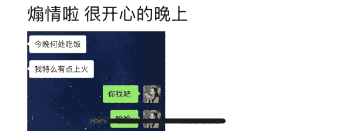

### 5.9 心态有点崩溃
那几天，我忙完直播，回到家已经半夜。

打开手机，全是门店的消息：又要接预约客户的电话，还需要随时回信息。

我躺在床上，看着房顶，心里只剩下深深的无力感。

另一边，我的直播每天能轻松赚一万多纯利润。对比之下，我又一次思考：我是不是想得太天真？是不是根本不该接手这个店？

短短一个月，我已经被合伙人放鸽子、被员工牵制、被客户消耗。

但我仍然想：也许再撑一个月，就会好转。

### 5.10 员工不让客户办卡？
11月底，我想做一个季卡活动，准备拉一波现金流。几个客户已经有购买意向，我心里正燃起一点希望。可员工竟然阻止：告诉客户别买卡了。当她把这件事说给我听时，脸上带着一种居高临下的态度，好像她才是老板。我当时整个人僵住了。

创业最扎心的时刻，是你砸钱做活动，却被自己人亲手拆台。那一刻，我终于明白：继续硬撑，只会越亏越多。

### 5.11 卡债纠纷
12月初，我已经动了关店的念头。我和房东沟通，我说要尽快结束这场闹剧。

结果在 12 月 5 日晚上，员工明知道我第二天就要转店签合同，她却提前把消息告诉了老客户，还要求我“给客户一个交代”。

可笑的是，这些客户的卡金钱根本不在我这里，签协议时写明了：我不接卡金。

钱在原老板手里，又没给我，我凭什么承担卡债问题？

但员工却逼我站出来，我站毛线啊？

人善被人欺，自己花钱养的员工，拿着我的工资还拆我的台。

#### 5.12 卡债是实体最大的坑

果然，客户们开始找我。有的可以理解，有的则大闹，甚至要走法律维权。

他们说的都对，可是钱真的不在我手里。

我能做的，就是把合同、营业执照、原老板的联系方式推给他们。

卡金是实体店最大的坑。那几天，我反复问自己：我为什么要趟这趟浑水？

直播轻松赚钱，我却非要钻进这个泥潭。

#### 5.13 果断止损：三天转店

12 月 3 日，我决定关店。幸运的是，12 月 4 日，就有人看店铺，12 月 6 日，店铺转让成功。

3 天时间，我从宣布退出到彻底解脱。

我完成了谈判、签合同，转钱，交接完毕，本来我以为能拿回一点房租就很好了，最终以 3.8 万元价格转让出去，算是及时止损。

##### 在处理过程中，我做了几件事：

- **划清责任**：对自有客户逐笔退卡费，对历史卡金客户，提供前老板的联系方式与合同，避免扛下不属于我的风险。
- **果断止损**：不再幻想撑一撑能扭转，而是接受亏损，把精力收回到主业。
- **心理转变**：承认这次决策的冲动与无知，把它视为一笔学费，而不是失败的标签。

#### 5.14 员工偷拿东西？

转店时，我看摄像头，发现员工拿了不少东西。

我朋友问我：要不要追究？我摇摇头：算了，我只想早点解脱。

钱可以再赚，但精力和心情才是最贵的成本。那一刻，我明白：这家店的每一天都在消耗我，不值。

后来还有一个小小的转折。

这名员工一直在传话、串话，转店后，她原本和新老板谈好继续留下，工资按多劳多得，不会超过 7k。

但我心里总觉得不对劲。她之前就没推动客户续费，还故意阻止办卡。等我仔细算账，发现有一笔续费卡金对不上，我可以肯定——钱被她私下收走了。

于是我提醒新老板：要留意一下这个人。

结果，她最终也没能在新店干成，所谓的“新工作”没开始就夭折了。

那一刻，我心里五味杂陈。刺痛依然有，但更多的是释怀：有些人靠小聪明能骗到一时，却骗不了一世。真正能留下来的，肯定是好的人品。

### 5.15 总结的教训

这 35 天，我亏了 5 万，但换来了最宝贵的经验：

1. 开店必须有自己人守着
2. 不会技术别碰实体
3. 员工最好自己招，新人没有根基，如果是接店：不建议留旧人
4. 接别人的店铺卡金永远是最大陷阱
5. 说话要谨慎。话一旦传出去，就不再是原意。

6. 这个行业没错。美甲美睫能赚钱，但只适合稳定 + 会技术的人。
7. 创业别急。先去店里打工体验，再决定要不要投钱。
8. 分店模式没那么容易。守不住第一家，连锁都是空谈。
9. 小而美比大跃进更稳。能靠自己养活的生意才是真的稳。
10. 轻资产更适合我。线上业务没有门店成本、人事内耗，才是我的方向。

#### 5.16 实体店觉醒：接店前的十个必考察点

**商圈与人流**：目标客群是谁？人流量够不够、能不能转化？

**真实流水**：参考同类店铺近 3 - 6 个月的支付后台，估算收入和支出。

**租约条款**：租金递增、押金退还、违约责任，写清楚再签。

**卡金与债务**：老客户的预存卡金到底在谁手里？一定要算清。

**员工与团队**：留下的人是否可靠？核心岗位能不能自己顶上？

**行业淡旺季**：淡季生意能撑多久？有没有补充项目填空？

**成本模型**：每天多少单才能保本？现金流能撑几个月？

**竞争格局**：周边有多少同类店？你的差异化在哪里？

**角色定位**：你是守店、做技术，还是营销？不能当甩手掌柜。

**退出机制**：转店难不难？设备、装修、库存能否快速变现？

**只要其中两点说不清楚，就不该贸然下场。**

我庆幸自己敢于止损，从决定关店到转出去只用了三天。虽然亏钱，但我保住了更重要的：我的精力、现金流和未来。年轻时的坑，都是学费。

35 天的实体店经历，虽然我亏了钱，却获得了一份自由感：我也不再迷恋所谓的实体稳定，也不再幻想连锁复制，我知道了自己真正适合的是什么——轻盈、灵活、能随时转身的生意。

## 直播行业：是我的底气

如果说工厂和实体店让我交了最沉重的学费，那么直播就是我最重要的底气。

在最艰难的时期，直播间每个月能稳定带来十多万纯利润，正是靠这条现金流，我才有勇气去试错、去填坑。

直播这种轻模式，低成本、可复制、现金流快，才是适合我的赚钱方式。

相比工厂的重资产、实体店的内耗，直播让我重新找回了掌控感，也让我看清了自己更适合的方向。

虽然有两段沉重的失败，但我不认输，我还会继续寻找未来的机会。

人是环境可塑的产物

2023 年 10 月 29 号，朋友就给我推荐生财有术。但我没加，因为我看不懂这里的学习模式。

2024 年，领取过三天体验卡，但是没看内容，就又错过了。

2025 年，因为我需要一个共享办公的环境，所以我终于加入生财了！！！

原因就是：在工厂和实体店接连挫败之后，我有很长一段时间几乎天天在家，不想做事情。

看似自由，实则很孤独，没有节奏，也没有方向。

那时我意识到：一个人闷头摸索，很容易陷进情绪和怀疑里。

于是我给自己定了一个小目标——去找一个氛围，找一个能让我重新回到轨道的地方。

环境和节奏，往往比能力更能决定一个人的状态。加入生财有术的唯一目的，就是为了加入共享办公。没想到，这个小小的决定，却让我一下子看到了一整个新的世界。

在共享办公的氛围里，我重新确定了方向，也更坚定了未来还是要继续做生意赚钱。

真正的成长，是在对的环境里汲取能量，再带着力量继续往前走。

过去做项目，我常常靠自己摸索，试错成本极高。

在这里，我能借助别人的经验快速缩短路径

在这里，我看到了很多之前从未接触过的赛道和思维方式

失败并不可怕，可怕的是没有参考系。

而在这里，我找到了一把能指引方向的指南针

## 四、继续创业的动力来源

财富永远是认知的补偿，而不是对勤劳的嘉奖。

一个创业失败过的人，继续创业赚钱的动力，不是梦想，而是责任、不甘心、经验、自由与信念的叠加。

很多人会问我：为什么我还能继续创业？难道不怕再跌倒吗？

首先是责任：房贷要还、员工要养、生活的支出不会停下，责任本身就是最大的驱动力。就算失败过一次，也没有理由停下脚步。

其次是不甘心：我知道工厂和实体店的失败，是我没有建立清晰的决策模型，是我凭感觉和经验做了重投入。工厂放大了现金流的风险，实体店放大了线下运营的短板，本质上都是方向没跑通，就急着加码。放弃很容易，但不甘心会一辈子折磨我。所以我宁愿再次出发，也不愿留遗憾。

再次是经验：失败带来的是更深的认知，什么能做，什么不能做，什么时候该加速，什么时候该止损。这些经验，反而成了下一次更有底气的资本。

更深层次的是对自由的渴望：打工能解决眼前，却无法改变命运。创业虽然辛苦，但至少让我有机会主动选择方向，而不是被动等待。

最后是信念：对我来说，打工是不可能打工的，创业早已成为我的一种生活方式。

我觉得生财有术真的是一个非常有能量的社群，写这篇帖子的时候，我也回忆了自己过去的很多经历。以前我在其他公域平台上也分享过这些故事，也收获过一些共鸣，但从来没有像现在这样系统地去复盘和思考。在这里，我也看到了太多人跌倒、再站起来。他们写下的每一篇踩坑复盘帖子，也让我觉得并不是只有我一个人会经历这些曲折。某种意义上，它也给了我继续创业的勇气。

当然，真正推动我前行的，还是自驱力。我比较松弛，允许自己在人生的某个阶段短暂躺平、躺平一段时间天也不会塌下。

来，所以我也可以失败——没关系，因为我还年轻。

看到社群里各种真实的故事，我更加确定了未来的方向。我也明白，每一个在路上的人都会遇到问题，但人生从来都不怕重头再来，勇气，才是一个创业者最大的底色。

我不想和大部分人一样用时间去换钱，我想把我的时间加杠杆，我想拿到更高的回报，也就是复利。我想拥有第二曲线、第三曲线，甚至更多条曲线的事业。

安全感，只能自己给自己。靠别人给的是幻觉，靠自己创造的才是真实。副业是底气，不是点缀。自由的复利，不是幻想。真正的稳定，是随时能再出发。

## 五、加入生财我的收获与改变

认知差距来源于见到的世界不一样，年入十万和年入千万的世界不一样。

加入生财两个多月，我的收获可以用三个关键词来概括：业务增长、认知提升、行动改变。

第一，业务的增长让我看到窗口。一些圈友开始使用我的外包客服服务。虽然这不是我最核心的收入，但它确实帮助我打开了新的合作可能。很多时候，业务的突破点，不是来自猛冲，是来自你让别人看见自己。当别人知道你在做什么，机会就会主动找上门，所以大家有电商外包客服需求的话找我。

第二，认知的拓宽让我重视体系。加入生财的这两个月我在线下见了 100 多位圈友。我第一次真正理解了什么是“可复利的系统”。过去，我总是把赚钱当成一个个项目在跑，而现在我明白：能持续迭代、不断复用的模式，才是真正的底层能力。短期赚钱靠项目，长期赚钱走远靠体系。

第三，行动方式的改变让我落地执行。比如我看到圈友分享微博玩法，就立刻把我自己 7.2w 粉丝的微博号重新拾起来。比如我决定做疗愈赛道，就开始组建北京本地女性社群，利用小红书获客，线下交付沉淀关系。比如写公众号，我思考的就是如何用 AI 和系统把内容“一次生产，多次分发”，逐渐形成可复制的 SOP。最大的不同是，我开始用体系和逻辑来落地，从想做变成能做。

#### 在这个过程中，我重启了个人 IP

两个多月的时间，靠着断断续续的输出，我在公域的所有平台积累了 2000 粉丝。虽然不算多，但对我来说，这是一个从 0 到 1 的突破，也是长期主义的第一步。个人 IP 的意义不在于短期爆发，而在于复利积累。这里有个小建议：就是尽量全网的 IP 名字都一样，后面不要随便改了。因为晴子的名字被注册了，所以我公众号、微博这些平台都叫：晴子 boss。有的平台不方便展示截图，简单看看。

#### 我也坚定选择疗愈赛道

现在还没有好的成绩，但只要方向清晰，就值得先走下去。未来有结果了，我会再和大家分享心路历程。

#### 尝试搭建属于自己的系统，借助 AI 工具提升效率

AI 帮我解决了大量重复动作：公众号的内容可以一键改写，分发到知乎、小红书、微博等平台。混剪视频过去人工一天十几条，现在用工具两小时就能产出 30 条初稿，再人工优化，就能支撑几十上百个账号矩阵。过去要靠人力，现在靠工具，效率直接提升到指数级。

我的一个思考需求：就是有一套写文字的系统。以前写公众号，我常常觉得耗时耗力，因为同样的内容其实可以同步到多个平台。我渴望有一套系统，把我的大脑知识沉淀进去，让 AI 帮我针对不同平台生成内容。这样一来，就像是多了一个助理，甚至是一整个团队，能同时运转矩阵账号。这并不是空想。在生财，我看到大佬们分享的案例：他们用一套系统同时运营 2000 个小红书账号，自动生成图片、自动发内容、自动评论，再配合小红书加微信的工具，直接完成客户转化。背后节省的人力和时间成本，几乎无法想象。所以我意识到 AI 不是噱头，它是真正可实现的生产力工具。

它能把复杂的流程拆解、标准化、复制化。比如视频混剪，以前人工操作一天几十条，现在系统化之后一天能产出上千条，还能自动规避重复率的问题。曾经觉得遥不可及的规模化，如今已经能靠 AI 触手可及。当系统和 AI 工具替你赚钱时，你的边际成本几乎为零，而增长则可能是指数级的。所以我最大的收获是：不要低估环境的力量。加入生财之前，我知道很多事，但一直停滞不前的原因是不知道 SOP，不知道怎么去做。加入之后，我看到别人真实的案例和成果，很多想法才真正进入我的认知，成为我能操作的路径。成长是一次次小改变的叠加。世俗的成功给人自由，真正的自由，是靠方法、流程和工具替你跑出来的。

## 六、经验分享

这个经验分享，我们不讨论赚钱方法，主要给大家分享一下我这么多年赚钱找到抓住机遇的规律和心力过程吧。

### 选择大于努力

普通人不要执着于做实业，不要上来就重投资，很多人还是实体的脑子，没有转过弯来，其实现在产品是最不缺的，工厂实业也是最不缺的。工厂和门店的失败，让我彻底认清：我更适合轻资产。比如自媒体、直播、电商、内容与服务——低成本、快反馈、可复制。我也不再追逐看起来大的机会，而是专注适合自己的轻资产方向。

### 每个人都有抓住风口的机会

人的一生有 7 次大运，抓住中年 20 年之间的任何一次机会即可起飞。30 年前的风口是外贸，20 年前是房地产，10 年前是电商，现在是自媒体。工厂、去重投资做实体店，我说的是重投资哦，要根据自己的能力和环境判断方向。

### 愿意付费，终身学习

我一直相信，人赚不到认知之外的钱。付费，是一个人成长最快的方式。2016 年，因为我付费加入社群，我才幸运的接触了穿戴甲的项目。所以人受环境影响极大。认知可以复制，赚钱可以复制，行为也可以复制，好运的高能量磁场也可以复制。付费进入社群最大的好处就是：你早晚会动起来，一旦开始，就不会停止。把自己放进高能量的场域——无形之中会拉高自己的基准线，命运的齿轮已经开始转动。认知的提高，就是先看到信息 → 提高认知 → 产生决策想法 → 最后行动，这是我的基本路径。看见别人怎么做、为什么做、踩过什么坑，才更有可能少走弯路。

### 意志力与信念 - 时常想着好事发生

你想过上你想要的生活，首先你得相信。人的意志力非常强大。我记得两件深刻的经历：第一次：小时候在农村地里，我在拐弯处被摩托车撞倒，我那个时候的想法就是：撞就撞吧，然后，砰，撞上了，这是我第一次意识到意志和念头的力量。第二次：前几年，早上 5 点出门，天没有亮呢，我心里想着，别有个狗蹿出来吧，结果真有一只狗突然冲出来。这让我更加相信，意志力和信念真的很强大，真的就是心里想什么就会来什么。这个也是吸引力法则的核心。所以我一直保持乐观和松弛的心态，不会想不好的事情，所以我其实相对来说比较顺利。当然，人生本就磕磕绊绊，这是正常的。经历多了，很多问题都不再是问题。

### 找到命运转折的规律

财富不是慢慢积累的，而是就那么一两个正确的选择带来的，要站对风口。风口一方面是靠信息，另一方面也离不开之前的积累。我对这个的体会是，去思考，去总结每一次改变的规律，注意，是规律。

机会的出现，它往往是突然发生，而不是提前规划好的。每次有新的动作，我只要觉得能成，我就去做，结果往往真的能赚到钱。但也有局限，我认为赚钱它是一种结果，那我没赚到大钱的原因在于认知的局限。当时我身处的圈子收入水平普遍是几万元，我能赚十几万就已经觉得够多了。所以我一直在反复强调，人是环境的产物，同时你所处的环境也决定了认知和格局。大佬们的年收入动辄几百万、几千万，因为他们的圈子里的人本身就是这样一个层级，而大佬的贵人和圈子也是比他们的收入多 0 的人。大家在赚钱的这条路上都会遇到各种各样的问题，大佬也是一样的，但我强调的点就是说你要去抓住你人生节点，你每次好转的状态，你的感受去找到这种规律，这样的话你在未来有机遇来的时候，你就能直接抓住。想让自己变得更好，这个过程肯定很难。每一个变强的阶段都会伴随着些许阵痛，这一点毋庸置疑且没法避免。成长就是旧自我的破和新自我的立，破的过程必然是伴随痛苦的，不破不立，只有破，才能有新的立，才能有新的自我。

你不用逼着自己擅长每一件事，毕竟每个人都有自己的特色。人可以被环境塑造，也会因环境而突破。

## 找一个好的对标

以结果为导向，我们把赚钱看作是一种结果，然后把动作往回拆，我的所有动作都是为了结果。那我们就要找到一个比自己收入高一个数量级的人作为对标，而且这个人你要喜欢，还要尽可能去接近他/她。然后模仿他，学习他，把知识变成自己的能力。同时，记录分享自己的经历也很重要。遇到问题解决问题，胜不骄败不馁。持续记录持续写内容，一年两年可能结果不是很明显，但是三年之后，你绝对会非常厉害。人生就是不断学习的过程，差距就在于积累和时间。而分享内容，这也是个无形的技能，不是精通才能教别人。80 分能教 60 分，60 分能教 40 分。你的同行说不定只有 30 分就敢出来赚钱呢。这个逻辑就叫钱永远从高认知流向低认知。

## 在别人身上，发现自己的可能性

这个在我的内容里也可以看出来，我就是一个会学习，会模仿的人。比如出国念书，那我也是先看到别人这样做，所以我才发现我也可以这样做。我加入共享办公之后，我发现王子冯老师是出过书的，还有吴幔老师也是出了很多书。所以我也计划明年出书。这就是环境的影响。

## 止损是风险管理，复利是长期回报

我做过工厂和实体店，虽然亏的钱不算多，但耗费了我大量的时间和精力。当时做工厂，我给自己设了目标——最多投入一百万，不会再多。但那段低谷期，实际消耗已经远超出这个范围。后来我清仓止损，才避免真正栽进去。在决定清仓之前，我做了两件事：请教比我厉害的人，听取他们的判断；用自己的方式验证，甚至去算卦。最后得到的结论很明确：这条路不适合再走下去，于是我果断关掉工厂。如果一件事不能带来价值，选择方向错了，你以为你损失的只是那些钱，其实还有时间，比如你一年能赚 100 万，那你这一年的实际亏损是 100w + 你的亏损，就是一百多万。这个就是：机会成本。机会成本指的是：当你选择了某件事，你不仅要承担它带来的直接成本，还要承担因为没去做其他更优选择而丢失的收益。这是我早在 2018 年看到的一个观点一个道理，也一直记到今天。

所以说我亏了吗？当然亏了。光时间成本一年就至少值两百万。但这些经历又是宝贵的。因为年轻，踩过坑才会成长。人生不可能步步稳健，经历跌倒才能让人更冷静、更理性，不会再盲目冲动。做一件事最好的时间是 10 年前，其次是现在。你始终回避的问题，会反反复复出现，直到你给出新的解法。人生最重要的财富是长期积累，只有把时间放在值得的事情上，才会产生复利。我们也可以把碎片化经验整理成方法论，沉淀成工具。长期绑定人和产品，打造能陪伴十年的关系和事业。所以，我坚信——坚持十年去做个人 IP，复利一定会出现，人生会进入指数级增长。认清赚钱的本质，就是中间商卖东西。回头看我所有的赚钱经历，本质上都是卖东西，只是卖的东西不同。

最赚钱的不是挖金矿的人，也不是握着金矿的人，而是卖金铲子的人。做中间商，赚的是信息差的钱。你不需要承担品牌方的资金压力，也不用背执行端的人力成本，只要把需求和供给撮合在一起，中间留一份差价，就是纯粹的商业逻辑。我最早的赚钱，也是从这里开始的：靠信息差做二道贩子。没有实体门店，没有大投入，但只要能找到买方和卖方之间的缺口，就能形成交易。既不用承担品牌方的资金压力，也不用承担执行人员员工成本。而今天，卖东西的形式更广了：卖货、卖渠道、卖服务，甚至卖自己的知识。空气也是产品。别人愿意为你的经验、技能、方法付费，你就已经完成了一次中间商式的买卖。

## 借助 AI 工具，做一个一人公司

这个观点是我听书哥讲的。那天我咨询了他自费出书的事情。他说，我可以写一个一人公司。然后我就去搜，一人公司到底是个什么？

所谓一人公司，就是把个人的技能、经验和知识，借助 AI 和系统化的方式做出来，然后规模化复制。过去要靠人力、团队才能完成的事，现在借助 AI 工具，一个人也能跑起来。规模化增长——构建一个可以自行运转的、越做越轻松的赚钱系统。去写一个 AI 为未来的发展有帮助，AI 为某一个技能提高效率、可以赋能的内容。

> 去结交一个年收入比你多一个 0 的贵人

贵人的作用就是这个，你遇到的问题她都遇到过，她有你不知道的信息差，一句抵一万句。而你最重要的就是：听话、照做。人永远没有办法成为自己没有见过的人。信息差永远是最贵的。一年赚 10w 和一年赚 100w，你看到的世界是不一样的。赚到 1000w 和 1 个亿看到的世界更是完全不一样的。那么，怎样才能去结交年收入多一个 0 的贵人：

-   1、你需要有核心技能。
-   2、听话照做，及时反馈。
-   3、最核心的一点是，你始终在往上走，要一直在牌桌上。

贵人帮你，她就像是在投资，只是这个投资是人。投资人大家不会执着于回报，但一定是这个人一直在往上走贵人才会给更多。绵绵用力，久久做功。有的时候赚钱也就是一瞬间的事情，但这离不开之前的种种努力与积累，才可以抓住机遇，迎来财富。当然要学会取舍，别什么钱都想赚。

## 要有金钱的概念，做好风险管理

我的第一笔钱是攒出来的。那时候没什么钱，就硬给自己定了规则：每个月至少存 30%，这个习惯让我不至于被消费裹挟，也给了我继续折腾的安全感。金钱确实能解决 99% 的问题，大部分人的困境都是由于金钱不足，那么，面对问题，解决问题。回头看，我能积累下来的一些财富，其实也离不开家人的帮助，比如买房产、买商铺。当然我更不可能把所有钱 all in 在一个地方，而是分板块去做。我个人非常保守，不做股票投机。从 2019 年在国外念书开始，我坚持做黄金定投，这是一个同学给我的建议。当时没多想，但一直坚持。事实证明，这个长期习惯帮我赚了不少钱。所以，我的经验是：投资一定要量力而行。做一件投资之前，先问问自己：如果亏掉这笔钱，我承受得了吗？心力会不会被拖垮？能稳住心力的投资，才是真正适合你的投资。

#### 执行力与复盘力

我是一个执行力和复盘能力都还不错的人。如果我选择一个方向，我会做个大概计划，方向没问题，我就开始了，先跑通流程，赚到第一块钱。然后一边做一边优化，一边学习一边复盘。很快就能沉淀出完整的 SOP。

### 持续留在牌桌上：你以为你在和千军万马竞争，其实你的对手只有几个人

一件事坚持 3 个月可以淘汰 60% 的人；一件事坚持 6 个月可以淘汰 80% 的人；一件事坚持 1 年可以淘汰 90% 的人。赚钱的路上，一直都是二八定律，“剩”者为王。

## 回忆录：一些照片分享

emmm，我没有什么拍照习惯，所以照片比较少，可以看看我的十几年~多多少少都有点记录。2012 年、2013 年、2014 年情人节我都会组织小伙伴一起卖花。2012 年 -2014 年应该都在卖手机卡。

“不过和我交易那小妹妹真可爱，告诉她下次交易了，不给钱，别给卡”

**回忆 (1097/1240)**

2014/04/04 AI 修复

17:38

-   10000 分钟联通主叫。200 分钟随便打。市话
-   16 月租。
-   130 一张卡，1000 兆流量
-   卡可用到 2015 年底

> > 手机卡。 说点什么吧... 点赞 评论 …

公众号懒人搜索、懒人专属群分享   72 / 114

**回忆 (1115/1240)**
2014/02/14 AI 修复

添加描述
说点什么吧... 点赞 评论 ...

2016 年，应该是 YY 语音群聊用的少了，然后就建了 QQ 群。2016 年 10 月 3 号进群的，其实这个主持放单的差价我们赚了很多年。有一次收拾旧书，这个放单的记录，有 30 多个笔记本。没扔。

## 群聊设置

### 新创皇马群

在这里，发现更多~

#### 群聊成员
-   国民老...
-   22 团红梅
-   72B 主...
-   26A 副...
-   112A 樂...
-   17B 管...
-   106A 主...
-   177 副管...
-   35F 副...
-   197 团...
-   66 副管...
-   35D 管...
-   8Q 副管...
-   88L 主...
-   104E 副...

#### 群聊信息
| **属性** | **内容** |
|---|---|
| **群聊名称** | 新创皇马群 > |
| **群号和二维码** | 106513592 > |
| **群公告** | 抖音 快手 小红书任务的 有手就行的 有兴趣私... |
| **我的本群昵称** | 144 团主管 - 晴子 is:284767... |
| **群聊备注** | 未设置 > |

2016 年，忘记我在做什么了，但肯定是赚钱的事情。我和家里人相处都蛮好的，没有和父母吵过架，没有红过脸。看到这段我也想起了我爸。每次我给他打电话都是这样嘱咐我一大堆，最后挂电话的时候还要看几分钟生怕浪费了那几毛钱话费。习以为常了之后都是我打电话给他，他去营业厅设的接电话免费。他也和我说，钱是赚不完的，要注意身体阿各种。我当然知道一个人在外不容易，深刻体会。有时候我一个人无助的时候我也给家里打电话，农村出来的孩子，和其他人什么都拼不了。我只能拼阿拼阿拼阿...想让家里人过上好的生活。车水马龙的街道，却找不到一个类似于你的背景。

吕建忠 陈帅哥朋友：都这样
晴子 回复 吕建忠 陈帅哥朋友: 以前不太懂，现在能理解。
王鑫：加油加油
晴子 回复 王鑫: 🥰嗯谢谢老同学，

扯淡得青春不需要解释：加油啊

2018 年，应该是赚了蛮多钱，然后进了某个社群，里面都是大佬，就是涨了见识，我写下的感慨。

**晴子**
2018-01-10 仓仅自己可见

## 你是什么样的人 将会决定你有什么样的圈子

# 物以类聚 人以群分
## 你是什么样的人 将会决定你有什么样的圈子

浏览 264 次
iPhone X-No.3127098
👍晴子、林、16 外国语何伟光、13 数控中德程世鹏、王忠鹤法国同学、高建勋、17 届电子商务、王蕾蕾 17、17-物流涉外 - 王路明、16 会计ε。建材唐曼、何丽媛、东营领域吊装、     、16 会计 6 班康宇晴、16-英语 - 王国静 - 遵化等 43 人赞了

仁者乐山：
浪得好啊

2018 年，第一次面对 200 多人讲话，说话打颤，我们团队的合影，c 位是我的上级。

2018 年，我买的第一套 200 平米的房子

2018 年，我自己买的第一个钻戒。因为我超级喜欢戒指。

晴子
2018-11-01 仅自己可见

十一月 🌹

浏览 194 次
iPhone (4G)

👍王鑫、真心&W 松、管理员、西班牙语苗爽 4 号床、王忠鹤法国同学、高建勋、安然无恙田悦、王蕾蕾 17、黄磊、王晶、张皓雯、东营领域吊装、德 Deutsch 遵化、李秋生等 27 人赞了

2019 年，我们的直播间。

> 2019 年 1 月 19 日
> 18:01

2019 年，这个对话的朋友是我在小时候卖手机卡的客户，只见过一面，后来在澳洲再一次相遇啦~ 我在澳洲的第一天，大哥给我点的餐。我运气一直挺好的。没有别的故事，我一直把他当我的好大哥😊😊

## 2019 年 8 月

晴子 2019-08-24 🏠空间状态为私密

我爸说：真佩服我到哪里都有朋友
真是缘分，认识好多年了
到了澳洲也能相遇
谢谢我大哥的晚餐❤️

浏览 509 次
iPhone 👍17 应英、温存迷醉°银山、16 电商 潘畅.、李金霞、安然无恙°田悦、丁怡娴~十中东大学交流生、在城域吊装、任月超、李丽娜、森鹿等 27 人赞了

循环：好像素食哦
这些是 2018-2019 年的一些图，因为有的微信我没有登录，就找到了一点点朋友圈痕迹。
2019 年，已经在朋友圈讲，不在微信上卖货了。那时候做直播每天有几千上万块利润。

公众号懒人搜索、懒人专属群分享

中国联通 4G 上午 9:56 81%

动态
消息
私信
晴子
游戏
设置
大屏模式
本地作品集
扫一扫
青少年模式

❤️有方法，有技巧，新市场，手把手教拍快手火山抖音!

赞 评论
详情>

不到一次嫁接睫毛的钱就...
想关心你的人真的有千万个理由和方式
已完成考试，自己英语现...
每天都在赚钱...，不然我这花销，在国外都不能养活自己！
今天是不一样的自己😜

❤️磁石睫毛：即将火爆全球的新神器，喜欢私聊我，看懂市场的私聊我，无限...
洗衣服、做家务、洗澡都没有任何问题
春节不打烊，150¥顺丰包邮到家🔥

## 微信 (667)

群聊

标签

公众号

A[👉]指尖魔盒
A[🌻] Amy[👙][🎈]
A[🌛]FicKle·悦
A[💋][👑]绿茶 [👑]衣佳人 [👉]
艾芘基妮[👙][💋]雪雪 13891678759

> 很多人咨询美甲来了

笔新订单，订单号
1929800001658332，点击查看
你的商品"H•T 磁石睫毛”收到了一笔新订单，订单号
1929800001768280，点击查看
你的商品"H•T 磁石睫毛”收到了一笔新订单，订单号
1929800001946619，点击查看
你的商品"H•T 磁石睫毛”收到了一笔新订单，订单号
1929800001926107，点击查看
你的商品"H•T 磁石睫毛”收到了一笔新订单，订单号
1929800002057349，点击查看

❤️ 小黄车爆单
磁石睫毛市场超级空白，98% 的女性不知道这个产品，所以现在赚钱超级容易，加上 5G 小视频时代刚刚崛起，双剑合璧，现在做代理，走心的人一个月五位数轻轻松松!!!!!!!

## 2019 年 10 月 30 日 18:52

❤️忘了没录个视频，就装袋子准备发走了😂，补一个吧，📦4 袋子货，每天都是疯狂爆单，每天都想不起来录
**可做代理**
+ 159 **三盒磁性睫毛做代理 !! 空白市场，早加入早赚钱，手把手教玩快手...**
❤️一场直播卖货 20 多套睫毛，一天三场直播，纯收入几千，赚钱就是这样简...
+ 159 **三盒磁性睫毛做代理 !! 空白市场，早加入早赚钱，手把手教玩快手...（自用代理都划算，不需要胶水的睫毛哦...）**
❤️一起努力，我们会做的更好
+ 88 **零售一盒磁性睫毛🌈**

+ 159 磁性睫毛新市场哦🌈159 米三盒睫毛即可做代理
+ 2x88 零售两单磁性睫毛
💖2020 年超级火爆的磁石睫毛无需胶水
10 月 25 日
💖小黄车爆单，市场好不好，看看就明白有眼光的人才会赚更多的...
💖磁性睫毛操作方法，不需要涂胶水哦即安全又方便...
💖小黄车爆单磁石睫毛市场超级空白，98% 的女性不知道这个...
+ 88 零售一盒磁性睫毛🌈
+ 311 代理补差价升级~!不需要胶水，利用磁性原理直接戴的睫毛，必...

公众号懒人搜索、懒人专属群分享

相册
2019 年
10 月 30

> ❤忘了没录个视频，就装袋子准备发走了[笑]，补一个吧，[4]袋子货，每天...
> ❤磁石睫毛反馈：超美超好看，颜值加分神器😏
> +88 零售一盒磁性睫毛🌈不需要涂胶水，利用吸附性原理直接搞定
> +88 零售一盒磁性睫毛🌈不需要涂胶水，利用吸附性原理直接搞定
> +159 每天发圈的时间都没有，真的忙[捂脸]
> ❤和我们一起创业的闺蜜买房啦，首付 35 万，真的超厉害，94 年的小姑娘～...
> ❤自用代理收到货以后自己测试牢固度，确实很牢固的哦，喜欢的宝贝赶紧...
> ❤磁石睫毛，代理加盟价格表，想做代理私聊我。

## 相册

2019 年

顾客收到非常满意，百分百好评，咱家磁石睫毛就...

05

11 月

买家秀 ❤️ 更轻柔、更自然、更安全，可循环使用的魔术睫毛，无需胶水，...

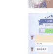

❤️ 副业真的有很多好处，有一天它也许成为你的跳板，但是你接触，你永...

❤️兼职篇：11.3-11.4 的单子，利用看电视的时候做几单，赚了 80+，就是...

04

11 月

🌸【顾客反馈】

顾客收到非常满意，百分百好评，咱家磁石睫毛就...

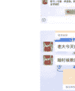

+940，货还没到家，又卖没了，这就是市场需求，市场空白，早加...

❤️ 买家秀:睫毛带上之后超自然，而且显得眼睛很有神哦，好不好用试试就知...

+88，又零售一套，无需胶水，可以反复使用

### 抖音卖货哦磁性睫毛...

## 23

### 10 月

**❤️小号直播一个小时，卖了十单!!**赚钱真的很容易，选对产品，选对团队...

**❤️晚上培训一波~**大家慢慢的看我群裂变，不出半个月，绝对开第二个群...

**❤️代理今天晚上发圈，立马进代理!!!**
^_^

**➕💰800 官方合伙人定金**🌈跟我做，手把手带你玩抖音，教你如何卖货...

**❤️一群努力上进的女孩子**
**!!只要努力，什么都会有**
🌈赚钱是会上瘾的，一...

**❤️直播一个多小时，小黄车爆单 20 单~**
纯利润 1000➕...

**❤️又花了几千美元买包，**没有动力的时候就去消费，钱花了也有赚钱的动力了...

H. 每天都忙哦🤩都是直播间下单~

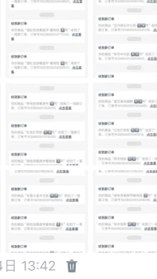

2019 年 12 月 4 日 13:42

12.6 零售美甲睫毛 + 刘丽
731240...
中通快递 宝贝查收

12.5 零售美甲 + 李晓梅
731240...
中通快递 宝贝查收

12.5 零售美甲 + 王燕燕
宝贝查收哈

12.6 零售美甲 + 张晓
731240...
中通快递 宝宝查收

12.5 零售美甲睫毛 + 于生龙
宝宝查收

12.5 零售三盒美甲 + 李岚
73124020...
[中通快递]

12.5 顾客 + 刘丹丹 (老代理)
👋

[花]晴子
不呢

夏天
[语音]

💖不怎么在微信上卖货了，谢谢宝贝们信任

2019 年 12 月 10 日17:44

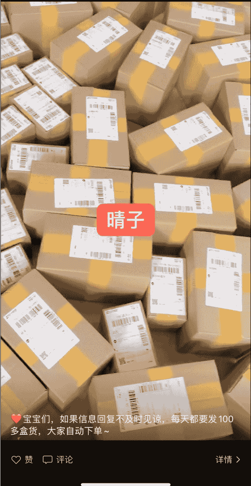

❤宝宝们，如果信息回复不及时见谅，每天都要发 100 多盒货，大家自动下单～

2020 年在国外读书的时候倒腾卖口罩，因为胆小，赚了一点小钱，有十多万块。

晴子
2020-02-01
仅自己可见

## 感觉今年的人际圈 又发生了 ❤️变化
都会越来越好的

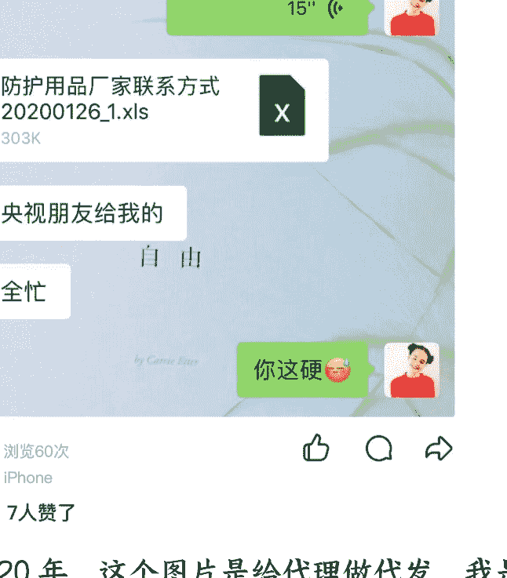

浏览 60 次
iPhone
7 人赞了

2020 年，这个图片是给代理做代发，我是和工厂直接联系的，然后我在中间赚差价。

晴子 2020-05-13 空间状态为私密

😂每天像侦探一样 记录数据 做着我不喜欢的事

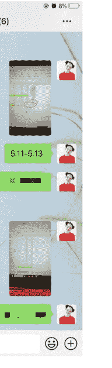

👍 17 应英、王海义同学、赵文艳、17 法语 firmament 史俊哲、北鼻 -噂奶🍼、🌙、数学课 👍 7 人赞了

2019 年，我也做过代购，哈哈哈。

# 晴子

2019-12-08

第二次出来买了，买了 1000 刀保健品？

> 浏览 294 次

> iPhone (4G)

> 五元、西班牙陈子叶、陆璐、东营领域吊装、第五十五说、李银杰工管、16 电商赵洪岩、学弟、循环、北鼻 - 哼奶等 15 人赞了

**2021 年，在同济大学。**学的 MBA 课程，然后特别忙，白天上课，晚上我做代发表格，第二天需要工厂发货。

**[图片]**

## 当前空间状态为仅自己可见

去修改

🤗🤗🤗🤗

2021 年 越来越好

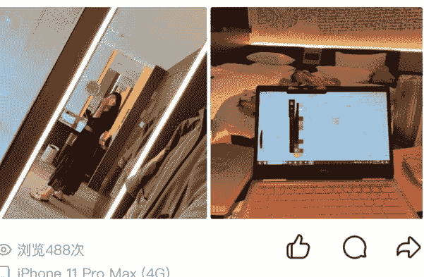

👍张雨洋、森鹿、德 Deutsch 遵化、学前二班张紫琳计算机、赵文艳、魏然、16 李佳静 Elsa、师傅、🐻('ε'μ)、17 会计等 13 人赞了

蒲公英的天空：开始住酒店了😅😅😅

**2021 年**，在澳洲机场买的第一块手表🤳🎖️，挺贵的哈哈

2021-2023 年做工厂的时候的仓库图，真的不容易找到的图片！！

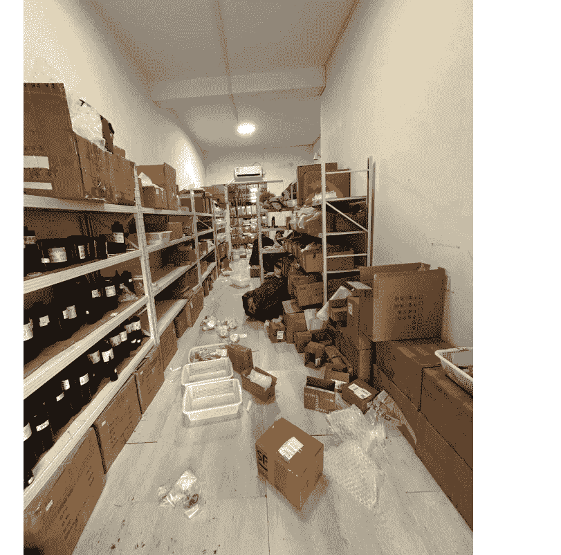

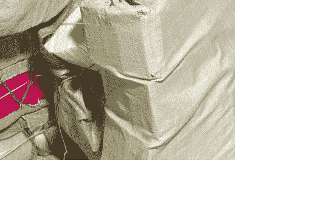

2023 年 10 月接手的实体店，一个月的学费五万块，还挺贵的，不过肯定终生难忘。

那时候需要经常去店里，还挺有富婆的感觉的是吧 哈哈哈哈哈

# 2023 年 10 月 26 日 18:38

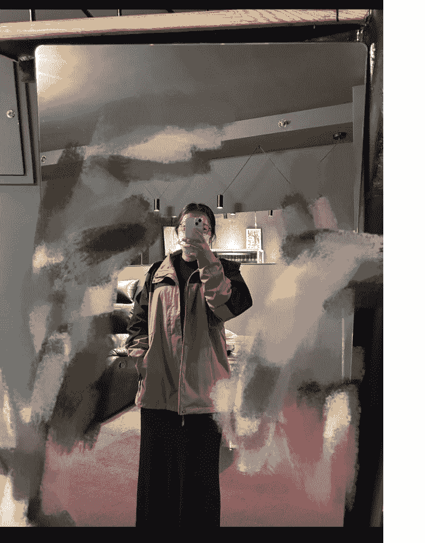

秋天 ~ 出门怕冷 穿厚外套😜

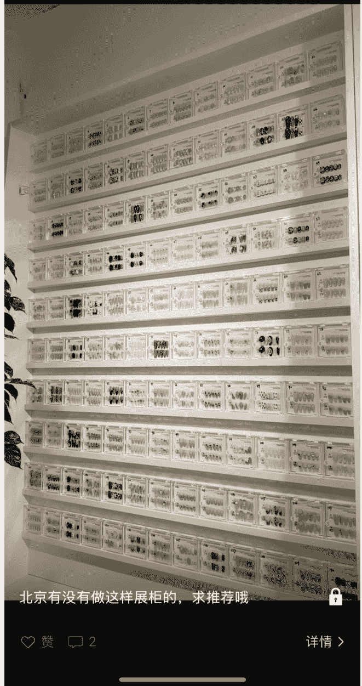

2023 年 10 月 28 日19:23

北京有没有做这样展柜的，求推荐哦

详情>

# 2023 年 11 月 6 日 17:18

像个球 穿这么多还很冷

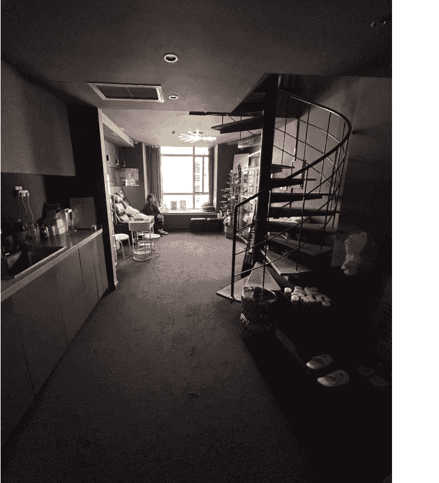

## 我们的穿戴甲直播间

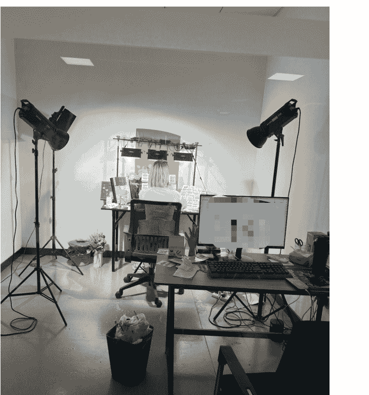

简单截图一下我们 8 月份的业绩，电商我是一直在做的，没有停下来

|出账日|状态|结算单编号|结算期间|月度总收入(元)|佣金汇总 (元)|人工调账记录|
|-|-|-|-|-|-|-|
|2025-08-07|待商家确认|S202508010109325|2025-07-01 至 2025-07-31|107,531.99|5,768.82|查看|
|2025-07-07|待商家确认|S20250701010144497|2025-06-01 至 2025-06-30|73,732.63|3,947.70|查看|
|2025-06-09|已确认|S2025060101034551|2025-05-01 至 2025-05-31|24,753.64|1,277.76|查看|
|2025-05-15|已确认|S202505010624454|2025-04-01 至 2025-04-30|35,856.79|1,893.04|查看|
|2025-04-08|已确认|S202504010119508|2025-03-01 至 2025-03-31|41,699.58|2,180.65|查看|
|2025-03-07|已确认|S202503010106170|2025-02-01 至 2025-02-28|35,196.15|1,837.50|查看|
|2025-02-10|已确认|S202502010115207|2025-01-01 至 2025-01-31|62,568.39|3,300.65|查看|
|2025-01-08|已确认|S202501010297141|2024-12-01 至 2024-12-31|85,574.08|4,367.99|查看|

11:22

快手

# < 货款账单

税费估算 | 帮助

累计结算总额 (元)①

2,217,038.95

待结算 (元)

+ - 日账单
- 月账单

金额 (元)

35,538.38

2564 笔 >

|安心钱包 |微信|
|-|-|
|35,538.38 2564 笔 |0.00 0 笔|

# < 数据罗盘 

抖音电商数据，就用罗盘

+ - 首页 
- 搜索 
- **交易** 
- 商品 
- 市场 
- 服务

+ - 近7日 
- 近30日 
- 自然日 
- 自然周 
- **自然月**

## 核心数据 8 月 01 日 -8 月 31 日 
[售后分析及优化 >]

**整体** 自营 合作

**用户支付金额** 
 ¥77.47 万 
 环比 ↑5.76% 
 标杆 175.94 万

**退款金额**(支付... 
 ¥25.88 万 
 环比 ↑11.01%

**退款后用户支付金额** 
 ¥51.59 万 
 环比 ↑3.31%

**退款率**(支付时... 
 33.41% 
 环比 ↑4.96%

**成交订单数** 
 2.09 万 
 环比 ↓17.34% 
 标杆 3.78 万

**退款订单数**(退... 
 7957 
 环比 ↓15.01% 
 基准 2,144

**退款金额**(退款... 
 ¥36.04 万 
 环比 ↑1.35% 
 基准 20.4 万

**成交人数** 
 9345 
 环比 ↓14.57% 
 标杆 1.72 万

**客单价** 
 ¥82.9 
 环比 ↑23.8% 
 基准 75.24 (注意：原文基准 175.24，保留 175.24) -> 基准 175.24

展开趋势&载体 v

我要反馈

# < **货款账单** 
 税费估算 | 帮助

累计结算总额 (元) ① 
 **916,037.25**

待结算 (元)

+ - **日账单** 
- **月账单**

**金额**(元) 
 **80,504.87** 
 > 6348 笔

|安心钱包 |[安全保障中] | 80,504.87 6348 笔 |
|微信| 0.00 0 笔|

## 经营概览

**交易构成**

#

支付金额

**11.1 万**

上周期 -29.47%

**支付订单数**

**2,631**

上周期 -21.93%

**支付买家数**

**1,814**

上周期 -14.35%

**商品访客数**

**3.8 万**

上周期 -14.55%

支付金额

| | |
|---|-|
|20.00 万 ||
|15.00 万 ||
|10.00 万 ||
| 5.00 万 ||
| ||
| ||
| ||
|0 |||

2024-11

2025-01

2025-03

2025-05

2025-07

## 人群构成

#

首购用户金额

**¥81,367.40**

较前 1 月 -35.77%

**首购用户数**

**1,454**

较前 1 月 -19.40%

**七、写在最后**

> 

> 

>

当然不同的阶段对标的人不一样

因为你赚到的每一分钱背后，真的都有一套方法论

一个人的成长有三个点:个人的意愿、老师的指导、场域的加持

而我们是可以通过场域，和这些分享的帖子 1-10 的内容，让自己拿到结果的。

致富的路，要靠认知来打通。

所以要努力投资自己，当你比别人看得更深，看得更远，自然也会离财富更近。

高层次人才也会把时间和精力花在修炼技能、提高认知上，到了一定时候，钱自然会流向自己。

世上所有的惊喜和好运，其实都是你积攒的善良。当你心怀善意对待这个世界时，
这个世界也会善意地对待你

所以我想给大家一个小小的行动建议：看完帖子后，先去思考挖掘自己的人生转折经历，那个让你变化的时刻，你的想法，
你的感受，找一下这个规律，如果你有多次这样的经历，在未来就特别容易抓住机会。

然后行动起来，挑一个你能立刻启动的小项目，先动手试试。

如果报名航海的伙伴，就跟着航海一起学习

无论它大小如何，只要迈出第一步，你就已经领先了很多人。

最后，安利小懒的付费群：
懒人专属群（介绍）

❄️ 懒人专属群持续更新中，已持续运营 6 年，整理超 3000 份各类精选付费文章&年费社群干货，全部开放下载。

本资料为付费群内部分享，仅供真实有需要的朋友查阅 🙆‍

懒人专属群更新记录： https://lazy2025.top/blog/record2

懒人专属群更新记录（需梯子，备用）： https://lazybook.fun/blog/record2