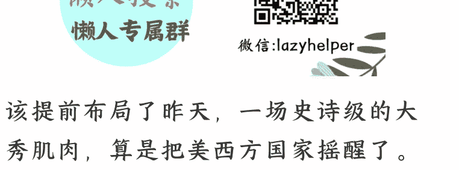
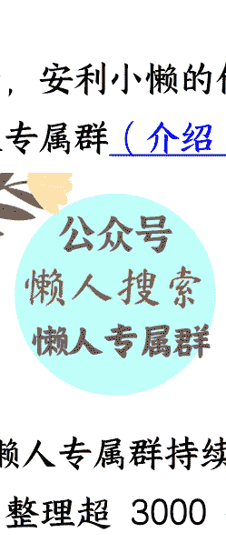

# 大秀肌肉，美股与全球债市风暴

250905 A 视野
整理：公众号懒人搜索，**懒人专属群**独享
懒人微信：lazyhelper

该提前布局了昨天，一场史诗级的大秀肌肉，算是把美西方国家摇醒了。

然而，与此同时，海外国债市场早已发生动荡。大量发达国家的国债市场的融资成本快速飙升，已经到了人心惶惶的地步。

最绝的是，美股也是波涛汹涌，又好似暗流涌动。

显而易见，聪明钱，从这些事件中，已经看到了一个全新的未来，一个全新的金融市场计价逻辑，一个全新的秩序与暴力美学。

层峦叠起，隐幽暗渠，时代的重大信号，终于开始闪现。

今天，A 森想在这里，给大家分享独家、私密、重磅干货。

希望大家可以看到，在任何其它地方都看不到的底层逻辑。

因为，这是真的影响我们所有人未来身家性命的！

这次，我们算是体系性的秀肌肉。

此前，日本人叫嚣，希望其它国家的大佬不要来参加，其实是想多了。

因为，这些东西，是给美国看到的，具体而言，就是给川普看的。

核心点在于：我们必须要让川普看的清清楚楚，否则，川普低估我们的前提下，就会出现盲动。

这个启发，其实还是来源于今年 5 月的印巴空战。在空战前，美国积极培养印度很多年了，甚至，不惜在 2023 ~ 2024 年中美金融战最激烈的阶段，强势将我们这里的大量资金抽走，然后注入印度。

那个时候，莫迪是最靓的仔，哪怕倒卖俄罗斯石油（名义上俄罗斯受美国制裁，谁倒卖俄罗斯石油，谁就要连坐），也无所谓。

可是，一场印巴空战，让极为务实的美国人看到，“印度不配”。

美国毕竟是大资本主导的国家，对于大资本而言，他们真正关心的是：安全和超额利润的双重诉求。

你就算再有利润前景，可是，你的军武能力烂到爆，那么，列强们宁愿把你变成 ATM 机，也不会给你任何机会。

反之，你很安全，可是，你根本没有任何赚钱机会，那人家恨不得捏着鼻子绕着你，就像俄罗斯等。

**所以，这次中国选择全面秀肌肉，就是给国际大资本一个“交代”：赚钱和守财，这两大功能，我华夏都可以满足，快来吧。**

**机会，我们这里有。**

**超级军武，我们这里也有。**

**反观现在的美西方国家，在这两点都是岌岌可危的。**

**要军武，只有美国有，其它美国所有的盟友都没有。**

**要赚钱机会，整个美西方国家的财富都在极高的“福利制度”以及“赎买权贵”两个维度，快要被掏空了。**

**连续数年的疯狂加杠杆，使得他们现阶段的赚钱机会即将“边际递减”。**

**因此，在美联储重启降息前，在美国为主的发达国家国债市场前景堪忧的背景下，中国此时将大量高端装备秀一波，何尝不是在金融领域的一次“反戈一击”呢。**

**其实，中国要大秀肌肉，是早有安排。**

**这就像华尔街的人都知道，今年 9～10 月份美联储会重启降息，也是早有安排。进群加微信 pep854真正的顶级强国之间扳手腕，从来都是玩明的，而不是小阴招。**

**去年 9.19 美联储降息，9.24 我们拉行情，9.25 我们就玩“一发入魂”。**

本质上，就是弱美元周期启动初期，
就要塑造一个“兼顾安全与超额利润”的池子。

现在，美国又要重新弱美元进程，我们选择在这个时候，再次大办特办，也是有这个含义。

也就是说，只要美联储确定要降息了，我们就开始秀八块腹肌和两块大胸肌，不遮遮掩掩，也没有犹抱琵琶半遮面。

之所以操办的尺度都是这么猛，其中，是另有乾坤。

自从川普 2.0，很多国家都去华盛顿，然后一顿马屁。

当然，每一次，这些马屁后，都是被川普羞辱。就像石破茂夸川普让美国真正有机会再次伟大，回去后，川普就给你上了很重的关税。

莫迪好好说话，川普加码要求莫迪主动推荐自己是今年的诺贝尔和平奖候选人，理由是 5 月印巴空战是川普“斡旋的”。被莫迪拒绝后，川普至今还在对莫迪发疯。

很明显，你说好话，川普干你；你说保持立场，川普还是干你。

因此，中国是最早做如下假设的国家：如果有一天我们终究是要跟美国全面脱钩，那我们需要做哪些准备工作？

正是因为这个灵魂拷问，让中国从 2018 年开始就积极筹备起来，至今已经取得了惊人的成绩。

反观美国的盟友，恐怕是普遍到今年才有这个意识。

近期，川普还公开说：北约是一个有破洞的钱。

于是，越来越多的美国盟友开始发问：如果有一天没有美国，怎么办？

现在他们开始明白，这个假设性的问题，是真实存在的，不是虚无缥缈的。

因此，欧洲打算把自己的防务费用，在 2025 年，同比增加 8 倍。

这也意味着，现在这么多美国的盟友去华盛顿拍川普的马屁，不过是“虚假的忠诚”。

显而易见，每个国家都在为“去美国化”做准备，相当于各国都开始思考"B 计划”。

请注意，这个“去美国化的 B 计划”，将是主导后续全球国际秩序和地缘冲突的关键中的关键逻辑。

这提示我们，每个稍微有点体量的经济体，都不会轻易依附于中美俄任何一方，而是都觉得自己牛逼，想办法从三大强权的复杂关系中套利。

接着这个逻辑，此前不少周边国家的思考是“安全靠美/俄，经济靠中国”。

但是，大阅兵后，怕是这个逻辑也走不通了！

因为，全球最大的顺差国，竟然还是超级军工强国，历史上，19 世纪的大英帝国，20 世纪大部分时间内的美国，都是呈现出这个特征。

其本质就是，既能够赚钱，还能够在强大安全压舱石。

对于今天的美国而言，这个是很不幸的。

尤其是他们此前暴力加息没有打爆中国，俄乌冲突也没有打爆俄罗斯，现在不得不为前面的烂摊子擦屁股的时候，美联储不降息也不行。

事实上，现在很多美国的金融资本、产业资本都很郁闷。

他们为了自己的利益，还是想跟中国做生意的，利之所趋，人性的力量，是挡不住的。

然而，我们看看现在美国的战略困境：不跟中国切割，中国将直接接管整个全球产业链；不封堵中国，中国将快速领先；不跟中国做生意，美国也赚不到钱；不买中国货，谁来替美国扛通胀和债务的双重炸药包。

进一步，不降息，美国经济自己扛不住；降息了，各种储蓄外流，又利好中国经济。

尤其此刻中国所展现的强大军武实力，更是强化了上述两层逻辑，也就是放大看美国的战略险境。

与中国强行切割的代价是，美国已经超过印度，成为全球平均关税最高的国家，达到 18%，印度是 17%。

如此疯狂的关税水平，对于经济的长期副作用，是显而易见的。

因此，中国就像太极拳，美国人每一次进攻，好像都会反噬自己而今，这种反噬，产生了系统性的影响：

当越来越多的主要经济体都选择“去美国化的 B 计划”，相当于美国为首的全球体系开始走向肢解。

对于中国而言，我们并不是要马上替代美国的江湖地位。

事实上，只要全球到处都是乱哄哄的，我们就可以做一门超级大生意：

卖和平

即，和平与发展，将开始变得高度稀缺，甚至成了各国国运的超级压舱石。

我们就像一个超级平台，任何一个经济体愿意跟我们这里做端口衔接，享受到我们“卖和平”的红利，它内部就能够稳定下来；否则，马上就要吐血。

近期，印尼内部大乱，原本说好要来的印尼话事人，一度说不来了。

可是，在大阅兵开始的当天凌晨，他又突然选择来了。

核心原因，就是中国“卖和平”的超级战略，成了创新周期尾部极为宝贵的战略资源。

请大家注意，“卖和平”的战略，跟美国人“离岸平衡术”的玩法，很不同。

美国当初发家做大，是面对一个大英帝国遍布全球殖民地的世界。

当时要混饭吃，其实是很困难的。

只能充分利用大英帝国边缘地带、其它列强等各种空间，到处套利，两边卖资源和武器。

如果想要直接插入当时全球贸易网络体系的核心地带，大英帝国是不会随意答应的。

所以，美国发战争财，也是有其历史传统的限制导致的，渐渐成为了一个路径依赖。

在这个战略路径下，美国就只能不断的到处搞颠覆，不断的操弄话语。

尤其在二战后，美国放弃了像大英帝国那样对海外殖民地進行“直接统治”，取而代之的是“间接统治。”

即，在承认其它国家的名义主权的同时，又想办法掏空主权概念下的大量具体的权利。

这样做的好处是，美国不用像大英帝国那样负担这些海外殖民地的统治成本却可以收割更多。

这就是为何我们常常看到，美国的很多狗，都正在自己买狗粮。

不过，这套全球“间接统治”的逻辑，也是有短板的。

因为是“间接统治”，名份上，各国是主权独立的，那么，他们跟我们的经贸合作，甚至更多领域的合作和贸易，就变成是没有问题的。

大英帝国巅峰期可以直接拒绝殖民地与其它列强合作与贸易，甚至殖民地之间的贸易都受到大英帝国的严格管控。但是，今天的美国不能这么做。即便一定要这么做，那也是迂回的方式。

其产生的直接结果是，这些海外殖民地，统治成本自己负担，收益美国拿走，还不能选择对自己有利的对外合作和贸易，可是，名义上主权又是自己的。

川普 2.0 的做法，不过是强化了这些海外殖民地的这个战略困境罢了。

那么，这个时候，这些国家开始要暗暗的玩“去美国化的 B 计划”，意义就完全不同了。

这相当于，他们为了守住自的生存成本边界线，在确认统治成本自己负担的同时，也要为自己获得更多战略收益和经济收入，另觅良方。

不过，美国迫于这种情况，它势必在两个领域强化“间接统治”带来的收割红利。

1. 鼓励海外殖民地继续纳贡更多
2. 鼓励他们一起出钱对付中俄这种态势下，其它国家所面临的经济压力和战略空间的萎缩，都是史诗级的。

因此，全球各地打起来，也就是必然。

有些干架，是美国为了套利；有些干架，则是多米诺骨牌效应。

但是，无论哪一种，美国眼下的全球间接统治，只会让全球的军事冲突越来越多，越来越复杂，越来越激烈。

这个是板上钉钉的！

对于中国而言，我们所处的时代，就跟大英帝国时期的美国，完全不同了。

一场超级阅兵，不仅展示了军武，也展示了经济发展的水平，更展示了超级稳定器的作用。

因此，每一个不想参与乱哄哄格局的国家，不管是不是美国的盟友，最终就面临一个灵魂拷问：是跟着美国的价值观乱下去，还是跟着中国的和平发展倡议活下去？

如果你选择中国，那等于接入一个全球制造业超级体系的端口。

如果越来越多的国家主动或被动的接入这个端口，渐渐的，我们就把美国对全球的间接统治也彻底瓦解了！

那没有了对全球间接统治能力的美国，还是霸权吗？

没有这种能力，他们国内的债务和贫富差距怎么办？进群加微信 pep854

当然，这也意味着，后续全球更多流动性会加速流入中国的经济体系。

换句话说，除非美联储毫无底线的放水，否则，他们的债市融资成本要轻易压下来，还真的很不容易。

从这个角度而言，下面的逻辑至关重要：目前发达国家的债市风暴才刚刚开始！

如果这东西有个三长两短，那就不是开玩笑的事情了。

在保国债、保福利、抗通胀的三角关系中，他们只能放弃抗通胀。

在反华、保福利、保权贵的三角关系中，他们或许将更加难以抉择了。

理解了上面的逻辑，我们才可以明白，菲律宾的嚣张，我们却毫无动静，到底在对赌什么？

美国的全球间接统治体系，面临自行肢解的历史性拐点。

这个阶段，你越是去刺激它，反而是在帮助它内部整合。

以军武展示为盾，以经贸合作为矛，对外输出和平红利，对内加速构筑中国版的“去美国化 B 计划”，这就成了眼下最大的战略。

从这个维度来说，这几年，我们经济面临的巨大压力，何尝不是对这个"B 计划”进行成本支付呢。

其实，经过本次大阅兵，未来南方国家中，会有越来越多的国家买我们的武器体系。

这个东西，都是一绑定就要延续大几十年的超级项目。

接下去，军工出口，进一步强化“卖和平”战略向深度渗透，会是下面一步关键的棋。

这也意味着，未来会有更多的国家，也开始选择：安全靠中国，经济也靠中国。

上合从军事合作，现在变成经济合作也有了。

那么，未来很多经济合作，也可以直接增加军事合作。

后面几年，如果中国在“卖和平”战略可以像此前的“一带一路计划”那样成功，那么，中国加速升阶为新晋发达国家，也就不远了。

> 最后，安利小懒的付费群：
懒人专属群（**介绍**）

📚 懒人专属群持续更新中，已持续运营 6 年，整理超 3000 份各类精选付费文章 & 年费社群干货，全部开放下载。

本资料为付费群内部分享，仅供真实有需要的朋友查阅 👨‍💻

懒人专属群更新记录：
https://lazy2025.top/blog/record2

懒人专属群更新记录（需梯子，备用）:
https://lazybook.fun/blog/record2