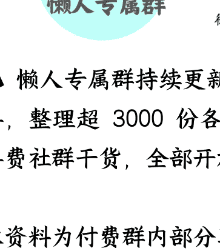

## 透过香港看如何治理台湾？

**250905** 大树乡谈

整理：公众号懒人搜索，<u>懒人专属群</u>独享

懒人微信：lazyhelper

有读者问：我在一家外企工作，同组有一位台湾同事，和他们交流中明显感觉他们认知深受"去中化"教育影响。问如果未来台海难免一战，我们在战胜对岸之后，会用什么方式治理台湾？我们治理香港的经验是否有助于治理台湾？

小镇回答：中国收回香港时，承诺"一国两制"五十年不变，这个承诺不会打破。

在香港治理上也走过弯路，这也是香港这个地方的特殊性，作为英国殖民地，而且长期是东西方交流的中枢节点，是世界最活跃的情报中心之一，人员和社会关系极为复杂，在香港的治理也经过很多的探索，也总结了不少经验。

小镇十年前赴香港工作了一个月，就跟当地各界代表有所沟通，当地一个民间组织的负责人就跟小镇诉苦，认为收回香港后，治理香港过于依赖上层社会，说话间颇有怨气。不过也需要注意，这也是没办法的事情，因为香港虽然1997年回归了，但以当时的情况，香港对中国经济发展和国际化至关重要，还有大量传统力量存在，改革的群众基础并不具备。

典型案例就是首任特首上台后搞房改，想要解决香港市民居住问题，把矛头指向了香港房地产商，要大规模开发闲置土地。这本是善政，但在某些势力的扭曲宣传下，引起了香港有房市民的强烈不满，这一政策宣告失败，之后过了20多年，才重新启动住房改善计划。

回归后的十几年，对香港的治理有很多教训，最大的教训就是群众基础薄弱。虽然说"港人治港"，但失了基层治理，很多事就不好办了，也让某些势力有了操纵空间。比如小镇十年前前去香港，需要经常去香港中联工作，中联的同事就跟小镇说，要从后门进，前门被人堵了，打车的话，也一定要走远点再打车，要不然出租车很可能拒载，还有很多荒唐的事。这就说明群众基础工作是有问题的。尤其对比小镇在澳门的经历，天差地别，在澳门，一听是澳门中联的朋友，吃饭都能打折，特别受尊敬。

### 对香港治理的第一次转折点，小镇认为是2014年，关键是基本法释法

千万不要小瞧了法律，此前的确有人对香港存在不理解，觉得香港的反对派怎么能这样，但小镇有不同想法，小镇觉得其实这些反对者，才是潜在的支持者，因为他们很认真地依据基本法等法律执行，也非常讲道理，本身是热爱香港，这跟那些拿钱闹事的绝不一样。而且香港受英国影响，上流社会影响力非常大，同样是深入群众，也需要因地制宜。在国际上，拿法律说话，任何一个国家都没法质疑。这跟行政命令是截然不同的，也更能令香港各界接受。

2014年释法之后，过去不清晰的地方清晰了，划定了边界，就进一步区分了哪些是希望香港更好、讲道理、提出建设性意见的，哪些是故意闹事的，并且不断压缩后者的空间，后者越闹，他们不想让香港好的本质，就越暴露，越不得人心。

在2014年释法基础上，又有了2019年，那一次闹得特别大，普通市民日常出行都得三思，乱港分子的本质彻底暴露，于是就有了坚决依法打击，把那些跳的欢的破坏分子绳之以法，后面就好办了。

当然在这个过程中，也有很多工作，比如地下情报斗争，国内经济发展，港珠澳大桥等加强香港与内地的联系以及2020年到2022年的同舟共济等等。但总的来说通过2014年、2019年两轮依法治理，就把敌人缩小到了很小的范围，能争取的都争取过来了。

其实还有一条线，也能体会到香港治理思路的变化：那就是香港中联一把手的人选。目前一共8位，基本可以分为三个阶段，分别对应不同时期的不同需求。因为名字比较敏感，所以就只提任期，大家可以自己查下。

- 第一阶段：关系协调阶段
主要协调两个关系，一是回归前后外交关系，二是香港与广东关系。
时间上从1997年到2009年，有两任。
首任姜，从1997年到2002年。他是中国著名的外交官，从1993年开始就任筹备委员会预工委副主任，还是1993年中英会谈中方代表，回归前先是任外交副职，又任驻英国大使，回归后任国社香港分社社长，注意由于香港工作特殊性，这个位置实际就是代表中央，2000年分社改为香港中联，姜一直任职到2002年。
次任高，从2002年到2009年，接替首任姜，负责香港与广东的对接，他之前是广东二把手，更早是广州一把手，这段时间，香港与广东之间的经济合作大增，联系很紧密。

- 第二阶段：高度自治阶段
从2009年至2020年初，有三任。这一时期的中联一把手，跟之前两任不一样，并非业务和地方治理出身，越来越从本系统产生，需要注意从港澳工作本系统产生，工作风格会很不一样，这也是对香港的进一步放权和信任。

比如第三任出身干部管理，第四任出身港澳事务体系，第五任更是香港中联本系统内晋升。比如第四任1990年开始从事港澳工作，第五任1992年从事香港本地工作，中间短暂过渡后，2006年回到香港中联，在内部实现逐级晋升。

但这一阶段也是最被外部力量钻空子的时期，比如2012年、2014年、2019年等大风波，这也促使国家不断调整政策。事实证明，还是需要加强监管和治理，更加主动作为，光靠自治是不行的，因为香港本地力量不足，不足以应对外部挑战，于是就进入了第三阶段，香港中联一把手，重新变为强力干部。

### 第三阶段：全面治理阶段

按照香港立法会前主席曾钰成的说法，他认为当初大家对"一国两制"想得简单了，以为中国富强，港人必然爱国，所以更多采取商讨的方式推动改革。但实践证明，在香港这个复杂、关键的地方，不能只靠商讨，还是要治理。

这一阶段从2020年开始，主要是为了应对2020年到2022年的挑战，更需要加强香港与内地的联系，否则单靠香港本地力量，根本不足以应对冲击。连续三任，都有很丰富的地方治理经验。

- 第六任
任职前已经主政两省，治理过4千万人，任期从2020年1月到2023年1月。这是非常特殊的安排，只有这种地方治理经验极为丰富的，才能应对当时艰巨的挑战，而成功应对2020年到2022年的冲击，不但大大加强了基层治理能力，也让香港人普遍明白国家的重要性，进一步深入改革的基础就具备了。

- 第七任
之后就进入了深层治理阶段，2023年有更多标志性转变，比如主动走出去，到香港基层调研，慰问困难群众，推动新一轮香港住房改善等等。任职前长期在广东任职，有地方治理经验，从2023年到2025年。

- 第八任
同样长期在地方任职，经历过两省四市，2025年至今。

还有个细节变化很值得关注，那就是对香港金融的直接干预。

### 最后，安利小懒的付费群：

懒人专属群（介绍）

懒人专属群持续更新中，已持续运营6年，整理超3000份各类精选付费文章&年费社群干货，全部开放下载。

本资料为付费群内部分享，仅供真实有需要的朋友查阅👀

#### 懒人专属群更新记录：[https://lazy2025.top/blog/record2]
[https://lazy2025.top/blog/record2]

#### 懒人专属群更新记录（需梯子，备用）：[https://lazybook.fun/blog/record2]
[https://lazybook.fun/blog/record2]