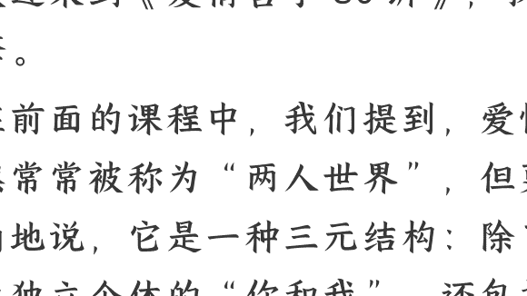
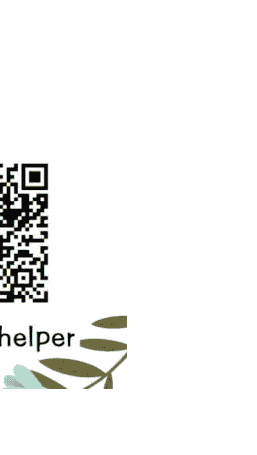

# 04 爱情的实践形态：亲密无间还是亲密有间？

250905 刘擎

整理：公众号懒人搜索，懒人专属群独享

懒人微信：lazyhelper

欢迎来到《爱情哲学 30 讲》，我是刘擎。

在前面的课程中，我们提到，爱情虽然常常被称为“两人世界”，但更准确地说，它是一种三元结构：除了作为独立个体的“你和我”，还包括一个共同生成的精神生命“我们”。这就带来一个现实的困惑：爱情生活究竟应该追求“亲密无间”，还是要保持“亲密有间”？

常见的回答往往是“既要保持亲密，也要保持距离”。这种回答听上去周全，却往往流于表面。要真正理解其中的张力，我们必须从哲学视角出发，探究这一问题的根源。这也就是我们这一讲的任务。

## 爱情的双重性

“亲密无间”还是“亲密有间”？出现这种纠结的原因在于，爱情本身具有双重性。也就是说，我既属于自己，也属于“我们”。恋人之间往往会说两种语言：一种是“我们的语言”，体现彼此的依赖；另一种是“我的语言”，突出个体自主。这使得爱情既复杂又充满张力。

在实际生活中，这种双重性表现为两种主要的关系模式：一是以个体独立为前提的“交易互惠模式”；二是以共同体的成长为核心的“融合共生模式”。

下面我将分别展开说明，你可以注意听听它们的区别。

### 1. 互惠模式：需求交换与功能性合作

先说互惠模式。

这是一种基于相互满足需求的结构性关系模式，它的维系和发展主要依赖于双方都能付出与回报，比如分担生活的事务和开支、身心关怀和情绪支持、共享资源等等。

这种模式的基本假设是，人在任何关系中都具有独立性，爱情中也是如此。所以，在交易互惠模式中，亲密关系是一种特殊的合作联盟。当双方的付出和收益大致对等，尤其在主观心理上感觉公平合理时，关系才会相对稳定。一旦任何一方主观感受自己付出过多而回报不足，均衡就被打破，需要启动协调机制，达成新的平衡。

例如，如果情侣中总是一方主动联系、安排约会、表达关心，而另一方习惯性地被动接受，久而久之，主动的一方可能因付出过多而感到“心理不平衡”，要么开始减少投入，要么明确要求对方也能积极付出。如果这种协调机制失灵，造成更长期、更严重的失衡，交易互惠模式就会陷入崩溃，关系就可能破裂。

听到这里，你可能已经发现，交易互惠模式的运作逻辑主要服从经济学的公平交易原则，既有稳定性，又有脆弱性。稳定的关键在于“供求的相对均衡”，而脆弱则来源于“供求失衡”。

### 2. 共生模式：生命融合与身份认同

现在再来看共生模式。

如果说互惠模式关注的是“你和我作为个体之间的功能性交换”，那“融合共生”模式就是“我们”这个精神生命的存在方式。

前面讲过，爱情是个体间的深度交往，深到你与我之间的个体边界被消融，形成一个全新的融合生命——“我们”。这个融合的“我们”，要依赖双方不断的共同滋养才能持续生长。因此，“我们”在你与我的融合中诞生，也在共同的滋养中才能生存，这就是“融合共生”。

其主要特征是，第一是“共同福祉”，第二是“自主性限制”。

“共同福祉”，就是真正意义上的“同甘共苦”。发生在所爱之人身上的，几乎所有好事和坏事，就等同于发生在你自己身上，彼此都能深刻地感受到对方的快乐和痛苦。所以，真正相爱的伴侣之间，往往能生成强烈的情感共鸣，彼此由衷而自然地尊重、关怀和支持对方。

那“自主性限制”是什么呢？从字面上说，它是指个体自愿地让渡部分的自主性，服从于“我们”这个共同体的主权。这个主权的基础来自于哪里？它源于一种平等的、相互尊重的商谈伦理。简单地说，遇到事情，你不能再像单身的时候那样，自己说了算，而是需要和伴侣共同协商、达成共识。比如，你想去云南旅游，可你的伴侣特别想去埃及，这就需要两人协商讨论了。

至于现实生活中哪些事情需要共同决定，不同的伴侣存在很大差异。有些关系紧密的伴侣甚至对每一顿饭的安排都要共同商议决定，而另外一些伴侣只涉及较为重要的事项，比如在哪里居住，是否要更换工作等等。

### 3. 两种模式的关系

到这里，我们已经了解了这两种基本模式。你可能想问，这对于我理解亲密关系有什么用呢？我想，至少有三个作用:

首先，它为我们提供了一个判断亲密关系属性的参考。

对爱情而言，这两种模式不是平行并列的。融合模式是爱情本质的具象体现，遵循尊重、奉献与爱的伦理原则；而交易互惠模式，是爱情的派生性的功能，依照公平交易的经济学原理。

在我看来，在一段亲密关系中，融合共生模式在多大程度上占主导地位，基本上决定了这一关系中“爱情”的浓度。

如果一种关系逐渐从“融合共生”主导，逐渐演变为“交易互惠”主导，甚至完全遵循交易互惠的模式运行，那么这段关系就变成了搭伙合作关系。这时，这段关系也有可能是友善和稳定的，但是离爱情越来越远。

其次，理解这两种模式，也让我们看清：亲密关系是一个动态化的过程。爱情不是在“亲密有间”与“亲密无间”之中做单选题，也不是简单的“既要又要”，而是在关系里找到适合你们的动态平衡。

为了方便理解，我们可以这样想象：想象这里有一个光谱。在光谱的最左端是完全的融合共生模式，也就是“纯爱状态”；而最右端则是彻底的交易互惠模式，俗称“搭伙状态”。大部分伴侣实际的状态，是处在这两个端点之间，位置越是偏左，关系中的爱情比重就越高。

不过，一段亲密关系在两极之间的位置，可能会随着时间而变化，许多伴侣就是从“纯爱”逐渐转向“搭伙合作”。当然，也有可能反过来，比如早年间有那些“先结婚后恋爱”的伴侣，在搭伙过日子的过程中逐渐培养出深厚的感情。

可能有同学要问了：在这个光谱中，处在什么位置才最恰当适宜呢？其实这个问题并没有统一标准，最重要的是，你们双方保持同频一致。

最后，这两种模式的分析，还有第三个作用：它能帮你在遇到冲突的时候看清楚，你们的关系到底处在什么状态。

虽然刚才我们把两种模式想象成光谱的两端，这是分析型的做法。但在实践中，它们往往交织混合在一起，并没有清晰明确的界限。比如，伴侣双方都用心为对方挑选生日礼物，这可以被视看作满足对方需求的交易互惠行动，但同时，将伴侣的快乐当作你自己的快乐，这又是一种“融合共生”模式的操作。这两种模式也可以是相互促进的。

不过，当个体利益与“我们”这个整体的福祉发生冲突时，分辨两种模式就变得很有必要了，它能帮你看清楚：你们的关系到底处在什么状态，“我们”这个共同体究竟有多牢固。

讲一个我在访谈中遇到的例子。一对三十多岁的夫妇面临着一次重大的人生选择：男方事业有成，眼下正有一个去海外工作并升职的机会，差不多同时，女方也获得了去著名商学院进修的机会，而他们的孩子刚刚开始上学。如果丈夫出国，妻子将不得不独自承担更多家务责任，而自己的学业也会不堪重负。经过协商，丈夫决定放弃出国。他的理由是，从家庭整体的角度看，现在应该优先考虑妻子的当前事业发展。

这种选择在单纯的交易互惠模式中，是一次失衡的交易，但如果把“我们”这个共同体的福祉置于优先地位，这种选择就完全合理。

做出这个决定后，妻子感谢了丈夫的无私，而丈夫的回应是：我现在最大的私心，就是要为我们这个家好。而你一直这样做。

这个选择表明，这对夫妇的关系是以融合共生模式为主导的，而这个决定本身，也会进一步强化他们的融合共生。

一般而言，融合共生模式主导的关系，在面对外部变迁和内部困境时，可能会展现出更强的韧性，因为双方更看重“我们”的共同福祉，更容易协调和化解互惠模式中的“斤斤计较”。这背后反映出的，是深厚的生命联结和身份认同。如果亲密关系是由共生模式主导的，即使在痛苦、误解或冲突中，双方也更愿意为了“我们”这个生命共同体而坚持和努力，一起寻找解决方案。

回到最开始的问题：我们应该追求“亲密无间”还是“亲密有间”？其实这两种状态分别对应了我们讲述的两种模式：融合共生和交易互惠。

那么，面对一个特定的情景，你应该启动哪种模式呢？真实的答案是，你不用操心，你不用启动模式，模式会启动你！也就是说，面对特定的情景，你们亲密关系的状态会自行启动相应的模式。

但是，在这个情景中，你可以在反思的意义上，追问几个具体的问题。比如，你会思考伴侣作出决定背后的动机吗？伴侣的悲欢，有多程度上成为了你自己的悲欢？发生冲突的时候，你们计算的是个人得失，还是“我们”的共同福祉？

如果有这种自觉回顾和反思的意识，你就有可能和伴侣深入地思考和沟通，一起分析和改善亲密关系的状况。这也是学习这门课可能有的实用意义吧。

### 总结

好了，让我们总结一下:

爱情有两种实践模式。互惠模式像做生意，讲究付出与回报的平衡；而共生模式像一个共同体，你的快乐就是我的快乐，但同时，你和我的选择，也受制于“我们”的共同利益。

大多数关系都混合了这两种模式，不过整体来说，一段亲密关系中，融合共生模式越占据主导地位，关系中的“爱情”浓度就越高，在面对外部变迁和内部困境时，双方也更有可能展现出更强的韧性。

### 思考题

最后，留一道思考题给你:

你想想你自己，或者你身边的一对伴侣，从他们的互动中，你能看出主导他们关系的是哪种模式吗？

我是刘擎，我们下节课再见。

最后，安利小懒的付费群：

懒人专属群（介绍）

📑 懒人专属群持续更新中，已持续运营 6 年，整理超 3000 份各类精选付费文章&年费社群干货，全部开放下载。

本资料为付费群内部分享，仅供真实有需要的朋友查阅 🙎‍♂️

懒人专属群更新记录：[https://lazy2025.top/blog/record2](https://lazy2025.top/blog/record2)

懒人专属群更新记录（需梯子，备用）: [https://lazybook.fun/blog/record2](https://lazybook.fun/blog/record2)