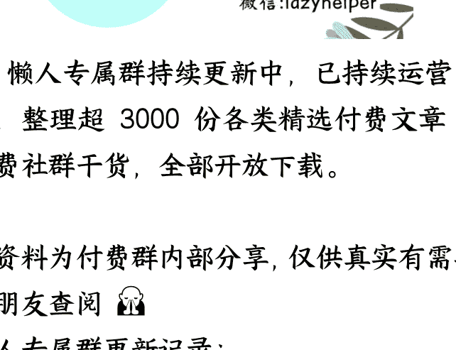

## **艰难抉择的印尼**

250905 猫哥  
整理：公众号懒人搜索，  
懒人专属群独享  
懒人微信：lazyhelper  

抗战胜利 80 周年阅兵中，有个事情值得注意，就是印尼总统普拉博沃，原先确定参加阅兵，到了 9 月 1 日，又因故取消了行程。

就在大家以为，普拉博沃来不了的时候，9 月 3 日凌晨，他压轴飞到北京。

普拉博沃的犹豫，正是激烈地缘政治斗争的缩影。印尼国内局势，近期很不太平。

8 月初，印尼出台了一项颇有争议的政策，要每月给国会议员们多达 2.17 万人民币的住房津贴，要知道，普通印尼人的月收入，只有 1000 人民币出头。

印尼民众颇为不满，街头抗议开始出现。

在 8 月 28 日的抗议中，一名网约车司机，被警方的装甲车碾压致死，其实从视频来看，警方装甲车不是故意的，属于来不及刹车。

但解释是苍白的，大家不想听。

长期以来，印尼的裙带关系、寡头垄断等问题严重，尤其是对普拉博沃，许多人持怀疑态度。主要原因，是普拉博沃的背景。

1965 年 9 月 30 日，印尼发生了政变，以总统卫队的翁东为首，但很快，军头苏哈托平定了政变，借着这份功劳，他架空了开国总统苏加诺。

夺权后的苏哈托，抹黑华人是政变的幕后黑手，对华人进行了血腥大屠杀，并开启长达 32 年的独裁统治，直到 1997 年被迫下台。

而普拉博沃，就是苏哈托的女婿。

所以，不少人就担心，他会回到苏哈托的军政府道路，网约车司机不幸身亡，加之种种社会问题，导致对普拉博沃的不满如火山般爆发。

暴乱，迅速蔓延到印尼各地。大部分媒体，都会告诉你上述内容，但不得不说，以上虽然是真相，却并非全部真相。

没错，印尼存在贫富差距巨大、裙带关系严重等问题，还有军头独裁历史，但这一切，是谁导致的呢？

当年苏哈托屠杀华人，不是无缘无故的。

苏加诺年轻时参加独立运动，就是受了孙中山的影响，后来又和周总理交好，在著名的“万隆会议”上，周总理和苏加诺相谈甚欢。

这就使得，他和中国的关系不错，对华人不差。

60 年代是冷战高潮，美国能容忍一个亲华的印尼存在？

当然不可能。

正是得益于 CIA 的扶持，苏哈托才能上位，而今天印尼的社会问题，几乎都源于苏哈托时代。

某些人只讲印尼存在的问题，却不告诉你，这些问题与美国的渊源，显然不客观。

作为苏哈托的女婿，普拉博沃天然具有亲美的可能性。

但这几年，普拉博和前总统佐科·维多多走得很近，两人已经结盟。

潮水般涌现，视频的内容无一例外，全部指向普拉博沃以及苏哈托。对于苏哈托背后的 CIA，对于苏哈托屠华的来龙去脉，则统统避而不谈。

这场景，是不是有点像去年的孟加拉国？

在巨大压力下，普拉博沃一度取消了出席阅兵的决定，中方也表示理解。然而最后关头，普拉博沃还是飞到了北京，我们无法得知他是怎样改变主意。

抗战阅兵的政治意义，是明摆着的。在这个中美斗争的关键时刻，同意出席抗战阅兵的人，等于半站队。在这种时刻，不少国家进行了观望式操作，力求两边不得罪。

比如韩国，李在明婉拒出席阅兵的邀请，派了二号人物禹元植过来，既让中国满意，也不至于激怒美国。

这种情况下，如果普拉博沃也做出类似的操作，我们其实可以理解，但他没有，而是自己来了。

这就意味着，普拉博沃要继承佐科的外交政策，甚至可能更进一步，在未来几年，深化对华合作。

所以，我们给了普拉博沃很高的礼遇。

大合影时，普拉博沃被安排在第一排，普京的右手，而普京的左边，就是 C 位。可以预料到，普拉博沃此行，会激怒美国。

印尼不是一般的国家，美国印尼，“印太战略”的施行会遇到很大困难，因为印尼的地理位置，刚好处在印度洋与太平洋的结合部。

马六甲海峡、龙目海峡、望加锡海峡、巽他海峡，又都是区域内的咽喉要道。

美国不会轻易放过普拉博沃。

很多人奇怪，明明特朗普裁掉了“国际开发署”，怎么还有发起暴乱的能力。这是因为，美国负责搞暴乱的机构，不止一个，还有民主基金会、福特基金会等多个组织。

此外，欧洲对于输出“颜色革命”的热情是很高的，尤其是对原殖民地国家。“国际开发署”被裁掉后，它的市场份额，实际上被欧洲抢占了。

巧了，印尼的原宗主国荷兰，是一个意识形态上十分狂热的国家，白左程度极高，再加上印尼内鬼的配合，掀起一场风浪并不难。

除了“颜色革命”，美国对付印尼的手段，还有高关税。

特朗普一直威胁，要对印尼实施高关税，这对印尼经济不是个好消息。美国市场，是印尼最大的贸易顺差来源地，2024 年顺差 168.4 亿美元。如果美国对印尼实施高关税政策，会严重打击出口。

2025 年上半年，印尼 GDP 增长率在 5% 上下，这个数字虽然不差，但普拉博沃在大选前曾多次承诺，要将印尼 GDP 增长率提高到 8%。

要是美国一记重拳下来，别说 8%，能不能保住 5%，都是一个问题，届时，普拉博沃的承诺，会变成反对派批评他的绝佳素材。

总之，普拉博沃飞到北京的勇气虽然可嘉，但这一关没那么容易过去。如有必要，我们得适时拉一把。不能再允许出现朴槿惠那样的事情，如果总是前脚来参加阅兵，后脚就被美国推翻，下次大家就不敢来了。

# 最后，安利小懒的付费群：
懒人专属群（介绍）  

  

> 🖥️ 懒人专属群持续更新中，已持续运营 6 年，整理超 3000 份各类精选付费文章 &  
> 年费社群干货，全部开放下载。

> 本资料为付费群内部分享，仅供真实有需要的朋友查阅 👤  

**懒人专属群更新记录：**  
https://lazy2025.top/blog/record2  
**懒人专属群更新记录（需梯子，备用）:**  
https://lazybook.fun/blog/record2