# 我如何一周跑通 B 站好物实操闭环，一个视频变现 1000+

**250905 生财精华**

[公众号懒人搜索，懒人专属群](https://...)

**懒人微信：**lazyhelper

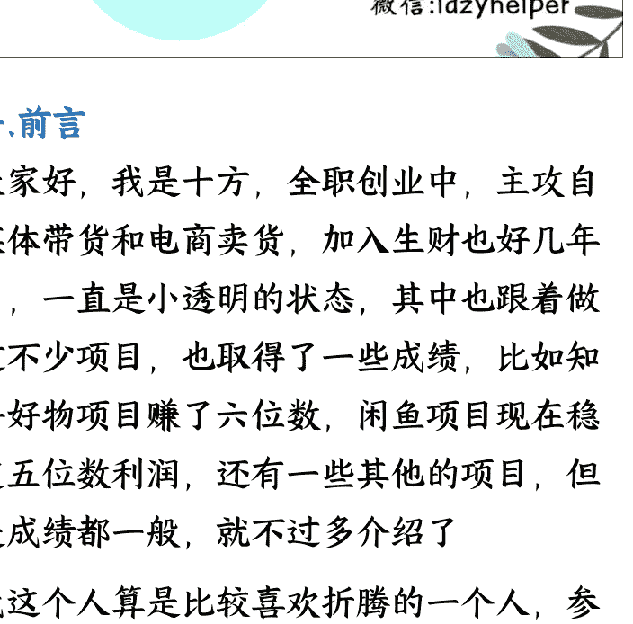

## 一、前言

大家好，我是十方，全职创业中，主攻自媒体带货和电商卖货，加入生财也好几年了，一直是小透明的状态，其中也跟着做过不少项目，也取得了一些成绩，比如知乎好物项目赚了六位数，闲鱼项目现在稳定五位数利润，还有一些其他的项目，但是成绩都一般，就不过多介绍了

我这个人算是比较喜欢折腾的一个人，参加大大小小项目估计有十多次了，各种项目都有尝试过，数不清了，你能想到的大平台，我都有做过，前段时间的 YouTube 深海圈和海外 AI 产品深海圈也都参加了，但是项目都是比较长期的，都需要投入大部分精力才有可能出结果，但是我现在阶段可能经济压力比较大，所以都佛系在做，还并未变现

## 二、成绩

从看到亦仁发布 B 站好物的超级标开始，我就知道缓解我经济压力的项目来了，到后来家蒙老哥的深海圈，我也是毫不犹豫的加入了，这是我加入的第三个深海圈项目，但是我也知道我肯定能做好的一个项目，因为在我看来，不管是哪个平台，好物带货项目都是一脉相承的，而且我之前做知乎好物有成功的经验

果然从我 8 月 16 号发布的第一个长视频开始，到 24 号各个平台累积的变现大概有 1000 多，包括知乎和 B 站还有抖音等平台，所以大家做完视频之后其实各个平台都可以发布，不要浪费了做视频的精力，而且之后可以做全平台的 IP

数据的话 B 站一万播放，商品曝光有 7.6 万，商品点击量 2600+，成交了 21 单，GMV 有 3W 多，收入有 900 多块，到现在浏览量还在涨，还一直在出单，而且这还只是一个视频的收入！！！

### 交易总览

| 指标 | 周期/类型 | 金额/数值 | 变化 |
| :--- | :--- | :--- | :--- |
| **自然周期** | 8月16日 – 8月24日 | ▼ | - |
| **成交金额** | ¥ 30,078.78 | +151813.03% |
| **成交单量** | 21 | +600% |
| **预估佣金** | ¥ 972.31 | +54524.16% |
| **非直播** | ¥ 0 - ¥ 30,078.78 | +151813.03% |

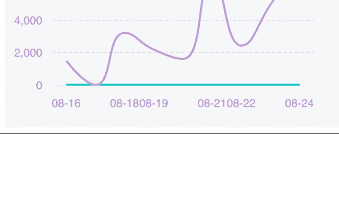

### 核心大屏数据

播放量: 1 万 \| 涨粉：51 \| 取关：0
点赞: 224 \| 弹幕：4 \| 评论: 220
分享: 36 \| 收藏: 151 \| 投币: 87

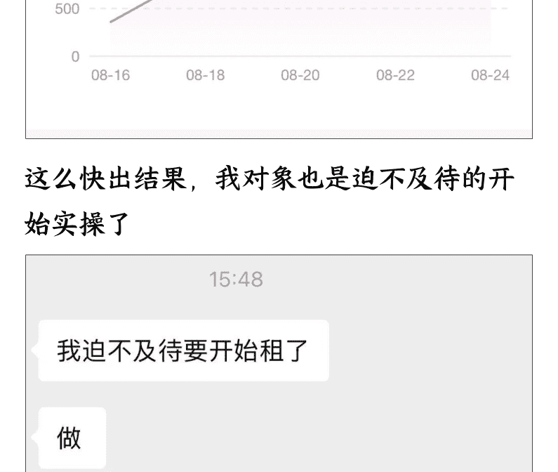

**这么快出结果，我对象也是迫不及待的开始实操了**

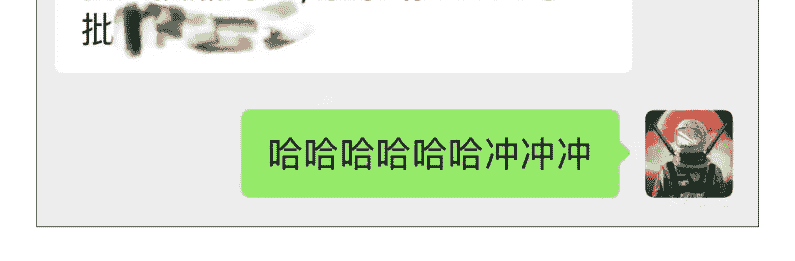

## 三、准备阶段

### 1. 开通账号

**更新：涨粉方法**

我看很多圈友都在问涨粉方法，其实还有个方法，就是 B 站搜互粉，然后互相关注，一天关注几十个或者上百个，账号异常不用怕，等过几个小时就会正常了，勤快的话两三天就能达到 1000 粉，实际经验我有个账号大概关注了 1300 多个人，就涨到 1000 粉了

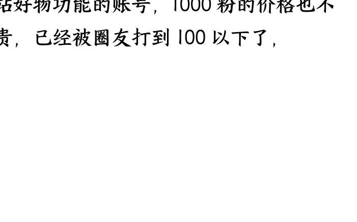

准备阶段比较简单，首先就是有个开通 B 站好物功能的账号，1000 粉的价格也不贵，已经被圈友打到 100 以下了。

> ¥90.00
> 已被接收
> 微信转账
>
> 安排了 好了我再跟你说
>
> OK
>
> 我的 - 创作中心 - 收益中心 - 悬赏带货
>
> 里面就是
>
> 可以去开通了
>
> > ¥90.00
> > 已收款
> > 微信转账
>
> OK

### 2. 开通好物功能

到了一千粉，实名认证之后就可以直接开通好物功能了

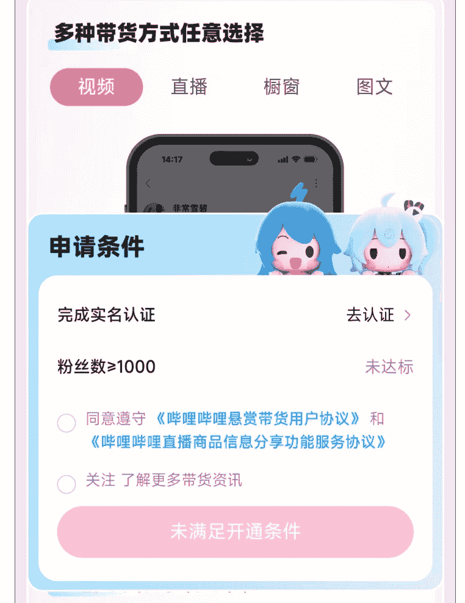

### 3. 三大返利平台配置

开通好物功能之后，就需要绑定淘宝，京东，拼多多三家的返佣功能，即淘宝联盟，京粉，多多进宝等三个平台的返佣功能，这样准备阶段基本就完成了，以上准备阶段比较简单，我就说的简短，也有其他圈友发了详细流程，大家可以去参考

### PID 管理

- [x] - 手动修改 PID
- [ ] - 淘宝获取

**【淘宝获取】（推荐路径）**

点击【淘宝获取】进入淘联页面，填写完整信息后可自动获取 PID 到该页面

### 【手动获取PID】

- Step1: 点击登录[淘宝联盟](#)
- Step2：进入“推广管理”，“新增媒体备案”后，创建新的推广位并复制 PID
- Step3：在上方输入框粘贴新的 PID，最后点击“确认"

更多详情可查看：[淘宝联盟 PID 绑定和修改指南](#)

收入查看和提现请前往淘宝联盟 App，使用绑定的淘宝帐号查看并提现

## 四、实施阶段

### 1. 寻找对标和选品

#### 1.1 榜单

第一种就是开通好物之后看榜单，榜单里藏着大机会，我就是刷了榜单之后，来了灵感，其实也不算是啥灵感，就是自己熟悉一点的，佣金高一点，销量高一点的产品，那绝对是可以带的

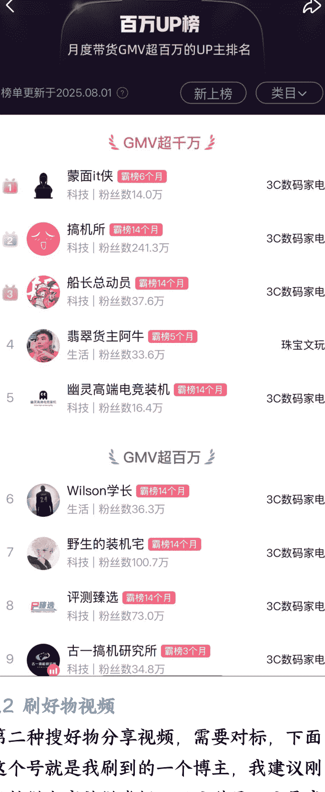

#### 1.2 刷好物视频

第二种搜好物分享视频，需要对标，下面这个号就是我刷到的一个博主，我建议刚开始做大家就做类似下面这种号，这是我之前刷到一类账号类型，这种账号就是专门做好物分享的账号，而且看出单数据也非常不错，小店销售 9000+ 单，而且这种是啥都能带的，什么佣金高就能带啥

**用自己露脸，可以直接 AI 配音，这样后期还能做矩阵，非常适合新手开始做好物**

- Item 1:
> #### **播放全部**
> **Item 1**: [图片]
> - 【买前必看】2025 年 8 月行李箱选购指南，学生党/旅行/出差行李箱推...
> - 发布时间：23 小时前
> - 播放量：335
> - 评论数：3
> ---
> **Item 2**: [图片]
> - 【闭眼抄作业！】2025 年七夕送女朋友/男朋友礼物推荐，预算 100-30...
> - 发布时间：3 天前
> - 播放量：7620
> - 评论数：103
> ---
> **Item 3**: [图片]
> - 【闭眼可入】2025 年 8 月值得买的山地自行车选购攻略 | 入门|进阶|永久...
> - 发布时间：8 月 15 日
> - 播放量：3260
> - 评论数：52
> ---
> **Item 4**: [图片]
> - 【买前必看】2025 年 8 月羽毛球鞋选购指南 | 100~1000 元价位|新手/进...
> - 发布时间：8 月 12 日
> - 播放量：2279
> - 评论数：13
> ---
> **Item 5**: [图片]
> - 【买前必看】2025 年 8 月钓鱼竿选购全攻略：新手入门买什么牌子鱼竿合...
> - 发布时间：8 月 8 日
> - 播放量：2236
> - 评论数：36
> ---
> **Item 6**: [图片]
> - 【闭眼可入】2025 年 8 月电动牙刷选购终极指南：电动牙刷推荐什么牌...
> - 发布时间：8 月 7 日
> - 播放量：6658
> - 评论数：14
> ---
> **Item 7**: [图片]
> - 【选购攻略】2025 年 8 月电动车推荐，买电动车哪个牌子好？雅迪、新...
> - 发布时间：8 月 4 日
> - 播放量：1.5 万
> - 评论数：101

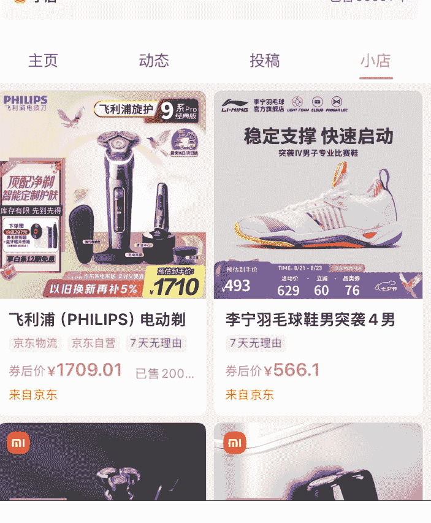

#### 1.3 参考知乎高赞文章

第三种就是我自己在用的方法，我觉得是非常好的一个方法，这里也分享给大家，知乎好物毕竟火了好几年，知乎里面的带货文章那可是数不胜数，完全就是个资源宝库，随便搜电视，冰箱等等产品，都有一堆的带货文章，想做哪个品类，就直接搜就行，寻找这些高赞的文章内容，让 AI 帮忙提取以及总结这些文章的内容，或者是改写里面的内容然后变成自己视频的文案，这效率直接大大提升，但是不建议完全去抄别人的，带货想要做大做强还是需要建立 IP，有自己的内容，我现在就是在抄我自己以前写的文章

**85 寸电视推荐 2025(8 月)，85 寸电视选购攻略；高性价比电视推荐**

橙橙橙橙：让大家知道买**电视**的时候，钱花在哪里了！正文开始：为保持...

**75 寸电视推荐 2025(8 月)，75 寸电视性价比；电视选购指南**

橙橙橙橙：价位的**电视**，哪些配置更好 3.同配置的产品中，哪些更便宜。...

**最新讨论**
**更多** >

**2025 年最值得购买的电视有哪些？**
2.8 万浏览 · 30 回答 · 44 关注

> [写回答](link)
>
> 泡泡数码视频博客：由于我们售出了 40 多台设备，因此获得了十几万元的资金，用于购买今年的 20...

**2025 年电视选购终极指南**|55 寸 65 寸 75 寸 85 寸**电视**怎么选|TCL 海信小米索尼**电视**推荐！
雪雨墨：这篇文章雨墨从 **电视机**各大主流品牌到不同尺寸选购，再到避坑...

### 2.拍视频

找完对标然后选完品类之后就是拍视频，拍视频有三个步骤

#### 2.1 文案

第一个就是文案，文案是比较重要的一部分，比较快的方式就是采用上面第三个方法，直接去参考其他人的高赞文章，高赞就说明这个内容是非常不错的，然后利用

AI 去总结，然后自己根据自己的风格再去改改就行，或者直接用

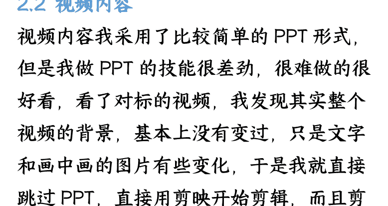

#### 2.2 视频内容

视频内容我采用了比较简单的 PPT 形式，但是我做 PPT 的技能很差劲，很难做的很好看，看了对标的视频，我发现其实整个视频的背景，基本上没有变过，只是文字和画中画的图片有些变化，于是我就直接跳过 PPT，直接用剪映开始剪辑，而且剪映中的文字形式也很多

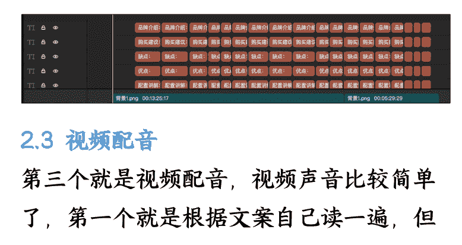

下面就是我剪出来的视频草稿，背景基本不变，只是文字有变化，这样就非常简单快速

#### 2.3 视频配音

第三个就是视频配音，视频声音比较简单了，第一个就是根据文案自己读一遍，但是这个比较费时间，十多分钟的文案我读了大概两个小时，第二种就是直接用抖音配音，这个基本不费时间

## 五、发布与维护：细节决定出单量

### 1、发布

**视频拍完之后就是发布了，发布这里有个点要注意，就是你文案里面的产品，你都需要加入到选品车里，之后在评论区放链接一定要分行，像下面这种，一个产品一行，要不然就是所有产品全部堆在一起了，用户就不好去点击单个链接**

> [置顶]2024 年性价比高的羽毛球拍推荐!
>
> **的幸均衡之刃**→链接: @的幸 (DRACAENA) 均衡之刃超轻耐打全碳素纤维羽毛球进攻耐打初学者新手耐用单拍 皓月白 成品拍
>
> **道特 NEO70**→链接: @道特 (dooot) NEO70 羽毛球拍全碳素纤维超轻 5U 成人初中级进阶耐用耐打型已穿线【全碳素单支装】红白蓝 24 磅(默认)
>
> **川崎 3000i** →链接：@川崎 KAWASAKI 全碳素羽毛球拍单拍 NAVIGATOR3300i (已穿线 22 磅)
>
> **天斧 AXSM**→链接：@YONEX 尤尼克斯羽毛球拍全碳素单拍约 73 克天斧 AXSM 轻量已穿线附手胶
>
> **挑战者 9500D**→链接：@威克多 (VICTOR) 羽毛球拍胜利单拍全碳素进攻型经典 CHA-9500C/D 红色 4U 穿线
>
> **李宁雷霆小钢炮**→链接：@李宁羽毛球拍雷霆小钢炮 4U 单拍已穿线黑色 AYPT307
>
> **威克多胜利铁锤**→链接：@VICTOR 威克多羽毛球拍胜利铁锤单拍 TK-HMRL 珍珠白 5U 已穿线 25 磅附手胶
>
> **天斧 21S**→链接：@YONEX/尤尼克斯 天斧系列 ASTROX 11 POWER 碳素轻量羽毛球拍 礼盒套装 粉红/蓝色 (成品拍) 4U5

### 2、维护评论区

**视频发完之后评论一定要全都回复，而且给用户的回复里都加你给他建议的产品链接，这样说不定用户就点击链接下单了**

公众号懒人搜索，懒人专属群分享

### 1. 不自信

第一个内耗的点在于看到别人的视频那么好，会担心自己视频做不好怎么办，没人看怎么办，但是我看到深海圈家蒙老哥给的案例，那么垃圾的内容都能出单，一下就治好了这个内耗

### 2. 无从下手

第二个就是无从下手的内耗，会一直拖，其实现在整个流程下来，我觉得最麻烦也是最重要的一个点在于收集素材和产品信息，如果想要做好一个内容，这个阶段是非常费时间的，做完之后，我现在毫不夸张的说，我对我现在做的这个产品了解的能比官方客服还全面

### 3. 胆怯

第三个就是对做视频会有胆怯的心理，因为以前写文章还好，写完之后就直接发布了，视频的话又要写文案，写脚本，又要拍，又要做 PPT，又要剪辑啥的，就觉得非常麻烦，于是我直接一步到位，全都用剪辑的方法来解决，文案直接参考以前的文章，脚本不做创新，直接参考对标账号的节奏，PPT 和剪辑直接放一块来做，节约时间

## 七、后续放大/发展方向

我是比较看好 B 站带货这个项目的，或者说是比较看好好物带货这个项目的，不管以后是写文章，还是拍视频，或者出现什么 A 站，C 站的新平台，其原理都是一脉相承的，本质就是做一个销售，介绍产品，卖出产品获得佣金，最后就是做成 IP，除了赚佣金还能接商单

### 八、送给想尝试的朋友一句话

淦就完了！！！

最后，安利小懒的付费群：

**懒人专属群** (介绍)

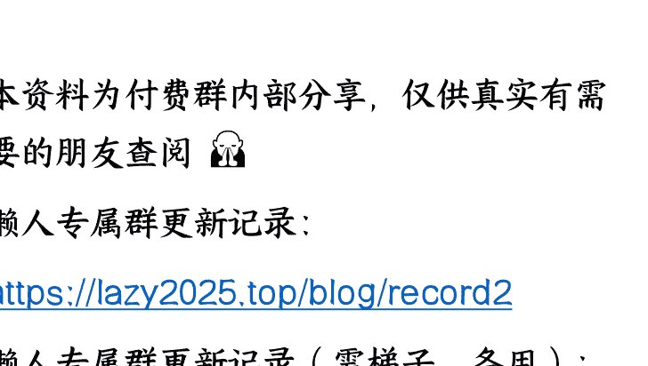

懒人专属群持续更新中，已持续运营 6 年，整理超 3000 份各类精选付费文章 & 年费社群干货，全部开放下载。

本资料为付费群内部分享，仅供真实有需要的朋友查阅 🙆

懒人专属群更新记录：
[https://lazy2025.top/blog/record2](https://lazy2025.top/blog/record2)

懒人专属群更新记录（需梯子，备用）：
[https://lazybook.fun/blog/record2](https://lazybook.fun/blog/record2)