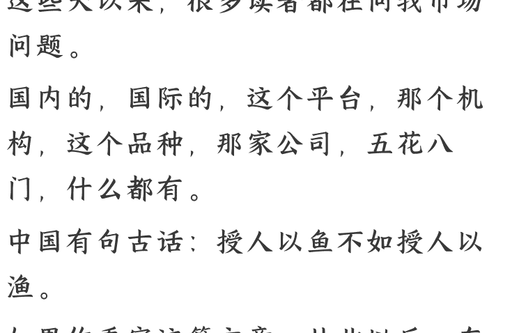

# 投资，我还来得及么？

250907 记忆承载

整理：公众号懒人搜索，[懒人专属群](lazyhelper)独享

懒人微信：lazyhelper

西风历史付费文合集和后续更新见专属群内分享

这些天以来，很多读者都在问我市场问题。

国内的，国际的，这个平台，那个机构，这个品种，那家公司，五花八门，什么都有。

中国有句古话：授人以鱼不如授人以渔。

如果你看完这篇文章，从此以后，在市场的任何阶段都胸有成竹，远比你回回来问我，对你自己而言，强得多。

全文两万字，共七个部分，准确讲是七个阶段，文中多处有链接，俗称画中画，文中文，阅读时留心莫错过。本文下面的留言，每一条我都会看到。

以下进入正文：

我们今天讲什么话题呢？讲交易者的七个阶段。

## 交易者的第一层：他认为今天买了明天就会涨是最重要的。

这个市面上绝大多数的金融消费者，都处在这个位置。他们最关心的就是明天开盘后，什么会涨，哪个板块，具体哪个品种。然后他们每天就在问，这个大佬说了了，他看好什么，那个大佬说了，他看衰什么。而且他们的观测样本周期是非常有意思的，是要由着他们自己的时间和节奏。因为他们大多数人都是要上班的。我们假如一个市场非连续，一天交易时间是 10 小时，他们上班摸鱼的观测时间是 2 小时。

他们要求，机会就得出现在这 2 小时。所以他们每天都在问，哪个消息灵通人士行行好，告诉我，这 2 小时有什么机会。你仔细想想看，他们的行为是什么？其实就是当年流行的顺风车。

十年前那个年代，有很多白领，上下班的时候打开顺风车，顺路捎个人，挣个油费。所以我说，处在第一层的金融消费者们，他们实际上把金融市场，当成了滴滴打车。你看，我的汽车有闲置时间，那么能否顺路捎个人，发挥下价值，挣俩钱。那同理，我的资金有闲置，外加上班摸鱼的闲置时间，是不是也可以顺路坐个轿子，被主力抬一抬。

很多长期处在第一层的交易者，时间久了，反复被割韭菜，最常遇到的两种情况。

第一种情况下，他 100 买到了，买到之后也的确涨了，涨到了比如 130，这个过程中，他都是很开心的，因为一直浮盈。但是，浮盈不等于盈利，为什么呢？因为他不是 130 卖出的，他是某一天掉头向下，跌到 80 才卖掉。他曾经自以为盈利过 30，但他最后实际上亏了 20。

第二种情况下，他 100 买到了，他也吸取教训了，这回他 110 就卖掉了，落袋为安。然后呢？然后涨到了 1100......于是他痛苦的不能自己，直跺脚，自己怎么踏空了。

终于忍不住又买了进去，结果后来又跌回 110……大部分人在这样的事情重复很多次之后精神崩溃，退出市场，或者不甘心退出，实际上沦落为赌徒。就是他认为他在投资，实际上他就是在赌博。

## **交易者的第二层：会买的是徒弟，会卖的是师父。**

到了这个层面，金融消费者就升级了，因为他愿意花更多时间学习了嘛。他开始思考，我不能光听所谓的机构，所谓的市场大佬们怎么讲。因为当人家知道我们散户这么轻信人的时候，人家也会故意引导市场，俗称让我们去抬轿子。我自己也得去研究基本面，研究成交曲线。比如我买的这个东西，是不是基本面向好的？俗称长期趋势是向上还是向下，如果长期趋势向上，我做多就更安全，暂时跌下去，我也不会被套很久，也有机会逃。

反之，长期趋势向下，我做空就更安全，暂时涨上去，我也不会被套很久，也有机会平。再比如，我买的这个位置是支撑位，我卖的这个位置是阻力位，那就会留给我更多的思考时间。所谓的支撑，就是说，它撑住的概率要大于撑不住；所谓的阻力，就是说，它挡住的概率要大于挡不住。

> 次数多了你就会发现概率起作用，十次里面有三次没撑住那就有七次能撑住。

> 至于它能撑住多久，那要看它是几日的支撑，几周的支撑，几月的支撑。于是它实际上在给你争取什么？争取思考的时间。即便你买错了，卖错了，买在支撑，卖在阻力，也给你争取了多一点的思考时间。它撑住的那会儿，你还可以再多观察观察。

除此之外，还有很多很多的数据，比如场外的资金有多少，场内的资金里面主要是主力还是散户。主力的平均持仓位在哪里，散户的平均持仓位在哪里。

> 这些都会影响后续的趋势。你越研究，就会发现这里面知识越多。

人的知识是一个圆，只有你半径足够大了，圆周才会足够大，你接触到的未知的世界才会足够大。所以经过多年的研究实践，你终于变成了一个散户中的佼佼者。你交易了 20 年，从 100 万炒到了 99 万。千万不要笑，尤其是那种新手保护期的，最喜欢笑话老散户。任何一个市场，你在新手保护期里赚了三五倍都不稀奇，你 20 年后，还能保住大部分本金的，其实每一个都值得尊重。你以为那个从 100 万炒到 99 万的大爷是猴子派来搞笑的？他的金融知识是非常丰富的，在散户里面，是接近于机构的。他可能曾经最高盈利过十几倍，他这辈子光交的手续费，可能都大几百，上千万了。你不要看他本金没有增长，好像挣了个寂寞，实际上，人家学到东西了呀。

## 交易者的第三层：理解何所谓市场，何所谓交易。

我估计看完前两层的人已经懵了，是不是我层的设计升阶太快。如果第二层的人已经花了这么多努力，尚且是这个结果。那接下来的人，他得多努力？

他难道是从石器时代就开始学习？所谓书到今生读已迟，他是打娘胎里带来的投资能力么？那等我给你拆穿这个游戏，你就会不禁莞尔。你会发现根本没啥神奇的，就像一个内蒙人说自己穷尽科技手段都种不活的水稻，到了海南岛上，人家野生野养，一年四熟。呵呵。

我是 2008 年刚开始接触市场的，因为我是学计算机的，对金融完全无知，所以就请一个前华尔街交易员，说：你教教我吧。因为那一年他正好失业，灰溜溜回国。很多年以后，我发现我很幸运，幸运不在于这个人他本身教会我什么投资能力，而在于他是我遇到的第一个金融从业者，且凑巧，也是极罕见的那种会讲实话的人。绝大部分你遇到的金融从业者，都不会讲真话的。他们会告诉你说，他们的专业技能能帮你赚钱，这实际上是职业诉求决定的，因为他们不这么讲，你就不愿意做他的客人，而他也就无法赚取佣金。而我碰到的这个前交易员，他还没适应。

他在以前华尔街的团队里，是不用负责拉客的，拉客是其他岗位的同事完成的。他就像一家企业的研发，刚被开除，还没有学会销售的那些套路，他遇到客户还在讲真话。还在讲，其实这个产品也没啥神奇的，就是怎么怎么，他把底牌漏给你了。我之所以觉得自己幸运，就在于，假如我碰到的是一个老销售型的金融从业者，我很可能也就被带入到第二层的那条路里去了。但是他没有，他上来就给了我一个让我惊掉下巴的结论。我说我要学习投资赚钱。他说这是不可能的，没人能教你。然后他就开始很认真的给我论证为什么。

首先，你想象下，这个市场上是不是全是金融消费者？当然不是。有很多专业的机构，你比如他的前东家，索罗斯旗下的。第二层里面的那个老散户，他练习的一身武艺，在机构里面，是不是最基础的工作环境？当然是呀。我打个比方，你自己想想嘛，你跟家里搭机房，你搭得再认真，搭到最后，你那堆服务器的软硬件，能跑过你们公司么？当然不可能嘛，你们公司的网管是专业的呀，人家就吃搭机房的这碗饭呀。这还只是搭个设备环境，你所想要的各种业内的资源，比如行业会议，比如同行交流，你跟家蹲着能有的么？

> 而在公司里，这些都是标配呀。大学，研究机构，其他公司的研发，你随便接触呀。

> 如果你能想得通计算机行业，那金融行业不是同一个道理么？你像这个前交易员，他以前所在的团队里面，有三种人。

-   第一种就是飞来飞去的，他们负责两件事。
    -   一个是跟各国政要密切接触，观察并给出政策的建议，你注意，是可以参与建议的。
    -   另一个就是跟同行大量的交流，并且，给他们的客户以指导。看到了么？这实际上就相当于他们金融机构的产品，售前和销售三个部门的联合体。你要去扮演专家，客人们才有信心，才会投钱给你，才会相信你的分析报告。

你怎么扮演专家？你是不是得和这个行业里的其他专家们泡在一起，保持同步？形象好的，都去被安排干这个了，就像一家公司里的产品，售前，销售部门往往是帅哥靓女。而这个前交易员，属于形象一般的，于是他就属于公司内部的具体去做交易的那帮人。具体做交易的那帮人里面，也分谁去做市场分析，谁去做策略构建，谁去操盘，谁去做风险管控。这个道理是很容易理解的，我们就比如市场分析。你会发现前面那个对外的专家组里面，也有市场分析，这个后台的交易员们也有市场分析，为什么是两份？当然是两份。一家计算机公司，你的产品经理给客户看的 PPT，难道和你研发中心的研发文档是同一份么？不也是两份么？你拿着 PPT 去指导客户，但是你家里研发们真正用的，是开发文档。甚至都不是同一拨人写的，一个是产品部门写的，一个是研发部门写的。那我再问你，研发们平日里真的有在使用开发文档去开发么？

他们都是靠平日里的交流在开发，那个文档都是糊弄管理层的，都是交差用的。**你真的要弄清楚细节，你得去看他们代码，还得亲自跑一跑呢。**

那金融行业也是一样的，他们这帮具体做交易的，和在外面扮演专家指导客户的那波同事，完全有可能是对不上的。你说你的 A，我做我的 B，很正常呀，各行各业，都这样。好，我们来想一想，他昔日的工作条件。市场里绝大多数消息，他都能第一时间知道，而且是相对准确的。所有要用到的金融知识，指标，甚至包括工具的构建，都是完备的。甚至，人家的团队是能够参与政策讨论的。**这里面每一条，都是有专业团队去完成的，去支撑的。** 在这么多保障下，能否确保每个交易小组都是稳定盈利的？对不起，不能。如果能，就不需要派一堆市场人员去演专家，去推销各种包装后的金融产品了。正因为不能，正因为不稳定，正因为今年这个小组盈利，那个小组亏损，所以才要那么做呀。

所以，如果你现在让他教你投资，请问，他该怎么教你？你这个要求就像你去微软请一个码农来，你让他教你如何缔造下一个微软。他是微软的码农，不等于他自己可以构造微软，更不等于他还能隔空使力，教你如何构造微软。所以，当他选择说实话，他就会告诉你，他没有能力教你盈利。他能提供的是什么？是金融服务，类似于赌场里的叠码仔。叠码仔不能帮你赢钱，但是他可以给你很好的服务，他起码可以告诉你，不同场子在玩什么，哪里借钱的利息低。这是他提供的商业价值。没有他，你就是第一层，有了他，你就是第二层。你不需要再自己摸索 20 年了，你已经是第二层了。他不能帮你赢钱，但是可以让你亏的慢一点，俗称你手头的钱，可以玩更久一些。讲出这句话的金融从业者，真的是很罕见。他也就 08 年，09 年讲过，到了后来就不讲真话了。这也很正常的，就像一个码农离开公司出去创业，一两年后，终归要学滑头的。到这里，是不是很颠覆传统认知？

从第一层迈向第二层，你感觉你是再学习，在进步，到了第三层，又瞬间给你清零了。是不是有种崩溃的感觉？崩溃是很正常的，如果你真的是花了几十年走完第一层第二层，而后明白第三层，那你才叫痛苦。花了太多时间原地打转。所以人生需要一点幸运的。巴菲特 10 岁的那年，传奇交易员，高盛的总裁亲自带着他参观华尔街，给他讲述金融机构怎么运行。**08 年，我 20 多岁的时候，华尔街的这个前交易员，给我讲述他们机构内部的岗位分工，运行机制，还跟我所从事的计算机行业做一一类比，让我有个直观的认识。** 这都是幸运。我们说进入一个行业，你需要先去了解这个行业。当然，你最好有这个机缘，大大的节省时间。所以，走完前三层，我没有花几十年，我只花了一天。

## 交易者的第四层：这事儿其实就是创业，无非你要创什么业。

第一天就遭到当头一击的我，非常不甘心的问了一句话。

我问他，如果你不能教我，我又不想做一个输得慢一点，玩得久一点的赌客，我该如何稳定盈利呢？他说，这很简单呀，这就是创业嘛。**一千个稳定盈利者相当于一千家公司的创始人，无非他们做的事情不一样，有些人是卖蛋糕的，有些人是卖油条的，殊途同归，都做到赚钱就叫创业成功了。**

他没有创过业，他只是给人家打过工，你让他批量地制造出一批成功的创业者，这怎么可能呢？但是他可以用他在打工中得到的经验，给你一些建议，如果你打算创业的话。于是我想了三天，做了决定，我除了上班之外，业余时间在国际市场里创一次业，做什么呢？做高频交易。

我问他，以你的专业经验，这可行么？他告诉我不可行，理由有三。第一，你的设备有问题，你的网络延迟很长。我们都不说人家专业机构挨着交易所的机房搭服务器，花 8 位数起步，包年租专线。你首先一个人跟家里，家用电脑，你能搞出个什么来？第二，你只能个人构建算法，跑数据，回溯测试。那你的资源是很有限的，你和当时国际市场上已经开始盛行的那些成熟的高频交易团队比，有什么竞争力？第三，不符合散户的身份。对散户而言，最重要的是什么？是减少交易次数，减少交易次数，减少交易次数。重要的事说三遍。你本身就处在所有环节的劣势，你没有金融知识，你缺乏消息面，你人不专业设备也不专业。那么你的微操越精细，暴露你自己的缺点就越多，难道不是么？你交易的次数越多，你是个麻瓜的事实就越是暴露的一览无遗难道不是么？就像一个人跟赌场对赌，你赌的次数越多，你就越容易输，难道不是么？赌场的优势就是通过大量的数据样本放大的呀。所以一个散户，正确的做法是什么？是减少出手的次数。这就叫藏拙嘛，我就跟赌场赌一次，咱俩赌命好了，这样你所有的优势，都起不了作用。

他讲的这些对不对？太对了，太专业了。我听从建议了么？当然没有。

我一出场就得到一个专业人士的专业意见，是我的幸运。就像努尔哈赤得到范文程之后很开心，逢人就讲，我们终于不是瞎子了。努尔哈赤一个部落酋长，得不到范文程这样的汉人精英，他怎么去了解大明这么庞大的金融机构？无从了解嘛。

> **所以范文程就是他的眼睛，通过范文程可以看到金融机构的内部，可以看到他们是怎么思考，怎么决策。**至少在你还是个酋长的阶段，得靠他。但努尔哈赤真的会让范文程替他决策么？不会的。

> **俗称你虽然是我的眼睛，但我自已才是我自已的大脑。**

> **努尔哈赤不可能指望一个大明的落榜秀才来指导自已创业，正如我也不可能指望一个只有过打工经历的被裁员的华尔街前交易员指导自已创业。**你的作用已经发挥了，接下来，是我的事儿。范文程，你先下去休息，吃烤肉吧，接下来，怎么打仗，那是八旗内部会议的事儿。

## 交易者的第五层：先在木板上，钉下第一颗钉子。

范文程是努尔哈赤的眼睛，我请你来，就是想借你的眼睛，告诉我，前面有什么坑。你告诉我前面有三个坑，此路不通，这就够了。**你迈不过去那只是你迈不过去，不等同于我迈不过去。** 你告诉我有三个坑，高频交易不可行，你的任务结束了，接下来，是我这个创业者，我来研究，如何迈过去。如果没有你，不知不觉掉进去了，现在有了你，我知道坑是什么，那我就可以做针对性的部署。

接下来我就泡在市场里看盘，翻历史数据。整整一个多月，看盘，翻数据，看盘，翻数据。**然后，我就制定了我的第一个交易策略**，就是上一期给大家介绍过的。简单说就是我发现一个平台上某个品种，跌停在 63%，涨停在 137%，可是它的每日波动连 5% 都不到。

然后我在历史数据里面看到一些非常异常的成交价。就像一个品种，开盘 100，收盘 98，开盘 100，收盘 103，历史数据里也一直都这样，但居然有那么一二次，最低价是 67，或者最高价是 137。<u>这就说明中途有人敲错了单，比如他想要 67 挂买入，结果填错了，写成了卖出，单量又比较大，冲破层层买 1，买 2，以至于在跌停的位置成交了几手。</u>

<u>那我就干脆在跌停挂多，涨停挂空，我等着你敲错。</u>你想嘛，跌停是什么意思？就是当日没有更低了。每日的波动 5% 什么意思？就是说它的价格一定会回去的。它今天的波动范围就是 95~105，不会更大幅度了。中午有人敲错了，它一瞬间去了 67，收盘前，它必然回到 95~105 区间。因为你去参考下别的品种，没有波动。

我打个比方，好比这东西是金银，全世界的金银是联网的。今天全世界都是 95~105，你这个平台里面有一个人在敲错了，一瞬间去了 67，难道全世界别的国家，别的平台要陪着你发疯不成？不会的嘛。这就是为什么你当天必然回到 95~105。因为全世界别的平台别的国家在给你保证着。<u>如果你这个不是全世界通用的品种，比如你这是一家公司，那上面这些就不成立。</u>

<u>但也有很多品种是可交割可接收的，比如你一美元卖给我一盎司黄金白银啥的，那我就笑纳了嘛。我大不了往家里一堆，又不需要租仓库。</u>
因为你这家公司只在这一个国家，这一个平台上上市了。它要是被砸跌停了，那就真跌停了，谁能保证它当天一定会回到 95~105 的区间呢？其实这里面最核心的问题就是能否交割，以及交割了之后你能否接收。公司其实也是可以跌破净资产的，问题是你没有足够的资金把整个企业收购了，自己进行破产清算。那你即便买入一部分股权，你也只是小股东，人家是否清算，也轮不上你插话。这就叫不可交割。

那么有些品种是可以交割的，比如活牛，比如石油，比如三文鱼，但是它们的接收需要仓储。如果有人敲错了价格，1 美元卖给你一桶油一头牛一箱三文鱼，在指定的港口仓库，冷库已经被租完了，你再想租赁那就是天价，你还得倒赔钱进去，这就叫可交割但不可接收。那这种依赖接收条件的品种就可能跌成个负数，就未必会短时间内价格恢复。

### 很多时候，创业的第一颗钉子，它真正的意义是什么？

是让你看到，哦，原来这样也可行。

你个前交易员不是告诉我，前面有三个大坑，绕不过去么？

你看，我这不绕过去了？

当然，我知道这很搞笑，因为你这不是在打仗，你这是在打猎。

你努尔哈赤等于说，猫到深山老林子里打猎也能自给自足，明军也奈何不了你。

人家不是打不过你，人家是觉得你在搞笑，不想搭理你。

你去这种垃圾坑里面连 1.8 万美金都捡，你觉得哪个金融机构会来和你抢？

人家不开工资的？不要成本的？要是抢这种，还怎么体面的生活？

### 有多少人，几十岁了，还卡在第一层，有多少人，终其一生，都没听过第三层？

有多少人，明白了第四层，知道了所谓投资其实是创业，但是老虎吃天，无处下嘴？

而你，从压根儿不知道市场大门朝哪儿开，到靠自己独自创造出一个麻雀虽小五脏俱全的盈利预期非常明确的交易策略，一共也只过去了不到 2 个月啊。

李云龙来了，也得夸你是个人才。

## 交易者的第六层：从这里开始，你才刚入门。

我们首先来想一个问题，我讲的交易的第五层，是完整交易世界的第五层么？

其实不是的。

我讲的前四层都是普适的，可从第五层开始，就不是了，我讲的只是一个分叉。

或者某种意义上讲，我讲的，是 5A。

有 5A 就有 5BCD, EFG, XYZ。

### 一千个哈姆雷特可以有一千种创业方式，不一定都是高频交易。

有的人也许是几年，有的人也许是几天。

只是很少有个企业主会把他们公司建立的头几个月里发生的所有事，一五一十，事无巨细的都展现给你看。

我为什么要讲这么细，就是因为我很清楚：

99% 的读者，能走到第五层，你已经该知足了。

看起来只有两个月事情，卡住了大部分人一辈子。

最难从来不是建立一家企业叫肯德基，而是你在楼下支个摊，卖汉堡，能活过头几个月。

前五层对我没有意义，包括我创造的第一个交易策略对我没有意义，是个人起点决定的。

我不是朱元璋，开局一个碗，装备全靠捡。

我 09 年就已经是自己原来行业里的架构师了，我本就是高收入者，我有很好的职业前途，我并不觉得金融行业有什么高大上。

这就像努尔哈赤起点就是都指挥使，他创业可不是为了猫在老林子里，只为了活下去。

所以，这就是我和大部分散户不同的地方。

你去看第一层的散户，他们想干嘛？

他们只是想要补贴家用......

他们是一群连顺风车都肯开的人。

而我，是想正儿八经做生意的，这是宋江和王伦的距离。

所以把第一个交易策略做出来的时候，我就知道它必然会盈利，但不知道要等多久。

我也没时间等，创造出它的那一刻，我已经开始着手修改它。

它的优点很清晰，因为它沿着涨停，跌停下单，所以，它就没有了爆仓的风险，它可以无限加杠杆。

但它的缺点也很明确。

在国际市场上，大部分是没有涨跌停的。

也就是说，你这个交易策略所能够锁定的池子好小啊。

这哪里是老林子，这简直就是个灌木丛。

难怪机构不来和你抢，你这个简直没有资金容纳能力呀，你现在资金少无所谓，将来资金大了呢？

何况，即便在有涨跌停限制的情况下，你沿着最后一道防线去挂单，那大概率成交的也是前面的，不是你呀。

比如还是前面的例子，开盘，收盘一定落在 95~105 之间。

它三个月就出现了一次异常，异常最低价是多少？是 80。

有没有利润空间？有呀，80 到 95 有 15 呢，白捡的利润。但是你能吃到么？

吃不到，因为你挂的是 67。

**也就是说，绝大多数错误挂单你都抓不住，你只能抓住最极端的那种错误，俗称错到没谱了，错到涨跌停的价格了，你才能抓住。**

也就是说，这个池子里其实有很多鱼，但你只能捞其中一种，你不觉得很可惜么？

好，我们来想一个问题。

**一个池塘里，有很多鱼，有浅水层的，有中水层的，有深水层的。你想把鱼都钓上来怎么办呢？**

挂三类杆子，分别在浅水区，中水区，深水区。

钓鱼是不是这么钓的？

所以我占用了 1000 美金，沿着上下限分别挂了两个 500，然后就开始探索中间的可能了。

**在探索中间区域的过程中，你首先就会发现一个问题。**

爆仓的问题。

它在 95~105 之间波动对吧？你挂 90，成交的概率是不是大大增加？

万一有人敲错了，它一路俯冲，当然是谁挂的更高，谁先成交，就像做空的单子也是谁挂的更低谁先成交。

可如果，它冲过头了呢？

这个敲错价格的人，他的量大，他在你 90 的位置全部成交之后，又继续俯冲，没有冲到你 67 个那个渔网，而是冲到 70,彻底成交，结束了。

那这一瞬间，价格停在多少？

停在 70。

那么相对于你 90 的持仓成本，你是巨亏啊，你亏了百分之二十多。

如果你的杠杆超过 5 倍，你已经爆仓了好么。

当然，如果价格恢复的快，比如几秒钟之后，就恢复了 95~105 区间，那你是连保证金也不用追加了，你一瞬间从巨额浮亏，变成了巨额盈利。

但如果不是呢？

我们假设各种异常凑齐了，今天就这么寸，它就是停留在 70，而且停留了几个小时之久。

你会不会被迫追加保证金？甚至因为无力追加而爆仓？

所以，从这一刻起，你在实践中就开始学习仓位管理了。

你必须要防止极端情况，当你的挂单离开涨跌停的时候，你究竟能加多大杠杆，是你追加保证金的实力决定的。

只有做好了仓位与杠杆的匹配管理，你才能试图去钓中间层的鱼。

但是，新问题又来了。

既然你已经把触手深入到中间层的鱼，你还会局限于有涨跌停限制的品种么？

当然不会。

因为没有限制的才是多数，至少国际市场上如此。

那这里面就会有一个很尴尬的问题。

如果非常不凑巧，这东西一瞬间被打到近乎于零呢？

我们都清楚，它应该在 95~105 之间，你观察同一个品种，在其他国家，包括这个国家的其他平台上，也都是正常价格。

但就是不凑巧，你这个平台上，它就是被人意外的把价格打成零了。

而你，是在比如 90 的位置接单买下的。

你真的要等么？等它价格恢复么？

不会的，你一定会在同一个平台的关联品种处，直接挂即时价格的空单，比如 100，去卖空和你前面接单做多等仓位的额度。

然后，你就安心了。

因为你现在手持总价 X 的 90 的多，和总价 X 的 100 的空。

你相当于已经提前把 10 块钱的利润锁定了。

这个平台，关于这个品种，它不是只有一个产品，它有 1 号，2 号，3 号，4 号。

1 号出现了价格异常，2，3，4 又没有。

那我在 2 号做个空单不就相当于在 1 号提前平仓获利了结了么？

你看，你又学会了对冲。

真正的学习，是在工作中，是在实践中，我遇到什么，我要解决什么问题，我学会了什么。

你见过哪个家庭主妇是读了个营养学的博士，写了十万字的有关鸡蛋的论文，然后开始煎鸡蛋的？

没有。

俗称努尔哈赤的文化水平这辈子都注定远低于范文程，但不影响努尔哈赤创业。

因为他是在实践的过程中，有针对性的学习，而不是像范文程那样，去考什么秀才。

你范文程把所有的军事著作都读了，很好，你来我这里，给我打工，给我当字典。

用开店来说，你第一家店其实已经开成功了。

后面的问题只是规模问题。

等你渐渐赚到钱，你会发现，这些算法都太可笑，太简陋了。

你不再使用歪把子，你要鸟枪换炮了，你要请奥赛冠军加入，让他去重构算法。

你要请专业的网管，去重构设备。

你还要请律师，去应付随着你规模扩大之后的法律问题，与平台交涉问题。

当你真的走到第六层，你已经变成一个实际上的小商人了。

这个时候你面对的问题是五花八门的，是每天扑面而来的，没人能再用这么简单的方式，去启发你了。

这个阶段，能帮到你的，就是资源，也只有资源本身。

用那个前交易员，昔日告诉你，你做不成的理由，那就是：你需要人才，需要设备。

这就叫资源。

你猫在老林子里，天天打猎为什么不就是为了攒钱，升级人才，升级装备？

然后好走出来，跟对方打阵地战，明刀明枪跟机构干么？

## 交易者的第七层：所谓逆袭者，无外乎发现了时间的秘密。

那问题来了，怎么干呢？

你再怎么通过前期的攒钱，你也是后发者，你也是劣势方，这一点，无法改变。

你可以招到人才，你可以升级装备，但机构一定比你更强，这一点不需要怀疑。

### 所以，从小企业到中等企业的过程，就是逆袭的过程。

你注意，从这个时间点，才真的开始逆袭，才真的开始唱莫欺少年穷的戏码。

很多人在逆袭这件事上，是猴子派来搞笑的。

他们待在第一层的位置上，每天嚷嚷着，今天你看我不起，明天让你高攀不上。

### 这跟民科有什么区别？

每天用小学数学的范畴，在那里研究号码，研究什么数字排列组合可以中大奖？

### 所以今天你就知道，什么样的人，可以谈逆袭。

理解这个词儿么？

没有玻璃盖子。

**用第五层的最简陋的那个办法也能稳定盈利，问题是，玻璃天花板太低了，池子太小了。**

你资金稍微一增长，它就到头了。

**我们创业，得找一定的市场空间容纳自己的未来。**

好，找到了，站稳脚跟了，这个时候的你，就会发现，自己好渺小。

刚凑齐十三副铠甲的努尔哈赤，登上山头，望着巍峨的大明，他只会感慨：自己真的是个野酋。

莫说入关，怎么在建州这地界立山头，都是当下可望而不可及的逆袭。

怎么破局呢？

怎么逆袭呢？

这个小摊主，这个野酋，辗转反侧，这相当于你的二次创业。

每家企业都是打这里过来，肯德基也是这样。

## 投资的本质是什么？

这事儿是有标准答案的，答案就是，

不可能三角形里面，你任选两边。

什么叫不可能三角形？

低风险，高收益，高流动性，这三件事可不可能同时满足？

在流动性得以充分保留的前提下，一件事高收益，那么它必然高风险。

所谓收益就是风险的市场折价嘛。

假如要高收益，低风险，那就是超长线投资，比如你买下一个国宝级的古董，动辄等个一二百年，那它无论中间怎么价格波动，长期看总是盈利的。

也就是说，你牺牲了流动性。

这样的排列组合你可以举很多，你会发现，这三件事情没法同时满足。

所以，这就是全部的答案了么？

很显然，这不是。

如果这是答案，你怎么解释过去的两年间，在你身上发生的事情，你做过的

那些探索呢？

**你的那种挂单方式，那种专拣错单的方式，就已经打破了不可能三角形**呀。

高收益，高流动性，没风险呀。

是呀，这个现象它自己就是特例，特例是为什么呢？

### 答案很简单，你根本就游离于市场外呀。

我们且不论你找的那一堆的限制条件，

你单单想一件事情。

一个品种，它每日波动范围是

95~105，这意味着什么？

意味着 99% 的交易时间，99% 的交易量，99% 的交易利润，它都在这个范围内。

### 它低于 95，高于 105 的时候，属于什么？

属于根本可以忽略不计的市场毛刺。

人家正儿八经开废品收购站的，说自己是商人，都会脸上一红。

你只是个小区楼道里卖废旧报纸的，

平心而论，你连个收破烂的都够不上，你好意思说自己是商人？

### 这个市场里，绝大部分的交易量都和你无关，绝大部分的利润都和你无关，

你算哪门子的交易者呢？

换言之，你的挂单必须落在 95~105 的范围内，你才可能接触到更广阔的利润空间。

但问题也就一下子冒出来了。

那就是：我怎么保证自己是安全的呢？

我昔日就是因为游离在市场外部靠这个确保自己是安全盈利的，现在你让我真的跑到主战场上去。

那还怎么确保自己不亏损呢？

若不解决这个问题，如何突破不可能三角形呢？

秘密藏在时间里。

牛顿这辈子研究的一切定律，都没有问题，但所有没问题的这一切有一个前提。

那就是低速运动，我们平日都生活在低速运动的时空中。

爱因斯坦发现了这一点，于是他打开了一扇门，一扇有关于高速运动下的门。

那么同样，上面这个不可能三角形，你之所以觉得它很合理，是源自于你体感的时间感知尺度下。

人平日里习惯于感知的时间尺度，是几分钟，几个小时，几个交易日。

如果你把目光拉到一秒钟以内呢？

你能否告诉我，一秒钟以内，交易市场上发生了什么？

### 别说基本面不可能变化，甚至连谣言都不可能有。

我们平常说的短线操作，一个庄家放假消息，说什么某上市企业的高管被调查，引起市场恐慌，从暴涨瞬间转为暴跌。

这个过程绝对不可能 1 秒钟之内完成吧？

造谣的人，让谣言被大多数投资人看到，并且反映到价格上，这都多少分钟过去了，你怎么可能在一秒钟之内完成呢？

但是我问你，在一秒钟之内，有人把单敲错了，比如他想以一个很低的价格挂买入，结果他敲反了，敲成了卖出。

结果他挂了很低的一笔卖出。

这笔卖出砸穿了买 1，买 2，买 3，买 4，买 5，一直到买 6，它依然有余量。

此时此刻买不买呢？

### 买不买取决于你的算法。

咱们假设一种极端的情况，比如这个品种是黄金，有人敲错价格了，以一分钱一盎司的价格卖黄金。

你需要算法么？你不需要。

因为你很清楚，你甚至都不需要考虑啥时候平仓，任由买单成交，将来交割好了，我一分钱买一盎司的黄金，我拿来砌墙都不亏。

如果价格是 2 分钱呢？是 1 块钱呢？是 10 块钱呢？是 100 块钱呢？

其实都不需要算法的，常识就足够了，常识就让你只管买，有多少吃进多少，只怕他不敲错单，不怕自己买亏了。

**这个价格一直涨一直涨，它终究会涨破常识区间，进入到算法区间。**

他的价格是敲错了，但是他敲错的价格也只是比当下低了不多哦，依然落在日均范围内哦。

**那这个时候到底是买呢，还是不买呢？**

如果买下来，下一秒能否以正常成交价卖掉之后还有得赚呢？

这就得引入算法了。

俗称没有算法的人，他只能抓乌龙指。

所谓的乌龙指，就是落入到常识范围内的价格错误。

我们前面第五层，第六层，一直讲挂单，一个东西在 95~105 之间波动，你挂 67 是挂，挂 90 也是挂。

**可你想到过没有，你敢挂 95 么？敢挂 96 么？**

好好想想看，为什么你不敢挂？

因为你已经没有办法确保盈利了，对么？

换言之，你的盈利一直以来，都依赖于那种肉眼可见的乌龙指。

所以你这东西能有多少市场空间呢？

没多少的。

因为这都是机构看不上的贫矿。

你等于跟着一群难民一直在捡垃圾，

那你当然就是个野酋。

所以，如果说第一次的创业是让你离开了 67，那么第二次的创业，则是让你进入 95 以上。

那里才是广阔的天地。

当有了算法，你就可以抓一切价格错误，而不只是肉眼可判断的乌龙指了。

抓乌龙指的，是非常小的一个市场，

里面往往都是些像 08 年刚出道时候我那种资金量的散户。

但是抓一切价格错误的交易，就是一个天天在发生的，已经占据了交易世界大半江山的，高频量化的程序化行为。

你在干嘛？你坐在裁判身边，注视着每一个错误，多头，你动作错了，扣分，空头，你先迈右腿，扣分。

扣下来的分，就是你的利润。

你每天带着现金来，带着现金走，低风险，高收益，高流动性。

是不是很神奇？

并不神奇。你想通了就会发现，你和那些多空的投资人，并不在同一个时空内。

他那个时空内的法则，是没法约束你的，因为你活在微观世界里，活在那个一秒钟之内的时间规则下，而他，活在平常低速运动的世界里。

如果你听不懂这个金融世界里的案例，你可以想象一场古代战役。

萨尔浒之战。

面对明军四路大军，努尔哈赤的打法是什么？

管你几路来，我只一路去。

听着很霸气，实际上是因为他没那么多人数，他如果也分兵，那打不过明军任何一路。

所以实际上努尔哈赤打的是什么？

打的是时间差，他集中兵力，对任何一路明军都构成优势兵力，然后逐个歼灭。

这就是一个把时间玩明白了的男人。

### 什么代价，是你在什么阶段，能支付得起的

那我们问你一个问题，这种模式当真是完美的么？真的没有代价么？

当然有。

能量是守恒的，任何巧妙的法门，都像兴奋剂一样，只不过是在你看不见的地方，付出了代价。大家连续打几场，得有多疲劳，你自己想想就知道了。

你当然可以钻时间的空子，但本质跟服用兴奋剂并无区别。

我们回到前面的金融案例，我们不说算法的世界，咱们就说散户的世界，我们就说乌龙指这么浅显的东西。

假如有人真的以 100 块一盎司的价格把黄金卖给你，你怕不怕？

我们这是事后在分析，这有啥好怕的，白拣便宜只有兴奋。

问题是，在当时那一秒内，请问，你怕不怕？

你一定怕，因为那一秒之内，你并不知道发生了什么。

是，下一秒我们就知道价格会恢复，因为黄金不可能 100 块一盎司是常识。

问题是，那一秒之内，请问，你看到价格恢复了么？你没有。

那个对方敲错的单本身，就构成了那一秒之内的，你的全世界。

那一瞬间，你必然恐惧，你也只有恐惧。

我们都听过一首诗，抽刀断水水更流。一把刀，以足够快的速度切割过水流，好像它没有来过一样，水继续流。

那我问你，如果那流水，是你的身体呢？

假如我以极快的速度把刀插入你的身体，又以极快的速度拔出来，快到光点的那一霎那，快到你都感觉不到。

请问，你的身体，真的没有遭到破坏么？

怎么可能呢。

你想明白了就会发现，再高妙的技巧，都有代价，能量终归是守恒的。

你明面上如果占了便宜，那么暗处，就必然要支付代价。

你看似没有承担什么，那只是因为太快了，快到你都来不及感受悲喜。

但实际上，你的身体早已替你承担了一切，替你承担了太多的大喜大悲，太多的紧张，早已千疮百孔，支离破碎。

这就是你支付的代价。即便是游离在 95 之下，105 之上的，都要支付这么高昂的代价。

于是这个游戏就非常简单，就一句话：

### 什么代价，是你在什么阶段，能支付得起的

当我们站在第七层的高度，我们回想下那些第二层的人，他们究竟什么地方有问题？

答案很简单，思维有问题。

### 他们把投资看成打工了，他们不知道投资是创业，于是他们采取了静态思维。

静态思维是打小普鲁士教育培养你的，俗称一直待在稳定态，好好学习，天天向上。

但很遗憾，这样是无法突破的。

所有以少胜多的逆袭案例，项羽，李世民，努尔哈赤都不是这样去打仗。

你始终维持稳定态，你只能成为一个熟练的工人，优秀的工人，得到很多奖状的工人。

但最终，无法避免被输送到社会上，成为一个曾经很优秀，家里挂满奖状，但依然要去送外卖的前工人。

我们在第四层就看得很清楚了，投资是创业，投资是创业，投资是创业。

一个创业者，你不能用打工人的思维，你要用创业的思维才能破局。

### 破局的本质一定是撕破稳定态，你得先进入不稳定态，才能再进入下一个稳定态。

俗称打破平衡，进入不平衡，再重构新的，也是更高一个阶段的平衡。

你想想看，80、90 年代，那年月我们要绿水青山么？不要的。那时候只要金山银山，我们是最近十年，才开始要绿水青山。为什么不反过来呢？因为从时间节奏上，就没法反过来。你家毛坯的时候，没装修前可以堆砌建筑垃圾，装修好了，再堆砌建筑垃圾，那不把家具全污染了？失去绿水青山，就是当年我们破局时所支付的，潜藏的代价。李世民年轻时身上全是刀伤，高频交易者年轻时身上全是剑痕，这是没办法的，昔日为了破局，必然要支付的代价。因为年轻，因为曾经的身体能扛住，等老了再治疗呀。我们今天花这么多钱与时间，再一点点去治理污染，去恢复生态，不就是为了进入更高维度的稳定态么。这就是破局的过程。我们一次次的凤凰涅槃，一次次从火堆的灰烬里重新站起来，走到第七层，我用了 7 年。

2014 年的秋天，我在广州出差，大清早在一个公园里，爬到山顶上，听着晨练的大爷们放的帝女花。

深吸了一口气，决定放弃自己的事业，不再继续做高管了。

是的，我同时在做两件事。

从 06 年的实习生，到 12 年高管，这是计算机行业；从 08 年的小白，到 14 年准备 ALL IN 高频交易，这是金融行业。

06 到 14 的 9 年间，在计算行业里，我参与过两次创业，自己创过一次业，在金融行业里，我的经历就是今天的 3, 4, 5, 6, 7 层。

2014 年的时候我已经不年轻了，我已经没有精力再覆盖这么多战线，于是我砍掉了一个战场。在这后面，我还会砍掉更多。

> **任何一家公司都是这样，老板多半是第一个研发，第一个销售，但他不会永远是研发，永远是销售。**

如今距离 2014 年，又过去了 11 年。我现在的交易系统的算法复杂度，已经到了连我自己都看不懂的程度。这种事在哪家公司都一样，淘宝的第一个码农，当年一个人手写整个软件的码神多隆。今年，当他结束 25 年的工作生涯，离职的时候，他还能看得懂那个多年来，虽然是他亲手创立，但被无数人添加，修改过的，庞大的淘宝服务器代码么？

站在如今的年龄和阅历下，我反而非常理解 18 年前的那个前交易员说的话。他认为不可行，是有道理的。因为他从参加工作起，所见到的就已经是一家成熟的机构，所使用的，都是成熟的设备，成熟的算法。就像你去一家汽车厂，你一进去的时候，就已经是家成型的公司了。

你以为每一个步骤，每一个环节，甚至包括下午茶都是建立一家公司的必要组成部分。其实不是的。这个汽车厂，在十八年前，很可能就是一个小作坊，老板就是第一代钳工，他亲手在废弃仓库里车零件。就像今天，我把 08 年做的那件事情完完整整讲出来，连不懂金融的外行人，都能看懂。恰恰是因为它够粗糙，够原始，够简单。

后面真的不是你能决定的，打到后面，就是拼资源，拼气运，拼天命。

你比如高频交易做到后面，你会发现，真正起作用的，是律师。这个游戏本就如此，你小的时候没人关注你，你以为是拼算法，拼技术。

**等你变大了，已经被看见了，那游戏就非常简单，请回答：**

容易赚的钱，凭什么轮到你？你来解释解释。

**这个解释解释的工作，才是真正的核心竞争力。**

这个世界，蛋糕就这么大，你想占比上升，这不光是一个简单的自由竞争问题。

==**到这个阶段，你就会发现，市场不是打打杀杀，市场是人情世故。**==

特老爷子笑眯眯坐在云端俯视我们大家，没意义的。

对大部分人来说，你甚至都不需要二次创业，都不需要从 1 到 10，你能从 0 到 1，完成第一次创业，成为作坊主，你已经能满足你几乎所有的消费欲望了。

而我讲的，只是 5A, 6A, 7A，相当于我完整讲了一个蛋糕店的起源，这个世界上可以有水果店，可以有鸡排店，可以有 5B6B7B，可以有 5C6C7C。

**从第五层开始，不一定非得是高频交易的，甚至可以不只是金融市场，可以扩充到 360 行。**

无非里面的例子变掉了，经历变掉了，你就会看到另一个行业，或者金融市场里，另一种策略的人从零开始的那一桩桩，一件件。

其实你想想，如果 10 万块以下账户 99%在亏损，1000 万以上账户 99%在盈利，这本身就说明投资和一切商业活动是相通的。

你去看商业也是大多数试图创业者都是亏损出局，但是那些存在 5 年以上的，已经创业成功的企业大都是盈利的。

你只要能从小户炒成大户，无论你是 567B 还是 567C 还是 567XYZ，随便你。

这就是创个业而已，祝你成功，如果你真的喜欢的话。

西风历史付费文合集和后续更新见专属群内分享

> **最后，安利小懒的付费群：**
懒人专属群[介绍](http://example.com)
> > **公众号**
懒人搜索
懒人专属群

微信:lazyhelper

📖 懒人专属群持续更新中，已持续运营 6 年，整理超 3000 份各类精选付费文章&年费社群干货，全部开放下载。

本资料为付费群内分享，仅供真实有需要的朋友查阅🙋‍♂️

懒人专属群更新记录：[https://lazy2025.top/blog/record2](https://lazy2025.top/blog/record2)
懒人专属群更新记录（需梯子，备用）：[https://lazybook.fun/blog/record2](https://lazybook.fun/blog/record2)