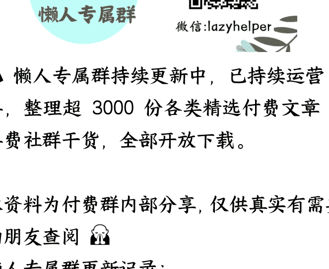

# 外卖三国杀，二季度战况如何

2025-09-08《蔡钰·商业参考 4》节选

整理：公众号懒人搜索，[懒人专属群]独享

懒人微信：lazyhelper

短短几个月，京东集团对外卖补贴大战的态度就发生了有趣的转变。它在 4 月主动发起了针对外卖市场的“百亿补贴”活动，短短两个多月就换来了每天 2000 万单的外卖订单增量。而当阿里在 7 月初宣布拿出 500 亿补贴、把外卖大战拉高烈度之后，整个暑假，京东变得低调，退到了战场的边缘。

京东高管在二季度财报电话会上，批评了 7 月份的外卖大战，说“这些行为没有带来模式创新，也没有给行业创造增量价值，反而一定程度上扰乱了价格体系，给商家带来困扰，因此是不可持续的。”你看，自己的百亿补贴带来了价值增量，对手的 500 亿补贴就是扰乱价格体系。京东这个态度变化的背后，很大原因是它在财力和意志上，都没法支撑更高烈度的价格战。

而整个过程，老玩家美团一直在硬扛。美团 CEO 王兴连着两个季度都表态说，反对外卖价格战，但竞争加剧时，美团还是会全力以赴捍卫自己的市场地位。正好 8 月下旬，京东、美团和阿里都发布了自己的 2025 年第二季度的财报。借着三家的财报，我们可以来看看今年这场外卖大战的 4 个关键战况。

## **多烧与少赚**

我们要关注的第一个战况是，三家在二季度的外卖大战当中，究竟烧掉了多少钱。

同样在 4、5、6 三个月，京东的营销开支同比大增 127.6%，达到了人民币 270 亿元，主要用在推广外卖业务。比去年同期多烧了 151 亿元。

美团的销售及营销开支同比增加 51.8%，达到了 225 亿元。比去年同期多烧了 77 亿元。

阿里的销售和市场费用从去年同期的 327 亿元增加到了 532 亿元，增幅 62.7%，同比多烧了 205 亿元。这笔钱的主要去向之一，也是外卖业务所在的淘宝闪购。

三家多花的钱加起来大概是 433 亿元，平均每天烧掉了 4.7 亿元。这些钱中的大部分，变成了你领到的外卖补贴和在刷到的外卖广告。

烧了这么多钱，那赚回来多少呢？答案是，没赚回来，三家的利润都在显著减少。同样是 2025 年二季度，京东的收入同比增加 22.4%，但净利润同比下滑 50.8%，只有 62 亿元。美团收入增长 11.7%，但净利润下滑 89%，只有 14.9 亿元。阿里呢？二季度它的即时零售收入为 147.84 亿元，同比增长了 12%，但这块业务的利润情况没有单独披露，我们只能看到，它的即时零售业务所在的阿里中国电商集团，经调整息税及摊销前，利润同比下降 21%，减少了 103.64 亿元。

所以粗略计算的话，三家为了外卖大战，比去年多烧了 433 亿元，同时少赚了大概 290 亿元。

这么鲜明的对比，要说谁家不心疼，肯定是假话。

## **扩容与变局**

第二个战况，来看价格战对整体外卖市场的影响。首先，外卖市场的整体容量确实被三家撑开了。整个市场的外卖日订单量峰值，在 5 月份冲破 1 亿单时，我们还跟着激动，到 7、8 月份，看见 2.5 亿单就已经见怪不怪了。

对应到外卖三巨头，京东新业务二季度实现了 92 亿元的营收增长；美团核心本地商业实现了 47 亿元的营收增长；阿里实现了 16 亿元的即时零售营收增长。当然啊，阿里这个数字低，跟它近期又做了架构重组、调整了统计口径有关。

其次，市场格局有了变化。按照瑞银的研究报告，在外卖大战之前的很多年里，中国外卖市场，被美团和饿了么两分天下，美团占据订单量的 85% 以上。二季度外卖大战启动后，美团的市场份额降到了 74%，淘宝闪购与饿了么保持 13%，京东也蹿升到了 13%。

京东的订单量飙升，惊醒了原本排名第二的饿了么和它所在的阿里集团。于是 7 月开始的三季度，阿里揣着 500 亿巨款入场，掀起了更激烈的战况。这让美团市场份额进一步下降到 65%，淘宝闪购的份额蹿升到 28%，京东份额又回落到了 7%。

也就是说，第二季度最标志性的变化是，淘宝闪购快速崛起，撼动了美团多年来的绝对主导地位。这是我们观察到的外卖大战的第二个关键战况：整个市场容量，从 1 亿单扩大到了 2.5 亿单；同时市场格局从原来的 8:2，变成了 6:3:1。

## **三家的损益**

第三个战况是一个问题：这么大手笔烧钱，给各家带来了哪些变化呢？答案我们也能从三家公司二季度的财报和业绩电话会里找。

先看京东。

京东 CEO 许冉提到了三个进展：

- 第一，京东的用户增长和活跃度显著提升。京东季度活跃用户数和购物频次的同比增速都超过了 40%，京东 PLUS 会员的购物频次增速更快，超过了 50%。
- 第二，京东核心零售业务实现了收入和利润的同步增长，而且利润和利润率增幅是超过收入增长的。其中的电子及家电板块收入同比增长 23%，日用百货板块收入也增长了 16%，时尚板块也保持了双位数增速。请注意，京东强调高增长的这几个板块里，电子及家电板块是它的基本盘，日用百货和时尚则是老对手淘宝天猫的基本盘。
- 第三，京东外卖等新业务发展态势良好，一方面，订单量、骑手数量在猛增；另一方面，也开始给电商零售业务显著引流。

这之外，京东高管在电话会里还强调了两个观点。

一个是，京东做“外卖业务不是追求一两个月的短期成绩，我们希望长期做下去，五年、十年、甚至二十年，目标始终是可持续发展的商业模式。”

另一个是，“即时零售，是对各类消费场景的一种有益补充，它满足了用户对应急商品的需求。但从商品的丰富度和性价比来看，京东传统的核心电商业务依然拥有更大优势。因此，在整个零售板块中，即时零售是核心电商的补充。”

从这两句话我们可以判断，京东在竞争升级后，并没有打算撤出外卖战场。但它也不期待真正从外卖和闪购业务赚钱，而是把它们当作自己平台的引流工具。

美团呢？美团没有提市场份额的变化。但是说自己守住了行业领先地位，营收同比增长 11.7%，总月活跃用户量超过了 6 亿，年交易频率也创下了历史新高。同时在 7 月份，美团的单日即时零售配送订单量也创了新纪录，达到了 1.5 亿单。

阿里呢？阿里说，淘宝闪购本身实现了强势崛起，8 月的月度消费者规模达到了 3 亿，比 4 月增长了 200%。8 月的某个周末，淘宝闪购的日订单峰值达到了 1.2 亿单，日均订单量也达到了 8000 万单。

这还不算，淘宝闪购也给它的电商业务成功导流了。淘宝 App 的 8 月日活跃用户增长了 20%，电商广告和客户管理收入也同步受益。所以，阿里放话说，三年内，自己的闪购和即时零售业务能给平台带来 1 万亿的交易增量。

基于这些数据，阿里高管还在电话会上，把"AI+ 云”和国内大消费，定调为阿里巴巴的两大历史机遇。以至于阿里巴巴在诞生 26 年后，重新进入了创业周期。

三家看下来，阿里的本益比似乎最漂亮。但请你注意一个细节：美团和阿里，都不约而同地拿出了三季度的部分成绩单，来证明自己在二季度的钱烧得有意义。但两家的外卖大战，在 7 月份才真正升级，他们三季度到底烧掉了多少钱，我们要等到 10 月份才能知道。

## **转战线下折扣超市**

第四个战况，出现在外卖战场之外。就在 8 月份，外卖三国杀的三位选手，又都不约而同地去往另一个战场，在那里碰头了。什么战场呢？线下折扣超市战场。

8 月 29 日，美团在杭州开出第一家自营折扣超市，起名“快乐猴”。根据公开信息，快乐猴超市的首批试点选在北京和杭州，年内计划开出 10 家门店，然后铺向全国。

同样在 8 月，阿里盒马的社区超市品牌盒马 NB，正式改名成了“超盒算 NB”，当天在华东一口气开出了 17 家新店。盒马给超盒算 NB 开放了加盟，计划 2025 年要在全国开出 300 家门店。

京东呢？京东也赶在 8 月内，在江苏宿迁和河北涿州开出了 5 家京东折扣超市。这批折扣超市定位是“国内首个大型折扣超市业态”，强调自己背靠京东供应链，主打下沉市场的大众消费。

三家先是参与了线上外卖会战，眼下又一齐转战线下硬折扣，是怎么想的呢？王兴在二季度电话会有句话做了解释。他说：“仍然有很多用户，尤其是在低层级城市，他们更喜欢在实体店购物。所以，我们必须更多地尝试类似全渠道的模式，不光做线上，还要做线下以及更多的折扣零售。”

换句话说，三巨头的外卖战争，不但扩大到了即时零售，也扩大到了全渠道零售。各家都认为，这场仗需要线上和线下协同作战，才能增加胜算。做硬折扣超市，既能笼络线下消费者，又能给即时零售当近场货仓。

## **总结**

到这里，我们大致梳理了 2025 年外卖大战，进展到二季度的四个关键战况：

- 第一，巨头们多烧少赚，合计多花了 433 亿元、少赚了 290 亿元；
- 第二，即时零售市场容量从 1 亿单扩大到 2.5 亿单，格局也从“8:2”变成了"6:3:1"；
- 第三，在扩容的市场里，三家都认为自己有所收获；
- 第四，战火从线上扩大到了线下的硬折扣超市赛道。

但这场战事的看点，还不止于此。接下来两讲，我要邀请你仔细去读一读阿里和美团的二季度财报电话会，看看两家的高管都透露了哪些弦外之音。下一讲，先来看美团。王兴在电话会上放了一句狂言：“在大赛中成为不被看好的一方，是再刺激不过的事了。所以这很让人兴奋。”

怎么个逻辑？我们下一讲讨论。再见。

最后，安利小懒的付费群：

# 懒人专属群（介绍）

📚 懒人专属群持续更新中，已持续运营 6 年，整理超 3000 份各类精选付费文章&年费社群干货，全部开放下载。本资料为付费群内分享，仅供真实有需要的朋友查阅 👶

# 懒人专属群更新记录：

https://lazy2025.top/blog/record2

# 懒人专属群更新记录（需梯子，备用）：

https://lazybook.fun/blog/record2