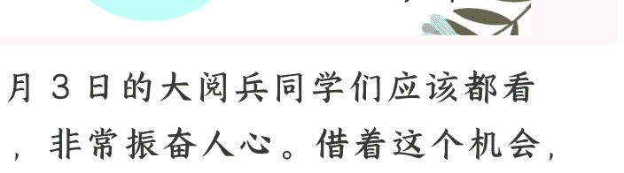

# 大信号：国家安全逻辑正日益“显性化”，影响巨大

250908《政经参考》节选  
整理：公众号懒人搜索，[懒人专属群](#)独享  
懒人微信：lazyhelper

9月3日的大阅兵同学们应该都看了，非常振奋人心。借着这个机会，我想谈一个我观察到的正在发生的重要变化，就是国家安全逻辑的显性化。

过去，国家安全更多体现在战略层面，感觉跟普通人关系比较远。但现在，它正在逐步走到前台，深入影响产业发展、企业出海、区域格局等方方面面。虽然这种变化还没有完全进入大众视野，但这个趋势已经非常清晰：就是安全逻辑，正在成为塑造未来发展格局的关键因素。

当然我不是军事专家，我不直接谈阅兵，而是想通过最近一系列与战略资源、出口管制相关的政策与行动，谈谈我看到的国家安全逻辑的新变化，以及对未来深远影响的分析。

## 中国构建严密出口管制体系

我们还是从国家层面的现象说起。

今年上半年，一个略显神秘陌生的新机构“国家出口管制工作协调机制办公室”，出现在公众视野里，一口气连续召开了三次会议，全面升级对战略矿产的出口管制。

前两次是在5月，由“国家出口管制工作协调机制办公室”牵头，分别在广东深圳和湖南长沙，先召开了一场“打击战略矿产走私出口专项行动现场会”，重点打击伪报瞒报、夹藏走私等典型规避手法；而另一场“加强战略矿产出口全链条管控工作部署会”，加强从开采到出口的全环节管控。

而7月，则是在广西南宁，召开了打击战略矿产走私出口专项行动推进会，强调对战略矿产走私出口“零容忍、出重拳”，始终保持严查严打高压态势。

从5月的“现场会”“部署会”，再到7月的“推进会”，说明专项行动取得了阶段性成果，但我判断，远没到结束的时候。按照官方的说法，下一步，要“推动专项行动不断走深走实”，“研究建立两用物项出口管制联合执法协调中心”，“制定并发布战略矿产合规出口工作指引”等等。

这里的“两用物项”，按照商务部的解释，就是“既可用于民用目的，也可用于军事或者有助于提升军事潜力的货物、技术和服务"，我认为这是未来监管的重点方向。

而从目前的进展来看，我综合分析出口管制，至少显现了三点变化：

- 第一，监管机制全面升级。国家出口管制工作协调机制的出现，源自 2020 年的《出口管制法》出台。2024 年的《两用物项出口管制条例》发布后，监管体系再一次升级。而从已有的官方报道看，“国家出口管制工作协调机制办公室”能联动至少包含商务部、公安部、国家安全部、海关总署、最高人民法院、最高人民检察院等国家关键部门，说明这是一张体系庞大、关联紧密的“监管大网”，可以无缝实现政策制定、执法调查、情报研判与司法审判的跨部门合作。

- 第二，监管的对象还在不断扩围。从 2023 年开始，国家先后对镓和锗、石墨等材料，试水许可证制度，再到今年，把钨等战略矿产、永磁材料等深加工产品，也加入到监管清单，几乎囊括了所有战略矿产及其制品。

而被监管的，不只是战略矿产，还包括技术体系。今年 2 月，商务部就明确，工艺规范、工艺参数、加工程序等，都属于出口管制对象。7 月《中国禁止出口限制出口技术目录》也再次扩容，新增加了对“电池正极材料制备”等技术的限制，这类似之前对无人机技术的出口管制。

- 第三，官方表态严厉，我判断惩罚措施有可能升级。综合权威报道，目前可以确定，已经侦办了一批案件、抓获了一批嫌疑人。

总之，“安全逻辑显化”带来的直接影响之一，是国家对敏感领域的出口监管越来越严格。特别是对敏感领域的战略矿产、两用物项、核心技术等，已经形成了极其严密的监管体系，这种为保障国家安全而强化治理的大思路，未来很长时间内应该都不会变。

## 战略优势转变为战略武器

目前来看，监管体系的升级，效果十分明显。我们在某些领域掌握了战略主导权，在关键时刻甚至能力挽狂澜，保障关键材料的长期供应稳定。最新进展是，我们同意建立一个“升级版供应链支持机制”，这也为之后的新能源汽车谈判提供了“筹码”。

从贸易战到贸易谈判，关键变量之一就是出口监管体系的升级，并最终影响到了全球战略矿产的供给，以及汽车、军工等核心产业的生产。而在第90节课，我曾经提过，“世界正从利益逻辑重回权力逻辑”。这个判断在这里同样适用，这个“权力”，其实就是控制力。国家正在把这些战略优势，转化为战略武器，改变对手的决策与博弈格局。

## 国家安全叙事显性化

而这其实就是更大的“总体国家安全观”的一部分，和我们之前谈到的“关键产业备份”“国家战略腹地”等，同根同源。我认为这些意味着，我们正处于一个“安全逻辑显化”的时代，可以理解成，国家安全，正落到更多大家可感知的具体行动和影响上。

而安全逻辑的显化，根据我的研究，至少体现在这三个层面：

- 第一，国家安全在顶层设计中出现的频率越来越高。比如，在法律层面，除了前面提到的相关法律外，新修订的《保守国家秘密法》在2024年5月正式施行，维护粮食安全的《粮食安全保障法》在 2024 年 6 月正式施行，新修订的维护国家安全和公共安全的《突发事件应对法》在 2024 年 11 月正式施行，新修订的维护金融安全的《反洗钱法》在今年 1 月正式施行等等。此外，还有一系列同步推出的配套法规。

- 第二，国家安全逻辑下，产业生态变了，民企正面临新机会，也要防范新风险。对民营企业，特别是要出海的民营企业来说，在走向全球的过程中，既要抓住机会，也要防范风险。这里我特别提示下风险，首先是出海的合规风险，无论是战略矿产、技术体系，还是跨境数据，未来的监管趋势，大概率是要主动适应国家利益的要求。同时，在安全逻辑显性化的背景下，未来必须要考虑大国博弈和地缘政治逻辑，要去安全的地方，去中国影响力覆盖的地方投资做生意。

毕竟，国家是企业最强大的后盾。比如今年 5 月和 7 月，出访的国务院总理李强在印尼和巴西的中资企业座谈会上，都明确表达了国家支持中国企业更好出海的政策导向，“将始终是海外中资企业发展的坚实后盾”。

而此前的二十届三中全会也强调，要强化海外利益和投资风险预警、防控、保护体制机制，深化安全领域国际执法合作，维护我国公民、法人在海外合法权益。显然，海外利益安全也是总体国家安全观的重点领域之一。从长期看，一旦掌握战略主动权，企业出海更安全，机会也会更多。所以我理解，国家安全，最终也是为了转化成贸易安全、投资安全、企业安全。

另外我也提醒下，这次9月3日的大阅兵，哈萨克斯坦等中亚5国领导人都来了，而东南亚国家领导人，能来的也都来了，这是外交层面的重要信号。与之相互印证的，是今年上半年的资本流向：今年7月，复旦大学泛海国际金融学院绿色金融与发展中心和澳大利亚格里菲斯大学联合发布的一项研究报告显示，中亚也是今年上半年获得中企投资金额绝对值最高的地区，其次是东南亚。

而在运输侧，国铁集团的消息说，今年1至7月，中亚班列累计开行8526列，同比增长23.2%。中国和中亚的关系持续升温。还记得我在第167节谈的中国西部的系列超级工程，以及西部的“新陆权战略”吗？你联系在一起仔细想想。这些背后的大战略和大趋势，都是密不可分的。

另外，我认为对于内部来说，国家安全逻辑的显性化，本身也会带来产业上的深远影响，核心就是围绕“安全”所产生的对科技和科技产业的巨大推动，背后也是资金和资源的聚集。

比如最近股市的表现，其实印证了这个趋势，科技股表现抢眼，寒武纪成为新股王，虽然很多人对寒武纪还有不同看法，包括对股市的火热本身也有各自不同的判断，但无论如何，其代表的国家安全叙事的大趋势，是确定的。如果你一直看我们课程，会发现，我从年初一直在说这个大趋势，同学们对这次以科技为代表的国家安全叙事的崛起，应该心里早就有数了。所以我一直说，**宏观趋势是浪潮，个人是水滴，我们必须要看清和融入这个浪潮**。

- 第三，区域的发展逻辑也变了，一大批战略性城市，迎来增长的“第二曲线”。比如，之前提到过的成渝双城经济圈，整体都享受到“国家安全显化”的政策利好，成为增量政策最密集的区域之一。此外，受益的还有内蒙古包头、江西赣州等战略矿产储备丰富的城市。包头今年的稀土产业目标是1300亿元以上，要进一步推进“两个稀土基地”的建设。而作为“稀土王国”的江西赣州，也将继续发展稀土新材料及应用集群，产业规模破千亿元。之前我们也提到过，“世纪运河”浙赣粤运河的中间节点，也设在赣州，背后原因也是战略矿产的重要性提高，交通等政策红利开始倾斜。至于我们之前说的大学专业和在学校选择中跟科技和安全相关的新趋势，就不再重复说了。

总之，我综合分析下来，国家安全逻辑的显性化，正在从宏观战略，逐步转化成越来越多实际的法律、政策和行动，会长期影响企业、产业和区域的发展，也会影响到我们更多人的专业、工作选择和个人财富。

最后，欢迎你把《政经参考》转发推荐给更多人，让我们一起聚焦政经，举重若轻。我是马江博，下期见。

**延伸学习：**

1. 司法部、商务部负责人就《中华人民共和国两用物项出口管制条例》答记者问

[PAGE]

🍄 懒人专属群持续更新中，已持续运营6年，整理超3000份各类精选付费文章&年费社群干货，全部开放下载。

本资料为付费群内分享，仅供真实有需要的朋友查阅🤐

**懒人专属群更新记录：**

https://lazy2025.top/blog/record2

**懒人专属群更新记录（需梯子，备用）：**

https://lazybook.fun/blog/record2