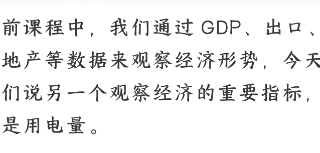
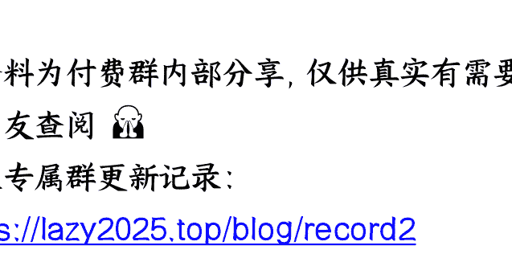

# 大经济信号：中国正成为“电力帝国”

250908《政经参考》节选
整理：公众号懒人搜索，懒人专属群独享
懒人微信：lazyhelper

之前课程中，我们通过 GDP、出口、房地产等数据来观察经济形势，今天咱们说另一个观察经济的重要指标，就是用电量。

2025 年 7 月，中国全社会的用电量，达到 1.02 万亿千瓦时，这是世界上首次有一个国家，单月用电量突破万亿千瓦时。

这个数据有多夸张呢，横向对比，相当于东盟国家全年的用电量。以至于英国《金融时报》说，中国即将成为人类历史上第一个“电力帝国”。而纵向对比，这次 7 月用电量突破 1 万亿千瓦时，比十年前直接翻了一番，这种指数级增长在世界能源史上是前所未有的。

除了用电量，我们再看看发电量，2024 年中国全年发电量，突破 10 万亿千瓦时，占全球总发电量的 1/3。甚至我们现在因为发电过多，电网消纳能力不足，还出现了“弃电”现象，就是把发出来的电放弃掉而不并入电网，全国新能源消纳监测预警中心发布的数据显示，2025 年上半年，全国太阳能弃电率升至 6.6%，风电弃电率达 5.7%。

进一步说，中国已经事实上成为全球最大的电力生产国和消费国，构建了一个覆盖发电、输电、用电全链条的外媒口中的“电力帝国”。

今天这节课，我们就从今年 7 月的用电数据出发，谈谈我从中分析出的中国经济转型的信号，带你看懂未来大国竞争的核心逻辑。

## 电力的背后是产业

那么，这 1 万亿度的用电量，除了创造新的世界纪录，还有哪些深层意义呢？

国内外不少经济学家都认为，“用电量”才是衡量经济好坏最重要的数据之一。其他很多统计数据，换个口径换个算法，就能让数字好看不少；但是电表，很难撒谎，工厂、办公楼、商场不开工不营业，电表是不会自己转的。

所以有经济学家怀疑，美国最近几年的经济增长数据有点问题，因为 GDP 涨了，但是用电量没跟着一起涨，还时不时会降一降，而且是工业生产用电和居民用电一起降，哪怕是用产业升级来解释，依然有点牵强。当然，这只是一个观察角度，我们这里不去质疑美国，这事各有各的说法。

回到中国，我们进一步来分析用电方面的详细情况，我认为用电指标是观察中国经济结构转型的一个晴雨表。

就拿 2025 年 7 月的数据来说，全社会用电量包括四个部分，三大产业用电，以及城乡居民生活用电。

先说三大产业的用电变化，分别是：第一产业用电量，同比增长 20.2%，第二产业增长 4.7%，第三产业增长 10.7%。

其中，第一产业，包括农、林、牧、渔业，用电量增长 20% 以上，增速位居各产业之首。但我分析，这并不是源于农业规模的扩张，背后应该是农业电气化包括智能化转型加速的结果，还记得我在第 79 讲谈今年的“农业强国”文件时，说的农业现代化包括农机等各种设备的新增量吗？这次用电增速，我认为可以看作是新增量加快落地的一个信号，包括各种温控、灌溉等等，是农业现代化的提升，和乡村振兴的推进。

再说第二产业，包括采矿业、制造业、建筑业等，用电量增速 4.7%，增速垫底，但结构发生了明显变化。第二产业是用电大户，用电量占比最高，占到了总用电量的 58%。但值得注意的是，不同行业的用电量增速，却发生了明显的变化。根据中能智库发布的《中国能源形势分析与预测报告》，四大高载能行业，化工、建材、钢铁、有色金属，合计用电量同比只增长了 0.9%，增速较去年同期大幅回落 3.1%；而新能源汽车、通用设备制造、仪器仪表等产业的增速，最低的是 5.3%，新能源汽车制造业甚至同比飙升 28.7%。所以第二产业用电量数据的背后，反映的是经济的新旧动能正在加快转换，有的产业高歌猛进，有的产业步履蹒跚，用电量是最直观的体现。

包括信息传输、各类服务业在内的第三产业，用电增速 10.7%，我分析是反映了新兴产业的崛起。

一方面，人工智能、大数据、云计算等产业，高度依赖算力支持，而数据或者算力中心，是典型的“电老虎”。北京理工大学的王永真副教授说，2025 年中国所有数据中心用掉的电，加起来估计能占到全国用电量的 2.4%。而且看数据，数据中心的耗电量每年都要增加 20% 左右。比如根据新华社的报道，2025 年 1 到 7 月，互联网和相关服务业的用电量，同比增长 28.2%，几乎是第三产业平均增速的 3 倍。

另一方面，由于电动汽车高速发展，充换电服务业的用电量，同比增长 42.6%，也贡献了不少。

剩下的，是城乡居民用电，同比增长 18%，这反映了生活水平的提升和电气化普及程度的提高。当然，气温高也是一个重要因素，今年河南、陕西、山东等几个省，天气热得创了新纪录。而看长期数据，基本每年的七八两个月，都是一年里用电最多的。

## 大国电力战略

好，分析完具体的用电数据，我们继续看政策端。

我从目前国家政策来看，显然还是在继续支持电力产业扩容，而核心战略意图之一，我判断还是争夺未来全球产业竞争的主导权。电力已经不仅仅是支撑传统工业运转的基础能源，更是决定新一代技术革命成败的关键要素。在人工智能、电动汽车、低空经济、脑机接口、具身智能等前沿领域，电力已经成为比数据、算法甚至人才，更为底层的竞争壁垒。比如 AI 产业，大模型训练所需的算力背后，是惊人的电力消耗。

目前美国正在大笔投资电网，中国也在超前布局核电等清洁电力系统，未来的大国博弈，也取决于一个国家能提供多少稳定、廉价、清洁的电力。

而我从数据和产业布局分析下来，中国目前确实拥有了先发优势。一方面，当其他国家可能因为电力短缺、电价高昂而限制 AI 算力发展、迫使高耗能产业外迁时，中国却可以凭借巨大的电力冗余和成本优势，成为全球高端制造业和数字产业聚集的“洼地”。这就像在互联网时代初期，你提前铺好了最便宜、最快速的光纤网络一样，生态自然会在这里形成。

另一方面，中国在特高压输电、智能电网、大型储能、第四代核电等技术上，已经处于全球领先地位。我综合判断，通过在国内进行超大规模的应用和试错，中国正在成为全球电力技术的标准制定者。当全球未来都要建设智能电网、都要发展可再生能源时，他们大概率将采用中国的技术、中国的设备乃至中国的标准。这是一种比单纯产品出口更高级、更持久的竞争优势。

尤其是电动汽车产业，当欧美国家还在为电网容量和电费波动困扰时，中国的电动汽车产业链，已经从动力电池生产到终端消费使用，形成了全链条的电力成本优势。

说白了，谁掌握了更多更先进的电能和电力系统，谁就掌握了未来科技产业的命脉。

## 电力人民币的可能

接下来，我们再把这个放到一个更深的层次来看，合理推演一下电力和人民币之间的可能性。

能源与货币，在现代社会是深度绑定的关系。工业社会，用美元绑定石油；而在未来的数字社会，大量产业都是围绕着数字网络展开，因此电力会成为核心能源，而货币权力自然也会向这一关键能源集中。

所以，未来从能源角度来看，在美国的石油美元之后，我认为中国很可能有机会，构建一套以电力为基础的新人民币国际化路径——就是“电力人民币”战略。这一战略的本质，是通过电力输出和人民币结算的结合，挑战石油美元的主导地位。

根据我的研究，电力人民币的战略优势，在于它的多重锚定效应：

- **第一**，电力是刚需商品，每个国家都需要，且消耗量在持续增长，尤其是随着数字经济、电动汽车、AI 算力需求的爆发，在世界范围内，电力需求将会越来越旺盛。

第三，中国在电力设备、电力技术和电力标准上具有全球领先优势，而且电力贸易往往伴随基础设施建设和长期运营合作，所以我认为对其他国家来说，直接使用人民币结算，能够降低交易成本和汇率风险，尤其对美元储备不足的发展中国家具有吸引力。

而中国现在也开展了这方面的探索，中老铁路光伏项目采用人民币结算，哈萨克斯坦光伏项目用人民币计价，巴西水电项目通过熊猫债实现人民币融资。这些案例表明，电力人民币并不是理论构想，而是已经在实践中探索的路径。

当然，从中短期来看，电力人民币面临多方面的挑战，比如技术层面，跨境电网需要解决标准协同、调度安全等问题；政治层面，美国可能通过各种手段阻挠，而且美元惯性依赖，短期内难以扭转。

但从长远看，我认为未来的能源金融秩序一定会发生大洗牌，电力人民币的空间极为广阔，数字化、去中心化、碎片化的全球趋势，正在削弱传统石油美元的基础，而区块链技术、数字货币和区域支付系统的发展，则为绕过美元提供了可能。

因此我的判断是，在这些趋势下，电力人民币真有可能以“边缘包围中心”的方式逐步渗透，最终可能部分形成与石油美元并行的双轨体制。这也是作为“电力帝国”，更大的作用。

最后，欢迎你把《政经参考》转发推荐给更多人，让我们一起聚焦政经，举重若轻。我是马江博，下期见。

### 延伸学习：

1、国家能源局：2025 年 7 月份全社会用电量同比增长 8.6%
2、北京理工大学发布报告显示 数据中心电耗将占全国电耗 2.4%

最后，安利小懒的付费群：

[懒人专属群](#) (**介绍**)

📚懒人专属群持续更新中，已持续运营 6 年，整理超 3000 份各类精选付费文章&年费社群干货，全部开放下载。

本资料为付费群内部分享，仅供真实有需要的朋友查阅📚

懒人专属群更新记录：

https://lazy2025.top/blog/record2

懒人专属群更新记录（需梯子，备用）:
https://lazybook.fun/blog/record2