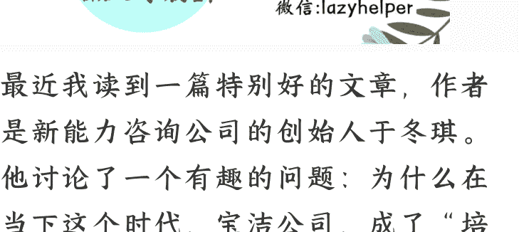

## 方法论：宝洁如何培养 CEO

250908《蔡钰·商业参考 4》
整理：公众号懒人搜索，[懒人专属群独享](https://t.cn/S6yXwFp)
懒人微信：lazyhelper

最近我读到一篇特别好的文章，作者是新能力咨询公司的创始人于冬琪。他讨论了一个有趣的问题：为什么在当下这个时代，宝洁公司，成了“培养 CEO"这件事的最佳实践者，能为自己和市场源源不断生产高级人才？

他这么说，至少有三个证据：

- 第一，宝洁自己的管理者，几乎从不依赖外招，90%以上的员工都是由校招应届生培养起来的。在宝洁的历史上，除了创始人家族成员外的12个 CEO，全部都是由内部培养、晋升而来。今天宝洁中国区的 CEO，也是宝洁在 90 年代的应届管培生。
- 第二，全球其它的一些知名消费公司，比如联合利华、雀巢、玛氏，在中国的不少高管也曾是宝洁管培生。
- 第三，中国 2015 年新消费浪潮以来，发展不错的本土企业当中，也有不少创始人和高管来自宝洁，比如完美日记、阿芙、Babycare、usmile 等等。

哪怕今天宝洁的业务增长不复当年，
但抢走宝洁生意的新公司、新品牌，
很多也都是宝洁系的创业者和高管。

最关键的一点是，它既像其他大公司一样，教会员工解决问题的成熟方法；又能像创业公司一样，让员工保留踏出舒适区的勇气。

怎么做到的？

我觉得，于冬琪采访总结出来的这套方法，也非常值得我们用来审视和提升自己。于是我征求了他的同意，给你转述一下这套方法论。

我们开始。

### 识别特质

这套方法的第一步，叫“选出不可改变的先天特质”。

哪些先天特质？

- 第一，好胜心。对“赢”有足够强烈的渴望，这样的候选人，能驱动自己持续行动、不断突破。
- 第二，领导力。能承担责任、能有效影响他人、能说服和团结他人。
- 第三，坚韧性。也就是，承受失败和压力的能力。

宝洁到各大学校招聘应届毕业生的时候，会特别留意有三类超常规特质的人。

怎么判断谁有这些特质呢？重点关注学校各类活动的积极分子。宝洁有一半以上的员工，在大学时，要么担任过学生会高级干部，要么打过辩论赛，要么担任过社团的核心骨干。有的学生虽然没有担任过这类“官职”，但也在某些项目中，展现出了领导能力的，宝洁也会喜欢。

为了更早发掘和团结这些人，宝洁甚至在一些目标高校里早早就成立了宝洁俱乐部，来为自己的校招做准备。你看，这跟耐克挑选未来的体育代言人是一个思路。

相比之下，专业对不对口、有没有相关实习经验，反而没那么重要，经验都是可以后天积累的，反而是特质没法教学。

### 给出“修改系统”的授权

把这些特质的应届生筛选出来之后，宝洁会给他们一个著名的头衔——管培生。接下来，进入第二步，培养。

具体怎么培养呢？在实践中培养。这个过程，宝洁随时拿捏着一个非常关键的原则，叫既不让公司承担过大的风险，又能保留员工的主动性。

宝洁不会像绝大部分公司那样，让新人从打杂干起。而是对管培生们强调早期责任，直接让他们进入荷枪实弹的生意项目，拿到一定程度的授权，用复杂的真实问题锻炼他们。

新员工在项目实战里，一边要为组织干活试错，一边被鼓励，甚至要求，帮着宝洁改进工作流程和系统。这个过程，干活试错积累了他们的成长可能性；改进系统又帮他们保持了主动性和成就感。这可以算是宝洁与员工的“双向参与”。

不过，在这个过程中，宝洁也保留了一定的原则，来降低新人试错给企业带来的风险。

怎么干呢？宝洁要求，任何员工来了之后，要充分理解流程的存在逻辑。在充分理解现状的前提下，员工才能提出改进系统的建议。

而且，一个员工如果想要改进宝洁的工作流程和系统，需要交出一份足够可靠的方案，落地成功率要高，风险要可控。

那么，如何才能确保员工产出的方案足够可靠呢？

宝洁从三个方面着手。

### 一线体感

第一个方面，让员工养成扎根一线的工作习惯，确保他的思考与决策基于真实、准确的一手信息。

举个例子：

1990 年代，宝洁招募了一帮顶尖名校的管培生，在总部培训时，让他们体验了外企特有的光鲜亮丽。但培训完后，宝洁把他们当中的大部分派往了偏远落后的县城镇，要他们把宝洁的产品卖进各种小杂货店。

一位当时的宝洁管培生——今天已经是知名品牌的 CEO 了——当时被派驻到了一个小她住的招待所，连门锁都没有，拿椅子顶住门才敢睡觉。当她找到乡镇的小超市推销宝洁商品的时候，被老板直接拒绝了。理由很简单，“同样”的商品，宝洁给的价格比镇上小超市还贵。

这位管培生很震惊：我代表的是宝洁官方，还有什么渠道能比我便宜？再一走访才知道，乡镇上，有临期窜货、有真假混杂，确实能做到比官方便宜。更要命的是，小镇消费者根本不在乎临期和真假的问题，毕竟他们连招待所没有门锁都不在乎。

这些一线感知，是管培生们走出大城市的写字楼才能体会到的。

### 引导式反馈

第二个方面，帮员工建立全面的思考框架，让新人也能系统地考虑问题。

一个应届生在完成新员工培训、熟悉完业务后，通常会接到一个任务：做方案。这个方案的目标，可能是改造某个供应商的生意体系，可能是改造某个门店的陈列，也可能是优化某个品牌的文字和视觉传达。

等他把这个方案做完交上去，会收到他的管理者的评审反馈。

注意了，别的公司管理者，对这类新人方案反馈，通常就是“通过”或“不通过”，但宝洁的管理者的反馈更具有教育意义，他一定会指出具体的问题，而且是用提问的方式来引导员工思考，自己发现问题和疏漏。

比如，有管培生写完一份电商促销方案，收到的反馈是这样的：“我们要提升线上渠道的销量，你现在是想用低价促销先吸引一波消费者。但是设想一种情况，线上促销可能会吸引线下的消费者和渠道商，可能引发窜货的问题，可能破坏零售网点的利益。你觉得，这对品牌是利大于弊，还是弊大于利？”

这个问题，又逼着管培生去研究窜货现象，加深对销售的理解。

类似的训练，还不止发生在这个“新人方案”的任务里，在其他的日常工作中，宝洁的员工们也都会被要求在一页纸之内，把工作的框架和条理性呈现出来，去向上汇报和内部沟通。

管培生们刚刚进入职场时，自己就是一张白纸，等他们去产出第一个方案、第一次建立思维框架的过程，对管理者其实也是折磨。往往一个简单的方案，也需要管理者跟管培生沟通近 10 个来回。等一个方案磨完，两三个月的时间就过去了，中间当然会有无数挫败。

放在别的企业，组织通常会觉得，“让熟手或者中层直接出方案效率更高”，但宝洁却坚持把管培生的“培”字落到这些打磨沟通里。

为什么管理者和管培生都能耐得住性子扛下来？别忘了，这跟前面提到的第一步有关系：管培生们都是拥有好胜心、领导力和韧性的应届生，而他们的管理者，当年也是用这个标准筛选出来的。

"先天特质"这第一个齿轮，帮宝洁的员工们扛住了第二个齿轮的压力，让他们在受训过程中，逐渐建立起全面的思考框架。

### 跨生态位历练

第三个方面，有了全面思考框架还不够，宝洁还有意培养员工关注思考框架和方法论的通用性。

什么意思？举个例子：“流量优先”是一个经典思考框架，但如果要做一个个公益产品，以“流量优先”为导向制定的策略，很可能去擦边，那就只会引发受众的反感，得不到支持。

而这类问题，恰恰是未来的管理者、CEO 们每天都会遇到的新挑战和新问题。对他们来说，只掌握一些表面的经验和方法是远远不够的，而是要掌握更通用的方法，来应对新挑战和新问题。

具体怎么做呢？

理论上，宝洁驱动员工们把方法论琢磨到足够底层。也就是，在给员工的各种方案做反馈的时候，都要回到第一性原理，把问题拆解到本质。

它要求员工解释方案时，要同时论证清楚 Who、What、Why、How，说明白：我们当前要为谁解决问题？解决的是个什么问题？为什么要解决这个问题？怎么解决这个问题？

尤其是其中的 Who，又可以拆成“用户”和“公司”两层答案，让员工去想明白，哪些问题真正关乎用户的需求，哪些问题真正关乎公司生意的增长。

这是一种在宝洁代代相传的思维模式和方法论。你肯定知道，这也是今天几乎所有商业领域的 CEO 们思考问题的模式。

这是理论上的探底。

在实践中，宝洁也要求员工把方法论放进尽量多的业务场景验证。

具体怎么做？借助内部换岗制度。

在很长一段时间里，宝洁的员工只要工作满 2-3 年，都会在同一职能板块内换岗，去感受不同客户、不同品类、不同区域和不同团队；如果员工遇到关键晋升，宝洁也会有意让他经历中台和一线的经验平衡。比如，销售在升职之前，一定要去干一干总部中台，或者区域客户管理。

这个过程，就让员工突破了经验局限，在不同业务岗位锤炼自己方法论的通用性。同时，也再一次逼他们跳出舒适区，再次感受压力和成长，保持独当一面的勇气和能力。而业务的挑战性和新鲜感，某种程度上，也会帮宝洁留住这些雄心勃勃的人才，让他们在更全面的业务视角当中，获得更大的成就感。

### 总结

总结一下，于冬琪梳理的这一整套宝洁人才培养制度，其实就是从新人阶段，把员工当作潜在 CEO 来培养和训练。它包含五个步骤：一识别特质，二授权改造，三下沉一线，四反馈打磨，五岗位轮转。

也因为这样，很多宝洁人在离开宝洁后，成为了各行各业的领导者和推动者。他们始终对这段职业经历充满认同感，称自己为“宝洁人”或“宝洁校友”。

而对我们个体来说，这也是一套“重新养育自己”的参考方法论。这两年，有种声音叫“整顿职场”，动辄宣称要抵制老板的 PUA。但更重要的可能是，我们下判断之前，需要穿过严苛的工作要求，去识别背后的逻辑是否合理、动机是否双赢。

你遇到过和宝洁类似的系统吗？或者，你给自己设计过类似的增长体系吗？期待你说说你的经历。

拜了个拜。

延伸学习《万字拆解：宝洁如何量产 CEO？》

https://mp.weixin.qq.com/s/XvCZ9LdoYH2C0vKV5BUqUQ

最后，安利小懒的付费群:

懒人专属群（介绍）

💻 懒人专属群持续更新中，已持续运营 6 年，整理超 3000 份各类精选付费文章 & 年费社群干货，全部开放下载。

本资料为付费群内部分享，仅供真实有需要的朋友查阅 👔

懒人专属群更新记录:

https://lazy2025.top/blog/record2

懒人专属群更新记录（需梯子，备用）:

https://lazybook.fun/blog/record2