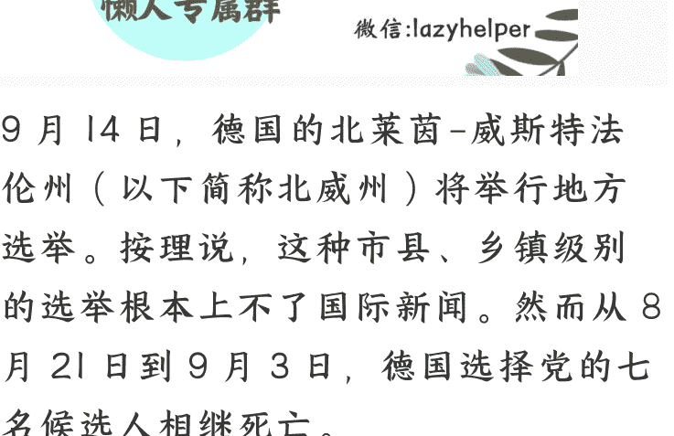

# 德国选择党七名候选人接连死亡，有何看点？

250908 文/卢克文工作室嘉宾 低调老弟  
整理：公众号懒人搜索，  
懒人微信：lazyhelper  

9月14日，德国的北莱茵-威斯特法伦州（以下简称北威州）将举行地方选举。按理说，这种市县、乡镇级别的选举根本上不了国际新闻。然而从8月21日到9月3日，德国选择党的七名候选人相继死亡。

七条人命给这场低级别选举引来了国际关注。从中国的官媒到美国的埃隆马斯克，都介绍了这次“统计学上奇迹”。

半个月连死七人，除了事情看着吓人，更在于这七条人命，将沿着北威州-德国-欧盟这条线影响到中美大博弈的格局，带来蝴蝶效应。

### 「一、北威州」

北威州是德国人口最多，GDP最高的州。其经济总量超过德国的五分之一。所以，北威州的地方选举虽然级别不高，但对德国政治有风向标作用。

 (Image from page 0 footer/transition)

根据民调显示，今年选择党在北威州的支持率相当于上次地方选举时的三倍。

然而从8月21日到9月3日，选择党的候选人连死七人。德国警方明确表示其中六人属于自然死亡，一人自杀，均无谋杀迹象。但短期内多人被曝死亡，还是在社交媒体上引发猜测。

正好，我的一位好友蒋雪莹，就在北威州首府杜塞尔多夫的律所工作，她的老板就是选择党党员。这位德国老板认为，事件背后可能有仇恨选择党的组织。目的在于恐吓，让大家不敢加入选择党。

因为，杀小官比杀大官更吓人……

在采访他之前，我原本觉得要杀人于无形，需要使用高科技毒药，达到杀人于无形的效果，而用太明显的手段，去谋杀一些市县乡镇的候选人有些不值得。何况这七个人里最年轻的59岁，年龄最大的已经80高龄。何况北威州最近一共死了十五个候选人，这样一看，选择党去世5名正式候选人的数字也不是就那么离奇。  
（候选人加一起有两万多……）

但这位老板的看法让我意识到，即使这七个人都不是死于谋杀，可考虑到选择党被排挤的特殊性，这种“杀小官比杀大官更吓人”的观点是有市场的。无论真相如何，从坊间传闻到国际新闻，其影响已经不小而且很可能继续发酵。也就是说，这七个人死亡的影响，比他们死亡的真相更重要。

因为，借着这件事的影响，选择党可能会被以传播阴谋论的罪名+杀小官比杀大官更吓人的恐吓效果遭到进一步打压乃至被取缔，也可能利用执政两党的矛盾，突破被建制派联合排挤的防火墙。

### 「二、德国」

过去解说德国政治最大的难点，就在于政党林立，一开口就得五六个甚至七八个党一起说。然而今年 2 月的德国联邦众议院选举帮我们省了大麻烦，这回只需要讲三个党就可以了。

老大联盟党，右翼。现任德国联邦总理和北威州总理都属于这个党。在联邦众议院 630 席中占据 208 席。自联邦德国成立以来，联盟党一直稳居老大的宝座。但是近些年来这个老大的优势越来越小。嫌联盟党不够右的保守派选民纷纷投了选择党。

老二选择党，极右翼，在联邦众议院占据 151 席，是最大在野党。二战后出于对纳粹的罪行的反思，德国从基本法到政党都对极右翼严防死守。被定性为极右翼的选择党遭到了其他政党的联合排挤。各政党像防火一样杜绝与选择党合作。也就是德国政治术语中的防火墙。由于防火墙的存在，从联邦众议院副议长到众议院各个委员会的主任、各州州总理，选择党这个新晋老二那是一个都捞不着。

老三社民党，左翼。在联邦众议院中占据120席。现在与老大联盟党联合执政。社民党原本长期是德国第二大政党。今年联邦众议院大选滑落成了老三，是德国所有政党和选择党最不对付的一个。

现在联合执政的联盟党和社民党都希望收拾选择党。但联盟党想徐徐图之、一边抄袭选择党受欢迎的政策（比如限制移民），一边试探松动防火墙（比如和选择党一起投票突破债务上限），来逼迫社民党这个执政伙伴更听话。

而社民党恨不得把选择党一棒子打死，也就是取缔。具体流程一共分四步。前三步分别是通过内政部主管的宪法保卫局把选择党倒退回了第二步——“极右翼嫌疑”。既然宪法保卫局退了这一步的理由，是选择党上诉了。那社民党就得千方百计让选择党败诉，把选择党往纳粹的罪名上贴。

9月3日德国《每日镜报》发表评论文章，指责选择党在选前散布阴谋论，并质疑该党正利用多名候选人死亡一事，在竞选活动中为自己谋取利益——都来看啊，选择党那几个人的死根本就没有什么阴谋，反倒是他们自己，借机炒作传播阴谋论，这简直就是纳粹党策划国会纵火案的翻版。现在选择党骑虎难下。

坊间传闻，这七个人的死亡背后有人下毒。

那么，要不要把各种高端毒药都靶向检测一遍？如果真的费时费钱检测完了啥也没检测出来，会不会闹国际笑话？要是搞常规检测，人家德国警方都查完了，你还能查出什么来？不检测那更完了，你们选择党一气儿死了这么多人，就这么不了了之了，以后谁还敢跟你们混？

所以，事件出来后，选择党反倒是积极辟谣的。

北威州选择党党部副主席凯·戈特沙尔克表示：“据我掌握的信息——但只是部分信息——目前并不能支持这些怀疑。”戈特沙尔克 9 月 2 日接受采访时表示，德国选择党希望政府对这些案件进行调查，但呼吁外界不要立即陷入阴谋论的泥潭。

不过，这次事件也给选择党带来了机遇。

由于防火墙的存在，选择党必须单独握有议会半数以上席位才能上台执政。目前选择党在联邦和州一级议会都没有这么大优势，但在市县级已经取得了萨克森州的一个市和图林根州一个县的执政权。这两个地方的共同点在于，他们过去都属于东德，也因此对德国西部影响很有限。如果这次北威州地方选举，选择党能借着七人死亡的同情票在西部取得一个市县，哪怕是一个乡镇的执政权，对突破建制派的妖魔化宣传，能起到样板作用。

### 「三、欧盟」

今年一月，在德国联邦众议院选举前夕，美国首富埃隆马斯克与选择党党魁魏德尔连线一小时，给选择党站台。8 月 31 日，埃隆马斯克竟然连北威州地方选举都不放过，在 X 平台发帖称：“德国要么投给德国选择党，要么完蛋。”

联系到一月份马斯克与特朗普的蜜月，以及近期特朗普与马斯克和好的迹象，我们有必要思考一个问题——德国选择党发展壮大，对中国到底是利大于弊还是弊大于利？

说选择党不好吧，爱丽丝·魏德尔确实发表了很多亲中言论，选择党的一名助理，甚至因为“充当中国间谍”的罪名而被捕………

说选择党好吧，从马斯克到万斯，都在给选择党站台。

顺着这个疑问，我继续往下思考。选择党的两大标志性政策，一个是反移民，和中国的国家利益关系不大。另一个就是疑欧，也就是质疑欧盟的权威，强调国家主权。

那么问题来了，欧盟的存在对我们利大于弊吗？

事实告诉我们，不仅在拜登时期，欧盟积极配合美国围堵中国。即使面对特朗普的关税战，欧盟委员会也以不能让北京和莫斯科高兴为由，拒绝反制美国。

那欧盟对我们的积极作用还剩下啥？

过去，我们支持欧盟的理由是世界多极化。现在来看，欧盟不仅没有促进多极化，反倒成了美国忠实的伙伴。

然而，欧盟并不是一直如此。

在欧盟轮值主席国掌握实权的时代，德国的施罗德、法国的希拉克，都是对抗美国的好手，现在欧盟咋就成这个德性了呢？常见的说法，是欧盟委员会主席冯德莱恩，属于美国扶持的代理人。

如果真的只是代理人的问题，那换个个人来坐那个位子，不就得了？

但我们常常忽视的一点在于，欧盟官僚利益最大化的路径，在于把欧盟从国家联盟变成国家，变成欧罗巴合众国。而既无军权，又无宪法的欧盟官僚要想扩权，走向欧罗巴合众国，搞意识形态挂帅是最容易的办法。也就是白左化。

所以说，欧洲最大的鹰派，不是哪个国家，也不是哪个代理人，而是欧盟总部的官僚集团。从理想出发，我们需要的是一个能促进世界多极化、独立自主的欧洲联合体。而这个联合体并不是非欧盟莫属。

从实际出发，改革欧盟、解散欧盟或者架空欧盟另起炉灶的关键在于德国。而德国最有动力去干这件事儿的，就是选择党。

今年2月的德国联邦众议院选举，选择党的异军突起，已经帮我们把对华极不友好的绿党赶出了政府。

现在，回头看马斯克和万斯给选择党站台的问题。尽管欧盟委员会对特朗普政府屈膝妥协到了令人发指的程度，它也依然明摆着是民主党的盟友。所以，中国和特朗普政府都需要德国选择党发展壮大，去冲击欧盟。

从今年五月，在取缔选择党的问题上，联盟党主张退一步，社民党主张往死里整。再到最近选择党七名候选人连续死亡事件，选择党的危机与契机并存。德国最大的三个政党，简直把第一次世界大战后英德法的剧本重新演了一遍——老大和老三一起打老二，但老大又不允许老三趁老二病要老二命。

这个剧本的结局，我们都不陌生。欧洲重新塑造，以适应新的格局。

最后，安利小懒的付费群：

## 懒人专属群（介绍）

- 📚 懒人专属群持续更新中，已持续运营6年，整理超3000份各类精选付费文章&年费社群干货，全部开放下载。
- 👀 本资料为付费群内部分享，仅供真实有需要的朋友查阅
- **懒人专属群更新记录**：[lazy2025.top/blog/record2](https://lazy2025.top/blog/record2)
- **懒人专属群更新记录（需梯子，备用）**：[lazybook.fun/blog/record2](https://lazybook.fun/blog/record2)