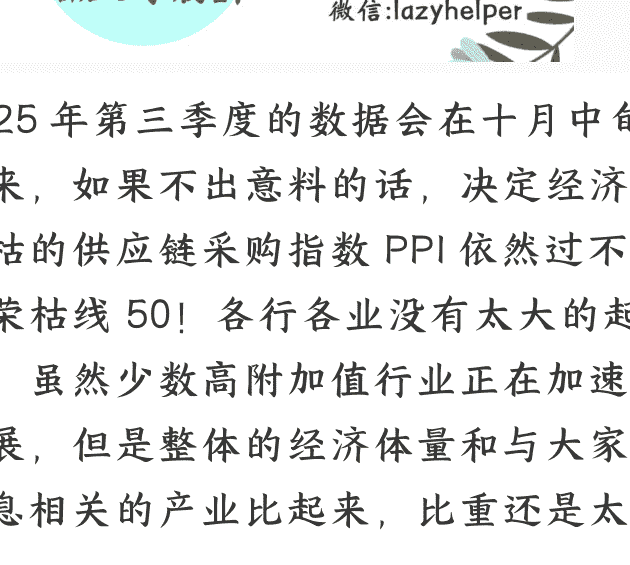

# 预估一切会在 11 月初结束

**250908** 守夜人总司令

整理：公众号懒人搜索，_懒人专属群_独享

懒人微信：lazyhelper

2025 年第三季度的数据会在十月中旬出来，如果不出意料的话，决定经济荣枯的供应链采购指数 PPI 依然过不了荣枯线 50！各行各业没有太大的起色，虽然少数高附加值行业正在加速发展，但是整体的经济体量和与大家息息相关的产业比起来，比重还是太少。

只有进入千家万户的产品才是大生意，只有与千千万万人的日常生活息息相关的产业才能决定整体进退。

当然了，本次 A 股行情是人为造成的，其目的是两害相权取其轻，一方面要提高下滑太厉害的国企的估值，另一方面就是避免大家竞相求稳去抢国债。不可否认，这两个目的都部分达到了，并没有完全达到，而且现实反馈和预期存在比较大的落差。不管是因为普通人觉醒了还是因为普通人没钱了，反正没有达到预期！

此时此刻，如果收兵回营，那也需要虚晃一枪，否则，就会形成踩踏一泻千里。

## **最后，安利小懒的付费群:**

懒人专属群 ( 介绍 )

> 📑 懒人专属群持续更新中，已持续运营 6 年，整理超 3000 份各类精选付费文章 & 年费社群干货，全部开放下载。

本资料为付费群内部分享，仅供真实有需要的朋友查阅 🙈

### **懒人专属群更新记录:**

- https://lazy2025.top/blog/record2

### **懒人专属群更新记录 (需梯子，备用 ):**

- https://lazybook.fun/blog/record2