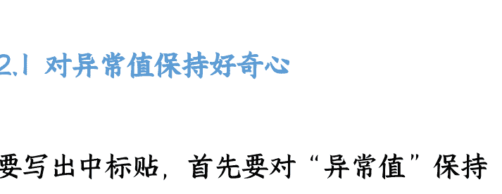
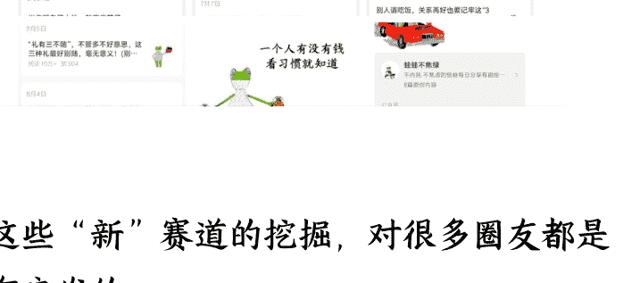
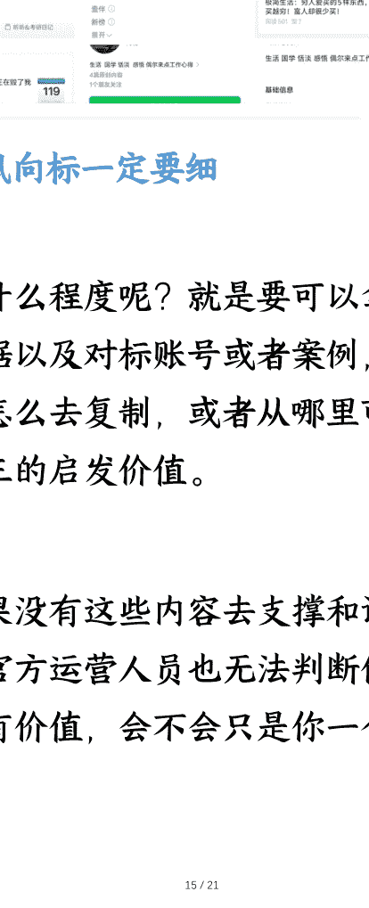
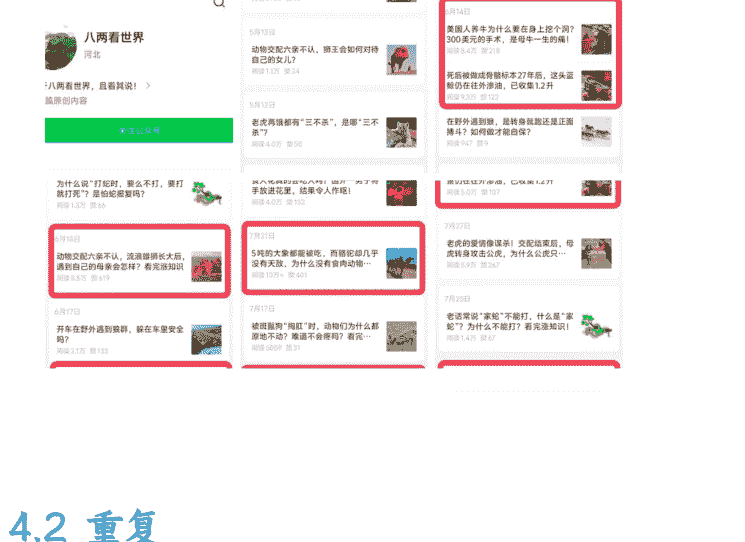
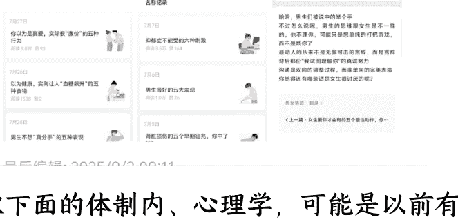
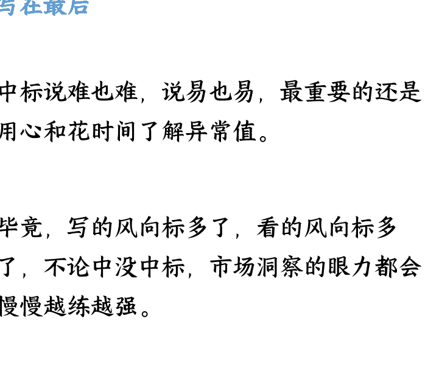
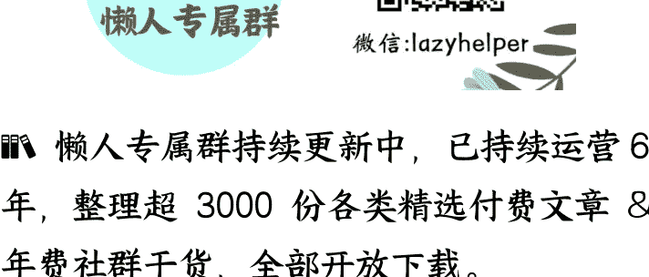

# 《持续中标 19 条，分享我的几点心得》

25/09/08 生财精华

公众号懒人搜索，**懒人专属群**独享

懒人微信：lazyhelper

大家好，我是嘻嘻姐。

98 年农村女孩，读研靠自媒体挣到人生第一个 20w，毕业第 2 年独立买房，之前跑通的项目有保研辅导和公众号，均变现 6 位数，目前主要在做私域变现。

最近一个月我都在深度融入生财，取得了一些成绩，比如：

- 邀请 260+ 位朋友领体验卡了解生财，种草成功 2 人；
- 搭建生财交流圈，聚集了 90 位对生财感兴趣的朋友，还挣到了两张生财门票，中了 1 篇精华帖；
- 8 月份在生财发了 18 条风向标，中标 12 条，截至 9 月 4 日，我在生财已累计中标 23 条；
- 成为 9 月份的【垂直小号】航海教练；

## 评论或@我

> 亦仁评论：感谢分享，已中标
>
> 2025/8/28 18:45
>
> ...
>
> 亦仁评论：感谢分享，已中标
>
> 2025/8/28 18:45
> ...
>
> 亦仁评论：感谢分享，已中标
>
> 2025/8/28 18:45
> ...
>
> 亦仁评论：感谢分享，已中标
>
> 2025/8/28 18:45
>
> 亦仁评论：感谢分享，已中标
>
> 2025/9/1 18:07
> ...
>
> 亦仁评论：感谢分享，已中标
>
> 2025/9/1 18:07
> ...
>
> 亦仁评论：感谢分享，已中标
>
> 2025/9/1 18:02

> - 亦仁评论：感谢分享，已中标
> 2025/9/4 17:01
> - 亦仁评论：感谢分享，已中标
> 2025/9/4 16:47
> - 亦仁评论：感谢分享，已中标
> 2025/9/4 16:47
> - 亦仁评论：感谢分享，已中标
> 2025/9/4 16:46
> - 亦仁评论：感谢分享，已中标
> 2025/9/3 14:33
> - 亦仁评论：感谢分享，已中标
> 2025/9/3 14:26

昨天响应亦仁大大的号召，发出了我的“生财好事”，因此吸引了官方运营楞楞的注意（特别感谢@楞楞的邀请），有了这篇约稿。

>>> ### 最新 **超级标** **生财好事** 生财朋友圈 :::::

### 生财好事航海好事

嘻嘻姐

2025/9/1 15:08

#生财好事#
8 月与生财最大的收获：

1. 邀请了 200 名左右的友友了解生财有术，有种草成功；
2. 搭建生财交流圈，聚集了 90 名友友，挣到了 2 张生财门票，将经验分享出来，中了一篇精华帖；
3. 连续发风向标，8 月中标 12 条。

>>> ### 最大的感悟：

> 越分享，越有收获。

在生财这个圈子里，我真切地感受到了什么叫做：越分享，越有收获。

大家从我的中标数据就可以看出来，我的中标率还是蛮高的，大概每 2 条就有 1 条中标。8 月前半月，在参与超级标研究员项目之前，只发 5 条风向标，就中了 5 条，点赞数都很高，我想也是有给圈友们带来一些启发的。

所以，这篇分享稿就来分享我的几点中标心得。

## Part 01 为什么写风向标

### 1.1 风向标是生财的千里眼

**第一次进生财，我用的是 3 天体验卡，当时一进生财就像着了魔，一天从早到晚刷生财，后台统计我一天浏览了 8~9 万字，当时我主要刷的内容就是两个：一是中标帖，二是精华帖。**

**老圈友都懂这两个 label 的含义，中标帖是风向标中的精华帖，通常发的是不同平台的新变化或者机会，而精华帖是实操经验贴中的优秀案例或者 SOP，所以我主要就是结合这两个 label 在学习（当然现在还多了超级术、超级标，也是非常重磅的学习内容！）。**

**对我来说，风向标就像生财的千里眼，圈友们将细致敏锐的市场洞察结果分享出来，然后大家通过这些细枝末节，去结合自己的经验实操，取得成绩，再反哺出不错的精华帖。**

**所以，我一直觉得风向标的中标帖是非常有价值的部分。**

### 1.2 每日刷中标帖子是习惯

只要保持在场，就有机会。要跟进不同平台的风向，就要日常多刷中标帖。

当时我注意到，我加入的不少副业相关的陪伴群，大佬们分享的内容，竟然有不少是拆解的生财风向标（优秀的人都聚集在了生财）。这，让我更加坚信，中标帖的价值。

而且，恰好当时我也有一个副业陪伴群，我开始在日常的分享中插入一些关于风向标的解读，并把每周一定为“风向标日”，用这种费曼学习法，我慢慢地就有了更敏锐的风口洞察能力。

### 1.3 初次尝试风向标便中标

在刷了那么多的风向标以后，我也跃跃欲试，我开始观察生活中的细节。

深圳是个年轻人的城市，也是个搞钱的城市，当我用心去观察，我看到了很多搞钱的方式，所以我最开始写的风向标，是围绕线下搞钱进行的。

第一条写的是“山姆体验卡”，第二条写的是“宠物上门喂食”，第三条写的是“三明治摆摊”......，这些都来源于我线下的经历以及搜索相关知识总结得来的分析。

这 3 条风向标一发，就中了 2 条，这在很大程度上激励了我在生财的继续分享与创作。

## Part 02 如何写出中标帖

在这个部分，我就结合前面提到的“山姆体验卡”来说说我的风向标产出全流程。

### 2.1 对异常值保持好奇心

要写出中标贴，首先要对“异常值”保持警觉，并且有很强的好奇心，设想怎么把这种异常现象与赚钱联系起来。

大家都知道山姆超市是会员制，都要办卡才能进，但是我呢，又担心这会员费用 260r/年花的不值得，所以就很想先去体验一波。

然后我对象就在小红书上查，看看有没有什么方法可以去体验，结果还真让他发现了方法——小红书上有很多人在发山姆会员体验卡，5 块钱一个人。抱着试一试的心态，我们联系了小红书上的博主，然后去了山姆超市。

去山姆之前，我们还担心那么便宜是骗人的，去了才知道原来真的可以这样做，只不过是比较隐晦的一种方式，要避开官方人员（有异常就有机会）。

### 2.2 学会拆解变现全流程

发现一个可能的挣钱机会容易，但是要验证确定性和需求情况，就还得拆解变现情况。

所以当我看到有人通过山姆会员卡变现挣钱，第一想法不是直接发，而是确定这个需求市场大不大，有没有可复制性，普通人能不能跟着照做。

购物完回来以后，我就仔细搜了一下“山姆会员体验卡”，然后发现这一块的需求在小红书上还是蛮多的，就肯定了，如果有山姆会员卡，且住得离山姆超市很近，通过这样的方式就完全可以变现。

### 2.3 搭配有力的数据与图

确定了这样的变现路径可行，还需要搭配上有力的数据和图片。

写出来的风向标不能只是单个人的感受和体验，要有足够多的调研数据和截图证明，所以我把小红书的相关图片，比如：我们联系博主的那篇笔记，笔记评论区的反馈，其他类似的帖子等信息，都打包一起，写成了一条风向标。

就这样，第二天就中标了。

类似的还有“宠物上门喂食”，当时临近假期，我家对面的邻居要出门旅游，一回来就碰到她们在交代宠物上门喂食相关的事情，我就在网上搜了相关的内容验证可行性，再搭配数据和截图，在假期这个特殊的节点前发出来帖子。

## Part 03 我的中标小心得

在写了这么多风向标，中了这么多标以后，我总结了 3 点小心得。

### 3.1 发风向标一定要快

快体现在两个点：一是有想法就马上写，二是有看到新的东西也要马上写。

第一个点很好理解，灵感是转瞬即逝的，如果你今天不写下来，明天就忘了，那就没有兴趣或者写不出来了。

第二个点也能理解，生财圈友那么多，敏锐的洞察能力不少人都会有，有人抢先发了，你的风向标可能就不一定能中啦！因为短时间内是不会评相似或者重复的风向标的。

### 3.2 发风向标一定要新

如生财平台运营@爽姐介绍，风向标一定要新，能捕捉到新的趋势、窗口或者玩法。

这里的“新”当然是相对的，只要大部分人不知道，并且有玩的前景，还算蓝海，就属于新内容。比如有圈友发过精华帖写 AI 漫画，赛道介绍的是明星、职场，但是这两个赛道很多人都写，已经有点红海了。

我当时想下场实操，又觉得太拥挤，我就不断刷账号，结果就让我发现了更令人惊喜的赛道，于是就有了下面这 3 条中标的风向标：

>>> ### 嘻嘻姐
2025/8/22 15:06

## 风向标# 公众号 AI 漫画赛道小众 10w+ 对标账号——育儿类 (王圈圈漫画生活)。

如果明星类、职场类写烂了，竞争的人太多，流量没法突破，这个新领域可以试试。

应了那句话，现在所有的赛道都可以结合 AI 漫画做一遍。

## 公众号##中标#

>>> ### 风向标# AI 漫画——人际关系赛道，起号速度很快，操作简单可复制！

账号案例：小哈儿

6 月底开始发 AI 漫画，写人际关系，半个月开始小爆，到现在账号有整体入池迹象，8 月份万阅的很多。

最重要的是内容也是很简单的，一篇文 4 张图，文末放个名片。

变现方式：
1.流量主
2. 私域带学员 (可复制性很强)

## AI##中标#

>>> ### 嘻嘻姐
2025/8/28 10:24 广东

## 风向标# 才注册两个多月，一篇起号，连发 3 篇都是 10w+，AI 漫画这赛道值得入场！

赛道：AI 漫画/鸡汤
账号案例：蛙蛙不焦绿

今年 6 月份注册的账号，注册完两天开始发文，随后 3 篇都是 10w+，后面也是 10w+ 爆款频出。

内容主要是蛙蛙角色➕鸡汤，换汤不换药，文案微调，用其他角色起号也不错，可复制性很强！
## 公众号##中标#

这些“新”赛道的挖掘，对很多圈友都是有启发的。

另外，如果你能观察到平台的新变化，也是非常容易中标的。比如：

>>> ### 嘻嘻姐
2025/8/18 12:29

## 风向标# 公众号流量主广告又有新的变化了！！注意这个小细节和风向，可能挣到不错的流量主收入。

这次的变化点主要在——留言区广告。

+   ⭐变化之前：评论区有留言区广告，但是投放很随机，不一定每个人都能刷到广告。
+   🎉变化以后：评论区只要超过 3 条评论，都会在第 3 条后面出现广告。

我今天用 3 个号看了下，都是有广告的。这就说明，里面又有 3 个点值得重视了！

### 风向标# 这个异常值值得关注：老号重启有流量，权重加分很明显！

案例账号 1: 叶听听

赛道转变：2023 年的老号，停更前写恋爱、极简等各领域无起色，那会应该是处于接广红利期，所以不靠推荐；停更后写考公日记，流量逐渐趋于稳定，时常爆万阅。

案例账号 2: 武律的茶馆

赛道转变：2023 年注册的老号，之前都是随意更新，阅读量很低，这个月重启，更新了一篇减肥相关的推文，流量跑到了 2.4w。

#### 3.3 发风向标一定要细

细致到什么程度呢？就是要可以拿出截图、数据以及对标账号或者案例，然后告诉大家怎么去复制，或者从哪里可以得出举一反三的启发价值。

因为如果没有这些内容去支撑和证明你的结论，官方运营人员也无法判断你写的内容是否有价值，会不会只是你一个人的猜想等等。

## Part 04 难中标的风向标

说完中标的心得，再来分享两个我认为比较难中标的风向标类型，算是对我那些我认为还不错，但是没中标的风向标的复盘。

### 4.1 过时

正如前面提到的，写风向标要快，风口通常是有窗口期的，过了这个时间就没有价值了。比如：你想写高考的相关内容，等到 8 月 10 号才来写，那显然关注的人就很少，因为已经高考完了，热度开始下降了。

最近我正在参加生财组织的超级标研究员活动，所以写的风向标基本上都是关于【垂直小号】的，找到对标账号，拆解成风向标后，有不少中标，剩下没中标的，大多有一个特性：不够新，也就是可能有点过时。

比如：下面这些四五月份起号的，肯定不如七八月起号的更具有参考性。

>>> ### 嘻嘻姐
2025/9/2 09:52 广东

## 风向标# 动物科普类赛道，半个月起号，垂直小号，可矩阵！

赛道：科普/动物
账号案例：八两看世界

数据：4 月下旬开始更新，半个月入池，一天多篇数据也很好。

## 为什么是机会？
可复制性很强，大多写的是“十万个为什么”，可以矩阵化，结合 AI 和新闻素材写作，挣流量主收入。图片可以在小红书或者其他平台搬运，甚至可以复用，像这个账号写狼和老虎就有很多图片是重复使用的。
## 公众号#

### 4.2 重复

另外，之前已经写过几条类似的，我们再去发就容易同质化，如果不是有新的创新点，就很难评上风向标，除非是距离上一条出现已经几个月甚至一年。

像我最近发 AI 漫画相关的风向标，前面三条都中标了，后面再发其他领域的，可能因为相近，就没有中标。

>>> ### 风向标# AI 漫画这个新挖掘的赛道，值得大家对标和尝试！可复制性很强。

赛道：AI 漫画/健康＋两性
对标账号：仔仔画日常

数据：今年 5 月份注册的新账号，前期更新常见的工作、职场赛道，没啥水花，随后开始切健康赛道，账号开始入池，最近又叠加了两性，数据也很不错。

为什么是机会？
每篇内容都是 6 张左右的图片，再加 300 字左右的描述，开通原创标识，可复制性也是很强的。

像下面的体制内、心理学，可能是以前有其他人发过类似的，属于传统爆文的对标方向，就也没有中标。

>>> ### 风向标# 更新频率随机，封面统一省事，但 10w+ 频出，内容简单，AI 可写，这个账号很不错！

赛道：职场/体制内
对标账号：小陈铺子

数据：据号主自己反馈，做公众号的收入快抵上主业了，10w+ 挺多，赞赏也经常有。

为什么是机会？
内容简单，几百字短文，可复制性强，用 AI 也可以实现批量或者矩阵化。

主要变现方式：
1.流量主收入（10w+ 爆文）
2.赞赏（戳中读者痛点，时常有赞赏）
3.每隔几篇放二维码引流（1v1 付费咨询）

## 公众号#

>>> ### 风向标#发现一个可复制性很强的公众号类型，“心理学上有个词叫……”。

赛道：心理学/心理词汇拓展

### 为什么值得做？

1.搜一搜发现了很多篇 10w+；
2.心理学是经久不衰的话题，可持续性很强。

不知道怎么做的，可以对标下面两个账号：Joo 心理自救所（3 月份注册的，爆款频出）、知识有复利（内容很多，可借鉴和找素材）。## 公众号#

### 写在最后

中标说难也难，说易也易，最重要的还是用心和花时间了解异常值。

毕竟，写的风向标多了，看的风向标多了，不论中没中标，市场洞察的眼力都会慢慢越练越强。

以上就是我的全部分享。

希望对喜欢刷风向标，且想要锻炼市场洞察能力和跟上风口的圈友能有启发。

最后，安利小懒的付费群：
懒人专属群（[介绍](https://lazyhelper.weixin.qq.com/)）

📝 懒人专属群持续更新中，已持续运营 6 年，整理超 3000 份各类精选付费文章 & 年费社群干货，全部开放下载。

本资料为付费群内部分享，仅供真实有需要的朋友查阅 🔞

懒人专属群更新记录：
https://lazy2025.top/blog/record2

懒人专属群更新记录（需梯子，备用）：
https://lazybook.fun/blog/record2