# 小红书装修赛道高客单变现复盘：半年成交 150 单，获客全解析

## 250908 生财精华

公众号懒人搜索，[懒人专属群](#)独享
懒人微信：lazyhelper

![img/88e6cd18dde02eb98f1cda526bbad92e_0_0.png]

我叫阿懂，八年连续创业者，加入生财快一年，装修赛道在小红书获客，150 单成交、变现百万。客单价：2 万 -20 万，如果你是以下圈友，这篇文章对你来说有用。

- **1、**总追新项目，想有属于自己的可持续的生意
- **2、**高客单消转率低，想了解建立深度信任的方法
- **3、**实体老板想在小红书获客，想赶上互联网
- **4、**相信“真诚”力量的长期主义者同时坚信赚钱的尽头不是机械重复的话术，而是人心

![img/88e6cd18dde02eb98f1cda526bbad92e_1_0.png]
![img/88e6cd18dde02eb98f1cda526bbad92e_1_1.png]

这篇复盘，你将收获的是一个项目复盘，更是一份可参考的精细化运营干货。我的主打品：真诚。我相信，这种坦诚将是我和你之间的桥梁。

你会得到：像素级的细节与实操性。我将毫无保留地分享所有可以被你‘拿来即用’的干货。深刻且超越表层技巧的洞察。我对家装以及高客单赛道的判断和平台本质的思考，对于你来说可复制的心法。

我最终的目的，不是分享一个多么多么成功的案例，这种交给其他大佬吧，比如圈友@晴天和@易芝分享了绝对运营人风格的复盘 SOP，足够的互联网，足够效率。

而我想传递一种在当下我所坚信的基于实操所悟出来的价值观：

尊重常识 坚守真诚
做简单而正确的事

也许作为 ENFP
永远不能停止追求意义，既然如此，那就忠于自己吧！来，坐下一起边吃边聊。其中有关于我个人成长、搞钱心法、实战 SOP、行业洞察和人文的一些些思考。

如果能让你在搞钱路上，得到小小的帮助
那我将得到满满的正反馈

## 一、自报家门

我叫阿懂

专注于广州、深圳两地也辐射江门佛山东莞等珠三角地区，不是装修公司，不做全包，不卖材料。核心产品就是为业主提供靠谱的、手艺精湛的工长或施工队，进行半包或单项施工服务。

目前整个施工队伍有 15 人，由工长统一联系管理
我个人负责在小红书等平台获客。

毫无保留地公开，我和我可爱的工长以及工友们～如何在非常卷的垂直装修赛道，半年里，通过小红书获得结果；关于信任、人性与精细化运营的深刻洞察。我验证回归本源的基于信任的高客单变现打法是完全可行；分享一些“忘掉技巧”背后真正的搞钱力量。

### 1、核心战绩

通过 7 个小红书矩阵号（粉丝都不过百），在半年时间内，累计成交了 150 多个订单。

客单价：2 万 -20 多万不同档次的全屋半包及单项工种需求。

流量数据：项目以来获取约 300 客资
转化率：所有咨询线索的最终成交转化率，稳定在 50%左右。

我有时太佛系了，效果全靠 enfp 的天赋，没有 sop，如进线回复不及时、没有强推销以及有些单太小或撞期就取舍了。

利润模型：目前只收客资钱，如果是推荐单个工种（如瓦工、电工），收取固定的介绍费，约 500 元/单。如果是推荐整个半包工程，我向工长收取成交额的 3%作为佣金，主要工长是熟人，这个分润也许不具参考价值，我和工长是强合作关系，前期我以学习装修行业为主，后续或考虑项目利润分成的合作。经过与圈友交流，有些装修公司佣金有不同方案，正在调研学习中～

![img/88e6cd18dde02eb98f1cda526bbad92e_4_0.png]
![img/88e6cd18dde02eb98f1cda526bbad92e_4_1.png]

你可能会好奇，只收 3% 的佣金
这个生意怎么赚钱？

### 2、先了解投入成本

**1）成本**

7台200块的手机
7张手机电话卡
其他几乎全部是“人的成本”和“时间的成本”

**2）隐性成本**

从前期与客户建立信任，到中期协调各种细节，再到后期处理可能出现的售后问题，每一个环节都需要深度的时间投入。

实际上从打粉获客的角度，客户加上微信或者交定金，我的任务就结束了，给我返佣就行，我前期为了深入洞察行业每个环节以及拍素材，所以我一一跟进

交通与杂费：我个人每周跑工地的交通费、与师傅们吃饭联络感情的费用等。

那我的商业思路怎么考虑？
先从一开始说起吧

## 二、找到了赛道获客的打法

### **偶然的开始：**一篇“无心插柳”的笔记带来的意外流量

当时，加入生财后，同时开启了多个项目。在生财看到一个风向标，分享的是家装赛道笔记，坦白说，装修当时不被我看好。我的内心充满了抗拒和怀疑：平时我是穿得光鲜亮丽的人，怎么会去做又脏又累的装修？”对不对？看起来还那么“重”，那么传统，与我所追求的“轻盈”和“美好”的搞钱模式完全不同。

调用了唯一的资源，是家人介绍认识的一位本地工长。当时的心态，更多是“顺手一试”，甚至带有一点完成任务式的敷衍。

在运营其他几个“重点”账号的同时，抱着“说不定能帮工长接个单，也算做件好事”的简单想法
就从风向标里，顺手复制粘贴，发布了一篇极其简单的“无心”笔记。

![img/88e6cd18dde02eb98f1cda526bbad92e_6_0.png]

#广州装修 #装修#广州装修工长#广州工长#广州靠谱工长#瓦工#瓦工铺贴瓷砖#贴砖#装修必备# #广州装修#装修#广州装修工长#广州工长#广州靠谱工长#瓦工#瓦工铺贴瓷砖#贴砖#装修必备#装修师傅。
2024-09-06 广东

有强烈的功利心，所以内容足够真诚；因为不抱过高的期望，所以姿态足够松弛。
但我也克制了立即规模化。虽然在生财里，学习到各种各样的知识，有不同的放大打法及丰富流量结构的思路，但我选择了更慢也许更稳，相信慢慢来会更快的方式：先与每一位前来咨询的客户、与工长和工友进行大量的深度沟通。

![img/88e6cd18dde02eb98f1cda526bbad92e_8_0.png]

那段时间，思考了很多
大抵是这种“无为”的状态，恰恰击中了当下小红书用户对“过度营销”的反感，回归了“种草”的本质：真实的分享永远比精美的广告更有力量。

相信很多人会以为，包括我以前也是，觉得小红书一定要精致，设计得很好看，一定要帅哥美女，原来未必。更重要的是，它完美契合了装修这种高决策成本、长服务周期行业对“信任”这一核心要素的底层需求。

尤其是在经济下行周期，人们的消费决策变得前所未有的慎重而务实，追求性价比、害怕被坑、寻求确定性，成为了最主流的消费心理。我这样的方式，恰恰完美地回应了这一切。

后来发现答案逐渐清晰："无心生大用"。

![img/88e6cd18dde02eb98f1cda526bbad92e_10_0.png]

理解了背后的传播原因，但我仍然在最真实的场景中，去工地感受工人的辛苦，在咨询中、在工地去倾听业主的焦虑，去理解最真实的痛点。

很快，我发现寻求装修的业主，无论预算多少、需求如何，内心深处都萦绕着四重难以言说的、共通的恐惧。嘴上说要的是一个“靠谱的工长、神仙工长”，但他们内心真正渴求的其实是另外的东西。

## 核心洞察：业主真正恐惧的是这些

**财务恐惧：**这是最根源的恐惧。害怕被坑，担心预算是个无底洞，报价单里全是看不懂的陷阱和后期增项。很多业主是掏空了几个钱包，赌上了半辈子的积蓄买的房，每一笔支出都伴随着巨大的焦虑。“怕被坑”，是悬在他们头顶的一把剑。他们看过太多装修公司跑路、合同欺诈的新闻，这种行业性的信任危机，让每一个从业者都背负着原罪。

**质量恐惧：**担心工艺不过关，材料以次充好，隐蔽工程留下后患。网络上无数的“装修翻车”案例，加剧了这种不安全感。大部分业主其实对具体的施工标准没有概念，他们害怕的，是这种“信息不对称”所带来的未知风险。他们不知道什么样的瓦工才算好，什么样的水电才算合格，这种未知放大了他们对质量的担忧。

**过程恐惧：**害怕与工长、工人沟通不畅，工期无限延误，过程中出现问题时遭遇扯皮和推诿。他们害怕的，是整个装修过程，变成一场长达数月、心力交瘁的“战斗”。白天上班，晚上还要操心工地，这种双重压力足以压垮任何人。

**决策恐惧：**面对海量的风格、繁杂的材料和无数的方案，普通人会瞬间陷入“选择困难”。他们害怕因为自己的一个错误决策，导致未来十几年居住体验的下降，这

种决策压力是巨大的。小红书上精致的案例越多，他们的决策焦虑反而越重。

这一深刻的洞察
进一步发现核心价值：平台已经有海量的、免费的、高质量的设计灵感和避坑攻略，解决了“怎么装好看”的问题。但在决策的后端，也就是“找谁来装”这个最关键的环节却依然是一个信息极度不对称、信任成本极高的机会。业主不缺风格，缺的是一个能把风格完美落地的、信得过的人。

让我彻底明确了：战略确立：放弃“卖服务”
![img/88e6cd18dde02eb98f1cda526bbad92e_12_0.png]

装修赛道卖的不是设计风格也不是施工服务，而是业主那个说不出口的真正需求，一种极其稀缺的情绪价值：

### “安心感”
或者是“决策的安全感”

辅导员说，要抓主要矛盾
那么这个主要矛盾将在这个项目里贯穿始终

作为 ENFP，我最大程度地尝试用理性的实操的表述去分享这一种感觉~原始阶段虽然很佛系首月一个帐号有 20-50 个精准咨询但我做出了一个重要的决定：All in
开始确立了一套“反营销”打法 1.0

## 三、核心打法：一套“反营销”的信任 SOP

### 1、定位：人设怎么立？

果断不做“装修专家”号。发现在小红书上，讲专业、做科普的内容太多了，这些内容能带来收藏，却带不来客咨。客户在看遍了所有攻略之后，最终需要的不是再多一个老师，而是一个能帮他落地执行的、信得过的人。

只专注地讲好一个朴素的故事：真诚推荐一个有着三十年经验、手艺精湛、为人老实，甚至有点“笨拙”的广东老师傅，如何用心地帮你把家装好。这种“邻家大叔”般的人设。这个方向内容能瞬间瓦解了用户的防备心理，拉近了彼此的距离。这正是《种草》里提到的，用‘朋友’的身份去沟通，信任的建立是自然而然的。

你想象一下，小时候的一个夏天，村里某个傍晚，家里的老保险箱突然短路停电，你家里人喊来隔壁村认识了几十年的老电工，一家人看着电工修理，结束后喊他一起吃饭的场景。他是商人吗？他是生意人吗？他是老板吗？
感受一下这一个是怎样的“人”

### 2、内容：笔记怎么发？

我很快发现，那些设计精美、如同艺术品的效果图，虽然能获得很多点赞和收藏，但就像你逛艺术展，欣赏赞叹，却不会购买。因为“好看”不等于“我家也能这样”，精致的图片反而会产生距离感让预算有限的普通大众望而却步。

目标客群主要也在广东地区，这里的业主普遍务实，追求性价比。因此，果断放弃了网红风、极简风等看起来“高大上”但未必实用的风格展示。所有内容都围绕一个核心主题：“如何用好业主的每一分钱”。

我拍摄的施工现场照片，甚至有些杂乱，因为那才是真实工地的样子，内容几乎是最接地气的避坑建议和装修进度以及大量的个人生活动态。这些看似不完美的内容，构建了一个个真实的消费‘场景’，让用户相信‘这事儿是真的’。同时我的内容核心，不是创造焦虑，而是让人少焦虑。

在《弱传播》这本书中，有一个重要观点：放低姿态，主动示弱，更容易拉近距离。所以我宣传的工长不是“大师”或“装修老板”。他就是一个养家糊口、赚辛苦手工费的普通人。比如引流端，与客户的沟通中，我也坦诚地告诉对方：“师傅人很好，但不太会说话，你多理解。”这种主动“示弱”的“弱传播”姿态，反而让用户觉得无比真实和亲切，降低了信任成本。

因为一个高高在上的“老板”或者装修公司是有距离感的，而一个朴素的“老师傅”却是可以信赖的。

![img/88e6cd18dde02eb98f1cda526bbad92e_16_0.png]

### 3、流量：流量怎么来？

#### 1) 账号准备

7 个账号，2 个工长号，5 个素人号
每一个账号都不是冰冷的营销工具而是一个有血有肉的“角色”

我的矩阵逻辑不是广撒网，饱和式攻击
而是通过多个人去构建一个关于“靠谱”的信任场域

![img/88e6cd18dde02eb98f1cda526bbad92e_17_0.png]

> 《有血有肉》

#### 2) 账号基建 (人设)

**账号选择：**优先选择超过半年的个人老号，权重更高，更符合“真实用户”的设定。IP属地必须与目标城市（如广州）一致。

**头像：**生活化、有温度，符合人设。我实际上是在小红书搜索头像，随便选的一个合适的。

#### 3) 装修帐号养号 SOP

**Day 1-2:**让算法知道“我是谁”，我喜欢看什么。

操作步骤：
- 1、登录与设置：确保账号在一台固定的手机上登录，使用4G/5G网络，避免使用公共Wi-Fi。完善个人资料，但不要留任何联系方式。
- 2、主动搜索：每天花15-20分钟，主动搜索与你人设和业务强相关的关键词。例如，我们的目标是广州装修，那么就要搜索：“广州装修”、“广州工长”、“小户型改造”、“装修避坑”、“奶油风客厅”等。
- 3、深度浏览：在搜索结果页中，点击进入那些看起来内容优质的笔记，进行深度阅读，停留时长至少超过40秒。这是关键，快速划走会被认为是无效浏览。
- 4、模拟完播：如果看到视频笔记，尽量完整地看完。完播率是平台判断内容质量的重要指标。
- 5、少量互动：每天对5-6篇你真正觉得不错的笔记进行点赞和收藏。收藏的权重高于点赞，因为它代表了更强的认可。

▲注意事项：这个阶段，只看不说，做一个安静的“潜水党”。

**Day 3-4：**让算法知道，我不仅会看，我还会思考和交流。

操作步骤：
1、继续执行Day 1-2的操作，保持浏览习惯。
2、发表“有效评论”：每天在5-7篇相关笔记下发表评论。评论不能是“点赞”、“👍”、“不错”这类无意义的灌水。要像一个真实用户一样提问或表达观点。例如：“博主，你家这个地砖是什么牌子的呀？好好看！”或者“这个避坑经验太实用了，我家差点就踩坑了，感谢分享！”

**操作步骤：**
1、发布第一篇“生活化”笔记：这篇笔记绝对不能和你的业务相关。它必须是符合你“素人”人设的、真实的、生活化的内容。例如，如果你的人设是“在广州打拼的90后女孩”，你可以发：“周末在永庆坊发现一家宝藏咖啡馆，太治愈了！”或者“我家猫主子又在打呼噜了，可爱到犯规！”配上几张手机随手拍的、未经精修的图片。

养号的逻辑是：
我是一个活人，不是营销机器。
我对“装修”有浓厚的、真实的兴趣。
我是一个值得信任的消费者，未来也可能成为一个优质的内容创造者。

### 4) 内容创作：通过 A/B 测试找到出客资的笔记

在内容创作上，我也走了不少弯路。最终，是通过系统性的 A/B 测试，才找到了能够稳定带来精准客咨的内容笔记。我的核心思路是，将不同类型的内容视为变量，通过控制变量法原理，以“能否带来有效私信”为唯一的衡量标准，进行多轮测试和筛选。

#### 第一轮测试：高互动笔记 vs 低转化

**测试内容：**我最初尝试了市场上最主流的四种笔记类型：
- - 故事（如“装修好累，但看到新家一点点变好又很治愈”）
- - 攻略（如“水电改造 30 个细节”）
- - 日记（如“我家瓦工师傅贴砖 vlog"）
- - 观点（如瓦工的工价为什么是最贵的）

测试结果：这类笔记的数据非常“好看”，点赞、收藏量都很高，也能吸引一些粉丝。

结论：不否认它们是很好的内容，能够提升账号权重，建立用户的初步好感。但它们的致命弱点是转化效率极低。用户看完后会觉得“你很棒”，但很少会主动私信“求推荐”，因为内容本身没有提供强烈的行动指令。

#### 第二轮测试：找到“有客资的笔记”

**测试内容：**基于第一轮的教训，我开始测试目标更明确的“硬广笔记”。
可以理解为楼下路边张贴的小广告
它的唯一目的就是告诉用户：“我是谁，我能帮你解决找个靠谱师傅的核心问题。”

测试结果：这类笔记的互动数据可能不如前者，但私信率却呈指数级增长。

结论：在小红书这个“搜索引擎”里，用户带着问题而来，直接给出解决方案的内容，转化效率最高。

总结有效的内容模型与客群匹配
后期实践证明，素人号带来的客咨远多于工长号
因为它们更接近于那个最初的“0-1”

#### 一个真实的分享者

经过多轮测试，我目前最终锁定了三种转化率最高的模型，并发现它们分别对应着不同的目标客群：

**业主角度推荐自家工长：**（一定是偷拍的背影）
内容核心：以第一人称，充满真情实感地讲述自己“踩坑无数”后，如何幸运地遇到一位“神仙工长”，解决了哪些实际问题，省了多少钱。
目标客群：高度谨慎、依赖口碑的客群。这类用户在决策前会做大量功课，极度看重“真实案例”和“素人推荐”，这篇笔记完美地满足了他们的“眼见为实”的心理需求。

**子女角度推荐父亲：**（一定是特写笑着对镜头）
内容核心：讲述作为工长的子女，看到父亲手艺好却不懂网络营销，因此帮忙发帖。这种视角充满了家庭的温情和孝心。
目标客群：注重情感链接、相信传统手艺的客群。他们更容易被故事背后的“人情味”打动，信任的建立来源于对这份“孝心”和“匠心”的认可。

**大字报形式：**（一定是随便）
内容核心：用简洁有力的大字报图片，直接突出“广州靠谱工长”、“挖到宝藏瓦工了”等核心卖点，视觉冲击力强。
目标客群：目标明确、时间宝贵的客群。这类用户往往是带着明确的关键词来搜索的，他们不需要冗长的故事，只想快速找到解决方案。大字报形式能让他们在 0.5秒内 get 到核心信息，从而高效转化。

真正满意的业主才会偷偷拍工人，因为尴尬社恐、对着子女才面带微笑最有共鸣、不会玩小书书的真实路人才这样随便大字报分享真实真实真实的人人！！人

**看到这里**
你现在尝试去小红书搜索一下装修你就能感受到了

![img/88e6cd18dde02eb98f1cda526bbad92e_24_0.png]

### 4、转化“必杀技”：私信怎么聊？

当精准流量进入私信或者微信后，将搞钱交易转化为人情链接。每一步操作，都是为了将“安心感”这个情绪价值拉满，完成从路人到信任。

因为我发现，无论是以前面对领导大人物还是面对今天的业主，信任的建立都遵循同样的原则：从公事到私事，从官方身份到个人身份的转变。当对方愿意和你聊家庭、聊生活时，信任的桥梁才算真正搭建起来。

#### 1、引流私信信任三招

当用户私信求推荐时，全程保持个人分享者的角色，绝不出现“我们公司”、“我们团队”等词语：

**第一步（共情与肯定）：**“收到收到！找个靠谱师傅确实太重要了，我当时也找了好久，踩了不少坑。”和对方拉上家常，聊聊装修经历或者最近的进度。

**第二步（推荐）：**“我把当时负责我家的那个工长名片推给你吧，人确实挺实在的，活儿干得也细。”

△□一定不能复制粘贴当作话术去转化，需要灵活处理，就好像鱼丸和你聊天也不是单纯复制粘贴话术一样。

## 第三步（边界与抽离）： “你直接联系他就行”

此时，转发工长的微信名片，或者用一种更原始的方式：将工长的电话手写在一张随手撕下的纸片上拍照发过去。这个细节充满了施工现场的“即时感”，巧妙规避了平台检测，更传递出一种不加修饰的真诚。

但后面我迭代了更保险的导流方式，让对方发联系方式后，在微信里再推荐工长。

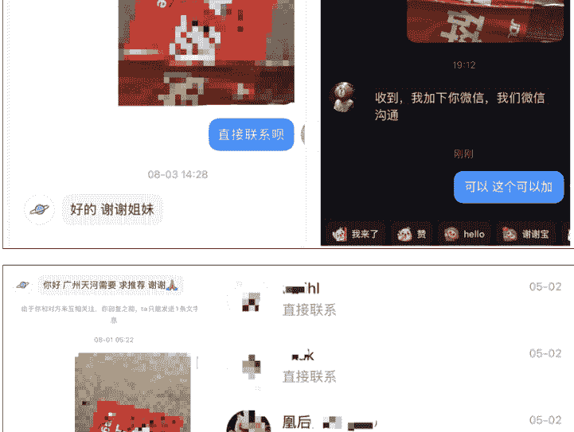
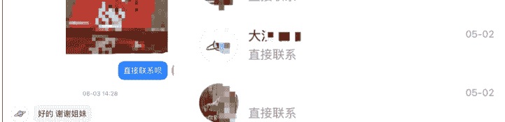

## 5、临门一脚：一些私域信任方法

远程粗报价，定金前置：这是我筛选意向客户、同时体现工长专业价值的关键一步。坚持尽量“不免费量房”，客户需先提供户型图和详细需求，工长会根据三十年的经验给出一个相对准确的远程报价（上下浮动不超过 10%）。如果客户认可这个报价范围，再支付 500-1000 元的定金，工长才会安排时间上门精量。

我向客户真诚解释：“时间宝贵，老师傅一天工时费就不少。免费量房看似福利，其实是对专业的不尊重，老师傅也要赚钱养家的。定金是为了过滤掉只是随便问问的人，确保师傅的时间花在真正有需求的业主身上。绝大多数真诚的客户都能理解并接受，这第一步就筛选出了有诚意的客户。”

我们从不用打印出来的、格式精美的报价单。工长会用他那本用了多年的、边角泛黄的笔记本，亲手为业主一笔一划地算账，并用大白话详细解释每一项的由来。这份手写的报价单，虽然在传统意义上“不专业”，但比任何电脑打印的表格都更能传递“朴实无华”的信任感。

它告诉客户：跟你对接的，是一个实实在在的手艺人，而不是一个精于算计的商人。一个 70 后的老师傅，天天在工地忙碌，不会用电脑排版精美的报价单，这本身就是最合理、最真实的人设。

绝杀一步：在客户打定金时，工长会用最平常、最自然的语气说：“你把钱打给我老婆账户就行了。”这句话堪称“绝杀”。

它瞬间将一场冰冷的搞钱交易，拉入到了一个基于家庭、责任和信任的温暖场景中。

业主在这一刻感受到的，是他将自己的家托付给了一个鲜活的、有担当的、值得信赖的家庭。这一步，往往能打消客户最后的疑虑，其建立信任的能量，远超任何专业的话术。

## 6、你一定会问工长朋友圈发什么？

我能告诉你的是：没有丝毫设计的原生感，你可以去写字楼下找个吃饭的餐厅，那个餐厅很忙很忙的朴实的老板大叔，就吃完饭，加他微信，你就懂了。

工长很久才发一条，发的都是老婆孩子和节假日回家探望老人的一些，甚至谈不上精美的朋友圈。我想说的是，做真实的自己最有力量。

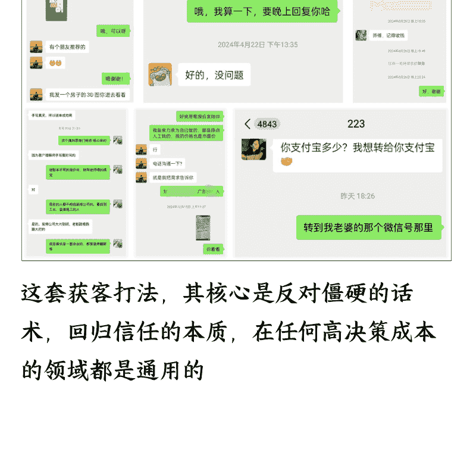

## 四、交付是 1，流量是 0：如何把“安心感”做成更完整的产品

这套获客打法，其核心是反对僵硬的话术，回归信任的本质，在任何高决策成本的领域都是通用的。实际上这些思路，都是我从我的工友身上学习到的：工匠精神、工匠品质、工匠形象，都来自鲜活的工友们几十年的工作经验。“笨拙”但能显得极致真诚的信任：做一个真诚的、真实的人。

## 1、成交不是结束

我所说的“安心感”，如果只停留在自己的叙述中那它永远只是一个概念，让你更真切地理解把安心感贯穿始终。

## 2、三大典型客户交付实录

#### 1）预算有限的年轻夫妻

一对典型的 90 后“上车”夫妻，在广州买下了一套二手小两房。掏空积蓄付了首付后，他们的装修预算被压缩到了极限。他们最担心的，就是遇到无底洞式的增项，害怕自己不懂行而被坑，最终“烂尾”。

工长并没有急于报价，而是花了一个下午的时间，帮他们梳理需求，做“装修断舍离”。告诉业主：“你想要的这个电视背景墙，好看但不实用，省下来可以把全屋的五金都换成进口的，能用二十年。”在整个施工过程中，每一笔材料费，工长都会让商家直接和业主结算，自己绝不经手。

### 2）要求极高的完美主义的设计师

这个女生是一位设计师，对审美和细节有着近乎苛刻的要求。她找我们之前，已经 pass 掉了三家装修公司，原因都是“细节经不起推敲”。她最害怕的，是工人的审美和工艺，无法将她的设计理念完美落地。

这就是我后面会提到的那位“至暗时刻”的客户。面对她的高要求，我本人和工长全程驻场，对于每一个细节，我们都主动邀请她现场确认。对于她提出的工艺难题，工长会和师傅们一起研究，甚至专门为她打样测试。

### 3）对装修一无所知的小白

他是典型的互联网大厂“大忙人”，常年 996，对装修一窍不通。最担心的，就是装修会耗费他大量的精力和时间，影响工作。他需要的是一个能让他“完全不用操心”的解决方案。

从一开始，我们就建立了一个包含了他、我、工长和核心师傅的微信群。每天，工长都会在群里用图片和短视频汇报当天的施工进度；每周，我都会为他整理一份详细的《项目周报》，让他清晰地知道本周完成了什么，下周计划做什么，需要他配合决策什么。

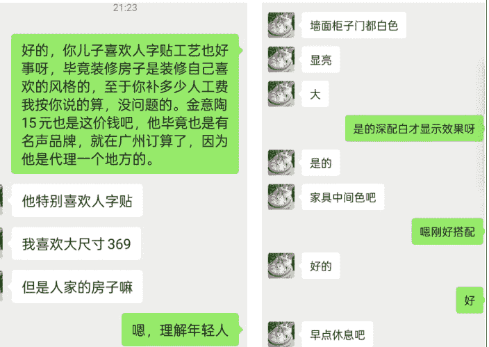

这些做了几十年手艺活的工匠来说，“把活干好，让业主放心”已经刻在了他们的骨子里。他们不是生意人，毫米之差就是他们的职业信仰。

在施工过程中，工长会定期给业主拍照汇报进度，主动沟通计划。这种持续的沟通，本身就是一种情绪价值的提供。

### 3、为什么坚持？回答开头的问题

综合计算下来，净利率大约在 1.5%-2% 之间。也就是说，一个 10 万元的单子，我最终的净利润大概是 1500-2000 元。这可能是一个“苦差事”。

#### 1) 从利润率来看

我所遇到的，一般来说 15 天，最快试过一周。装修不像买房子，相对更高的决策时间成本，装修要赶工期的，几乎是有一个结束时间，比如赶结婚的婚房、年底要入住等。

#### 2) 从成交周期来看

我看的是不是单个项目的利润率，而是客户的终身价值和口碑的复利效应。我真诚地服务，获得高达 90% 的转介绍率。一个满意的客户，在未来几年内，可能会带来 2-3 个新的客户。实际上很快就介绍新的客户了，这样来的客户，几乎没有获客成本，带来的利润，才是这个赛道能够长期健康发展的核心。同时重视客户的终身价值，对我而言，是一个值得专注的事业。

#### 3) 从口碑和复利来看

其实这也是常识，注重服务交付重的生意，不能迅速规模化，流量化，赚快钱呀。和工匠精神就违背，一旦想着赚快钱，交付就不好，好师傅就这么多，师傅的时间也有限，做这种非标高客单，就是要考虑做成自己愿意沉淀的事业。

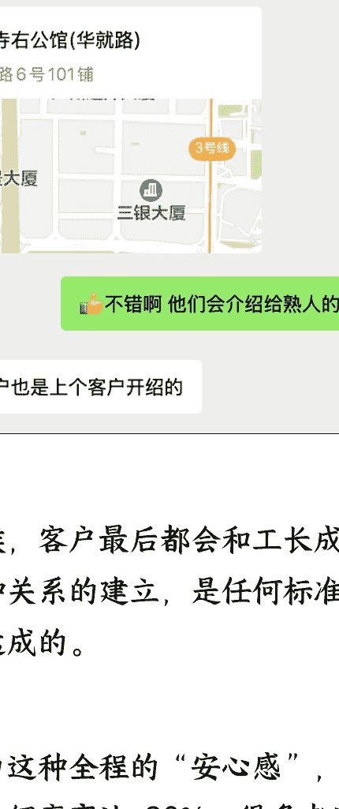

很多时候，客户最后都会和工长成为朋友，这种关系的建立，是任何标准化 SOP 都无法达成的。正是因为这种全程的“安心感”，我们的业务转介绍率高达 90%，很多老客户不仅自己成为了我们的“野生代言人”，甚至会主动帮我们去宣传，给新客户分享经验。我交代工友在完工后，请业主帮忙宣传一下，大部分业主都欣然应允。当然在一个工期的接触中，我已经潜移默化地暗示了业主介绍客户会给他返佣金，并偷偷教会他发小红书。那很多人会问我，在业主间，我是什么角色身份？只是一个默默无闻跟着老师傅后面的小工，但屁话多就是了。

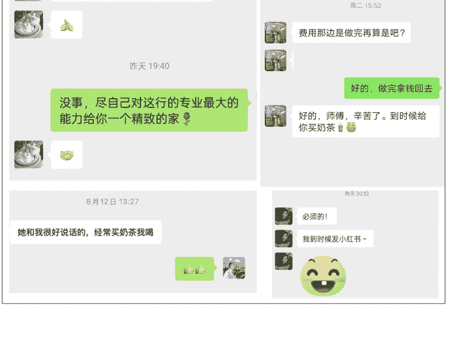

## 五、复盘与避坑：走过的弯路和沉淀的经验

### 1、踩过的坑

出来混，迟早要还。
“真诚”这把利剑在现实世界中也有脆弱与坚韧的时候。

**错误 1：**陷入“流量焦虑”，把内容做得越来越“专业”。

在第一篇笔记爆火之后，我曾一度陷入了“流量焦虑”。我天真地以为，只要内容足够真诚，平台就应该给我源源不断的推荐。

我们尝试过制作更加“专业”、更加“干货”的内容：
比如详细讲解水电改造的 30 个细节、分析五种流行地砖的优劣。投入了大量精力，图片拍得更清晰，文案写得更严谨。
结果呢？点赞收藏确实多了，但私信咨询却寥寥无几。

**错误 2：**被“投流”诱惑，差点走上岔路

我们也曾被“投流”的巨大诱惑所吸引。看到圈友通过付费流量快速起量，也浅浅尝试，带来的咨询量却屈指可数，且客户质量远不如自然流量来的精准，当时可能是我的付费投流经验不够，浅尝辄止。
像比如近期认识的圈友@晴天和@易芝学习，一个绝对低成本地分发和一个付费投流高手。

#### 2、我到底错在哪里？

**错在：**战术上的勤奋替代了“战略上的懒惰”。

忘记成功的根本：不是因为我更专业，而是因为我们更“像一个真实的用户”。关键的动作应该重复做，没打透前，不要换新的打法和思路。

**错在：**内容越“专业”，就越像广告；越缺乏“素人感”，离用户就越远。
当我的动作越“功利”比如投流、同个账号频繁发成交帖，平台算法和用户就越会警惕。

#### **最后反思：彻底坚定了“反营销”的战略**

不再追求数据的华丽，不再焦虑流量的波动，而是回归初心，只专注于一件事：持续地、笨拙地、真诚地讲好我的工友们以及与业主之间的每一个小故事。在多个账号里交替活跃。

### 3、遇到的项目交付问题

面对客户的质疑，直击内心的“灵魂拷问”。

曾遇到过一位极其“完美主义”的客户，前面有提到。她对每一个施工细节的要求，都近乎苛刻。一块瓷砖的缝隙差了一点点，她会要求全部敲掉重铺；墙面刷漆的颜色有极其微小的色差，她也会无法接受。
那段时间，工长和师傅们被折磨得苦不堪言，我也承受了巨大的压力。一方面，我理解客户为新家倾注的心血和期待；另一方面，我也深知传统手工艺的极限，有些“瑕疵”在所难免。内部开始出现抱怨的声音：“我们赚的只是辛苦的手工费，没必要这么伺候吧？”
它考验的，不再是工友的技术，而是我的价值观：我所标榜的“为客户提供安心感”，究竟是一句营销口号，还是我真正信奉的准则？

最终，我做出了选择。和工长商量没有去和客户争辩“标准”，而是选择和站在一起。我跟工长一起亲自去工地，拿着尺子，陪着她一寸一寸地检查。对于确实存在瑕疵的地方，我们二话不说，坚决返工，所有成本我们自己承担。对于一些工艺上无法避免的问题，我则耐心地、真诚地向她解释背后的原理。

整个过程虽然痛苦，但结果却是出乎意料的。当工程最终交付时，这位最“挑剔”的客户，反而成了我们最忠实的拥趸。她不仅在自己的朋友圈里大力推荐，甚至还为我们介绍了好几个大客户。

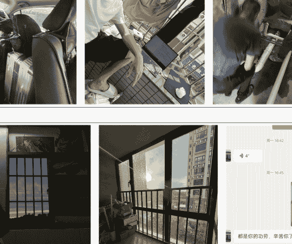
真正的真诚，是敢于直面问题，勇于承担责任，并始终与客户站在一起的坚定立场。

#### 4、遇到的一些其他问题

**1) 解决孤独感：**当全世界都在教你做“加法”要快快快~~

初期，每天都会被各种“秘籍”轰炸。身边的朋友都在讨论如何通过投流快速起量，生财社群也有大量的生财好事。而我，却在坚持做一件最“慢”的事情。当我的其中一个账号一个月只有零星几个咨询时，那种自我怀疑是巨大的。我会反复问自己：是不是我错了？
对抗这种孤独感，我没有更好的办法，只能选择“屏蔽”。减少了无意义的社交，把更多的时间花在和客户、和师傅的深度沟通中。我发现，当你离用户越近，离炮火声越近，你就离那些虚无缥缈的焦虑越远。

**2) 心态管理：在不确定性中寻找“锚点”**

做本地生活服务，流量的波动是常态。可能这个月咨询爆满，下个月也许就无人问津。这种巨大的不确定性，足以摧毁任何一个创业者的心态。
我的“自愈”方法，是为自己寻找一个超越数据的“锚点”。这个锚点，就是我在前面里提到的“意义感”。每当心态失衡时，我就会去翻看客户的好评，去回想师傅们拿到工钱时满足的笑脸。我会告诉自己：

> 我正在做一件正确且有价值的事
> 即便它很慢，即便它不酷
> 但它能让我睡个安稳觉，且有意义
> 这个念头，比任何数据都能给我力量

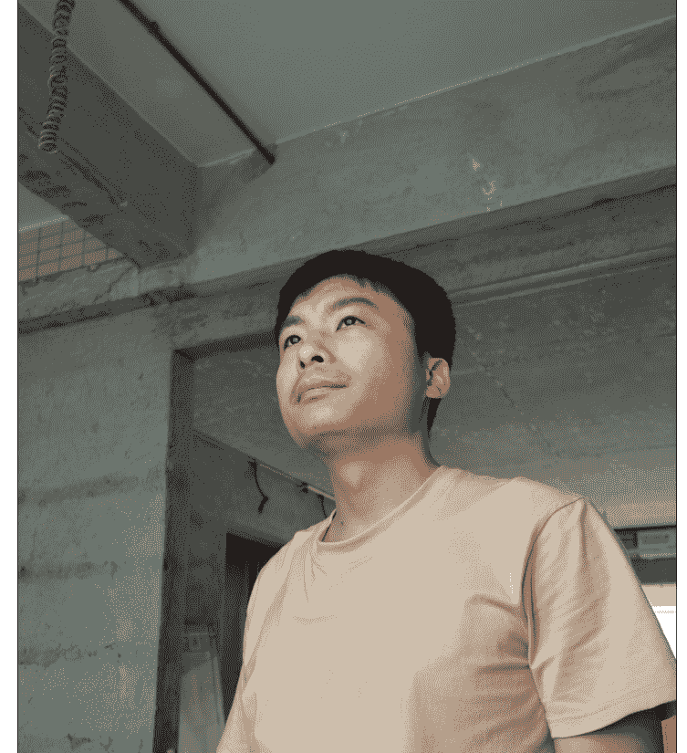

**3 ) 想攀大佬走捷径**

在项目进行期间，我也曾渴望走捷径，脸皮厚，想加入其他也在做获客的大佬的核心团队学习，各种换着花样链接大佬，但屡次毛遂自荐，都被婉言拒绝，浪费时间也消耗了心力。

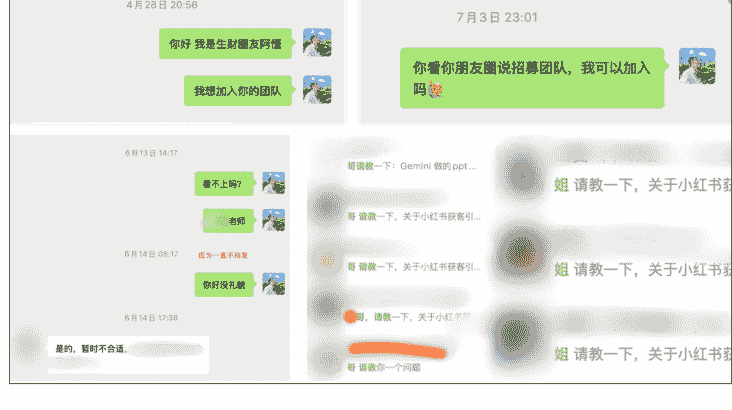
既然无法成为大佬团队的一员，那我就只能选择最“笨”的办法自己摸索。那段时间，我几乎是以一种疯魔的状态投入学习，连续好几个月每天都在电脑前打开生财社群研究案例、拆解打法到凌晨两点。身边的人都觉得我疯了，但我知道，这是唯一的出路。

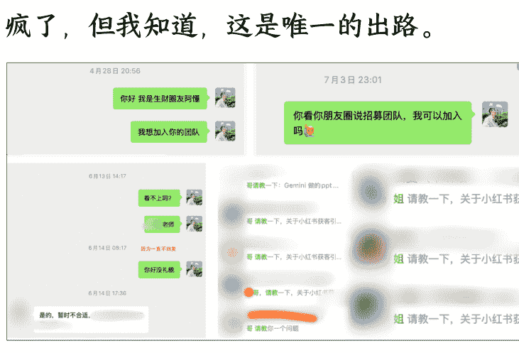
既然加入不了大佬的核心团队，那我就换一种方式“链接”他们。我把所有能接触到的大佬拉了一个微信分组，每当遇到一个棘手的问题，我就群发请教，看同一个问题，不同的大佬会给出怎样的回复。

#### 4）付费才是学习最快的捷径

当然，我也深知价值交换的原则，对于那些真正有价值的回复我直接付费请教，因为我知道，首先这是对知识和经验最基本的尊重。本来想点名道姓感谢一下的，但怕引起误解，毕竟婉拒过我，但如果你看到这里，我向你真诚道一声感谢。

> 
> `6 月 29 日 17:00`
>
> 哥 交个朋友
>
> `6 月 29 日 17:08`

#### 5、我是如何构建自己的护城河

很多人问，这套打法会不会很容易被模仿？
我的答案是：形可仿，而神难摹。
最容易模仿的，是线上的引流话术、账号形式和内容模板。甚至我们的 SOP，也可以被完整复制。
相信聪明的圈友看一眼笔记就知道逻辑了。

###### 1) 最难复制的：靠谱的交付团队

但最难模仿的，是找到技术过硬、人品靠谱、且善于用朴素方式与人真诚沟通的工长本人，以及与他之间基于长期合作、共同价值而建立起来的深度信任关系。同时作为客资引流，应该要把自己考虑是这个行业的一部份，不能有割裂，不能打一枪换一个地方，同时有意识去沉淀，做时间的朋友。

###### 2) 真正的壁垒：由“真诚”贯穿的完整系统

终极核心护城河，并非某个单一的技巧，而是一个由“真诚”贯穿始终的、稳固的系统：
对客户的真诚：始终将业主的“安心感”置于搞钱利益之上。
对工长的真诚：不压榨工长的利润，并始终尊重他们的专业和时间。
对自己的真诚：回归内心，做自己真正认可的有意义、有利他的事。

##### 6、这套打法所需的核心竞争力是什么？

这套打法看起来简单，但“简单”不等于“容易”。一个普通人想要从 0 到 1 完整地复制这套模型，需要具备以下几个核心能力和资源：

###### 1）核心资源

一个强大的交付工友（或与本地成熟施工队合作）。重要也是最难的一环。你必须找到一个技术过硬、人品靠谱、有耐心、善沟通的工长或施工队。他不仅是你的交付端，更是你线上“人设”的原型和信任的来源。如果找不到这样的人，我劝你不要开始。因为任何线上的流量技巧，都无法弥补线下交付的失败。一个糟糕的交付，会瞬间摧毁你辛苦建立起来的所有信任。

##### 2）核心能力 1：深度共情与“角色扮演”的能力

你必须能真正地沉浸到“业主”这个角色中去，理解他们的焦虑、他们的渴望、他们的语言体系。你输出的内容，不能是高高在上的“专家说教”，而必须是平视的“姐妹分享”。这种能力的本质，是同理心。

**3）核心能力 2：对“真实感”的极致追求**
你需要成为一个“真实感”的细节大师。从账号头像的选择，到笔记图片的拍摄角度，再到文案里一个不经意的错别字，都要服务于“真实”这个核心。你需要抵制住把一切都做得“更专业”、“更精致”的诱惑。

##### 4）核心能力 3：足够的耐心与定力
这套打法见效不一定快，需要经历一个至少 7 天的养号周期，并且在初期发布内容时，流量可能会非常惨淡。你必须有足够的耐心，去等待平台给你打上精准的标签。必须有足够的定力，不因为暂时的流量波动而轻易改变方向或放弃。流量端，像渣男一样，绝不主动，谁主动谁就先输，玩的就是心态。转化和交付一定要用心。
总而言之，这套模式对资金和复杂技术的要求不高，但对“软实力”（如共情能力、耐心、对人性的理解）的要求却非常高。它不适合追求“短平快”的流量玩家，但非常适合那些愿意深耕一个领域、愿意与用户做朋友、愿意“慢慢来，相信慢即是快”的长期主义者。

##### 2）学习这套获客打法避雷的点是什么？
##### 1）不要只抄“皮毛”
要学“心法”：最大的坑，就是看到我们的笔记形式好，就直接搬运模仿。用户能轻易地分辨出什么是发自内心的分享，什么是精心设计的“钩子”。如果你没有真正地去体验、去共情，你的内容就会是空洞的、没有灵魂的，自然也无法打动人。

##### 2）交付是 1，流量是后面的 0
再次强调，绝对不要在没有找到 100% 靠谱的交付伙伴之前，就开始引流。否则，流量越大，你死得越快。先花时间，去深度链接、考察、磨合你的工长，这比你花这个时间比做 100 个账号更重要。

##### 3）警惕：不要用价格吸引客户
不要因为自己懂一点装修知识，就在内容里不自觉地开始“说教”。记住你在小红书的人设：一个正在学习和分享的“素人姐妹”。保持谦逊和脆弱，更容易拉近与用户的距离。我们的内容里，从不主动提“低价”、“折扣”。因为用价格吸引来的，一定是只在乎价格的客户，他们会在后期让你无比痛苦。我们应该用“靠谱”、“省心”这些价值点，去吸引那些愿意为“安心感”付费的优质客户。

######## 5) 管理好自己的心态
做这套模式，心态比技巧更重要。你必须真正地相信“真诚”的力量，必须享受“利他”带来的快乐。如果你内心充满了对快速变现的渴望，你的每一个动作、每一句话，都会不自觉地流露出功利心，而这，恰恰是信任最大的杀手。

## 7、现在入场还有机会吗？

我的答案是：机会巨大。

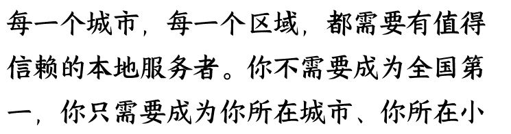
原因很简单：家装赛道对“靠谱交付”的需求是永恒的，而行业内能提供“极致安心感”的供给，却永远是稀缺的。只要装修行业还存在信息不对称，只要大部分业主还在为“找个好师傅、好产品”而头疼，这套以“真诚”为核心的打法，就永远有市场。
尤其是在本地生活服务领域，这是一个天然的“蚂蚁市场”，巨头很难完全垄断。每一个城市，每一个区域，都需要有值得信赖的本地服务者。你不需要成为全国第一，你只需要成为你所在城市、你所在小城市的领先者，或者你所在细分领域的标杆。

区里，那个最被邻居们信任的人，就足以活得非常滋润。

## 近三年内装修用户选择的装修方式¹

从地区来看，所有城市的自装占比都比较高，整装市场在一线城市逐步发展为主流，包括设计师渠道也在一线城市分得一定的市场；新一线及省会城市未来整装潜力空间大；中小企业则主要聚集在三线及以下其他城市。

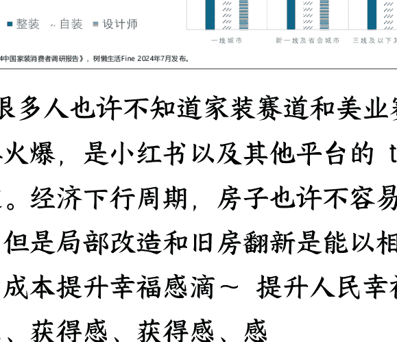

> 1:《2024 中国家装消费者调研报告》，树熊生活 Fine 2024 年 7 月发布。

很多人也许不知道家装赛道和美业赛道一样火爆，是小红书以及其他平台的 top 赛道。经济下行周期，房子也许不容易买，但是局部改造和旧房翻新是能以相对低的成本提升幸福感滴～提升人民幸福获得感、获得感、获得感。

而且家装赛道违禁词还不多，相比之下几乎没有。

> **陶陶 tracy**: 抱抱姐妹！装修真的渡劫现场 [表情]
> **摇啊尧呀~**: 我只是精装局改，踩了无数坑，又准备解约了。注意是又！
> **阿晓娜**: 我装了两年这两年间遇到的坏人比我前面 30 多年加一起都多可以说是整个装修过程没遇到一个好人
> **豆芽不吃豆芽**: 我装 1 年多了前 30 年没这一年遇到的烦心事多
> **阿树是 Miki 哥**: 装了四个月，还没开始吊顶。瓦工在填缝前在卫生间洗衣服，甚至还可能洗澡或干别的，卫生间地砖湿透了... 
> **领导蠢货在天堂**: 我也是这样 气的我在群里发疯才给我整改 什么都不按图纸做 好像我在挑刺一样...

## 8、分享一些 AI 指令库和工作流

以下是我在项目后期的日常工作中

##### 学习并验证过最高效的几个 AI 指令

可以直接复制使用建议使用 Claude 或 GPT、gemini 模型
小白如果不会魔法，请用到万能的淘宝或咸鱼，可相对低的成本用上先进的生产力工具！

###### 1) 小红书爆款文案 AI 指令

> “请你扮演一位刚在广州 你的目标城市买了二手房的 90 后女生，你的性格有点大大咧咧，但是对新家充满了期待。请用一种非常口语化、接地气的‘姐妹聊天’的口吻，写一篇小红书笔记。核心内容是，在经历了各种装修公司的“坑”之后，终于通过朋友介绍，找到了一个非常靠谱的广东人老师傅（工长），他话不多但手艺超好，处处为我省钱，让我感到无比安心。文案中要包含一些具体的细节，比如师傅是如何解决一个难题的，或者他某个朴实的举动是如何打动你的。请在文末加上一些符合小红书风格的标签，比如#广州装修 #装修日记 #避坑 #神仙工长等。”

###### 2) 市场痛点分析 AI 指令

> “请你作为一名资深的市场分析师，帮我分析一下当前在一线城市（如广州、深圳），准备装修房子的年轻人（25-35 岁），他们内心深处最焦虑、最担心的 5 个问题是什么？请不要说空话，要用具体的场景和例子来描述这些痛点。”

###### 3) 朋友圈文案润色 AI 指令

“我今天去了一个正在施工的工地，想发一条朋友圈，体现我们的专业和对细节的把控。这是我拍的几张：简单描述照片内容，如：师傅正在贴砖，缝隙很均匀。这是我的初版文案：‘今天巡检工地，师傅手艺真不错！’，请帮我把这段文案润色一下，让它看起来更专业、更有画面感，同时又不失真诚，能让潜在客户感受到我们的靠谱。”

###### 4) 我的工作流经验

我用什么设备：

拍摄素材：iPhone 15 原相机：“素人感”、真实感。

矩阵发布：200 左右的安卓手机，拼多多可以买。

少即是多，大道至简，不要焦虑，也不要陷入追逐工具，在进入赚千万的时候，再考虑黑科技或者工具。

平时输入与思考：

生财有术社群/知识星球：高质量的搞钱信息社群，是我获取行业认知和前沿打法的主要来源。

微信读书：系统化学的利器，很多搞钱和心理学的底层逻辑，都来自于此。但最近两年，相对我看实体书比较多。

怎么协作与项目管理：

微信群：最直接高效的沟通工具，我的工友们只会用微信。

飞书文档：用于沉淀引流端的 SOP、话术库和培训资料，方便随时查阅和学习。

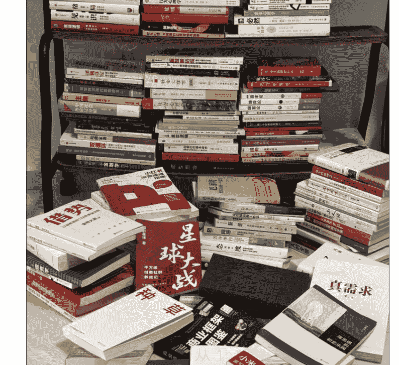

## 9、FAQ：那些你可能想问的事

Q1：我在其他城市，该如何找到一个靠谱的工长呢？
A：我的建议是，放弃所有线上的搜寻，回归最传统的线下“笨办法”。第一，去你所在城市最高档的建材市场，找那些做了很多年的老板聊天，他们手上往往有最优质的工长资源。第二，找到你身边最近一两年内装修过、且口碑非常好的朋友，让他帮你引荐。第三，如果你有设计师朋友，他们往往是你找到优质施工方的最佳渠道。记住，好师傅是靠“人”找出来的，不是靠“网”搜出来的。

Q2：项目刚开始，一个月只有一两个咨询，流量很差，心态很崩，怎么办？
A: 首先，恭喜你，这说明你的方向是对的，因为你吸引来的是真正有需求的精准用户，而不是泛流量。其次，请务必保持耐心。小红书的算法是“延迟满足”的，它需要至少 1-2 个月的时间来为你的账号打上精准的标签。在这个阶段，不要怀疑自己，不要轻易改变方向，你需要做的唯一一件事，就是坚持发布内容，保持与用户的真诚互动。当你的“真诚”内容积累到一定数量，流量的爆发只是时间问题。

Q3：我也想做“真诚”的生意，但如何界定“真诚”和“搞钱套路”的边界？
A: 我的判断标准很简单：你的出发点，是为了解决对方的问题，还是为了达成自己的目的？如果你的每一个动作，都是在思考“如何能让客户更安心、更省心”，那这就是真诚。如果你是在思考“我用什么话术能让他更快下单”，那这就是套路。真诚是一种“利他”的思维模式，而套路是一种“利己”的技术手段。当你真正开始为对方着想时，你说的每一句话，都会自然而然地充满力量，也就不再需要任何话术了，也不用装，装成本也高。

## 10、后续放大/发展方向

决定让真诚可复制
一个项目的成功，可以依赖个人能力和魅力。

但一个事业想要走得更远，则必须构建一个能够自我生长、自我复制的组织。

### 1) 找到更多的工友或者手艺人

关键是怎么对待手艺人：

对于这些习惯了单打独斗的老师傅们，传统的公司化管理和 KPI 考核是完全无效的，甚至会引起他们的反感。我们从不把自己定位为“老板”或“管理者”，而是“服务者”和“介绍人”。我的核心理念，就是“把丑话说在前面，把利益分在明处”。

#### 利益透明化
#### 不管控
#### 常聊天

我们不谈业务，只聊生活难处、家里孩子与未来打算。这种非正式“交心”场合，让大家建立起超越工作关系的兄弟情谊。为和师傅们打成一片，我定了规矩：只要有空，每周一必去工地，不只为了拍素材，更要和工人久聊，既为他们解工作枯燥，也为真正交心。收工后，我们会一起在路边摊吃饭、聊家常。这种深入一线的习惯成了我的身份认同，而当团队有了“人情味”与“烟火气”，很多管理难题便迎刃而解，因为大家知道，我们在为同一个“家”努力。

通过这套“笨拙”但有效的方法
我们逐渐凝聚起了一批价值观高度统一的手艺人。

这，才是我们敢于将模式向更多城市复制的底气所在。

⚡️导员说，没有调研就没有发言权，我前期用这种方式
也是更快更好地了解整个行业，以及行业里整个链路。

### 2) 总结方法论和整理 SOP

在无数个深夜的复盘和思考后
我为这个项目规划了接下来的四个核心发展方向
它们共同指向一个终极愿景：

为业主找到靠谱的工长，也为工长通过互联网找到业主，构建一个让多方受益的网络。

我接下来的首要任务，就是将这份“直觉”和“灵感”
沉淀为一套可复制、可传承、可优化的标准化作业流程（SOP），尤其是从杭州回来后，我马上开始做这一步动作：

内容生产 SOP 化
矩阵&分发 SOP 化
客户管理 SOP 化
尝试投流等不同流量结构

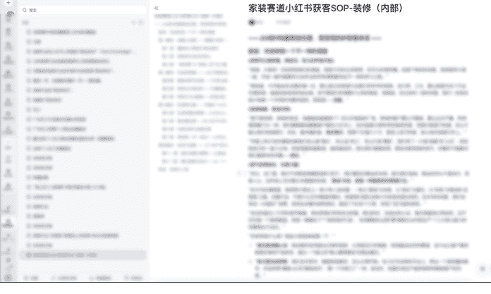

### 3) 让我可爱的工友们也赶上 AI 时代：

目前，我们的流量高度依赖于少数几篇爆款笔记的自然搜索流量，这是极其脆弱和危险的。一旦平台算法调整或笔记热度下降，业务就可能面临断崖式下跌。因此，构建一个稳定、多元、可控的流量结构和
内容产出方式，是迫在眉睫的战略任务。

AI 进行内容创作
AI 协助客服
AI 协助项目管理
Ps。这一步应该可以提高施工队的战斗力

通过 AI，我的目标，是将每一个与我们合作的工长，都打造成一个“超级个体”。
他们不必精通营销、设计、管理，但通过我们提供的 AI 工具套件，他们可以轻松地拥有这些能力，从而能将自己最宝贵的精力，完全投入到自己最擅长、最核心的“手艺”本身。

想法很理想，实际正在考虑怎么更好地落地，万一实现了呢，哈哈哈哈哈哈

## 11、接下来的近期计划

装修是一个极其传统的行业，但也正因如此，它充满了被技术改造和提升效率的巨大空间。

我计划从以下几个方面入手：
- 1)施工队严格筛选
标准：技术过硬是基础，人品靠谱是底线
而“认同我们的价值观”则是最重要的前提。
流程：我们将建立一套严格的筛选流程
- 2)以及一些想法

学习：重点在付费和分发等不同流量结构和获客效率上突破
客资输送合作：让更多手艺人从“找活干”的焦虑中彻底解放出来
沉淀 SOP：我们将向合伙人开放我们全套的、经过市场验证的 SOP
工具与技术：拆解和沉淀高客单赛道的打法和所需要的技术和工具
社群或者知识服务：构建高客单获客尤其是家装赛道同行相互交流、抱团取暖、资源共享，形成一个有温度、有活力的地方。

进一步实践验证我的高客单变现理论：也就是小红书 - 私域 - 视频号（公众平台）下面会提
不管了，万一实现了呢，哈哈哈

不过在发第一篇长文时
有圈友找我交流模式的跨区域与跨赛道复制合作
这种复制，一方面是地域上的延伸
一方面是赛道间的横向迁移。

通过这四个方向的努力，在未来一到两年内
将这个项目从一个“小而美”的成功案例真正打造成为一个可持续、可复制、规模化的
并且能为更多客户和手艺人创造价值的搞钱模式

阿懂 OS:如果垂直不行，那就横向发展，反正家装赛道那么多环节；
家装赛道不行，那就再横向瞄准高客单赛道，反正底层逻辑是一样的
反正就是干，其他的交给八字。

## 六、关于真诚、赚钱与重新定义成功

尊重常识 坚守真诚，做简单而正确的事
所以“安心感”不是一句口号
也不是一两个话术或者动作
它必须像水，渗透到从内容、引流到转化的每一个细节中

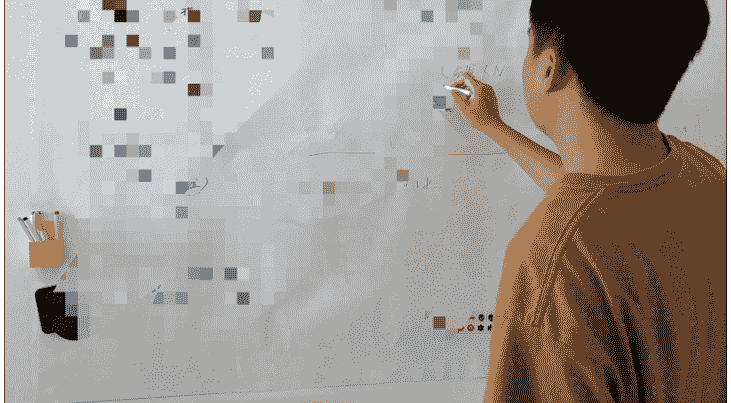

## 1、对生意的思考

我想到了《道德经》：道生一，一生二，
二生三，三生万物。

把客户还给工长，把工长还给市场。
把客户还给服务（产品），把服务（产品）还给市场。

## 2、关于君子爱财，取之有道

目前，我赚这个钱非常纯粹

推荐单个工种（如瓦工、电工），成交后
500 元介绍费

推荐整个半包工程给工长，成交后我有
3%的佣金

这个钱，我赚得心安理，不要多。

因为我为工长创造了价值，为业主节省了
筛选成本和试错风险

让专业的人做专业的事，让价值回归价值
本身。这就是我遵循的“道”。

## 3、当利益出现后，很难保持真诚

技巧很容易压过真诚怎么办？

我发现，我做的事情，一方面是用我的流量思维，帮助那些不懂线上获客的 70 后农民工师傅们，让他们能接到好活，有尊严地赚钱；另一方面，是帮助焦虑的同龄人，让他们能在这个信息不对称的行业里，找到一份踏实和安心。

这种“意义感”，成了我源源不断的动力。

我是在做一件有意义的事，顺便赚点钱。

这个念头，让我能够抵御诱惑，坚守初心。

突然我因我是 ENFP 而自豪，咋整···

## 4、对装修行业的洞察

传统的装修行业，本质上是在“卖风格”。

然而，随着信息的极大丰富，尤其是小红书等平台的崛起，用户获取设计灵感的成本变得无限趋近于零。

这就导致了一个根本性的转变：当“风格”不再稀缺时
行业的竞争焦点，必然从“设计”转向“交付”，从“卖知识”转向“卖服务”。

业主不再为一张效果图付费，他们愿意为整个过程的“省心、省钱、省事”付费。

口碑，正在成为这个行业最坚硬的通货。

而这个从‘卖风格’到‘卖安心’的转变，也正在其他服务行业悄然发生。
交付，正在成为所有高客单价行业的核心战场。

## 5、对小红书平台的洞察

很多人对小红书的认知是错误的
我得出一个结论：

# 小红书本质
是一个披着“生活方式社区”外衣的、极其精准的“消费决策搜索引擎”。理解这一点至关重要，它决定了你的所有运营动作。

抖音是“推荐算法”
视频号是“社交算法”
而小红书是“搜索算法”：用户是带着明确的问题和需求，主动来寻找答案的。这意味着，在小红书上，你的内容不需要去“娱乐”用户，而要去“解决”用户的问题。你的笔记，就是用户在搜索结果页里看到的一个个“答案选项”。因此，所有在小红书的运营，都应该回归到一个最朴素的问题：我的这篇笔记，解决了用户的哪个具体问题？想清楚这个问题，你就掌握了在小红书种草的钥匙，无论你做的是哪个高客单价信任业务。

## 6、高客单赛道组合打法思考

一个真正健康的搞钱模式，必须构建一个跨平台的、稳固的、可持续的流量结构和势能。

我为高客单价业务，总结出了一套“三位一体”的全域 IP 增长打法。

这套打法的核心，是将个人 IP 拆解成三个不同的角色，在三个关键的战场上，协同作战，三位一体构建战略打击群，最终形成一个从“精准获客”到“深度转化”再到“影响力破圈”的增长。

第一战场：小红书—“精准获客”（扩大流量结构时抖音等一切平台也可以获客）
第二战场：私域（微信生态）—高客单价成交
第三战场：视频号与公众号—行业影响力放大

这个获客的路径是：
小红书（精准获客）→ 私域（深度转化）→ 视频号/公众号（影响力放大）→ 影响力势能反哺小红书获客，形成正向循环。

## 7、重新定义“成功”

这个项目，在无意中完美地回应了我内心的终极追问，今年年初，我曾为自己立下一个 flag：要做一个“利他”的人，要与他人建立更深入的连接，要做有意义的事，而这个装修项目，恰恰就是这样一个载体。

一方面，用我的互联网运营能力，帮助像工长一样
拥有精湛手艺却不懂线上获客的传统手艺人
让他们能接到好活，有尊严地赚钱

另一方面，我能帮助那些在城市中打拼的年轻人
在装修这件充满焦虑和不确定性的大事上
找到一份踏实和安心

这个项目对我最大的改变
是让我重新定义了“成功”

过去，我把成功等同于融资额、等同于用户增长，甚至是和某个政要或知名人士的合影

而现在，我更愿意把我服务的每一个客户
都看作是一个“作品”

无论是在装修领域
还是未来可能进入的任何新领域

阿懂
春华秋实
2025 年 2 月 17 日 17:01
lin
非遗不腻
阿懂 回复 lin:
阿懂
感谢自治 感谢生命中不期而遇的礼物
阿懂
完成比完美重要
阿懂
最重要的事情只有一件
阿懂
保持足够真诚
阿懂
专注 念念不忘必有回响
阿懂
小步快走 快速迭代
阿懂
相信感觉
阿懂
弱水三千 只取一瓢
阿懂
秋天来啦
阿懂
关键的动作重复做

这个作品的好坏，不由投资人评判，而由住在这个家里的人，用未来十年、二十年的生活去检验。这种“作品心态”，让我从一个焦虑的“生意人”，变成了一个相对从容的“手艺人”。

我不再追求规模的无限扩张，而是专注于打磨好每一个“作品”的细节。因为我知道，当你的作品足够好时，搞钱上的成功，只是一个自然而然的结果。

## 8、致生财有术圈友

这个时代，用户比以往任何时候都更聪明
明，也更渴望真实，他们能轻易地在 0.1 秒内分辨出什么是发自内心的分享，什么是精心设计的钩子。

所以，忘掉那些让你焦虑的技巧吧

回归你的内心，找到那个符合‘高信任’特征的领域
找到那件你真正热爱并愿意为之付出真诚的事情。

然后，用最朴素、最笨拙、但最真实的方式把它呈现出来。

因为，真诚，是唯一不需要学习的技巧，也是在这个时代最坚不可摧的护城河。保持真诚，真诚是一把利剑。最后：感谢鱼丸感谢生财有术
此刻，这样的装修生意还在继续赚钱
为什么我还敢这么完整分享
因为我赌你执行力不够

## 七、关于我自己

### 1) 我在生财这一年找到了自己

我叫阿懂，新闻专业。

典型的 ENFP，能量来自真诚的连接。加入生财后，尝试同城交友社群、疗愈、旅游等“有意义”的项目。很享受其中的纯粹和快乐。

但搞钱是现实的，这对这些项目怎么玩得更好，当时理解还不够，利润微薄，没有规模化。

更痛苦的是，一旦引入“会销”现场升单，我就感觉像个僵硬的演员。

认识到：我的天性与强推销格格不入，吃不了这碗饭。

八年前大学时期接政企宣传项目赚到第一个 100 万，到 23 年创立快销品花光第一轮融资关门大吉。
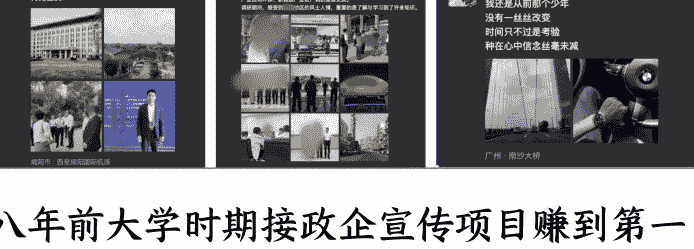

但停下来反思，才发现它们都在教我同一件事，无论是早期靠“搞关系”获得的短暂成功，还是靠关系参与各种项目，在一次次碰壁后。
发现赚钱的本质不是脆弱的“关系”，而是要系统化建立“信任”。

而我真正的天赋，恰恰是建立“信任”。

在加入生财大半年里的折腾里，学习互联网思维，我偶遇装修行业：一个高客单价、但信息极度不透明，客户普遍缺乏信任感的领域。

在这个赛道，得到了自洽。我不需要扮演“销售”了，只需做一个真诚的人，发挥天赋，每一个关键动作都是在构建信任。而信任是高客单变现赛道里的核心。

现在，我能坦然地面对过去很多的不顺利。
终于找到了一个“身心合一”的事业。

发现我自己就是我的核心竞争力。

> **阿懂**
> 前段时间，去章老师家做客，章老师问我现在的兴趣是什么，我当时犹豫了很久答不出来，我也感觉到很奇怪，我想我的兴趣其实很广泛，但是不知道为什么当时会答不出来，我思考了半个月，突然明白，其实她问的不是具体兴趣，是在问有没有在做着不断唤醒生命力量的事情，去找到自己人生使命是什么，想到这一点，或许会让我充满无限的勇气和力量，在很多事情中能克服自己稳定地进入心流状态……这个理解也在回答了为什么很多朋友会认为自己只是一个牛马从而感到疲惫和无力，或者对都某一件事情无法潜心、沉淀和坚守
> 2024 年 9 月 7 日 22:42

最后，安利小懒的付费群：

**[懒人专属群（介绍）]**

🎒懒人专属群持续更新中，已持续运营 6 年，整理超 3000 份各类精选付费文章&年费社群干货，全部开放下载。

本资料为付费群内部分享，仅供真实有需要的朋友查阅🙈

懒人专属群更新记录：
**[https://lazy2025.top/blog/record2]**

**懒人专属群更新记录（需梯子，备用）：**
**[https://lazybook.fun/blog/record2]**