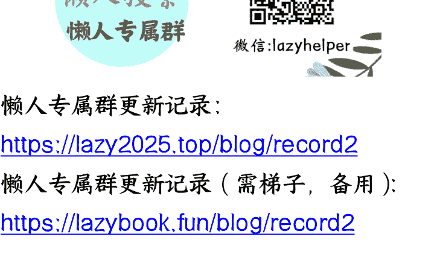

# 以官员的视角聊聊怎么样才能在体制内升官，主要讲升官的核心技巧（也适用于职场）

250909 来源互联网
整理：公众号懒人搜索，懒人专属群独享
备注：仅供娱乐，行贿受贿是违法行为~
懒人微信：lazyhelper

现在的大 V 经常说，官员们现在都已经不敢收钱了，如果想升官，只能巧妙地送礼。这其实是非常外围的话。小官如果想升官，关键就是送钱，如果连钱都送不出去，官是升不上去的。大官如果想升官就不同了。到了一定的阶段，钱是最廉价的利益，根本就不是核心。

下面将以官员的视角聊一下怎么样才能在体制内升官，主要讲升官技巧。写这篇文章之前，我跟我的助理聊了一下。他说他有个弟弟，是普通的公务员，家里也没有什么背景，现在面临的问题是钱都送不出去。他说，他更关心初级的官场问题，建议我写在前面，我觉得也对，对于这一类问题，我先给大家讲个故事。

我认识一位商人，他也没有什么背景，儿子是基层的普通干部想升官，这位商人是这么帮他儿子操作的：首先要知道，现在体制内官员的权力分配，往往都会有一定的内部划分，即这位官员管一块，那位官员管另外一块，重要的高级岗位，当然是书记说了算，但是很多周边的并不重要的岗位，通常是由分管提拔的领导来决定的。

这位商人打听好了具体是哪位领导能决定他儿子的升迁以及对方家庭住址，然后就开始操作了。

他先到那位领导住的小区布满他公司产品的广告，广告代言人就是这位商人自己，辨识度很高。广告在封闭的电梯里更加显眼，这位领导每次回家坐电梯的时候都能看到这位商人的脸。商人这么做，是为了给自己创造一种光环，让领导以为自己是有品牌的成功企业家，不是那种普通的小商人。另外通过这个电梯广告，也能让这个领导初步记住他，混个脸熟。

下一步，他就以推广公司的新风系统为名，举办了一次按小区门牌号进行抽奖的活动，设有三个特等奖，其中一个就让领导抽中。这样就名正言顺地给领导家里免费安装了一台室内新风系统。

新风系统一般在中国人家里是没有的，所以领导的家人就很喜欢，这位商人也借此留下了维护电话，号称能够免费上门维修。当然了，那台室内新风系统装上去以后，确实是能很好地改善屋内的空气环境，而给这个领导家安装的那台新风系统，这位商人故意留了后门，就是可以远程操控断电，伪装成设备故障，方便以上门维修为由光明正大地到领导家，从而接近领导。

【远程操控小知识：现在市场上有很多智能家居，都有现成的智能远程控制模块，手机就能实现远程操控，做出这种小东西不难的，小工厂稍微改装一下就可以做出来】某天这个领导回到家以后，这位商人就故意给这个新风系统断电，领导的家人就以为这个新风系统出故障了，就打电话叫这位商人上门维修。

这位商人就亲自带了两个维修人员上门，服务态度非常好，维修完毕再告诉对方自己公司也有推广新的产品，像电视机顶盒也是免费赠送的，而且有几百个免费频道，比领导家里旧的机顶盒就新鲜多了，所以领导家里人也很多喜欢，一来二去，领导家里的很多电器都是商人送的。

商人主打的思路就是帮这个领导家里的家电升级，而因为各种电器都是需要经常维护的，比如换滤网等等，这样商人就以此为桥梁，经常往领导家里跑，后来发展到基本上领导家里无论大事小事都叫这位商人，因为一叫即到，好吩咐嘛。等到混熟了以后，领导的戒心消除了，然后这位商人就开始送钱送礼，让领导帮忙提拔他儿子，后续的操作你们就懂了哈。

故事讲完了，我给大家作个分析。现在的中国，在没有取得领导信任之前直接送钱，对方一般是不敢收的，因为怕有危险嘛。而这位商人的行为，就是标准的钻营，他以服务对方的家庭小事作为切入口，最终成功消除领导的戒心，获得信任，成功实现送礼送钱。要想在这种没有引荐人的情况下接近领导，其实往往都是需要设计各种偶遇和小圈套的。

其实到了后期，领导一般也能反应过来，但是如果自己给对方留下的印象足够好，领导也是不会拒绝的，而从专业的技巧上来说，核心的关键是要反客为主，即主动地去设计一些小圈套，帮对方做点小事，反过来也是使领导在小小的事情上对你有所求。记住，不要去拍马屁，因为马屁对领导来说不是稀缺资源。最最关键的是一定要把钱送出去，一切的行为都要围绕着送钱这个目的而去。官场上其实有一句名言：不跑不送，原地不动；只跑不送，平级调动；又跑又送，上级重用，这句话用于普通干部的升官是非常正确的。

当然了，更高级的这个官场升官规则就与这截然不同了。我不是教唆大家去搞腐败。中国有句古话，说一个人的性格要少年老成，中年天真，老当益壮，这样子是最好的。我是觉得，至少在为官为商方面，这种性格更有生存能力。

少年老成，就是在年轻的时候充分地去了解更多的社会黑暗面并且能够适应环境，这样就不容易在幼苗期的时候被这种黑暗的环境所摧毁。中年天真，就是了解了足够多的社会黑暗面以后，反而坚信人间正道是沧桑，这种性格就比较容易在人成熟以后做出一番超越别人的伟业。老当益壮，就是在掌握权力的年龄时还能够像年轻人一样去奋发进取，而不是像普通老人一样卖老腐朽。

年轻人了解黑暗是为了防止在不知不觉中成为黑暗的牺牲品。在中国，无论是为官为商，越是在年轻的时候了解越多的真实社会生态，然后去适应它，这样对个人的成长与发展会更好一些。其实送钱是官场生存的一种基本操作。另外还有个值得一提的点，就是普通干部要学会送钱，但是尽量不要去贪污。

浙江那边的家庭就很聪明，家里如果出了一个公务员，家族里就会有人告诫他不要贪污，哪怕买不起房也不要去贪。如果需要用钱，家人会一起筹钱给他。如果想升官的时候需要送钱了，家族里的人就会一起出钱。这么做是很有好处的，大家都懂哈。后半部分我会聊一些官场升官的核心潜规则。

现在我再聊一个关于官场外围的故事，这类信息对普通人比较实用。在没有背景的情况下，既然专营这个领导关系可以用反客为主这类计谋，那么有没有那种用政企资源互换成功的例子呢？也是有的，我再给大家讲讲个故事。

这些年各个地方政府，在招商引资的时候往往是各种恶性竞争，开出的条件是越来越丰厚。这当然是经济下行带来的，但现在中央政府依然在大力推进县域经济发展的政策，这又使得各地的县委书记们在想尽办法去完成自己的 KPI。所以各地的县委书记就经常到北上广深等一线城市去招商引资。大家不要觉得这个招商引资都是引入那种大企业，其实不是的。对于一个县来说，大企业早就被市里抢去了，小企业才是他们的目标。

因为小企业也是可以包装一下，在估值的时候注点水，然后资金空转几次，再加入所谓的品牌溢价，那么在统计 GDP 的时候，数据就做上去了，反正也没什么审核机制。所以只要能把这个小企业引回去，哪怕是分公司，都是县里做业绩的基础。当然，如果能引入那种高新技术的小企业就更好了，这是很有政绩价值的。

县委书记是没有当过业务员的，当然也就缺这种商圈资源，这时候商会就起到作用了。像在深圳，有各种各样的地方商会，比如说某某县的深圳商会。这些书记如果来深圳招商，在人生地不熟的情况下，通常就是依靠这类商会来招商引资。参加过这种商会的朋友可能都会知道，这种商会一般都不是正规组织，通常组织者都是用来骗钱的。如果想获得这个商会的副会长之类的头衔，只要给一点小钱就可以了，门槛很低。

我认识一位小商人，他花钱买了一个这种商会副会长的头衔，目的是使用商会作为切入点来打点官场关系。这位小商人，他人在深圳，老家有个弟弟在县委办工作，能够直接提拔他弟弟的是县委书记。在得知这位县委书记会经常来深圳招商的时候，他就意识到可以把这个招商作为切入点。

那种帮人做简单的企业账，每个月收 200 元做账费的那种小型记账公司。这种记账公司有很多企业客户信息，这几年经济形势不好，这类型的小记账公司亏损很多，很容易就能收购到。这类小型的财务公司虽然有很多小企业信息，但这些信息在普通人看来并没有什么价值，而这位小商人却能变废为宝。他精心挑选了 30 多家看起来有点概念的企业，把他们包装成高薪企业，将企业信息做成精美的 PPT，在这个书记来深圳招商的时候，他就以这个商会副会长的名义把这个书记带到自己公司，放这些企业的 PPT 给他看，说我名下的这家财务公司虽然很小，但是有很多这种前沿的高新科技小企业的资料。哪里有新开这类高新企业，自己这个公司是春江水暖鸭先知的，并且表态自己愿意全力帮助县里牵线搭桥，这一下子就让这个县委书记觉得这是一个很难得的资源，值得结交。

后面一来二去，这位小商人就跟书记混熟了，毕竟自己对别人有用嘛，所以他自己摆出的姿态也不低。后来这位小商人在县里的政商圈也混得小有名气，再后来你就懂了，钱也就顺利地送出去了，他弟弟的仕途前景也变得非常好。

我给大家分析一下哈，大家经常可以从新闻上看到，现在中国政府在政策上是很强调发展这种高新技术企业的。但是大家有没有想过一点，就是这种政策导向，首先影响的就是各级地方政府一把手的 KPI 考核。现在很多企业都把自己包装成高新技术企业，其实就是因为这个。另外，很多那种掌握着高新技术企业情报的这些人也就顺理成章地变得很值钱起来。2023 年的时候，很多人就是用这个为切入点去搞这种政企关系的。其实所谓的接近领导，关键就是看这个随着政策的变化，领导们的需求有什么变化。而这些需求是隐藏在这种最简单的政策类的新闻里面的。

另外对官场的钻营，就是要想办法让自己在领导眼中变得有价值。关键还是前面所说的要想办法反客为主，这可以从领导的工作需要完成 KPI 的需求下手，也可以从领导的这种家庭的需求下手。其实这跟业务员拿下订单是没什么区别的。不要去学别人送礼啊，除非你真的跟领导很熟，在逢年过节的时候送一点，不然送礼就是浪费钱。在关系没有到位的时候，送贵了对方不敢收，送轻了对方不重视。电影《私人定制》里范伟有一句台词说，你就拿这个考验干部？哪个干部经不起这个考验？其实写出这句台词的编剧是非常懂得这个官员心理的。

我还是那句话，如果普通干部想要升官或者外围的人想搞好这种官场关系，关键还是要以送钱为目的，只要对方敢收你的钱，就代表这个权钱交易有可能成功。虽然钱是最廉价的官场利益，但是把钱送出去是中国官场的入门。另外，普通干部如果想升官，也不是只有送钱这一条路的。有可能是你的岗位特别好就不需要送钱，比如说如果你在组织部。有句话是这么说的：加入组织部，年年有进步。所有事情都不是绝对的。

实际上在中国当官，是一个很有风险的职位，他很考验一个人在法律风险和利益之间取舍的能力。规避风险的方法也有很多，比如说送小钱就要用现金，送大钱要送到对方的外国美金账户等等，其实这些都是大家都知道的秘密了。真正涉及到这种操作层面的时候，就要思考一下怎么保护自己。

现在我们来聊一下官场升官步入核心权力圈的些逻辑。官场中有这么一句话：厅级往上走，非血亲或奇遇不可。这句话对绝大多数的干部而言是对的，血亲很好理解嘛，天之骄子啊；奇遇就是一人得道，身边一直追随的人也随之扶摇而上九万里。

做官的技巧大多都是大同小异，都是围绕着这个权贵去积极运作，争取这种容身之地，但是其中的区别就是越到高位，竞争就越来越依赖侥幸，或者说依靠运气。所以对于普通人而言，厅级以上的升官是可遇不可求的，成为基层显贵反而更现实一些。体制内的朋友通常都会觉得，最难的是起步阶段。起步的时候，自己手里没有权利，自然就很难跟别人做这种对等的权利交换，所以很多人就会选择用钱来买官。其实靠钱是很难进入这种领导核心圈的，也是很难争取到实权部门的。

这个很好理解，换位思考一下，你作为领导，真的遇到那种紧要的事情时，你只会信任自己人。钱在一定级别的官员眼里不是稀缺品，通常他们的利益排序中排在第一名的是如何保护好自己的权力，也就是构建权力的圈子。领导要做到这些是既需要向上攻关，也需要平级争取，更需要向下选择的。所以在日常的时候，考察什么样的人可以成为自己人就几乎成了每一个领导的本能。而领导考察人的逻辑又与外界想象的完全不同。大佬文集圈所有的干部都知道，领导在日常的时候会考察自己。有些人就以为正确答案是努力上进，有些人以为是忠诚可靠，有些人以为是阿谀奉承，其实以上都不对。

领导也不傻，阿谀奉承是表面功夫，是否忠诚可靠这个是谁都鉴定不出来的，而努力上进又是跟领导毫无关系的。其实真正正确的答案是遵守官场规则。我讲一个故事，方便大家更好地理解。2016 年的时候，我参加过一个小圈子的饭局，就四个人。一位是领导，一位是领导带的年轻人，听说是清华毕业，学历很好，另一位是圈内的熟人。在酒喝得差不多的时候，领导就很突然地对自己带来的这位年轻人提出了一个问题，说：你对历史上的雍正怎么看？

这是一个送命题啊，这么突然地提问，我当时就意识到这个问题很危险，但是应该怎么回答我当时其实也没有反应过来。结果当时这位年轻人脱口而出就回答了，他说二月河的雍正写得特别好，我特别推崇里面的“天地君师亲”这个理念。我在那一瞬间对年轻人的回答简直惊为天人。这个年轻人的政治头脑非常不简单，后来他的发展也证明了我这个判断。这位年轻人在后来几年里被连续地短频快提拔，很明显是圈里有领导在培养他。可能很多人会不知道这里的玄机，我给大家解释一下。

首先在体制里面，如果一位干部被领导提拔或者培养，那么他的岗位的这个提拔路径就一定是短平快的。短平快的意思是未必每次调岗都是向上提拔，也可能会平级调动，但是在某个岗位所待的时间一定是很短的，这就是有人在培养的状态。其次，为什么说这个评价雍正是个送命题呢？

那是因为在 2016 年的时候，官场内部的反腐已经轰轰烈烈了。大家可以自己去这个中宣部的官网看一看。2016 年的时候，中宣部的宣传是把本朝的这些行为类比为雍正时期的。但是官员们普遍的心态是认为，搞这么大规模的党内对立并不是很好。另外，官员们私下也会讨论这些反腐问题，一些关系深的就直接聊，关系浅的就会隐晦的聊一聊，比如说借着二月河的雍正聊一聊。当时在酒桌上，领导突然问这位年轻人这个问题，其实就是在隐晦地问对方对目前官场形势的看法。这时候作为被问的一方，是很难回答的。首先，领导明显是在搞这种酒后突袭，不回答是肯定不行的，因为在领导面前遮掩自己的观点不跟领导交心，那后面是一点机会都没有的。都知道要成为领导的自己人，要想办法让领导觉得看透了自己。一般来说，聪明的官员会主动地定期向领导汇报思想，何况是这种领导主动开口问的情况，所以不回答肯定是不行的。

第二，如果这位年轻人，他直接发表自己的政治观点，那么就是轻浮，怎么回答都是错，这个人就不可重用，没有任何领导会愿意把这种嘴巴轻浮的人引入自己的核心圈。第三，这位年轻人的回答是二月河的雍正写得特别好，我特别推崇里面这个“天地君师亲”的理念，这个回答实际上是避开了敏感话题，但是他说的“天地君师亲”相当于是告诉领导我是很守官场规则的，我是个信奉传统观念的人。领导当然对此心领神会。如果这位年轻人，他不是事先想好了类似问题的答案，他当时如果是临场反应，那就代表了他的政治情商非常的高。

## 为什么要这么回答呢？

因为基本上这是所有领导干部的心声。不管自己有没有被抓的风险，官员们大多是不愿意看到这种大规模的同行被抓的情况。这种问题回答的原理就是如果这种话题避无可避，那么回答的方向就应该是领导心里的潜意识。平时就要琢磨领导对某些热点的政治话题会怎么想。提前先准备好答案，否则就会很被动。

我们前面聊的都是些官场技术类的，现在聊点心法类的。在没有背景的情况下，想进入领导的核心圈，要反过来想一个问题：在领导眼中。什么叫人才难得？领导对普通干部的考核是无所不在的。如果领导觉得你符合他的需要并且履历清白，没有明显地投靠哪一方，那么你这个人本身就是稀缺资源，是领导们都想争取的对象。实际上，领导们在构建自己的权力小圈子的时候，内心是非常不安的。他们既害怕手下人轻易地改换门庭，又害怕手下人做事不密连累自己，更害怕手下人不守官场规则。

如果某位年轻人让领导没有这些担忧，那么这个人当然就属于人才难得。当然，不同的领导他会有不同的需求，具体还要看情况。上级对下级有需求，这一点在中国官场里几千年都是没有变过的，这也是普通人在没有背景的情况下，进入权力的核心圈的唯一方式。诸葛亮为什么能够引得刘备主动地去三顾茅庐，无非就是满足了对方的需求。所以，大家不要小瞧了天地君师亲这种流传了几千年的传统文化。这种文化经过千锤百炼是能给上级带来极大的安全感的，是最适宜这个官场生存的，他基本满足了所有领导的潜在需求，而现在传统的年轻人，实际上是已经绝种了，体制内也一样，大多都是故作老成而已，物以稀为贵嘛。

普通干部如果想要升官，自己在年轻的时候要想通这些道理，其实是很艰难的，要么就是天生就有这种少年老成的性格，要么就是在关键之处有这种前辈的点拨，完全靠自己悟，通常要蹉跎很多年。反之，如果在年轻的时候就懂这些道理，主动使自己变成难得的人才，这就会使自己有“强大的内因”那么即使这一届的领导看不上你，那么下一届的领导也会提拔你的。所以，其实官场升官最大的敌人还是自己。

聊完了内因，我们再聊一下外因。当普通干部，他营造出这种稀缺人设以后，那么升官的下一步就是要捕捉进入权力圈子的时机。

大家都知道，在官场里面决定你命运的是少数领导。良好的群众基础并不是关键，拥有一定的群众基础虽然也很好，但是领导对你的认可才是最主要的。可以这么说，你做事有 99 个人夸你做的漂亮，但是只要老大一个人不吭声，那你就不是 99 分，你是 0 分。所以在体制内，要始终围绕着关键的领导去转，其他都是浮云。

在体制内，要树立对关键领导负责的意识的。那么这里面就涉及到个选择的问题了，如果有机会平调的话，有一些岗位就应该优先去考虑，比如像秘书科、政研室等这些都是更接近书记的岗位。除了几个特殊的实权部门以外，这种接近一把手的岗位往往更能近水楼台先得月。选择岗位的核心原则就是要到领导看得到的岗位去工作。另外一种进入领导视野的时机就是领导安排你做事的时候。在体制内生存，必须要学会早请示晚汇报，时刻让领导知道你在干什么，目前任务的进展是怎么样的，这样领导才能获得权力的安全感。

而下属具体的应对方法要用到方案的罗列和对比。汇报工作的格式一般是这样的：领导您好，关于某某工作的第一阶段我们已经完成了，下一步我们的工作计划有两种方案选择。第一种方案是什么，优缺点是什么；第二种方案是什么，优缺点是什么。这两种方案各有千秋，怎么选择，请领导明示。这就是早请示晚汇报的一种特殊逻辑，就是把选择权让给对方，再让对方明白你的思考逻辑，优缺点都帮他事先选好，而不是去汇报一些垃圾信息，而且这类的请示汇报发微信就可以了，除非他是主动地召唤你。

另外，在为领导做事的时候，不要想着把事情做得很出彩。基层干部中流传着这么一句话：稳定就是搞定，摆平就是水平，没事就是本事，妥协就是和谐。在官场中生存，和光同尘是必须的，少年义气要不得。那么，混入权力的核心圈，有什么特别值得注意的忌讳的地方呢？

有的，有三个地方。第一、就是不能记仇。普通人理解的不记仇是自己回家睡觉，不要把事情放心上，但是如果想 在体制内混得好的，不能这么做，要更反人性。我给大家讲个故事。小刘是王书记的秘书。有一次，王书记把小刘骂了一顿，小刘当时是没有反驳的。下班以后，小刘就买了两条烟一瓶酒敲开王书记家的门。王书记当时不在家，小刘放下礼物就走了。

第二天，王书记就把小刘叫到办公室，就说小刘啊，昨天我是没控制住自己的情绪，不是针对你，不要往心里去啊。小刘就赶紧说领导，我非常理解你的这个良苦用心。我这个人啊，就是不骂不成器，感谢你没有放弃我，把我骂醒了。一年以后，小刘顺利升官了。大家品一品这个故事。

## 让领导怀疑你会记仇是升官的大忌。

人与人相处是一定有矛盾的，尤其是领导和下属之间。领导会很担心，如果下属暗暗记仇，那么自己就是在身边养小人，谁都是怕吕布的，这种情况是很危险的。这个故事里面的王书记，他可能是在故意试探，也可能是在借题发挥，但是在体制内混，一定要注意，平时不骂你的领导突然骂你了，要引起高度地警觉，要想办法让对方安心；平时如果经常骂你的，那反而是对你不设防，要抓住领导信任你的机遇。

看到这里，朋友们是不是觉得在体制内混很反人性？

其实官场本身就是一个很反人性的地方，它跟股市差不多的，它对一个人心性的考验是远远大于对智商的考验的。

## 第二个特别忌讳的点是要学会沉稳。

我再给大家讲个故事。

王书记有个习惯，经常对自己身边的秘书说一些有的没的话，话很多，而新来的这位秘书比较特别，无论王书记说什么，秘书都安静地听，从不发问，书记的烟没了就帮他点上，茶没了就帮他续上，酒没了就帮他满上。

有一天，王书记突然就对秘书说，他说我啊，10 年时间换了 26 个秘书，只有你没有被换，知道为什么吗？大家品一品这个故事。

文章前面我说领导跟你交流的时候，你不能不回答，要主动让他读懂你，但是也有例外，比如说刚刚聊的这个故事，这里面有一个官场常见的陷阱：领导对你说了很多的话，这当然是他的本性使然，但是你要这么想，领导平时嘴巴就不严，那你又是他身边人，你再表现出来你的话也很多，那万一领导说的话外传了怎么办？

所以此时应对领导就要用沉稳去应对，因为领导他事后自己也会复盘，也会因为害怕自己话多，怕你外传而感到不安。

所以，总的逻辑就是要围绕着领导的安全感去调整自己的行为，其实这跟哄自己家的老婆是没什么区别的。

## 第三个官场特别忌讳的地方是，跟领导处关系的时候，该做什么样的定位，要处成什么样的关系以及最终的目的是什么是一定要清晰的。

大部分体制的朋友，其实是没有搞清楚这一点的。有些普通干部，觉得自己能给领导带来利益；有些普通干部觉得自己是在跟领导搞关系，想跟领导做兄弟；有些普通干部觉得自己是在给领导办事对领导有用，其实这些关系都不对。

用利益关系跟领导相处，那利益散的时候，关系也就散掉了。江湖关系、称兄道弟就更不管用了，因为学历越高的圈子，越不信这些。给领导办事就更不值钱了，官场这种白手套从来都不是稀缺资源。

真正混过官场的朋友可能会明白，跟领导相处的关键就是要跟领导亲一点。换句话说，要以人性相交。其实亲这个字是很考验人的政治情商的。自古以来，亲这种关系就是所有人类交往中最难做到的。大家有没有总结过，就是有些人明明跟自己没有什么利益关系，但是自己却觉得这个人跟自己是好朋友，自己对他在感情上有依赖，那是因为亲这个字啊，表现在人毫无察觉的肢体语言、表情以及无意识的互动之中。

大家去网上搜一搜，郭嘉岭领导和他的秘书在年轻时一起拍的照片，秘书的肢体语言是看不出谄媚的，更像是对方的小兄弟，这是一种非常高明的为官和为下属的姿态。

写这一段的时候，我翻了一下各类的心理学知识，没有查到专门讲这些的。这也很正常，在官场中真正悟出这些的一般也都是高官，他们是没有动机把这些写出来的。

但是体制内的朋友，要把握与领导相处的一种总方向，就是要跟对方亲一点。

## 最后我想聊一个有意思的问题，在中国究竟是做企业难还是当官难？

我个人的看法我觉得应该是当官难，但是做企业更难。

有一个可以侧面证明的点是，做企业的人往往都很迷信。当官的也有迷信的，但是并不多，这是因为做企业往往有几百个因素来决定成败，人是很难把握的，所以只能求神拜佛。

做官就会相对容易很多，只有十几个因素在决定成败，无非就是对天性的要求高一点，所以求神拜佛就没有那么多。

另一个可以侧面证明的点是中国政府现在天天在鼓励中小企业，鼓励人们创业，但是人们都不去。政府从来没有鼓励人们去当官，但是现在人人都在抢着去当官，如果当官真有这么难，那么老百姓早就不当了，是吧？所以，趋利避害其实是整个人类社会的本能。

# 懒人专属群（介绍）

- 懒人专属群更新记录：https://lazy2025.top/blog/record2
- 懒人专属群更新记录（需梯子，备用）：https://lazybook.fun/blog/record2