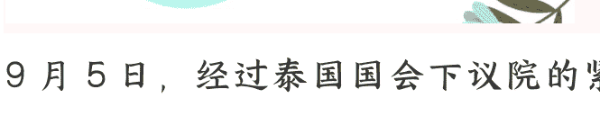
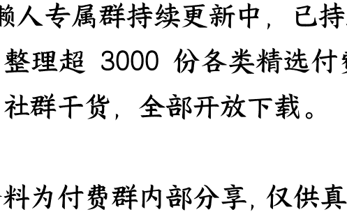

# 泰国新总理出炉，到底亲华还是反华？

250909 文/卢克文工作室嘉宾 星海舰长
整理：公众号懒人搜索，[懒人专属群独享]
懒人微信：lazyhelper

9月5日，经过泰国国会下议院的紧张选举，泰国第32任总理已经诞生，泰自豪党领导人阿努廷，以311票成功当选新任总理。

消息传来，很多中国人都松了一口气，因为阿努廷是个亲华派，泰国对华态度可能不会变了。

但等得知阿努廷是怎么当上的总理，很多人就又紧张了——

阿努廷是得到了人民党的支持，才当选总理的。

人民党的前身，就是那个亲美反华的前进党，考虑到前进党掌握的席位远超阿努廷的泰自豪党，那么，泰国会不会走上反华路线？

事情，还要从2023年5月，泰国国会下议院选举说起。

这次选举，本来是泰国人团结建国党和泰国人民国家力量党（代表军方和王室利益），去PK代表底层利益的为泰党（他信家族的党）。

万万没想到，爆了个大冷门，得到美国支持的亲美反华政党——前进党，竟然拿下众议院 500 议席中的 151 席，成为下院第一大党。

而为泰党只拿下 141 席。阿努廷的泰自豪党拿到 71 席位列第三，时任总理巴育的泰国人团结建国党只拿到 36 席，堪称惨败。

理论上来说，前进党作为第一大党，在组阁方面是有绝对优势的，只需要拉拢几个小党派凑够半数，就能成功组阁执政。

但是呢？这仅仅是理论上。

要知道，泰国是个伪民选国家，除了选举的下议院，军方和王室在政治上有相当大的影响力。

可偏偏，前进党本身又是反军方和反王室的。

在前期的竞选中，前进党的纲领是要求修改宪法（废除冒犯君主法）、限制军方在上议院的权力，同时，大力支持 LGBT 特权。

即使在一开始的选举中，前进党还扬言废除王室。

这样一来，军方和王室怎么才能让前进党上台？

所以，军方秘密和同样代表底层但相对温和的为泰党接触，说服了为泰党，放弃和前进党合作，作为交易条件，军方和王室答应让为泰党上台组阁，军方承诺不再政变，同时让王室赦免他信。

后来的故事，大家都看到了，为泰党从前进党的八党联盟中退出，联合阿努廷的泰自豪党、自由合泰党、新社会力量党、地方泰党、勇敢国家发展党等政党组成了执政联盟，成功上台组阁。

但是吧，为泰党流年不利，先是赛塔涉嫌丑闻下台，然后是他信女儿佩通坦因为录音门被裁定违宪下台。

接下来让谁当总理，就成了问题。

其实吧，一开始，为泰党还是想赖下去的，毕竟自己的执政联盟还维持着多数席位。

但佩通坦千不该万不该，不该把泰自豪党给逼走了，执政联盟中，阿努廷的泰自豪党是第二大党，在利益分配时，那就自然要把比较位高权重的职位给阿努廷。

事实上也是如此，阿努廷担任了副总理兼内政部长。

类比中国的话，阿努廷这个内政部长，相当于中国的公安部长+政法委书记+组织部长，真真正正的位高权重。

但是呢？

在佩通坦录音泄露后，佩通坦为了自保，急病乱投医，提出了个政府改组方案，把国防部长的位置交给了出身的军方纳塔蓬，借此讨好军方，想让军方出面放自己一马。

但问题在于，把国防部长位置交出去了，原来佩通坦的亲信、国防部长普坦咋安置呢？自己的心腹为了自己放弃这么多，总要给人家个交代吧？

于是佩通坦计划把普坦任命为副总理兼内政部长，而原来的内政部长阿努廷，则改任卫生部长，作为补偿，可以再给阿努廷的泰自豪党一个国务部长职位。

阿努廷此时心中一万个羊驼飞驰而过，你安置心腹就安置心腹，干嘛要夺我的权？

本来吧，这事好好商量一下，未必没有解决的方案。但佩通坦来硬的，突然给阿努廷下达了最后通牒，要求他48小时内交出内政部控制权。结果，阿努廷掀桌子了，辞去副总理和部长职务，执政联盟彻底破裂。

当然，阿努廷的此番辞职，可能也不仅仅是政府改组的应激反应。

一方面，随着录音门的发酵，为泰党声望跌到谷底，泰自豪党生怕连累自己，第一时间切割倒是正常的选择。另一方面，阿努廷可能在辞职那一刻，就动了上位的心思。他清楚，执政联盟离了他肯定玩不转，后续重新选总理，自己的机会不小。

阿努廷一退出执政联盟，为泰党想继续赖着总理之位的计划就破灭了，没办法，看守内阁总理普坦（就是那个抢了阿努廷内阁部长职位的人）向王室提出了个请求，要求解散下议院，重新大选，为泰党就有60天的时间重整旗鼓。

但这个请求被王室否决了，理由是解散下议院是总理的权利，你一个看守总理，无权搞这个。

这样一来，就只能由下议院重新选总理了。

那么，阿努廷的机会也就来了。

阿努廷是三朝元老（巴育政府、赛塔政府和佩通坦政府），人脉奇广，而且因为政治光谱偏保守，在军方和王室那边印象也不错，是总理的有力竞争人选。而为泰党那边，则推出了前司法部长猜格森·尼迪西里为总理候选人。

但问题在于，他们这俩党派再加上各自盟友的席位，都不够半数。这个时候，谁能得到下议院第一大党——人民党的支持，谁就能赢。

这个人民党，其实就是前期那个第一大党前进党，因为前进党对王室和军方威胁太大，被泰国宪法法院裁定解散了。虽然党解散了，但这个党的议员还在。于是这帮人又凑在一起成立了人民党，等于换了个马甲。

面对为泰党和泰自豪党的拉拢，人民党倒是很痛快：
支持你们不是不行，但我有三个条件:

- 第一，你必须独立组阁，不能组建执政联盟。第二，四个月内解散下议院。院。第三，推动修宪，废除那个“侮辱国王罪”。

说实话，这三个条件非常苛刻也非常敏感，但为了赢，阿努廷和猜格森都答应了人民党的要求。那为什么最终
人民党选择了阿努廷呢？可能还是因为阿努廷的票数少（只有71席），比较好控制吧。

当然，也不排除背后还有其他的PY交易。

就这样，原本的第三大党党首阿努廷，成了佩通坦录音门事件后的最大赢家。

## 二 阿努廷的政治倾向如何呢？

阿努廷这个人政治倾向如何呢？他领导下的对华政策，会不会发生变化
呢？

有一点大家可以放心，阿努廷这个人是个铁杆亲华派，甚至比**他信家族**亲的还要厉害。

阿努廷1966年出生于曼谷一个显赫的华商世家，中文名为陈锡尧，会讲汉语，而且非常擅长用华裔身份来博得中国人好感。比如2023 年，他在接受
中国记者采访时明确表示“我是 100%的华人后代，每次见到中国人都很开心。”在中国网络身上引发了广泛好感。

阿努廷的亲华不仅是在嘴上，更在行动中。

比如，咱们都知道中老铁路建成后对中国意义重大，但如果不联通泰国，这条铁路就是瘸腿铁路，也就是在阿努廷的推动下，中泰铁路二期工程最终获得泰国内阁批准，今年就要开工了。

虽然国内舆论对他推动大麻合法化颇有微词，但这毕竟是泰国人自己的事情，算是瑕不掩瑜吧。

那么，阿努廷当上总理后，处于“朝小野大”的局面，会不会受到亲美反华的人民党的掣肘，走向反华路线呢？

从短时间来看，可能性不大。

为什么？

因为人民党虽然支持了阿努廷，但并没有加入阿努廷的内阁。

一般来说，议会制国家的执政联盟，就是个分肥大会。执政党为了盟友的支持，会安排其他党党首担任内阁部长掌握实权。

所以，内阁部长掣肘总理甚至影响一个国家的施政，是非常正常的事情。

大家对人民党改变泰国的施政方向的担心，是完全有理由的。

但是呢？这次与以往不同，人民党的确支持了阿努廷，但却提出，在修改宪法之前，不会加入内阁，而是留在反对党阵营内，继续监督政府行政。

也就是说，阿努廷的内阁成员，不会有人民党的人，这样一来，就不用担心人民党掣肘执政了。而且，从从政经历来看，阿努廷倾向于保守派民粹主义，和人民党的理念是矛盾的，就算人民党掣肘，阿努廷也不太可能会妥协。

但是，眼前的安全，并不代表一直安全。泰国现在对华友好，也不代表会一直对华友好。

为什么？因为阿努廷政府的执政期，只有4 个月。

按照时间推算，9月中旬阿努廷宣誓就职，10月就要到国会发表施政演说（其实就是向人民党汇报修改宪法工作进程），到了2026年2月，阿努廷就要解散国会，此后60天内，举行新一轮大选。

阿努廷当然可以借故拖延，不修宪，不解散国会，不大选，一直赖在总理位子上。

但问题在于，阿努廷现在组建的是一个少数派政府，这也就意味着，如果不能兑现对人民党的承诺，那么人民党随时都可以发起不信任案投票，把阿努廷弹劾下台。

显然，人民党和泰自豪党的合作，其实根本就是貌合神离，双方各怀鬼胎。

泰自豪党的计划，是先用人民党的支持把持住政府再说，利用这 4 个月的时间，发育壮大己方势力，趁着为泰党支持率低迷的关键时期，尽可能多地吃掉为泰党的票仓，让泰自豪党取代为泰党成为国会第二甚至第一大党。

在这一阶段，阿努廷要做的就是稳住经济。而与泰国经济合作最紧密的国家——中国，是阿努廷绝对得罪不起的。

而人民党呢？他们也不喜欢阿努廷，而是寄希望于四个月后的大选。人民党最大的底气，就是民众对王室的厌倦甚至厌恶。泰国王室已经传承几百年了，虽然王室在老百姓心中仍然有巨大声望，但在接受了现代教育的精英群体和年轻人眼中，越来越像老顽固。

再加上疫情期间泰国国王抛下人民自己跑到欧洲避难的事情，更是让泰国人普遍感到失望，也因此爆发了大规模的街头抗议活动。人民党的前身“前进党”，就是那个时候搞颜色革命而崛起的。

前进党还和港 D、台 D 有密切的联系，他们组建了一个“奶茶联盟”（香港有丝袜奶茶、台湾有珍珠奶茶、泰国有手标奶茶），同气连枝相互声援。

虽然泰国警方粉碎了街头抗议活动，泰国宪法法院又取缔了前进党，但只要民众对王室的厌倦还在，人民党的民意基础就还在。

在这种愤怒的积压下，如果阿努廷真的废除了冒犯国王罪，然后在 2026 年大选的话，人民党只要煽动一下民意，以“罢黜王室”为口号（反正也不违法了），是真有可能冲击单独下议院半数的。

到那个时候，怎么办？

如果泰国王室和军方认了，那王室怎么办？难道军方还要再政变一次搞军政府吗？

如果泰国王室和军方不认，利用上议院强行狙击的话，那信不信，美国煽动的颜色革命马上再一次起来？所以，相比阿努廷政府反华的可能性，不如说越来越被渗透的泰国年轻人，推选出一个反华政府的可能性更大。而这，才是中国需要重视和考虑的问题。

最后，安利小懒的付费群：
懒人专属群 (介绍)

🗞️懒人专属群持续更新中，已持续运营 6 年，整理超 3000 份各类精选付费文章 &
年费社群干货，全部开放下载。

本资料为付费群内部分享，仅供真实有需要的朋友查阅 🙈
懒人专属群更新记录：[https://lazy2025.top/blog/record2](https://lazy2025.top/blog/record2)

懒人专属群更新记录（需梯子，备用）：[https://lazybook.fun/blog/record2](https://lazybook.fun/blog/record2)