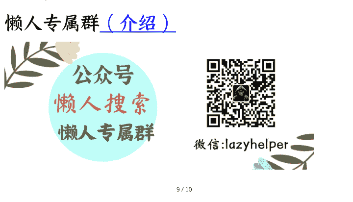

## 06 身体与心灵：性对于爱情有多重要？

250909

整理：公众号懒人搜索，懒人专属群独享

懒人微信：lazyhelper

欢迎来到《爱情哲学 30 讲》，我是刘擎。

在上一讲，我们讨论了性活动逐渐从生育、婚姻和爱情关系中脱嵌出来，成为一种自足的人类活动。美国曾有一项调查显示，有 53% 的女性与 79% 的男性承认，自己曾在完全没有爱情的情况下，体验到强烈的性吸引。显然，在性与爱情的关系中，性欲望的满足并不完全依赖爱情。但反过来，爱情仍然依赖性爱吗？“无性之爱”还称得上是爱情吗？这是上一讲没有充分阐明的问题。

今天，我们就来探讨性爱对于爱情的意义。网络上有一个流行的说法，“生理性喜欢未必是真爱，但真爱一定会有生理性喜欢”。这句话有道理吗？借着这个问题，这节课我们主要讨论两个方面。首先，性爱是不是爱情的必要条件或构成性要素？第二，性爱对爱情有重要的意义吗？让我们开启今天的思辨之旅。

## 性爱的重要性被夸大了

许多人相信，“无性之爱”固然存在，但并不是严格意义上的爱情，而是友情、亲情或者博爱。在这种看法中，性爱是爱情区别于其他亲密关系的唯一界限。还有不少人认为，爱情虽然不等于性爱，但性爱是爱情最内核的部分，也是最精彩迷人的部分。用一句俗语说，爱情没有性快乐就像是“肉包子没有了肉馅”。

这些观点虽然流行，但我认为却是错误的，因为性爱并不是爱情的构成性要素。

我们在第二讲定义过：爱情是一种“精神怀孕”（Spiritual Pregnancy）及其精神生命融合共生的过程。虽然它在大多数情况下会伴随各种形式的身体亲密，但并不必然以性亲密基础。在这个意义上，性爱对爱情的意义被严重夸大了。

听到这里，大概会有同学已经按捺不住要反驳了：没有性快乐的爱情，要么只是少数人的精神恋爱，要么就是一潭死水，了无生气地搭伙过日子，这根本不能算爱情。

这种质疑确实很流行，但这来自对爱情的刻板印象，它忽视了大量的现实例证。实际上，现实中的爱情千姿百态，有丰富的多样性。许多伴侣之间几乎没有任何性爱行为，却保有爱情的界定性特征，彼此之间存在着不仅深刻而且充满激情的亲密关系。

你可能要问：没有性爱的感情还会充满激情？这怎么可能？

完全可能。

相信激情只能来自性欲是一个常见的认知谬误。实际上，存在许多其他种类和形式的激情，其中与爱情最为相关的一种激情就是“迷恋”，这是美国心理学家特诺夫（Dorothy Tennov）在 1975 年提出的心理学术语，英文是 limerence，中文可以翻译为“迷恋”或者“痴迷”。它通常表现为强烈的浪漫情绪，伴随着对所爱之人过度的理想化和不由自主的渴望，以及突如其来的幻想。人在坠入爱河的时候，在失恋痛不欲生的时候，感到最为深切的不能自控的激情，大多就是这种“迷恋”。

但特诺夫研究发现，迷恋与性欲并没有必然关联。在她的调查样本中，有 61% 的女性和 35% 的男性表示，他们经历了迷恋，但没有感到“任何性的需求”。这实际上并不匪夷所思，你问问自己，在热恋之初或失恋之后，有没有体验过最强烈的与性欲无关的激情呢？

许多处于迷恋状态的个体，并不想真正寻求身体的结合，而是渴望“精神的结合”、“目光的回应”、“共度的时间”或“象征性的小互动”。在一些情况下，这类体验往往比性更能触发强烈的激动、欣喜、幻想以及痛苦，这种激情可以被称为一种非性欲化的却深具情感强度的“爱情形式”。

当然，特诺夫认为迷恋本身并不是爱情。就像性欲望本身也不是爱情，但迷恋和性欲望都可以在爱情中促发激情。因此，我们有证据相信，没有性关系的激情是可能的。性爱并不是热烈爱情的必要条件，激情之火可以在精神与情感的层面上燃烧。

### 性爱的意义又被低估了

如果性爱不是构成爱情的必要条件，那么在爱情关系中，性爱又有什么意义？只是一种寻欢作乐的游戏，或者营造爱情气氛的工具吗？

如果你认为性爱的价值仅此而已，那它对应爱情的意义又被低估了。实际上，性爱完全可能成为精神怀孕和滋养爱情的媒介之一。

你看，心灵的开放往往伴随身体的开放，性爱就是自我向他者极端开放的一种身体经验。两个相互独立的个体，怀着真实的情感、信任和善意，让彼此的身体碰触和交汇，很有可能会激发和鼓舞心灵之间的交融，导致精神怀孕。性爱是伴侣之间深度融合最直接的表现形式，也会不断滋养爱情这个精神生命的发育成长。因此，性爱虽然不等于爱情，却可以成为爱情创生与成长的一种“媒介”。

换一种说法，也可以将性爱理解为爱情生活的一种特殊“语言”。英语中有个单词“intercourse"，它具有双重涵义，既有“性交”的意思，也指“深度的交谈”。我们平时说的“谈恋爱”，主要是指情侣通过交谈展开精神交流。但在社会语言学和符号学研究中，语言的涵义更加宽泛，除了我们熟知的口头语言（spoken language）和文字语言（written language），还包括身体语言，比如手势、面部表情、眼神交流、身体姿态等。

性爱就是一种高度复杂的“身体语言”，甚至可以说是最具象征力和情感密度的身体语言形式之一。在亲吻、拥抱、触摸、抚爱等亲密举动中，身体以不同的姿态、动作、节奏、距离和强度来传达丰富而微妙的信号，邀请与回应、渴望与接纳、鼓励与拒绝、控制与失控、引导与犹豫、愉悦与忍受、兴奋与疲惫、享受与焦虑、快乐与羞怯、怀疑与信任等等。的确，性爱不是沉默的，而是在用身体在“说话”。这时候，“intercourse”的两种涵义获得了统一。

### 性爱的象征意义

不仅如此，性爱还具有丰富的象征意义。
它既是具体的，又是超越的。

一方面，身体上的亲密，将爱情这种精神孕育和生长的不可见的过程，化为最具体、最微妙和最真实的行动。
在这种身体和心灵的双重交会中，个体不仅仅体验到生理的愉悦，而且获得了共同创生和滋养“我们”这个爱情生命的感受。

与此同时，性爱活动有可能转变为一种象征性“仪式”，它象征着个体对他者的献身、依恋和信赖。
在精神化的视角中，性爱通过身体的奉献，表达了对灵魂交融的渴望，成为对爱情这个生命共同体的“献祭”仪式。

有人说，充满爱意的性爱是一种舞蹈或戏剧艺术，它有多彩的具体行动，同时又蕴含着深刻的象征意义。
这么说来，那些在长达十多年甚至几十年的爱情旅程中，仍然相互保持激情的伴侣，都是杰出的艺术家。这恰恰印证了哲学家弗洛姆所说的“爱是一门艺术”。

### 更通俗的解说

听到这里可能有人会怀疑：这样阐释性爱对爱情的意义是不是过于晦涩了。
不就是那点事儿吗？有必要说得那么玄妙深奥吗？

我可以辩解说明，这门课是对爱情展开的哲理性探索，必定会涉及一些深奥

的表述。但作为教师，我也应该尽力表达得通俗易懂。

让我们做一个类比，中国古人说“食色性也”，吃饭与性爱都是人的本能欲望，也有人会将强烈的性欲望表达为“性饥渴”。那么，可以说性爱就是为了解决性饥渴，就像吃饭就是为了解决饥饿问题吗？

是，也不是。

吃饭在最低级的意义上是满足生理需求，比如，你在极度繁忙时，可能随便泡碗方便面就对付了饥饿。但你和心爱的伴侣在一起时，为什么会尽可能地想要一起就餐？在生日、节日或者特殊的纪念日，还要做更丰富的菜肴，甚至会搞一次烛光晚餐，为什么要搞些仪式感？因为人的饮食活动也具有超越动物本能的意味，否则就“饮食文化”这个术语就不可理喻了。

在情侣的两人世界或家庭生活中，饮食就餐同时具有精神情感的交流意义，它就像一场小型剧场，有时甚至会演变为舞蹈。有心理学家说，到一对情侣家里做客吃饭，大致就能知道他们亲密关系的状况。

为什么？因为在这个过程中，两个人除了口头语言之外，还会有各种符号化的身体语言：盛饭、夹菜、敬酒、分菜，餐前的备菜做饭，餐后的清理收拾和洗碗涮锅。这些动作是具体的，

却在表达分享、分担、谦让、亲密、体贴、温情、爱慕和敬意等情感。那么，你还会说，吃饭不就是填饱肚子那么点事儿，哪有那么多要分析的吗？

一般而言，如果在共同生活中，每一次吃饭都变成了仅仅解决饥饿的事情，而每一次性爱完全变成了单纯缓解性饥渴的活动，那么两人的爱情——这种精神生命——可能出现了病症，也可能正在衰亡。

当然，每一次身体的亲密都满怀爱意，那是伴侣关系最理想的境界，但即便非常相爱的伴侣，也时而会发生主要出于生理欲望的性爱，就像有时吃饭主要就是为了解决饥饿。只不过，相爱的伴侣，几乎不可能在饥饿难耐的时候，不顾对方的感受抢夺好吃的东西，也很难想象强烈的性欲望会打破彼此尊重和友善的底线。

### 结语：爱情的语言

稍微做个总结。爱情的语言有多重，性爱是其中一种，对许多人来说，还是非常重要的一种。在爱情生活中，性与爱之间往往是互相激发：精神上的吸引可能激发身体的亲密，而身体上的亲密也可能会促进对彼此精神世界的好奇、探究和渴望。但是，如果在享受了性欢愉之后的平静中，总是会失去任何关怀和爱抚对方的意愿，

甚至常常心生厌倦，那可能意味着性爱缺乏足够的爱意。

回到这节课最开始的问题，“生理性喜欢未必是真爱，但真爱一定会有生理性喜欢”这句话有道理吗？我想，大体是对的，只是要补充一句，真爱中的“生理性喜欢”，其实也不只是生理性的。

### 思考题

好了，性与爱的关系，我们就讨论到这里。给你留一道思考题：

你觉得，性爱这种特殊语言，能够传达哪些用言语无法表达的内容？反过来，这种身体语言又有哪些局限性？欢迎在留言区写下你的思考。

从下节课开始，我们将探讨婚姻与爱情的关系。先来思考：婚姻是不是爱情的归宿。

我是刘擎，我们下节课再见。

最后，安利小懒的付费群：

[懒人专属群 (介绍)](#)

懒人专属群更新记录：https://lazy2025.top/blog/record2

懒人专属群更新记录（需梯子，备用）：https://lazybook.fun/blog/record2