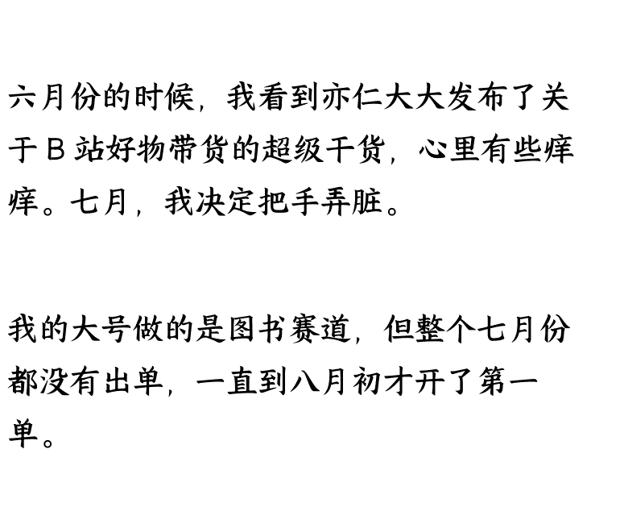
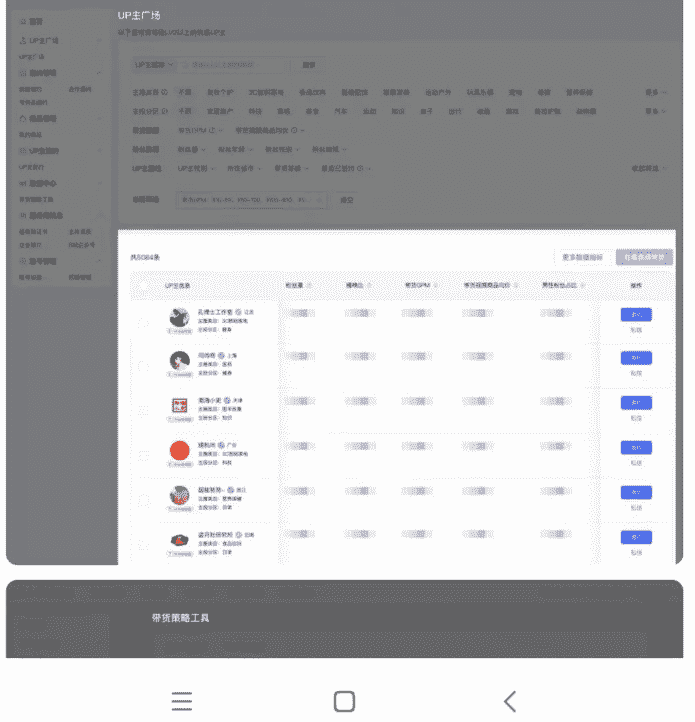

# B 站图书带货从 0 到 1：我如何靠文案微调实现出单？【附保姆级剪辑教程】

250909    生财精华

公众号懒人搜索，[懒人专属群](#) 独享

懒人微信：lazyhelper

各位圈友好，我是岩白。

六月份的时候，我看到亦仁大大发布了关于 B 站好物带货的超级干货，心里有些痒痒。七月，我决定把手弄脏。

我的大号做的是图书赛道，但整个七月份都没有出单，一直到八月初才开了第一单。

期间我也很 emo，一度怀疑 B 站好物这个方向到底适不适合自己。到了八月份，随着图书账号持续开单，加之新开的数码小号在 7d 内就出了 3 单，我不仅恢复了信心，还开始回顾开单经历、做复盘。

话不多说，先放结果。首先是我小号，数码赛道信息流，15 号开始发视频，7d 出 3 单。

## 数据中心

预计每日 10 点更新数据

[< 返回] | [使用手册]

- 总览
- 视频
- 直播
- 图文
- 商品

### 交易总览

| 8 月 15 日 -8 月 21 日 | 近 7 天 |
|:---|:---|

**成交金额**

¥ **8,719.79**

**成交单量**

**3**

**预估佣金**

¥ **73.31**

**直播**

¥ **0**

**非直播**

¥ **8,719.79**

> **图表：成交金额趋势图**

*图例*: 
- **蓝色点**: 成交金额
- **绿色点**: 直播
- **紫色点**: 非直播

*坐标轴*: 
Y 轴：0 - 7,000
X 轴：08-15 至 08-21

已经到底啦

大号图书赛道，一个月才开单。

## 数据中心

预计每日 10 点更新数据

### 交易总览

8 月 17 日 -8 月 23 日

**成交金额**

**¥489**

+60.86%

**成交单量**

3

**预估佣金**

**¥115.83**

+441.51%

直播

¥ **0** -

非直播

**¥489** +60.86%

已经到底啦～

B 站：商业变现…群【答疑】(67)

8 月 13 日 下午 15:20

终于出单了，一个多月了

记得复盘，从头到尾捋一下

8 月 13 日 下午 15:24

差一点就要换赛道了

@刘岩白 你这个佣金很高啊

复盘时我意识到，图书赛道不是数码信息流堆叠，“有的放矢”才能出单。我从 0 收益到出单的过程中，意识到图书视频制作的重点是：文案微调。

所以今天我分享一下小心得，聊聊我从最初 0 开单到后来陆续出单的过程，怎样微调才能出单，也希望我的帖子能帮大家少走些弯路，早日达成开单目标。

### 一、赛道选择：图书 vs 数码，适合谁？

### 为什么我选择了图书赛道

有大佬做图书赛道，并收益很高

图书佣金比数码高

京东/淘宝联盟有很多图书方向的活动，b 站也有服务商货盘，这也意味着有鱼可吃。

### 京东联盟 9 月活动预告

### 京东联盟 9 月活动预告

- 图书超级品类日
- 9.1-9.2 图书超级品类日（京东）
- 京东图书超级品类日（b 站）

### 疯狂品类
- **图书超级品类日**
- 时间：8.21-8.22
- 图书超级品类日（京东）

### 京东图书超级品类日

- **京东图书超级品类日（京东）**
- 时间：8.21-8.22
- **京东图书超级品类日（b 站）**
- 时间：8.21-8.22
- **图书超级品类日（京东）**
- 时间：8.21-8.22

## 奖励频道

**待报名**

| 可参与 | 已结束 |
|:---:|:---:|:---:|
| [佣金比例提升奖励] | [京东图书超级品类日] | [图书超级品类日] |
| [8.21-8.22] | [8.21-8.22] | [8.21-8.22] |
| [距离活动结束 15 小时 30 分] | [距离活动结束 15 小时 30 分] | [距离活动结束 15 小时 30 分] |
| [8.21-8.22] | [8.21-8.22] | [8.21-8.22] |
| [距离活动结束 15 小时 30 分] | [距离活动结束 15 小时 30 分] | [距离活动结束 15 小时 30 分] |
| [8.21-8.22] | [8.21-8.22] | [8.21-8.22] |

- 佣金比例提升奖励
- 京东图书超级品类日
- 图书超级品类日

## 经营工具

### 精选货盘

- **精选货盘**
- **商机推荐特权**
- **经营工具**
- **精选货盘**
- **商机推荐特权**
- **经营工具**
- **精选货盘**
- **商机推荐特权**
- **经营工具**
- **精选货盘**
- **商机推荐特权**

## 图书赛道底层逻辑分享

图书赛道佣金普遍比数码高，适合长期做，但需要精细运营。

## 二、图书赛道底层逻辑分享

### 如何选择赛道

- 图书赛道
- 数码赛道
- 图书赛道
- 数码赛道

### 分析对标

## 三、对标账号与剪辑策略

### 分析对标

- 分析对标账号（视频）
- **伟人一生给两位元帅写的诗...**
- 视频时长：1 分多、不到 2 分钟
- **视频**
- 完读率
- 读者更容易看到最后
- **带货的图书**

### 剪辑

## DeepSeek 筛选精准人群

根据 deepseek 的回答，我对视频做了三个微调，结果微调两个视频就出单了，后来也持续开单，证明方法有效：

- 控制视频时长
- 修改标题结构
- 优化评论区互动

### DeepSeek 为我分析的结果

| **关键问题与突破口：** |
|:---|
| • **不开单原因可能**： &nbsp;&nbsp;&nbsp;○ **人群不精准**：目标人群没有点击或看完视频，或者看完后没有下单，导致无法出单； &nbsp;&nbsp;&nbsp;○ **内容不吸引人**：封面、标题不吸引人，导致没有点击或看完视频； &nbsp;&nbsp;&nbsp;○ **缺乏转化引导**：没有明确的转化引导，导致没有下单； &nbsp;&nbsp;&nbsp;○ **视频质量差**：视频内容质量差，导致没有点击或看完视频； &nbsp;&nbsp;&nbsp;○ **视频长度不当**：视频时长过长，导致完读率不高； &nbsp;&nbsp;&nbsp;○ **视频格式不当**：视频格式不标准，导致被算法降权； &nbsp;&nbsp;&nbsp;○ **视频内容违规**：视频内容违规，导致被审核或限流； &nbsp;&nbsp;&nbsp;○ **视频发布频率不当**：发布频率过低，导致流量不够； &nbsp;&nbsp;&nbsp;○ **视频更新不及时**：更新不及时，导致流量下滑； &nbsp;&nbsp;&nbsp;○ **视频内容重复**：视频内容重复，导致用户流失； &nbsp;&nbsp;&nbsp;○ **视频内容不相关**：视频内容与图书不相关，导致用户流失； &nbsp;&nbsp;&nbsp;○ **视频内容质量差**：视频内容质量差，导致用户流失； &nbsp;&nbsp;&nbsp;○ **视频内容过时**：视频内容过时，导致用户流失； &nbsp;&nbsp;&nbsp;○ **视频内容不吸引人**：视频内容不吸引人，导致用户流失； &nbsp;&nbsp;&nbsp;○ **视频内容太复杂**：视频内容太复杂，导致用户流失； &nbsp;&nbsp;&nbsp;○ **视频内容太简单**：视频内容太简单，导致用户流失； &nbsp;&nbsp;&nbsp;○ **视频内容不相关**：视频内容与图书不相关，导致用户流失； &nbsp;&nbsp;&nbsp;○ **视频内容不匹配**：视频内容不匹配，导致用户流失； &nbsp;&nbsp;&nbsp;○ **视频内容不匹配**：视频内容不匹配，导致用户流失； &nbsp;&nbsp;&nbsp;○ **视频内容不匹配**：视频内容不匹配，导致用户流失； &nbsp;&nbsp;&nbsp;○ **视频内容不匹配**：视频内容不匹配，导致用户流失； &nbsp;&nbsp;&nbsp;○ **视频内容不匹配**：视频内容不匹配，导致用户流失； &nbsp;&nbsp;&nbsp;○ **视频内容不匹配**：视频内容不匹配，导致用户流失； &nbsp;&nbsp;&nbsp;○ **视频内容不匹配**：视频内容不匹配，导致用户流失； &nbsp;&nbsp;&nbsp;○ **视频内容不匹配**：视频内容不匹配，导致用户流失； &nbsp;&nbsp;&nbsp;○ **视频内容不匹配**：视频内容不匹配，导致用户流失； &nbsp;&nbsp;&nbsp;○ **视频内容不匹配**：视频内容不匹配，导致用户流失； &nbsp;&nbsp;&nbsp;○ **视频内容不匹配**：视频内容不匹配，导致用户流失； &nbsp;&nbsp;&nbsp;○ **视频内容不匹配**：视频内容不匹配，导致用户流失； &nbsp;&nbsp;&nbsp;○ **视频内容不匹配**：视频内容不匹配，导致用户流失； &nbsp;&nbsp;&nbsp;○ **视频内容不匹配**：视频内容不匹配，导致用户流失； &nbsp;&nbsp;&nbsp;○ **视频内容不匹配**：视频内容不匹配，导致用户流失； &nbsp;&nbsp;&nbsp;○ **视频内容不匹配**：视频内容不匹配，导致用户流失； &nbsp;&nbsp;&nbsp;○ **视频内容不匹配**：视频内容不匹配，导致用户流失； &nbsp;&nbsp;&nbsp;○ **视频内容不匹配**：视频内容不匹配，导致用户流失； &nbsp;&nbsp;&nbsp;○ **视频内容不匹配**：视频内容不匹配，导致用户流失； &nbsp;&nbsp;&nbsp;○ **视频内容不匹配**：视频内容不匹配，导致用户流失； &nbsp;&nbsp;&nbsp;○ **视频内容不匹配**：视频内容不匹配，导致用户流失； &nbsp;&nbsp;&nbsp;○ **视频内容不匹配**：视频内容不匹配，导致用户流失； &nbsp;&nbsp;&nbsp;○ **视频内容不匹配**：视频内容不匹配，导致用户流失； &nbsp;&nbsp;&nbsp;○ **视频内容不匹配**：视频内容不匹配，导致用户流失； &nbsp;&nbsp;&nbsp;○ **视频内容不匹配**：视频内容不匹配，导致用户流失； &nbsp;&nbsp;&nbsp;○ **视频内容不匹配**：视频内容不匹配，导致用户流失； &nbsp;&nbsp;&nbsp;○ **视频内容不匹配**：视频内容不匹配，导致用户流失； &nbsp;&nbsp;&nbsp;○ **视频内容不匹配**：视频内容不匹配，导致用户流失； &nbsp;&nbsp;&nbsp;○ **视频内容不匹配**：视频内容不匹配，导致用户流失； &nbsp;&nbsp;&nbsp;○ **视频内容不匹配**：视频内容不匹配，导致用户流失； &nbsp;&nbsp;&nbsp;○ **视频内容不匹配**：视频内容不匹配，导致用户流失； &nbsp;&nbsp;&nbsp;○ **视频内容不匹配**：视频内容不匹配，导致用户流失； &nbsp;&nbsp;&nbsp;○ **视频内容不匹配**：视频内容不匹配，导致用户流失； &nbsp;&nbsp;&nbsp;○ **视频内容不匹配**：视频内容不匹配，导致用户流失； &nbsp;&nbsp;&nbsp;○ **视频内容不匹配**：视频内容不匹配，导致用户流失； &nbsp;&nbsp;&nbsp;○ **视频内容不匹配**：视频内容不匹配，导致用户流失； &nbsp;&nbsp;&nbsp;○ **视频内容不匹配**：视频内容不匹配，导致用户流失； &nbsp;&nbsp;&nbsp;○ **视频内容不匹配**：视频内容不匹配，导致用户流失； &nbsp;&nbsp;&nbsp;○ **视频内容不匹配**：视频内容不匹配，导致用户流失； &nbsp;&nbsp;&nbsp;○ **视频内容不匹配**：视频内容不匹配，导致用户流失； &nbsp;&nbsp;&nbsp;○ **视频内容不匹配**：视频内容不匹配，导致用户流失； &nbsp;&nbsp;&nbsp;○ **视频内容不匹配**：视频内容不匹配，导致用户流失； &nbsp;&nbsp;&nbsp;○ **视频内容不匹配**：视频内容不匹配，导致用户流失； &nbsp;&nbsp;&nbsp;○ **视频内容不匹配**：视频内容不匹配，导致用户流失； &nbsp;&nbsp;&nbsp;○ **视频内容不匹配**：视频内容不匹配，导致用户流失； &nbsp;&nbsp;&nbsp;○ **视频内容不匹配**：视频内容不匹配，导致用户流失； &nbsp;&nbsp;&nbsp;○ **视频内容不匹配**：视频内容不匹配，导致用户流失； &nbsp;&nbsp;&nbsp;○ **视频内容不匹配**：视频内容不匹配，导致用户流失； &nbsp;&nbsp;&nbsp;○ **视频内容不匹配**：视频内容不匹配，导致用户流失； &nbsp;&nbsp;&nbsp;○ **视频内容不匹配**：视频内容不匹配，导致用户流失； &nbsp;&nbsp;&nbsp;○ **视频内容不匹配**：视频内容不匹配，导致用户流失； &nbsp;&nbsp;&nbsp;○ **视频内容不匹配**：视频内容不匹配，导致用户流失； &nbsp;&nbsp;&nbsp;○ **视频内容不匹配**：视频内容不匹配，导致用户流失； &nbsp;&nbsp;&nbsp;○ **视频内容不匹配**：视频内容不匹配，导致用户流失； &nbsp;&nbsp;&nbsp;○ **视频内容不匹配**：视频内容不匹配，导致用户流失； &nbsp;&nbsp;&nbsp;○ **视频内容不匹配**：视频内容不匹配，导致用户流失； &nbsp;&nbsp;&nbsp;○ **视频内容不匹配**：视频内容不匹配，导致用户流失； &nbsp;&nbsp;&nbsp;○ **视频内容不匹配**：视频内容不匹配，导致用户流失； &nbsp;&nbsp;&nbsp;○ **视频内容不匹配**：视频内容不匹配，导致用户流失； &nbsp;&nbsp;&nbsp;○ **视频内容不匹配**：视频内容不匹配，导致用户流失； &nbsp;&nbsp;&nbsp;○ **视频内容不匹配**：视频内容不匹配，导致用户流失； &nbsp;&nbsp;&nbsp;○ **视频内容不匹配**：视频内容不匹配，导致用户流失； &nbsp;&nbsp;&nbsp;○ **视频内容不匹配**：视频内容不匹配，导致用户流失； &nbsp;&nbsp;&nbsp;○ **视频内容不匹配**：视频内容不匹配，导致用户流失； &nbsp;&nbsp;&nbsp;○ **视频内容不匹配**：视频内容不匹配，导致用户流失； &nbsp;&nbsp;&nbsp;○ **视频内容不匹配**：视频内容不匹配，导致用户流失； &nbsp;&nbsp;&nbsp;○ **视频内容不匹配**：视频内容不匹配，导致用户流失； &nbsp;&nbsp;&nbsp;○ **视频内容不匹配**：视频内容不匹配，导致用户流失； &nbsp;&nbsp;&nbsp;○ **视频内容不匹配**：视频内容不匹配，导致用户流失； &nbsp;&nbsp;&nbsp;○ **视频内容不匹配**：视频内容不匹配，导致用户流失； &nbsp;&nbsp;&nbsp;○ **视频内容不匹配**：视频内容不匹配，导致用户流失； &nbsp;&nbsp;&nbsp;○ **视频内容不匹配**：视频内容不匹配，导致用户流失； &nbsp;&nbsp;&nbsp;○ **视频内容不匹配**：视频内容不匹配，导致用户流失； &nbsp;&nbsp;&nbsp;○ **视频内容不匹配**：视频内容不匹配，导致用户流失； &nbsp;&nbsp;&nbsp;○ **视频内容不匹配**：视频内容不匹配，导致用户流失； &nbsp;&nbsp;&nbsp;○ **视频内容不匹配**：视频内容不匹配，导致用户流失； &nbsp;&nbsp;&nbsp;○ **视频内容不匹配**：视频内容不匹配，导致用户流失； &nbsp;&nbsp;&nbsp;○ **视频内容不匹配**：视频内容不匹配，导致用户流失； &nbsp;&nbsp;&nbsp;○ **视频内容不匹配**：视频内容不匹配，导致用户流失； &nbsp;&nbsp;&nbsp;○ **视频内容不匹配**：视频内容不匹配，导致用户流失； &nbsp;&nbsp;&nbsp;○ **视频内容不匹配**：视频内容不匹配，导致用户流失； &nbsp;&nbsp;&nbsp;○ **视频内容不匹配**：视频内容不匹配，导致用户流失； &nbsp;&nbsp;&nbsp;○ **视频内容不匹配**：视频内容不匹配，导致用户流失； &nbsp;&nbsp;&nbsp;○ **视频内容不匹配**：视频内容不匹配，导致用户流失； &nbsp;&nbsp;&nbsp;○ **视频内容不匹配**：视频内容不匹配，导致用户流失； &nbsp;&nbsp;&nbsp;○ **视频内容不匹配**：视频内容不匹配，导致用户流失； &nbsp;&nbsp;&nbsp;○ **视频内容不匹配**：视频内容不匹配，导致用户流失； &nbsp;&nbsp;&nbsp;○ **视频内容不匹配**：视频内容不匹配，导致用户流失； &nbsp;&nbsp;&nbsp;○ **视频内容不匹配**：视频内容不匹配，导致用户流失； &nbsp;&nbsp;&nbsp;○ **视频内容不匹配**：视频内容不匹配，导致用户流失； &nbsp;&nbsp;&nbsp;○ **视频内容不匹配**：视频内容不匹配，导致用户流失； &nbsp;&nbsp;&nbsp;○ **视频内容不匹配**：视频内容不匹配，导致用户流失； &nbsp;&nbsp;&nbsp;○ **视频内容不匹配**：视频内容不匹配，导致用户流失； &nbsp;&nbsp;&nbsp;○ **视频内容不匹配**：视频内容不匹配，导致用户流失； &nbsp;&nbsp;&nbsp;○ **视频内容不匹配**：视频内容不匹配，导致用户流失； &nbsp;&nbsp;&nbsp;○ **视频内容不匹配**：视频内容不匹配，导致用户流失； &nbsp;&nbsp;&nbsp;○ **视频内容不匹配**：视频内容不匹配，导致用户流失； &nbsp;&nbsp;&nbsp;○ **视频内容不匹配**：视频内容不匹配，导致用户流失； &nbsp;&nbsp;&nbsp;○ **视频内容不匹配**：视频内容不匹配，导致用户流失； &nbsp;&nbsp;&nbsp;○ **视频内容不匹配**：视频内容不匹配，导致用户流失； &nbsp;&nbsp;&nbsp;○ **视频内容不匹配**：视频内容不匹配，导致用户流失； &nbsp;&nbsp;&nbsp;○ **视频内容不匹配**：视频内容不匹配，导致用户流失； &nbsp;&nbsp;&nbsp;○ **视频内容不匹配**：视频内容不匹配，导致用户流失； &nbsp;&nbsp;&nbsp;○ **视频内容不匹配**：视频内容不匹配，导致用户流失； &nbsp;&nbsp;&nbsp;○ **视频内容不匹配**：视频内容不匹配，导致用户流失； &nbsp;&nbsp;&nbsp;○ **视频内容不匹配**：视频内容不匹配，导致用户流失； &nbsp;&nbsp;&nbsp;○ **视频内容不匹配**：视频内容不匹配，导致用户流失； &nbsp;&nbsp;&nbsp;○ **视频内容不匹配**：视频内容不匹配，导致用户流失； &nbsp;&nbsp;&nbsp;○ **视频内容不匹配**：视频内容不匹配，导致用户流失； &nbsp;&nbsp;&nbsp;○ **视频内容不匹配**：视频内容不匹配，导致用户流失； &nbsp;&nbsp;&nbsp;○ **视频内容不匹配**：视频内容不匹配，导致用户流失； &nbsp;&nbsp;&nbsp;○ **视频内容不匹配**：视频内容不匹配，导致用户流失； &nbsp;&nbsp;&nbsp;○ **视频内容不匹配**：视频内容不匹配，导致用户流失； &nbsp;&nbsp;&nbsp;○ **视频内容不匹配**：视频内容不匹配，导致用户流失； &nbsp;&nbsp;&nbsp;○ **视频内容不匹配**：视频内容不匹配，导致用户流失； &nbsp;&nbsp;&nbsp;○ **视频内容不匹配**：视频内容不匹配，导致用户流失； &nbsp;&nbsp;&nbsp;○ **视频内容不匹配**：视频内容不匹配，导致用户流失； &nbsp;&nbsp;&nbsp;○ **视频内容不匹配**：视频内容不匹配，导致用户流失； &nbsp;&nbsp;&nbsp;○ **视频内容不匹配**：视频内容不匹配，导致用户流失； &nbsp;&nbsp;&nbsp;○ **视频内容不匹配**：视频内容不匹配，导致用户流失； &nbsp;&nbsp;&nbsp;○ **视频内容不匹配**：视频内容不匹配，导致用户流失； &nbsp;&nbsp;&nbsp;○ **视频内容不匹配**：视频内容不匹配，导致用户流失； &nbsp;&nbsp;&nbsp;○ **视频内容不匹配**：视频内容不匹配，导致用户流失； &nbsp;&nbsp;&nbsp;○ **视频内容不匹配**：视频内容不匹配，导致用户流失； &nbsp;&nbsp;&nbsp;○ **视频内容不匹配**：视频内容不匹配，导致用户流失； &nbsp;&nbsp;&nbsp;○ **视频内容不匹配**：视频内容不匹配，导致用户流失； &nbsp;&nbsp;&nbsp;○ **视频内容不匹配**：视频内容不匹配，导致用户流失； &nbsp;&nbsp;&nbsp;○ **视频内容不匹配**：视频内容不匹配，导致用户流失； &nbsp;&nbsp;&nbsp;○ **视频内容不匹配**：视频内容不匹配，导致用户流失； &nbsp;&nbsp;&nbsp;○ **视频内容不匹配**：视频内容不匹配，导致用户流失； &nbsp;&nbsp;&nbsp;○ **视频内容不匹配**：视频内容不匹配，导致用户流失； &nbsp;&nbsp;&nbsp;○ **视频内容不匹配**：视频内容不匹配，导致用户流失； &nbsp;&nbsp;&nbsp;○ **视频内容不匹配**：视频内容不匹配，导致用户流失； &nbsp;&nbsp;&nbsp;○ **视频内容不匹配**：视频内容不匹配，导致用户流失； &nbsp;&nbsp;&nbsp;○ **视频内容不匹配**：视频内容不匹配，导致用户流失； &nbsp;&nbsp;&nbsp;○ **视频内容不匹配**：视频内容不匹配，导致用户流失； &nbsp;&nbsp;&nbsp;○ **视频内容不匹配**：视频内容不匹配，导致用户流失； &nbsp;&nbsp;&nbsp;○ **视频内容不匹配**：视频内容不匹配，导致用户流失； &nbsp;&nbsp;&nbsp;○ **视频内容不匹配**：视频内容不匹配，导致用户流失； &nbsp;&nbsp;&nbsp;○ **视频内容不匹配**：视频内容不匹配，导致用户流失； &nbsp;&nbsp;&nbsp;○ **视频内容不匹配**：视频内容不匹配，导致用户流失； &nbsp;&nbsp;&nbsp;○ **视频内容不匹配**：视频内容不匹配，导致用户流失； &nbsp;&nbsp;&nbsp;○ **视频内容不匹配**：视频内容不匹配，导致用户流失； &nbsp;&nbsp;&nbsp;○ **视频内容不匹配**：视频内容不匹配，导致用户流失； &nbsp;&nbsp;&nbsp;○ **视频内容不匹配**：视频内容不匹配，导致用户流失； &nbsp;&nbsp;&nbsp;○ **视频内容不匹配**：视频内容不匹配，导致用户流失； &nbsp;&nbsp;&nbsp;○ **视频内容不匹配**：视频内容不匹配，导致用户流失； &nbsp;&nbsp;&nbsp;○ **视频内容不匹配**：视频内容不匹配，导致用户流失； &nbsp;&nbsp;&nbsp;○ **视频内容不匹配**：视频内容不匹配，导致用户流失； &nbsp;&nbsp;&nbsp;○ **视频内容不匹配**：视频内容不匹配，导致用户流失； &nbsp;&nbsp;&nbsp;○ **视频内容不匹配**：视频内容不匹配，导致用户流失； &nbsp;&nbsp;&nbsp;○ **视频内容不匹配**：视频内容不匹配，导致用户流失； &nbsp;&nbsp;&nbsp;○ **视频内容不匹配**：视频内容不匹配，导致用户流失； &nbsp;&nbsp;&nbsp;○ **视频内容不匹配**：视频内容不匹配，导致用户流失； &nbsp;&nbsp;&nbsp;○ **视频内容不匹配**：视频内容不匹配，导致用户流失； &nbsp;&nbsp;&nbsp;○ **视频内容不匹配**：视频内容不匹配，导致用户流失； &nbsp;&nbsp;&nbsp;○ **视频内容不匹配**：视频内容不匹配，导致用户流失； &nbsp;&nbsp;&nbsp;○ **视频内容不匹配**：视频内容不匹配，导致用户流失； &nbsp;&nbsp;&nbsp;○ **视频内容不匹配**：视频内容不匹配，导致用户流失； &nbsp;&nbsp;&nbsp;○ **视频内容不匹配**：视频内容不匹配，导致用户流失； &nbsp;&nbsp;&nbsp;○ **视频内容不匹配**：视频内容不匹配，导致用户流失； &nbsp;&nbsp;&nbsp;○ **视频内容不匹配**：视频内容不匹配，导致用户流失； &nbsp;&nbsp;&nbsp;○ **视频内容不匹配**：视频内容不匹配，导致用户流失； &nbsp;&nbsp;&nbsp;○ **视频内容不匹配**：视频内容不匹配，导致用户流失； &nbsp;&nbsp;&nbsp;○ **视频内容不匹配**：视频内容不匹配，导致用户流失； &nbsp;&nbsp;&nbsp;○ **视频内容不匹配**：视频内容不匹配，导致用户流失； &nbsp;&nbsp;&nbsp;○ **视频内容不匹配**：视频内容不匹配，导致用户流失； &nbsp;&nbsp;&nbsp;○ **视频内容不匹配**：视频内容不匹配，导致用户流失； &nbsp;&nbsp;&nbsp;○ **视频内容不匹配**：视频内容不匹配，导致用户流失； &nbsp;&nbsp;&nbsp;○ **视频内容不匹配**：视频内容不匹配，导致用户流失； &nbsp;&nbsp;&nbsp;○ **视频内容不匹配**：视频内容不匹配，导致用户流失； &nbsp;&nbsp;&nbsp;○ **视频内容不匹配**：视频内容不匹配，导致用户流失； &nbsp;&nbsp;&nbsp;○ **视频内容不匹配**：视频内容不匹配，导致用户流失； &nbsp;&nbsp;&nbsp;○ **视频内容不匹配**：视频内容不匹配，导致用户流失； &nbsp;&nbsp;&nbsp;○ **视频内容不匹配**：视频内容不匹配，导致用户流失； &nbsp;&nbsp;&nbsp;○ **视频内容不匹配**：视频内容不匹配，导致用户流失； &nbsp;&nbsp;&nbsp;○ **视频内容不匹配**：视频内容不匹配，导致用户流失； &nbsp;&nbsp;&nbsp;○ **视频内容不匹配**：视频内容不匹配，导致用户流失； &nbsp;&nbsp;&nbsp;○ **视频内容不匹配**：视频内容不匹配，导致用户流失； &nbsp;&nbsp;&nbsp;○ **视频内容不匹配**：视频内容不匹配，导致用户流失； &nbsp;&nbsp;&nbsp;○ **视频内容不匹配**：视频内容不匹配，导致用户流失； &nbsp;&nbsp;&nbsp;○ **视频内容不匹配**：视频内容不匹配，导致用户流失； &nbsp;&nbsp;&nbsp;○ **视频内容不匹配**：视频内容不匹配，导致用户流失； &nbsp;&nbsp;&nbsp;○ **视频内容不匹配**：视频内容不匹配，导致用户流失； &nbsp;&nbsp;&nbsp;○ **视频内容不匹配**：视频内容不匹配，导致用户流失； &nbsp;&nbsp;&nbsp;○ **视频内容不匹配**：视频内容不匹配，导致用户流失； &nbsp;&nbsp;&nbsp;○ **视频内容不匹配**：视频内容不匹配，导致用户流失； &nbsp;&nbsp;&nbsp;○ **视频内容不匹配**：视频内容不匹配，导致用户流失； &nbsp;&nbsp;&nbsp;○ **视频内容不匹配**：视频内容不匹配，导致用户流失； &nbsp;&nbsp;&nbsp;○ **视频内容不匹配**：视频内容不匹配，导致用户流失； &nbsp;&nbsp;&nbsp;○ **视频内容不匹配**：视频内容不匹配，导致用户流失； &nbsp;&nbsp;&nbsp;○ **视频内容不匹配**：视频内容不匹配，导致用户流失； &nbsp;&nbsp;&nbsp;○ **视频内容不匹配**：视频内容不匹配，导致用户流失； &nbsp;&nbsp;&nbsp;○ **视频内容不匹配**：视频内容不匹配，导致用户流失； &nbsp;&nbsp;&nbsp;○ **视频内容不匹配**：视频内容不匹配，导致用户流失； &nbsp;&nbsp;&nbsp;○ **视频内容不匹配**：视频内容不匹配，导致用户流失； &nbsp;&nbsp;&nbsp;○ **视频内容不匹配**：视频内容不匹配，导致用户流失； &nbsp;&nbsp;&nbsp;○ **视频内容不匹配**：视频内容不匹配，导致用户流失； &nbsp;&nbsp;&nbsp;○ **视频内容不匹配**：视频内容不匹配，导致用户流失； &nbsp;&nbsp;&nbsp;○ **视频内容不匹配**：视频内容不匹配，导致用户流失； &nbsp;&nbsp;&nbsp;○ **视频内容不匹配**：视频内容不匹配，导致用户流失； &nbsp;&nbsp;&nbsp;○ **视频内容不匹配**：视频内容不匹配，导致用户流失； &nbsp;&nbsp;&nbsp;○ **视频内容不匹配**：视频内容不匹配，导致用户流失； &nbsp;&nbsp;&nbsp;○ **视频内容不匹配**：视频内容不匹配，导致用户流失； &nbsp;&nbsp;&nbsp;○ **视频内容不匹配**：视频内容不匹配，导致用户流失； &nbsp;&nbsp;&nbsp;○ **视频内容不匹配**：视频内容不匹配，导致用户流失； &nbsp;&nbsp;&nbsp;○ **视频内容不匹配**：视频内容不匹配，导致用户流失； &nbsp;&nbsp;&nbsp;○ **视频内容不匹配**：视频内容不匹配，导致用户流失； &nbsp;&nbsp;&nbsp;○ **视频内容不匹配**：视频内容不匹配，导致用户流失； &nbsp;&nbsp;&nbsp;○ **视频内容不匹配**：视频内容不匹配，导致用户流失； &nbsp;&nbsp;&nbsp;○ **视频内容不匹配**：视频内容不匹配，导致用户流失； &nbsp;&nbsp;&nbsp;○ **视频内容不匹配**：视频内容不匹配，导致用户流失； &nbsp;&nbsp;&nbsp;○ **视频内容不匹配**：视频内容不匹配，导致用户流失； &nbsp;&nbsp;&nbsp;○ **视频内容不匹配**：视频内容不匹配，导致用户流失； &nbsp;&nbsp;&nbsp;○ **视频内容不匹配**：视频内容不匹配，导致用户流失； &nbsp;&nbsp;&nbsp;○ **视频内容不匹配**：视频内容不匹配，导致用户流失； &nbsp;&nbsp;&nbsp;○ **视频内容不匹配**：视频内容不匹配，导致用户流失； &nbsp;&nbsp;&nbsp;○ **视频内容不匹配**：视频内容不匹配，导致用户流失； &nbsp;&nbsp;&nbsp;○ **视频内容不匹配**：视频内容不匹配，导致用户流失； &nbsp;&nbsp;&nbsp;○ **视频内容不匹配**：视频内容不匹配，导致用户流失； &nbsp;&nbsp;&nbsp;○ **视频内容不匹配**：视频内容不匹配，导致用户流失； &nbsp;&nbsp;&nbsp;○ **视频内容不匹配**：视频内容不匹配，导致用户流失； &nbsp;&nbsp;&nbsp;○ **视频内容不匹配**：视频内容不匹配，导致用户流失； &nbsp;&nbsp;&nbsp;○ **视频内容不匹配**：视频内容不匹配，导致用户流失； &nbsp;&nbsp;&nbsp;○ **视频内容不匹配**：视频内容不匹配，导致用户流失； &nbsp;&nbsp;&nbsp;○ **视频内容不匹配**：视频内容不匹配，导致用户流失； &nbsp;&nbsp;&nbsp;○ **视频内容不匹配**：视频内容不匹配，导致用户流失； &nbsp;&nbsp;&nbsp;○ **视频内容不匹配**：视频内容不匹配，导致用户流失； &nbsp;&nbsp;&nbsp;○ **视频内容不匹配**：视频内容不匹配，导致用户流失； &nbsp;&nbsp;&nbsp;○ **视频内容不匹配**：视频内容不匹配，导致用户流失； &nbsp;&nbsp;&nbsp;○ **视频内容不匹配**：视频内容不匹配，导致用户流失； &nbsp;&nbsp;&nbsp;○ **视频内容不匹配**：视频内容不匹配，导致用户流失； &nbsp;&nbsp;&nbsp;○ **视频内容不匹配**：视频内容不匹配，导致用户流失； &nbsp;&nbsp;&nbsp;○ **视频内容不匹配**：视频内容不匹配，导致用户流失； &nbsp;&nbsp;&nbsp;○ **视频内容不匹配**：视频内容不匹配，导致用户流失； &nbsp;&nbsp;&nbsp;○ **视频内容不匹配**：视频内容不匹配，导致用户流失； &nbsp;&nbsp;&nbsp;○ **视频内容不匹配**：视频内容不匹配，导致用户流失； &nbsp;&nbsp;&nbsp;○ **视频内容不匹配**：视频内容不匹配，导致用户流失； &nbsp;&nbsp;&nbsp;○ **视频内容不匹配**：视频内容不匹配，导致用户流失； &nbsp;&nbsp;&nbsp;○ **视频内容不匹配**：视频内容不匹配，导致用户流失； &nbsp;&nbsp;&nbsp;○ **视频内容不匹配**：视频内容不匹配，导致用户流失； &nbsp;&nbsp;&nbsp;○ **视频内容不匹配**：视频内容不匹配，导致用户流失； &nbsp;&nbsp;&nbsp;○ **视频内容不匹配**：视频内容不匹配，导致用户流失； &nbsp;&nbsp;&nbsp;○ **视频内容不匹配**：视频内容不匹配，导致用户流失； &nbsp;&nbsp;&nbsp;○ **视频内容不匹配**：视频内容不匹配，导致用户流失； &nbsp;&nbsp;&nbsp;○ **视频内容不匹配**：视频内容不匹配，导致用户流失； &nbsp;&nbsp;&nbsp;○ **视频内容不匹配**：视频内容不匹配，导致用户流失； &nbsp;&nbsp;&nbsp;○ **视频内容不匹配**：视频内容不匹配，导致用户流失； &nbsp;&nbsp;&nbsp;○ **视频内容不匹配**：视频内容不匹配，导致用户流失； &nbsp;&nbsp;&nbsp;○ **视频内容不匹配**：视频内容不匹配，导致用户流失； &nbsp;&nbsp;&nbsp;○ **视频内容不匹配**：视频内容不匹配，导致用户流失； &nbsp;&nbsp;&nbsp;○ **视频内容不匹配**：视频内容不匹配，导致用户流失； &nbsp;&nbsp;&nbsp;○ **视频内容不匹配**：视频内容不匹配，导致用户流失； &nbsp;&nbsp;&nbsp;○ **视频内容不匹配**：视频内容不匹配，导致用户流失； &nbsp;&nbsp;&nbsp;○ **视频内容不匹配**：视频内容不匹配，导致用户流失； &nbsp;&nbsp;&nbsp;○ **视频内容不匹配**：视频内容不匹配，导致用户流失； &nbsp;&nbsp;&nbsp;○ **视频内容不匹配**：视频内容不匹配，导致用户流失； &nbsp;&nbsp;&nbsp;○ **视频内容不匹配**：视频内容不匹配