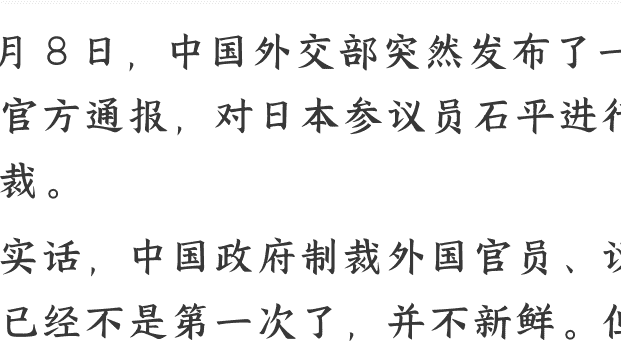
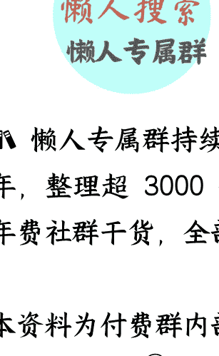
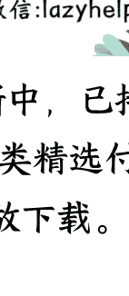

# 汉奸石平被制裁，究竟应该怎样惩治汉奸？

250910 文/卢克文工作室嘉宾 星海舰长

整理：公众号懒人搜索，懒人专属群独享
懒人微信：lazyhelper



9 月 8 日，中国外交部突然发布了一个官方通报，对日本参议员石平进行制裁。

说实话，中国政府制裁外国官员、议员已经不是第一次了，并不新鲜。但新鲜的是，这次制裁的日本参议员，竟然是个中国人。

那么，石平到底何许人也？为什么中国要制裁他？

石平 1962 年出生于四川成都，1980 年入读北京大学哲学系，毕业后进入四川大学哲学系任教。北大毕业、川大任教，在那个时代，可以说是妥妥的天之骄子了，前途无量。但是呢？石平工作后，长期热衷于搞所谓的“民主运动”，但对自己的本职教学工作毫不上心。

没过多久，就在学校混不下去了。

不知道他走了什么路子，拿到了公派赴日留学的名额，在 1988 年前往日本。一到日本，石平就感觉到了天堂一般，在赴日第二年还发表了“精神诀别书”，说“我对这个国家（中国）已毫无牵挂，也无爱恋或义务可言。”

此后，石平一边打工，一边在日本上学，并一路读到了神户大学博士。

但毕业之后怎么办呢？

说实话，学哲学的日本人都找不到工作，更何况一个留学生？

不过，很快石平就找到了一条赛道：骂中国。

日本有反华民意基础，只要把这些抓住了，就相当于现在的自媒体，找到了适合自己发展的垂直细分领域，吃喝完全就不愁了。

石平出版了一系列名为《我为何抛弃了中国》《为什么中国人连 1%的未来都没有》等一系列反华书籍，颇受日本右翼欢迎，然后就以作家身份出道，出没于《产经新闻》，以发表各种各样的反华言论博出位，包括不限于：

- 否认南京大屠杀，说中国展示的南京大屠杀罪证是“谎言词典”，宣称“我们日本人”不用为此感到愧疚或者道歉。

- 公开支持日本政要参拜靖国神社，主张日本应突破和平宪法、发展核武器。

等着等着。

靠着骂中国，日本人看到了他的价值，在经历了一系列考察后，石平在 2007 年终于得到了心心念念的日本国籍，换了个日本名--石平太郎。

拿到日本国籍之后，石平就更无顾忌了，在《产经新闻》专门创建了一个属于自己的专栏“石平的 China Watch”，不论中国大事小事都能跳出来夹带私货地评论一番，评论文章高产似母猪。

随后，石平骚操作不断，先是跑到台湾拜见李登辉，然后在自己的老家遭遇地震（2008 年汶川地震）后也反对日本人给家乡捐款。

那么，为啥石平骂了几十年，中国也没啥动作，这都 2025 年了，中国才突然制裁了呢？

答案很简单，石平从政了。

络舆论来宣传，其社交媒体账号有 400 万粉丝，人称日本特朗普。

吉村洋文的右翼思想，使他认识石平之后，大有惺惺相惜、相见恨晚之感，力邀石平加入了维新会。

这正中石平下怀，因为石平骂了中国几十年，该骂的也都骂差不多了，也开始酝酿着转型，而日本维新会正是他借壳上市、进入政坛的好机会。

于是在 2025 年，石平借口对石破茂的对华政策不满，决定参选日本参议员员。

万万没想到，自己迎来的是当头一棒——日本人并不希望他参选。

说实话，日本人对石平的“孝心”很满意，但日本人的观点是，虽然石平归化了，本质上还是中国人，如果开了这个口子，源源不断的移民就会进入日本政坛，夺走原本属于日本人的从政机会，这个口子不能开。

石平被骂了半个多月，都差点郁闷了，最后不得不宣布放弃参选。不过，政治权力的诱惑是巨大的，蛰伏了没几个月后，石平又卷土重来，6 月再度表示竞选参议员。

你还别说，在 7 月份的选举中，石平还真当选了，成为二战之后，第一位没有日本血统的归化华人参议员。虽然这个参议员是靠着“比例代表制”，借着维新会的光蹭上的，但起码是货真价实的。

当然，石平想真正掌握权力，也不是那么简单的。

一般来说，新当选的国会议员没啥实权，只有在 6 年后连任或者连续 3 次当选后，才可能进入国会相关委员会参与决策。

可到时候，石平都多大岁数了？

不行，为了达到实现自己的计划，石平必须剑走偏锋，快速捞取政治资本。

巧了，机会还真的被他发现了。

不知道石平刷了多少快手，终于发现，有个中国网友用 AI 做了日本裕仁天皇变狗的视频。

播放量区区几千。

石平一看就如获至宝，这是对天皇的大不敬啊，充分说明了中国人的刻骨仇恨，然后，石平就在自己的频道上把这个视频给曝光了，提交给日本外务省。

石平的算盘很精明，如果日本政府冷处理，那他就可以趁机攻击石破茂有辱国格，是国贼。

如果日本政府小题大做，自己就大肆标榜自己是视频的发现者，借此获得右翼的好感。

说实话，这种丑化裕仁天皇的视频早就有了，日本外务省也不是不清楚。

但日本外务省也真的懒得管，一方面是管不过来，另一方面是因为日本政府一直把自己摘得很干净，过去的日本人做的恶关现在的日本人啥事？这个逻辑套过来就是：你侮辱过去的日本天皇，和现在的日本天皇有啥关系？

但问题在于，石平以参议员的身份把所谓“罪证”提交给外务省，外务省就不能不管了，要给议员做个交代嘛。

所以，外务省只能硬着头皮找中国交涉，要求中方“尽快采取适当措施”。

中方是咋回应的呢？一句“我们正在了解此事”就把这事给撅回去了。

但是这件事呢，却意外地让中国网友发现了新世界。

难怪我们 PS 安倍心眼子多，COS 山上彻也你们没反应呢，原来你们是对天皇敏感啊，早说啊！这下可算找到本子的七寸了，这不得狠狠地打？反正现在 AI 技术这么发达，想要视频，管够啊！

于是，新的恶搞视频层出不穷地冒出来，有裕仁学狗叫的，有拳击裕仁的，还有裕仁变校服少女的以及变老鼠的，层出不穷，而且已经不仅限于中国媒体平台传播了，开始向 X、Reddit 和 YouTube 大规模蔓延了，

连带着美国当年把裕仁画成老鼠的宣传画也跟着火了一通，帮助全世界人民都复习了一遍日本的侵略历史。

结果，原来播放量只有几千的恶搞裕仁视频，在石平的运作下，流量增长到了数以十亿计，成功变成了现象级事件。

恐怕这会儿，日本外务省连肠子都悔青了，正在痛骂石平是八格牙路呢。

不仅如此，石平的行为也直接引起了中国的注意，矮油，原来日本还有个出身中国的汉奸参议员啊，行了，啥也别说了，制裁吧！

于是也就有了开头那一幕，石平刚当上参议院俩月，就喜提制裁套餐，瞬间达到了卢比奥的层次，也不知道是该荣幸还是该郁闷了。

# 2

这次中国对石平的出手，其实引出了一个问题：我们应该如何惩治海外汉奸？

说实话，海外的汉奸，其实也是分三六九等的。

海外汉奸的成分非常复杂，有的是 80 年代的河殇派国内混不下去跑出去的，有的是邪教分子，有的是移民中介和移民律师，有的是拿西方国家资金吃反华饭的，有的是单纯的洋奴慕洋犬，还有各种原因出去的网逃、电诈分子、润人、贪官家属等等。

无一例外，他们一方面极度媚外，以一种常人难以理解的皈依者狂热，去疯狂吹捧西方。另一方面无脑黑中国，认为中国做什么都是错的，中国和西方对抗是死路一条，只有跪下才有出路。

平时在网络上和咱们打嘴仗的，基本就是这些人，也是我们最为熟悉的。

说实话，这样的人挺可悲的，因为现实生活中他们融入不了西方世界，又面临社会地位落差，产生心理失衡，只能跑到中国的网络上通过“炫耀”来寻求心理平衡。

可偏偏近些年中国崛起的速度非常快，很多方面已经超过了西方国家，这直接削弱了他们在异国的优越感，于是他们内心深处的自卑感与虚幻的优越感交织，形成一种既自我厌恶又自视甚高的奇葩心态。

说白了，这些人就是一群败犬，你跟打嘴仗都是浪费时间，所以中国官方对这些人也不怎么管，他们日骂夜骂，还能骂死中国不成？

但是呢？有一类汉奸，我们必须要警惕了，那就是已经进入西方国家决策层或者为西方国家反华行动出谋划策的。

比如美国诬陷华人科学家的“中国行动计划”、搞所谓“新冠病毒溯源”、主张建立“北大西洋印太公约组织”的策划者是谁？是汉奸余茂春。

比如西方国家所谓的新疆“强制劳动”谣言，是谁在卫星地图中把新疆的敬老院、小学和小区都标记成了“集中营”，为新疆谣言提供佐证的？是汉奸许秀中。

还有这次的石平等人，也都是这样的。

虽然这样的人是少数，但相比那些只会在网上乱叫的汉奸，这类汉奸的破坏力非常大。

为啥？因为他们的身份背景就是他们的“武器”。

一件反华议题由白人说出来，很多外国人可能会将信将疑，觉得他是种族偏见和种族歧视。

但同样一个反华议题由一个汉奸说出来，那可信度就高多了。

而且这些汉奸一般都很了解中国人的思维模式和思维习惯，更了解中国社会的潜规则，这些信息提供给西方国家的决策层后，很多对中国出台的措施就会更有针对性。

对于这一类汉奸，劝说和挽救已经没用了，只能坚决予以惩治。

但问题在于，他们在国外，如何惩治呢？

有人说，石平这样的人，恐怕在国内早就没财产了，你就算冻结财产、禁止签证，恐怕对他们也没什么影响啊。

其实吧，这些制裁手段只是表面，更关键的在于，是通过制裁，给他们制造一种被中国的“驱逐感”和“抛弃感”。

说实话，哪怕是汉奸，也是有感情的，石平的一半人生都在中国度过，特别是青少年时期的记忆、情感、婚姻、关系等等，这些是石平再怎么抹黑中国，也抹不掉的，更是一种特殊的情感联系。

可现在呢？不仅石平来不了中国了，也没法和国内朋友合作了，就连其亲属也办不了签证了，明明白白把石平列为了“敌人”，彻底让他和中国恩断义绝，以后石平亲人去世，恐怕他连奔丧都做不到了。

这种心理上的巨大打击，比冻结点资产要严重得多，相比诛财，这种诛心才能让汉奸更痛苦。

不仅如此，现在的制裁内容还只是政府的，民间会不会跟进？比如北大撤销其学历学位？家族将其开除出族谱（就像余氏家族开除余茂春一样）？他加入的一些同学会、同乡会、联谊会乃至微信群，也没准会将其清除出去，让其尝尝社会性死亡的滋味？多管齐下，那效果才会更好。

更关键的是，这一招也是杀鸡给猴看。

就算石平和中国都切割干净了，那其他汉奸是未必切割干净的啊，没准在国内还有房产、资产和未来的遗产呢。

一旦国家层面制裁，那就形成了一种威慑，汉奸们的行事就会谨慎一些，也许嘴上仍然反华，但如果要对西方国家的反华决策出工出力的话，那可能就要掂量掂量了。

而这，可能就是这次制裁石平的初衷。

说实话，海外反对势力，不是只有中国有。虽然中国不是苏联也不是印度，不会搞海外暗杀这一套，但这并不代表中国会对海外汉奸坐视不理。也许，随着国家力量的强大，中国真的有必要建立体系化的海外汉奸惩治机制了。

# 最后，安利小懒的付费群：

## 懒人专属群（介绍）





📆 懒人专属群持续更新中，已持续运营 6 年，整理超 3000 份各类精选付费文章 &
年费社群干货，全部开放下载。

本资料为付费群内部分享，仅供真实有需要的朋友查阅 🙈

## 懒人专属群更新记录：

```text
https://lazy2025.top/blog/record2
```

懒人专属群更新记录（需梯子，备用）：

```text
https://lazybook.fun/blog/record2
```