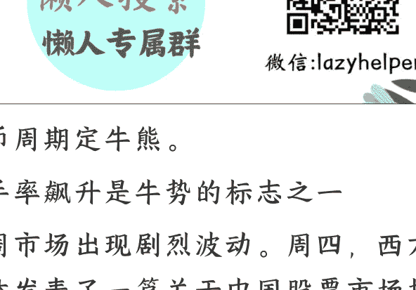
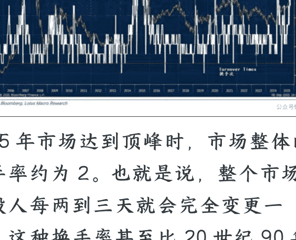
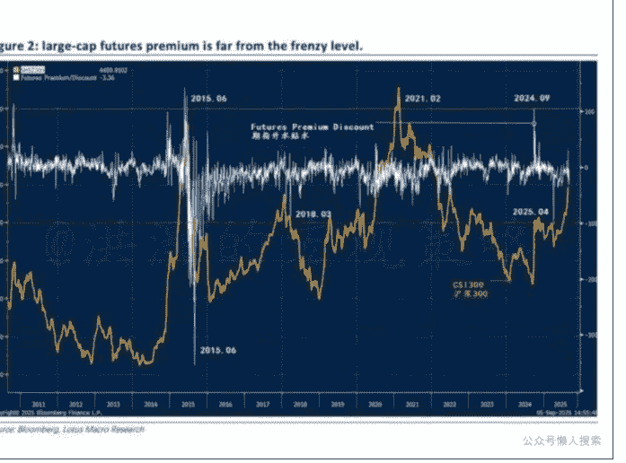
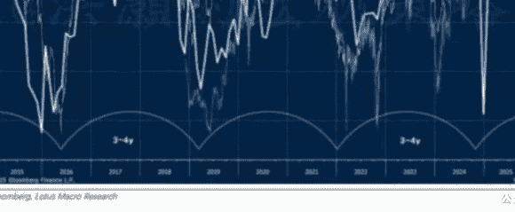
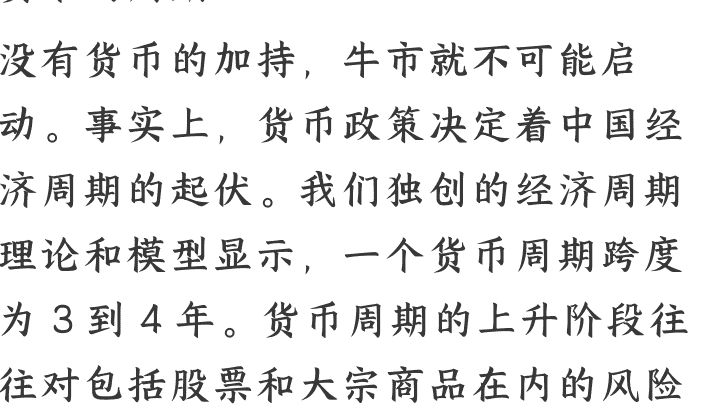

# 货币的周期

250910 洪灏的宏观策略

整理：公众号懒人搜索，**懒人专属群**独享

懒人微信：lazyhelper

货币周期定牛熊。

换手率飙升是牛势的标志之一

上周市场出现剧烈波动。周四，西方媒体发表了一篇关于中国股票市场投机的新闻，引发成长股大幅下跌。科创 50 指数下跌近 8%，创下今年最大单日跌幅。

其实，自 7 月以来，我们就认为决策层的思考已从容忍通缩转向刺激通胀，这是推动当前牛市的最重要的动力（2025 年 7 月 27 日《雅将牛》）。大型水利工程的宣布凸显了这一决策的转变。交易员现在应买入以通胀为主题的资产，同时减少以通缩为主题的持仓。我们很欣慰地看到许多国际著名的投行也开始认同这些观点。

尽管有些分析师将市场成交量飙升视为市场过热的证据，但中国股市的总市值现已超过 100 万亿元。因此，每日 2 至 3 万亿元的成交量并不像 2015 年的类似成交量水平那样引人担忧，因为当时整个市场的市值规模只有现在的一半。

2015 年 6 月 16 日，我们发布了一篇根据对于 800 多年金融历史数据研究而预测泡沫见顶的报告。这份报告标志着 2015 年泡沫期间市场的绝对顶峰，也标志着那时泡沫破裂的开始。在那份报告中，我们将换手率（即）通过市场的自由流通市值除以市场成交额计算得出——作为衡量市场泡沫的关键指标（图 1）。

2015 年市场达到顶峰时，市场整体的换手率约为 2。也就是说，整个市场的持股人每两到三天就会完全变更一次，这种换手率甚至比 20 世纪 90 年代初日本市场泡沫顶峰时期还要快。那时，无论有关部门是否打压融资融券交易，这种疯狂的换手交易情况都以为继的。而在我的报告发布的当天，泡沫就开始迅速破裂。鉴于该报告成功精准指出了 2015 年泡沫的顶峰，我们就能理解为何市场砖家们再次关注市场换手率了。

## 期指升贴水也并未显示市场过热

我们还可以通过考察指数期货的升贴水情况来判断是否存在投机狂热。我们的数据分析显示，沪深 300 指数期货的升贴水幅度并不高，处于正常的历史区间内（图 2）。

过去曾出现过两次沪深 300 指数期货溢价飙升至远超正常交易区间后又暴跌的情况，一次是 2014 年末至 2015 年 6 月，另一次是 2024 年 9 月（图 2）。不过，即便是 2015 年那次，期货溢价最初的飙升也表明当时市场的“动物精神”回归，投资者再次愿意承担风险。随后，期货溢价虽有波动，但是一直持续到 2015 年 6 月，直到那时泡沫最终破裂，监管机构对指数期货交易进行了限制。

然而，看待换手率的正确方式应该是考察上述市值和成交量的比率，而非仅仅关注换手率的绝对数值。图 1 显示，尽管当前换手率较高，但这与 2007 年 6 月的情况相似，当时牛市在接下来的六个月里一路飙升至 6000 点。2020 年 8 月换手率激增，但随后市场持续上涨至 2021 年 2 月。事后看来，去年 9 月换手率的飙升似乎预示了当前的牛市。

简而言之，市场换手率飙升并非令人担忧的事。相反，这很可能是牛市的标志，如果以史为鉴，市场可能还会有三到六个月的上涨行情。

# 货币的周期

没有货币的加持，牛市就不可能启动。事实上，货币政策决定着中国经济周期的起伏。我们独创的经济周期理论和模型显示，一个货币周期跨度为 3 到 4 年。货币周期的上升阶段往往对包括股票和大宗商品在内的风险资产有利，而在其下降阶段则情况相反。

在图 5 中，我们用实际数据展示了中国货币周期的运行情况及其对风险资产价格的影响。我们注意到，目前央行货币周期正处于上升阶段，这往往预示着中国股票和大宗商品会有良好表现。鉴于其历史一致性，我们认为这也是牛市的关键驱动因素。由于这个 3 到 4 年的周期才刚刚过去 9 个月，我们认为现在对风险过度谨慎还为时过早。

## 两融交易也不足为虑

也有人担心融资交易规模现在已经达到了 2015 年的水平。砖家们认为，这种融资交易活动的加剧是投机过热的迹象，很可能会引起有关部门的关注。

然而，我们的分析表明，尽管市场两融交易活跃，但两融的成交量往往会领先市场走势约三个月。换言之，如果我们看到现在融资交易活动旺盛，那么未来三个月，市场也很可能会保持强劲态势（图 4）。

这种关系并不难理解。随着市场开始攀升，融资交易往往会加快步伐。在这个阶段，交易员会增加杠杆，预期未来会有更多收益。这种杠杆头寸会增强市场信心，推动市场进一步走高，形成一个良性循环。

当然，不受约束的融资交易最终会导致系统内杠杆积累，使市场变得脆弱且容易崩溃。在那个关键时刻，有关部门也不得不采取行动抑制杠杆，以保护散户投资者。然而，这种人为的去杠杆动作也不免引发市场的负面反馈循环。然而就目前而言，这种担忧还为时尚早。

## 结论

市场共识对成交量飙升和融资交易激增感到担忧。然而，成交量飙升往往是牛市的标志，而融资交易则领先随后强劲的市场表现。当然，杠杆上升过快很可能会引发有关部门的关注。但就目前而言，过早地意外扼杀了初期牛市的风险与市场脆弱性的风险是一个微妙的平衡。我们认为，从当前的市况来看，此类担忧目前还是杞人忧天。

我们独创的经济周期模型显示，中国的货币周期正处于上升阶段，在这个 3 到 4 年的周期中才刚刚过去 9 个月。

在这个货币环境宽松的上升阶段，风险资产往往表现良好。目前，由于股市仍在消化超买状况，这将考验交易员的技能和信心。

最后，安利小懒的付费群:

懒人专属群 (介绍)

懒人专属群持续更新中，已持续运营 6 年，整理超 3000 份各类精选付费文章&年费社群干货，全部开放下载。

本资料为付费群内分享，仅供真实有需要的朋友查阅🙈

懒人专属群更新记录:

https://lazy2025.top/blog/record2

懒人专属群更新记录 (需梯子，备用):

https://lazybook.fun/blog/record2