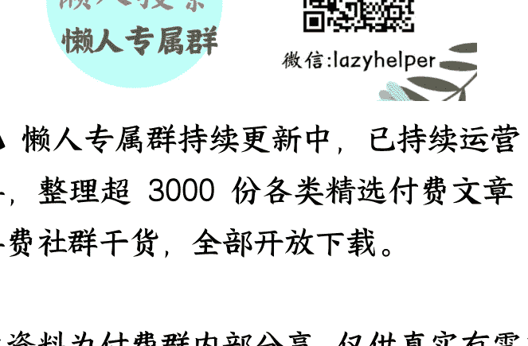

# 07 为爱成婚的衰落：爱情与婚姻真的无关吗？

## 250910 刘擎

**整理：**公众号懒人搜索，**懒人专属群独享**

懒人微信：lazyhelper

欢迎来到《爱情哲学 30 讲》，我是刘擎。

接下来的两讲，我们来探讨爱情与婚姻的关系。先从一个很简单的问题开始：彼此确认相爱的人应该结婚吗？

你可能觉得：那还用问？“婚姻是爱情的归宿”呀。

不过，这个答案好像越来越让人怀疑了。

我们看看现实情况。从 2013 年开始，国内的结婚率持续下降，而离婚率呈现一种上升趋势。以 2024 年的数据为例，国内的离婚与结婚比已经高达 57.5%，这意味着每 100 对伴侣步入婚姻的同时，就大约有 57 对夫妻在办理离婚手续。

“婚姻与爱情是统一的”，但实际上结婚和恋爱是完全不同的两回事。

在这里我们发现，对于爱情与婚姻的关系，出现了几种不同的观点，一种是信奉“婚姻是爱情的归宿”，我们把这个叫“婚恋统一论”；另一种主张爱情与婚姻是完全不同的两回事，我们称作“婚恋无关论”。还有第三种观点，认为这两者不只是不同，而且是互相矛盾的，也就是“婚姻是爱情的坟墓”，这种观点可以叫做“婚恋冲突论”。

我们会在下一讲讨论“婚恋冲突论”。今天这一讲，我们主要来分析前两种观点，探讨婚姻和爱情到底有没有关系。

## 从“婚恋无关”到“为爱成婚”

在前面的课程中，我们曾经提到，性亲密、爱情、婚姻和生育这四种活动，在理论上和实践中都是可以分离的。但爱情与婚姻之间却有着特殊的联系。为了爱情而结婚的理想源远流长，在古希腊神话和中国传统故事中都有迹可循，但在大部分历史时期，这并不是社会的主流观念。

美国历史学家斯蒂芬妮·孔茨（Stephanie Coontz）在她的著作《为爱成婚》中指出，传统的婚姻主要是一种制度安排，具有重要的经济、社会乃至政治功能，这种婚姻并不一定就没有两情相悦，但那最多只是偶然的“副产品”。

直到 18 世纪末，爱情和婚姻的结合才开始在欧洲与美国出现。启蒙理性与浪漫主义共同助长了一种“激进的新观念”，认为真正美好的婚姻应该建立在爱情之上。这种观念逐渐传播，大约到了 20 世纪才逐渐普及，成为主流的婚恋观。

这样说来，婚姻与爱情相统一，是现代文化的产物，具有一定的历史偶然性。

当然，从传统观念来看，将婚姻这种利益攸关的制度安排，托付给变幻莫测的爱情，实在是太不理智了。其实，在这种做法兴起之初，就有人警告，爱情主导的婚姻，必定会颠覆婚姻制度的稳定性。因为，当爱情成为婚姻的唯一正当理由时，爱情的终结也不可避免地成为婚姻终结的理由。

但令人惊奇的是，为爱成婚的实践最初并没有瓦解婚姻制度，而且似乎还提高了婚姻的满意度，这种状况维持了大约半个世纪，以至于让人相信，婚姻与爱情必然是密切关联的。

## “为爱成婚”理想的衰落

那么问题来了，为什么过去几代人追寻的“为爱成婚”的理想，在当代似乎越来越遭到怀疑了呢？一个最直接的答案是，许多为了爱情而结成的婚姻，实际上远没有期待中的那么理想。

这是为什么呢？原因有很多，但至少有一个原因是相当重要的，那就是婚姻中的性别不平等。

德国哲学家普莱希特在《爱的哲学》中指出，“为爱成婚”的理想在 1960 年代的西方达到了全盛。但以今天的标准来看，那些因为爱而组建的家庭，完全谈不上理想。比如，当时“没有丈夫的允许，妻子不准外出工作；女性不能有自己的银行账户，也不能和别人缔结合约”。妻子只要涉嫌“外遇”，离婚时将净身出户，但婚内强暴却并不违法，抚养孩子的责任几乎全归母亲。婚姻中这种严重的性别不平等，很难滋养爱情的成长，更不用说实现理想的爱情了。

另外，还有多种现代的社会文化原因，让“为爱成婚”在现实中远不尽如人意。比如，人们期待的浪漫情感、性满足、自我实现和深度沟通等等，都难以充分达成。前几代人在理想破灭时，大多愿意选择维持不理想的婚姻，而当代的年轻人则更倾向于选择离婚或不婚。

为什么呢？因为现代社会的几种重要变化，打破了传统的束缚，冲击了婚姻的稳定性。

首先，工业化和城市化进程，让人们不再需要通过婚姻状态获得社会认可。

想想过去，离婚好像是个难以启齿的“家丑”，很多人担心，离婚会影响自己的形象，会被亲戚朋友、街坊邻居指指点点，会被社会歧视等等；而现在，很多人愿意选择公开承认离婚的事实，周围的人虽然会关切，但也能理解：不合适就分开，这很正常。

可以说，社会对多样化的生活方式更加包容了。

其次，过去人们普遍认为女性在亲密关系中是被动的，但随着实验心理学的发展和性别平等观念的兴起，这种看法被打破了。

比如，在传统观念中，妻子要尽量满足丈夫需要，而自己的身体需求和感受很容易被忽视。而今天，许多年轻女性会坦然地和闺蜜讨论，什么样的伴侣让她们感到满足；如果在亲密关系中感到不被尊重或不被满足，她们会坦率地表达自己的意见。另外，安全的避孕措施，以及现代司法中对非婚生子女的公平待遇，都大大降低了“性自由”的代价。

第三，男女双方对彼此的功能性依赖正在减弱。传统婚姻中，女人对丈夫的经济依赖，以及男人对妻子的家务依赖都被大大缓解。

一方面，当代社会有越来越多的女性受到了更好的教育，在就业市场上的竞争力不断提高，这种经济独立，大大减弱了她们对婚姻的经济依赖。

另一方面，随着智能产品不断升级，还有外卖、保洁等服务业的发展，不管是男人还是女人，都更容易实现“家务生活自理”，降低了对婚姻的依赖。

所有这些变化，都使当代青年有了更多选择的自由，不用再像过去那样“不得不结婚”或者“不敢去离婚”。他们表现出比前几代人更强的自主性，不愿意“将就”，也更容易摆脱没有爱情的婚姻。

## "婚恋无关论"的复活？

听到这里，你可能自然会想：既然“为爱成婚”的理想落空了，那么大家都都会相信，爱情与婚姻无关了吧？婚恋无关论，在理论上很容易理解。就本质而言，两者完全是不同的东西。婚姻是一种社会契约，它就像签合同。你需要去民政局登记，填各种表格，等等。可以说，这是一套制度性的安排，在法律、道德和经济等方面，都有明确的权利和义务。

爱情呢？爱情是个体间自由自愿的情感关系，是一种相互渴望在一起的感觉。你不需要向任何机构申报你爱上了谁，也没有法律条文规定，你必须怎样去爱一个人。

这是本质上的不同。

这说明什么？说明虽然婚恋无关论在理论上很有说服力，但在现实生活中，人们并没有完全相信，也没有完全这么做。

那么问题来了：人们内心深处对婚姻到底还有没有期待？人们真的愿意坦然接受没有爱情的婚姻吗？下一讲，我们会继续探讨这个更深层的问题。

## 总结

总结一下：

“婚恋统一论”认为婚姻是爱情的归宿，这种观念虽然源远流长，但真正成为主流是在近两个世纪的事情。不过，由于各种各样的原因，这种理想在当代婚姻中并没有充分实现。

而“婚恋无关论”则是一种更古老的观点，它认为：爱情和婚姻是两种不同性质的东西。这虽然在理论上成立，但现实状况表明，人们内心深处似乎对婚姻还是抱有超越了功能性的期待。

## 思考题

今天的思考题是：你认为，婚姻需要爱情才能幸福吗？欢迎你在留言区分享你的想法。

我是刘擎，我们下节课再见。

最后，安利小懒的付费群：
懒人专属群（介绍）

📂 懒人专属群持续更新中，已持续运营 6 年，整理超 3000 份各类精选付费文章&年费社群干货，全部开放下载。

本资料为付费群内部分享，仅供真实有需要的朋友查阅 🤫

懒人专属群更新记录：
https://lazy2025.top/blog/record2

懒人专属群更新记录（需梯子，备用）：
https://lazybook.fun/blog/record2