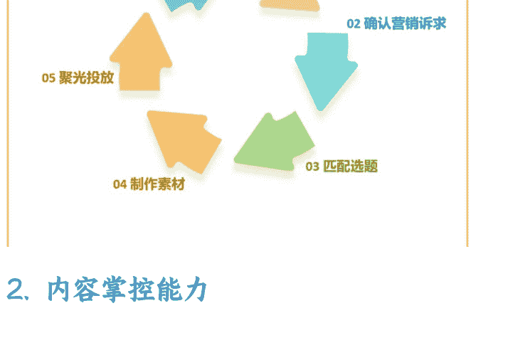

# 如何招到一个靠谱的投手，看这 5 个点

250910 生财精华

公众号懒人搜索，**[懒人专属群](http://t.cn/REvXs8E)**独享

懒人微信：lazyhelper

全文大概 6200 字，看完共需 20 分钟

做服务商这些年，我见过太多老板在找投手这件事上踩坑，要么代运营乱跑，要么自己花不出去钱

很多人都希望能招一个靠谱的合适的投手

今天我就从实战角度，跟大家聊聊如何识别、寻找和培养一个真正能打的投手

## 1. 招投手

广告烧的钱多的投手不一定是好投手，但是好的投手他一定烧过非常多的钱

所以如果你想靠挖人或者招人，找到一个非常靠谱的投手过来

其实相当于，你打算花钱去买一个人花了很多钱之后的经验积累，这个费用想想都不能便宜

假设你真的下血本真的要招一个有经验的，那很容易马上踩一个坑

比如说，所以很多老板面试投手时，一上来就问“之前跑过什么量级？ROI 能做到多少？”

这样问其实最容易被忽悠

花过钱代表了实力，这确实不假

但是，沙僧肩膀上的扁担也可以说自己参加过取经项目

你面对的这个人，他也确实参加过取经项目，但是他能帮你做好事吗

不一定吧

所以，就算你铁了心要花大价钱招一个牛逼的投手，也得从正确的角度去看人

你面对的这个人，他也确实参加过取经项目，但是他能帮你做好事吗

不一定吧

### 那怎么看一个信息流投手到底行不行

先给他看一个正在跑的账户，让他分析问题在哪

如果他看着广告后台给你做分析

那就可以让他走了

会提出来看一下账号的，结合账户、账号和投放素材一起分析的，算是过了第一步

然后重点看下面这些方面

### 1. 优化思路

准备一些预先的问题，比如说成本飙升怎么办？跑不出去怎么办？投产上不来怎么办？有进线没成交怎么办？

一般的回答无非就是：加预算建计划换素材

会这么回答的人，要么是能力特别差的，要么是能力特别强的

菜鸟这么讲，是因为他只会这几个动作

高手这么讲，是因为他脑子里知道每一步应该怎么系统性的调整，返璞归真了

所以可以往深了问一问

有经验的投手，会去倒推数据、看素材、看线索、看话术，分析是哪个环节出问题，是定位就偏了、素材和诉求错位了、竞争激烈了、计划跑飘了、还是素材疲劳了

然后制定系统性的优化方案

### 2. 内容掌控能力

不懂内容投手，都不是好投手

如果只是需要一个帮忙拉广告计划的人，
那你也不需要招人了，随便安排个实习生
就能上

信息流广告，计划和素材是密不可分的，
所以一定要看一下他的内容能力

不一定要追求百万爆款，很多能跑量的素材，它的自然流反而很差

而是要看这个人对跑量素材或者高投产素材的理解

看着素材和数据，能知道内容哪里出了问题，该如何调整

该如何安排内容和广告计划的配合，什么样的内容适合跑量，什么样的内容适合种草，什么样的内容适合成交

还有，如果你的行业违规率比较高，也可以问问他自己这个内容到底哪里违规了

如果直接拿出一套敏感词，跟你说这些词汇是不能用的，不是菜鸟，就是职场油子

真实的敏感词是一个动态的标准，核心是能否理解平台审核的标准和界限

### 3. 对行业和业务的理解深度

投手说白了也就是个岗位，跟运营和主播一样，也是跟着行业走的

行业跟行业之间的差别非常大

价格、决策周期、成交方式、人群定位、时间季节、素材媒介等等因素，会直接影响投放的方向、成本规划、投放节奏、复盘计算方式

可以问问他，以前有没有过你这个行业的经验

如果没有这个行业的经验，那就跟他讲一些自己这个行业和产品的情况

让他分析你的产品应该投什么人群，应该主打什么需求点

靠谱的投手会从年龄性别兴趣标签行为标签这些角度来分析

还有一些牛逼的投手，拥有非常敏锐的挖掘真实需求的能力

你跟他讲的产品情况，是你理解的自己的产品卖点，和目标人群真实需要的有需求的买点，是两码事儿

经验丰富的投手都是广告狂人，人性大师，对熟悉行业的用户需求有非常深刻的理解，知道用户在什么场景下会产生购买需求

当然咱们只是招员工，不是请大师

所以也不追求百分百准确

重点还是看他整个的思维逻辑，以及对于行业和业务的理解深度

### 4. 沟通和管理能力

投手不是纯技术岗，他需要跟产品运营设计多个部门合作，甚至要管理外部供应商

沟通能力和管理能力非常重要

举个例子，交流的时候动不动拽一些专业词汇，CPM, CTR, CVR, ROI.......你就问他能不能把用大白话把这些词讲出来

如果翻译不了，或者翻译出来的还是听不懂，说明他要么不够专业，只能拽词装逼，要么就是沟通能力有问题

那这个人进来之后是很难跟别人协同工作

还有，如果你想招的不是一个单纯的投手，而是一个能带领投放团队的人

那可以把自身团队现有的情况告诉他，然后让他描述一下完整的投放项目是怎么推进的

看他如何协调和安排素材产出，销售转化，投放复盘，各个环节的运转，这些都考验他的管理能力

不追求十全十美，毕竟沟通当中本身就是会有信息流失的，你给他传递的信息也不一定真实完整，核心还是看他输出的这套逻辑是否完善合理

### 5. 学习能力

学习能力强或者思维逻辑清晰的人，就算对如何使用工具不了解，也很值得培养，因为他们会成长的很快

这一点后面他会讲到

### 然后还有一些特质，要重点提防一下

有这些特质的人，不说百分百都是骗子，但是大概率是滥竽充数的:

没有亏钱经验。你问他有没有失败的案例，只要是有经验的投手绝对踩过坑，很多经验就是跌倒过之后才能学会的

如果只有成功案例，没有失败案例的，这是神仙，你给他供起来

对平台更新不敏感，信息流平台的变化都是很快的，问问他最近平台有哪些规则更新，就算不是最新的，最起码得是半年内的

你要招的是一个能解决问题的人，而不是招一个广告平台的使用说明书

保 ROI，张口就说保证 ROI 多少多少的，基本都是在吹牛，直接让他走

不同行业、不同品类，甚至同样的品在不同商家那里，它的适合 roi 都是不一样的

有经验一点的，只会根据行业基准和产品特性预估一个区间

甚至有一些老道的，在面试的过程中就会反向帮你算账，预估保底 roi 和利润 roi、盈利速度和规模

遇到这种属于捡到宝了，但人家不一定乐意留下来，一般都是他挑老板的份

只管计划不管素材，不用说了，直接让他走

## 2. 培养投手

招人确实会比较难，要耗费很多的精力去筛选

挖人又会踩坑，而且贵

所以如果实在招不到，那也不用挖了，性价比最高的方法还是自己培养一个

自己培养的投手对业务理解更深，忠诚度也更高

就算他跑了也没关系，只要培养人的这套 sop 还在，能培能养出一个，就能养出第 2 个

我的客户群体里面有很多商家，每个月几十万、几百万的消耗的都有

他们的投手都是草根出身，甚至没有专业运营的背景，只是单纯一直跟着老板干

首先肯定得知道一下后台的基础操作，不管是巨量 ad 的后台，还是小红书聚光的后台，乍一看其实都挺唬人的

要先知道广告后台怎么开户、怎么拿返点、怎么建计划、怎么上传素材，学习期是什么、保障期是什么

建计划的时候，不同诉求、不同预算、不同阶段应该怎么去调整设置

在哪里设置人群，在哪里看数据，在哪里下报表

看起来选项很多，但实际上都是有逻辑可循的，知道了逻辑就不需要去死记硬背了

自学能力强或者动作比较快的话，这个步骤一般三到四天能搞定了

如果是我的客户，或者说听过我课的人，这个周期能更短，一个小时就能在脑子里有基本框架

其次就是了解一些基础概念

CPM、OCPM、CTR、CVR、ROI、ROAS、A5 人群、AIIPS 人群……是什么意思，公式怎么结算

知道自己业务的核心指标有哪些，分别怎么计算，和这些核心指标有关的指标有哪些

这些概念也不用全部记住，大概知道就行了

不要在理论上花太多时间，够用就行，剩下的在实战中学

这个阶段的重点就是熟悉操作，能独立建计划、上传素材、看数据就行了，不会再老是问一些基础的操作问题

### **阶段 2**边做边学

从小预算开始练手，每天预算控制在三五或者有一两千，专注一个核心转化目标

让他每天建计划，调整素材，选择性的测试不同的人群和素材组合

这个阶段，如果投手的对项目的概念和整体的大局观还比较模糊，那么你的作用就会比较重要

团队里总是需要有个脑子的

你负责给方向，让投手去操作执行，逐渐的培养他的整个意识和理解

在实战中逐渐培养投手的数据敏感度

每天早上第一件事就是看昨天的数据，哪个计划跑得好，哪个跑得差，好的为什么好，差的为什么差

一开始可能说不出个所以然，但是每天看每天想，慢慢就有感觉了

培养优化思维

成本高了怎么办，量起不来怎么办，转化率低了吗怎么办

一开始可能只会换素材调价格，但是要引导他思考更深层的原因

是人群跑偏了还是素材过时了，还是说赵露思又开播了

培养跨部门协作能力

让他负责和做内容的沟通，如果团队的量级还很小的情况下，直接让他自己上手做素材

内容和沟通能力，比纯投放技巧更重要

这中间肯定会遇到一些想不明白或解决不了团队内想不明白或者解决不了的问题

这个时候就去找一些行业的前辈，或者找一些更专业的投手请教，实在不行请个顾问或者报个课

别害怕花钱，可能一个红包就能解决困惑你很久的问题

比起找代运营和代投帮自己烧钱，不管是赚了还是亏了，都烧的不明不白

自己花钱培养人，好歹能有经验留存

### 这个阶段的重点，就是培养数据感觉以及优化思维

目标是能从数据中发现和解决明显的问题

比如点击率突然下降了，转化成本突然上升了，要能察觉到问题，推测大概是什么原因，并且能有针对性的解决思路，而不是头痛医头脚痛医脚

达到这个目的之后，这个投手基本上就能独当一面了

### 阶段 3 系统化提升

边看边学，跑了两三个月之后，让他把自己整个工作流程梳理出来，构建一套完整的优化 SOP

包括每日必做清单，每周复盘流程，半月策略调整

这套流程要尽可能标准化，不能每次都是拍脑袋决策

做这个动作，一方面可以帮投手巩固和总结自己的能力和经验

另外一方面也可以帮助你摆脱对他的依赖，万一他想走了，或者需要调去别的地方，有了这套 SOP，你可以随时换人上来

构建完工作流程之后，如果他还还要在这个岗位上继续深入，那就重点培养他的以下能力：

深度的分析能力，不只是看表面的投放成本、点击率、转化率，倒逼他去研究用户行为路径，去做人群分析，要会找到数据背后的原因

策略制定能力，根据不同的业务目标制定不同的投放策略，种草的时候怎么投，促活的时候怎么投，转化的时候怎么投

这个阶段的重点，目标是能独立负责一个项目的投放，能调动资源想办法达到预期的目标

当然，最好是能给够钱，以及建立好感情，能到这个阶段的人很少，不要让这样的人才跑了

然后再说几个培养人的时候，需要注意的事情

复盘的时候，作为老板或者作为项目负责人的，你不能偷懒，必须得带着做，他如果有这个带头复盘和操盘的能力，他就不需要你培养了

鼓励试错，别怕烧钱，好投手都是烧钱烧出来的。成长出来之后也是能帮你成倍把钱赚回来的

但也要要控制风险，设置计划预算日预算和阶段预算，鼓励他在可控成本范围内大胆尝试

还有要分清哪些钱是试错烧出去的，哪些钱是误操作烧出去的，如果是粗心大意不小心跑飘了的这种，该罚得罚

当然，前提是你自己能分得清

用好费曼学习法，有了一定经验后，一定让他去整理工作流程，以及带新人，可以

考虑把这个工作纳入绩效考核，教学是最好的学习方法

找个老师傅带着，请个顾问或者找个老师，虽然不能百分百避免踩坑，但确实可以走一些捷径，不用等到花了几万甚至几十万出去之后才反应过来踩坑了

## 3. 选人才与特质

不管是从自己团队里培养一个投手，还是招一个投手，跟着他一起成长

一个优秀的投手，总是会有些共同特质，在选人的时候可以重点关注一下

### 首先，优先考虑这些背景的人

运营出身的，有数据敏感度，懂用户心理，理解转化漏斗
有过一些营销推广经验的，做过地推做过活动运营，对获客成本有概念
电商运营的，懂直通车懂数据分析，转投手可以说是无缝衔接

如果是应届毕业生，在学校里有过一定的自媒体探索经验，并且学习能力较强的，也可以优先选择

因为他们的职场习惯和思维惯性还没养成，很好培养

### 其次，避开这些人

*   纯技术背景，但是不懂业务
*   财务出生，数据敏感但是过于保守
*   传统广告出身，但是不懂自媒体
*   性格过于内向，不善于沟通和协作的

### 再次，重点关注这些特质

首先很重要的一个点是归因能力

什么是归因能力

就是根据表面的数据，逆向推测真实原因的能力

不管广告跑的好还是不好，都能根据实际情况找到大概的原因

播话术牛逼，还是说你这个产品本来就很牛逼......

数据不好的时候，到底是自己出价出了问题，广告计划出了问题，编导策划出了问题，主播的话术和状态出了问题，产品本身的卖点就有问题，还是说现在大盘本身就不好，同行的数据也不好......

能根据数据反馈找到正确的归因，和随便找一个原因然后把锅甩出去，把功劳给自己

这两个事情完全不是一个概念

虽然现在的数字广告所有的数据都摆在我们面前了，但实际上大部分人却没把这些数据用起来

也很难根据数据百分百的找到这个数据背后的原因

本质还是因为平台算法是不透明的，是一个黑盒

我们所有的广告计划都是建立在平台的算法之上的，投手能做的就是用好归因思维

### 尽可能的找到最接近真相的答案

经验越多的投手，越容易找到原因

如果一个人，他的归因能力很好，说明他逻辑思维能力很好，并且数学不会太差，而且会分析和复盘

有这些基本特征，基本就能保证当你把他招过来之后，你给他一定的预算让他去跑，让他去消耗他可以成长的非常快，和你的团队互相打配合，成为你们业务新增长的助力

去帮你们团队做一个有效的增长，而不是去做无用的投放

### 其次就是他的思维活跃度

往大脑内输入足够多信息量的时候，能不能快速的从一个点联想到另一个点

思维活跃度直接决定了这个人未来的数据敏感度、商业敏感度、需求敏感度

但这个事情也得有度，思维太过跳脱也不太好，没办法静下心来做事情，也没办法沉下心来去钻研

可以试探性的问一些他不了解的内容，看看他的思维延展性如何

再次，一个优秀的投手，需要有很强的抗压能力和执行力

数据不好时不慌乱，业绩完不成的时候不会手足无措，静下心来去做复盘

投手本质上是运营岗位的一个延伸，同样天生具有管理属性，做管理最怕的就是自乱阵脚，所以抗压能力非常重要

至于执行力，这个重要性，就不用我说了

这两个能力前期面试的时候很难看出来，但是可以在实习试岗的时候，很快测试出来

给他施加点压力，看他的反应

最后，我觉得最重要的一个点，是快速学习能力和学习的意愿

永远对新鲜事物保持好奇，学习东西的速度比别人快，能快速从失败中总结经验

其实这个能力跟每个行业、每个行业岗位都是很适配

但是相比较而言，自媒体和信息流的迭代速度非常快，所以学习能力和意愿要求会更高

能学是一回事，爱学是另一回事，这两个都得有

就算一开始，啥也不会完全没接触，也可以在很短的时间内成长起来

有了一定基础之后，依然保持这个特质，也很有帮助

比如新功能上线第一时间上手测试，就有可能和同行打出几个月的时间差

## 4. 代投服务

在完整的团队里面，投手不单单是一个执行岗位，更是业务增长的重要推动者

但是如果你想找代投，那这个时候，这个投手他大概率只能是一个执行角色，他很难起到关键的推进作用，也很难给出很牛逼的建议

带头本质上就是一个劳务外包，特别牛逼的投手是没有时间接代投的，就算有它的成本，也远高于你自己培养一个人出来

代投只能负责解决你自身团队劳动力不足的这个问题

而思维决策还是要靠团队里原有的大脑

这就是我这两年一直在提倡大家不要找代投，而是自己养人或者直接自己上的原因

虽然我自己也有在接代投，但是我确实接的很少，大部分的客户找我，我都是拒绝掉的

只有两种情况我会考虑，一是团队真的刚开始，人手不足的情况下，帮他过渡一下；二是他自身的项目已经跑成熟了，现在处于放大阶段，需要有人帮他做放量

而且每次开始前我都会跟客户讲的很清楚

我只负责帮你解决劳动力的问题，我能保证我给你的人比你直接招来的人，经验更足，能力也更强，也会给你做复盘和优化

我也会尽可能的用我的经验去赋能这些投手，让他们给你服务

但我也确实没办法向你保证什么东西

影响一个项目投放结果好坏的因素实在太多了

有很多项目在我投放开始之前，我就知道他最后的结果，只是没办法直接说

对付费咨询的客户是能直接讲的，他花了这个钱，买的就是真相

但是其他的客户就不好讲了，要直接说了，人家可能还生我气，说我不吉利

## 最后

确实，找到一个靠谱的投手确实不容易

但如果掌握了正确的识别方法，或者愿意投入时间和金钱去培养，完全可以打造出适合自己业务的投放团队

**选对人、用对方法，你的投放效果一定会越来越好**

**在这个流量越来越贵的时代**

**一个优秀的投手**，会成为你项目增长不可或缺的增长动力

希望这篇文章能帮你找到或培养出那个能为你打江山的投放高手

< 以上 >

**最后，安利小懒的付费群：**

**懒人专属群**（[介绍](#)）

懒人专属群持续更新中，已持续运营 6 年，整理超 3000 份各类精选付费文章 & 年费社群干货，全部开放下载。

### 本资料为付费群内部分享，仅供真实有需要的朋友查阅 🤫

### 懒人专属群更新记录:

[https://lazy2025.top/blog/record2](https://lazy2025.top/blog/record2)

### 懒人专属群更新记录（需梯子，备用）:

[https://lazybook.fun/blog/record2](https://lazybook.fun/blog/record2)