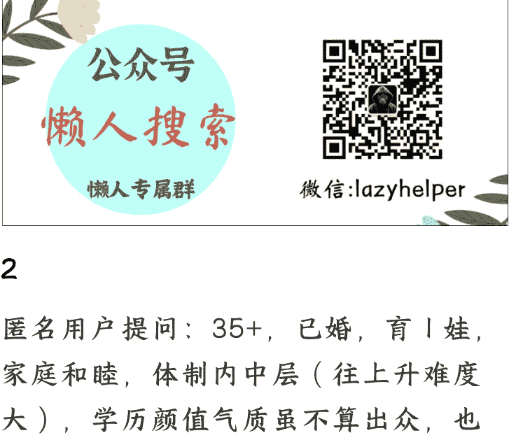
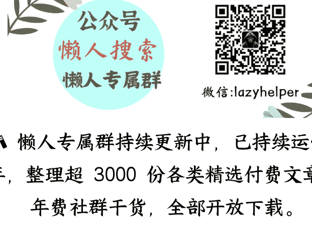

## 灰玻璃学姐 22 篇问答

250911 灰玻璃学姐

整理：公众号懒人搜索，懒人专属群独享

懒人微信：lazyhelper

### 匿名用户提问：学姐好，我想咨询关于事业的问题。从我个人成长看，在雌竞赛道和雄竞赛道走出了天壤之别的性价比。先说雌竞，真的是一路畅通。读研时发觉自己年龄不大了，开始思考要找一个什么样的人共度一生，然后打开自己的全部渠道，认真展示自己，很快遇到现在的先生，婚后育有一儿一女，先生自己创业，经济富足，每日早早回家带娃，拒绝一切出差，也非常宠我。我想我大概真的就是运气好。

再说雄竞，真的是费劲九牛二虎之力最后还痛苦不堪。我从小一直非常努力，幸运地考上当地核心部门的公务员，然后被分配去了一个边缘化岗位。可悲的是这个边缘化岗位工作量并不小，自己兢兢业业加班加点，最后还是不被领导认可，在提拔的重要问题上被碾压，最后迫不得已调岗去了别的科室。虽然换了环境，暂时摆脱没被提拔的抑郁情绪，但是感觉自己自信全无，对将来的职业发展感到迷茫。如果说只是因为不会拍马溜须才不被领导认可，我倒可以接受。但是我感觉直接领导对我的材料也并不满意（我主要从事文稿工作），经常有意无意点我，说谁谁的材料写的多好。我在想，自己当年是千军万马过独木桥才进入的现在的部门，按理说写作能力是没问题的，为什么不被认可呢？关键是领导经常嫌弃我写的不行，但还拼命让我写。我不知道自己到底是哪里做的不行？这种想法导致我在新的岗位上也是如履薄冰，总担心自己哪里做的不对领导的脾气，或者哪里漏掉了什么事，心态上一直就是小心翼翼。先生一直让我放平心态，既然雄竞赛道走的这么痛苦，不如就把精力放在家庭，在职场上就按时上下班，做好份内事，别的就别去争取了，反正也不差钱，别因为小芝麻丢了大西瓜。PS：我从进入这个部门，一直以来都是女领导，感觉非常摸不透她们的想法，自己忠心耿耿，认真对待领导安排的工作，却还是被嫌弃。

学姐一直强调职场上向上管理，但是具体怎么做呢？像体制内层级比较严，我一般也只对直接领导负责，这种情况如何向上管理呢？我在雌竞赛道和雄竞赛道的这种差别是不是跟我的性格有关？还有突破的可能和必要吗？

谢谢学姐。

### 「回答：」

1、向上管理就是凡事有交代，件件有着落，事事有回音。汇报要勤，记住：只要她想起某件事来问你，说明你汇报已经晚了。这类领导只要对你不放心，猜疑越来越多，就会插手你负责的具体领域，会消耗你更多的时间精力应付她。

2、体制内写材料的笔杆子工作本来就是一种最难的，领导经常嫌弃你写的不行，可能你确实没有掌握诀窍。你要对工作有预判，如发现可能无法完成目标，无法解决的问题，一定要尽早寻求领导帮助。

比如在搭框架阶段就要让领导介入，如果你写的就是他认可的逻辑，那即使写的言语平平，对方也很满意，如果你写的是自创的框架，不是他心里想的，就算写得天花乱坠对方也不会满意。所以这个问题就是需要跟领导做好对接，多请示多汇报，方不做无用功。

然后平时多积累一些素材，比如有以下三种：一是单位往年的样式模版，之前写过的各种材料，二是上级单位的各种材料，以及中央的各种材料，还有人民日报新华社发布的一些内容：三是用来点睛的小材料，比如各种借用各种古诗词，各种经典著作的名人名言，各种文言古段等。

3、如果职场挫败感比较严重，那你可能确实可以把精力放在家庭经营上。年轻时可以不甘心斗一斗，35 岁之后就要活得自洽，放过自己，尽快找到属于自己的舒适区。

### V88提问：
“学姐”你好！很喜欢“学姐”的价值观和文字，逻辑严密，条理清晰，丝丝入扣，常常看下来惊得自己背脊发凉，我就是“学姐”曾经说的，没有正常健康的原生家庭，人生成长道路都是自己摸爬滚打跌跌撞撞走出来的，30 岁感觉人生才刚刚开始，35 岁才能领会一点“学姐”的思维，之所以“学姐”打引号，是因为有可能我的年龄比你还要大，但是在女性成长和目标方面，你当之无愧一声“学姐”！

最近一直纠结的问题，今天看到学姐的推文，其中说到：“职场三大要素，第一是“向上管理”，第二是“调用资源的能力”，第三才是“执行力”。很多人搞反了，甚至把熬夜加班当成了竞争力，这是最笨的打法。职场中，百分之九十的精力都应该放在“向上管理”。

真是振聋发聩，我就想问问学姐，如何“向上管理”，我本人普通本科毕业，35+，外形条件 7 分，但胜在身材苗条皮肤白，显年轻，我所在的行业是男性主导的，我原来做内勤，偏财务，我的领导是财务总监，后来我们支持他发动“政变”，他成功坐上总经理位置、也给了我很多机会，把我调到业务部门，主管一个产品线的销售，给予我比较大的授权，但是由于我们都没有销售的经历和经验，有时候我觉得他不懂，他又觉得我没有达成他的目标，我们开始有点离心，但今年反省一下，还是要好好做，就算他也不懂，但是他愿意授权，我要怎么样“向上管理”争取更多的资源，因为我已经发现，同样的汇报项目，他已经更愿意相信别人的“故事”，我还是偏实诚和埋头苦干的执行力，有时候说出的话不是他想听的，有一些同事给他讲的“故事”明明很假，他也愿意听愿意支持，我不敢夸大其词的去说自己手里的项目。想听听学姐怎么看怎么想这个问题？我领导 50 岁男性，20 多年财务出身坐上总经理，深谙权谋手段和制衡之术。

### 「回答：」

你的问题是你属于空降干部，而且是外行管理内行。内勤管销售，你怎么管得住？空降下来的是一个人对抗一个成熟的体系，当然难。

你能力接不住，领导耐心有限，当然他想找个有能力、管得住的人替代你。

销售是最难管的，销冠面前老板都得退三分，在他们眼中，你又算老几？
在人员方面你只能拉拢一批、打击一批，先挑“刺头”杀鸡儆猴。其他有能力的下属要么架空，要么招安。团队、部门，找机会树立威望，同时分蛋糕给成员。

你的领导也是个外行，他有很强的不安全感，新官上任，他也有他的 KPI 指标要完成，急于要出业绩。“讲故事”、“夸大其词”的给老板画饼争取资源支持是种方法，但他耐心是有限的，治标不治本。你只有干出业绩，把团队其他人管的服服帖帖，他才会二次信赖你。

记住，在职场，你的价值取决于你是否真的不可替代。否则想抱他大腿的人多了，多想想凭什么是自己？

### 匿名用户提问：学姐您好，在公众号读到您的文章满满惊喜和感动，很幸运能遇到您，还有这么宝贵的机会能得到您的指点。我的情况和问题如下：

1.个人情况：92 年，top2 硕士，工薪家庭小镇做题家，颜值中上做过单位形象大使，国企中层，已婚已育。婚恋上较顺利容易满足，而事业上一直上下求索不得其门。

2.工作情况：毕业后从事技术工作，一直走的技术路线，兢兢业业，升职加薪也很快，但行业原因入行即巅峰行业一路下行。因感受到颓势，受贵人帮助跳槽到国企，转型从基层做起，努力三年才勉强做到中层（中层也分很多级别，我是最初级的）。琢磨不透晋升路径，采用的都是死磕专业技能 + 高调做事低调做人的办法，感觉爬升的速度非常慢，因为干活是一把好手所以直系领导赏识我同时也会压制我，特别想让更高阶的大佬看到，提携我。

出身普通家庭没有人脉资源，家里长辈也不懂社会运行法则，自己碰了很多壁才知道工作能力只是很小一部分，需要有人有靠山。

我在社会学校里还只是小学生，目前只懂“跑跑送送”，主要维护帮助过我的贵人领导和我圈子里社会地位较高的朋友。

经过几年的社交了解，目前我的直系领导、职场贵人和社会朋友的三条线都是某大佬的下属、旧识或手套，大佬可以直接决定我的升迁，也和我简短交流过，但我和他层级差的太远还没进他的圈子。3.诉求：请问学姐如何利用好我现在手里的三条线关系，进大佬的圈子？不知道自己有什么利益可以给大佬交换，工作能力面对大佬也不自信，走颜值路线年龄已偏大，没有社会资源，优势是有技术肯做事，形象好会应酬，能屈能伸。

最后，再次感谢学姐的不吝赐教，比心。

### 「回答：」

颜值这个，真大佬是不缺性机会的，你不要想太多。

1、你首先要识别对方是真大佬还是假大佬，识别不明会导致送礼白送，被人白吃、白拿、白喝。你如果第 1 步很确定，那咋们可以开展第 2 步。

2、你和大佬搭不上线，冒然送礼的话，来自不熟悉人的礼他是不会接的。你需要找到一个深受他信赖的中间人来传话，这三个人中谁适合当这个牵线搭桥的中间人需要你自己判断。

3、如果中间人说大佬同意见你了，那这个事基本上已成 8、9 分，剩下的只#要你会做人就好。如果这一步大佬觉得没必要见，那你这事就成不了。

4、剩下的是一些其他的道理，比如不要功利性太强，并不是送礼了人家就要帮你办事，上位者也害怕你这样的强行捆绑。和大佬在一起的时候别抠搜的，要有主动买单的意识，你的付出人家看在眼里，并且绝对不会让你吃亏。送礼不能心急，尤其是刚搭上线，建立联系是长期日积月累的事，不是别人帮你办事了才送礼，而是关系好了才礼尚往来。

最后，你资源不够交换时怎么办？突出你的“安全、靠谱、听话、有边界感”，并且情绪价值给够，你要在没资源的人里面卷过其他人才可能有机会。同时业务能力尽量过硬，主动提供在大佬面前的“可用性”。

### 匿名用户提问：学姐好，感恩遇见！
我替朋友提问：朋友是单位里的二把手，一把手变态且各种无底线，两人均为女性，年龄相差不大。朋友踏实努力工作能力强，但一把手目前向上管理能力大于她，而且各种暗地使绊子想踢走她。目前的工作岗位和性质是最适合朋友的，所以她不想走，但十几年下来种种迹象表明不太可能和一把手和解，朋友觉得心累时刻都得提防着被中伤陷害，请问睿智的学姐，这个怎么解· · ·

通常而言，越级汇报是大忌，但你这种情况，箭在弦上，不得不发了。

越是工作能力强的人，如果你越不肯投诚对直接领导提供情绪价值，那你就越是威胁，人家当然要搞你。

这种情况既然关系已经坏到你死就是我亡了，那你只有越级汇报这一招可走了。或者更有心机的做法，也是学姐我本人偶尔会用的打法，叫做“双重汇报”，关键信息同时向直接领导和上级领导汇报。同时为了打消上级领导的戒备心理，需要加一句“领导请放心，已同时向 XX 汇报”。暗示你的越级汇报是直接领导默许的。

然后卧薪尝胆，静候反击时刻的到来。什么时候是反击时刻呢？

就是上级领导对直接领导不满的事件发生，这才是你的绝杀时刻。

如果不满到一定地步，想要借刀杀人，或分权制衡时，你得有担当，跳出来甘愿做棋子。

此招虽是不按常理出牌，有落嫌的可能，但在某些时候，亦是不得已而为之的行之有效的办法。

### 匿名用户提问：学姐好，有一个关于事业发展的问题。我目前在高校工作，专业是心理咨询。我在专业方面比较有天赋，也善于思考。去年开始想自己开辟一些新的事业战场，比如想做一个公众号，或者在小红书上开一个短视频等等。但感觉自己好像被困住了，主要是自己的一些精神内耗。比如说担心如果做一阵子没做起来，是不是很丢人？或者会担心同事或同行看到了评头论足，等等。

想跟学姐请教一下做自媒体的经验，您感受到的不同平台和媒体形式的特点，以及您对于外界评价的心态问题。

在此基础上问一个大一点的道层面的问题：人要如何找到自己的天命和价值呢？不是找到一份工作来实现自己的价值，而是发现独属于自己的价值和使命，并与现实世界连接。我感觉自己做到了前半部分，但如何与现实连接却一直没找到突破。

> 「回答：」

学姐在小红书起号时是直接拉黑了周围所有可能认识的人，一旦你考虑周边人的眼光，你就无法做自己，而自媒体最重要的是真诚。

如果你目前如此内耗，最好的办法是用一个新的手机号注册账号，确保不会被推送给有可能认识的人。

完成比完美重要，需要你勇敢迈出第一步。我做过的很多事情，都不是我在准备好的状态下才进行的，而是在我想要的状态下就开始了。十年前我先生约我第一次见面共进晚餐时，饭后我直接对他说出“我对你太有探索欲望了，你有特别要好的朋友可以现在叫出来吗？让我从第三方视角了解更多的你”。他既高兴，又被我激起了自证魅力的欲望，说从未有女人对他如此直接坦荡。

我做自媒体最开始也并没有想过如何发展，推动我的就是我想表达，我想通过文字记录我自己。

在学姐的职场理念中，在实践中去学习，要比停留在原地，等着那个最完美的机会再行动好的多。当你真想做事、真想搞钱的时候，不要畏惧自己的野心。

另外自媒体就是随机游走的流量，爆与不爆有运气成分，但运气来时，你得在场，并且能靠内容承接得住。

关于你说的什么天命与现实世界链接，学姐用通俗的语言表达我的看法：唯有搞钱才能让一个人通透，性、爱情、婚姻、都只是让人在七情六欲中轮回。一个人只有赚到了钱，才会对这个世界的认知更加深刻，才会真正了解权力、欲望的游戏规则和这个社会的底层运行机制。

### 匿名用户提问：学姐，之前有咨询过您关于被领导喝醉酒表白性骚扰的问题，我明确拒绝了，也按照您的建议假装什么都没有发生，一切照常，工作中照常汇报，尽量减少单独相处。
我想问的是关于两性的话题，即是不是大部分男性雄竞相对有点成绩后就会释放自己多偶好色的属性？

我男领导对我的欲望是不是和我没有任何关系，也就是说在那种情况下任何一个只要是女的他都会骚扰？还有是不是男性都一样呢？针对这个问题，我特意问了下我的父亲，他给我的答复是某类男性就是这样的属性即好色多偶，某类男性则更加“洁身自爱”一些，即便是酒后或者成功后也不会做出出格的事情，学姐我想从男性视角去解读这件事儿，虽然这件事儿没有造成实质性的伤害和损失，但毕竟知己知彼，百战不殆。

希望再次遇到这种事情，我能够更加保护自己。感谢学姐的时间②“是不是大部分男性雄竞相对有点成绩后就会释放自己多偶好色的属性？”

### 「回答：」

是的，财务自由在很多男人眼里意味着“终于有资格多偶自由”。

但一般男人还是理性的，兔子不吃窝边草，不会在公司里下手。好色不能影响到事业发展是理性男人的基本常识。

只能说你遇到的这类男领导底色还是 low 的，但凡有点小钱和小权在手，就开始飘了，不知道自己几斤几两。

你对人性的基本理解还是到位的，“我男领导对我的欲望是不是和我没有任何关系，也就是说在那种情况下任何一个只要是女的他都会骚扰”。是的，骚扰你和你的穿着、你的长相不太相关，在一定程度上性骚扰是男人为了满足自己的全能自恋。觉得自己牛逼、有魅力，或软或硬都可以搞定任何女人。

所以我一直建议如果不想通过牺牲性来升职的女人，一定在职场要带点不好惹。段位不够的女人千万不要玩职场暧昧管理，会让自己惹得一身骚，进不得，也退不得。也不要把生活中和男人若即若离、半推半就那一套获利手法带到职场，规则不一样。

不好惹的人设就是他骚扰你的代价，让他觉得你不上道自然就没劲了，他会把注意力转移到那些不好意思直白拒绝他，看起来“有戏”的更活泼或更软弱的其他女人身上。

### 匿名用户提问：智慧的学姐您好，作为一个即将踏入社会的准毕业生，究竟该以什么心态和劲头面对下行的经济、无喘息的作息和心态的常常崩溃，包括职场的种种不如意？

最近频繁地生出这种感慨，主要是第一次在职场中感受到有口难开和边缘（作为实习生）。我是超一线城市学校背景不错的商科生，也比较就业导向，本科开始已经做各种头部实习，其实对加班加点 standby 等压力倒见怪不怪。加上以前遇到的 mentor 们都很好，都是业务能力不错也肯带，顶多确实做错事情被责备，觉得自己还是比较顺利的。但是我最近这一段实习，组里两个 leaderA 和 B，我是 A 招进来也挂在 A 名下的，但一进公司就被派去给 B 干活。B 是几乎和我同一时间刚从另一家头部社招过来的，一开始就对我非常不满和不耐烦。他的角度主要有三点吧：

1、觉得我业务能力不行交付不好，

2、我没有做到时刻 standby 回应他的要求并汇报进度，

3、我在工作时间出去做自己的事。对我态度也很不好，经常发无语的表情，以及没有预先说明的情况下直接打电话过来把我骂个狗血淋头。

组里只有两个实习生，且我刚进组对组里任务分配、到底在干些什么不是很清楚，以为自己就是短暂支持下 B 的项目，加上每天从早忙到晚没时间多想，虽然很崩溃｜被骂得哭，但也没有跟 A 或者其他人反应过情况，只觉得自己还做得不够好努力跟上 B 的要求，这也导致 A 对我的了解全部来自 B 的反馈。结果，让我难受到现在的事情发生了：因为春节后自己因为家人需要陪护（目前已无大碍），我在复工当天才分别向 AB 说明我要请将近一周假。这也是我反思自己做得不对的地方，没有提前说导致大家分工会混乱，A 当下也表示了明显不悦，但之后也没再说什么。

结果，在我约定好能上班的那天，AB 直接向我告知因为我的不负责任（B 这边后面加了点原因说因为业务能力）没法让我继续这份实习，直接劝退。当时只觉得有些委屈和崩溃，所以发了大段小作文给 A，核心是认错 + 解释自己的特殊情况 + 这份实习对自己的重要性。

然而 A 还是很愤怒，结合其他实习生私下反馈，现在他对我的印象基本上是对工作毫不负责 + 没有契约精神 + 爱纠缠贪小便宜（因为我有提事发突然

## 灰玻璃学姐 22 篇问答

250911 灰玻璃学姐

整理：公众号懒人搜索，懒人专属群独享

懒人微信：lazyhelper

### 匿名用户提问：学姐好，我想咨询关于事业的问题。从我个人成长看，在雌竞赛道和雄竞赛道走出了天壤之别的性价比。先说雌竞，真的是一路畅通。读研时发觉自己年龄不大了，开始思考要找一个什么样的人共度一生，然后打开自己的全部渠道，认真展示自己，很快遇到现在的先生，婚后育有一儿一女，先生自己创业，经济富足，每日早早回家带娃，拒绝一切出差，也非常宠我。我想我大概真的就是运气好。

再说雄竞，真的是费劲九牛二虎之力最后还痛苦不堪。我从小一直非常努力，幸运地考上当地核心部门的公务员，然后被分配去了一个边缘化岗位。可悲的是这个边缘化岗位工作量并不小，自己兢兢业业加班加点，最后还是不被领导认可，在提拔的重要问题上被碾压，最后迫不得已调岗去了别的科室。虽然换了环境，暂时摆脱没被提拔的抑郁情绪，但是感觉自己自信全无，对将来的职业发展感到迷茫。如果说只是因为不会拍马溜须才不被领导认可，我倒可以接受。但是我感觉直接领导对我的材料也并不满意（我主要从事文稿工作），经常有意无意点我，说谁谁的材料写的多好。我在想，自己当年是千军万马过独木桥才进入的现在的部门，按理说写作能力是没问题的，为什么不被认可呢？关键是领导经常嫌弃我写的不行，但还拼命让我写。我不知道自己到底是哪里做的不行？这种想法导致我在新的岗位上也是如履薄冰，总担心自己哪里做的不对领导的脾气，或者哪里漏掉了什么事，心态上一直就是小心翼翼。先生一直让我放平心态，既然雄竞赛道走的这么痛苦，不如就把精力放在家庭，在职场上就按时上下班，做好份内事，别的就别去争取了，反正也不差钱，别因为小芝麻丢了大西瓜。PS：我从进入这个部门，一直以来都是女领导，感觉非常摸不透她们的想法，自己忠心耿耿，认真对待领导安排的工作，却还是被嫌弃。

学姐一直强调职场上向上管理，但是具体怎么做呢？像体制内层级比较严，我一般也只对直接领导负责，这种情况如何向上管理呢？我在雌竞赛道和雄竞赛道的这种差别是不是跟我的性格有关？还有突破的可能和必要吗？

谢谢学姐。

### 「回答：」

1、向上管理就是凡事有交代，件件有着落，事事有回音。汇报要勤，记住：只要她想起某件事来问你，说明你汇报已经晚了。这类领导只要对你不放心，猜疑越来越多，就会插手你负责的具体领域，会消耗你更多的时间精力应付她。

2、体制内写材料的笔杆子工作本来就是一种最难的，领导经常嫌弃你写的不行，可能你确实没有掌握诀窍。你要对工作有预判，如发现可能无法完成目标，无法解决的问题，一定要尽早寻求领导帮助。

比如在搭框架阶段就要让领导介入，如果你写的就是他认可的逻辑，那即使写的言语平平，对方也很满意，如果你写的是自创的框架，不是他心里想的，就算写得天花乱坠对方也不会满意。所以这个问题就是需要跟领导做好对接，多请示多汇报，方不做无用功。

然后平时多积累一些素材，比如有以下三种：一是单位往年的样式模版，之前写过的各种材料，二是上级单位的各种材料，以及中央的各种材料，还有人民日报新华社发布的一些内容：三是用来点睛的小材料，比如各种借用各种古诗词，各种经典著作的名人名言，各种文言古段等。

3、如果职场挫败感比较严重，那你可能确实可以把精力放在家庭经营上。年轻时可以不甘心斗一斗，35 岁之后就要活得自洽，放过自己，尽快找到属于自己的舒适区。

### V88 提问：
“学姐”你好！很喜欢“学姐”的价值观和文字，逻辑严密，条理清晰，丝丝入扣，常常看下来惊得自己背脊发凉，我就是“学姐”曾经说的，没有正常健康的原生家庭，人生成长道路都是自己摸爬滚打跌跌撞撞走出来的，30 岁感觉人生才刚刚开始，35 岁才能领会一点“学姐”的思维，之所以“学姐”打引号，是因为有可能我的年龄比你还要大，但是在女性成长和目标方面，你当之无愧一声“学姐”！

最近一直纠结的问题，今天看到学姐的推文，其中说到：“职场三大要素，第一是“向上管理”，第二是“调用资源的能力”，第三才是“执行力”。很多人搞反了，甚至把熬夜加班当成了竞争力，这是最笨的打法。职场中，百分之九十的精力都应该放在“向上管理”。

真是振聋发聩，我就想问问学姐，如何“向上管理”，我本人普通本科毕业，35+，外形条件 7 分，但胜在身材苗条皮肤白，显年轻，我所在的行业是男性主导的，我原来做内勤，偏财务，我的领导是财务总监，后来我们支持他发动“政变”，他成功坐上总经理位置、也给了我很多机会，把我调到业务部门，主管一个产品线的销售，给予我比较大的授权，但是由于我们都没有销售的经历和经验，有时候我觉得他不懂，他又觉得我没有达成他的目标，我们开始有点离心，但今年反省一下，还是要好好做，就算他也不懂，但是他愿意授权，我要怎么样“向上管理”争取更多的资源，因为我已经发现，同样的汇报项目，他已经更愿意相信别人的“故事”，我还是偏实诚和埋头苦干的执行力，有时候说出的话不是他想听的，有一些同事给他讲的“故事”明明很假，他也愿意听愿意支持，我不敢夸大其词的去说自己手里的项目。想听听学姐怎么看怎么想这个问题？我领导 50 岁男性，20 多年财务出身坐上总经理，深谙权谋手段和制衡之术。

### 「回答：」

你的问题是你属于空降干部，而且是外行管理内行。内勤管销售，你怎么管得住？空降下来的是一个人对抗一个成熟的体系，当然难。

你能力接不住，领导耐心有限，当然他想找个有能力、管得住的人替代你。

销售是最难管的，销冠面前老板都得退三分，在他们眼中，你又算老几？
在人员方面你只能拉拢一批、打击一批，先挑“刺头”杀鸡儆猴。其他有能力的下属要么架空，要么招安。团队、部门，找机会树立威望，同时分蛋糕给成员。

你的领导也是个外行，他有很强的不安全感，新官上任，他也有他的 KPI 指标要完成，急于要出业绩。“讲故事”、“夸大其词”的给老板画饼争取资源支持是种方法，但他耐心是有限的，治标不治本。你只有干出业绩，把团队其他人管的服服帖帖，他才会二次信赖你。

记住，在职场，你的价值取决于你是否真的不可替代。否则想抱他大腿的人多了，多想想凭什么是自己？

### 匿名用户提问：学姐您好，在公众号读到您的文章满满惊喜和感动，很幸运能遇到您，还有这么宝贵的机会能得到您的指点。我的情况和问题如下：

1.个人情况：92 年，top2 硕士，工薪家庭小镇做题家，颜值中上做过单位形象大使，国企中层，已婚已育。婚恋上较顺利容易满足，而事业上一直上下求索不得其门。

2.工作情况：毕业后从事技术工作，一直走的技术路线，兢兢业业，升职加薪也很快，但行业原因入行即巅峰行业一路下行。因感受到颓势，受贵人帮助跳槽到国企，转型从基层做起，努力三年才勉强做到中层（中层也分很多级别，我是最初级的）。琢磨不透晋升路径，采用的都是死磕专业技能 + 高调做事低调做人的办法，感觉爬升的速度非常慢，因为干活是一把好手所以直系领导赏识我同时也会压制我，特别想让更高阶的大佬看到，提携我。

出身普通家庭没有人脉资源，家里长辈也不懂社会运行法则，自己碰了很多壁才知道工作能力只是很小一部分，需要有人有靠山。

我在社会学校里还只是小学生，目前只懂“跑跑送送”，主要维护帮助过我的贵人领导和我圈子里社会地位较高的朋友。

经过几年的社交了解，目前我的直系领导、职场贵人和社会朋友的三条线都是某大佬的下属、旧识或手套，大佬可以直接决定我的升迁，也和我简短交流过，但我和他层级差的太远还没进他的圈子。3.诉求：请问学姐如何利用好我现在手里的三条线关系，进大佬的圈子？不知道自己有什么利益可以给大佬交换，工作能力面对大佬也不自信，走颜值路线年龄已偏大，没有社会资源，优势是有技术肯做事，形象好会应酬，能屈能伸。

最后，再次感谢学姐的不吝赐教，比心。

### 「回答：」

颜值这个，真大佬是不缺性机会的，你不要想太多。

1、你首先要识别对方是真大佬还是假大佬，识别不明会导致送礼白送，被人白吃、白拿、白喝。你如果第 1 步很确定，那咋们可以开展第 2 步。

2、你和大佬搭不上线，冒然送礼的话，来自不熟悉人的礼他是不会接的。你需要找到一个深受他信赖的中间人来传话，这三个人中谁适合当这个牵线搭桥的中间人需要你自己判断。

3、如果中间人说大佬同意见你了，那这个事基本上已成 8、9 分，剩下的只#要你会做人就好。如果这一步大佬觉得没必要见，那你这事就成不了。

4、剩下的是一些其他的道理，比如不要功利性太强，并不是送礼了人家就要帮你办事，上位者也害怕你这样的强行捆绑。和大佬在一起的时候别抠搜的，要有主动买单的意识，你的付出人家看在眼里，并且绝对不会让你吃亏。送礼不能心急，尤其是刚搭上线，建立联系是长期日积月累的事，不是别人帮你办事了才送礼，而是关系好了才礼尚往来。

最后，你资源不够交换时怎么办？突出你的“安全、靠谱、听话、有边界感”，并且情绪价值给够，你要在没资源的人里面卷过其他人才可能有机会。同时业务能力尽量过硬，主动提供在大佬面前的“可用性”。

### 匿名用户提问：学姐好，感恩遇见！
我替朋友提问：朋友是单位里的二把手，一把手变态且各种无底线，两人均为女性，年龄相差不大。朋友踏实努力工作能力强，但一把手目前向上管理能力大于她，而且各种暗地使绊子想踢走她。目前的工作岗位和性质是最适合朋友的，所以她不想走，但十几年下来种种迹象表明不太可能和一把手和解，朋友觉得心累时刻都得提防着被中伤陷害，请问睿智的学姐，这个怎么解· · ·

通常而言，越级汇报是大忌，但你这种情况，箭在弦上，不得不发了。

越是工作能力强的人，如果你越不肯投诚对直接领导提供情绪价值，那你就越是威胁，人家当然要搞你。

这种情况既然关系已经坏到你死就是我亡了，那你只有越级汇报这一招可走了。或者更有心机的做法，也是学姐我本人偶尔会用的打法，叫做“双重汇报”，关键信息同时向直接领导和上级领导汇报。同时为了打消上级领导的戒备心理，需要加一句“领导请放心，已同时向 XX 汇报”。暗示你的越级汇报是直接领导默许的。

然后卧薪尝胆，静候反击时刻的到来。什么时候是反击时刻呢？

就是上级领导对直接领导不满的事件发生，这才是你的绝杀时刻。

如果不满到一定地步，想要借刀杀人，或分权制衡时，你得有担当，跳出来甘愿做棋子。

此招虽是不按常理出牌，有落嫌的可能，但在某些时候，亦是不得已而为之的行之有效的办法。

### 匿名用户提问：学姐好，有一个关于事业发展的问题。我目前在高校工作，专业是心理咨询。我在专业方面比较有天赋，也善于思考。去年开始想自己开辟一些新的事业战场，比如想做一个公众号，或者在小红书上开一个短视频等等。但感觉自己好像被困住了，主要是自己的一些精神内耗。比如说担心如果做一阵子没做起来，是不是很丢人？或者会担心同事或同行看到了评头论足，等等。

想跟学姐请教一下做自媒体的经验，您感受到的不同平台和媒体形式的特点，以及您对于外界评价的心态问题。

在此基础上问一个大一点的道层面的问题：人要如何找到自己的天命和价值呢？不是找到一份工作来实现自己的价值，而是发现独属于自己的价值和使命，并与现实世界连接。我感觉自己做到了前半部分，但如何与现实连接却一直没找到突破。

> 「回答：」

学姐在小红书起号时是直接拉黑了周围所有可能认识的人，一旦你考虑周边人的眼光，你就无法做自己，而自媒体最重要的是真诚。

如果你目前如此内耗，最好的办法是用一个新的手机号注册账号，确保不会被推送给有可能认识的人。

完成比完美重要，需要你勇敢迈出第一步。我做过的很多事情，都不是我在准备好的状态下才进行的，而是在我想要的状态下就开始了。十年前我先生约我第一次见面共进晚餐时，饭后我直接对他说出“我对你太有探索欲望了，你有特别要好的朋友可以现在叫出来吗？让我从第三方视角了解更多的你”。他既高兴，又被我激起了自证魅力的欲望，说从未有女人对他如此直接坦荡。

我做自媒体最开始也并没有想过如何发展，推动我的就是我想表达，我想通过文字记录我自己。

在学姐的职场理念中，在实践中去学习，要比停留在原地，等着那个最完美的机会再行动好的多。当你真想做事、真想搞钱的时候，不要畏惧自己的野心。

另外自媒体就是随机游走的流量，爆与不爆有运气成分，但运气来时，你得在场，并且能靠内容承接得住。

关于你说的什么天命与现实世界链接，学姐用通俗的语言表达我的看法：唯有搞钱才能让一个人通透，性、爱情、婚姻、都只是让人在七情六欲中轮回。一个人只有赚到了钱，才会对这个世界的认知更加深刻，才会真正了解权力、欲望的游戏规则和这个社会的底层运行机制。

### 匿名用户提问：学姐，之前有咨询过您关于被领导喝醉酒表白性骚扰的问题，我明确拒绝了，也按照您的建议假装什么都没有发生，一切照常，工作中照常汇报，尽量减少单独相处。
我想问的是关于两性的话题，即是不是大部分男性雄竞相对有点成绩后就会释放自己多偶好色的属性？

我男领导对我的欲望是不是和我没有任何关系，也就是说在那种情况下任何一个只要是女的他都会骚扰？还有是不是男性都一样呢？针对这个问题，我特意问了下我的父亲，他给我的答复是某类男性就是这样的属性即好色多偶，某类男性则更加“洁身自爱”一些，即便是酒后或者成功后也不会做出出格的事情，学姐我想从男性视角去解读这件事儿，虽然这件事儿没有造成实质性的伤害和损失，但毕竟知己知彼，百战不殆。

希望再次遇到这种事情，我能够更加保护自己。感谢学姐的时间②“是不是大部分男性雄竞相对有点成绩后就会释放自己多偶好色的属性？”

### 「回答：」

是的，财务自由在很多男人眼里意味着“终于有资格多偶自由”。

但一般男人还是理性的，兔子不吃窝边草，不会在公司里下手。好色不能影响到事业发展是理性男人的基本常识。

只能说你遇到的这类男领导底色还是 low 的，但凡有点小钱和小权在手，就开始飘了，不知道自己几斤几两。

你对人性的基本理解还是到位的，“我男领导对我的欲望是不是和我没有任何关系，也就是说在那种情况下任何一个只要是女的他都会骚扰”。是的，骚扰你和你的穿着、你的长相不太相关，在一定程度上性骚扰是男人为了满足自己的全能自恋。觉得自己牛逼、有魅力，或软或硬都可以搞定任何女人。

所以我一直建议如果不想通过牺牲性来升职的女人，一定在职场要带点不好惹。段位不够的女人千万不要玩职场暧昧管理，会让自己惹得一身骚，进不得，也退不得。也不要把生活中和男人若即若离、半推半就那一套获利手法带到职场，规则不一样。

不好惹的人设就是他骚扰你的代价，让他觉得你不上道自然就没劲了，他会把注意力转移到那些不好意思直白拒绝他，看起来“有戏”的更活泼或更软弱的其他女人身上。

### 匿名用户提问：智慧的学姐您好，作为一个即将踏入社会的准毕业生，究竟该以什么心态和劲头面对下行的经济、无喘息的作息和心态的常常崩溃，包括职场的种种不如意？

最近频繁地生出这种感慨，主要是第一次在职场中感受到有口难开和边缘（作为实习生）。我是超一线城市学校背景不错的商科生，也比较就业导向，本科开始已经做各种头部实习，其实对加班加点 standby 等压力倒见怪不怪。加上以前遇到的 mentor 们都很好，都是业务能力不错也肯带，顶多确实做错事情被责备，觉得自己还是比较顺利的。但是我最近这一段实习，组里两个 leaderA 和 B，我是 A 招进来也挂在 A 名下的，但一进公司就被派去给 B 干活。B 是几乎和我同一时间刚从另一家头部社招过来的，一开始就对我非常不满和不耐烦。他的角度主要有三点吧：

1、觉得我业务能力不行交付不好，

2、我没有做到时刻 standby 回应他的要求并汇报进度，

3、我在工作时间出去做自己的事。对我态度也很不好，经常发无语的表情，以及没有预先说明的情况下直接打电话过来把我骂个狗血淋头。

组里只有两个实习生，且我刚进组对组里任务分配、到底在干些什么不是很清楚，以为自己就是短暂支持下 B 的项目，加上每天从早忙到晚没时间多想，虽然很崩溃｜被骂得哭，但也没有跟 A 或者其他人反应过情况，只觉得自己还做得不够好努力跟上 B 的要求，这也导致 A 对我的了解全部来自 B 的反馈。结果，让我难受到现在的事情发生了：因为春节后自己因为家人需要陪护（目前已无大碍），我在复工当天才分别向 AB 说明我要请将近一周假。这也是我反思自己做得不对的地方，没有提前说导致大家分工会混乱，A 当下也表示了明显不悦，但之后也没再说什么。

结果，在我约定好能上班的那天，AB 直接向我告知因为我的不负责任（B 这边后面加了点原因说因为业务能力）没法让我继续这份实习，直接劝退。当时只觉得有些委屈和崩溃，所以发了大段小作文给 A，核心是认错 + 解释自己的特殊情况 + 这份实习对自己的重要性。

然而 A 还是很愤怒，结合其他实习生私下反馈，现在他对我的印象基本上是对工作毫不负责 + 没有契约精神 + 爱纠缠贪小便宜（因为我有提事发突然希望能让他帮我推荐转岗）外加 B 这边反馈的能力不足。

### 「回答：」

姑娘，我通篇看下来，觉得你不愧是名校背景，讲述条理清晰，你的基本功肯定是不差的。

你的问题在于运气太差了，刚入职实习遇到了 B，B 也不是什么大奸大恶之人，包括你说他后面对你变温柔了很多，你也替他解释，就是事多而已。

"B 是几乎和我同一时间刚从另一家头部社招过来的”，这就是 B 极其焦虑的原因，他对你的挑剔和责骂，其实是排遣他刚入职新公司的考核和同僚竞争压力。

他在这段时间也是紧张和有极强表现欲的，必须立威并且拿出业绩把自己的阵脚立住。所以对你吹毛求疵。

同时，不管你表现如何，先把公司分给自己用的新人挑剔责骂一番对他是有好处的（老员工，他不知深浅不敢下手）。一来是如果做得不好，他可以甩锅，同时借机向他的领导要更好用的人；二来即使做得好，也说明是他带的好，你们这么拉跨他也可以拿出好的报告，更让人不敢小觑。

所以，姑娘，不要这次打击后灰心，运气不好而已。B 后面地位稳后焦虑感也下降了，对你也温柔了。

## 9

匿名用户提问：学姐你好，拜读了你的每一篇文章每一个星球提问，感激遇见了你。

我 32 岁，丈夫 31 岁，育两个女儿，我们现在定居海外，家里有司机和保姆，丈夫农村出身，白手起家，目前 A8 水平，家中大部分资产都在我名下。我们相识于微，大学时就确定关系，我算是赌对了潜力股，目前夫妻恩爱信任，感情浓度高。

我的困惑是，我本身 211 大学毕业，现在在家做全职太太，没有自己的核心收入总觉得没有安全感没有价值感，我很保守，几乎不投资不理财，只定存，保守让我避免了一些爆雷和腰斩，也让我没有得到太多的财富增长。

23 年开始做公众号，领域【读书写作成长记录】，一年过去粉丝也就一千多位，公众号有时候阅读量也过万，平时阅读量基本在几百上千的水平。

看到很多读书博主做年度陪伴群收年费，我不知道如何找到自己的变现途径。亲眼见证学姐从第一篇文章开始就是阅读量过万或者 10w+，到现在开星球，也明白自媒体的核心是内容与提供价值，我今年想深耕自媒体，如果有幸，希望得到学姐的点播建议。

### 「回答：」

诺贝尔经济学获奖者丹尼尔卡尼曼说他最喜欢的公式是：成功=天赋 + 运气，巨大的成功=更多的天赋 + 更多的运气。

如果题主你确实有文字写作方面的天赋的话，请不要浪费，尽情去尝试。

但自媒体不同于纯文学，一定要有用户思维，强调利他性。当代人的时间都非常宝贵，如果让读者花 3 分钟的时间阅读你的文字，你给他的收益一定是要大于这 3 分钟的时间成本。

这种收益可以是工具性的实用价值，也可以是安抚人心的情绪价值。

学姐第一篇文章阅读量其实没有过万，只有小红书跟过来的几百个粉丝捧场，但连续发了十来篇原创后，突然被腾讯推荐到公域流量池才 10w+，然后我的文字内容和深度承接住了随机游走的运气，带来了粉丝沉淀和转化。

如果要我总结经验，除了赶上腾讯改公众号推流的规则，还因为我有长期的水下积累，大量的阅读及实战阅历，多年在精英男女之间的穿梭，我近乎本能的知晓对方的真实动机。同时写公众号前我有仔细琢磨过自媒体起号要点，用小红书试水，边打变学，越来越靠近读者的用户需求。

你目前一千多的粉丝其实不太适合考虑变现，一般是 1% 的付费比例，你目前基数不够。其实做自媒体并不容易，因为有幸存者偏差，太多的分母大家看不见，分子的心酸也看不见。我有我的特殊性，不太适合比照。

但如果读书和写阅读心得确实能给你带来心流体验的话，不挣钱你也愿意干时，请一定、一定要坚持下去，因为这往往就是你的天赋所在。

这世界就是这么有趣，不挣钱你也愿意全力以赴的事物，反倒能给你带来超额回报。

## 10

### 10

匿名用户提问：学姐，社会上总是建议大家跟层级高的亲戚长辈学习为人处世的方法。身边以前也有一个这样的前辈，平时很慈祥，优点就是跟很多大领导很相似。但几次工作上的事情接触下来，发现他很善于让别人背锅，在更高层的人面前推卸责任。

可能我对社会的理解还不够深，当时觉得，难道这就是所谓的社会厚黑学么，是不是有一天我们也需要这样操作的？是不是也要学着的？

### 「回答：」

如果说背锅鼻祖那就推荐你去看一下唐朝著名酷吏来俊臣的《罗织经》，号称让人冷汗迭出的整人诡计全书。连武则天看完都叹道“如此机心，朕未必过也。”遂生杀机。

知世故的目的是什么呢？学姐认为绝不是为了成为他们，而是为了有能力分清对方是人是鬼。是人就可以大胆释放善意，建立友好合作关系，是鬼也有能力识别出对方伎俩并防御。

最难缠的是披着人皮的鬼，也就是你这位前辈类型，需要你知晓、学习他们的管用技俩，方能更高效的识别出来。

做人最高境界是知世故而不世故，这个境界的达成需要阅历。

很多年轻小姑娘的不世故并不是智慧，而仅仅源于无知，不知道世界上竟有这种心机和手段，所以都以最大的善意去推测他人动机。

而知晓一切驭人术后还能返璞归真，用真诚对待他人，才是最高的境界。也就是“已识乾坤大，犹怜草木青”。

至于你和这位颇有手腕的前辈接触，对你本人的成长有没有益处呢？

学姐认为是有的，这种方法叫“种牛痘防天花”。就是用极小伤害的牛痘让你获得了本可以致命的天花病毒的免疫能力。你近距离围观了他的手腕，他人重创，但你本人没有受到任何伤害。

只有了解机心，才能战胜机心。

但我希望大家在围观过程中不要上瘾，生了效仿之心。历史上这些马基雅维利主义者下场没一个好，包括来俊臣，猛禽一定会被更大的猛禽干掉。

11

## 11

匿名用户提问：学姐你好！我是一名青年高校教师（女孩子且已婚已育），近期要以顾问的身份出席一个互联网公司的高层商务晚宴。自己预估该公司的高层们会是资产 AIO 甚至是 AII 级别。但由于自己没有过这么高级的社交圈，所以想问下学姐！出席这个晚宴需要注意什么（言谈举止，话题发言方面等）；2.有没有进一步链接这个高端层级资源的可能，如果可以链接，主攻哪一方面或者哪些方面？（我的想法是通过这个平台或是这家公司多挣一些银子，或是拓展人脉，都是好的）3.对于这个高级商务晚宴，学姐还有其他嘱咐我需要注意或争取的地方吗？（另，我问过联系我的工作人员，这个晚宴有没有着装要求，工作人员说随意就好我们就是关上门一起吃个饭。）先谢过学姐啦！

向上社交最忌讳的就是抢风头，很多女孩为了让大佬记住自己，会抢话题、抢表现，但阅历和认知又跟不上，这会让人讨厌。

记住自己的角色是捧哏，把高光时刻和谈话权让给对方，而且还要学会“喂球”，就是主动创造话头让对方讲述自己最擅长领域的见解和光辉往事。

很多女孩完全搞反了，总想证明自己，甚至还要与他人辩论一下以展现自己不是花瓶。这都让人觉得没有分寸。

如果要链接资源的话，捧哏时恰到好处的提起你们公司刚好可以承做，简直就是为 X 总量身定做的助攻项目，就行了。服装重视但不要过于隆重，聪明有眼力见，能接话，会抛话，主动敬酒和表达服从性展示，敬酒时顺便加微信，发电子名片。

加完微信后，48 小时内必须维护巩固一下，表达对大佬的景仰之情，和有什么能帮到他的尽管来找你。

## 12

匿名用户提问：学姐你好，想向你请教一些关于工作和职业规划的事情。

我今年马上就 30 岁了，海归背景，一线城市。现在在一家互联网线上留学公司工作了半年多，从最开始的小红书运营进去，以为工作只是做好内容流量获客，发现在实际的工作过程中销售的成分更多，我现在难以自洽的主要有以下几点：

- 我最开始起的是学姐号，用素人申请成功的经验去吸引学生，人设起码是港五博士，引导学生咨询中介。刚开始挺有动力的，我把它当成做 IP 一样的事业，后面发现好像有冒牌者综合症，我在互联网塑造的一切其实都与我本人无关，我只是在用学姐的身份和口吻，用我自己的成功经验，中介在申请过程中对我的帮助获客签单罢了。
- 我很迷茫，不知道这份工作还要不要继续做下去？如果辞职，现在的工作行情也很差，未必能找到一份合适的工作。如果选择留下来，我看周围的同事，为了搞钱感觉他们对杜撰的内容和虚假的人设也都心安理得，不知道她们是怎么做到的？
- 这就是商业世界的常态吗？我慢慢怀疑我是否适合做这种类型的工作，但好像这种工作是最能搞到钱的。

因为涉及到行业内幕，介意二创，但真的很想请教学姐，求学姐犀利点评，谢谢！感谢你的真实分享，星球内的朋友可以更直观的感受小红书上的博主相关 title 水分有多大。

### 「回答：」

这种为了引流获客所做的“过度承诺”及“虚假宣传”确实是商业世界常用的手段。所以各位姑娘们，也应该知道当男性为了追求你时，这也是他们惯用手段，这世界好多术都是共通的。

但商业世界有个不变的方向，就是越来越透明，诚信越来越重要。这种良币驱逐劣币很多时候是靠科技来推动的，比如互联网浪潮后每个人的支付记录线上留痕，征信越来越透明，天网系统的普及极大降低了街头犯罪率的发生，这也归功于海康威视等企业把摄像头的价格打下来了。

还有自媒体的兴起，每个人都可以在网上分享自己的真实体验，除非你动用公权力否则无法堵住消费者的悠悠之口，这种靠忽悠的公司交付能力跟不上的话迟早会淘汰。

所以当你作为员工对公司虚假宣传感到不适时，消费者也一定会感觉到，虽有滞后，但一定“虽迟但到”。

除非你们公司积累第一桶金后开始转型，即开始提高待遇招聘真实履历和相应能力的员工，去“劣币”化（但也意味着你本人可能被淘汰）。

或者你们公司创始人没什么宏图大志，就这么着，先挣几年快钱再说，交付不行、退款多无所谓，名声烂了就烂了，大不了公司关了。

如果你实在良心不安，可以跳槽到同业更合规的公司，不影响你的待遇。
毕竟你呆在这里也不是完全没有风险，比如中植系暴雷后，那些和顾客联系紧密的财顾们，也因购买者的天天逼问，很多躲无可躲，害怕出门，得了抑郁症。

## 13

匿名用户提问：学姐好，本人三四线小城市，体制内，女生，属于在小城市体制内各方面都中等靠上的那种，非常有向上进取的决心。可是最近两年，因为一些事情才发现女性这个性别在体制内有明显的短板，即使能力水平相当，领导会优先选择男性。现在在单位被贴的标签是“漂亮”，（但是本人硕士毕业，自身工作能力不错，工作中也获得一些成绩）。请问学姐如何去除不利标签，在不走偏的情况下（曾经有所谓大佬以链接资源为由引导走捷径，被本人拒绝），被更高层级的领导看见？（和更高层级领导工作接触少）自身研究很多文章和办法，发现似乎真的没有太多的办法选择。

女性这个性别不止是你说的在体制内有明显的短板，其他行业晋升机会一样会比男人少。

学姐还记得不久前有个提问，说研究生导师（男）是红圈所合伙人，“他上课告诉我们他手下的女性高年级律师招聘低年级律师筛选简历时候，把所有女生的简历都扔了。”很多利益圈子，男的就是不带你玩儿。尤其是漂亮女士，要么想睡你（当然体制内大多不敢，安全多了），要么忌惮你。

### 「回答：」

关于你说的体制内如何升职？这个话题太庞大了，学姐以后恐怕得单开一篇。

提拔，首先讲的是平台，平台越高，上限就越高，提拔也就越容易。在部委、副处级实职以前属于到点就提拔。

两办、组织部、纪委这些单位也是高进高出，虽然很辛苦，但天然机会多。

所以有些没有家学传承的人两眼一抹瞎，考公时只看哪个报名人数少，到了边缘部门、街道、乡镇，你怎么和那些家里本来就有背景，从大一就开始谋划路径的聪明人竞争。第一步，起点就输了，你的天花板本就比别人低。再说体制内极其讲究年龄卡点，一步输步步输。

如果你是普通人的话，第一步没选好，那就老老实实考遴选，这算是相对公平的机会了。

另外，学姐不知道你文笔如何，因为你全程没讲。体制内三个核心能力：写作能力、专业业务能力、表达能力。你如果听说写材料就躲，那学姐也帮不了你，要想被上层领导看见，吃“笔杆子”的苦这是最踏实的路径。写得一手好材料，绝对是稀缺人才，是普通人的核心竞争力，也是遴选的必备技能。

同时你有外貌优势，单位宣讲、业务竞赛或会议表态中你也不能躲，争取在较高平台上露脸。两办核心部门为啥被提拔的概率大，那是因为他们天天围着领导转，曝光度大。最后，学姐善意提醒一下，你因为漂亮，所以打扮方面最好低调朴素点，体制内讲究的就是规规矩矩、一板一眼、收起锋芒、听话出活。

## 14

匿名用户提问：美丽的学姐你好，最近旁观了一场惊心动魄的办公室斗争，我想把这个局面思考得很通透，管理者为何明明是个看起来强大善良的人，他为何会激发员工的恶念？

管理者是一个公司的运营总监，我称之为杨先生。公司的董事长是主要投资人，我称之为李董。该公司是一个初创互联网公司，运营着一个短期暴利的项目 B，三个长期高价值的项目 A 和 C 还有 D。我是项目 D 的老大。该公司自成立后，因为项目 B 会时常爆发办公室斗争。

项目 B 的老大在该项目月入百万后选择了背叛，外出单干了。项目 A 已经持续半年，未盈利一直亏损中，项目 A 的老大是一个城府极深的人，他一直想介入项目 B 分一杯羹，事实上他成功了。

项目 C 的老大是一名美丽能力又很强的女性，我称她为瑞瑞，瑞瑞一直显得遗世独立，不参与任何争斗，但是瑞瑞会帮杨先生做很多项目 A 的事情，杨先生几乎就不管项目 C，瑞瑞很累。

杨先生有 2 个毛病，在我看来他很不尊重天道：
- 他对于强者喜欢批评，甚至在我来看有些打压，但我知道他只是想优化工作
- 他会把更多的时间分给弱者，他对强者很苛刻。

项目 B 中有一个很强的 99 年的女孩子，她几乎可以靠她自己和她带来的团队独立支撑这个项目的运行，但是她的报酬在她看来不够多，她嫌弃公司给项目 A 太多资源，而不给她足够的的支持。

瑞瑞曾经为这个 99 年的女孩子引见了一个男性大客户资源，被杨先生给搞没了。后来杨先生又亲自开了这个 99 年的女孩子手底下通过她内推来的销售。

这个 99 年的开始疯狂地报复了，她故意接近瑞瑞，跟瑞瑞数次喝酒，然后让所有人都知道她和瑞瑞很亲密。

然后她开始以下行为：她以瑞瑞的好朋友为名造谣瑞瑞和杨先生有染。

李董本来就很在意杨先生和瑞瑞的关系，因为两个人都太会赚钱了，但是瑞瑞和杨先生确实很奇怪，瑞瑞有一段时间像疯了一样跟杨先生对着干，但如果有任何人侵犯杨先生的利益，她第一个不服，两个人看起来像极了爱人。

杨先生不知道用了什么手段干掉了 99 年女孩

但是项目 B 出现了大的动荡。

瑞瑞为了保住杨先生运营总监的工作，她带着她的项目离开了，据说她新的合伙人事事都帮助她。

而那个 99 年的女孩子带着项目 B 出去单干了。杨先生还继续运营着项目 A, B, D

我想问的是，
- 1 瑞瑞才是那个为他创造长期财富的人，为什么他不留住瑞瑞？
- 2 为什么杨先生让工作能创造财富的人大多都背叛他？除了瑞瑞
- 3 我作为项目 D 的负责人，我是否也应该选择离开，尤其是外部有很多团队想接手我？

### 「回答：」

用人之术第一步是培养拉拢，第二步是打压制衡。

全部逃不脱这个规律。如果你认为杨先生对强者打压、拉弱者是违反天道的，学姐恰好告诉你这是符合人性规律的。属于一种制衡术。

管理者（杨先生）他的利益诉求是确保权力安全，所以一定会制衡对他有威胁的强下属。而董事长要的是利润，强者恒强对他来说才是挣钱效率更高的方式。

管理者和投资人本身利益就不一致。
东方甄选也是这样，俞敏洪和小孙是管理者的权力视角在打压制衡董宇辉，但背后的资本是希望发挥董宇辉的最大卖货效能的。

打压瑞瑞是常规操作，换学姐我坐着这个位置也会这么操作。然后 99 年女孩造谣瑞瑞和杨先生有染，我觉得半真半假。因为无数男性管理者会对有能力的女下属采用“暧昧管理术”，让女下属得到一些暗示：比如我对你有意思，你在我心中是特别的。学姐见了太多了。

女人是情感动物，被重视、被欣赏了，很容易在职场额外回报一份忠诚和付出。这也属于做团队管理的一种方式。

可惜学姐没有男下属，不然的话我也想有意无意间用这种方法降低我的管理成本，提高他们的忠诚度。不过应该天然没有男上司对女下属效果好就是了。

我觉得你不用离开，除非外面向你明确伸出了薪酬更高的橄榄枝。现在大肥肉 B 项目空缺，如果我是你的话，倒是很兴奋，想要参与争一争。

## **14**

匿名用户提问：学姐您好，我时常感激能如此好运地遇见您，您的智慧与通达让我的人生少了很多的内耗。遇到了一些工作中的选择，再次来叨扰您。（请勿二创哈感恩）

我在超一线垄断国企工作，今年 32，学历过硬，工作能力属于技术型有自己的专业壁垒，很擅长汇报和合作沟通。外形属于端庄型，做过形象大使，但属于男领导没想法女领导喜欢的类型（对自己的外形风格非常满意，从来没遇到男领导 XSR 和女领导穿小鞋，希望以后能往学姐说的宝相庄严发展）。今年空降到基层单位任副总，深刻感受到学姐说的“平台越高，上限就越高，提拔也就越容易。”在基层单位明显感觉离权利中心远了，平时见到高层领导的机会也少了，成绩更不容易被看到。总部或中层单位的氛围与基层完全不一样，大家往往用更体面高级的手法竞争，感觉更加让我舒适，也适合我高举高打的工作方式。

好在新单位一把手是我曾经的伯乐，没有共事的几年也一直维系着师友的关系，所以我再次到他麾下后他给了我很大助力，帮我扫清了空降领导常面对的水土不服的问题，他也表达了这次希望我能在他这里长久做下去。但我时常忧心时光不等人机会不等人，在基层久了会逐渐被遗忘，我没有能打的社会关系，只擅长给领导做兢兢业业的牛马，有时候觉得走得很累走得很慢。

我研究了从基层再回到总部的天选人的路径，发现需要被总部大佬选择了成为自己人才行。结合我的情况，我想了几种路径，请学姐帮忙点评一下。
- 继续在基层单位熬经验，一把手还有五年退休，凭借良好的关系等他退休前推举一把我。他不能决定我的升迁但是他在体系内耕耘几十年有举荐能力（有真大佬资源，只不过没到最后一刻他不愿意完全给我）。优点：基层单位压力不大可以兼顾家庭。缺点：完全押宝在层级不高且要退休的领导身上。
- 做过一位比上述更年轻职级更高的女性领导下属，拥有女领导典型的情绪问题。我到基层后她多次和我说在想办法把我调走继续为她服务。优点：领导更年轻级别更高可以跟随的时间更长。缺点：没有承诺任何升职，且服务女领导真的很累，压力很大，我本能抗拒，所以一直没有正面答应她，等到她调动我正式谈话的时候我必须要给一个明确答复。
- 还有一些曾经多少有过工作交集，抛过橄榄枝的领导，但现在只能维持零星的联系，等待他们要用人时候想起我。是否需要选择一位重点联系起来。
- 学姐有没有其他更合适的路线。

感谢您的宝贵时间为我答疑解惑，祝愿学姐工作顺利生活幸福~

### 「回答：」

体制内大人物是讲人情的，更是讲功利的，你支持了他，他必定会给你回报，这也是游戏规则，否则游戏就玩不下去了，以后谁还会跟他走？

反例可推，你目前的新单位一把手是你的伯乐，此次升职和帮你扫清新官上任后的障碍，你也要对他讲人情。不能刚升职，屁股还没坐热，觉得离天庭太远就要跑，这是职场上不成熟的表现。

在基层单位明显感觉离权利中心远了，平时见到高层领导的机会也少了，成绩更不容易被看到"，这个问题在你提拔为基层单位二把手之前你就应该考虑到，而不能得到实权后后再开始抱怨。因为那时你拒绝，至少不会辜负你称为“师父”和“伯乐”的好意，不会打乱他的用人布局，占用其他人的升职机会。

所以，于情于理，你都应该在这个基层单位再干一段时间。况且你的伯乐目前来看是有回馈意识的，值得押宝。

至于第二个不肯给你承诺的女领导，我建议你继续拖着，一方面是客观阐述你是个重情重义之人，屁股还没坐热就走会让你的师父寒心，这是客观理由，另一方面是施压，激发她的竞争心理，看能否给你价值量更大的承诺。

如果她还是画饼，或者干脆饼都懒得画，则直接放弃，不要押注。

至于其他领导，我觉得你可以直接和你师父交流，强调你们师徒关系和人脉传承，哪些适合联络，哪些没有价值，会更高效。

## 15

匿名用户提问：学姐，6 月 24 日我接到处里的通知，参加局里 6 月 28 日举行的演讲比赛，我不想参加，因为 4 月份时参加过一次，非常累，那时我拿到局里第二名、市里第四名的成绩。这次我不想参加，同时这次比赛决赛可能之后的出差时间冲突。于是我再三拒绝副处长，副处长将这个名额给到另一个同事。这个同事和我之间有一些矛盾，简言之是她是个女性选手，外貌出众，但总在背后传播我的闲言碎语。副处长让我将之前参加比赛的演讲稿和视频交给她，这是我的心血，虽然不情愿，但我仍交给她。

她拿着我的演讲稿去参加比赛，拿到初赛第一名的成绩，并给我发信息告诉我这个消息，现在我的心里有一些愤愤不平。想听一听学姐的想法。

补充说明：这份演讲稿是我的心血，是我在 4 天的时间里从采访到撰稿到背诵，一点一滴完成的。她拿到演讲稿，从拿到到参加比赛也是 4 天的时间，只需要背诵。我的背景视频是专业人士帮我做的，连宣传部都夸赞做得出色，这是加分项。加之她是少数民族，会额外十分。她和这次比赛的第二名差 0.01 分的观众投票得分。论实力她绝非我的对手，如果她自己写稿的话绝不可能呈现这种水平的演讲稿，因为她的文化层次相对较低。上次她自己写稿参加比赛只拿到优秀奖。

上次比赛结束后，承办方告诉我，如果仅考虑实力，我应该是第一，但是因为承办方本部门派员参加，因此把我的成绩压着打，但是这点其他同事都不知道。现在大家都在夸她，连她自己也会自以为是地以为自己和我旗鼓相当。

学姐，我知道自己有一些小心眼、格局小，这篇提问里的表述连我自己看着都觉得面目可憎，但是心里依然非常不舒服。我想听一听你的想法。

### 「回答：」

学姐其实很好奇，4 月份和 6 月份，只间隔了 2 个月局里就接连 2 次演讲比赛，这个频次在体制内还是很罕见的，除非主题不同。

如果主题不同的话，往往材料需要修改，按我的经验，至少要改 3 分之一以上才会扣题，片子也要重新剪，当然站在你的肩膀上，工作量会少很多。

如果这个姑娘把你的演讲稿重新再原封不动的讲一遍，听过的人其实知道这不是她的原创，所以夸也是表面客气而已。

体制内的夸奖往往都是不怀好意的捧杀，真正潜台词是：“你这么擅长那以后这种活都你来干好了！”

你大可不必上心。同时，我也不知道你的演讲稿原创成分有多高，因为里面的数据、案例、视频里的照片等材料应该都是举全处之力提供给你的，所以你们副处长默认你的演讲稿至少 2/3 的产权属于处室，只有 1/3 的产权属于你自己。

当然，如果你讲政治的话，那所有劳动产权都应该属于处室。

还有你的视频请的专业人士做的，如果是你个人的人情那确实说不过去，如果是领导找人帮忙做的，那产权确实不属于你。

这个小姑娘如果懂得感恩，会公开感谢你前面铺路，学姐建议你跟光同尘算了。

如果不懂事的话，你大可直接在有领导在的 1 群里，恭喜她获奖，同时直接点她。就说这个演讲稿和视频你当初准备的时候，XX 处长和同事出了多大的力（说法而已，不管有没有真出力），效果才这么好，也不枉费我当初废寝忘食的准备了好久。这个荣誉得之不易，要不 XX 你请处室所有的人吃饭吧，红花还得要有我们这些绿叶衬托呀，大家帮你庆祝庆祝。

这种明褒暗贬的话语，既表明了自己的工作量和贡献度，也会让她进退两难。不请吧，不会做人，大家都看着。请吧，那饭局的主题是感谢你，风头还在你身上。

## 16

匿名用户提问：求问学姐，关于国企职场。本人在一线城市国企总部，部门分管领导女，50 岁左右，女领导老公是实权部门较高职务领导。

几年前，因为本人借调期间表现不错，又是老乡，她把我从下属公司调过来，一直在她手下工作，目前大头兵。共同被她管理的，还有一个同龄同期调入的男处长，对她也是各种忍让，工作日晚上经常加班到凌晨、周末几乎无休，受尽加班压榨，但毕竟他得到了实实在在的提拔和好处。她本性自私、市侩、心眼小，能力差，情绪非常不稳定，倚仗老公的实力，在系统内对人嚣张跋扈，对部门总也经常怼，毫无尊重，大家对她都能躲则躲。和她共事的 4—5 年里，她从未在部门一把手那说过我的好话，提拔方面从来没有帮过忙，具体工作方面也尽是苛责，没有培养，极其不尊重人，甚至辱骂，感觉上把我招进来就是作为她的情绪垃圾桶。我虽然加班没有男处长那么多，但也付出很多。

期间，有几个下属企业领导想把我调走，找她说情，她都没有同意。部门一把手对我还不错，私下劝我不要再和她正面刚。本人对前途对职级还抱有一丝丝希望。凭我对她了解，如果和她硬刚，免不了各种穿小鞋，以及提拔时，她肯定会极力反对。感觉被她压的死死地，自己年龄大了，追求稳定，也不想再换工作了。对待这样的领导，我该怎么办？

借你的案例，我想和星球的朋友说，如果你在职场感到非常不适，那是因为有人正在利用你展示权力。

消耗别人、折磨别人、设置各种麻烦，故意刁难、挑刺，都是权力的表达形式，是控制的手段。许多奇怪的要求是服从性测试，突然的指责和评价是权力宣告，点评他人给人建议，是默认己方地位优越。

职场中、情感中，请务必能逃就逃，很多糟糕关系里都能看到权力的影子。

但如果如题主这样的，年龄大了，说自己追求稳定不想逃。或者这种极度有权力欲望的人是自己的父母，逃无可逃呢？

那就只能用灰岩法则。灰岩法则是一种心理策略，主要用于帮助个人抵御自恋者的情感操纵。

这一策略的核心在于不对自恋者的行为或言论给予任何形式的个性化反馈，尤其是情绪反馈。无论自恋者采取何种方式来攻击或操纵，实践灰岩法则的人应保持一种冷漠、不参与的态度，像一块灰色的岩石一样不动声色。这种策略的目的在于削弱自恋者对受害者的情感控制，从而减少受害者被操纵和虐待的可能性。

尽量不互动，减少他们操纵你的机会。当你确实必须与他们互动时，简单的回答（例如“哦，是的”、“嗯，好的”或类似的回答）

当然，学姐还是始终建议不要与有毒或虐待的人持续接触。你不要消极懒惰，能想出路调岗的还是尽量去找门路，想办法。

来源：《组织行为管理》(Management of Organizational Behavior)

Pearson 出版，保罗·赫塞 (Paul Hersey)等著

## 17

匿名用户提问：智慧的学姐，管理类的书有推荐吗

我推荐我看过且印象比较好的书吧：

- 1、《影响力》，这本书很出名了。
- 2、《10 人以下小团队管理手册》，比较接地气，指导实战型，没有一些空洞的说教。
- 3、《干就对了，业绩增长九大关键》写阿里的，所以我印象深刻，比较贴合时代背景。
- 4、《格鲁夫给职业经理人的第一课》英特尔总裁写的。我比较喜欢实战派的心得。也欢迎大家在评论区分享好的书单。

## 18

匿名用户提问：学姐，请教您下，和男领导怎么升级进行利益捆绑呢？

我在的公司一家头部公司，但里面很多关系户和裙带关系，不是董事长亲戚就是老板朋友的孩子，我领导分管一个业务线（公司最大的最赚钱的业务线），我现在深得领导信任，给我一个部门让我做负责人带 10 多个人，但我总觉得这个和妃子得宠类似，未来变化太多，基本一失宠被领导冷落，我在这家公司地位堪忧。

短期是部门作出业绩来，同时排兵布阵大量开始培养自己的班底和队伍。但为长远发展，我该怎么去稳固自己的发展呢，学姐说到到最后升级关系都需要利益捆绑，男上司（已婚有家庭），我单身，我该怎么去升级关系和进行利益捆绑，难道真的需要和上司睡吗？除了这个，有没有其他的手段和办法能维持信任，和进行利益捆绑呢？

还请学姐帮忙指点？

### 「回答：」

当然不是要和男上司睡，这条路只会把人走窄了。

你如果创业开一家公司，你就会有上帝视角，你看到的会比普通员工视野更广。

就会发现大多数员工只会站在自己的位置上思考问题和做事。不管位置大小，他们是不会把公司利益和公司发展放在首要位置，更多是把自己在那个职位上能守住多少利益和多少权力当成永恒的首选。

这是永恒人性。

比如题主你，就想着个人利益最大化，如何和上司捆绑获得更大的利益。但你领导利益最大化的行为是培养无数个你，但凡你不听话随时换掉你。

我看到的不一样，我是董事长视角，你的+1 领导在搞“排兵布阵大量开始培养自己的班底和队伍”，我他妈要是董事长，我要开始制衡他了，免得他养寇自重。

但凡脑子清醒有政治谋略的董事长，一定会启用新人（或亲戚自己人中的有能力者）削藩制衡他。题主你能力够的话，争取在董事长面前多露脸，成为有可能被董事长启用制衡他的有能力新人。

如果你能力不够，怕这一步太冒进最后里外不是人的话，那就老老实实无脑站队你的+1 领导，他分多少蛋糕你就拿多少蛋糕。有锅主动替他扛一下，主打忠诚、可控、好用，比其他他正在培养的人好用，好用的人他不会抛弃的。

## 19

匿名用户提问：学姐你好，我男，985
博士毕业，40 出头，二线城市体制内，目前有一定职位，不高也不算低，跟我年龄比较契合。通过个人努力在职场打拼到这一步，但是没有背景，深感再想往上走非常艰辛。
想问一下，接下来职业生涯应该如何规划，怎么样能更进一步，想要取得更高的职位应该在哪些方面多努力。

### 「回答：」

**回答：**

你这个年龄如果再想向上走，背后没有贵人推举的话，想被组织部留意，只能靠重大危机事件的机会把握。
学姐一大爱好，就是看财新的政经板块，看这些政界大佬是如何快速崛起，又如何覆灭的。

比如广东省原副省长、公安厅长李春生，他仕途大幅跃升是靠着捣毁陆丰的制毒窝点，引发全国关注，还有后面的东莞高调扫黄，两件事就足以把他推上去。

广东省卫健部门原一把手朱宏，原职只是某个医院领导，但能在新冠疫情发生之初，率广东医疗队支援湖北荆州，后来获得全国抗疫先进个人称号，2021 年 9 月成了他事业生涯的重要节点，让他从医院领导一跃转变为广东省卫健部门“一把手”。

当然也有因为重大事件处理不好下去的，比如江西新余原市长，新余大火造成 39 人死亡。

所以如果你背后无人，记得抢占一些有重大显示度，能在非常高量级领导面前露脸的机会，这样才会被推荐给组织部。尤其是重大危机事件，危机危机，危就是机。

当然这也需要靠天时地利人和，偶然发生，自己也主动迎上去了。普通人一辈子也等不到这种机会，或者等到了也因为畏难情绪躲开了。

那些不难又能露脸的好活，也轮不到我们小镇做题家。

## 20

风起云动提问：学姐好，请问您是如何形成察人识人的能力？我基本无法理解和自己性格迥异的人。比如我是个温和的希望大家一团和气的人，但我所在的大厂有强势咄咄逼人的文化，我不明白的是为什么不能好好沟通，非要压人一头才显得自己厉害。
而且我每天吃饭非常厌恶听同事们评论谁谁谁是个傻*，我认为有些人做事逻辑不一定符合你的风格，但能和你 在一个单位就说明起点差不多，能力相差不大，别人身上绝对有别的闪光点，为什么要去轻易定义一个人？

我自己小时候受到的教育及过去在体制内的经验都把“教养”、“体面”放在比较重的位置，所以来大厂三四年了依然无法适应这所谓的“简单直接”的沟通方式，在我看来就是野蛮、粗暴、自私。所以现在如果别人对我说重话我会非常生气并直接和他谈判，但我的反抗很被动又显得很书生，就完全不是吵架的料，往往气嘟嘟的，气势上就输了。

因为勤恳、踏实，来大厂几年一直是高绩效，但去年我们部门换了个新的年轻的领导，top2 工科本硕博，内在也是书生模样，应该不太擅长吵架，但在这样的氛围里，他可能又觉得会吵架是个必备技能，他时常点我过于乖乖女，要强势一点之类的，给我讲一堆大道理，说那些很强势的人的坏话，我真的很厌烦也不赞成这样的价值观。

请问学姐，我领导内心是怎么想的，明明他也不是个爱吵架的，非要大家都气势汹汹的好像能力才更强？这些理不直气很壮的人是什么心态？为啥不能平和沟通，有事好好商量好好说？以及在职场上是不是过于温柔温和，一打眼就给人专业性不够的感觉，也不够有权威性和震慑力？我和你举个例子吧，我讲下拼多多的风格，关于它们为什么能赢，你会感觉非常复杂。

- 1、如果你读过黄峥公众号，你会觉得这个人有一种革命浪漫主义精神，务实且浪漫，有人能读哭。和教员及曹操属于同类。
- 2，拼多多文化把每一个员工都内化了，手机中装了监听软件，我和他们某个内部人员吃过饭，他中途把手机拿很远，所有员工都知晓，办公室没人聊天。颗粒度极高的考核标准把员工变成工具，你接触他们觉得很强且无情，很三体，没有人情味甚至没有人味，和这个公司差不多。
- 3，拼多多偷微信流量、挖角微信核心团队、竞业限制、猝死传言、“血汗工厂”，员工管理上有非常差的风评，但钱确实给的多，个别中高层多到你无法想象。还有腾讯、谷歌的文化都是“不作恶”，但拼多多是明显用“砍一刀”的方式在打扰他人，还有“仅退款”也是属于为了目的不择手段。
- 4，实用主义到极致地聘请很多政府官员下海公关，形成一种「人际关系的伞」，还有诉讼案件这么多，但仍是法院必胜客，让人感觉更复杂。
- 5，26 个群响会员群，一边倒地对拼多多踩踏性差评，说它是中国互联网极致内卷的毒瘤，向外向内，都是毒瘤。

如果你是互联网大厂的老板，你能怎么办？要么向它学习，要么被他卷死。
这些商战打起来都是无底线的，比如理想今年重点产品 MEGA 被友商 ps 成棺材车，再找 kol 大肆舆论战，包括农夫山泉钟睒睒面临的舆论战，这些大佬都是熟知商场如战场的。
前推特女高管吐槽马斯克：缺乏同理心”。一般职场强人都缺乏点同理心，这样推动力强，否则就容易瞻前顾后，不敢强推。

同理心和共情能力，换位思考类似，少了不行，难以相处，多了的话，确实相处舒服，但也容易缺乏领导力，做不了领导。
可能这就是慈不将兵、义不掌财的道理，走到中高领导层必须如此。

## 21

匿名用户提问：睿智的学姐，想向您请教一个关于向上管理的问题。
我学到过一个沟通技巧是，在沟通中要学会管理好对方的情绪。比如，当领导生气地批评下属时，下属可以先表达对领导情绪和角色的认可（“领导，我知道我没做好，让您非常失望，我要是您，也会非常生气”），然后再表达自己的需求（“但这件事我的确也是第一次做，能否请您在有空的时候，分享一些经验”）。

在同级沟通中，我很乐意去这样做，但当我被某些领导生气地批评时，我发现我无法这样做。

自我觉察了一下原因，我是隐隐地感觉，“管理对方的情绪”是一种把握关系主动权的行为，当某些领导生气地批评我时，对方会默认自己占据主导地位，甚至很享受能随意批评下属的权力，而如果表现得完全不受其负面情绪影响，甚至头脑清醒地管理起对方的情绪、游刃有余地回应，会侵犯到对方的权威感和自恋感。不过，我并不确信自己的感觉是否正确。所以想请教一下学姐，当被领导批评时，下属用什么样的态度和话语应对，会大概率比较得体呢？还是说要怎么因人而异、具体问题具体分析？

谢谢学姐，祝学姐天天开心哦。

### 「回答：」

最佳做法是高手装菜鸟。

领导把情绪当作管理工具，偶然生气发怒，背后是为了实现其潜在的管理目的。或者你说的“享受能随意批评下属的权力”。

所以你当然得配合，不能表现得比领导还淡定。

顶级泡妞高手是会紧张、害羞，让女人误认为他是生手，真对她一见钟情。

顶级职场人是会表现得害怕、战战兢兢，对领导的批评非常重视到有点焦虑。

游刃有余的“能干”和战战兢兢的“真诚、敬畏”，你要按领导口味调个合适的配比。不能全是战战兢兢，让领导觉得你太菜，没有实用价值；也不能太波澜不惊，让领导觉得你太油，不好控制。自己把握好比例。

## 22

匿名用户提问：学姐好，每天守候星球推送成了我的快乐源泉，特别是职场问答我都认真拜读和收藏，深感女性雄竞不易，您的回答如同久旱逢甘霖。

我的问题是，女性如何攻略女性领导。

我有一位关系较好的女领导，非常典型的女领导画像：去女性化特征、未婚未育、自信强势脾气不好。她空降我们单位的时候没有兵，我是第一个兵，她很低调刚来排位也不高，只有我鞍前马后，工作上也撑她。期间她生活上遭遇重大变故我也陪她过了那段时光，有时候我们还会聊让自己痛苦的原生家庭，也有不少共同话题。我在她眼里像小屁孩、听话、老实，她爱夸夸其谈又很强势霸道，我就默默倾听逆来顺受。她目前对我比较满意，平日也不少恩惠。

原本她在我的“想攻略领导”排序里并不靠前，后来她突然火速提拔变成了二把手，再加上她还年轻，未来空间还很大，所以我想更进一步，成为她愿意下重注培养的人。

补充一些信息：

1. 我们相差十岁，我学历工作能力都很硬，无背景。女领导工作能力很强，对上交换的也是资源价值而非性价值。
2. 她在原单位也有两三个处得不错的下属，平日经常往来，也在计划挖到现单位，相比之下我在与她认识年限上有劣势。
3. 我二胎，她没可能婚育，这方面没有共同话题从来没提起过。

综上，我下一步应该怎样攻略她，成为她愿意下重注培养的人。

### 「回答：」

关于如何攻略领导，核心打法是：实用价值 + 情绪价值（含忠诚）。

“帮助你的老板成功”是向上管理的基础认知。

### 1、实用价值：

你自己业务能力得够，做事积极主动，能帮她分担部门职责。

你越帮她分担的多，她越容易向上走，她只有向上晋升，才会腾出空间拉你一把。

### 2、情绪价值（含忠诚）：

你不仅能帮她办成事，还能让她事前、事中、事后感到愉悦，那你就不可替代。能办事 + 会来事 + 忠诚=信任关系。

只要你老板对你信任，她会给你一些你这个层级够不到的信息和资源扶持。比如在年终考核时给你 A+，重要有显示度的项目让你主做，能经常在高层面前露脸。垃圾项目、没有成长性的项目则给他人做，帮你抬轿子。

透露给你高层赏识、培养的人才梯队网，一些有价值的晋升信息，评委阵容，让你提前做好相应准备。提拔关键时刻推你一把。

以上打法和好处，对领导全性别适用。题主你的女领导因为大龄未婚育，你除了做到上述的职场技能以外，需要额外控制自己的分享欲，尤其是已婚妈妈泛滥的母爱，任何私下闲聊话题都能扯到育儿经，真的会让外人烦。
女领导在公司男性管理层博弈中，性别不安全感会更强，你的忠诚度及情绪包容度要做得更好。

## 最后，安利小懒的付费群：

### 懒人专属群（介绍）

📚 懒人专属群持续更新中，已持续运营 6 年，整理超 3000 份各类精选付费文章 & 年费社群干货，全部开放下载。

本资料为付费群内部分享，仅供真实有需要的朋友查阅 🤐

### 懒人专属群更新记录：
- https://lazy2025.top/blog/record2

### 懒人专属群更新记录（需梯子，备用）：
- https://lazybook.fun/blog/record2