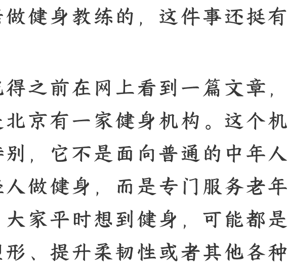
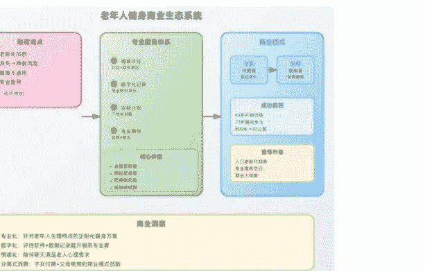

# 老年人健身市场的专业服务与商业机会探讨

**250911 刘润**
整理：公众号懒人搜索，**懒人专属群**独享
懒人微信：lazyhelper

我现在在南京，早上在南京的家里，邀请了一位创业者过来。他是来给我母亲做健身教练的，这件事还挺有意思。

我记得之前在网上看到一篇文章，讲的是北京有一家健身机构。这个机构很特别，它不是面向普通的中年人或年轻人做健身，而是专门服务老年人。大家平时想到健身，可能都是为了塑形、提升柔韧性或者其他各种原因。但随着社会老龄化加剧，老年人的健身市场正在逐渐成为一个全新的领域。

虽然老年人可能没有太强的消费欲望，但他们对身体健康，尤其是腿部肌肉的锻炼，有着非常刚需的需求。因为老年人最大的挑战就是摔倒。随着年龄增长，每年肌肉都会流失一定比例，肌肉流失到一定程度后，走路就会变得越来越不稳，出现“老态龙钟”的状态。一旦摔倒，往往会带来很大的问题，很多老人的意外都是因为摔倒引发的。所以，这里面就出现了很大的机会。老年人越来越多了。这机构不是面向普通的中年人或年轻人做健身，而是针对老年人的实际情况做了很多定制化的设计。最后，他会根据评估结果，给老人安排专门的健身计划。我觉得很有意思，就问他打算怎么做。他说，最重要的是解决实际问题，比如能不能让老人以后走路更轻松，蹲下后能不能自己顺利站起来。如果腿部肌肉足够强，能不能避免摔倒，或者即使摔倒了，也能更好地自己爬起来。如果和小孩子一起骑自行车，能否灵活地闪避等。这些都不是大问题。他提到，过去有一位 63 岁的客户，和他一起锻炼了十年，现在 73 岁，居然跑了一个半马，甚至是一个全马。我觉得太厉害了，因为我妈妈正好也是 73 岁。他说，你妈妈和我年龄最大的客户一样，那位客户已经跑了一个全马。刚开始训练时，那位客户走 800 米都会气喘吁吁，但最后竟然跑完了全程。对于老人来说，很多人没有意识到肌肉锻炼的重要性。我觉得这太有意思了，就让他好好教。他说，和老人相处不仅仅是记录训练，还要陪他们聊天，因为老人最怕孤独。有人陪他们聊天，这件事也很有意思。他特别喜欢和老人聊天，比如聊三年自然灾害、老三届等历史话题。他觉得和老人聊天特别有趣，因为老人对历史特别了解。

你看，每个领域都有一些专业的做法，有专门的人士可以做得很好。但老人通常不愿意花钱，所以这个生意的核心付费者其实是儿女。

子女需要某种形式来表达对父母的爱心和孝心。他们无法天天陪在父母身边，但这种方式能让他们表达自己的孝敬。在这个模型中，孩子是付费者，父母是使用者，即一个客户，一个用户。这加上一个正在崛起的、越来越大的市场，确实有可能成为一片蓝海。

这就是我们一直在说的大间隙。商业世界不断迁徙，从一个需求到另一个需求，从一个产品到另一个产品，从一群客户到另一群客户。

最后，安利小懒的付费群：

### 懒人专属群（介绍）

🗓️ 懒人专属群持续更新中，已持续运营 6 年，整理超 3000 份各类精选付费文章 &
年费社群干货，全部开放下载。

本资料为付费群内部分享，仅供真实有需要的朋友查阅 🫡
懒人专属群更新记录：https://lazy2025.top/blog/record2
懒人专属群更新记录（需梯子，备用）: https://lazybook.fun/blog/record2