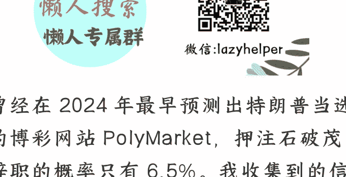
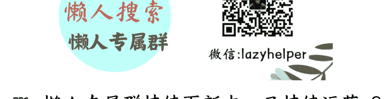

# 日本首相石破茂诡异辞职，背后是激烈的博弈？

2024-09-11 文/卢克文工作室嘉宾 低调老弟
整理：公众号懒人搜索，
懒人专属群独享
懒人微信：lazyhelper

曾经在 2024 年最早预测出特朗普当选的博彩网站 PolyMarket，押注石破茂辞职的概率只有 6.5%。我收集到的信息，也压倒性地显示石破茂能打赢这场保卫战。

具体来说，这场保卫战是根据日本自民党党章第六条，经半数以上自民党籍国会议员（195 名众议院 +100 名参议院）和 47 个都道府县支部申请，可以中途选举总裁。

简单来说，就是造反派需要凑 172 票。

石破茂辞职前，造反派已经凑够了 161 票，坚决保卫他的不到 60 票。保持观望的剩下那四成，显然不会连 11 票都不跑。大势已去的石破茂，赶在 9 月 8 日这个表决日的前一天，以避免造成自民党分裂为由，宣布辞职，算是维持住了体面。

## 「一、石破茂的金钟罩」

从 7 月 20 日输掉参议院选举，到 9 月 7 日宣布辞去自民党总裁，石破茂奋力挣扎了 49 天。

先说外交：

关于日美贸易谈判，因为有欧盟和韩国这两个参照物，从自民党造反派到在野党，再到日本经济团体联合会，基本上是以正面评价为主。换句话说，如果没有这项功劳傍身，石破茂根本就挣扎不了这 49 天。

特朗普在关键时刻给石破茂送来了两个大礼包。第一个是在石破茂输掉参议院选举之后公布了日美关税协议初稿，帮石破茂稳住阵脚。第二个是在自民党表决日前夕，把美国对日本汽车的进口关税从 27.5%降到 15%，而且向前追溯至 8 月 7 日生效。很明显，石破茂不是特朗普政府搞下台的。

中国方面，从驳斥日本阻挠各国参加抗战阅兵，到公开要求日本不得布置提丰陆基中程导弹系统。从石破茂向靖国神厕上贡，到放弃战后 80 周年讲话。在我们气愤之余，也可以看到这 49 天里，造反派也没法给石破茂扣上“媚中”的罪名。

再看其他方面，这 49 天里访问日本的外国首脑有：韩国总统、印度总理、新加坡国务资政、联合国秘书长、欧盟理事会主席、欧盟委员会主席、厄瓜多尔总统、巴拿马总统、亚美尼亚总理、摩尔多瓦总理以及 34 个非洲国家首脑。

综上，石破茂既谈不上得罪美国，也没被扣上“媚中”的罪名，还有韩国、印度、新加坡等 44 个首脑给他站台。尤其值得注意的是，日美贸易谈判尚未最终完成，所以也谈不上卸磨杀驴。中日关系虽然一般，可也没扩大影响到外贸。

再说内政：

在自民党各派联合撰写的，关于参议院败选的分析报告里，并没有把石破茂列为主要责任人。

关于 9 月 8 日要不要中途选举总裁的表决，总裁选举管理委员会把造反门槛抬到了最高——造反派需要提交书面报告，并且签字盖章送到自民党总部。

从 8 月下旬开始，日本各大媒体做的民意调查，无一例外地显示多数民众不希望石破茂辞职。

好消息一个接一个，眼看着石破茂一天天防高血厚，如同练了金钟罩。那么怎么他就在表决日前一天，轰然倒下了呢？

## 「二、石破茂的单门」

能决定石破茂去留的 342 票，可以分成四类：

- 1.以自民党最高顾问麻生太郎为首的造反派。
- 2.以自民党副总裁菅义伟为首的建制派。
- 3.以前首相岸田文雄为首，名义上解散，实际上还在地下运转的宏池会。
- 4.散兵游勇。

由于造反派和建制派都不过半，石破茂的命运取决于岸田文雄的宏池会与散兵游勇这两类观望派。

对于散兵游勇而言，要不要造石破茂的反，关键是看跟着石破茂能不能保住自己的选区和议席。石破茂带领自民党一共打了三场选举战——众议院选举、东京都议会选举、参议院选举，三战皆负。

虽然在三场败仗之后，石破茂奇迹般地逆袭成了人气王，可石破茂的人气不见得能够转化成自民党的选票，这是怎么回事儿呢？

按说自民党在参众两院都成了少数，在野党早该提起不信任案，可这偏偏没有发生。

因为左翼的立宪民主党和日本共产党，眼看着极右翼现在风头太盛，觉得还不如保住石破茂，给他们挡风。据调查，在参议院选举之后的民意调查里，立宪民主党支持者里对石破茂的好评率提高了三成。

这样的人气王，更多的是对石破茂个人有利，对于散兵游勇们拉票的意义，并不大。

对于岸田文雄来说，他的最低目标，是站在会赢的那一头继续当幕后大佬，最高目标是把宏池会变成自民党的第三代霸权派阀。

从最低目标来看，今年岸田无论是站造反派还是建制派，差不多都能赢。

但是要实现最高目标——“大宏池会”构想，他就不能跟麻生太郎撕破脸。如果石破茂能拿下散兵游勇们，岸田文雄顺势而为，那倒也罢了。但是现在石破茂在散兵里不占优势，如果岸田继续硬挺石破茂，那就把麻生太郎得罪到家了。

宏池会原本是自民党三大派阀之一，算上岸田出过五任首相 (另外两个是以田中角荣为代表的平成研究会和以安倍晋三为代表的清和政策研究会)。但是却从来都没能像另外两大派阀一样建立二三十年的霸权。最关键的原因，在于宏池会发生过两次分裂。

第一次分裂，是河野洋平负气出走自立门户，后来交棒给了麻生太郎。由于麻生太郎既不培养自己的儿子，也不培养河野洋平的儿子，更不培养其他才俊，宏池会的这一分支现在处于后继无人的状态。

第二次分裂的结果，已经被岸田文雄的导师摆平，并把宏池会交棒给了岸田文雄。

但是岸田文雄的导师是 2007 年阻止麻生上位的总军师，2024 年，麻生以支持岸田连任为诱惑，都没能让岸田文雄和导师做切割。宏池会三分归一的构想就这么一直搁置，只待耄耋之年的麻生太郎去世。

现在，趁着石破茂可上可下的当口，出卖石破茂，就成了岸田和麻生勾兑的好机会。

而在菅义伟、岸田文雄、麻生太郎三巨头的格局下，岸田和麻生的勾兑，对下一任自民党总裁的人选，将产生极为重要的影响。

## 「三、石破茂的继任者」

这一次自民党总裁选举的热门人选，有那么几个：

第一个，高市早苗。

不仅支持石破茂的人肯定不会投她，岸田文雄的人马大概率也要反对。于公，宏池会的二当家林芳正要参选。于私，岸田文雄去年明确指示，不要投给高市早苗。

今年就算让高市上位了，人家很可能也不会领情。

从麻生太郎的角度来看，只要能把石破茂拉下马就行，剩下的人都差不多，不见得非得支持高市早苗。自民党的盟友公明党明确表态，如果高市早苗成为自民党总裁，两党联盟就要散伙儿。

从中国的视角来看，高市早苗这样的极右翼最好是永远别上位（她前不久还见了台湾外事部门负责人）。但如果她早晚要上的话，可能早点挤破这个脓包比较好。

趁着现在自民党在国会弱势，特朗普拉拢日本的力度比民主党小，韩国的李在明总统也是明摆着给石破茂站台。韩国媒体公开喊话担心高市早苗。

反过来看，如果其他人上位，让高市继续站着说话不腰疼地积攒实力，还不如趁现在让她消耗掉算了。

第二个，小泉进次郎。

身体大不如前、时日无多的菅义伟，需要小泉进次郎上位，才能延续自己的权力。

对于岸田来说，小泉这样的世家子弟不利于控制。对于麻生而言，也不希望这个菅义伟的弟子上位。对于小泉进次郎个人而言，这一次捞个干事长或者内阁要职，也比 44 岁就去当首相要稳妥。

从中国的视角看，小泉延续石破茂温和路线的可能性，较大。

第三个，林芳正。

菅义伟和麻生太郎都能接受林方正。
可一旦他上位，会动摇岸田文雄地下宏池会会长的地位。而且此人出任过“日中友好议员联盟会长”，一方面会遭到右翼排挤，另一方面又难免会刻意和中国保持距离。

第四个，小林鹰之。

这个人和三巨头倒是没多少牵扯，但是是他的背景更复杂。

论派系，他出身于二阶派。

但是中国人民的老朋友二阶俊博老爷子，这几年混的一般，他本人隐退，亲儿子两次落选国会议员。所以，老爷子恐怕管不了这位小林鹰之了。

小林鹰之的背后，还有两位大佬，分别是挑明了亲美反华的原干事长甘利明，以及中国人民的老朋友、前首相福田康夫的儿子，福田达夫。

就个人言行来看，小林鹰之妥妥的右翼、亲台派。

第五个，茂木敏充。

三巨头里的岸田文雄和麻生太郎，跟他的关系都不错。

岸田文雄当了三年总裁，倚重他做了三年干事长。这次麻生太郎率众造反时，茂木敏充又是急先锋。

自民党内四大要职，他干过三个（干事长、政调会长、选举对策委员长）。内阁四大要职，他干过两个（经济产业大臣、外务大臣）。论履历之完整，这次的几个候选人，无人能出其右。

论派系，他是田中角荣这一脉的嫡传掌门。实际上他是安倍生前的心腹重臣。修改自民党党章，把总裁任期从两届六年改成三届九年的具体执行人，就是他。

特朗普第一任期时的美日贸易谈判，他是日方谈判代表。不过他的这份功劳通常都被记在了安倍头上，这也是此人支持率一直不高的原因。

这回，接过第二次日美贸易谈判的重任，可能会给他提供最好的舞台。

咱们这边的舆论没觉得他亲中，但日本右翼莫名其妙地给他扣“媚中”帽子，理由是他任外务大臣时，面对中国外长访日时的强硬言论，没有怼回去………

茂木敏充最大的短板，就是人气低迷，不合作作为自民党的选举招牌。

正常情况下，他当上总裁的可能性很渺茫。但是现在日本礼崩乐坏，连石破茂都能干一年总裁，茂木敏充怎么能心里不痒？

自从石破茂宣布辞职，头一个报名参选的，就是他。

依据自民党党章，中途选举的总裁只能延续上一位总裁剩下的任期。而在石破茂留下的两年任期里，只要首相不提前解散众议院，就没有国政选举。等于把茂木敏充最大的短板给盖住了。

综上，人气高呼声高的两位——高市早苗和小泉进次郎，在三巨头那里反倒不占优势。排名靠后的三位有希望借着三巨头的勾兑，越过两大热门上位。

## 「总结」

在国际上左右逢源，只差临门一脚就能逆风翻盘的石破茂，终于还是倒下了。

他的倒下再一次证明，日本虽是个主权不完整的国家，但人事问题主要取决于内斗。

考虑到石破茂本就是因为自民党内斗，才意外当选，他这 49 天的挣扎，最后在内斗面前显得徒劳，也很冤。值得他欣慰的是，当 10 月 4 日自民党新一届总裁选出来时，石破茂的任期天数可以排在日本 65 位首相中的第 45 位，力压第 46 位的死对头——麻生太郎。

现在很多资料，都在根据去年自民党总裁候选人的票数，和今年的民调来预测今年的形势，但他们可能忽视了菅义伟、岸田文雄、麻生太郎三巨头的合纵连横发生了变化，以及岸田麻生复杂的勾兑情况。

从朴素的情感来说，岸田文雄这种两面三刀的作风，是十足的小人行径。

但从中日关系史和自民党党史来看，自民党有霸权派阀在时的中日关系，明显好过自民党一盘散沙、礼崩乐坏的时代。以中国今时今日的实力而言，我们已经不必在意日本首相具体是哪个人，毕竟日本首相的平均任期只有 1.3 年。

但日本政坛的趋势，是走向中心化还？还是碎片化？这个问题还是值得我们关注的。

对于我们而言，豺狼虎豹已经无所谓，但一群苍蝇嗡嗡嗡，就着实让人心烦了。

最后，安利小懒的付费群：
懒人专属群（介绍）

📒懒人专属群持续更新中，已持续运营 6 年，整理超 3000 份各类精选付费文章 & 年费社群干货，全部开放下载。

本资料为付费群内部分享，仅供真实有需要的朋友查阅 👀
懒人专属群更新记录：[https://lazy2025.top/blog/record2](https://lazy2025.top/blog/record2)
懒人专属群更新记录（需梯子，备用）：[https://lazybook.fun/blog/record2](https://lazybook.fun/blog/record2)