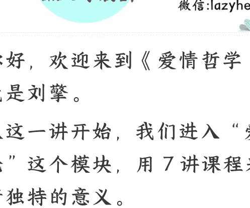
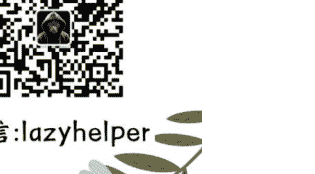

250911

整理：公众号懒人搜索，**懒人**专属群独享

懒人微信：lazyhelper

你好，欢迎来到《爱情哲学30讲》，我是刘擎。

从这一讲开始，我们进入“爱情价值论”这个模块，用7讲课程来探讨爱情独特的意义。

现在有多少人还会相信爱情的价值？当下流行文化中对爱情价值的怀疑和否定颇为盛行，但其中有许多观点的论据是片面和错误的。作为价值论模块开篇的这一讲，我们先针对一些流行的说法展开哲学性的辨析与反思，目的并不是要鼓励你积极投身于爱情，而是帮助你获得更为清醒的认知。

## 怀疑论的两种类型

渴望爱情的人，总会对爱情有所期待，而怀疑爱情的人，大概会认为那些期待总会落空。无论你的倾向是渴望、怀疑还是犹豫不决，首先要明白：我们究竟对爱情有什么期待？

想象一下，我们在街头做一个随机采访，询问想要谈恋爱的人，对爱情的期待是什么？答案可能会五花八门。
有人会说，期待爱情带来性亲密的愉悦；也有人说，期待找到更优秀的生活伴侣，能让我实现社会阶层的跃迁；还有人说，“期望爱情让我精神富足”；另外还有人说，期望找到一位“灵魂伴侣”，有深入密切的精神和情感的交流；最后，还有人说，在爱情中最期待的是“亲密的陪伴”，能“感受温暖，获得安慰，有归属感”。

这些价值听上去都很重要，但怀疑论者可以提出很多质疑。常见的质疑可以归纳为两种类型，一种是可替代论，一种是不可行论。

先来看看“可替代论”。

这种质疑认为，上面说到的这些期待，不需要爱情也能实现。比如，说爱情让人幸福，好像爱情是一个“幸福派送机”，开动这个机器，就会把幸福送给你。其实哪有这么容易，你得到的都是具体的幸福感。但这么一说，世界上有好多活动都能带来幸福，打游戏，或者睡个好觉，都是如此。

说到更具体的价值，“可替代论”也可以逐一反驳。

比如，性快乐完全不需要爱情，在一夜情、性交易活动，以及某些所谓的“情景关系”（situationship）中，也可以获得性满足，何必劳烦爱情呢？

所谓“情景关系”是说，比友情更亲密，但双方又不承认是爱情的一种关系，不承诺，不点破，只享受当下，一切看情况再说。这种关系，未必有性亲密，但是可以有。

而要实现“阶层跃迁”，需要不是爱情，而是婚姻。而阶层跃迁靠努力学习和工作来争取，似乎更正当，也甚少风险。

至于丰富的精神生活，旅行、社交、阅读、艺术和知识等活动，也是非常不错且可行的方式。

再说灵魂伴侣和亲密陪伴，其实也不是爱情特有的价值。我们在其他关系中，比如在和父母家人、亲朋好友的关系中，特别是和好闺蜜、好哥们儿这样的至亲好友的交往中，甚至在与宠物的互动中，都可以实现亲密陪伴，何必非爱情不可呢？

这种可替代论，并没有否定爱情的价值，只是不相信爱情有什么无可取代的独特价值。这种质疑在逻辑上并不能反对你选择爱情，而只能主张采取随缘的态度，既不刻意追求，也不排斥，就像在不同的水果之间做选择，反正都能汲取维生素，选哪样都行。

再来看另一种怀疑论，就是针对爱情的现实可行性提出的质疑。

意思是说，爱情虽然有许多人们期待的价值，但想要实现这些价值目标，风险太高、困难太多，代价太大，可行性太低了，所以期待往往会落空。

“低可行性”的观点，击中了许多人的痛点，在当下格外流行。每当说起“爱情很美好”，后面必定会跟一个“但是”，而且是一个长长的“但是清单”：相遇太难，激情太短，期待太高，失望太深，付出太大，回报太小，沟通太累，忍让太苦，承诺太虚，背叛太伤，诱惑太多，信任太难，前景太玄，分手太痛，梦想太美，现实太冷……我还可以一直说下去。

现实中的爱情又苦又难，两个字加在一起就是“苦难”，许多人对此都深有感触。难怪总有人在评论和弹幕中，将影视剧里那些甜美感人的爱情片段称作“科幻片”。

在逻辑上说，“可替代性”和“低可行性”这两种质疑，是彼此独立的观点，并不必然相关。但只有两者结合起来，才对渴望爱情构成强有力的打击。

我们会听到一些特别有力量的质疑：认真工作搞钱不香吗？交朋友兄弟、闺蜜不爽吗？养猫养狗不好吗？AI 虚拟伴侣不暖吗？一个人爱自己不甜吗？

看看，人生在世有这么多快乐的选项，谁还需要爱情？谈恋爱又苦又难又麻烦，就算有甜蜜，也只是昙花一现的短暂幻觉，最后不是一拍两散就是貌合神离，身心的疲惫和伤痛，还是要靠自己疗愈……这些“劝退”的言说，结合了两种质疑的理由，既怀疑爱情价值的独特性，又怀疑其现实可行性，听起来就格外铿锵有力。

### 对低可行性的回应

面对怀疑论的挑战，我们如何来回应呢？在后续的六讲，我们将会详细分析讨论可替代论有什么谬误和局限，论证爱情确实具有不可替代的独特价值。现在，我们主要针对“低可行性”提出一些批评性的反思。

在我看来，追求美好爱情是否可行，是因人而异的，同时依赖于人的能力和偶然的运气。运气我们很难把握，但爱的能力是可以塑造的。弗洛姆在其名著《爱的艺术》中格外注重爱的能力，并强调这种能力需要学习和培养。发展爱的能力也需要提高对爱的认知，这也正是我们课程的目标之一。

现在，我们对可行性问题的回应，着眼于一个要点，就是追求任何有重要价值的目标都不容易。

说一个目标实现的可行性高低，是要比较而言的。怀疑论者提到其他的替代选项，预设了它们都比追求爱情都更为可行。这些判断是非常片面的。如果我用同样武断片面的方式，那其他替代性选项的可行性都可以被质疑。

比如，搞钱很香吗？投资理财血本无归，冒险创业很可能破产，老老实实工作也只能是成为“社畜”，卷不动也躺不平。

说家人才是最后的依靠，但“原生家庭”造成的悲剧少吗？

还有，好闺蜜的情谊又怎么样呢？没听说过“塑料姐妹花”吗？有的闺蜜一面告诉你不要相信男人，不久后，就给你发出了婚礼请柬。

同样，结拜兄弟一起创业，事业未成却反目成仇的也有不少吧？

一个人自己爱自己香吗？你怎么知道呢？有些人在朋友圈频频晒出独自旅行的诗意照片，还是因为内心很孤独吧？

都说爱情太短暂，但长短也各有不同吧。谁都无法保证爱情永远不变，但短暂就意味着失败吗？如果这样说，养宠物也够失败的，狗和猫的寿命最高不过十几年，都会遇到伤心告别的一刻。人的寿命也各有长短，英年早逝的生命令人唏嘘，但谁会在悼词中说，早知如此，还不如让他别来到人世呢？人类文明与 138 亿年的宇宙历史相比也不过瞬间，而且最终也会消失，但就此能说人类文明失败了吗？

我用上面这些武断片面的说法，试图表明，对追求爱情可行性的质疑本身，是可以被质疑的。说爱情可行性低，虽然诉诸许多人的亲身经历，具有鲜活的吸引力，但存在论证逻辑的谬误。

找一个恋爱失败然后创业成功的励志故事并不难，但同样，也可以找到创业失败后恋爱成功的例子。因此，用一种选择的失败案例，去对比另一种选择的理想状态，根本不能论证什么。如果没有社会学实证研究的依据，我们很难说哪些选择更具有可行性。其实，人类任何有价值的目标，往往都需要付诸努力去追求，都难免会经历挑战、挫折和痛苦，也都存在失败的风险。无论是亲密关系还是其他有价值的事业和关系，都是如此。那么，爱情是否更具风险、所以可行性更低呢？

坦白地说，其实我们并不知道，可能更高，也可能更低。

现代社会的爱情，越来越多地取决于个人的自由意愿，这是文化变迁的结果。这种代际变化使得现代人的爱情关系比传统社会面临更少的外部的约束，也因此提高了风险感。如今，爱情的成败几乎完全取决于双方个体之间的意愿，只要两情相悦，实现爱情的可行性很高。然而，任何一方一旦改变了意愿，也很容易破裂，因此长久维持爱情的可行性就很低。

也就是说，爱情既容易又困难，美好的两人世界只需要“你和我”情投意合就实现了，但困难在于，只要一个人变了心，两人世界的整个局面就灰暗了。

相比之下，努力工作通常更容易获得晋升和加薪的机会，追求事业的成就似乎具有更高的自主性和掌控权。然而，我们往往忽视了，工作成就对外部的结构性依赖，受到整个社会的多种因素约束，以及隐性的规训和压制。从这个角度来说，爱情比工作的风险更为集中，但我们很难判断，总体风险的相对高低。

## 结语

好了，今天我们对“低可行性”的怀疑论，作出了反思和回应。接下来，我们将展开阐述爱情在价值意义上的不可替代性，尤其是爱情所具有的那种超越了物质的可计算的价值。

爱情在今天是一种反潮流的生命实践，正像哲学家巴迪欧所说：“如今，人们普遍相信每个人都只追求自己的利益。而爱情则是这种信条的一个反例。”

正因为现在，我们有越来越多的生活领域已经被物质利益所主导，被工具理性所支配，而爱情是个人生活世界中最后一块抵御工具理性殖民的领域，这恰恰也是爱情的一个重要价值。

### 思考题

最后，留一道思考题：

有人说，爱的最高境界是无条件的爱，其实父母对子女的爱才是真正无条件的爱，所以亲子之爱比爱情更可贵。但也有人说是，父母之爱是血缘关系“给定的”，这其实是有条件的，而爱情是自由“选择的”。你怎么看呢？到底哪一种爱更难得呢？欢迎在评论区写下你的观点。

好了，下一讲，我们将开始分析爱情带给人的特殊价值。

我是刘擎，我们下节课再见。

最后，安利小懒的付费群：

懒人专属群（[介绍](lazyhelper)）

**📚️**懒人专属群持续更新中，已持续运营6年，整理超3000份各类精选付费文章&年费社群干货，全部开放下载。

本资料为付费群内部分享，仅供真实有需要的朋友查阅🙈

懒人专属群更新记录：

https://lazy2025.top/blog/record2

懒人专属群更新记录(需梯子，备用):

https://lazybook.fun/blog/record2