# 从零开始 B 站好物深海圈，只发了两个视频，开始日入 1000，3 天速通深海圈，预计 10 天破万收益，我做对了什么？
**公众号懒人搜索，[懒人专属群独享](https://mp.weixin.qq.com/s/cvL81sQ4GdY6qV7aMk3W0w)**

**懒人微信**：lazyhelper

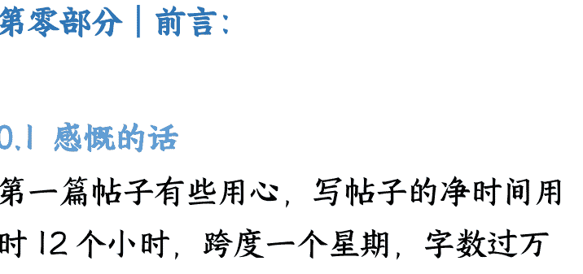

## 第零部分 | 前言：

### 0.1 感慨的话

第一篇帖子有些用心，写帖子的净时间用时 12 个小时，跨度一个星期，字数过万了，阅读用时大概需要 20 分钟，感谢阅读。

感谢生财，感谢亦仁老大，感谢家蒙老师和助教老师们，感谢深海圈里无私分享的大佬和各位共同跑项目互相打气的圈友们。

B 站好物真的是红利，想拿到正反馈太快了，第一个视频就出单，第二个视频就如标题所说~

一天一千多块钱利润，3 天赚回票价，才知道从零开始，也可以有这么高上限。

### 0.2 生态位说明

B 站好物的生态圈非常丰富，我选择的是，跟着深海圈，走的是生态位置较为优势的生态位置（看上去很难！其实是纸老虎！在家蒙老师的带领下，一戳就破，无痛速通~），所以这篇帖子的内容并没有太多关于好价视频和 AI 矩阵的路子哦，只有第四部分 AI 提效的部分，提到过一点。

做的路子可以参考百万榜的下面这位，后面讲的大部分内容也是围绕着这种视频该怎么优化，下面这位大佬也是我的对标对象之一~

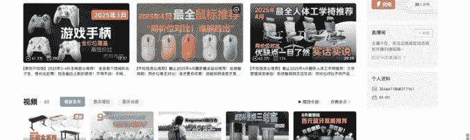

### 0.3 文章结构说明

本篇帖分为 4 个部分，因为我写的细，把有些决策的思考过程也写出来了，文章有点长，注意力这种资源很宝贵，看左侧目录也可以直达，希望能够帮助到你。

一是收益分享，这个部分是为了给大家提升信心的，我会展示收益的数据
二是做对了什么，讲解质变的道与术
三是深海圈的价值
四是提效方法

## 五是一些感悟杂谈（附带时间记录表与对挫折的理解）

## 第一部分｜收益数据

信息和执行之间，缺了太多东西，动力就是其中最重要的事情之一，写这个部分就是给大家加油的。

人对于未知总是有恐惧的，那么我先把数据给你，至于心中的那杆秤要怎么衡量，取决于你。

只要你选对了方向，坚持做正确的事，只要不下牌桌，总会赢的。

成功才是成功之母，只要你能赢第一次，就会有下一次，就会有无数次。

### 1.1 小晒收益

晒收益前我先补充一件事，我有主业，同时还是非全研究生，工作日干活，周末上课，上课的老师很牛逼，我无法控制我去不听课，有的时候从早上 8:30 上课，21 点 45 才下课。

我想说的是，我每天只有两小时是可以纯粹的去做这份项目，既然我这个条件都可以，那你也一定可以！

每年抛去日常工作和必要的休息娱乐通勤，能用的时间大约是 1425 个小时，再除去研究生的学习和“刻意休息”的时间，只有 600 个小时的资源可以用来聚焦做一件事，去在这一件事上积累小时数，从而去引发质变。

**我一年基本上只做一件事**，去年是考在职研究生（537 个小时成功上岸，时间见下表），今年就是从互联网搞到钱的能力。

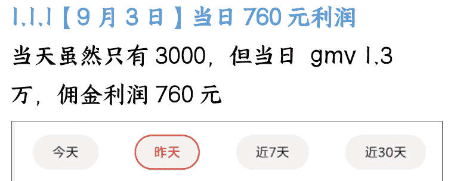

#### **1.1.1【9 月 3 日】当日 760 元利润**

当天虽然只有 3000，但当日 GMV1.3 万，佣金利润 760 元

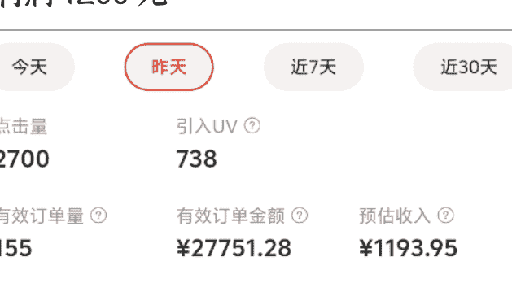

#### **1.1.2【9 月 4 日】当日 1200 元利润**

播放量爬到了 7000，当日 GMV2.7 万，佣金利润 1200 元


**1.1.3【9 月 5 日】当日 1380 元利润，深海圈，票价回本**

播放量到了 1.2 万，当日 GMV2.8 万，佣金利润 1380 元

| 昨天 | |
| --- | --- |
| 点击量 | 引入 UV |
| 3100 | 899 |
| 有效订单量 | 有效订单金额 | 预估收入 |
| 148 | ¥28000.65 | ¥1380.6 |

我视频挂了 15 个链接，一半链接都卖空了


3 天时间，深海圈，票价回本，但收益，还在持续。

| 今天 | 昨天 | 近 7 天 | 近 30 天 | 自定义 |
| --- | --- | --- | --- | --- |
| 2025-09-03 — 2025-09-05 | | | | |
| 点击量 | 7172 | | | |
| 引入 UV | 2005 | | | |
| 有效订单量 | 365 | | | |
| 有效订单金额 | ¥64498.54 | | | |
| 预估收入 | ¥3020.16 | | | |

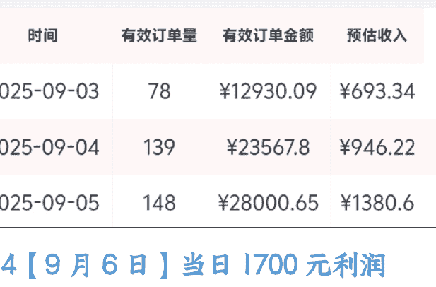

时间 | 有效订单量 | 有效订单金额 | 预估收入 |
| --- | --- | --- | --- |
| 2025-09-03 | 78 | ¥12930.09 | ¥693.34 |
| 2025-09-04 | 139 | ¥23567.8 | ¥946.22 |
| 2025-09-05 | 148 | ¥28000.65 | ¥1380.6 |

#### **1.1.4【9 月 6 日】当日 1700 元利润**

播放量到了 2 万，当日 GMV3.2 万，佣金利润 1700 元左右

效果数据 更多 >

点击量 | 4623
引入 UV | 1216
有效订单量 | 169
有效订单金额 | ¥32606.93
预估收入 | ¥1692.3

好了，鸡血打住，咱们回归现实，多苦多累还得继续干，看看总结部分~

### 1.2 我投入了什么？

从 8 月 24 日开始看家蒙老师直播的录播课到今天，共计投入了 50 个小时数

我有时间记录的习惯，会把每天有价值的净时间，以 10 分钟为最小单位进行记录，这个习惯坚持了 2 年，正是因为这个习惯，大伙才能看到比较清晰的过程数据，以便参考。

我建议大大家也尝试培养一下这个习惯；

如果有一个一般等价物来衡量能衡量人的价值的话，那么这个一般等价物一定是时间；

价值的单位可以是“元/小时”，我自己的目前价格大概是 50 元/小时（兴许未来能升值）；

年轻真好，人生还有大把的时间；

后面我会顺带分享一下我自创的、迭代了无数个版本的自用时间记录表。

做事里程碑如下：

#### **1.2.1【8 月 14 日】生财宣布要上 B 站好物深海圈**

我看了之后很心动，但我看什么都会很心动，但这个在直觉上感觉就对口，但越是看起来心动，就要越谨慎的分析他的风险，我认知的底层逻辑时刻提醒我做成事

情要聚焦，all in 是一门艺术，要不要做一件事，我先做了初步的可行性分析。

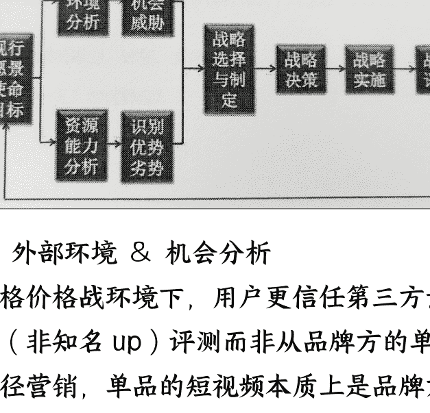

**01 外部环境 & 机会分析**

价格价格战环境下，用户更信任第三方素人（非知名 up）评测而非从品牌方的单一口径营销，单品的短视频本质上是品牌方的单一口径营销的延续，而长视频才是更能承载测评的载体。

目前 B 站处于红利期，B 站开了电商跳转口，还鼓励你成交。评论区挂蓝链、视频悬浮按钮直跳淘宝京东，这意味着：平台允许你把流量带走，只要你能卖出货。

B 站好物生态环境的多元化，有高门槛的，也有低门槛的，在策略实施，评估后，可调整的选择多种多样，即使在尝试高门槛的战地发现打不下来，也能退守一步到基础的战地，保留一份根基。

**02 外部环境 & 威胁分析**

对产品返利的比例依赖度高，易被选品牵着走，难做到差异化竞争（后来实践的时候发现威胁不大）。

赛道拥挤，同质化严重（后来实践的时候发现威胁不大）。

政策/平台规则突变（外链、佣金、带货权限）可能让既定转化模式失效。（暂时还有担忧，等跑到明年之后开始准备后手）。

03 关于我的自身的资源（尤其是时间资源）分析，和优势劣势总结放在这里有点自恋，不放了。

#### 04 结论

最后我认同了 B 站好物是至少能做 3-5 年的项目，是一个可以从 0 开始学习，并且能够打造属于自己的护城河，外部的竞争者想要进来会有较高的门槛的项目。

同时，前面做失败的几个项目，让我学习到了各种能力，有了基础，再结合我自己的优势才干，我有信心能够做好的项目。

3000 块钱的门票，也许半年之后，能做到月入 3-5000，一个月就能回本。（实际结果：第 1 个月，做到了 1 天 1 千块钱，3 天就回本了）。

#### **1.2.2【8 月 20 日】买了点付费，为了开通好物悬赏功能。**

#### **1.2.3【8 月 24 日】开始看家蒙老师直播的录播课**

看完课立刻开始做，选定了第一个题材：充电宝。

为什么选定的第一个题材是充电宝呢？

关于充电宝的新版规则，自 2025 年 8 月 15 日起实施，这个选题天然有流量。

#### ### 1.2.4【8 月 31 日】账号做出来第一个视频

当时非常不自信，一发视频就买了必火投流，300 块钱，出单了！但靠必火只出了 3 单，佣金总利润也只有 40 块钱，现实把我干的头破血流。

| **点击量** |
| --- |
| **127** |

| **引入 UV ☺** |
| --- |
| **53** |

| **有效订单量 ☺** |
| --- |
| **6** |

| **有效订单金额 ☺** |
| --- |
| **¥707.55** |

| **预估收入 ☺** |
| --- |
| **¥40.65** |

#### ### 1.2.5【9 月 03 日】做出来了第二个视频

痛定思痛，仔细分析，仔细对标，然后做出来了第二个视频，不敢投流了（到现在也没投流）。

早上 7 点发出来了，上午看了完整的阅兵，当核导方阵出列，主持人说到射程可覆盖全球的时候，真的很难控制泪腺，正义必胜！和平必胜！人民必胜！

然后结束后看了一下视频只有 80 播放，两眼一黑并且笑笑整理下心态，准备快速去战下一个视频，但下午再打开视频，发现有爬升的趋势，之后就火了（也不算火，算小火），然后有了本篇文章。

视频的提升一口气做下来是非常难的，城墙很高，容易被吓跑。

这里就是我三大做事基本原理的第二个起了作用——工程分解 + 聚焦。

我做事或者思考的维度，他的最小内核就是三点

一是量的积累：什么叫水到渠成，在正确的方向上积累小时数，量的积累终究会引发质变
二是做任何事都要工程分解 + 聚焦
三是生命在于记录，时间是一种战略资源，要去管理

**工程分解：**再难的问题只要把他分解再分解，直到分解成你可以轻易上手去做的程度，然后依次那么一做，就会完成，火箭就是这么一点一点造出来的。

**聚焦：**不管万里长城有多长，其实都是一块块的砖，无论何时你要面对的都不是一座长城，而是眼前的这块砖！

觉得难啊，拆开！拆到你觉得轻易可以上手的大小！聚焦做好这件“小”事！

拆！

**见色起意，始于颜值：**

标题、封面、置顶评论、视频数据（外露的）、视频章节、字幕，背景音乐音量，无噪音，语速
陷于才华：
视频节奏，剪辑手法
忠于内在：
内容（核心）、评论区运营（核心）、人物信任感

具体该怎么做呢，大道至简，就是每一个点都找到对标的视频，去 copy + 迭代！

### 2.1 见色起意，始于颜值

这部分并不是告诉你要做的多么美，我真正想说的是，你至少要做到及格线！
B 站观众的容忍度非常高，但这并不意味着你可以每次都不及格。

众爱上你的机会，即使可能不完美，但也一定要到及格线。

因为观众的时间很宝贵，注意力是一种稀缺的资源。

研究这个道法的基础学科，我认为是认知心理学，认知心理学是对自我和世界的感觉、记忆、理解、思考的全过程进行研究的一门学问。

里面有个概念叫选择性注意

人体的信息存储器每秒钟大概向我们大脑传递 1100 万比特的信息。最终我们能够处理的信息有多少？

答案是我们只能处理 16 到 50 比特的信息，也不到 1/200000。

这个就像在一个漆黑的夜里面，大地虽然很广阔，但是我们只有一个很小的探照灯，只能照到很小的部分。所以我们大脑每时每刻都在有意无意地控制探照灯，去照到不同的地方。

当你的封面的整体上的感觉对了，观众才会把探照灯看放到你封面和视频的文字上，才会开始第一次阅读文字，才会第一次用脑子处理信息。

接着，认知心理学上有一个著名的鸡尾酒会现象，在聚会上，有可能你正在跟别人聊到天呢，但突然间发现 3 米开外有一个人说了你的名字，然后在那里哈哈大笑。

这个时候你的耳朵一下子就竖起来了，会不自觉的去听他们到底在说你什么，反对你眼前这个人说的东西一下子全部都听不见了。这就是你的意识控制你的感觉系统刻意去把聚焦点放在你关心的事物上的最好的体现。

什么样的文字能够，更容易的，让观众点进来呢？答案是与客户有关！

道理是这个道理，但术法万千，大家平时看 B 站视频的时候可以注意一下，为什么你会想去点开别人的视频，多去积累，多去运用。

我下面写的内容主要是新人在对标过程中要注意的几个点，有自媒体经验的同学可以直接略过，这部分并不是关键，真正的核心在于内容和评论区。

这 part 也不是要求你把外在做得多么精美，而是想强调：至少要做到及格线！

因为做到及格线，观众才更容易把探照灯看放到你封面和视频的文字上，进而再把探照灯放在你的视频内容上，这些小细节处理好，观众才更愿意更多的投入注意力，开始理性的思考你视频的内容。

#### 2.1.1 封面

B 站平台的封面要做两个，一个 16:9，一个 4:3。

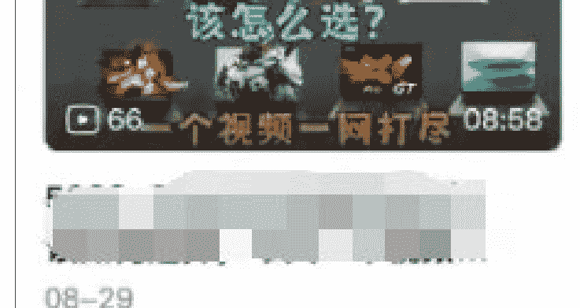

9 月 4 号家蒙老师在直播点评账号的时候，我看到有些圈友的封面比例不对，大概是只做了一个，导致有些文字没有显露出来，观众看了感觉不对，信任感就丢失了。

明明一个很小的动作就能解决问题的，你只需调整一下尺寸，再排排版就行了。

可能新手不知道怎么上传两个封面，我演示一下

**01 先正常上传第一个封面，4:3 的**

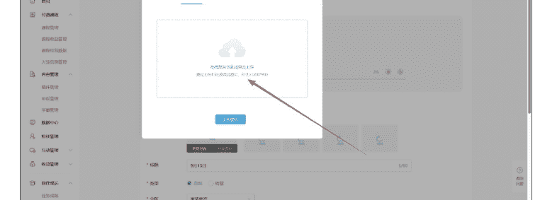

**02 点击多比例封面设置即可（很多圈友没有看到这个）**

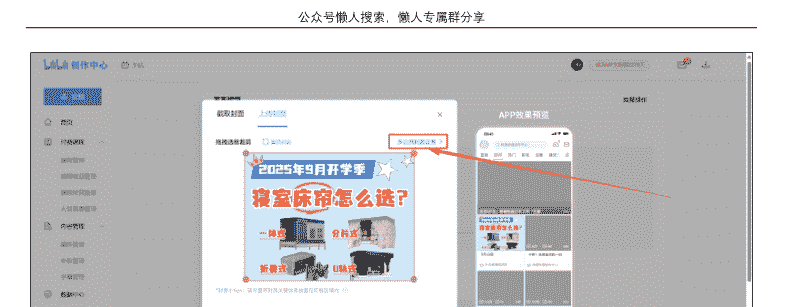

**03 在这里换成 16:9 的**

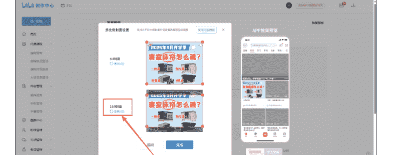

**04 封面比例不同，也可以按照不同比例的特点去做嘛。**

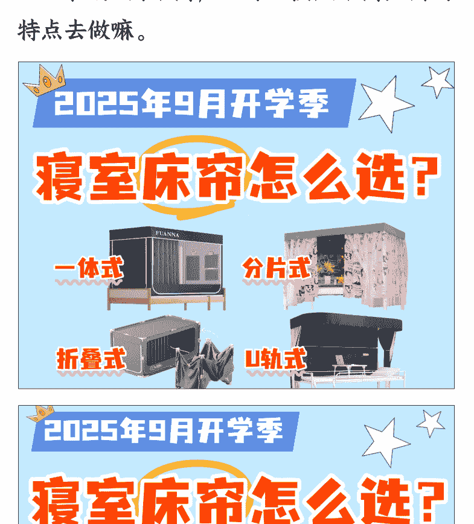
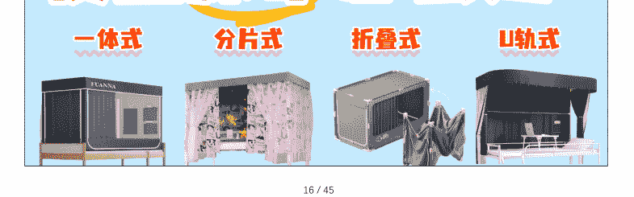

#### 2.1.2 置顶评论（蓝链）

下面是我觉得牛逼的，去学，做到 50%就行啦，前期还是要快速迭代作品。

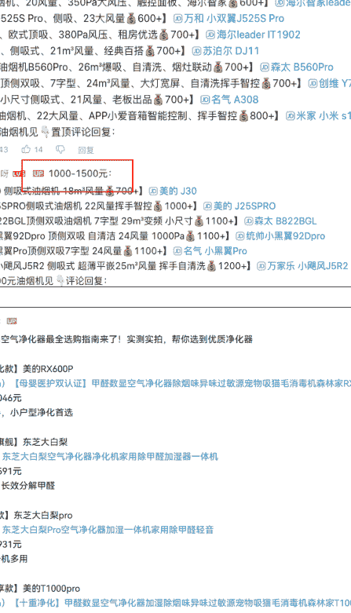
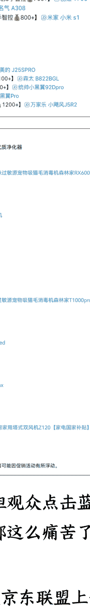

编辑蓝链的确是很累，但观众点击蓝链才会给你钱，前面做视频都这么痛苦了，不差苦这一个小时

（我从上传视频发布 + 从京东联盟上开始搞蓝链的整个过程，基本上都要一个小时）。

#### 2.1.3 视频数据（外露的）

播放量和弹幕数量，做带货视频，5000 以上就属于好看的数据，不用太多。

先自然流 3 天，看看数据有没有过 1000，如果只有几百那种，可以稍微运作一下。

运作一下仅为了主页好看，运作之后，流量也不会继续推流的，没有任何收益，达到及格线即可。

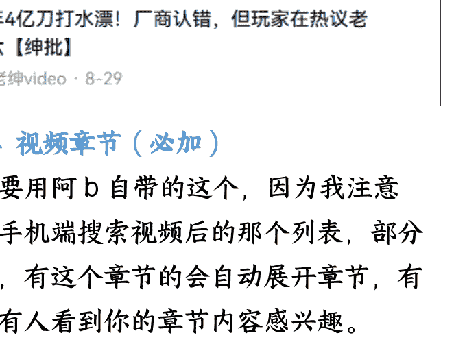

#### 2.1.4 视频章节（必加）

一定要用阿 b 自带的这个，因为我注意到，手机端搜索视频后的那个列表，部分视频，有这个章节的会自动展开章节，有可能有人看到你的章节内容感兴趣。

公众号懒人搜索，懒人专属群分享

Q 充电宝
搜索
综合
番剧
直播
用户
影视
图文
全部
推荐 2025
测评
20000 毫安
评测
【充电宝】充电宝推荐 2025 保姆级充电 宝选…
充电宝推荐_
一键空降·章节 (6)
开头
性价比款
便携款
高功率
【新国标充电宝推荐】2025 年 9 月开学季新国…
2025 年 9 月开学季 新国标全方位充电宝推荐 附带新国标要点解析! 一支视频充电宝选购要点通过 13:35
扑克君通透测评
6354 8 月 30 日
upup 我经常出差，手机一天得充两次电，想买个充电宝能撑 3 天，20000mAh 够吗？还是得更大容量？
多设备充电，只需要一个 它，一站解决
诗篇里的落花
17 万 6 月 6 日
推荐：赶紧查看 前往京东 |ANKER[国家 3C 认证]安克智显 140W 充电器氮化镓屏显 type-c 多口 pd 快充 100…

我一开始是自己拿剪映做的，后面就改成阿 b 自带的了。

添加方法如下:

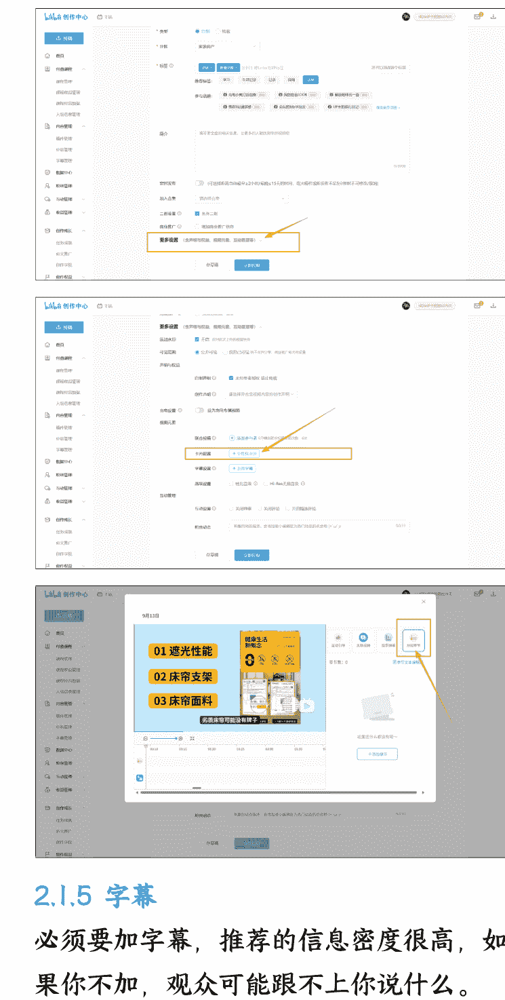

#### 2.1.5 字幕

必须要加字幕，推荐的信息密度很高，如果你不加，观众可能跟不上你说什么。
我感觉好看的字幕（清晰可见即可）要加底色，和文字颜色对比出来，或者不加底色，加描边也行。


#### 2.1.6 背景音乐

没什么好说的，注意一般调低 15-25 分贝。

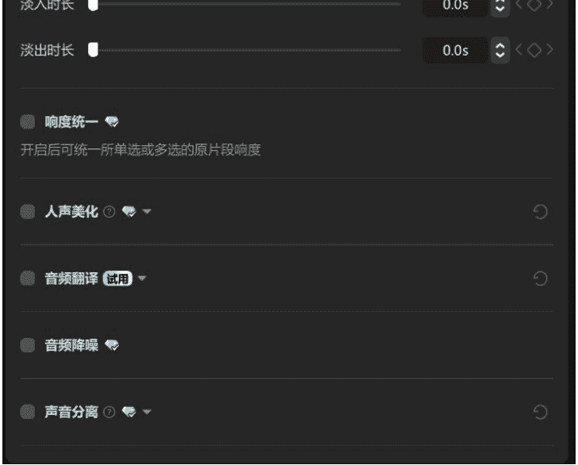

#### 无噪音

观众集中注意力开始看你的视频已经很辛苦了，你还要视频里埋大音爆给观众提升听力难度吗。

#### 语速

大多数人偏慢，我也是，我调了 1.1 倍速

### 2.2 陷于才华

做完了第一步，你的视频达到及格线了，观众就能无痛的看了，大多数观众的第一次感性判断完成。

那么第二部，观众会根据这部分内容，给你定义档位。

如果你的节奏很舒服，观众的留存率就会高些，会多幅度的看你的内容。

如果你的剪辑画面很舒服，观众可能会觉得你很权威（其实并不是很重要）。

但这部分并不是最关键，真正的核心在于内容、评论区和信任感。

#### 2.2.1 视频节奏

这是内容创作型视频节奏思路，仅供参考。

| 阶段 | 核心目标 | 动作要点 (可改写) |
| --- | --- | --- |
| ①开场设计 | 吸引注意<br>点题 | 通过精修剪辑、固定片头或直接进入主题，迅速呼应封面标题与看点；明确视频主题，激发好奇与期待。 |
| ②观众刺激 & 人设 | 15~30s (中视频)<br>萌 5s (短视频) | 以口述表达与表现力展示个人特质（如：可爱、搞笑、专业），输出能引发共鸣的信息；短视频需在前 5 秒完成基本设定与人设露出。 |
| ③故事阐述与递进 | 层层推进<br>剪辑节奏 | 进入主体内容后保持信息密度与节奏；结合个性化表达（高超手法、氛围 BGM、镜头切换）以维持兴趣，避免信息过少或拖沓造成流失。 |
| ④情绪高潮设置 | 共鸣<br>互动 | 在中后段设置“成果揭晓/成功瞬间”等高潮点，赋予内容意义，促发评论、点赞等互动。 |
| ⑤结尾回归与升华 | 回归主题<br>观点升华 | 收束到主题与选题，通过观点表达引导关注与期待；短视频可把内容推至高潮后落点，增强对后续视频的兴趣。 |

而对于我们这种带货的，要点就是不能一直讲干的，要有节奏，一直讲干的，观众感觉像上课，就累了，大脑是很不喜欢消耗能量的。

可以一会干货，一会调侃，一会参数，一会故事。

#### 2.2.2 剪辑手法/质量

对于这部分，我们一直都是知道是可以怎么做的，只不过我们的大脑很害怕，他不让你们去做，甚至欺骗你，限制你不让去往这方面想。

邪修就是找一个对标视频，去花个 2/30 个小时，去对比复刻一个，谁不是这么走过来的，我刚开始剪辑的时候 | 分钟的视频要剪 | 个小时（剪辑这部分我是总结了一点提效经验放到后面提效篇来说）。

这里上好的对标对象，我推荐的是这个。

边看边做，哪里卡住了，就去搜教程。

复刻完一个视频之后，再看见其他视频就知道他是怎么做出来的了。

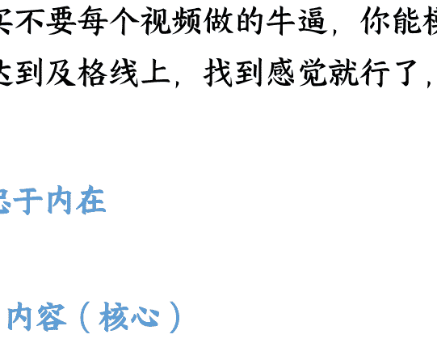

但其实不要每个视频做得那么牛逼，你能模仿50%达到及格线上，找到感觉就行了。

## 2.3 忠于内在

### 2.3.1 内容（核心）

内容这里分为两部分：铺垫部分+产品介绍部分

为什么这种账号不到100的播放量也能酷酷出单，而有可能我做的第一个13分钟的长视频的出单量还没有他的呢？我做完第一个视频之后，进行了深度思考。

生态位置里的好物视频，他这个月百万GMV上榜，例如下面猛猛出单。

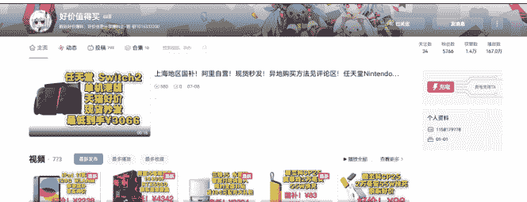

我想到，既然能获得收益必然是你给对方提供了价值（当然也脱离不了B站目前是红利期大环境的根本因素），那么B站好物给观众提供了什么价值呢？那么这种账号给观众提供了什么价值呢？

家蒙老师在第一节直播课上说：

其实不是我们有多厉害，也不是我们的视频做的有多漂亮，更不是我们解决了用户多大的一个问题。

说的露骨一点，就算没有我们，用户的问题大概率自己也会解决掉。

我们只是出现在这个位置上，他消费的时候经过了我们一手，这就产生了中间服务费。

我这时想到，如果我是新人，在没有粉丝和作品基数的时候，我要扮演的难道应该是一个牛逼的网络推销员？给没有需求的人推销各种使用场景吗？

不，一是作为新手我不知道怎么成为一个牛逼的网络推销员，也许我根本就不需要去推销，我只需要扮演好一个便签纸的作用，提醒观众购买他们本来就打算去买的东西就足够了。

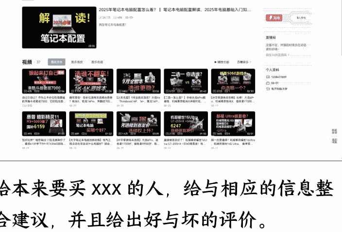

## 那么怎样才能成为一张合格的便签纸呢？

我看了一下9月在榜百万带货博主，发现了这位是我的理想对标对象。

建议大家也看看他的视频，说不定也会有所悟呢。


给本来要买XXX的人，给予相应的信息整合建议，并且给出好坏的评价。

那么内容该怎么写呢？换位思考大家都知道的四个字——“我是怎么想的”。

## 解题步骤如下：

### (1) 下面是铺垫部分的要点

#### 【铺垫内容要点01】

假如我刷牙感觉累，有点想买电动牙刷，但又觉得普通牙刷也能用。

我日常刷着B站，可能看到一个电动牙刷推荐的标题，就点进去看了。

那么这时候我想听什么内容呢？

- 有没有必要换电动牙刷
- 市场上有哪些电动牙刷品类，什么是好的品牌？
- 不同价位差出来的钱，区别是什么

带货视频，你前面的铺垫内容知道写啥了吧。当你写的东西恰好是观众想要的，那他的脑区就会被激活，就会把探照灯聚焦在你身上。

#### 【铺垫内容要点02】

> Tips：很多UP主一上来会说最近我XXX（一个场景），用了它真的爽。他可能是一个很好的推销员，但我觉得，一个便签纸在开始部分讨论使用场景并不是那么重要。

我觉得这部分内容非常好，但位置放错了，应该放在产品介绍的时候再说。

而在视频开头，重要的是把关于想买XXX的观众想知道的一切，以观众能听懂的语言传达给他，让他判断视频的价值。

超过3秒的“看不见”，观众就会往右滑一段距离，连续滑3次，试想你会怎么做？

可能就会去视频相似推荐里，找个能“看见”的视频看啊。

那么当你带货电动牙刷时，下面直接给观众看这种信息你敢吗？

| 核心维度 | 关键考量点         | 低端入门级 (100-200元)          | 中端实用级 (200-500元)            | 高端旗舰级 (500元+)             |
|:---|:-------------------|:-------------------------------|:-------------------------------|:------------------------------|
| 1. 清洁性能 (核心基础) | 清洁方式           | 多为基础的正弦震动或扫振一体，技术较为初级         | 主流为高频扫振一体，部分为优质声波（飞利浦）或入门旋转（欧乐B） | 顶级的声波震动，最先进的AI智能扫动或功能强大的微震旋转（欧乐B IQ） |
| | 扫刷幅             | 普遍不足，可能低于40°，导致牙龈清洁效果有限       | 达到黄金标准（40°-60°），能有效模拟巴氏刷牙法     | 不仅达到黄金标准，还能通过AI智能识别齿面自动调整最佳扫刷幅度       |
| | 震动频率           | 20,000-30,000次/分钟，动力输出可能不稳定          | 稳定在30,000-40,000次/分钟，提供充足清洁活力      | 可达40,000甚至60,000次/分钟以上，精准稳定控制                 |
| 2. 舒适与安全 (用户感知) | 握感设计/打牙感     | 基本缺失，刷头材质偏硬，震感明显                 | 引入软胶或硅胶刷头，舒适度大幅提升              | 极致的微震技术与刷头设计，无感震动追求极致舒适                    |
| | 噪音与震感         | 噪音较大，机身震感强烈，体验粗糙                | 噪音和手部震感有明显改善，控制在可接受范围       | 极致静音，采用顶级电机和降噪技术，运行平稳，手感细腻                 |
| | 压力感应           | 基本没有，用户需因用力过猛而伤牙龈             | 部分配备，压力过大会提醒                     | 搭载多重传感器，高精度压力感应，实时反馈力度并通过APP分析            |
| 3. 智能交互 (科学依据) | 基础智能           | 多数仅有简单开关键或基础2分钟计时               | 标配2分钟计时和30秒换区提醒                    | 具备更智能的计时和分区模式，可根据个性化方案调整                   |
| | APP与屏幕         | 无智能交互，无法连接APP，无屏幕              | 部分产品支持APP互联（记录数据）或机身自带显示屏     | 功能完善的APP，提供高清彩屏，实时显示刷牙轨迹、评分等               |
| | AI与个性化        | 无                                                | 部分产品提供模式自定义                       | 搭载AI智能芯片硬件传感器，识别口腔区域生成个性化护理方案             |
| 4. 便利性与附加价值 (长期价值) | 续航与充电         | 续航较短（15-30天），传统磁吸式或普通USB充电     | 续航显著提升（30-180天），主流为Type-C或磁吸式       | 提供超长续航（90天以上），配备精致充电底座和旅行盒                 |
| | 消毒功能          | 无                                                | 部分型号配备紫外线消毒仓                    | 通常配备高效紫外线消毒系统，设计精巧                              |
| | 做工、材质与配件   | 机身多为普通塑料，配件稀少，刷头选择少         | 做工用料提升，手感好，刷头选择更丰富            | 采用顶级材质（如金属、亲肤树脂），配件豪华齐全                     |
| | 刷头耗材成本      | 价格低廉，品质和耐用性一般                    | 价格适中，提供多种功能性刷头可选               | 价格虽贵，但集多种专利技术于一身，性能和寿命更佳                   |

高深的词汇可以说以展示权威性，但高深的长句没必要写。如果一定要写，不要把钩子埋在里面，因为这整句话观众大概率是“听不到”的。

我作为观众只会想听最能懂、能打动我的2-3个点：

- 关于相比普通牙刷能否更省力就能清理干净
- 打牙感（是否难受）
- 续航能力

我这里会选扫振幅和打牙感，因为观众一开始看这个视频大概率能听懂的是这两点。你说工艺，观众只会隐约有个感受，具体内容听不到。至于后面那些参数要在产品介绍的时候埋钩子，一个产品挑一个牛逼的指标。

### (2) 下面到产品介绍要点的部分啦

#### 【产品介绍要点01】

产品介绍时一定要介绍出这个产品：事实+评价。

**事实**：扫振幅达到黄金标准(40°-60°)，能有效模拟巴氏刷牙法，深入清洁牙缝。

**评价**：那么这个幅度就已经能够满足那些不用花太多心思就能刷得全面的人了。

事实是用来权威的，评价是为了让观众听得懂。加不加一句评价的效果也许是这样的：

观众听完文案后记住的信息大概是：

光有事实：扫振幅+？→遗忘  
事实+评价：扫振幅+好/坏，回忆时想起“我加钱买这款是因为它扫振幅好，值得”。

你光阐述参数可不行，还得说这个参数怎么了。一共就两种结果——好与坏，要点出来。

#### **【产品介绍要点02】**

价格差一定要说出来。

（如果方便的话）要说。有的产品一眼能明白，比如充电宝功率和容量俩参数就不需要讲。但两个相同价位参数差不多的品类，你一定要做推荐区分，否则等于都不推荐。哪怕你说这个颜色适合学生比较酷，另一个适合出勤也不尴尬。

我的第一个视频：

- 第一个产品100元把参数白话一遍，特点说了一下
- 第二个产品200元把参数白话一遍，特点说了一下

我的第二个视频：

- 第一个产品100元把参数白话一遍，特点说了一下
- 第二个产品200元把参数白话一遍，特点说了一下。相比100元价位品类，这个加了XX功能，能够XXX。

#### **【产品介绍要点03】**

使用场景要点出来：

第一个产品100元把参数白话一遍，而这个参数让你能在XX时做到XX，很贴心的设计，满足基本需求。

你不说出来那跟观众有什么关系呢？与“我”有关的事情才能激发注意力。

就好比视频中间随便来一句人名——假设叫李华。假如真有叫李华的人看到这里，他直接炸毛，耳朵竖起来，甚至打弹幕“怎么突然叫我”。

## 2.3.2 评论区运营（核心）

评论区分数权重很高。给大家一个数据：如果你一天能在评论区谈成100单的话（回复他并推荐链接），大概率今天GMV破万，佣金利润过千。

有的人可能会想，谁这么闲挨个回复还要回答问题，回答时还要推荐产品加客观分析主观评价——就是我在做啊。视频脚本写4000字，评论区回复2-3万字。我知道一个人看了视频大概率记不住什么都，你回复他直接有关再讲视频精华（增加信任度），再推荐商品，结果会怎样呢？

看看我的回复。假如你收到这样的回复会不会蓝链下单？哪怕是知道能让他挣钱你都会开心，因为他给你解决问题了，也算帮到他了。

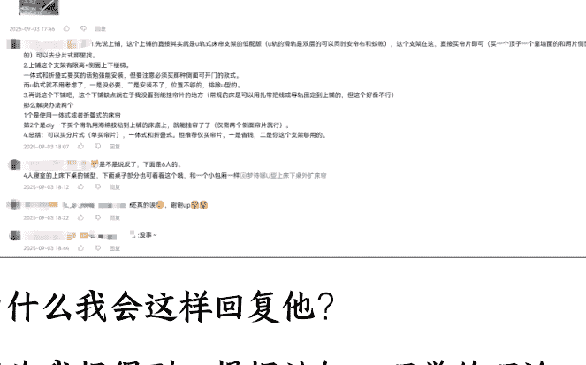

为什么我这样回复他？因为我想得到根据认知心理学的理论，他能够给你发图片要消耗脑力，大脑非常不喜欢耗能，本可以划走这是相当可贵的一次试探，值得同等或者更多回报。

并且如果有人看到这条评论，发现有人得到正反馈会怎么想？更容易做出询问决策，收获确定性意味着安全感，安全感意味着信任感。做对了剩下的交给复利与马太效应，量变引发质变。

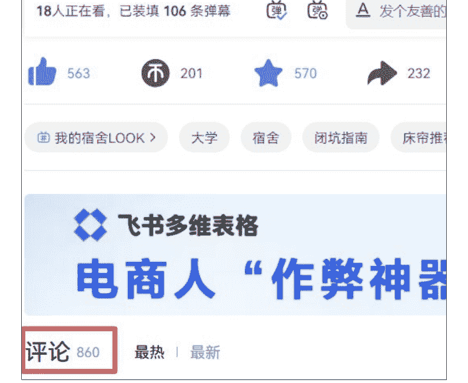

具体评论不太方便展示，800多评论氛围就起来了，你应该能想象到那个场景——茫茫人海多么壮观。

## 2.3.3 信任感

这个我不是很权威，有的人表达真诚招人喜欢，我看了许多圈友作品真的很B站真的很好。下面是经某位圈友授权允许举例的。

家蒙老师直播点评时说道很多商家很喜欢他愿意给单，我也很喜欢这位老哥。

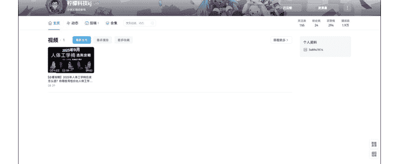

据家蒙老师经验，找那些非常精美的博主做的视频开单效率比粗糙博主差多了，精美很多时候不如粗糙。根本原因是观众看视频做得太完美了，可能觉得你是广，这么有钱才做得这么精美，你不真实。这个度需要自行把握。

可惜我做不到视频表现上让人有信任感，但可以在评论区里弥补。

## 第三部分｜深海圈的价值

### 3.1 建立全局认知，选对“生态位置”，直接避坑提速

带你看清B站好物的完整生态和内容形态，知道都在哪，有恃无恐。

有完整而可落地的方法论。（纸老虎！那种视频实际上手，有方法论的话一戳就破，无痛速通~）

### 3.2 资源与机会：高佣与商单

圈内整合高佣链接资源，有些是定向专属高佣链接直接给到我们使用。我第二个视频带货单价200，佣金仅3-5%，8%高佣意味着净利润翻一倍啊——伟大无需多言。

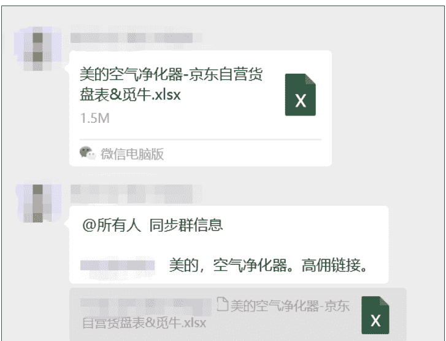

商单资源：刚起步就有大牌子商单能接。

### 3.2 大佬圈友们的无私奉献，互相打气，涌现“复利效应”

#### 大佬无私分享

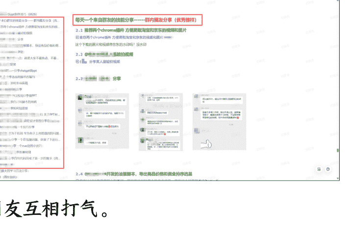

#### 圈友互相打气

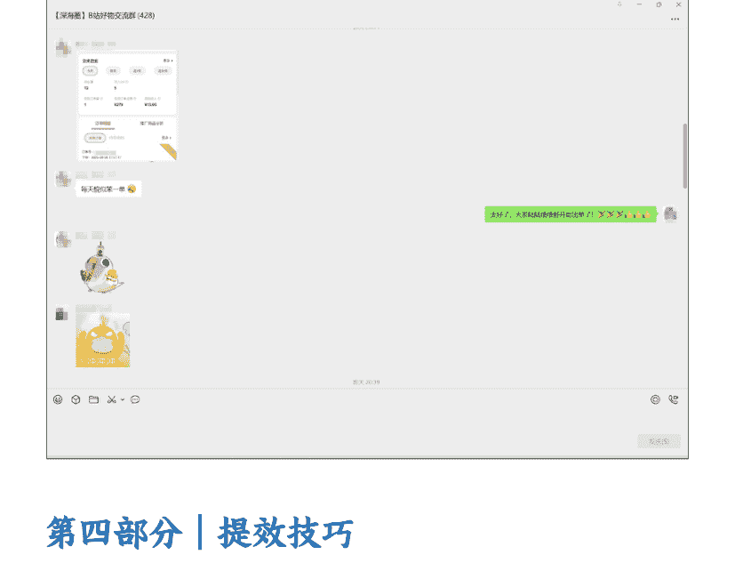

### 第四部分｜提效技巧

#### 4.1 AI提效

我个人懂一点AI编程，懂Coze工作流，会AI视频，主业重度依赖AI。但项目用到AI技能不多：刚跑通没时间做动作；另外全年无休，目前周一到周五上班，周末非全日制研究生上课有时从8:30上到21:45真没时间。

##### (1) 影刀+Python把别人视频下的蓝链转成自己的链

- 3599元：西门子497升无界十字四开门  
- 4239元：海尔505L十字四开门  
- 4299元：三星AI神冰箱5系对开门  
- 4079元：容声517升法式多门  
- 4499元：海尔460L法式多门  
- 4712元：松下Xtra蔓越莓2.0十字四开门  
- 6774元：东芝429L小白桃日式五门（法式多门）  
- 6299元：三星AI神8系501L十字四开门  
- 6719元：美的M60机皇550零嵌法式双开四门  
- 8999元：卡萨帝原石550升法式多门  
- 9990元：松下大海豹PLUS法式多门  

---京东会场红包记得领【国补】京东家电家居国补会场

希望大伙买得比我便宜！over

##### (2) Python把别人视频每5秒截图，删除重复的让GPT按规定格式提取信息

##### (3) 可画什么的固定模板，填写Excel自动套用信息

##### (4) 文案转写规定每个产品字数持续保持一致，Coze工作流直接生成视频

#### 4.1.2 目前AI还能帮做图表

把一段文字信息给完GPT后加一句口令就是下面效果！

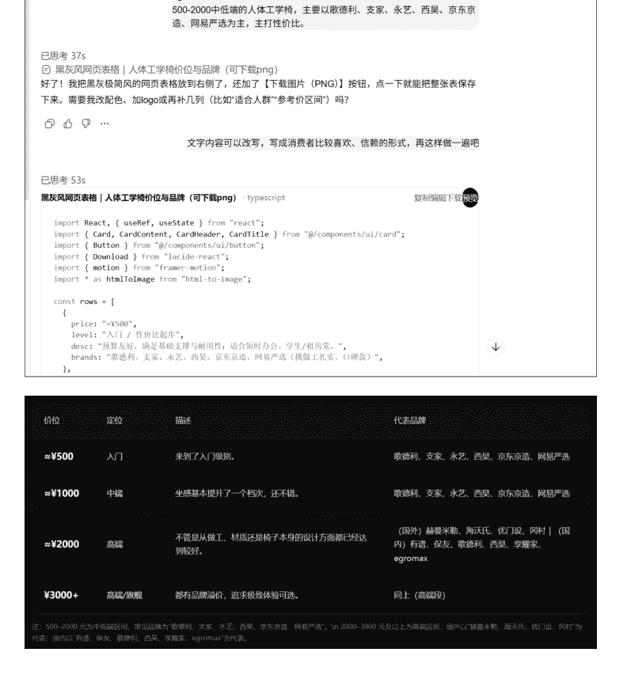

#### 4.1.3 待验证AI应用想法

截取别人视频实拍图片或者店家商品实拍图，用AI图生视频不加动作只加运镜来补充素材，没拍摄设备也能做酷酷的商品展示升格。

#### 4.1.4 Minimax声音克隆

（不推荐长期做这行的人使用，真人说话更有信任感）

##### 4.2 剪辑提效

###### 4.2.1 我的创作SOP，一个视频约12小时

### 制作方面  
邓昊佳 | 8月28日修改

标准作业流程：做一个视频约需10小时+2小时宽放时间

- 选品类——30分钟  
  - (1) 数码/群内信息/围绕周期选5个品类——10分钟  
  - (2) 看京东联盟佣金价格，对5个品类优先级排序——10分钟  
  - (3) 看B站竞争程度选择品——10分钟
- 选品——30分钟左右  
  - (1) 划分价格档位每个档选N个品——10分钟  
  - (2) 每个档位第一轮选N+2个品，每档10分钟  
- 脚本与PPT创作——4.5小时  
  - (1) 写铺垫稿——1小时（知乎好物找文章、同行文案、AI、商品详情页）  
  - (2) 确定核心参数——5分钟  
  - (3) 做PPT模板——25分钟  
  - (4) 写单品稿+做PPT，每个商品10分钟共约3小时
- 拍视频——1小时
- 剪辑——2小时
- 做封面——30分钟
- 发布+挂链接——1小时

###### 4.2.2 剪辑顺序（重要！）

**剪辑经验**：先定文本，录音后定音轨，音轨定好才铺画面。音轨是结构骨架。一次一口气搞定一个部分这样快。

#### 4.2.3 快速剪辑方法就是用稿定设计做视频素材

**剪辑一开始基本要用4小时**，但用了这个方法现在基本两小时了。
```

## (1) 稿定设计抠图

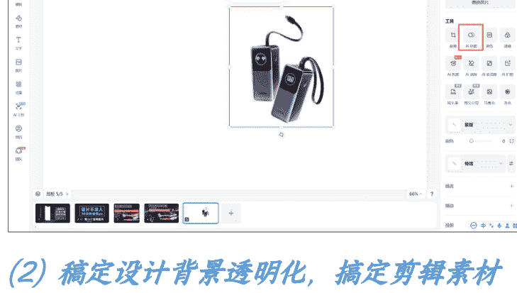

## (2) 稿定设计背景透明化，搞定剪辑素材

这个方法快不快，可能只有剪辑过的人才知道。

## 第五部分｜杂谈（时间记录表与对挫折的理解）

### 5.1 时间记录表

模板放在这里了，从简单到复杂，再由复杂到简单，迭代过无数遍的。

至于做记录这件事情真的这么重要吗，通过记录，不仅在于提效，你的生命的质量、密度会大大提升，更多好处，只可意会，不可言传。

| 日期 | 时间格 | 记录事 |
| --- | --- | --- |
| | 5:30-6:00 | |
| | 6:00-6:30 | |
| | 6:30-7:00 | |
| | 7:00-7:30 | |
| | 7:30-8:00 | |
| | 8:00-8:30 | |
| | 8:30-9:00 | |
| | 9:00-9:30 | |
| | 9:30-10:00 | |
| | 10:00-10:30 | |
| | 10:30-11:00 | |
| | 11:00-11:30 | |
| | 11:30-12:00 | |
| | 12:00-12:30 | |
| | 12:30-13:00 | |
| | 13:00-13:30 | |
| | 13:30-14:00 | |
| | 14:00-14:30 | |
| | 14:30-15:00 | |
| | 15:00-15:30 | |
| | 15:30-16:00 | |
| | 16:00-16:30 | |
| | 16:30-17:00 | |
| | 17:00-17:30 | |

左侧（红框）使用说明：
时间格：左侧每个小格代表 10 分钟。
记录方式：在对应小格中直接输入该时间段做的事情。
合并格：若一件事超过 10 分钟，可合并相邻单元格。
颜色标记：有价值的事情 -> 标蓝色；浪费的事情 -> 标红色；一般的事情 -> 不标色。
激励规则：当你在某个时间段（如 7:08）开始做一件有价值的事，且持续 10 分钟以上，则将 7:00-7:10 这一格标画。这样可以鼓励你迈出第一步——万事开头难，只要度过第一个 10 分钟，后面更容易坚持。如果做完第一个 10 分钟后感觉难以继续，也没关系，可以以后再挑战。

右侧使用说明：
哪个时间计划要做什么就在那一行写要做的事。

**补充说明**：10 分钟只是一个单位啊，真正做事情都是做完之后再填格子的，看看做了几个十分钟。

为什么是十分钟，就是因为感觉不想干先干个 10 分钟，要是干完还难受就先不干了，反正也就干了 10 分钟，但一般情况下会是完事开头难，做完第一个十分钟就进入状态了。

使用样例如下（这是去年考研期间的记录，因为感觉还是得放个使用过的例子，用我现在的吧，隐私还太多，就放去年的了，你要是问我为什么计划和实际做的内容对不上，我只能说人之常情吧哈哈哈，你计划你的，我做我的，计划是为了摸清这一周大概有多少时间资源，大概能做成什么事，有什么效果，人一但清晰自己做事情之后的结果，就会有动力，都是为了心理学上的暗示），去年左边是计划，右边是记录，今年给迭代了，反过来了。

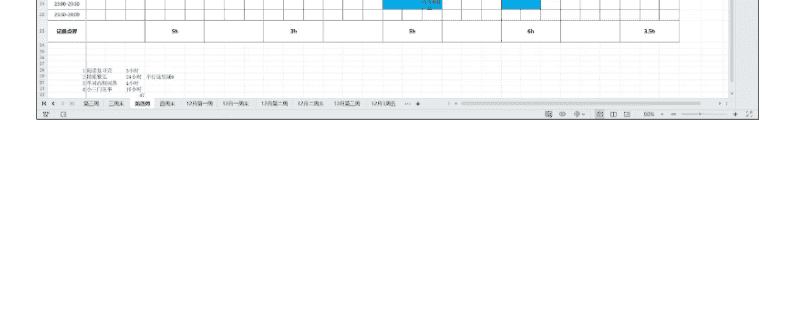

### 5.2 是什么造就我成为一个不太会生气，心理韧性好，能主观控制情绪，做什么事都容易快乐的，核动力乐观小牛马？

分享一个小插曲，9 月 7 日早上走在上课的马路上，我发现我的佣金收益被砍了一半多，截止目前被砍了 3000 多块钱，后台查看，说是流量异常，（已经申诉了，目前还在申诉中）。

当时的我第一步做的事情就是镇静下来，我能感受到肾上腺素的分泌，但首先不要 被情绪劫持，随后我想的事情是这件事对我的影响，先抓主要矛盾，我好像今年的主要目标还不是赚够 XX 数量的钱，而是获得能够从互联网赚钱的能力，那么貌似并不影响我的核心目标，那么这件事可以被定性为有些肉疼的“小事”。

我一年基本上只做一件事，去年是考在职研究生（537 个小时成功上岸，时间见下表），今年就是从互联网搞到钱的能力。

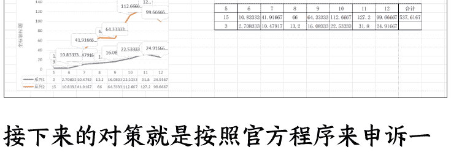

接下来的对策就是按照官方程序来申诉一下就行了，即使失败，损失 3000 来块钱，好像也不影响生活，也不影响我的核心目标，那么这就是一个不太重要的外部环境变动，那么我今天的主要目标还是去认真上课，听课。

做出判断之后，也顿时觉得自己的心性不一样了，要是 3 年前还是大学生的时候的我，可能会情绪崩溃，但现在的我能理性控制。

那么是什么造就了我现在的心理韧性呢？我觉得答案是挫折。

我经历过较大的挫折，但最后我还是走出来了，虽然用的时间相当长，想想时间花的很亏，但也很值。

具体的经历就不说了，如果有圈友也因为爆单而被砍收益的话（我的话 9 月 6 日当天的 1690 块钱给我砍到了 600 元，哈哈哈），要理性的看待这件事，挫折也许算是一种馈赠，人生可以拉长时间线去看。

即使 3000 的佣金申诉不回来，可能 5 年后的我，再看我现在这篇文章，只会觉得这件小插曲，是一件趣事罢了。

天生我才必有用，千金散尽还复来~

最后也祝福一起奋斗，做着不同项目的圈友们：

有很多时刻，你惊心动魄，而世界一无所知；你翻山越岭，而大地寂静无声。

所有难过，难是难，但总会过。

最后，安利小懒的付费群:

懒人专属群（介绍）

懒人专属群持续更新中，已持续运营 6 年，整理超 3000 份各类精选付费文章&年费社群干货，全部开放下载。

本资料为付费群内部分享，仅供真实有需要的朋友查阅

懒人专属群更新记录:

https://lazy2025.top/blog/record2

懒人专属群更新记录（需梯子，备用）:

https://lazybook.fun/blog/record2