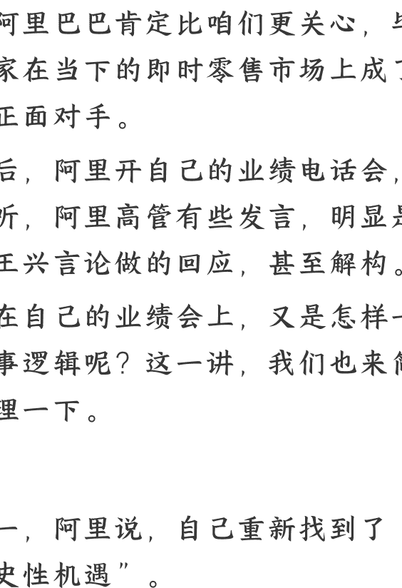

# 外卖三国杀，阿里怎么说

2025.09.12《蔡钰·商业参考 4》

整理：公众号懒人搜索，懒人专属群独享

懒人微信：lazyhelper

美团 8 月 27 日开的二季度业绩电话会，阿里巴巴肯定比咱们更关心，毕竟两家在当下的即时零售市场上成了最大正面对手。

两天后，阿里开自己的业绩电话会，我一听，阿里高管有些发言，明显是针对王兴言论做的回应，甚至解构。阿里在自己的业绩会上，又是怎样一套叙事逻辑呢？这一讲，我们也来简单梳理一下。

## 一

逻辑一，阿里说，自己重新找到了“历史性机遇”。

既是淘天集团董事长与 CEO，又是阿里云董事长与 CEO 的吴泳铭说：“展望未来，阿里巴巴集团有两大历史性机遇。一个是打造以“AI+ 云”为核心的技术平台，一个是创建综合消费平台，我们将大规模投资它们，以把握机遇。这也标志着，阿里在成立 26 年后重回创业状态。”

你看，我们在 100 讲刚说，腾讯借助 AI 重新成为成长型公司（《腾讯：重新成为成长型公司？》）；阿里就也说，自己借助 AI 和大消费，重新创业了。

历史性机遇这个词，整场电话会下来，阿里高管们至少强调了 4 次。你肯定还记得，前几个月，阿里已经分别宣布过，未来三年要在 AI 领域投资 3800 亿元，还要在外卖闪购业务上投资 500 亿元，对应的也就是这两大机遇。

对这两大机遇，阿里高管给出的定调是：

关于 AI，AI 技术对所有行业的改变升级，以及 AI 与云计算的深度结合，是未来 10 年技术领域最大的行业机会。

关于消费，阿里认为，3 年内自家的闪购和即时零售新增成交就能有 1 万亿元。在长期，阿里想打造的全场景消费平台，将对应 30 万亿元的大消费市场。

## 二

逻辑二，为了能接住这两大历史性机遇，阿里二季度做了两轮业务收拢。一次是 6 月份，把饿了么、飞猪并入阿里中国电商集团，方便淘宝打通会员体系，统一流量池。

其二，原来的"1+6+N"简化为“中国商业、国际商业、云智能和其他”四块，菜鸟、大文娱、本地生活部分纳入“其他”。方向很清楚：资源聚焦商业零售与"AI+ 云”两条主线。

另一次是 8 月份，把整个集团的"1+6+N"架构，精简成了 4 大业务板块。

2023 年开始实行的"1+6+N"，是 1 个阿里控股集团、6 个业务集团和 N 个其他独立业务公司。而 2025 年 8 月的调整，进一步缩减成了中国商业、国际商业、云智能和其他。在"1+6+N"时代，菜鸟、文娱和本地生活业务都是跟零售和云智能业务平级的，这次一股脑儿都塞进“其他”里去了。

这个调整，确实是把资源聚焦到了商业零售和 AI 两条主线上了。

## 三

逻辑三，回到一个基本问题：为什么敢这么笃定地对 AI 和大消费下重注呢？

这是因为，阿里已经在这两个领域都有显著进展，尝到了巨大的增量。我们看看财报上的数字证据：

二季度，阿里云智能业务的收入达到了 334 亿元，增速 26%。其中，AI 相关产品的收入更是连续八个季度实现了 3 位数的增长。

电商业务呢？阿里中国商业板块的收入增速达到了 10%，阿里国际团队的收入增速更是有 19%。

国内商业板块 10% 的增速怎么来的？

阿里解释说，一个是对商家们收取的佣金费率，另一个就是靠淘宝闪购，在外卖大战当中引来了大笔流量。

好，到这里，外卖业务这个主角出现了。

## 四

我们进到逻辑四——

阿里自己，怎么看待过去几个月的烧钱大战？

阿里的看法是，烧得值。

阿里中国商业集团的 CEO 蒋凡说，淘宝闪购上线四个月，实现了三个进展：

- 1. 第一个是用户结构的优化。此前四个月，靠补贴拉来了大量新用户，这批新用户变成了老用户，就不再需要持续地拉新投入了。

- 2. 第二个是订单结构的优化。淘宝闪购计划，下个阶段要重点引导用户下高价值订单，来拉高订单利润。我最近就发现了，淘宝闪购给我发 28 块钱的红包，但是要我一单买够 75 块钱才能使用。

- 3. 第三个是履约效率的提升。7、8 月份打价格战的过程中，淘宝闪购订单规模激增四倍，当时为了应对运力短缺，淘宝花了不少钱来找临时运力救急，比如向顺丰同城采购运力。而随着订单的逐渐稳定，这部分临时投入就也能减少。

所以蒋凡说，这三件事一干，淘宝闪购即便保持当前给消费者的优惠投入，每个订单的亏损也可以快速缩减一半。

一半是什么概念？上一讲我们提到，媒体打探的数据是，三季度，美团的竞争对手每单大概要亏 4 到 6 块钱。那么，如果缩减一半，就是变成每单亏 2 到 3 块钱，接近美团的战时水平了。

而在阿里的叙事中，这还不是淘宝闪购运营效率提升的终点。再来看长期。

在长期，也有两笔大成本可以抠出来。

一笔是淘宝闪购的流量稳定之后，订单密度如果显著变大，物流成本就能大幅降低。举个例子，如果现在一个骑手跑一趟，送一单外卖赚 6 块钱，那么未来跑一趟，顺路能送 4 单，平均一单赚 4.5 元，骑手也是愿意的。

另一笔是通过精细化运营线下商户，也能提升订单收益。还举个例子，用阿里平台的数据和 AI，帮商家们选择菜品、管理订单，做个性化的促销，那么商家们的单量和客单价也有望提升。

蒋凡还说： “我认为，规模是决定效率的第一因素，在新的规模跟市场份额下，我们有信心长期在效率方面达到行业领先水平。与此同时，我们不会单独看外卖（即时零售）的盈利情况。考虑到电商的综合收益，我们认为，可以在长期保持价格竞争力的前提下，即时零售对平台整体产生正向经济收益。”

你有没有发现，蒋凡正在基于 AI 领域的 Scaling Law，也就是规模法则，来制定外卖市场的战略？这再次说明，AI 和消费确实被阿里当成了头等大事。

## 六

好，接下来进入到逻辑六。

前面说的是外卖业务的降本增效，那么更宏大的即时零售市场，阿里怎么想的呢？毕竟，王兴在美团电话会上透露的信心之一，就是美团在即时零售战场上，对电商市场份额的逐步侵占。

关于这一点，阿里也有自己的考虑。蒋凡说，阿里把非餐饮品类的即时零售业态分成两部分来看。

第一部分叫近场原生模式，意思就是，这些零售业态天然就是为了本地零售而诞生的。

这部分，阿里过去几个月，在全国布局了 5 万多个闪电仓；另外，阿里的零售超市盒马，也被发展成了淘宝闪购的生鲜品类前置仓。

第二部分叫远近场结合。意思是，原来的线上电商资源，也可以想办法捣腾到线下。

这件事的抓手主要是天猫。

阿里一方面打算让天猫超市也去接即时零售的订单。反正天猫超市本来也有次日达、半日达这类业务，再勒一勒配送速度，就赶上消费者对闪购的期待了。

另一方面，阿里打算劝说已经在天猫平台上开店的消费品牌们，也把线下门店接入淘宝闪购，来实现线上线下一体化经营，就像饭馆的堂食 + 外卖。对于这部分资源，阿里的期待很大，认为未来能有上百万家品牌线下门店加入。

所以，把短期和长期、近场和远场的效率和资源都拉起来之后，阿里认为，三年内，即时零售业务就能给自己带来 1 万亿的新增成交额。要知道，当前外卖主导的整个中国即时零售市场，规模也才 1.5 万亿。

七

逻辑七，美团还拥有到店和团购业务，这是能帮它团结商家资源的。这个竞争角度，阿里怎么破呢？

蒋凡的回答也很简单：到店自提和团购的需求，阿里已经在部分城市做测试了。

## 总结

好，到这里，我们总结一下：

以上三讲，我们跟踪和分析了中国 2025 年外卖大战的战况和玩家战略。
我们可以认为，从 2025 年 9 月开始，这场外卖大战要正式扩大到即时零售大战了。

> 从我们旁观者的角度看，外卖大战也好，即时零售大战也好，美团的战略本质是“团结线下打线上”；而阿里、京东都是靠线上零售生意起家的公司，它们的战略本质是“团结线下给线上导流”。

这种战略差异，确实有可能在各方转入持久战之后，改变主动和被动关系。这也是美团的信心所在。

不过，美团和阿里的现金储备差距，也可能影响战争的走向。我看到有人开玩笑说，阿里只要打价格战的同时做空美团，50 亿就差不多了。这个玩笑话，也说明，这场大战的胜负手，可能还是看各家公司的资金和现金流储备了。

## 最后，安利小懒的付费群

> > 最后，安利下我小懒的付费群，群里有 6 个 AI 学习群，1 个搜索技能群，还有 1 个懒人专属群。
> 欢迎加入：
> 1. 搜索技能群（2 群）
> 2. 懒人专属群（3 群）
> 3. AI 学习群（2 群）

