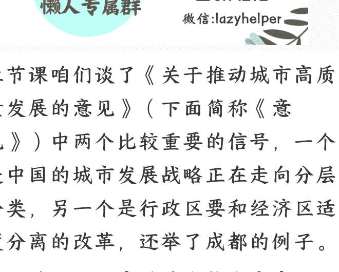

# 这五大新趋势，将影响 9 亿多城镇人口

20250912《政经参考》
整理：公众号懒人搜索，懒人专属群独享
懒人微信：lazyhelper

上节课咱们谈了《关于推动城市高质量发展的意见》（下面简称《意见》）中两个比较重要的信号，一个是中国的城市发展战略正在走向分层分类，另一个是行政区要和经济区适度分离的改革，还举了成都的例子。

今天的课程，我继续和你分享我从文件里读出的另外五个和大家更密切相关的大信号。

## 拆迁暴富不要再想了

首先，第一个信号，拆迁暴富不要再想了。过去十几年，城市扩张更多是“大拆大建”，涌现了不少拆迁户一夜暴富的故事，甚至成为一种社会情绪的象征。

这次《意见》说，要“稳步推进城中村和危旧房改造，支持老旧住房自主更新、原拆原建。持续推动城镇老旧小区改造”。

换句话说，就是从之前的“拆改留”变为“留改拆”。首位重要的是“留”，而不再是“拆”。在我看来，城市发展的主基调已经发生了根本转向，而我的具体判断是：

- 首先，拆迁范围将大幅收缩，能不拆就不拆，优先考虑保留、改造、盘活；
- 其次，拆迁补偿逻辑也在变，从“一次性货币补偿”，更多转向房票安置、原拆原建、共有产权等，政府不再为“造富神话”买单；
- 最后，城市更新将更强调“改善型可持续”，城市更新不再像拆迁一样是一次性的，而是以公共服务提升、产业导入、社区治理优化为导向，打造长期可持续的项目。

同时，政策也强调要“坚持人口、产业、城镇、交通一体规划”，我认为就是，以后人口流失的地方，也不会有过多不必要的扩张规划了。这点我上节课也说到了。

## 完整社区会成为新主角

第二个跟你更相关的信号，就是《意见》提到要“系统推进好房子和完整社区建设”，这两个点是放在一起说的，完整社区已经是和好房子同等重要的主体了，还要“完善城市社区嵌入式服务设施，构建城市便民生活圈”。过去人们都关心房子怎么样、楼市怎么样，不怎么关注社区怎么样，而现在，政策变了。

为了帮你更好地理解政策对“完整社区”的思路，我这里给你举一个可以类比的例子。比如过去大家都没有智能手机，苹果公司创造了智能手机，又靠卖手机等硬件产品，赚了很多钱；但是随着手机渗透率的提高和行业竞争加剧，市场空间已经没有那么大了，这时候虽然苹果每年还会出新手机，但增量少了。

所以后来苹果改变了战略，转向了收取“服务收入”，在庞大的用户基数上，把苹果的软件生态给运营起来，靠软件、App 商店和增值服务来赚钱。根据苹果公司财报，2024 年苹果的服务收入高达 960 亿美元。

同样地，房地产也是一样，现在大家慢慢都有了自己的房子了，政策就要转向“软生态”了，这就是“完整社区”，先把社区生态运营起来，靠社区产业、社区商业的大发展来带动城市经济，从客观上来说，这确实是一片增量广阔的“蓝海”。事实上“社区”这个词，在今年的中央文件中，是反复重点提及。

对城市来说，之前地方政府赚的是土地收入和建设利润，是一锤子买卖；而未来通过搭建“完整社区生态”获得的税收，则是长期、稳定的“服务费”，这其实就是我在第 88 讲说的“人口财政”的一种体现。未来 10 年，你买房子的时候，记得不要再只看房子，还要看社区产业、社区商业，“社区”会成为中国新一轮经济周期的主角之一。

## 未来会涌现一批省域副中心

第三个关键信号，是《意见》中提到要“推动有条件的省份培育发展省域副中心城市”。这是一个关键表述，我分析这是在以省为单位的行政区划上，再设置一个新的“发展型重点区域”。

中国的区域发展战略，从来不是非此即彼的选择题，对于发展程度不同的省份，最佳策略可能截然不同，根据过往几十年的历程，我总结下来就是八个字：“强则兼顾，弱则核心”。就是经济强省，可以通过统筹兼顾的方式，推动省内不止一个城市齐头并进发展，但如果省里经济相对薄弱，就需要集中资源，强化省会的核心优势。

而对于中西部大多数省份而言，则普遍是“强省会战略”。改革开放后，由于沿海地区率先崛起，形成了强大的人口虹吸效应。四川、河南、安徽、广西、河北等省份，大量人口流向沿海城市。如果没有强大的省会城市作为“拦截网”，人口外流将更加严重。

而这种选择背后的深层逻辑在于：在资源竞争白热化的背景下，一个省如果没有一个能打的城市，就很难在全国格局中争取话语权和资源。因此，对于中西部省份来说，资源集中配置是效率最优的选择，通过将有限的政策、资源和产业向省会城市集中，可以快速打造增长极，形成规模效应和集聚效应。

而现在中央宣布要“推动有条件的省份培育发展省域副中心城市”。我分析，这一来表明，中国已经从高增长阶段转向了高质量发展阶段，省内只有单一引擎显然已经难以满足全省的发展需求；二来，这其实也是“一道门槛”，如果你去观察发达省份和普通省份，它们的一个重要分界，就是能否形成双中心以上的增长模式。所以我认为，中央其实就是在推动更多的省份成为“发达省份”。

那么，怎么才算“有条件的省份”呢？我认为，首先，是省会首位度过高的省份，也就是省会 GDP 占全省比重过高的省份，比如湖北、四川、山西、宁夏等，这些省份本身就有被动疏散功能、打造“第二省会”的需求；其次，就是省域空间尺度较大的省份，单一中心已经难以有效辐射全域，比如青海、新疆、甘肃等；

对很多普通人来说，过去中西部省份的优质资源高度集中在省会，他们求职、创业、升学，往往只能流向省会。副中心城市的培育意味着，省内将出现新的产业和本地就业岗位集聚区。

同时，我判断副中心城市的土地、房产、商业设施等资产价值，有望进入“重估阶段”，虽然说不一定会涨，但是对于一些地段好、人口密集、交通密集的城内版块，会慢慢显露出不错的性价比。

## 大分化趋势确定，但格局尚未定型

第四个信号，是接着上一个信号来的。我之前一直和你说，未来会是一个大分化的时代，大城市、中城市、小城市之间的分化会越来越明显，在我看来，这次的《意见》其实再一次明确了这个判断。不过其中少量中小城市会迎来新机会，文件也提出了要“发展组团式、网络化的现代化城市群和都市圈”。换句话说，虽然未来城市间会迎来大分化，但具体怎么分化，格局尚未定型，正在推进的城市群、都市圈、同城化，也会显著影响各个城市的位次。

总之，在未来，一个城市的价值不仅取决于自身，更取决于它在区域网络中的“节点价值”。比如我们上一节课谈的成都的例子，眉山等城市通过融入城市群，虽然会损失部分税收，但却成为了产业链上的关键一环，一些被“过度低估”的中小城市，可能会迎来“重新估价”的机会。

## 安全成为更大权重

第五个信号，是这次《意见》把城市安全提高到了一个前所未有的高度。《意见》直接就说“严格落实安全生产责任制，坚持党政同责，坚持管行业必须管安全、管业务必须管安全、管生产经营必须管安全”。就是党委和政府主官都是本城市安全的“第一负责人”，同时还着重强调“三必须”，我理解这是把“安全”从底线任务，升级为发展变量。过去我们习惯把安全当作成本，经常是遇到了问题才加以强化，平时则处于搁置状态；现在则把它当成一种前置性生产要素，像土地、资金、劳动力一样纳入日常配置。

从政治角度来看，这实际上是把安全责任从应急部门的“独角戏”变成整条行政链的“大合唱”，压实了地方主官的责任，逻辑很直接：就是决策与风险权重对等，收益分配与事故代价对称。我认为这意味着，以后城市发展，没有安全红利，就没有发展红利，安全的权重和与安全相关的产业的投入会越来越大，这是新的产业机会。

最后我总结一下，中国城市化没有下半场，只有第二增长曲线：不再是“造城”，而是“造生态”；不再是“比规模”，而是“比可持续性”；不再是“赌房价”，而是“赌人心”。当潮水退去，只有把人放在城市正中央，城市才能把自己放在未来的中央。

最后，欢迎你把《政经参考》转发推荐给更多人，让我们一起聚焦政经，举重若轻。我是马江博，下期见。

## 延伸学习：

1、中共中央 国务院关于推动城市高质量发展的意见

## 最后，安利小懒的付费群：

2 懒人专属群持续更新中，已持续运营 6 年，整理超 3000 份各类精选付费文章及年费社群干货，全部开放下载。

本资料为付费群内部分享，仅供真实有需要的朋友查阅 👨‍💻

懒人专属群更新记录：
https://lazy2025.top/blog/record2

懒人专属群更新记录（需梯子，备用）：
https://lazybook.fun/blog/record2