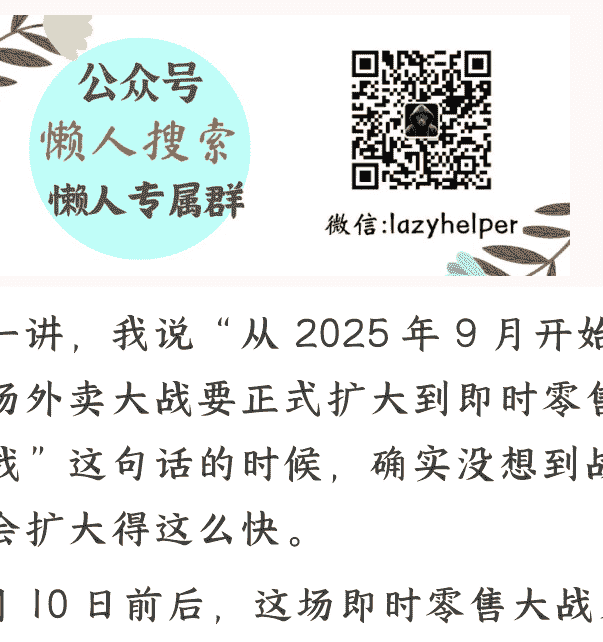

# 闪购三国杀：三家的战术变阵

> **2025 年 9 月 12 日** **《蔡钰 · 商业参考》**`节选
> 整理：公众号懒人搜索，**懒人专属群**独享
> 懒人微信：lazyhelper
> 

## 监管再次约谈

> 监管再次约谈了阿里、京东、美团三家公司，要求他们“不得扰乱市场秩序，不得恶意竞争”。

阿里、京东、美团都对此表示了“高度重视”，并在各自业务中进行了战术调整。

阿里在“8 月 26 日”就做出了反应，将淘宝闪购的“百亿补贴”计划升级，并且让高德地图也加入了闪购的行列。

高德地图说，高扫街榜永不商业化，用真实来支撑榜单的核心生命力。

## 天猫进场

阿里还推出了一项“一店通多端”的政策，意思是说，只要你在淘宝上开了一家“超级体验店”，你的线下门店就可以同步出现在淘宝的“饿了么”上，让顾客可以在淘宝上下单，在楼下门店自取，或者通过淘宝的物流送到家。

你看，阿里让天猫加入了闪购，让高德进入了到店市场，走上了美团的路。

## 高德进场

> 你看，“你美团不是要团结商家、替他们增加到店流量吗？我也能做”。
>
> 这也还没完。高德地图 CEO 郭宁还承诺说，高德扫街榜永不商业化，用真实来支撑榜单的核心生命力。你肯定听懂了，这多少也在暗示对手的评分榜单，有商业运作的痕迹。

就在高德扫街榜发布的同一天——9 月 10 日，美团旗下的大众点评，宣布“重启”品质外卖。首批品质外卖就覆盖全国超过 1400 家的 2025 年“必吃榜”上榜餐厅、近 30 家的 2025 年“黑珍珠”上榜餐厅，以及近 1500 家高星酒店餐厅，从低端到高端一网打尽。

高德地图不是说自己的评分体系有导航数据支撑吗？美团也亮出了自己的数据实力。美团说，自己这一方有超过 3.63 亿条的真实评价，小店的标准评分要≥4 分，而且外卖评分≥4.5 分，才能上榜。

你看，美团也在外卖战场上区分出了阵型：拼好饭继续占领性价比的用户心智；品质外卖则去抢夺高品质的用户心智。

## 美团应对

而相比之下，京东在三家之中却显得相对沉默。

京东躺平了？当然也不是。京东高管也在自家业绩会说了，自家的外卖业务也是要做十年二十年的。

那京东在忙什么呢？它有一个动作非常有意思：不动声色地撬动了外卖领域一个战况不那么激烈的子赛道——家政外卖。

一个可能被他我们忽视了的信息是：

2025 年 618，京东的家政服务成交额突破了 1 亿元。这个业务快速增长的背后，也有京东的刻意用力。比如，它在 618 期间就刻意放大了家政业务的推广力度，2 小时保洁不到 50 块钱，空调清洗每台 63 块钱，洗鞋 13 块钱，都是刷新行业的低价。

高德地图不是也要推出 10 亿元的到店补贴计划吗？京东在 2025 年，也有一笔 10 亿元的资金投入，是用来给它家政业务里的保洁师们提升收益和合作体验的。优化家政产能，希望 2025 年内覆盖 100 个城市。

在需求端，京东家政也做了品类扩展，从普通的保洁、清洗、做饭、收纳，到护士上门打针采血、换药拆线，甚至中医养生，都涵盖了，都是自营的。它还把自己的家政服务整合到了 PLUS 会员体系里，让会员们用 5 个积分兑换 2 小时保洁，3 个积分兑换洗衣洗鞋。

你看，一边是低价，一边是品质，一边是扩展业态和版图，跟 3 月份进入外卖行业的策略一样一样的。

广义上，这当然也算外卖和闪购竞争，只不过送上门的不是商品，而是生活服务。美团说“万物到家”，而京东干脆再推进了一步，把“服务到家”也操作起来了。

你还别说，自营家政业务，还真可能被京东做成优势。因为家政服务低频高价，信任度成了关键变量，往这样的市场输送正规军，正是京东在过往做自营电商、自营配送时攒下的口碑和基因优势。

## 京东应对

> 
> 
>
> 2025 年 9 月 1 日，高德地图、饿了么联合发布了“9 月 9 日”的 2025 扫街榜。
>
> 根据《2025 年高德扫街榜发布战报》显示：
> 5000 万用户的 13 亿次
> 118 万家店铺，5132 万人的 13 亿次
>
> 9 月 10 日，高德地图正式发布 2025 年高德扫街榜。高德地图说，高扫街榜永不商业化，用真实来支撑榜单的核心生命力。
>
> 你肯定知道，在大众点评和饿了么上，很多评价都是刷的。而高德说，它不用用户的浏览记录、订单数据来算分，而是用用户的“足迹”，看用户真实去过多少次，然后结合用户评价，来考量用户们的芝麻信用，来评估他们的打分可信度。
>
> 你肯定听懂了，这多少也在暗示对手的评分榜单，有商业运作的痕迹。

## 总结

这是 2025 即时零售大战进入第二阶段之后，值得我们继续追踪的几个战况：

阿里让天猫加入了闪购，让高德进入了到店市场，走上了美团的路。

为了应对阿里，美团重启了大众点评的品质外卖，跟它的拼好饭业务，形成高中低端的全覆盖。而“品质外卖”，又是京东年初进入外卖市场时的主打卖点。可以说，美团走上了京东的路。

京东呢？避开正面战场，在“家政服务到家”这个赛道上发力，走上了 58 同城的路。

58 同城怎么办？这又是另一个故事了。

这种错位竞争的背后，各家都在为“万物到家”的终极战场卡位。这个战场下次出现整体性的战术变阵，会发生在什么时候呢？是谁先用上了机器人，还是谁又发明了新市场？我们会继续关注。

再见。

最后，安利小懒的付费群：

懒人专属群（[介绍](介绍)）

📖 懒人专属群持续更新中，已持续运营 6 年，整理超 3000 份各类精选付费文章&年费社群干货，全部开放下载。

本资料为付费群内部分享，仅供真实有需要的朋友查阅🤫

懒人专属群更新记录：

[https://lazy2025.top/blog/record2](https://lazy2025.top/blog/record2)

懒人专属群更新记录（需梯子，备用）：

[https://lazybook.fun/blog/record2](https://lazybook.fun/blog/record2)